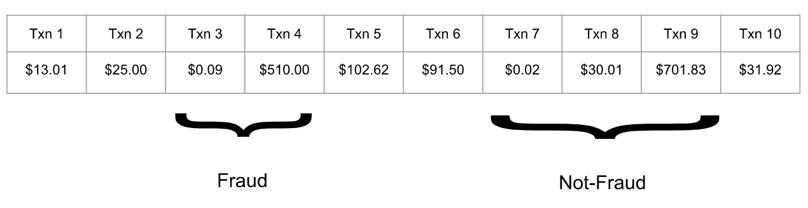
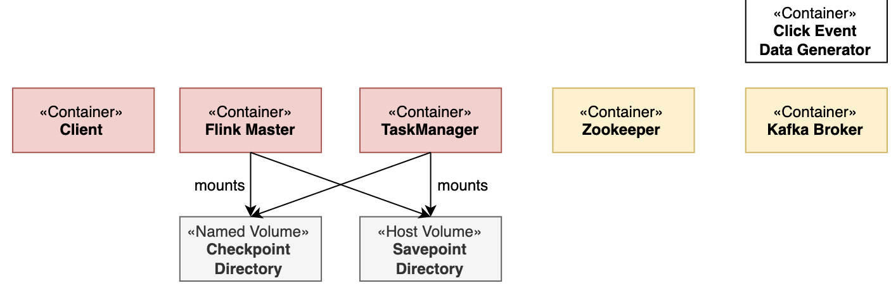

# 本地模式安装
1. [下载](https://flink.apache.org/zh/downloads.html)flink包，是基于Java 11的；
2. > ./bin/start-cluster.sh 启动集群;
3. > ./bin/flink run examples/streaming/WordCount.jar 提交作业;
4. > tail log/flink-*-taskexecutor-*.out 查看日志
5. > ./bin/stop-cluster.sh 停止集群
# 基于DataStream API实现欺诈检测
Apache Flink提供了DataStream API来实现稳定可靠的，有状态的流处理应用，Flink支持对状态与时间的细力度控制，来实现复杂的事件驱动数据处理系统，在当今数字时代，信用卡欺诈行为越来越被重视。罪犯可以通过诈骗或者入侵安全级别较低系统来盗窃信用卡卡号。用盗得的信用卡进行很小额度的例如一美元或者更小额度的消费进行测试。如果测试消费成功，那么他们就会用这个信用卡进行大笔消费，来购买一些他们希望得到的，或者可以倒卖的财物。
## 准备条件
在 IDE 中运行该项目可能会遇到java.langNoClassDefFoundError的异常。这很可能是因为运行所需要的Flink的依赖库没有默认被全部加载到类路径（classpath）里。IntelliJ IDE：前往 运行 > 编辑配置 > 修改选项 > 选中 将带有 “provided” 范围的依赖项添加到类路径。这样的话，运行配置将会包含所有在 IDE 中运行所必须的类。
## 怎样跟着教程练习
一个准备好的Flink Maven Archetype能够快速创建一个包含了必要依赖的Flink程序骨架，基于此，你可以把精力集中在编写业务逻辑上即可。这些已包含的依赖包括flink-streaming-java、flink-walkthrough-common等，他们分别是Flink应用程序的核心依赖项和这个代码练习需要的数据生成器，当然还包括其他本代码练习所依赖的类。
```bash
$ mvn archetype:generate \
    -DarchetypeGroupId=org.apache.flink \
    -DarchetypeArtifactId=flink-walkthrough-datastream-java \
    -DarchetypeVersion=1.15.2 \
    -DgroupId=frauddetection \
    -DartifactId=frauddetection \
    -Dversion=0.1 \
    -Dpackage=spendreport \
    -DinteractiveMode=false
```
你可以根据自己的情况修改groupId、 artifactId和package。通过这三个参数，Maven将会创建一个名为frauddetection的文件夹，包含了所有依赖的整个工程项目将会位于该文件夹下。将工程目录导入到你的开发环境之后，你可以找到 FraudDetectionJob.java（或FraudDetectionJob.scala）代码文件，文件中的代码如下所示。你可以在IDE中直接运行这个文件。 同时，你可以试着在数据流中设置一些断点或者以DEBUG模式来运行程序，体验Flink是如何运行的。
**FraudDetectionJob.java**
```java
package spendreport;

import org.apache.flink.streaming.api.datastream.DataStream;
import org.apache.flink.streaming.api.environment.StreamExecutionEnvironment;
import org.apache.flink.walkthrough.common.sink.AlertSink;
import org.apache.flink.walkthrough.common.entity.Alert;
import org.apache.flink.walkthrough.common.entity.Transaction;
import org.apache.flink.walkthrough.common.source.TransactionSource;

public class FraudDetectionJob {

    public static void main(String[] args) throws Exception {
        StreamExecutionEnvironment env = StreamExecutionEnvironment.getExecutionEnvironment();

        DataStream<Transaction> transactions = env
            .addSource(new TransactionSource())
            .name("transactions");

        DataStream<Alert> alerts = transactions
            .keyBy(Transaction::getAccountId)
            .process(new FraudDetector())
            .name("fraud-detector");

        alerts
            .addSink(new AlertSink())
            .name("send-alerts");

        env.execute("Fraud Detection");
    }
}
```
**FraudDetector.java**
```java
package spendreport;

import org.apache.flink.streaming.api.functions.KeyedProcessFunction;
import org.apache.flink.util.Collector;
import org.apache.flink.walkthrough.common.entity.Alert;
import org.apache.flink.walkthrough.common.entity.Transaction;

public class FraudDetector extends KeyedProcessFunction<Long, Transaction, Alert> {

    private static final long serialVersionUID = 1L;

    private static final double SMALL_AMOUNT = 1.00;
    private static final double LARGE_AMOUNT = 500.00;
    private static final long ONE_MINUTE = 60 * 1000;

    @Override
    public void processElement(
            Transaction transaction,
            Context context,
            Collector<Alert> collector) throws Exception {

        Alert alert = new Alert();
        alert.setId(transaction.getAccountId());

        collector.collect(alert);
    }
}
```
## 代码分析
让我们一步步地来分析一下这两个代码文件。FraudDetectionJob类定义了程序的数据流，而FraudDetector类定义了欺诈交易检测的业务逻辑。下面我们开始讲解整个Job是如何组装到FraudDetectionJob类的main函数中的。
1. 执行环境
   第一行的StreamExecutionEnvironment用于设置你的执行环境。任务执行环境用于定义任务的属性、创建数据源以及最终启动任务的执行。
   ```java
   StreamExecutionEnvironment env = StreamExecutionEnvironment.getExecutionEnvironment();
   ```
2. 创建数据源
   数据源从外部系统例如`Apache Kafka`、`Rabbit MQ`或者`Apache Pulsar`接收数据，然后将数据送到`Flink`程序中。这个代码练习使用的是一个能够无限循环生成信用卡模拟交易数据的数据源。每条交易数据包括了信用卡ID （accountId），交易发生的时间（timestamp） 以及交易的金额（amount）。绑定到数据源上的name属性是为了调试方便，如果发生一些异常，我们能够通过它快速定位问题发生在哪里。
   ```java
   DataStream<Transaction> transactions = env
    .addSource(new TransactionSource())
    .name("transactions");
   ```
3. 对事件分区&欺诈检测
   transactions这个数据流包含了大量的用户交易数据，需要被划分到多个并发上进行欺诈检测处理。由于欺诈行为的发生是基于某一个账户的，所以，必须要要保证同一个账户的所有交易行为数据要被同一个并发的task进行处理。为了保证同一个task处理同一个key的所有数据，你可以使用DataStream#keyBy对流进行分区。process()函数对流绑定了一个操作，这个操作将会对流上的每一个消息调用所定义好的函数。通常，一个操作会紧跟着keyBy被调用，在这个例子中，这个操作是FraudDetector，该操作是在一个keyed context上执行的。
   ```java
   DataStream<Alert> alerts = transactions
    .keyBy(Transaction::getAccountId)
    .process(new FraudDetector())
    .name("fraud-detector");
   ```
4. 输出结果
   sink会将DataStream写出到外部系统，例如Apache Kafka、Cassandra或者AWS Kinesis等。 AlertSink使用INFO的日志级别打印每一个Alert的数据记录，而不是将其写入持久存储，以便你可以方便地查看结果。
   ```java
   alerts.addSink(new AlertSink());
   ```
5. 运行作业
   Flink程序是懒加载的，并且只有在完全搭建好之后，才能够发布到集群上执行。 调用 StreamExecutionEnvironment#execute时给任务传递一个任务名参数，就可以开始运行任务。
   ```java
   env.execute("Fraud Detection");
   ```
5. 欺诈检测器
   欺诈检查类FraudDetector是KeyedProcessFunction接口的一个实现。 他的方法 KeyedProcessFunction#processElement将会在每个交易事件上被调用。这个程序里边会对每笔交易发出警报，有人可能会说这做报过于保守了。
   ```java
   public class FraudDetector extends KeyedProcessFunction<Long, Transaction, Alert> {

    private static final double SMALL_AMOUNT = 1.00;
    private static final double LARGE_AMOUNT = 500.00;
    private static final long ONE_MINUTE = 60 * 1000;

    @Override
    public void processElement(
            Transaction transaction,
            Context context,
            Collector<Alert> collector) throws Exception {

        Alert alert = new Alert();
        alert.setId(transaction.getAccountId());

        collector.collect(alert);
    }
    }
   ```
## 实现一个真正的应用程序
我们先实现第一版报警程序，对于一个账户，如果出现小于$1美元的交易后紧跟着一个大于$500的交易，就输出一个报警信息。假设你的欺诈检测器所处理的交易数据如下:

交易3和交易4应该被标记为欺诈行为，因为交易3是一个$0.09的小额交易，而紧随着的交易4是一个$510的大额交易。另外，交易7、8和交易9就不属于欺诈交易了，因为在交易7这个$0.02的小额交易之后，并没有跟随一个大额交易，而是一个金额适中的交易，这使得交易7到交易9不属于欺诈行为。欺诈检测器需要在多个交易事件之间记住一些信息。仅当一个大额的交易紧随一个小额交易的情况发生时，这个大额交易才被认为是欺诈交易。在多个事件之间存储信息就需要使用到状态，这也是我们选择使用 KeyedProcessFunction的原因。它能够同时提供对状态和时间的细粒度操作，这使得我们能够在接下来的代码练习中实现更复杂的算法。
最直接的实现方式是使用一个boolean型的标记状态来表示是否刚处理过一个小额交易。当处理到该账户的一个大额交易时，你只需要检查这个标记状态来确认上一个交易是是否小额交易即可，如下所示:
```java
public class FraudDetector extends KeyedProcessFunction<Long, Transaction, Alert> {

    private static final long serialVersionUID = 1L;

    private transient ValueState<Boolean> flagState;

    @Override
    public void open(Configuration parameters) {
        ValueStateDescriptor<Boolean> flagDescriptor = new ValueStateDescriptor<>(
                "flag",
                Types.BOOLEAN);
        flagState = getRuntimeContext().getState(flagDescriptor);
    }
}
```
然而，仅使用一个标记作为`FraudDetector`的类成员来记录账户的上一个交易状态是不准确的。Flink会在同一个 FraudDetector的并发实例中处理多个账户的交易数据，假设，当账户A和账户B的数据被分发的同一个并发实例上处理时，账户A的小额交易行为可能会将标记状态设置为真，随后账户B的大额交易可能会被误判为欺诈交易。当然，我们可以使用如Map这样的数据结构来保存每一个账户的状态，但是常规的类成员变量是无法做到容错处理的，当任务失败重启后，之前的状态信息将会丢失。 这样的话，如果程序曾出现过失败重启的情况，将会漏掉一些欺诈报警。为了应对这个问题，Flink提供了一套支持容错状态的原语，这些原语几乎与常规成员变量一样易于使用。Flink中最基础的状态类型是ValueState，这是一种能够为被其封装的变量添加容错能力的类型。ValueState是一种keyed state，也就是说它只能被用于keyed context提供的operator中，即所有能够紧随DataStream#keyBy之后被调用的operator。 一个operator中的keyed state的作用域默认是属于它所属的key的。这个例子中，key就是当前正在处理的交易行为所属的信用卡账户（key传入keyBy()函数调用），而FraudDetector维护了每个帐户的标记状态。 ValueState需要使用ValueStateDescriptor来创建，ValueStateDescriptor包含了Flink如何管理变量的一些元数据信息。状态在使用之前需要先被注册。状态需要使用open()函数来注册状态。
ValueState是一个包装类，类似于Java标准库里边的AtomicReference和AtomicLong。它提供了三个用于交互的方法。update用于更新状态，value用于获取状态值，还有clear用于清空状态。如果一个key还没有状态，例如当程序刚启动或者调用过ValueState#clear方法时，ValueState#value将会返回null。如果需要更新状态，需要调用ValueState#update方法，直接更改ValueState#value的返回值可能不会被系统识别。容错处理将在Flink后台自动管理，你可以像与常规变量那样与状态变量进行交互。
```java
@Override
public void processElement(
        Transaction transaction,
        Context context,
        Collector<Alert> collector) throws Exception {

    // Get the current state for the current key
    Boolean lastTransactionWasSmall = flagState.value();

    // Check if the flag is set
    if (lastTransactionWasSmall != null) {
        if (transaction.getAmount() > LARGE_AMOUNT) {
            // Output an alert downstream
            Alert alert = new Alert();
            alert.setId(transaction.getAccountId());

            collector.collect(alert);
        }

        // Clean up our state
        flagState.clear();
    }

    if (transaction.getAmount() < SMALL_AMOUNT) {
        // Set the flag to true
        flagState.update(true);
    }
}
```
对于每笔交易，欺诈检测器都会检查该帐户的标记状态。请记住，ValueState的作用域始终限于当前的key，即信用卡帐户。如果标记状态不为空，则该帐户的上一笔交易是小额的，因此，如果当前这笔交易的金额很大，那么检测程序将输出报警信息。在检查之后，不论是什么状态，都需要被清空。不管是当前交易触发了欺诈报警而造成模式的结束，还是当前交易没有触发报警而造成模式的中断，都需要重新开始新的模式检测。最后，检查当前交易的金额是否属于小额交易。 如果是，那么需要设置标记状态，以便可以在下一个事件中对其进行检查。注意，ValueState<Boolean>实际上有3种状态：unset (null)，true和false,ValueState是允许空值的。我们的程序只使用了unset (null)和true两种来判断标记状态被设置了与否。
## 欺诈检测器 v2：状态 + 时间
骗子们在小额交易后不会等很久就进行大额消费，这样可以降低小额测试交易被发现的几率。比如，假设你为欺诈检测器设置了一分钟的超时，对于上边的例子，交易3和交易4只有间隔在一分钟之内才被认为是欺诈交易。Flink中的KeyedProcessFunction允许您设置计时器，该计时器在将来的某个时间点执行回调函数。让我们看看如何修改程序以符合我们的新要求：
- 当标记状态被设置为true时，设置一个在当前时间一分钟后触发的定时器;
- 当定时器被触发时，重置标记状态;
- 当标记状态被重置时，删除定时器;
要删除一个定时器，你需要记录这个定时器的触发时间，这同样需要状态来实现，所以你需要在标记状态后也创建一个记录定时器时间的状态。
```java
private transient ValueState<Boolean> flagState;
private transient ValueState<Long> timerState;

@Override
public void open(Configuration parameters) {
    ValueStateDescriptor<Boolean> flagDescriptor = new ValueStateDescriptor<>(
            "flag",
            Types.BOOLEAN);
    flagState = getRuntimeContext().getState(flagDescriptor);

    ValueStateDescriptor<Long> timerDescriptor = new ValueStateDescriptor<>(
            "timer-state",
            Types.LONG);
    timerState = getRuntimeContext().getState(timerDescriptor);
}
```
`KeyedProcessFunction#processElement`需要使用提供了定时器服务的`Context`来调用。定时器服务可以用于查询当前时间、注册定时器和删除定时器。使用它，你可以在标记状态被设置时，也设置一个当前时间一分钟后触发的定时器，同时，将触发时间保存到timerState状态中。
```java
if (transaction.getAmount() < SMALL_AMOUNT) {
    // set the flag to true
    flagState.update(true);

    // set the timer and timer state
    long timer = context.timerService().currentProcessingTime() + ONE_MINUTE;
    context.timerService().registerProcessingTimeTimer(timer);
    timerState.update(timer);
}
```
处理时间是本地时钟时间，这是由运行任务的服务器的系统时间来决定的。当定时器触发时，将会调用 `KeyedProcessFunction#onTimer`方法。 通过重写这个方法来实现一个你自己的重置状态的回调逻辑。
```java
@Override
public void onTimer(long timestamp, OnTimerContext ctx, Collector<Alert> out) {
    // remove flag after 1 minute
    timerState.clear();
    flagState.clear();
}
```
最后，如果要取消定时器，你需要删除已经注册的定时器，并同时清空保存定时器的状态。 你可以把这些逻辑封装到一个助手函数中，而不是直接调用`flagState.clear()`。
```java
private void cleanUp(Context ctx) throws Exception {
    // delete timer
    Long timer = timerState.value();
    ctx.timerService().deleteProcessingTimeTimer(timer);

    // clean up all state
    timerState.clear();
    flagState.clear();
}
```
## 完整的程序如下
```java
package spendreport;

import org.apache.flink.api.common.state.ValueState;
import org.apache.flink.api.common.state.ValueStateDescriptor;
import org.apache.flink.api.common.typeinfo.Types;
import org.apache.flink.configuration.Configuration;
import org.apache.flink.streaming.api.functions.KeyedProcessFunction;
import org.apache.flink.util.Collector;
import org.apache.flink.walkthrough.common.entity.Alert;
import org.apache.flink.walkthrough.common.entity.Transaction;

public class FraudDetector extends KeyedProcessFunction<Long, Transaction, Alert> {

    private static final long serialVersionUID = 1L;

    private static final double SMALL_AMOUNT = 1.00;
    private static final double LARGE_AMOUNT = 500.00;
    private static final long ONE_MINUTE = 60 * 1000;

    private transient ValueState<Boolean> flagState;
    private transient ValueState<Long> timerState;

    @Override
    public void open(Configuration parameters) {
        ValueStateDescriptor<Boolean> flagDescriptor = new ValueStateDescriptor<>(
                "flag",
                Types.BOOLEAN);
        flagState = getRuntimeContext().getState(flagDescriptor);

        ValueStateDescriptor<Long> timerDescriptor = new ValueStateDescriptor<>(
                "timer-state",
                Types.LONG);
        timerState = getRuntimeContext().getState(timerDescriptor);
    }

    @Override
    public void processElement(
            Transaction transaction,
            Context context,
            Collector<Alert> collector) throws Exception {

        // Get the current state for the current key
        Boolean lastTransactionWasSmall = flagState.value();

        // Check if the flag is set
        if (lastTransactionWasSmall != null) {
            if (transaction.getAmount() > LARGE_AMOUNT) {
                //Output an alert downstream
                Alert alert = new Alert();
                alert.setId(transaction.getAccountId());

                collector.collect(alert);
            }
            // Clean up our state
            cleanUp(context);
        }

        if (transaction.getAmount() < SMALL_AMOUNT) {
            // set the flag to true
            flagState.update(true);

            long timer = context.timerService().currentProcessingTime() + ONE_MINUTE;
            context.timerService().registerProcessingTimeTimer(timer);

            timerState.update(timer);
        }
    }

    @Override
    public void onTimer(long timestamp, OnTimerContext ctx, Collector<Alert> out) {
        // remove flag after 1 minute
        timerState.clear();
        flagState.clear();
    }

    private void cleanUp(Context ctx) throws Exception {
        // delete timer
        Long timer = timerState.value();
        ctx.timerService().deleteProcessingTimeTimer(timer);

        // clean up all state
        timerState.clear();
        flagState.clear();
    }
}
```
# 基于TableAPI实现实时报表
Apache Flink提供了Table API作为统一的关系API，主要用于批/流处理，比如，查询在无界实时流与有界的批量数据集合上都以相同的语义执行并产生相同的结果，Table API通常用于简化数据分析、数据管道或者ETL应用的开发。在本教程中，您将学习如何构建实时仪表板以按账户跟踪金融交易。 该管道将从Kafka读取数据并将结果写入通过Grafana可视化的MySQL。
## 准备条件
## 接下来干什么
所需的配置文件在[flink-playgrounds](https://github.com/apache/flink-playgrounds)存储库中可用。下载后，在IDE中打开项目flink-playground/table-walkthrough并导航到 SpendReport 文件。
```java
EnvironmentSettings settings = EnvironmentSettings.inStreamingMode();
TableEnvironment tEnv = TableEnvironment.create(settings);

tEnv.executeSql("CREATE TABLE transactions (\n" +
    "    account_id  BIGINT,\n" +
    "    amount      BIGINT,\n" +
    "    transaction_time TIMESTAMP(3),\n" +
    "    WATERMARK FOR transaction_time AS transaction_time - INTERVAL '5' SECOND\n" +
    ") WITH (\n" +
    "    'connector' = 'kafka',\n" +
    "    'topic'     = 'transactions',\n" +
    "    'properties.bootstrap.servers' = 'kafka:9092',\n" +
    "    'format'    = 'csv'\n" +
    ")");

tEnv.executeSql("CREATE TABLE spend_report (\n" +
    "    account_id BIGINT,\n" +
    "    log_ts     TIMESTAMP(3),\n" +
    "    amount     BIGINT\n," +
    "    PRIMARY KEY (account_id, log_ts) NOT ENFORCED" +
    ") WITH (\n" +
    "   'connector'  = 'jdbc',\n" +
    "   'url'        = 'jdbc:mysql://mysql:3306/sql-demo',\n" +
    "   'table-name' = 'spend_report',\n" +
    "   'driver'     = 'com.mysql.jdbc.Driver',\n" +
    "   'username'   = 'sql-demo',\n" +
    "   'password'   = 'demo-sql'\n" +
    ")");

Table transactions = tEnv.from("transactions");
report(transactions).executeInsert("spend_report");
```
## 代码分析
1. 执行环境
   前面2行设置`TableEnvironment`，通过table environment你可以设置Job的属性、指定你的应用类型或者创建数据源，案例代码创建了一个标准的table environment环境.
   ```java
   EnvironmentSettings settings = EnvironmentSettings.inStreamingMode();
   TableEnvironment tEnv = TableEnvironment.create(settings);
   ```
2. 注册表
   接下来，在当前catalog中注册表，你可以使用这些表连接到外部系统以读取和写入批处理或者流数据。表源提供对存储在外部系统（例如数据库、键值存储、消息队列或文件系统）中的数据的访问。表汇将表发送到外部存储系统。根据源和汇的类型，它们支持不同的格式，例如CSV、JSON、Avro或Parquet。
   ```java
   tEnv.executeSql("CREATE TABLE transactions (\n" +
     "    account_id  BIGINT,\n" +
     "    amount      BIGINT,\n" +
     "    transaction_time TIMESTAMP(3),\n" +
     "    WATERMARK FOR transaction_time AS transaction_time - INTERVAL '5' SECOND\n" +
     ") WITH (\n" +
     "    'connector' = 'kafka',\n" +
     "    'topic'     = 'transactions',\n" +
     "    'properties.bootstrap.servers' = 'kafka:9092',\n" +
     "    'format'    = 'csv'\n" +
     ")");
   ```
   注册了两个表；交易输入表和支出报告输出表。交易(transactions)表让我们可以读取信用卡交易，其中包含账户ID (account_id)、时间戳(transaction_time)和美元金额(amount)。该表是Kafka主题的逻辑视图，称为包含CSV数据的事务表。
   ```java
   tEnv.executeSql("CREATE TABLE spend_report (\n" +
    "    account_id BIGINT,\n" +
    "    log_ts     TIMESTAMP(3),\n" +
    "    amount     BIGINT\n," +
    "    PRIMARY KEY (account_id, log_ts) NOT ENFORCED" +
    ") WITH (\n" +
    "    'connector'  = 'jdbc',\n" +
    "    'url'        = 'jdbc:mysql://mysql:3306/sql-demo',\n" +
    "    'table-name' = 'spend_report',\n" +
    "    'driver'     = 'com.mysql.jdbc.Driver',\n" +
    "    'username'   = 'sql-demo',\n" +
    "    'password'   = 'demo-sql'\n" +
    ")");
   ```
   第二个表，spend_report，存储聚合的最终结果。 它的底层存储是MySql数据库中的一个表。
3. 查询
   配置好环境并注册表后，您就可以构建您的第一个应用程序了。在TableEnvironment中，您可以从输入表中读取其行，然后使用executeInsert将这些结果写入输出表。报告功能是您实现业务逻辑的地方。它目前未实现。
## 测试
该项目包含一个辅助测试类 SpendReportTest，用于验证报告的逻辑。 它以批处理模式创建表环境。
```java
EnvironmentSettings settings = EnvironmentSettings.inBatchMode();
TableEnvironment tEnv = TableEnvironment.create(settings); 
```
Flink的独特属性之一是它提供了跨批处理和流的一致语义。这意味着您可以在静态数据集上以批处理模式开发和测试应用程序，并作为流式应用程序部署到生产环境中。
## 一次尝试
现在有了Job设置的骨架，您就可以添加一些业务逻辑了。目标是构建一个报告，显示每个帐户在一天中的每个小时内的总支出。 这意味着时间戳列需要从毫秒到小时粒度四舍五入。Flink 支持使用纯SQL或使用Table API开发关系应用程序。Table API是受SQL启发的流式DSL，可以用Python、Java或Scala编写，并支持强大的IDE集成。 就像SQL查询一样，Table程序可以选择所需的字段并按您的键分组。这些功能，以及通过floor和sum等内置函数，您可以编写此报告。
```java
public static Table report(Table transactions) {
    return transactions.select(
            $("account_id"),
            $("transaction_time").floor(TimeIntervalUnit.HOUR).as("log_ts"),
            $("amount"))
        .groupBy($("account_id"), $("log_ts"))
        .select(
            $("account_id"),
            $("log_ts"),
            $("amount").sum().as("amount"));
}
```
## User Defined Functions
Flink 包含的内置函数数量有限，有时您需要使用用户定义的函数对其进行扩展。如果floor没有预定义，您可以自己实现它。
```java
import java.time.LocalDateTime;
import java.time.temporal.ChronoUnit;

import org.apache.flink.table.annotation.DataTypeHint;
import org.apache.flink.table.functions.ScalarFunction;

public class MyFloor extends ScalarFunction {

    public @DataTypeHint("TIMESTAMP(3)") LocalDateTime eval(
        @DataTypeHint("TIMESTAMP(3)") LocalDateTime timestamp) {

        return timestamp.truncatedTo(ChronoUnit.HOURS);
    }
}
```
然后在你的应用中使用它
```java
public static Table report(Table transactions) {
    return transactions.select(
            $("account_id"),
            call(MyFloor.class, $("transaction_time")).as("log_ts"),
            $("amount"))
        .groupBy($("account_id"), $("log_ts"))
        .select(
            $("account_id"),
            $("log_ts"),
            $("amount").sum().as("amount"));
}
```
此查询使用事务表中的所有记录，计算报告，并以高效、可扩展的方式输出结果。使用此实现运行测试将通过。
## Adding Windows
根据时间对数据进行分组是数据处理中的典型操作，尤其是在处理无限流时。基于时间的分组称为窗口，Flink提供灵活的窗口语义。最基本的窗口类型称为Tumble窗口，它具有固定大小并且其桶不重叠。
```java
public static Table report(Table transactions) {
    return transactions
        .window(Tumble.over(lit(1).hour()).on($("transaction_time")).as("log_ts"))
        .groupBy($("account_id"), $("log_ts"))
        .select(
            $("account_id"),
            $("log_ts").start().as("log_ts"),
            $("amount").sum().as("amount"));
}
```
这将您的应用程序定义为使用基于时间戳列的一小时翻转窗口。因此，将时间戳为2019-06-01 01:23:47的行放入 2019-06-01 01:00:00窗口中。基于时间的聚合是独一无二的，因为与其他属性相反，时间通常在连续流应用程序中向前移动。 与floor和您的UDF不同，窗口函数是内在函数，它允许运行时应用额外的优化。在批处理上下文中，windows提供了一个方便的 API，用于按时间戳属性对记录进行分组。使用此实现运行测试也将通过。
## Once More, With Streaming!
就是这样，一个功能齐全、有状态的分布式流应用程序创建好了！该查询不断地使用来自Kafka的交易流，计算每小时的支出，并在它们准备好后立即发出结果。由于输入是无界的，因此查询会一直运行，直到手动停止。而且由于Job使用基于时间窗口的聚合，Flink可以在框架知道没有更多记录到达特定窗口时执行特定的优化，例如状态清理。表操场是完全容器化的，并且可以作为流应用程序在本地运行。该环境包含一个Kafka主题、一个连续数据生成器、MySql和Grafana。
从 table-walkthrough 文件夹中启动 docker-compose 脚本。
```shell
$ docker-compose build
$ docker-compose up -d
```
# Flink操作场景
Apache Flink可以以多种方式在不同的环境中部署，抛开这种多样性而言，Flink集群的基本构建方式和操作原则仍然是相同的。在这篇文章里，你将会学习如何管理和运行Flink任务，了解如何部署和监控应用程序、Flink如何从失败作业中进行恢复，同时你还会学习如何执行一些日常操作任务，如升级和扩容。
## 场景说明
这篇文章中的所有操作都是基于如下两个集群进行的: Flink Session Cluster以及一个Kafka集群，我们会在下文带领大家一起搭建这两个集群。一个Flink集群总是包含一个JobManager以及一个或多个Flink TaskManager。JobManager负责处理 Job提交、 Job监控以及资源管理。Flink TaskManager运行worker进程， 负责实际任务Tasks的执行，而这些任务共同组成了一个Flink Job。在这篇文章中，我们会先运行一个TaskManager，接下来会扩容到多个TaskManager。另外，这里我们会专门使用一个client容器来提交Flink Job，后续还会使用该容器执行一些操作任务。需要注意的是，Flink集群的运行并不需要依赖client容器，我们这里引入只是为了使用方便。这里的Kafka集群由一个Zookeeper服务端和一个Kafka Broker组成。

一开始，我们会往JobManager提交一个名为Flink事件计数的Job，此外，我们还创建了两个Kafka Topic：input 和 output。该Job负责从input topic消费点击事件ClickEvent，每个点击事件都包含一个timestamp和一个page属性。这些事件将按照page属性进行分组，然后按照每15s窗口windows进行统计，最终结果输出到output topic中。总共有6种不同的page属性，针对特定page，我们会按照每15s产生1000个点击事件的速率生成数据。因此，针对特定 age，该Flink job应该能在每个窗口中输出1000个该page的点击数据。
## 环境搭建
环境搭建只需要几步就可以完成，我们将会带你过一遍必要的操作命令， 并说明如何验证我们正在操作的一切都是运行正常的。
你需要在自己的主机上提前安装好docker(1.12+)和docker-compose(2.1+)。我们所使用的配置文件位于 flink-playgrounds仓库中， 首先检出该仓库并构建docker镜像:
```shell
git clone https://github.com/apache/flink-playgrounds.git
cd flink-playgrounds/operations-playground
docker-compose build
```
接下来在开始运行之前先在Docker主机上创建检查点和保存点目录（这些卷由 jobmanager 和 taskmanager 挂载，如 docker-compose.yaml 中所指定的）:
```shell
mkdir -p /tmp/flink-checkpoints-directory
mkdir -p /tmp/flink-savepoints-directory
```
然后启动环境：
```bash
docker-compose up -d
```
接下来你可以执行如下命令来查看正在运行中的 Docker 容器：
```bash
docker-compose ps
```
## 环境讲解
在这个搭建好的环境中你可以尝试和验证很多事情，在下面的两个部分中我们将向你展示如何与Flink集群进行交互以及演示并讲解Flink的一些核心特性。
1. Flink WebUI 界面
   观察Flink集群首先想到的就是Flink WebUI界面：打开浏览器并访问http://localhost:8081，如果一切正常，你将会在界面上看到一个TaskManager和一个处于“RUNNING”状态的名为Click Event Count的Job。Flink WebUI界面包含许多关于Flink集群以及运行在其上的Jobs的有用信息，比如：JobGraph、Metrics、Checkpointing Statistics、TaskManager Status等等。
2. 日志
   JobManager日志可以通过docker-compose命令进行查看`docker-compose logs -f jobmanager`JobManager刚启动完成之时，你会看到很多关于`checkpoint completion`(检查点完成)的日志。TaskManager日志也可以通过同样的方式进行查看`docker-compose logs -f taskmanager`TaskManager刚启动完成之时，你同样会看到很多关于 `checkpoint completion`(检查点完成)的日志。
3. Flink CLI
   Flink CLI相关命令可以在client容器内进行使用。比如，想查看Flink CLI的help命令，可以通过如下方式进行查看:
   ```bash
   docker-compose run --no-deps client flink --help
   ```
4. Flink REST API
   Flink REST API可以通过本机的localhost:8081进行访问，也可以在client容器中通过jobmanager:8081进行访问。 比如，通过如下命令可以获取所有正在运行中的Job:`curl localhost:8081/jobs`
## 核心特性探索 
获取所有运行中的Job，`docker-compose run --no-deps client flink list`，一旦Job提交，flink会默认为其生成一个JobID，后续所有对该Job的操作，都需要带上JobID。在Job(部分)失败的情况下，Flink对事件处理依然能够提供精确一次的保障，在本节中你将会观察到并能够在某种程度上验证这种行为:
1. Step1: 观察输出，如前文所述，事件以特定速率生成，刚好使得每个统计窗口都包含确切的1000条记录。因此，你可以实时查看output topic的输出，确定失败恢复后所有的窗口依然输出正确的统计数字，以此来验证Flink在TaskManager失败时能够成功恢复，而且不丢失数据、不产生数据重复;
2. Step2: 模拟失败，为了模拟部分失败故障，你可以kill掉一个TaskManager，这种失败行为在生产环境中就相当于 TaskManager进程挂掉、TaskManager机器宕机或者从框架或用户代码中抛出的一个临时异常（例如，由于外部资源暂时不可用）而导致的失败;
3. Step3: 失败恢复，一旦TaskManager重启成功，它将会重新连接到JobManager。`docker-compose up -d taskmanager`当 TaskManager注册成功后，JobManager就会将处于SCHEDULED状态的所有任务调度到该TaskManager的可用TaskSlots中运行，此时所有的任务将会从失败前最近一次成功的checkpoint进行恢复, 一旦恢复成功，它们的状态将转变为RUNNING。接下来该Job将快速处理 Kafka input事件的全部积压（在Job中断期间累积的数据），并以更快的速度(>24条记录/分钟)产生输出，直到它追上kafka的延迟为止。此时观察output topic输出，你会看到在每一个时间窗口中都有按page进行分组的记录，而且计数刚好是1000。由于我们使用的是 FlinkKafkaProducer 至少一次模式，因此你可能会看到一些记录重复输出多次。
## Job升级与扩容
升级Flink作业一般都需要两步: 第一，使用Savepoint优雅地停止Flink Job。Savepoint是整个应用程序状态的一次快照（类似于 checkpoint）,该快照是在一个明确定义的、全局一致的时间点生成的。第二，从Savepoint恢复启动待升级的Flink Job。在此，升级 包含如下几种含义:
- 配置升级（比如Job并行度修改）
- Job拓扑升级（比如添加或者删除算子）
- Job的用户自定义函数升级
在开始升级之前，你可能需要实时查看Output topic输出，以便观察在升级过程中没有数据丢失或损坏。
```shell
docker-compose exec kafka kafka-console-consumer.sh --bootstrap-server localhost:9092 --topic output
```
- Step 1: 停止Job, 要优雅停止Job，需要使用JobID通过CLI或REST API调用`stop`命令。JobID可以通过获取所有运行中的Job接口或Flink WebUI界面获取，拿到JobID后就可以继续停止作业了:
  ```bash
  docker-compose run --no-deps client flink stop <job-id>
  ```
  Savepoint已保存在`state.savepoints.dir`指定的路径中，该配置在`flink-conf.yaml`中定义，`flink-conf.yaml`挂载在本机的`/tmp/flink-savepoints-directory/`目录下。在下一步操作中我们会用到这个Savepoint路径，如果我们是通过REST API操作的， 那么Savepoint路径会随着响应结果一起返回，我们可以直接查看文件系统来确认Savepoint保存情况；
- Step 2a: 重启Job (不作任何变更) ，现在你可以从这个Savepoint重新启动待升级的Job，为了简单起见，不对该 Job 作任何变更就直接重启。
  ```bash
  docker-compose run --no-deps client flink run -s <savepoint-path> -d /opt/ClickCountJob.jar --bootstrap.servers kafka:9092 --checkpointing --event-time
  ```
  一旦该Job再次处于RUNNING状态，你将从output Topic中看到数据在快速输出，因为刚启动的Job正在处理停止期间积压的大量数据。另外，你还会看到在升级期间 没有产生任何数据丢失：所有窗口都在输出 1000;
- Step 2b: 重启Job (修改并行度)，在从Savepoint重启Job之前，你还可以通过修改并行度来达到扩容Job的目的。
  ```bash
  docker-compose run --no-deps client flink run -p 3 -s <savepoint-path> -d /opt/ClickCountJob.jar --bootstrap.servers kafka:9092 --checkpointing --event-time
  ```
  现在Job已重新提交，但由于我们提高了并行度所以导致TaskSlots不够用（1个TaskSlot可用，总共需要3个），最终Job会重启失败。通过如下命令:`docker-compose scale taskmanager=2`你可以向Flink集群添加第二个TaskManager（为Flink集群提供2个TaskSlots资源），它会自动向 JobManager注册，TaskManager注册完成后，Job会再次处于`RUNNING`状态。一旦Job再次运行起来，从output Topic的输出中你会看到在扩容期间数据依然没有丢失:所有窗口的计数都正好是1000.
## 查询Job指标 
可以通过JobManager提供的REST API来获取系统和用户[指标](https://nightlies.apache.org/flink/flink-docs-release-1.15/zh/docs/ops/metrics/)，具体请求方式取决于我们想查询哪类指标，Job相关的指标分类可通过jobs/<job-id>/metrics获得，而要想查询某类指标的具体值则可以在请求地址后跟上get参数。
```bash
curl "localhost:8081/jobs/<jod-id>/metrics?get=lastCheckpointSize"
```
预期响应:
```json
[
  {
    "id": "lastCheckpointSize",
    "value": "9378"
  }
]
```

REST API不仅可以用于查询指标，还可以用于获取正在运行中的Job详细信息。
```bash
curl localhost:8081/jobs/<jod-id>
```
预期响应:
```json
{
  "jid": "<job-id>",
  "name": "Click Event Count",
  "isStoppable": false,
  "state": "RUNNING",
  "start-time": 1564467066026,
  "end-time": -1,
  "duration": 374793,
  "now": 1564467440819,
  "timestamps": {
    "CREATED": 1564467066026,
    "FINISHED": 0,
    "SUSPENDED": 0,
    "FAILING": 0,
    "CANCELLING": 0,
    "CANCELED": 0,
    "RECONCILING": 0,
    "RUNNING": 1564467066126,
    "FAILED": 0,
    "RESTARTING": 0
  },
  "vertices": [
    {
      "id": "<vertex-id>",
      "name": "ClickEvent Source",
      "parallelism": 2,
      "status": "RUNNING",
      "start-time": 1564467066423,
      "end-time": -1,
      "duration": 374396,
      "tasks": {
        "CREATED": 0,
        "FINISHED": 0,
        "DEPLOYING": 0,
        "RUNNING": 2,
        "CANCELING": 0,
        "FAILED": 0,
        "CANCELED": 0,
        "RECONCILING": 0,
        "SCHEDULED": 0
      },
      "metrics": {
        "read-bytes": 0,
        "read-bytes-complete": true,
        "write-bytes": 5033461,
        "write-bytes-complete": true,
        "read-records": 0,
        "read-records-complete": true,
        "write-records": 166351,
        "write-records-complete": true
      }
    },
    {
      "id": "<vertex-id>",
      "name": "ClickEvent Counter",
      "parallelism": 2,
      "status": "RUNNING",
      "start-time": 1564467066469,
      "end-time": -1,
      "duration": 374350,
      "tasks": {
        "CREATED": 0,
        "FINISHED": 0,
        "DEPLOYING": 0,
        "RUNNING": 2,
        "CANCELING": 0,
        "FAILED": 0,
        "CANCELED": 0,
        "RECONCILING": 0,
        "SCHEDULED": 0
      },
      "metrics": {
        "read-bytes": 5085332,
        "read-bytes-complete": true,
        "write-bytes": 316,
        "write-bytes-complete": true,
        "read-records": 166305,
        "read-records-complete": true,
        "write-records": 6,
        "write-records-complete": true
      }
    },
    {
      "id": "<vertex-id>",
      "name": "ClickEventStatistics Sink",
      "parallelism": 2,
      "status": "RUNNING",
      "start-time": 1564467066476,
      "end-time": -1,
      "duration": 374343,
      "tasks": {
        "CREATED": 0,
        "FINISHED": 0,
        "DEPLOYING": 0,
        "RUNNING": 2,
        "CANCELING": 0,
        "FAILED": 0,
        "CANCELED": 0,
        "RECONCILING": 0,
        "SCHEDULED": 0
      },
      "metrics": {
        "read-bytes": 20668,
        "read-bytes-complete": true,
        "write-bytes": 0,
        "write-bytes-complete": true,
        "read-records": 6,
        "read-records-complete": true,
        "write-records": 0,
        "write-records-complete": true
      }
    }
  ],
  "status-counts": {
    "CREATED": 0,
    "FINISHED": 0,
    "DEPLOYING": 0,
    "RUNNING": 4,
    "CANCELING": 0,
    "FAILED": 0,
    "CANCELED": 0,
    "RECONCILING": 0,
    "SCHEDULED": 0
  },
  "plan": {
    "jid": "<job-id>",
    "name": "Click Event Count",
    "type": "STREAMING",
    "nodes": [
      {
        "id": "<vertex-id>",
        "parallelism": 2,
        "operator": "",
        "operator_strategy": "",
        "description": "ClickEventStatistics Sink",
        "inputs": [
          {
            "num": 0,
            "id": "<vertex-id>",
            "ship_strategy": "FORWARD",
            "exchange": "pipelined_bounded"
          }
        ],
        "optimizer_properties": {}
      },
      {
        "id": "<vertex-id>",
        "parallelism": 2,
        "operator": "",
        "operator_strategy": "",
        "description": "ClickEvent Counter",
        "inputs": [
          {
            "num": 0,
            "id": "<vertex-id>",
            "ship_strategy": "HASH",
            "exchange": "pipelined_bounded"
          }
        ],
        "optimizer_properties": {}
      },
      {
        "id": "<vertex-id>",
        "parallelism": 2,
        "operator": "",
        "operator_strategy": "",
        "description": "ClickEvent Source",
        "optimizer_properties": {}
      }
    ]
  }
}
```
## 延伸拓展
你可能已经注意到了，Click Event Count这个Job在启动时总是会带上`--checkpointing`和`--event-time`两个参数，如果我们去除这两个参数，那么 Job的行为也会随之改变。
- --checkpointing参数开启了checkpoint配置，checkpoint是Flink容错机制的重要保证。如果你没有开启checkpoint，那么在Job失败与恢复这一节中，你将会看到数据丢失现象发生。
- --event-time参数开启了Job的事件时间机制，该机制会使用ClickEvent自带的时间戳进行统计。如果不指定该参数，Flink将结合当前机器时间使用事件处理时间进行统计。如此一来，每个窗口计数将不再是准确的1000了。
- Click Event Count这个Job还有另外一个选项，该选项默认是关闭的，你可以在client容器的docker-compose.yaml文件中添加该选项从而观察该Job在反压下的表现，该选项描述如下：--backpressure将一个额外算子添加到Job中，该算子会在偶数分钟内产生严重的反压（比如：10:12 期间，而 10:13 期间不会）。这种现象可以通过多种网络指标观察到，比如：outputQueueLength 和 outPoolUsage 指标，通过 WebUI 上的反压监控也可以观察到。


