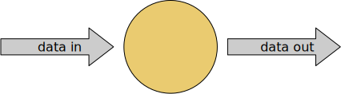
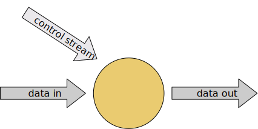

# 概览
## 流处理
在自然环境中，数据的产生原本就是流式的，无论是来自Web服务器的事件数据，证券交易所的交易数据，还是来自工厂车间机器上的传感器数据，其数据都是流式的。当分析数据时，数据有2种模型: 有界流与无界流，选择不同的模型，程序的执行和处理方式也都会不同。

- 批处理，有界数据流处理的范例，在这种模式下，可以选择在计算结果输出之前输入整个数据集，也就意味着可以对整个数据集的数据进行排序、统计或汇总计算后再输出结果;
- 流处理，无界数据流，数据输入永远不会结束，程序必须持续不断的对到达的数据进行处理.
Flink应用程序由用户自定义算子转换而来的流式dataflows组成，这些dataflows形成了有向图，以一个或者多个source开始，以一个或者多个sink结束。

通常，程序代码中的transformation和dataflow中的算子(operator)之间时一一对应的，但也会出现包含多个算子的情况。Flink应用程序可以消费来自消息队列或分布式日志这类流式数据源(Apache Kafka/Kinesis)的实时数据，也可以从各种的数据源中消费有界的历史数据，生成的结果流也可以发送到各种数据汇中。

Flink程序本质上是分布式并行程序。在程序执行期间，一个流有一个或者多个**流分区**(stream partition)，每个算子有一个或多个算子子任务(operator subtask)，每个子任务彼此独立，并在不同的线程中运行或者在不同的计算机或容器中运行。算子子任务数就是其对应算子的并行度，不同算子可能有不同的并行度。

Flink算子之间可以通过一对一（直传）模式或重新分发模式传输数据:
- 一对一模式(例如上图中的Source和map()算子之间)可以保留元素的分区与顺序信息，这意味着map()算子的subtask[1]输入的数据及顺序与source算子的subtask[1]输出的数据与顺序完全相同，即同一分区的数据只会进入到下游算子的同一分区;
- 重新分发模式(例如上图中的map()和keyBy/window之间，以及keyBy/window和Sink之间)则会更改数据所在的流分区，当你在程序中选择使用不同的transformation，每个算子子任务也会根据不同的transformation将数据发送到不同的目标子任务。例如以下这几种transformation和其对应分发数据的模式:
  - keyBy()(通过散列键重新分区);
  - broadcast()(广播);
  - rebalance()(随机重新分发).
  重新分发数据的过程中，元素只有在每对输出和输入子任务之间才能保留其之间的顺序信息(例如, keyBy/window的subtask[2]接收到的map()的subtask[1]中的元素都是有序的)。因此，上图所示的keyBy/window和Sink算子之间数据的重新分发时，不同呢键（key）的聚合结果到达Sink的顺序是不确定的.
## 自定义时间流处理
对于大多数流数据处理应用程序而言，能够使用处理实时数据的代码重新处理历史数据并产生确定并一致的结果非常有价值，在处理流式数据时，我们通常更需要关注事件本身发生的顺序而不是事件被传输以及处理的顺序，因为这能够帮助我们推理出一组事件（事件集合）是如何发生以及如何结束的。例如电子商务交易或金融交易中涉及到的事件集合。为了满足上述这类的实时流处理场景，我们通常会使用记录在数据流中的事件事件的时间戳，而不是处理数据的机器始终的时间戳。
## 有状态流处理
Flink中的算子可以是有状态的。这意味着如何处理一个事件可能取决于该事件之前所有事件数据的累积结果，Flink中的状态不仅可以用于简单的场景，也可以用于复杂的场景。Flink可以在分布式集群上并行运行，其中每个算子的各个并行实例会在单独的线程中独立运行，并且通常情况下是会在不同的机器上运行。有状态的并行实例组在存储其对应状态时通常是按照键(key)进行分片存储的，每个并行实例算子负责处理一组特定键的事件数据，并且这组键对应的状态会保存在本地。如下图的Flink作业，其前3个算子的并行度为2，最后一个sink算子的并行度为1，其中第三个算子是有壮态的，并且你可以看到第二个算子和第三个算子之间是全互联的(fully-connected)，它们之间通过网络进行数据分发，通常情况下，实现这种类型的Flink程序是为了通过某些键对数据流进行分区，以便将需要一起处理的事件进行汇合，然后做统一计算处理。

Flink应用程序的状态访问都在本地进行，因为这有助于其提高吞吐量和降低延迟。通常情况下Flink应用程序都是将状态存储在JVM堆上，但如果状态太大，我们可以选择将其以结构化数据格式存储在告诉磁盘中。

## 通过状态快照实现的容错
通过状态快照与流重放2种方式的组合，Flink能够提供可容错的，精确计算一次的语意。这些状态快照在执行时会获取并存储分布式pipeline中整体的状态，它会将数据源种消费数据的偏移量记录下来，并将整个job graph中算子获取到该数据(记录的偏移量对应的数据)时的状态记录并存储下来。当发生故障时，Flink作业会恢复上次存储的状态，重置数据源从状态中记录的上次消费的偏移量开始重新进行消费处理，而且状态快照在执行时会异步获取状态并存储，并不会阻塞正在进行的数据处理逻辑。
# DataStream API简介
## 什么能被转化成流
Flink的Java和Scala的DataStream API可以将任何可序列化的对象转化为流。Flink自带的序列化器有:
- 基本类型，即String、Long、Integer、Boolean、Array;
- 符合类型，Tuples、POJOs和Scala case classes
而且Flink会交给Kryo序列化其他类型，也可以将其他序列化器和Flink一起使用，特别是有良好支持的Avro。
### Java tuples和POJOs
Flink的原生序列化器可以高效地操作tuples和POJOs。
1. Tuples
   对于Java，Flink自带有Tuple0到Tuple25类型。
   ```java
    Tuple2<String, Integer> person = Tuple2.of("Fred", 35);  
    // zero based index!  
    String name = person.f0;
    Integer age = person.f1;
   ```
2. POJOs
   如果满足以下条件，Flink将数据类型识别为POJO类型（并允许按名称字段引用）:
   - 该类是公有且独立的(没有非静态内部类);
   - 该类有公有的无参构造函数;
   - 类(及父类)所有的所有不被static、transient修饰的属性要么是公有的(且不被final修饰)，要么是包含公有的getter和setter方法，这些方法遵循Java bean命名规范.
   示例:
   ```java
   public class Person {
    public String name;  
    public Integer age;  
    public Person() {}
    public Person(String name, Integer age) {  
        . . .
    }
    }
    Person person = new Person("Fred Flintstone", 35);
   ```
## 一个完整的实例
```java
import org.apache.flink.streaming.api.environment.StreamExecutionEnvironment;
import org.apache.flink.streaming.api.datastream.DataStream;
import org.apache.flink.api.common.functions.FilterFunction;

public class Example {

    public static void main(String[] args) throws Exception {
        final StreamExecutionEnvironment env =
                StreamExecutionEnvironment.getExecutionEnvironment();

        DataStream<Person> flintstones = env.fromElements(
                new Person("Fred", 35),
                new Person("Wilma", 35),
                new Person("Pebbles", 2));

        DataStream<Person> adults = flintstones.filter(new FilterFunction<Person>() {
            @Override
            public boolean filter(Person person) throws Exception {
                return person.age >= 18;
            }
        });

        adults.print();

        env.execute();
    }

    public static class Person {
        public String name;
        public Integer age;
        public Person() {}

        public Person(String name, Integer age) {
            this.name = name;
            this.age = age;
        }

        public String toString() {
            return this.name.toString() + ": age " + this.age.toString();
        }
    }
}
```
### Stream执行环境
每个Flink应用都需要执行环境，在该示例中为env。流式应用需要用到`StreamExecutionEnvironment`，DataStream API将你的应用构建为一个job graph，并附加到`StreamExecutionEnvironment`。当调用`env.execute()`时此graph就被打包发送到JobManager上，后者对作业并行处理并将其子任务分发给Task Manager来执行。每个作业的并行子任务将在task slot中执行。如果没有调用`execute()`应用就不会执行.

此分布式运行时取决于你的应用是否是可序列化的。它还要求所有依赖对集群中的每个节点均可用。
### 基本的stream source
上述示例用`env.fromElements(...)`方法构造`DataStream<Person>`。这样将简单的流放在一起是为了方便用于原型或者测试。`StreamExecutionEnvironment`上还有一个`fromCollection(Collection)`方法。因此，你可以这样做:
```java
List<Person> people = new ArrayList<Person>();

people.add(new Person("Fred", 35));
people.add(new Person("Wilma", 35));
people.add(new Person("Pebbles", 2));

DataStream<Person> flintstones = env.fromCollection(people);
```
另一个获取数据到流中的便捷方法是用socket
```java
DataStream<String> lines = env.socketTextStream("localhost", 9999)
```
或读取文件
```java
DataStream<String> lines = env.readTextFile("file:///path");
```
在真实的应用中，最常用的数据源是那些支持低延迟，高吞吐并行读取以及重复(高性能和容错能力为先决条件)的数据源，例如Apache Kafka，Kinesis和各种文件系统。REST API和数据库也经常用于增强流处理的能力。
### 基本的stream sink
上述示例用`adults.print()`打印其结果到task manager的日志中。它会对流中的每个元素都调用toString()方法。输出看起来类似于:
>1> Fred: age 35
>2> Wilma: age 35
1>和2>指输出来自哪个sub-task。
### 调试
在生产中，应用程序将在远程集群或者一组容器中运行，如果集群活着容器挂了，这就属于远程失败，JobManager和TaskManager日志对调试此类故障非常有用，但是更简单的是Flink支持在IDE内部进行本地调试，你可以设置断点、检查局部变量并逐行执行代码，
# 数据管道&ETL
Apache Flink的一种常见应用场景是ETL(抽取、转换、加载)管道任务。从一个或多个数据源获取数据。进行一些转换操作和信息补充，将结果存储起来。这里注意，Flink的Table和SQL API完全可以满足很多ETL使用场景。但无论你最终是否直接使用DataStream API，对这里介绍的基本知识有扎实的理解都是有价值的。
## 无状态的转换
本节涵盖了`map()`和`flatmap()`，这2种转换可以用来实现无状态转换的基本操作，本节中的示例建立在你已经熟悉flink-traning-repo中的出租车行程数据的基础上.
- map(): 在第一个练习中，你将过滤出租车行程数据中的事件，在同一代码仓库中，又一个`GeoUtils`类，提供了一个静态方法`GeoUtils.mapToGridCell(float lon, float lat)`，它可以将位置坐标（经度、纬度）映射到100*100米的对应不同区域的网格单元。现在让我们为每个出租车行程时间的数据对象增加startCell和endCell字段，你可以创建一个继承TaxiRide的EnrichedRide类，添加这些字段:
```java
public static class EnrichedRide extends TaxiRide {
    public int startCell;
    public int endCell;

    public EnrichedRide() {}

    public EnrichedRide(TaxiRide ride) {
        this.rideId = ride.rideId;
        this.isStart = ride.isStart;
        ...
        this.startCell = GeoUtils.mapToGridCell(ride.startLon, ride.startLat);
        this.endCell = GeoUtils.mapToGridCell(ride.endLon, ride.endLat);
    }

    public String toString() {
        return super.toString() + "," +
            Integer.toString(this.startCell) + "," +
            Integer.toString(this.endCell);
    }
}
```
然后你可以创建一个应用来转换这个流:
```java
DataStream<TaxiRide> rides = env.addSource(new TaxiRideSource(...));

DataStream<EnrichedRide> enrichedNYCRides = rides
    .filter(new RideCleansingSolution.NYCFilter())
    .map(new Enrichment());

enrichedNYCRides.print();

public static class Enrichment implements MapFunction<TaxiRide, EnrichedRide> {

    @Override
    public EnrichedRide map(TaxiRide taxiRide) throws Exception {
        return new EnrichedRide(taxiRide);
    }
}
```
- flatmap(): MapFunction只适用一对一的转换：对每个进入算子的流元素，`map()`将仅输出一个转换后的元素。对于除此以外的场景，你将要使用`flatmap()`。
```java
DataStream<TaxiRide> rides = env.addSource(new TaxiRideSource(...));

DataStream<EnrichedRide> enrichedNYCRides = rides
    .flatMap(new NYCEnrichment());

enrichedNYCRides.print();
```
其中用到的`FlatMapFunction`:
```java
public static class NYCEnrichment implements FlatMapFunction<TaxiRide, EnrichedRide> {

    @Override
    public void flatMap(TaxiRide taxiRide, Collector<EnrichedRide> out) throws Exception {
        FilterFunction<TaxiRide> valid = new RideCleansing.NYCFilter();
        if (valid.filter(taxiRide)) {
            out.collect(new EnrichedRide(taxiRide));
        }
    }
}
```
使用接口中提供的`Collector`，`flatmap()`可以输出你想要的任意数量的元素，也可以一个都不发。
## Keyed Streams
- keyBy(): 将一个流很具其中的一些属性来进行分区是十分有用的，这样我们可以使所有具有相同属性的事件分到相同的组里，例如，如果你想要找到从每个网格单元出发的最远的出租车行程。按照SQL查询的方式来考虑，这意味着要对`startCell`进行`GROUP BY`再排序，在flink中这部分可以用`keyBy(KeySelector)`实现。
```java
rides
    .flatMap(new NYCEnrichment())
    .keyBy(enrichedRide -> enrichedRide.startCell)
```
每个`keyBy`会通过`shuffle`来为数据流进行重新分区，总体来说，这个开销是很大的，它涉及网络通信、序列化和反序列化。

### 通过计算得到键
`KeySelector`不仅限于从事件中抽取键。你也可以按想要的方式计算得到键值，只要最终结果是确定的，并且实现了`hashCode()`和`equals()`。这些限制条件不包括产生随机数或者返回`Arrays`或`Enums`的`KeySelector`，但你可以用元组和POJO来组成键，只要它们的元素遵循上述条件。键必须按照确定的方式产生，因为它们会在需要的时候被重新计算，而不是一直被带在流记录中。例如: 比起创建一个新的带有`startCell`字段的`EnrichedRide`类，用这个字段作为key:
```java
keyBy(enrichedRide -> enrichedRide.startCell)
```
我们倾向于这样做:
```java
keyBy(ride -> GeoUtils.mapToGridCell(ride.startLon, ride.startLat))
```
### Keyed Stream的聚合
以下代码为每个行程结束事件创建一个新的包含startCell和时长的元组流:
```java
import org.joda.time.Interval;

DataStream<Tuple2<Integer, Minutes>> minutesByStartCell = enrichedNYCRides
    .flatMap(new FlatMapFunction<EnrichedRide, Tuple2<Integer, Minutes>>() {

        @Override
        public void flatMap(EnrichedRide ride,
                            Collector<Tuple2<Integer, Minutes>> out) throws Exception {
            if (!ride.isStart) {
                Interval rideInterval = new Interval(ride.startTime, ride.endTime);
                Minutes duration = rideInterval.toDuration().toStandardMinutes();
                out.collect(new Tuple2<>(ride.startCell, duration));
            }
        }
    });
```
现在就可以产生一个流，对每个`startCell`仅包含那些最长行程的数据。
有很多种方法表示使用哪个字段作为键，前面使用`EnrichedRide`POJO的例子，用字段名来指定键，而这个使用`tuple2`对象的例子中，用字段在元组中的序号来指定键.
```java
minutesByStartCell
  .keyBy(value -> value.f0) // .keyBy(value -> value.startCell)
  .maxBy(1) // duration
  .print();
```
现在每次行程时长达到新的最大值，都会输出一条新纪录，例如下面这个对应50797网格单元的数据:
>...
4> (64549,5M)
4> (46298,18M)
1> (51549,14M)
1> (53043,13M)
1> (56031,22M)
1> (50797,6M)
...
1> (50797,8M)
...
1> (50797,11M)
...
1> (50797,12M)

### (隐式的)状态
这是教程中第一个涉及到有状态流的例子。尽管状态的处理是透明的，Flink必须跟踪每个不同键的最大时长。只要应用中有状态，你就应该考虑状态的大小。如果键值的数量是无限的，那Flink的状态需要的空间也同样是无限的。在流处理场景中，考虑有限窗口的聚合往往比整个流聚合更有意义。
### reduce() 和其他聚合算子
上面用到的`maxBy()`只是Flink中`KeyedStream`（其实就是group by的意思？）上众多聚合函数中的一个。还有一个更通用的`reduce()`函数可以用来实现你的自定义聚合。
## 有状态的转换
### Flink为什么要参与状态管理
在Flink不参与管理状态的情况下，你的应用也可以使用状态，但Flink为其管理状态提供了一些引人注目的特性:
- 本地性: Flink状态是存储在使用它的机器本地的，并且可以以内存访问速度来获取;
- 持久性: Flink状态是容错的，例如，它可以自动按一定的时间间隔产生checkpoint，并且在任务失败后进行恢复;
- 纵向可扩展性: Flink状态可以存储在集成的RocksDB实例中，这种方式下可以通过增加本地磁盘来扩展空间;
- 横向可扩展性: Flink状态可以随着集群的扩缩容重新分布;
- 可查询性: Flink状态可以通过使用状态查询API从外部进行查询.
### Rich Functions
至此，你已经看到了Flink的几种函数接口，包括`FilterFunction`，`MapFunction`和`FlatMapFunction`。这些都是单一抽象方法模式。对其中的每一个接口，Flink同样提供了一个所谓`rich`的变体，如`RichFlatMapFunction`，其中增加了以下方法，包括:
- `open(Configuration c)`;
- `close()`;
- `getRuntimeContext()`;
`open()`仅在算子初始化时调用一次。可以用来加载一些静态数据，或者建立外部服务的链接等。`getRuntimeContext()`为整套潜在有趣的东西提供了一个访问途径，罪名想的，它是你创建和访问Flink状态的途径。
### 一个使用Keyed State的例子
在这个例子中，想象你有一个要去重的事件数据流，对每个事件只保留第一个事件。下面是完成这个功能的应用，使用一个名为`Deduplicator`的`RichFlatMapFunction`:
```java
private static class Event {
    public final String key;
    public final long timestamp;
    ...
}

public static void main(String[] args) throws Exception {
    StreamExecutionEnvironment env = StreamExecutionEnvironment.getExecutionEnvironment();
  
    env.addSource(new EventSource())
        .keyBy(e -> e.key)
        .flatMap(new Deduplicator())
        .print();
  
    env.execute();
}
```
为了实现这个功能，`Deduplicator`需要记录每个键是否已经有了相应的记录。它将通过使用Flink的keyed state接口来做这件事。当你使用像这样的keyed stream的时候，Flink会为每个状态中管理的条目维护一个键值存储。Flink支持几种不同方式的keyed state，这个例子使用的是最简单的一个，叫做`ValueState`。意思是对于每个键，Flink将存储一个单一的对象--在这个例子中，存储的是一个Boolean类型的对象。我们的`Deduplicator`类有2个方法:
- `open()`: 通过定义`ValueStateDescriptor<Boolean>`建立了管理状态的使用，构造器的参数定义了这个状态的名字("keyHasBeenSeen")，并且为如何序列化这些对象提供了信息(Types.BOOLEAN)。
- `flatMap()`
```java
public static class Deduplicator extends RichFlatMapFunction<Event, Event> {
    ValueState<Boolean> keyHasBeenSeen;

    @Override
    public void open(Configuration conf) {
        ValueStateDescriptor<Boolean> desc = new ValueStateDescriptor<>("keyHasBeenSeen", Types.BOOLEAN);
        keyHasBeenSeen = getRuntimeContext().getState(desc);
    }

    @Override
    public void flatMap(Event event, Collector<Event> out) throws Exception {
        if (keyHasBeenSeen.value() == null) {
            out.collect(event);
            keyHasBeenSeen.update(true);
        }
    }
}
```
当`flatMap`方法调用`keyHasBeenSeen.value()`时，Flink会在当前键的上下文中检索状态值，只有当状态为null时，才会输出当前事件。这种情况下，它同时也将更新keyHasBeenSeen为true。这种访问和更新按键分区的状态的机制也许看上去很神奇，因为在`Deduplicator`的实现中，键不是明确可见的。当Flink运行时调用`RichFlatMapFunction`的`open`方法时，是没有事件的，所以这个时候上下文中不含有任何键。但当它调用flatmap()方法，被处理的事件的键在运行时中就是可用的了，并且被用来确定操作哪个Flink状态后端的入口。部署在分布式集群时，将会有很多`Deduplicator`的实例，每一个实例将负责整个键空间的互斥子集中的一个。所以，当你看到一个单独的`ValueState`，比如:
```java
ValueState<Boolean> keyHasBeenSeen;
```
要理解这个代表的不仅仅是一个单独的布尔类型变量，而是一个分布式的共享键值存储。
### 清理状态
上面例子有一个潜在的问题: 当键空间是无界的时候将发生什么?Flink会对每个使用过的键都存储一个Boolean类型的实例。如果是键是有限的集合还好，但在键无限增长的应用中，清楚再也不会使用的状态是很必要的。这通过在状态对象上调用`clear()`来实现，如下:
```java
keyHasBeenSeen.clear()
```
对一个给定的键值，你也许想在它一段时间不使用后来作恶这件事。当学习`ProcessFunction`的相关章节时，你将看到在事件驱动的应用中怎么用定时器来做这个。也可以选择使用装爱哦的过期事件(TTL)，为状态描述符配置你想要旧状态自动被清除的时间。
### Non-keyed State
在没有键的上下文中我们也可以使用Flink管理的状态。这也被称作算子的状态。它包含的接口是很不一样的，由于对用户定义的函数来说使用non-keyed state 是不太常见的，所以这里就不多介绍了。这个特性最常用于source和sink的实现。
## Connected Streams
相比于下面这种预先定义的转换:

有时你想要更灵活地调整转换的某些功能，比如数据流的阈值、规则或者其他参数。Flink支持这种需求的模式称为connected streams，一个单独的算子有2个输入流:

connected stream也可以被用来实现流的关联。
### 示例
在这个例子中，一个控制流是用来指定哪些词需要从`streamOfWords`里过滤掉。一个称为`ControlFunction`的RichCoFlatMapFunction作用于连接的流来实现这个功能.
```java
public static void main(String[] args) throws Exception {
    StreamExecutionEnvironment env = StreamExecutionEnvironment.getExecutionEnvironment();

    DataStream<String> control = env
        .fromElements("DROP", "IGNORE")
        .keyBy(x -> x);

    DataStream<String> streamOfWords = env
        .fromElements("Apache", "DROP", "Flink", "IGNORE")
        .keyBy(x -> x);
  
    control
        .connect(streamOfWords)
        .flatMap(new ControlFunction())
        .print();

    env.execute();
}
```
这里注意，2个流只有键一致的时候才能连接。`keyBy`的作用是将流数据分区，当keyed stream被连接时，他们必须按相同的方式分区。这样保证了2个流中所有键相同的事件发到同一个实例上。这样也使按键关联2个流成为可能。在这个例子中，2个流都是`DataStream<String>`类型的，并且都将字符串作为键。正如你将在下面看到的，`RichCoFlatMapFunction`在状态中存了一个布尔类型的变量，这个变量被2个流共享:
```java
public static class ControlFunction extends RichCoFlatMapFunction<String, String, String> {
    private ValueState<Boolean> blocked;
      
    @Override
    public void open(Configuration config) {
        blocked = getRuntimeContext()
            .getState(new ValueStateDescriptor<>("blocked", Boolean.class));
    }
      
    @Override
    public void flatMap1(String control_value, Collector<String> out) throws Exception {
        blocked.update(Boolean.TRUE);
    }
      
    @Override
    public void flatMap2(String data_value, Collector<String> out) throws Exception {
        if (blocked.value() == null) {
            out.collect(data_value);
        }
    }
}
```
`RichCoFlatMapFunction`是一种可以被用于一堆连接流的`FlatMapFunction`，并且它可以调用rich function的接口。这意味着它可以是有状态的。布尔变量`blocked`被用于记录在数据流control中出现过的键（在这个例子中是单词），并且这些单词从`streamOfWords`过滤掉。这是keyed state，并且它是被2个流共享的，这也是为什么2个流必须有相同的键值空间。在Flink运行时中，flatMap1和flatMap2在连接流有新元素到来时被调用。在我们的例子中，`control`流中的元素会进入flatMap1，`streamOfWords`中的元素会进入flatMap2。这是由两个流连接的顺序决定的，本例中为`control.connect(streamOfWords)`。认识到你没法控制`flatMap1`和`flatMap2`的调用顺序是很重要的。这两个输入流是相互竞争的关系，Flink运行时将根据从一个流或另一个流中消费的事件做它要做的。对于需要保证时间和/或顺序的场景，你会发现在Flink的管理状态中缓存事件一直到它们能够被处理是必须的。（注意:如果你真的感到绝望，可以使用自定义的算子实现InputSelectable接口，在两输入算子消费它的输入流时增加一些顺序上的限制。）
# 流式分析
## Event Time and Watermarks
### 概要
Flink余缺支持以下3种时间语义:
- 事件时间(event time): 事件产生的时间，记录的是设备生产(或者存储)事件的时间;
- 摄取时间(ingestion time): Flink读取事件时记录的时间;
- 处理时间(processing time): Flink pipeline中具体算子处理事件的时间。
为了获得可重视的结果，例如在计算过去的特定一天里第一个小时股票的最高价格时，我们应该使用事件时间。这样的话。无论什么时间去计算都不会影响输出结果。然而如果使用处理时间的话，实时应用程序的结果是由程序运行的时间所决定的。多次运行基于处理时间的实时程序，可能得到的结果都不相同，也可能会导致再次分析历史数据或者测试新代码变得异常困难。
### 使用Event Time
如果要使用事件时间，需要额外给Flink提供一个时间戳提取器和Watermark生成器，Flink将使用它们来跟踪事件时间的进度。这将在选节[使用watermarks](https://nightlies.apache.org/flink/flink-docs-release-1.15/zh/docs/learn-flink/streaming_analytics/#working-with-watermarks)中介绍，但是首先我们需要解释一下watermarks是什么。
### Watermarks
让我们通过一个简单的示例来演示为什么需要watermarks及其工作方式。在此示例中，我们将看到带有混乱时间戳的事件流，如下所示。显示的数字表达的是这些事件实际发生时间的时间戳。达到的第一个事件发生在时间4，随后发生的事件发生在更早的时间2，依次类推:
<font size="6">··· 23 19 22 24 21 14 17 13 12 15 9 11 7 2 4 →</font>
假设我们要对数据流排序，我们想要达到的目的是: 应用程序应该在数据流的事件到达时就有一个算子(我们暂且称之为排序)开始处理事件，这个算子所输出的流是按照时间戳排序好的。

- 排序器看到的第一个事件的时间戳是4，但是我们不能立即将其作为已排序的流释放。因为我们并不能确定它是有序的，并且较早的事件有可能并未到达。事实上，必须要等到时间戳为2的元素到来时，排序器才可以有事件输出;需要一些缓冲，需要一些时间，但这都是值得的;
- 如果固执的等待，则永远不会有结果，看到了时间戳为4的事件，然后看到了时间戳为2的事件。可是时间戳小于2个的事件接下来会不会到来呢？从流来看永远没有事件戳是1的事件到来，我们必须勇于承担责任，并发出指令，把带有时间戳2的事件作为已排序事件流的开始;
- 然后，我们需要一种策略，该策略定义: 对于任何给定时间戳的事件，Flink何时停止等待较早事件的到来，这正是watermark的作用，它们定义何时停止等待较早的事件，Flink中事件时间的处理取决于watermark生成器，后者将带有时间戳的特殊元素插入流中形成watermark，事件时间$t$的watermark代表$t$之前的事件都已经到达,当watermark以2或者更大的时间戳到达时，事件流的排序应停止等待并输出2作为已排序好的流;
- 如何决定watermark的不同的生成策略，每个事件都会延迟一段时间后到达，然而这些延迟有所不同，有些事件可能比其他事件延迟得更多。一种简单的方法是假定这些延迟受某个最大延迟的限制，Flink将此策略成为最大无序边界(bounded-out-of-orderness)watermark，我们可以想象出更好的生成watermark的方法，对于大多数应用来说，固定延迟策略已经足够了。
### 延迟 vs 正确性
watermark给了开发者流处理的一种选择，它们时开发人员在开发应用程序时可以控制延迟和完整性之间的权衡。与批处理不同，批处理中的奢侈之处在于可以在产生任何结果之前完全了解输入，而使用流式传输，我们不被允许等待所有的时间都产生了，才输出排序好的数据，这与流相违背。我们可以把watermark的边界时间配置的相对较短，从而冒着在输入了解不完全的情况下产生结果的风险-即可能会很快产生错误结果。或者你可以等待更长的时间，并利用对输入流的更全面的了解来产生出来结果。当然也可以实施混合结果方案，先快速产生初步结果，然后在处理其他(最新)数据时向这些结果提供更新，对于有一些对延迟的容忍态度很低，但是又对结果有很严格的要求的场景下，或许是一个福音。
### 延迟
延迟是相对于watermark定义的，`Watermark(t)`表示事件流的时间已经到达了$t$；watermark之后的时间戳$<=t$的任何事件都被称之为延迟事件.
### 使用Watermarks
如果想要使用基于事件事件戳的事件流，Flink需要知道于每个事件相关的事件戳，而且流必须包含watermark，动手练习中使用的出租车数据源已经为我们处理了这些详细信息。这是通过实现一个类来实现的，该类从事件中提取事件戳，并更具需要生成watermarks，最简单的方法是使用`WartermarkStrategy`:
```java
DataStream<Event> stream = ...;

WatermarkStrategy<Event> strategy = WatermarkStrategy
        .<Event>forBoundedOutOfOrderness(Duration.ofSeconds(20))
        .withTimestampAssigner((event, timestamp) -> event.timestamp);

DataStream<Event> withTimestampsAndWatermarks =
    stream.assignTimestampsAndWatermarks(strategy);
```
## Windows
Flink在窗口的场景处理上非常有表现力。
### 概要
我们在操作无界数据流时，经常需要面对以下问题，我们经常把无界数据流分解成有界数据流聚合分析:
- 每分钟的浏览量;
- 每位用户每周的会话数;
- 每个传感器每分钟的最高温蒂;
用Flink计算窗口分析取决于2个主要的抽象操作: 
- Window Assigners， 将事件分配给窗口（更具需要创建新的窗口对象）;
- Window Function，处理窗口内的数据。
Flink的窗口API还具有$Triggers$和$Evictors$的概念，$Triggers$确定何时调用窗口函数，而Evictors则可以删除在窗口中收集的元素。举一个简单的例子，我们一般这样使用分区事件流(基于key分组的输入事件流):
```java
stream
    .keyBy(<key selector>)
    .window(<window assigner>)
    .reduce|aggregate|process(<window function>);
```
您不是必须使用分区事件流(keyed stream)，但是不使用分区事件流，我们的程序就不能并行处理。
```java
stream
    .windowAll(<window assigner>)
    .reduce|aggregate|process(<window function>);
```
### 窗口分配器
Flink有一些内置的窗口分配器，如下所示:

通过一些示例展示关于这些窗口如何使用，或者如何区分它们:
- 滚动时间窗口
  - 每分钟页面浏览量;
  - `TumblingEventTimeWindows.of(Time.minutes(1))`
- 滑动时间窗口
  - 每10秒钟计算前1分钟的页面浏览量;
  - `SlidingEventTimeWindows.of(Time.minutes(1), Time.seconds(10))`
- 会话窗口
  - 每个会话的网页浏览量，其中会话之间的间隔至少为30分钟;
  - EventTimeSessionWindows.withGap(Time.minutes(30));
以下都是一些可以使用的间隔时间`Time.milliseconds(n)`, `Time.seconds(n)`, `Time.minutes(n)`, `Time.hours(n)`, 和`Time.days(n)`。基于时间的窗口分配器既可以处理事件时间也可以处理处理时间，使用处理时间，必须接受以下限制:
- 无法正确处理历史数据;
- 无法正确处理超过最大无序边界的数据;
- 结果将是不确定的.
但是有自己的优势，较低的延迟。使用基于计数的窗口时，只有窗口内的事件数量到达窗口要求的数值时，这些窗口才会触发计算。尽管可以使用自定义触发器自己实现该行为，但无法应对超时和处理部分窗口。我们可能在有些场景下，想使用全局window assigner将每个事件（相同的key）都分配给某一个指定的全局窗口。很多情况下，一个比较好的建议时使用ProcessFunction。
### 窗口应用函数
我们有3种最基本的操作窗口内的事件的选项:
- 像批量处理，`ProcessWindowFunction`会缓存`Iterable`和窗口内容，供接下来全量计算;
- 像流处理，每一次事件被分配到窗口时，都会调用`ReduceFunction`或者`AggregateFunction`来增量计算;
- 2者结合，通过`ReduceFunction`或者`AggregateFunction`预聚合的增量计算结果在触发窗口时，提供给`ProcessWindowFunction`做全量计算。
接下来时2个例子，计算传感器的最大值，在每一分钟大小的事件时间窗口内，生成一个包含(key,end of window timestamp,max_value)的一组结果:
1. ProcessWindowFunction例子
   ```java
   DataStream<SensorReading> input = ...;
    input
        .keyBy(x -> x.key)
        .window(TumblingEventTimeWindows.of(Time.minutes(1)))
        .process(new MyWastefulMax());

    public static class MyWastefulMax extends ProcessWindowFunction<
        SensorReading,                  // 输入类型
        Tuple3<String, Long, Integer>,  // 输出类型
        String,                         // 键类型
        TimeWindow> {                   // 窗口类型

        @Override
        public void process(
            String key,
            Context context,
            Iterable<SensorReading> events,
            Collector<Tuple3<String, Long, Integer>> out) {

            int max = 0;
            for (SensorReading event : events) {
                max = Math.max(event.value, max);
            }
            out.collect(Tuple3.of(key, context.window().getEnd(), max));
        }
    }
   ```
   值得关注的地方:
   - Flink会缓存所有分配给窗口的事件流，直到触发窗口为止，这个操作可能是相当昂贵的;
   - Flink会传递给ProcessWindowFunction一个Context对象，这个对象包含了窗口信息，Context接口大致如下:
     ```java
     public abstract class Context implements java.io.Serializable {
        public abstract W window();

        public abstract long currentProcessingTime();
        public abstract long currentWatermark();

        public abstract KeyedStateStore windowState();
        public abstract KeyedStateStore globalState();
     }
     ```
     windowState和globalState可以用来存储当前窗口的key、窗口或者当前key的每一个窗口信息，这在一些场景下会很有用，试想，我们在处理当前窗口的时候，可能会用到上一个窗口的信息.
2. 增量聚合的例子
   ```java
   DataStream<SensorReading> input = ...;

    input
        .keyBy(x -> x.key)
        .window(TumblingEventTimeWindows.of(Time.minutes(1)))
        .reduce(new MyReducingMax(), new MyWindowFunction());

    private static class MyReducingMax implements ReduceFunction<SensorReading> {
        public SensorReading reduce(SensorReading r1, SensorReading r2) {
            return r1.value() > r2.value() ? r1 : r2;
        }
    }

    private static class MyWindowFunction extends ProcessWindowFunction<
        SensorReading, Tuple3<String, Long, SensorReading>, String, TimeWindow> {

        @Override
        public void process(
            String key,
            Context context,
            Iterable<SensorReading> maxReading,
            Collector<Tuple3<String, Long, SensorReading>> out) {

            SensorReading max = maxReading.iterator().next();
            out.collect(Tuple3.of(key, context.window().getEnd(), max));
        }   
    }
   ```
   请注意`Iterable<SensorReading>`将只包含一个读数–`MyReducingMax`计算出的预先汇总的最大值。
### 晚到的事件
默认场景下，超过最大无序边界的事件会被删除，但是Flink给了我们2个选择去控制这些事件。您可以使用一种称为旁路输出的机制来安排将要删除的事件收集到侧输出流中，这里是一个示例:
```java
OutputTag<Event> lateTag = new OutputTag<Event>("late"){};

SingleOutputStreamOperator<Event> result = stream
    .keyBy(...)
    .window(...)
    .sideOutputLateData(lateTag)
    .process(...);

DataStream<Event> lateStream = result.getSideOutput(lateTag);
```
我们还可以指定允许的延迟(allowed lateness)的间隔，在这个间隔时间内，延迟的事件将会继续分配给窗口（同时状态会被保留），默认状态下，每个延迟事件都会导致窗口函数被再次吊用(有时也称之为late firing)，默认情况下，允许的延迟为0，换句话说，watermark之后的元素将被丢弃。例子如下:
```java
stream
    .keyBy(...)
    .window(...)
    .allowedLateness(Time.seconds(10))
    .process(...);
```
当允许的延迟大于零时，只有那些超过最大无序边界以至于会被丢弃的事件才会被发送到侧输出流（如果已配置）。
### 深入了解窗口操作
Flink的窗口API某些方面有一些奇怪的行为，可能和我们预期的行为不一致。根据Flink邮件列表和其他地方一些频繁被问起的问题，以下是一些有关Windows的底层事实。
- 滑动窗口是通过复制来实现的，滑动窗口分配器可以创建许多窗口对象，并将每个事件复制到每个相关的窗口。例如，如果您每隔15min就有24小时的滑动窗口，则每个事件将被复制到4*24=96个窗口中。
- 时间窗口会和时间对齐，仅仅因为我们使用的是一个小时的处理时间窗口并在12:05开始运行您的应用程序，并不意味着第一个窗口将在1:05关闭，第一个窗口将长55分钟，并在1:00关闭，滑动窗口与滚动窗口分配器所采用的offset参数可用于改变窗口的对齐方式;
- window后面可以接window，比如下面的代码:
  ```java
  stream
    .keyBy(t -> t.key)
    .window(<window assigner>)
    .reduce(<reduce function>)
    .windowAll(<same window assigner>)
    .reduce(<same reduce function>);
  ```
  可能我们会猜测以Flink的能力，想要做到这样看起来是可行的（前提是你使用的是`ReduceFunction`和`AggregateFunction`），但不是，之所以可行，是因为时间窗口产生的事件是根据窗口结束时的时间分配时间戳的，例如，一个小时的窗口所产生的所有事件都将带有标记一个小时结束的时间戳。后面的窗口内的数据消费和前面的流产生的数据时一致的;
- 空的时间窗口不会输出结果，事件会触发窗口的创建，换句话说，如果在特定的窗口内没有事件，就不会有窗口，就不会有输出结果;
- Late Events Can Cause Late Merges，会话窗口的实现是基于窗口的一个抽象能力，窗口可以 聚合。会话窗口中的每个数据在初始被消费时，都会被分配一个新的窗口，但是如果窗口之间的间隔足够小，多个窗口就会被聚合。延迟事件可以弥合两个先前分开的会话间隔，从而产生一个虽然有延迟但是更加准确地结果。
# 事件驱动应用
## 处理函数(Process Functions)
### 简介
`ProcessFunction`将事件处理与Timer，State结合在一起，使其成为流处理应用的强大构建模块，这是使用Flink创建事件驱动应用程序的基础。它和`RichFlatMapFunction`十分相似，但是增加了Timer功能。
### 示例
如果你已经体验了[流式分析训练](https://nightlies.apache.org/flink/flink-docs-release-1.16/zh/docs/learn-flink/streaming_analytics/)的[动手实践](https://nightlies.apache.org/flink/flink-docs-release-1.16/zh/docs/learn-flink/streaming_analytics/#hands-on)，你应该记得，它是采用`TumblingEventTimeWindow`来计算每个小时内每个司机的消费总和，像下面的示例这样:
```java
DataStream<Tuple3<Long, Long, Float>> hourlyTips = fares
        .keyBy((TaxiFare fare) -> fare.driverId)
        .window(TumblingEventTimeWindows.of(Time.hours(1)))
        .process(new AddTips());
```
使用`keyedProcessFunction`去实现相同的操作更加直接且更有学习意义，如下:
```java
// 计算每个司机每小时的小费总和
DataStream<Tuple3<Long, Long, Float>> hourlyTips = fares
        .keyBy((TaxiFare fare) -> fare.driverId)
        .process(new PseudoWindow(Time.hours(1)));
```
在这个代码片段中，一个名为`PseudoWindow`的`KeyedProcessFunction`被应用于`KeyedStream`，其结果是一个 `DataStream<Tuple3<Long, Long, Float>>`（与使用`Flink`内置时间窗口的实现生成的流相同）。
```java
// 在时长跨度为一小时的窗口中计算每个司机的小费总和。
// 司机ID作为 key。
public static class PseudoWindow extends 
        KeyedProcessFunction<Long, TaxiFare, Tuple3<Long, Long, Float>> {

    private final long durationMsec;

    public PseudoWindow(Time duration) {
        this.durationMsec = duration.toMilliseconds();
    }

    @Override
    // 在初始化期间调用一次。
    public void open(Configuration conf) {
        . . .
    }

    @Override
    // 每个票价事件（TaxiFare-Event）输入（到达）时调用，以处理输入的票价事件。
    public void processElement(
            TaxiFare fare,
            Context ctx,
            Collector<Tuple3<Long, Long, Float>> out) throws Exception {

        . . .
    }

    @Override
    // 当当前水印（watermark）表明窗口现在需要完成的时候调用。
    public void onTimer(long timestamp, 
            OnTimerContext context, 
            Collector<Tuple3<Long, Long, Float>> out) throws Exception {

        . . .
    }
}
```
- 有几种类型的`ProcessFunctions`，不仅包括`KeyedProcessFunction`，还包括`CoProcessFunctions`，`BroadcastProcessFunctions`等;
- `KeyedProcessFunction`是一种`RichFunction`，作为`RichFunction`，它可以访问使用Managed Keyed State所需的`open()`和`getRuntimeContext()`方法;
- 有2个回调方法必须要实现: `processElement`和`onTimer`，每个输入事件都会调用`processElement`方法，当计时器触发时调用`onTimer`，它们可以是基于事件时间的timer也可以是基于处理时间的timer，除此之外，`processElement`和`onTimer`都提供了一个上下文对象，该对象可用于与`TimerService`交互，这2个回调还传递了一个可用于发出结果的`Collector`。

1. `open()`方法
   ```java
   // 每个窗口都持有托管的 Keyed state 的入口，并且根据窗口的结束时间执行 keyed 策略。
    // 每个司机都有一个单独的MapState对象。
    private transient MapState<Long, Float> sumOfTips;

    @Override
    public void open(Configuration conf) {

        MapStateDescriptor<Long, Float> sumDesc =
            new MapStateDescriptor<>("sumOfTips", Long.class, Float.class);
        sumOfTips = getRuntimeContext().getMapState(sumDesc);
    }
   ```
   由于票价事件(fare-event)可能会乱序到达，有时需要在计算输出前一个小时结果前，处理下一个小时的事件。这样能够保证乱序造成的延迟数据得到正确处理，实际上，如果Watermark延迟比窗口长度长的多，则可能有多个窗口同时打开，而不仅仅是2个，此实现通过使用MapState来支持处理这一点，该MapState将每个窗口的结束事件戳映射到该窗口的小费总和（这里还是有一定的疑惑）。
2. `processElememt()`方法
   ```java
   public void processElement(
        TaxiFare fare,
        Context ctx,
        Collector<Tuple3<Long, Long, Float>> out) throws Exception {

    long eventTime = fare.getEventTime();
    TimerService timerService = ctx.timerService();

    if (eventTime <= timerService.currentWatermark()) {
        // 事件延迟；其对应的窗口已经触发。
    } else {
        // 将 eventTime 向上取值并将结果赋值到包含当前事件的窗口的末尾时间点。
        long endOfWindow = (eventTime - (eventTime % durationMsec) + durationMsec - 1);

        // 在窗口完成时将启用回调
        timerService.registerEventTimeTimer(endOfWindow);

        // 将此票价的小费添加到该窗口的总计中。
        Float sum = sumOfTips.get(endOfWindow);
        if (sum == null) {
            sum = 0.0F;
        }
        sum += fare.tip;
        sumOfTips.put(endOfWindow, sum);
    }
    }
   ```
   - 延迟的事件怎么处理？watermark后面的事件（即延迟的）正在被删除。如果你想做一些比这更高级的操作，可以考虑使用旁路输出（Side outputs），这将在下一节中解释;
   - 本例使用一个`MapState`，其中`keys`是时间戳（timestamp），并为同一时间戳设置一个Timer。 这是一种常见的模式；它使得在 Timer 触发时查找相关信息变得简单高效。
3. `onTimer()`方法
   ```java
   public void onTimer(
        long timestamp, 
        OnTimerContext context, 
        Collector<Tuple3<Long, Long, Float>> out) throws Exception {

    long driverId = context.getCurrentKey();
    // 查找刚结束的一小时结果。
    Float sumOfTips = this.sumOfTips.get(timestamp);

    Tuple3<Long, Long, Float> result = Tuple3.of(driverId, timestamp, sumOfTips);
    out.collect(result);
    this.sumOfTips.remove(timestamp);
    }
   ```
   - 传递给`onTimer`的`OnTimerContext context`可用于确定当前`key`
   - 我们的`pseudo-windows`在当前`Watermark`到达每小时结束时触发，此时调用`onTimer`。 这个`onTimer`方法从`sumOfTips`中删除相关的条目，这样做的效果是不可能容纳延迟的事件。 这相当于在使用`Flink`的时间窗口时将`allowedLateness`设置为零。
### 性能考虑
Flink提供了为RocksDB优化的`MapState`和`ListState`类型。相对于`ValueState`，更建议使用`MapState`和`ListState`，因为使用`RocksDBStateBackend`的情况下， `MapState`和`ListState`比`ValueState`性能更好。`RocksDBStateBackend`可以附加到 `ListState`，而无需进行（反）序列化，对于`MapState`，每个`key/value`都是一个单独的`RocksDB`对象，因此可以有效地访问和更新 `MapState`。
## 旁路输出(Side Outputs)
### 简介
有几个很好的理由希望从Flink算子获得多个输出流，比如:
- 异常情况(exceptions)
- 格式错误的事件(malformed events)
- 延迟的事件(late events)
- operator告警(operational alerts)，如与外部服务的连接超时;
旁路输出(Side outputs)是一种方便的方法。除了错误报告之外，旁路输出也是实现流的$n$路分割的好方法。
### 示例
现在你可以对上一节中忽略的延迟事件执行某些操作。Side output channel与OutputTag<T>相关联，这些标记拥有自己的名称，并与对应DataStream类型一致
```java
private static final OutputTag<TaxiFare> lateFares = new OutputTag<TaxiFare>("lateFares") {};
```
上面显示的是一个静态`OutputTag<TaxiFare>`，当在`PseudoWindow`的`processElement`方法中发出延迟事件时，可以引用它:
```java
if (eventTime <= timerService.currentWatermark()) {
    // 事件延迟，其对应的窗口已经触发。
    ctx.output(lateFares, fare);
} else {
    . . .
}
```
以及当在作业的main中从该旁路输出访问流时:
```java
// 计算每个司机每小时的小费总和
SingleOutputStreamOperator hourlyTips = fares
        .keyBy((TaxiFare fare) -> fare.driverId)
        .process(new PseudoWindow(Time.hours(1)));

hourlyTips.getSideOutput(lateFares).print();
```
或者，可以使用2个同名的OutputTag来引用同一个旁路输出，但如果这样做，它们必须具有相同的类型。
## 结语
在本例中，你已经了解了如何使用`ProcessFunction`重新实现一个简单的时间窗口。当然，如果Flink内置的窗口API能够满足你的开发需求，那么一定要优先使用它。但如果你发现自己在考虑用Flink的窗口做些错综复杂的事情，不要害怕自己动手。此外，`ProcessFunction`对于计算分析之外的许多其他用例也很有用。`ProcessFunctions`的另一个常见用例是清理过时State。如果你回想一下[Rides and Fares Exercise](https://github.com/apache/flink-training/blob/release-1.16//rides-and-fares)，其中使用`RichCoFlatMapFunction`来计算简单Join，那么示例方案假设TaxiRides和TaxiFares2个事件是严格匹配为一个有效数据对(必须同时出现)并且每一组这样的有效数据对都和一个唯一的rideId严格对应。如果数据对中的某个TaxiRides事件丢失，则同一rideId对应的另一个出现的TaxiFares事件对应的State则永远不会被清理掉。所以这里可以使用`KeyedCoProcessFunction`的实现代替它(RichCoFlatMapFunction)，并且可以使用计时器来检测和清除任何过时的State。
# 通过状态快照实现容错处理
## State Backends
由Flink管理的keyed state是一种分片的键/值存储，每个keyed state的工作副本都保存在负责该键的taskmanager本地中。另外，Operator state也保存在机器节点本地。Flink定期获取所有状态的快照，并将这些快照复制到持久化的位置，例如分布式文件系统。如果发生故障，Flink可以恢复应用程序的完整状态并继续处理，就如同没有出现过异常。Flink管理的状态存储在state backend中。Flink有2种state backend的实现，一种基于RocksDB内嵌key/value存储将其工作状态保存在磁盘上，另一种基于堆的state backend，将其工作状态保存在Java的堆内存中。这种基于堆的state backend有2种类型:
- FsStateBackend，将其状态快照持久化到分布式文件系统;
- MemoryStateBackend，它使用JobManager的堆保存状态快照;

|名称|Working State|状态备份|快照|优势|
|:---|:---|:---|:---|:---|
|RocksDBStateBackend|本地磁盘|分布式文件系统|全量/增量|支持大于内存大小的状态，比基于堆的后端慢10倍|
|FsStateBackend|JVM Heap|分布式文件系统|全量|快速，需要大的堆内存，受限制于GC|
|MemoryStateBackend|JVM Heap|JobManager JVM Heap|全量|适用于小状态(本地)的测试和实验|

当使用基于堆的state backend保存状态时，访问或者更新涉及在堆上读写对象。但是对于保存在RocksDBStateBackend种的对象，访问或者更新涉及序列化/反序列化，所以会有更有大的开销。但RocksDB的状态量仅受本地磁盘大小的限制。还要注意，只有RocksDBStateBackend能够进行增量快照，这对于具有大量变化缓慢状态的应用程序来说是大有裨益的。所有这些state backend都能够异步执行快照，这意味着它们可以在不妨碍正在进行的流处理的情况下执行快照。
## 状态快照
### 定义
- 快照 - 是Flink作业状态全局一致镜像的通用术语，快照包括指向每个数据源的指针(例如, 到文件或Kafka分区的偏移量)以及每个作业的有状态运算符的状态副本，该状态副本是处理了sources偏移位置之前所有事件后而生成的状态;
- Checkpoint - 一种由Flink自动执行的快照，其目的是能够从故障中恢复，Checkpoints可以是增量的，并为快速恢复进行了优化;
- 外部化的Checkpoint - 通常checkpoints不会被用户操纵。Flink只保留作业运行时的最近$n$个checkpoints(n可配置)，并在作业取消时删除它们，但你可以将它们配置为保留，在这种情况下，你可以手动从中恢复;
- Savepoint，用户出于某种操作目的(例如有状态的重新部署/升级/缩放操作)手动(或API调用)触发的快照。Savepoints始终是完整的，并且已针对操作灵活性进行了优化.
### 状态快照如何工作
Flink使用[Chandy-Lamport algorithm](https://en.wikipedia.org/wiki/Chandy-Lamport_algorithm)算法的一种变体，

