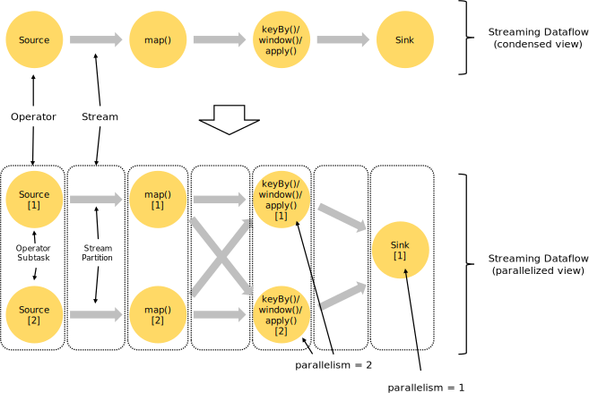
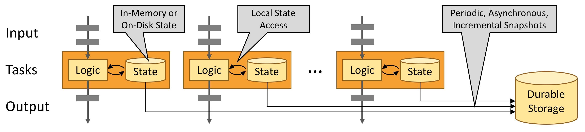

# 概览
## 流处理
在自然环境中，数据的产生原本就是流式的，无论是来自Web服务器的事件数据，证券交易所的交易数据，还是来自工厂车间机器上的传感器数据，其数据都是流式的。当分析数据时，数据有2种模型: 有界流与无界流，选择不同的模型，程序的执行和处理方式也都会不同。

- 批处理，有界数据流处理的范例，在这种模式下，可以选择在计算结果输出之前输入整个数据集，也就意味着可以对整个数据集的数据进行排序、统计或汇总计算后再输出结果;
- 流处理，无界数据流，数据输入永远不会结束，程序必须持续不断的对到达的数据进行处理.
Flink应用程序由用户自定义算子转换而来的流式dataflows组成，这些dataflows形成了有向图，以一个或者多个source开始，以一个或者多个sink结束。

通常，程序代码中的transformation和dataflow中的算子(operator)之间时一一对应的，但也会出现包含多个算子的情况。Flink应用程序可以消费来自消息队列或分布式日志这类流式数据源(Apache Kafka/Kinesis)的实时数据，也可以从各种的数据源中消费有界的历史数据，生成的结果流也可以发送到各种数据汇中。

Flink程序本质上是分布式并行程序。在程序执行期间，一个流有一个或者多个**流分区**(stream partition)，每个算子有一个或多个算子子任务(operator subtask)，每个子任务彼此独立，并在不同的线程中运行或者在不同的计算机或容器中运行。算子子任务数就是其对应算子的并行度，不同算子可能有不同的并行度。

Flink算子之间可以通过一对一（直传）模式或重新分发模式传输数据:
- 一对一模式(例如上图中的Source和map()算子之间)可以保留元素的分区与顺序信息，这意味着map()算子的subtask[1]输入的数据及顺序与source算子的subtask[1]输出的数据与顺序完全相同，即同一分区的数据只会进入到下游算子的同一分区;
- 重新分发模式(例如上图中的map()和keyBy/window之间，以及keyBy/window和Sink之间)则会更改数据所在的流分区，当你在程序中选择使用不同的transformation，每个算子子任务也会根据不同的transformation将数据发送到不同的目标子任务。例如以下这几种transformation和其对应分发数据的模式:
  - keyBy()(通过散列键重新分区);
  - broadcast()(广播);
  - rebalance()(随机重新分发).
  重新分发数据的过程中，元素只有在每对输出和输入子任务之间才能保留其之间的顺序信息(例如, keyBy/window的subtask[2]接收到的map()的subtask[1]中的元素都是有序的)。因此，上图所示的keyBy/window和Sink算子之间数据的重新分发时，不同呢键（key）的聚合结果到达Sink的顺序是不确定的.
## 自定义时间流处理
对于大多数流数据处理应用程序而言，能够使用处理实时数据的代码重新处理历史数据并产生确定并一致的结果非常有价值，在处理流式数据时，我们通常更需要关注事件本身发生的顺序而不是事件被传输以及处理的顺序，因为这能够帮助我们推理出一组事件（事件集合）是如何发生以及如何结束的。例如电子商务交易或金融交易中涉及到的事件集合。为了满足上述这类的实时流处理场景，我们通常会使用记录在数据流中的事件事件的时间戳，而不是处理数据的机器始终的时间戳。
## 有状态流处理
Flink中的算子可以是有状态的。这意味着如何处理一个事件可能取决于该事件之前所有事件数据的累积结果，Flink中的状态不仅可以用于简单的场景，也可以用于复杂的场景。Flink可以在分布式集群上并行运行，其中每个算子的各个并行实例会在单独的线程中独立运行，并且通常情况下是会在不同的机器上运行。有状态的并行实例组在存储其对应状态时通常是按照键(key)进行分片存储的，每个并行实例算子负责处理一组特定键的事件数据，并且这组键对应的状态会保存在本地。如下图的Flink作业，其前3个算子的并行度为2，最后一个sink算子的并行度为1，其中第三个算子是有壮态的，并且你可以看到第二个算子和第三个算子之间是全互联的(fully-connected)，它们之间通过网络进行数据分发，通常情况下，实现这种类型的Flink程序是为了通过某些键对数据流进行分区，以便将需要一起处理的事件进行汇合，然后做统一计算处理。

Flink应用程序的状态访问都在本地进行，因为这有助于其提高吞吐量和降低延迟。通常情况下Flink应用程序都是将状态存储在JVM堆上，但如果状态太大，我们可以选择将其以结构化数据格式存储在告诉磁盘中。

## 通过状态快照实现的容错
通过状态快照与流重放2种方式的组合，Flink能够提供可容错的，精确计算一次的语意。这些状态快照在执行时会获取并存储分布式pipeline中整体的状态，它会将数据源种消费数据的偏移量记录下来，并将整个job graph中算子获取到该数据(记录的偏移量对应的数据)时的状态记录并存储下来。当发生故障时，Flink作业会恢复上次存储的状态，重置数据源从状态中记录的上次消费的偏移量开始重新进行消费处理，而且状态快照在执行时会异步获取状态并存储，并不会阻塞正在进行的数据处理逻辑。
# DataStream API简介
## 什么能被转化成流
Flink的Java和Scala的DataStream API可以将任何可序列化的对象转化为流。Flink自带的序列化器有:
- 基本类型，即String、Long、Integer、Boolean、Array;
- 符合类型，Tuples、POJOs和Scala case classes
而且Flink会交给Kryo序列化其他类型，也可以将其他序列化器和Flink一起使用，特别是有良好支持的Avro。
