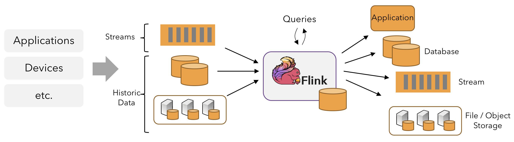

# 概览
## 流处理
在自然环境中，数据的产生原本就是流式的，无论是来自Web服务器的事件数据，证券交易所的交易数据，还是来自工厂车间机器上的传感器数据，其数据都是流式的。当分析数据时，数据有2种模型: 有界流与无界流，选择不同的模型，程序的执行和处理方式也都会不同。

- 批处理，有界数据流处理的范例，在这种模式下，可以选择在计算结果输出之前输入整个数据集，也就意味着可以对整个数据集的数据进行排序、统计或汇总计算后再输出结果;
- 流处理，无界数据流，数据输入永远不会结束，程序必须持续不断的对到达的数据进行处理.
Flink应用程序由用户自定义算子转换而来的流式dataflows组成，这些dataflows形成了有向图，以一个或者多个source开始，以一个或者多个sink结束。

通常，程序代码中的transformation和dataflow中的算子(operator)之间时一一对应的，但也会出现包含多个算子的情况。Flink应用程序可以消费来自消息队列或分布式日志这类流式数据源(Apache Kafka/Kinesis)的实时数据，也可以从各种的数据源中消费有界的历史数据，生成的结果流也可以发送到各种数据汇中。

Flink程序本质上是分布式并行程序。在程序执行期间，一个流有一个或者多个**流分区**(stream partition)，每个算子有一个或多个算子子任务(operator subtask)，每个子任务彼此独立，并在不同的线程中运行或者在不同的计算机或容器中运行。算子子任务数就是其对应算子的并行度，不同算子可能有不同的并行度。

Flink算子之间可以通过一对一（直传）模式或重新分发模式传输数据:
- 一对一模式(例如上图中的Source和map()算子之间)可以保留元素的分区与顺序信息，这意味着map()算子的subtask[1]输入的数据及顺序与source算子的subtask[1]输出的数据与顺序完全相同，即同一分区的数据只会进入到下游算子的同一分区;
- 重新分发模式(例如上图中的map()和keyBy/window之间，以及keyBy/window和Sink之间)则会更改数据所在的流分区，当你在程序中选择使用不同的transformation，每个算子子任务也会根据不同的transformation将数据发送到不同的目标子任务。例如以下这几种transformation和其对应分发数据的模式:
  - keyBy()(通过散列键重新分区);
  - broadcast()(广播);
  - rebalance()(随机重新分发).
  重新分发数据的过程中，元素只有在每对输出和输入子任务之间才能保留其之间的顺序信息(例如, keyBy/window的subtask[2]接收到的map()的subtask[1]中的元素都是有序的)。因此，上图所示的keyBy/window和Sink算子之间数据的重新分发时，不同呢键（key）的聚合结果到达Sink的顺序是不确定的.
## 自定义时间流处理
对于大多数流数据处理应用程序而言，能够使用处理实时数据的代码重新处理历史数据并产生确定并一致的结果非常有价值，在处理流式数据时，我们通常更需要关注事件本身发生的顺序而不是事件被传输以及处理的顺序，因为这能够帮助我们推理出一组事件（事件集合）是如何发生以及如何结束的。例如电子商务交易或金融交易中涉及到的事件集合。为了满足上述这类的实时流处理场景，我们通常会使用记录在数据流中的事件事件的时间戳，而不是处理数据的机器始终的时间戳。
## 有状态流处理
Flink中的算子可以是有状态的。这意味着如何处理一个事件可能取决于该事件之前所有事件数据的累积结果，Flink中的状态不仅可以用于简单的场景，也可以用于复杂的场景。Flink可以在分布式集群上并行运行，其中每个算子的各个并行实例会在单独的线程中独立运行，并且通常情况下是会在不同的机器上运行。有状态的并行实例组在存储其对应状态时通常是按照键(key)进行分片存储的，每个并行实例算子负责处理一组特定键的事件数据，并且这组键对应的状态会保存在本地。如下图的Flink作业，其前3个算子的并行度为2，最后一个sink算子的并行度为1，其中第三个算子是有壮态的，并且你可以看到第二个算子和第三个算子之间是全互联的(fully-connected)，它们之间通过网络进行数据分发，通常情况下，实现这种类型的Flink程序是为了通过某些键对数据流进行分区，以便将需要一起处理的事件进行汇合，然后做统一计算处理。

Flink应用程序的状态访问都在本地进行，因为这有助于其提高吞吐量和降低延迟。通常情况下Flink应用程序都是将状态存储在JVM堆上，但如果状态太大，我们可以选择将其以结构化数据格式存储在告诉磁盘中。

## 通过状态快照实现的容错
通过状态快照与流重放2种方式的组合，Flink能够提供可容错的，精确计算一次的语意。这些状态快照在执行时会获取并存储分布式pipeline中整体的状态，它会将数据源种消费数据的偏移量记录下来，并将整个job graph中算子获取到该数据(记录的偏移量对应的数据)时的状态记录并存储下来。当发生故障时，Flink作业会恢复上次存储的状态，重置数据源从状态中记录的上次消费的偏移量开始重新进行消费处理，而且状态快照在执行时会异步获取状态并存储，并不会阻塞正在进行的数据处理逻辑。
# DataStream API简介
## 什么能被转化成流
Flink的Java和Scala的DataStream API可以将任何可序列化的对象转化为流。Flink自带的序列化器有:
- 基本类型，即String、Long、Integer、Boolean、Array;
- 符合类型，Tuples、POJOs和Scala case classes
而且Flink会交给Kryo序列化其他类型，也可以将其他序列化器和Flink一起使用，特别是有良好支持的Avro。
### Java tuples和POJOs
Flink的原生序列化器可以高效地操作tuples和POJOs。
1. Tuples
   对于Java，Flink自带有Tuple0到Tuple25类型。
   ```java
    Tuple2<String, Integer> person = Tuple2.of("Fred", 35);  
    // zero based index!  
    String name = person.f0;
    Integer age = person.f1;
   ```
2. POJOs
   如果满足以下条件，Flink将数据类型识别为POJO类型（并允许按名称字段引用）:
   - 该类是公有且独立的(没有非静态内部类);
   - 该类有公有的无参构造函数;
   - 类(及父类)所有的所有不被static、transient修饰的属性要么是公有的(且不被final修饰)，要么是包含公有的getter和setter方法，这些方法遵循Java bean命名规范.
   示例:
   ```java
   public class Person {
    public String name;  
    public Integer age;  
    public Person() {}
    public Person(String name, Integer age) {  
        . . .
    }
    }
    Person person = new Person("Fred Flintstone", 35);
   ```
## 一个完整的实例
```java
import org.apache.flink.streaming.api.environment.StreamExecutionEnvironment;
import org.apache.flink.streaming.api.datastream.DataStream;
import org.apache.flink.api.common.functions.FilterFunction;

public class Example {

    public static void main(String[] args) throws Exception {
        final StreamExecutionEnvironment env =
                StreamExecutionEnvironment.getExecutionEnvironment();

        DataStream<Person> flintstones = env.fromElements(
                new Person("Fred", 35),
                new Person("Wilma", 35),
                new Person("Pebbles", 2));

        DataStream<Person> adults = flintstones.filter(new FilterFunction<Person>() {
            @Override
            public boolean filter(Person person) throws Exception {
                return person.age >= 18;
            }
        });

        adults.print();

        env.execute();
    }

    public static class Person {
        public String name;
        public Integer age;
        public Person() {}

        public Person(String name, Integer age) {
            this.name = name;
            this.age = age;
        }

        public String toString() {
            return this.name.toString() + ": age " + this.age.toString();
        }
    }
}
```
### Stream执行环境
每个Flink应用都需要执行环境，在该示例中为env。流式应用需要用到`StreamExecutionEnvironment`，DataStream API将你的应用构建为一个job graph，并附加到`StreamExecutionEnvironment`。当调用`env.execute()`时此graph就被打包发送到JobManager上，后者对作业并行处理并将其子任务分发给Task Manager来执行。每个作业的并行子任务将在task slot中执行。如果没有调用`execute()`应用就不会执行.

此分布式运行时取决于你的应用是否是可序列化的。它还要求所有依赖对集群中的每个节点均可用。
### 基本的stream source
上述示例用`env.fromElements(...)`方法构造`DataStream<Person>`。这样将简单的流放在一起是为了方便用于原型或者测试。`StreamExecutionEnvironment`上还有一个`fromCollection(Collection)`方法。因此，你可以这样做:
```java
List<Person> people = new ArrayList<Person>();

people.add(new Person("Fred", 35));
people.add(new Person("Wilma", 35));
people.add(new Person("Pebbles", 2));

DataStream<Person> flintstones = env.fromCollection(people);
```
另一个获取数据到流中的便捷方法是用socket
```java
DataStream<String> lines = env.socketTextStream("localhost", 9999)
```
或读取文件
```java
DataStream<String> lines = env.readTextFile("file:///path");
```
在真实的应用中，最常用的数据源是那些支持低延迟，高吞吐并行读取以及重复(高性能和容错能力为先决条件)的数据源，例如Apache Kafka，Kinesis和各种文件系统。REST API和数据库也经常用于增强流处理的能力。
### 基本的stream sink
上述示例用`adults.print()`打印其结果到task manager的日志中。它会对流中的每个元素都调用toString()方法。输出看起来类似于:
>1> Fred: age 35
>2> Wilma: age 35
1>和2>指输出来自哪个sub-task。
### 调试
在生产中，应用程序将在远程集群或者一组容器中运行，如果集群活着容器挂了，这就属于远程失败，JobManager和TaskManager日志对调试此类故障非常有用，但是更简单的是Flink支持在IDE内部进行本地调试，你可以设置断点、检查局部变量并逐行执行代码，
# 数据管道&ETL
Apache Flink的一种常见应用场景是ETL(抽取、转换、加载)管道任务。从一个或多个数据源获取数据。进行一些转换操作和信息补充，将结果存储起来。这里注意，Flink的Table和SQL API完全可以满足很多ETL使用场景。但无论你最终是否直接使用DataStream API，对这里介绍的基本知识有扎实的理解都是有价值的。
## 无状态的转换
本节涵盖了`map()`和`flatmap()`，这2种转换可以用来实现无状态转换的基本操作，本节中的示例建立在你已经熟悉flink-traning-repo中的出租车行程数据的基础上.
- map(): 在第一个练习中，你将过滤出租车行程数据中的事件，在同一代码仓库中，又一个`GeoUtils`类，提供了一个静态方法`GeoUtils.mapToGridCell(float lon, float lat)`，它可以将位置坐标（经度、纬度）映射到100*100米的对应不同区域的网格单元。现在让我们为每个出租车行程时间的数据对象增加startCell和endCell字段，你可以创建一个继承TaxiRide的EnrichedRide类，添加这些字段:
```java
public static class EnrichedRide extends TaxiRide {
    public int startCell;
    public int endCell;

    public EnrichedRide() {}

    public EnrichedRide(TaxiRide ride) {
        this.rideId = ride.rideId;
        this.isStart = ride.isStart;
        ...
        this.startCell = GeoUtils.mapToGridCell(ride.startLon, ride.startLat);
        this.endCell = GeoUtils.mapToGridCell(ride.endLon, ride.endLat);
    }

    public String toString() {
        return super.toString() + "," +
            Integer.toString(this.startCell) + "," +
            Integer.toString(this.endCell);
    }
}
```
然后你可以创建一个应用来转换这个流:
```java
DataStream<TaxiRide> rides = env.addSource(new TaxiRideSource(...));

DataStream<EnrichedRide> enrichedNYCRides = rides
    .filter(new RideCleansingSolution.NYCFilter())
    .map(new Enrichment());

enrichedNYCRides.print();

public static class Enrichment implements MapFunction<TaxiRide, EnrichedRide> {

    @Override
    public EnrichedRide map(TaxiRide taxiRide) throws Exception {
        return new EnrichedRide(taxiRide);
    }
}
```
- flatmap(): MapFunction只适用一对一的转换：对每个进入算子的流元素，`map()`将仅输出一个转换后的元素。对于除此以外的场景，你将要使用`flatmap()`。
```java
DataStream<TaxiRide> rides = env.addSource(new TaxiRideSource(...));

DataStream<EnrichedRide> enrichedNYCRides = rides
    .flatMap(new NYCEnrichment());

enrichedNYCRides.print();
```
其中用到的`FlatMapFunction`:
```java
public static class NYCEnrichment implements FlatMapFunction<TaxiRide, EnrichedRide> {

    @Override
    public void flatMap(TaxiRide taxiRide, Collector<EnrichedRide> out) throws Exception {
        FilterFunction<TaxiRide> valid = new RideCleansing.NYCFilter();
        if (valid.filter(taxiRide)) {
            out.collect(new EnrichedRide(taxiRide));
        }
    }
}
```
使用接口中提供的`Collector`，`flatmap()`可以输出你想要的任意数量的元素，也可以一个都不发。
## Keyed Streams
- keyBy(): 将一个流很具其中的一些属性来进行分区是十分有用的，这样我们可以使所有具有相同属性的事件分到相同的组里，例如，如果你想要找到从每个网格单元出发的最远的出租车行程。按照SQL查询的方式来考虑，这意味着要对`startCell`进行`GROUP BY`再排序，在flink中这部分可以用`keyBy(KeySelector)`实现。
```java
rides
    .flatMap(new NYCEnrichment())
    .keyBy(enrichedRide -> enrichedRide.startCell)
```
每个`keyBy`会通过`shuffle`来为数据流进行重新分区，总体来说，这个开销是很大的，它涉及网络通信、序列化和反序列化。

### 通过计算得到键
`KeySelector`不仅限于从事件中抽取键。你也可以按想要的方式计算得到键值，只要最终结果是确定的，并且实现了`hashCode()`和`equals()`。这些限制条件不包括产生随机数或者返回`Arrays`或`Enums`的`KeySelector`，但你可以用元组和POJO来组成键，只要它们的元素遵循上述条件。键必须按照确定的方式产生，因为它们会在需要的时候被重新计算，而不是一直被带在流记录中。例如: 比起创建一个新的带有`startCell`字段的`EnrichedRide`类，用这个字段作为key:
```java
keyBy(enrichedRide -> enrichedRide.startCell)
```
我们倾向于这样做:
```java
keyBy(ride -> GeoUtils.mapToGridCell(ride.startLon, ride.startLat))
```
### Keyed Stream的聚合
以下代码为每个行程结束事件创建一个新的包含startCell和时长的元组流:
```java
import org.joda.time.Interval;

DataStream<Tuple2<Integer, Minutes>> minutesByStartCell = enrichedNYCRides
    .flatMap(new FlatMapFunction<EnrichedRide, Tuple2<Integer, Minutes>>() {

        @Override
        public void flatMap(EnrichedRide ride,
                            Collector<Tuple2<Integer, Minutes>> out) throws Exception {
            if (!ride.isStart) {
                Interval rideInterval = new Interval(ride.startTime, ride.endTime);
                Minutes duration = rideInterval.toDuration().toStandardMinutes();
                out.collect(new Tuple2<>(ride.startCell, duration));
            }
        }
    });
```
现在就可以产生一个流，对每个`startCell`仅包含那些最长行程的数据。
有很多种方法表示使用哪个字段作为键，前面使用`EnrichedRide`POJO的例子，用字段名来指定键，而这个使用`tuple2`对象的例子中，用字段在元组中的序号来指定键.
```java
minutesByStartCell
  .keyBy(value -> value.f0) // .keyBy(value -> value.startCell)
  .maxBy(1) // duration
  .print();
```
现在每次行程时长达到新的最大值，都会输出一条新纪录，例如下面这个对应50797网格单元的数据:
>...
4> (64549,5M)
4> (46298,18M)
1> (51549,14M)
1> (53043,13M)
1> (56031,22M)
1> (50797,6M)
...
1> (50797,8M)
...
1> (50797,11M)
...
1> (50797,12M)

### (隐式的)状态
这是教程中第一个涉及到有状态流的例子。尽管状态的处理是透明的，Flink必须跟踪每个不同键的最大时长。只要应用中有状态，你就应该考虑状态的大小。如果键值的数量是无限的，那Flink的状态需要的空间也同样是无限的。在流处理场景中，考虑有限窗口的聚合往往比整个流聚合更有意义。
### reduce() 和其他聚合算子
上面用到的`maxBy()`只是Flink中`KeyedStream`（其实就是group by的意思？）上众多聚合函数中的一个。还有一个更通用的`reduce()`函数可以用来实现你的自定义聚合。