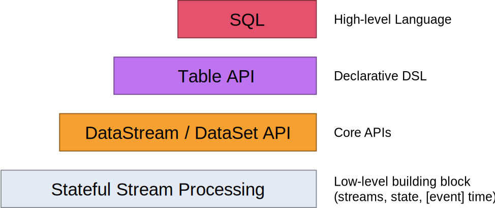

# Flink中的API
Flink为流/批应用程序的开发提供了不同级别的抽象:

- Flink API最底层的抽象是有状态实时流处理，其抽象实现是[Process Function](https://nightlies.apache.org/flink/flink-docs-release-1.16/zh/docs/dev/datastream/operators/process_function/)，