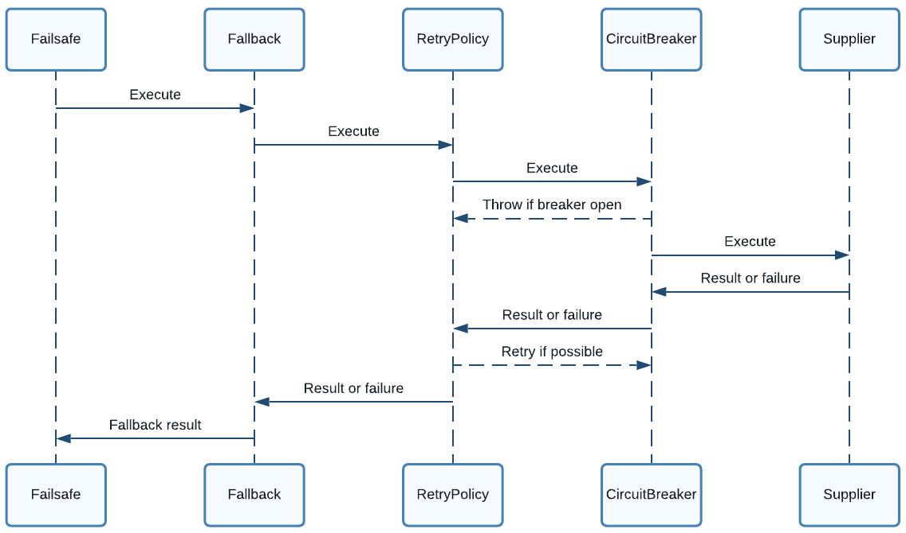

[TOC]
# guava-retrying
这是什么？ guava-retrying模块提供了一种通用方法，可以重试执行任意的java代码，并具有在指定的情况下停止、重试以及异常处理等能力，这些功能基于Guava的谓词匹配。本代码库fork自Jean-Baptiste Nizet(JB) 发布的优秀RetryerBuilder代码的分支。我添加了一个Gradle构建并将它推送到我的Maven Central，以便其他人可以轻松地将其拉入到他们现有的项目中。它还包括指数和斐波那契机制的降级等待策略。
maven
```xml
    <dependency>
      <groupId>com.github.rholder</groupId>
      <artifactId>guava-retrying</artifactId>
      <version>2.0.0</version>
    </dependency>
```
一个简单的例子
```java
Callable<Boolean> callable = new Callable<Boolean>() {
    public Boolean call() throws Exception {
        return true; // do something useful here
    }
};

Retryer<Boolean> retryer = RetryerBuilder.<Boolean>newBuilder()
        .retryIfResult(Predicates.<Boolean>isNull())
        .retryIfExceptionOfType(IOException.class)
        .retryIfRuntimeException()
        .withStopStrategy(StopStrategies.stopAfterAttempt(3))
        .build();
try {
    retryer.call(callable);
} catch (RetryException e) {
    e.printStackTrace();
} catch (ExecutionException e) {
    e.printStackTrace();
}

```
每当`Callable`的结果为null、抛出`OException`或从`call()`方法抛出任何其他`RuntimeException`时，Guava将重试方法调用。它会在尝试重试3次后停止并抛出包含最近失败异常的`RetryException`异常。 如果有任何其他异常从`call()`方法中弹出，它会被包装并重新抛出为`ExecutionException`异常。下面的例子创建了一个永久重试的`Retryer`，每次失败后，增加指数级增长的降级时间间隔，最终达到最大重试间隔(指数退避算法)
```java
Retryer<Boolean> retryer = RetryerBuilder.<Boolean>newBuilder()
        .retryIfExceptionOfType(IOException.class)
        .retryIfRuntimeException()
        .withWaitStrategy(WaitStrategies.exponentialWait(100, 5, TimeUnit.MINUTES))
        .withStopStrategy(StopStrategies.neverStop())
        .build();
```
你可以阅读更多的关于[指数时间](http://en.wikipedia.org/wiki/Exponential_backoff)的信息，还有在TCP/IP开发中所发挥的作用。下面的例子创建一个斐波那契回退算法的重试器，每次失败后，增加一个斐波那契回退间隔，一直到最大的2分钟。
```java
Retryer<Boolean> retryer = RetryerBuilder.<Boolean>newBuilder()
        .retryIfExceptionOfType(IOException.class)
        .retryIfRuntimeException()
        .withWaitStrategy(WaitStrategies.fibonacciWait(100, 2, TimeUnit.MINUTES))
        .withStopStrategy(StopStrategies.neverStop())
        .build();
```
类似`ExponentialWaitStrategy`，`FibonacciWaitStrategy`的回退时间也是不断增长的，但是是使用斐波那契序列来计算等待时间。通常来说`FibonacciWaitStrategy`执行的效果更好，可以带来更大的吞吐量。具体参考[A Performance Comparison of Different Backoff Algorithms under Different Rebroadcast Probabilities for MANETs.](http://www.comp.leeds.ac.uk/ukpew09/papers/12.pdf)。`FibonacciWaitStrategy`使用了迭代版本而不是递归版本。这是因为递归版本可能会导致StackOverflowError，当然如果定义良好的参数不太可能会发生这种情况。
# guava-retrying3
这是guava-retry的一个个人版本，与原来的版本有一点不同，大部分情况下一样，改了包名与变成了maven项目。
# spring retry
spring retry为Spring应用提供了声明式的重试支持，广发应用在Spring Batch、Spring Integration等组件中，也支持编程式的方式使用。
## 快速开始
下面的例子是一个声明的方式使用spring-retry的例子
```java
@Configuration
@EnableRetry
public class Application {

    @Bean
    public Service service() {
        return new Service();
    }

}

@Service
class Service {
    @Retryable(RemoteAccessException.class)
    public void service() {
        // ... do something
    }
    @Recover
    public void recover(RemoteAccessException e) {
       // ... panic
    }
}
```
这个例子声明，当调用service方法发生RemoteAccessException异常时，重试，并且重试达到最大次数后，调用recover方法恢复，在注解`@Retryable`中有非常多的属性，可以声明一些条件。
声明式的重试需要AOP支持。
## 非声明的方式
```java
RetryTemplate template = RetryTemplate.builder()
				.maxAttempts(3)
				.fixedBackoff(1000)
				.retryOn(RemoteAccessException.class)
				.build();

template.execute(ctx -> {
    // ... do something
});
```
## Features and API
这一节会讨论Spring Retry的特点并介绍如何使用它的API
### 使用Retry Template
为了让处理过程更具健壮性，失败处理是非常有效的，比如网络抖动或者DeadLockLoserException等异常，下一次的重试就非常可能成功了，为了让重试自动化，Spring Retry有重试策略（RetryOperations），重试策略接口如下：
```java
public interface RetryOperations {

    <T> T execute(RetryCallback<T> retryCallback) throws Exception;

    <T> T execute(RetryCallback<T> retryCallback, RecoveryCallback<T> recoveryCallback)
        throws Exception;

    <T> T execute(RetryCallback<T> retryCallback, RetryState retryState)
        throws Exception, ExhaustedRetryException;

    <T> T execute(RetryCallback<T> retryCallback, RecoveryCallback<T> recoveryCallback,
        RetryState retryState) throws Exception;

}
```
RetryCallback是一个简单的回调接口，里面可以写一些需要重试的逻辑处理过程
```java
public interface RetryCallback<T> {

    T doWithRetry(RetryContext context) throws Throwable;

}
```
当处理过程成功或者经过决策要停止，回调才会停止重试，回调策略接口中含有很多的重载的execute方法，用来处理所有重试都失败后的场景，RetryOperations的最简单的实现就是RetryTemplate类，下面的例子是使用的方法
```java
RetryTemplate template = new RetryTemplate();

TimeoutRetryPolicy policy = new TimeoutRetryPolicy();
policy.setTimeout(30000L);

template.setRetryPolicy(policy);

Foo result = template.execute(new RetryCallback<Foo>() {

    public Foo doWithRetry(RetryContext context) {
        // Do stuff that might fail, e.g. webservice operation
        return result;
    }

});
```
在1.3版本后，可以使用流式的方式创建RetryTemplate
```java
RetryTemplate.builder()
      .maxAttempts(10)
      .exponentialBackoff(100, 2, 10000)
      .retryOn(IOException.class)
      .traversingCauses()
      .build();

RetryTemplate.builder()
      .fixedBackoff(10)
      .withinMillis(3000)
      .build();

RetryTemplate.builder()
      .infiniteRetry()
      .retryOn(IOException.class)
      .uniformRandomBackoff(1000, 3000)
      .build();

```
### 使用RetryContext
RetryCallback接口的方法参数是RetryContext，很多回调都忽略上下文，如果有必要，你可以使用它存储一些迭代过程中的共享数据。当一个线程中，存在嵌套的retry的时候，RetryContext会有父上下文，父上下文用来在不同的execute调用间共享数据是非常有用的。
### 使用RecoveryCallback
当停止重试时，回调用RecoveryCallback接口，调用方式：
```java
Foo foo = template.execute(new RetryCallback<Foo>() {
    public Foo doWithRetry(RetryContext context) {
        // business logic here
    },
  new RecoveryCallback<Foo>() {
    Foo recover(RetryContext context) throws Exception {
          // recover logic here
    }
});

```
### Stateless Retry
最简单的重试方法就是使用一个循环，RetryContext会保存一些有关状态的上下文，但是这个上下文只是栈存储，而不是全局存储，因而，我们称这种重试是无状态重试，无状态重试与有状态重试的区别就是是否共享RetryPolicy的实现，在无状态重试中，回调只会在一个线程中执行。
### stateful Retry
当任务失败后，一个前面的事务性资源的变更往往就无效了，此时需要回滚这个事务性的资源，但是事务性资源往往不是简单的数据库的CRUD，也有可能是一个分布式系统中的远程调用，这个远程调用在远程可能做出了数据库的CRUD，在这种场景下，任务失败后马上抛出一个异常让事务回滚，是非常有意义的，这样后面可以开启一个新的事务。
在这样的场景下，stateless的retry不能满足我们的要求，因为重新抛出异常并且回滚，就回使得当前的执行离开RetryOperations.execute(),这会导致释放Retry的上下文，为了保留上下文场景，我们必须保存上下文数据以便后面的恢复，为了这个目的，Spring Retry提供了一个叫做RetryContextCache的存储策略，你可以注入到RetryTemplate中，RetryContextCache的默认实现是in-memory，使用一个简单的内存map，它有一个严格的上限，为了避免内存泄漏，它没有任何高级的缓存的特性（比如TTL），如果你需要这些特性，你可以执行注入一个定制化的具有这些功能的Map，对于集群环境，你可以实现RetryContextCache，自定义一些缓存的顺序等。
RetryOperations的部分指责是识别失败的执行（这个执行通常位于一个事务中），为了让这个变得容易些，Spring Retry提供了RetryState的抽象，这个抽象定义标识了执行的状态，通常作为execute重载方法的参数使用。
失败的操作可以通过RetryState识别出来，为了标识操作的状态，你可以提供一个RetryState类型的对象，这个对象携带一个唯一key，这个key是用来标识操作的，这个唯一的key可以作为RetryContextCache中的key。
*警告：需要定义key的Object.equals()与Object.hashCode()方法，最好的办法使用一个业务的key来标识操作，在JMS消息中，你可以使用小=消息的ID作为业务的key*
是否重试还是终止由RetryPolicy控制，可以设置最大次数或者最大时间等决策。
### Retry Policies
在一个RetryTemplate中，由RetryPolicy控制execute的重试或者终止策略，RetryPolicy也是一个RetryContext的工厂，RetryTemplate负责使用当前的policy来创建一个RetryContext，并且在每次重试执行时，传递到RetryCallback对象中，当重试失败时，RetryTemplate必须访问RetryPolicy判断怎么更新操作的状态（存储在RetryContext中），然后询问RetryPolicy是否执行重试，以及何时重试，如果不能重试了，policy也会负责设置最终的状态，但不处理异常，当没有recovery可用时，RetryTemplate会抛出原始的异常（stateful retry除外，它抛出RetryExhaustedException），你也可以给RetryTemplate设置一个标志，让它无条件的抛出原始的异常。
*tips: 失败要么可以重试，要么不需要重试，这种失败就是一直失败的，可以分为2类，如果一直抛出同样的异常，那么没有必要重试，所以不是所有的异常都要重试，更多的需要关注的是哪些可以重试的异常，更积极地重试通常不会对业务逻辑造成损害，但会造成浪费，因为如果失败是确定性的，那么重试您事先知道的事情所花费的时间是致命的。*
Spring Retry提供了一些简单的通用的无状态的RetryPolicy的实现，比如SimpleRetryPolicy与TimeoutRetryPolicy.
SimpleRetryPolicy可以在遇到制定的一些类型的异常时重试，也可以指定重试的次数，下面的例子展示了使用的方法：
```java
// Set the max attempts including the initial attempt before retrying
// and retry on all exceptions (this is the default):
SimpleRetryPolicy policy = new SimpleRetryPolicy(5, Collections.singletonMap(Exception.class, true));

// Use the policy...
RetryTemplate template = new RetryTemplate();
template.setRetryPolicy(policy);
template.execute(new RetryCallback<Foo>() {
    public Foo doWithRetry(RetryContext context) {
        // business logic here
    }
});

```
一个更灵活的实现是ExceptionClassifierRetryPolicy，这个策略可以让你在遇到不同的异常类型时可以指定不同的行为，这是通过ExceptionClassifier实现的，具体的工作方式是Classifier把异常转换成一个委托的RetryPolicy来处理。
你可能想要定义自己的RetryPolicy。
### 回退策略
当短暂的失败然后重试时，等待一段时间是非常好的，因为造成失败的原因，可能需要等一会才会好，比如网络抖动，马上重试，可能得到相同的结果，是比较浪费的，如果一个RetryCallback失败了，RetryTemplate可以根据指定的BackoffPolicy解析执行，下面是BackoffPolicy的定义。
```java
public interface BackoffPolicy {

    BackOffContext start(RetryContext context);

    void backOff(BackOffContext backOffContext)
        throws BackOffInterruptedException;

}
```
一个BackoffPolicy就是用来实现回退算法的，所有的Spring Retry提供的策略都使用到了Object.wait()，一个更好用的回退策略是指数回退策略。Spring Retry提供了ExponentialBackoffPolicy实现，它就是指数回退策略。
### Listeners
很多的不同的重试可能需要相同的切面处理， 为此，Spring Retry 提供了 RetryListener 接口。 RetryTemplate 允许您注册 RetryListener 实例，并使用 RetryContext 和 Throwable（在迭代期间可用的情况下）为它们提供回调。
```java
public interface RetryListener {

    void open(RetryContext context, RetryCallback<T> callback);

    void onError(RetryContext context, RetryCallback<T> callback, Throwable e);

    void close(RetryContext context, RetryCallback<T> callback, Throwable e);
}
```
open与close回调在完整的重试之前或者之后调用，onError只作用于单独的RetryCallback调用，close方法也会接受一个Throwable异常，它就是RetryCallback最后一次调用抛出的异常。
当存在多个监听器时，它们会被组成一个列表，列表中顺序就是调用的顺序，open按照正序调用，close与onError按照反序调用。
### 反射方法调用的监听器
当处理被@Retryable注解的方法时，或者处理任何的Spring AOP拦截的方法时，Spring Retry可以在RetryListener中获得方法调用的详细的情况，获得详细的调用情况在一些场景下是非常有用的，特别是需要一些监控的场景，需要监控方法重试的次数，并且记录方法的类名、方法名或者参数等信息。
下面的例子就是这样的场景
```java

template.registerListener(new MethodInvocationRetryListenerSupport() {
      @Override
      protected <T, E extends Throwable> void doClose(RetryContext context,
          MethodInvocationRetryCallback<T, E> callback, Throwable throwable) {
        monitoringTags.put(labelTagName, callback.getLabel());
        Method method = callback.getInvocation()
            .getMethod();
        monitoringTags.put(classTagName,
            method.getDeclaringClass().getSimpleName());
        monitoringTags.put(methodTagName, method.getName());

        // register a monitoring counter with appropriate tags
        // ...
      }
    });

```
### 声明式的Retry
有时候，你想要重试一些业务逻辑，典型的使用场景是远程调用，Spring Retry提供了AOP拦截器，可以把方法调用包装到一个RetryOperations对象中，RetryOperationsInterceptor执行被拦截的方法，并且依据RetryPpolicy的策略在失败的情况下重试。
你可以在一个@Configuration注解的类上添加@EnableRetry注解，并且使用@Retryable注解到方法上，或者放到类上，你可以指定任意数量的监听器，下面的了例子展示了做法.
```java
@Configuration
@EnableRetry
public class Application {

    @Bean
    public Service service() {
        return new Service();
    }

    @Bean public RetryListener retryListener1() {
        return new RetryListener() {...}
    }

    @Bean public RetryListener retryListener2() {
        return new RetryListener() {...}
    }

}

@Service
class Service {
    @Retryable(RemoteAccessException.class)
    public service() {
        // ... do something
    }
```
你可以使用@Retryable的属性来定义Retry Policy或者BackoffPolicy,如下：
```java
@Service
class Service {
    @Retryable(maxAttempts=12, backoff=@Backoff(delay=100, maxDelay=500))
    public service() {
        // ... do something
    }
}

```
上面的例子使用了一个随机的回退策略，这个策略定义了回退的间隔在100-500毫秒之间，并且最大重试次数是12次，并且有一个statful的属性来控制retry是有状态的还是无状态的，为了使用有状态的retry，被拦截的方法必须是带参的，因为它们会被用来生成state的缓存key。
@EnableRetry注解也会寻找RetryTemplate中使用的Sleeper类型的bean与其他策略的相关的bean来控制重试时的行为。
@EnableRetry注解会为@Retryable注解的bean生成代理，代理会实现Retryable接口，这是一个用于标记的接口，通常在一些添加retry advice工具中有用。
当重试结束时，往往需要做一些额外的操作，你可以定义一个recovery方法，这样的方法需要与@Retryable注解的方法定义在一个类中，并且使用@Recover注解注释，返回的类型必须与@Retryable注解的方法比配，recovery方法的参数可以可选的包含一个异常，或者与retryable方法匹配的参数，或者部分参数，下面的例子展示了如何做：
```java
@Service
class Service {
    @Retryable(RemoteAccessException.class)
    public void service(String str1, String str2) {
        // ... do something
    }
    @Recover
    public void recover(RemoteAccessException e, String str1, String str2) {
       // ... error handling making use of original args if required
    }
}
```
要解决可以选择进行恢复的多个方法之间的冲突，您可以明确指定恢复方法名称。 以下示例显示了如何执行此操作：
```java
@Service
class Service {
    @Retryable(recover = "service1Recover", value = RemoteAccessException.class)
    public void service1(String str1, String str2) {
        // ... do something
    }

    @Retryable(recover = "service2Recover", value = RemoteAccessException.class)
    public void service2(String str1, String str2) {
        // ... do something
    }

    @Recover
    public void service1Recover(RemoteAccessException e, String str1, String str2) {
        // ... error handling making use of original args if required
    }

    @Recover
    public void service2Recover(RemoteAccessException e, String str1, String str2) {
        // ... error handling making use of original args if required
    }
}

```
版本 1.3.2 及更高版本支持匹配参数化（通用）返回类型以检测正确的恢复方法：
```java
@Service
class Service {

    @Retryable(RemoteAccessException.class)
    public List<Thing1> service1(String str1, String str2) {
        // ... do something
    }

    @Retryable(RemoteAccessException.class)
    public List<Thing2> service2(String str1, String str2) {
        // ... do something
    }

    @Recover
    public List<Thing1> recover1(RemoteAccessException e, String str1, String str2) {
       // ... error handling for service1
    }

    @Recover
    public List<Thing2> recover2(RemoteAccessException e, String str1, String str2) {
       // ... error handling for service2
    }

}

```
1.2版本支持使用表达式功能，下面的例子展示了用法：
```java

@Retryable(exceptionExpression="message.contains('this can be retried')")
public void service1() {
  ...
}

@Retryable(exceptionExpression="message.contains('this can be retried')")
public void service2() {
  ...
}

@Retryable(exceptionExpression="@exceptionChecker.shouldRetry(#root)",
    maxAttemptsExpression = "#{@integerFiveBean}",
  backoff = @Backoff(delayExpression = "#{1}", maxDelayExpression = "#{5}", multiplierExpression = "#{1.1}"))
public void service3() {
  ...
}

```
自从Spring Retry 1.2.5版本发布后，对于exceptionExpression的值，模板表达式的方式已经被废弃了，只支持简单的表达式字符串。
表达式可以包含属性占位符，比如`#{${max.delay}}`或者`#{@exceptionChecker.${retry.method}(#root)}`.

# Failsafe
## Overview
FailSafe是一个轻量化的0以来的用于处理错误的库。主要是在Java8+以上的版本中使用。它有简洁与灵活的得API定义。主要的工作原理是将执行逻辑包裹到一个或者多个resilience policies中。这些policies可以按需组合或者聚合。
### Setup
添加最新的[Failsafe](https://maven-badges.herokuapp.com/maven-central/dev.failsafe/failsafe)依赖到你的项目中
### Getting Started
为了了解Failsafe是如何工作的。我们创建一个重试策略，它定义了如何处理错误以及什么时候重试:
```java
RetryPolicy<Object> retryPolicy = RetryPolicy.builder()
  .handle(ConnectException.class)
  .withDelay(Duration.ofSeconds(1))
  .withMaxRetries(3)
  .build();
```
我们使用重试机制可以执行一个`Runnable`或者一个`Supplier`
```java
// Run with retries
Failsafe.with(retryPolicy).run(() -> connect());

// Get with retries
Connection connection = Failsafe.with(retryPolicy).get(() -> connect());
```
使用重试机制异步执行`Runnable`或者一个`Supplier`也很简单
```java
// Run with retries asynchronously
CompletableFuture<Void> future = Failsafe.with(retryPolicy).runAsync(() -> connect());

// Get with retries asynchronously
CompletableFuture<Connection> future = Failsafe.with(retryPolicy).getAsync(() -> connect());
```
多个policy可以任意的组合来添加额外的机制或者用不通的方式处理不同的错误:
```java
var fallback = Fallback.of(this::connectToBackup);
var circuitBreaker = CircuitBreaker.ofDefaults();
var timeout = Timeout.of(Duration.ofSeconds(10));

// Get with fallback, retries, circuit breaker, and timeout
Failsafe.with(fallback, retryPolicy, circuitBreaker, timeout).get(this::connect);
```
组合policy时，顺序很重要，参考[policy composition](https://failsafe.dev/policies#policy-composition)得到更多的信息。
policy组合也可以先临时保存起来，后续通过`FailsafeExecutor`使用
```java
FailsafeExecutor<Object> executor = Failsafe.with(retryPolicy).compose(circuitBreaker);
executor.run(this::connect);
```
## POLICIES
分为几类:
- Failure Handling, Failsafe通过检测错误来添加resilience并处理错误。每个policy定义什么情况下是失败并且如何处理这些失败。默认情况下，policies处理所有所有抛出的异常。也可以配置只处理某些特定的异常或者情况:
  ```java
  policyBuilder
  .handle(ConnectException.class, SocketException.class)
  .handleIf(e -> e instanceof ConnectException);
  ```
  也支持处理特定的结果或者结果满足某些条件。
  ```java
  policyBuilder
  .handleResult(null)
  .handleResultIf(result -> result == null);  
  ```
  如果配置了多个处理方法，它们将进行逻辑OR运算。默认的异常处理条件只能被处理异常的另一个条件替换。仅处理结果的条件不会替换默认的异常处理。
- Policy Composition， policy可以组合，包括很多相同类型的policy，Policy会以相反的顺序处理执行结果。与函数组合的工作方式类似。比如下面的policy：
  ```java
  Failsafe.with(fallback)
  .compose(retryPolicy)
  .compose(circuitBreaker)
  .compose(timeout)
  .get(supplier);
  ```
  也可以写成这样`Failsafe.with(fallback, retryPolicy, circuitBreaker, timeout).get(supplier);`。当执行时，实际的执行如下`Fallback(RetryPolicy(CircuitBreaker(Timeout(Supplier))))`。policy组合首先执行最外面的policy，这个policy内部在嗲偶用下一个policy，一直下去。一直到用户提供的`Runnable`或者`Supplier`。执行的结果或者异常向上一层一层返回。按照定义决定是否处理。每一个oplicy自己决定是否允许继续执行或者如何处理执行结果或者异常。比如`RetryPolicy`会重试执行，会再一次的调用内部的policy或者返回执行的结果或者异常。`CircuitBreaker`可能会在到达`Supplier`之前抛出异常。考虑下面的policy组合的执行
  
  - Failsafe calls the Fallback
  - Fallback calls the RetryPolicy
  - RetryPolicy calls the CircuitBreaker
  - CircuitBreaker rejects the execution if the breaker is open, else calls the Supplier
  - Supplier executes and returns a result or throws an exception
  - CircuitBreaker records the result as either a success or failure, based on its configuration, possibly changing the state of the breaker, then returns or throws
  - RetryPolicy records the result as either a success or failure, based on its configuration, and either retries or returns the result or exception
  - Fallback handles the result or exception according to its configuration and returns a fallback result or exception if needed
  - Failsafe returns the final result or exception to the caller


### 

