# 记录下学习jdk工具的一些知识
## jps命令
jps工具的全称是Java Virtual Machine Process Status，中文名字就是Java虚拟机进程状态工具，
### 语法：
jps [options] [hostid]

### parameters
- options, 命令行选项；
- hostid,进程的唯一标识，可能是uri格式的，包含协议、端口号等；
### 描述
jps会以一种仪表话的形式列出目标系统上的jvm进程，只能列出它有权限访问的jvm进程；
如果没有指定hosid，则查找本地，如果指定，则会去目标系统上去寻找，目标系统必须运行一个jstatd进程才可以；
jps命令在仪表中会列出jvm进程的进程标识，lvmid，lvmid一般来说是操作系统里面的进程号，也会列出jvm进程的名字，这个名字通常是应用入口的Class的名字或者jar文件的文件；
jps使用java启动器来发现class名字以及传给main方法的参数，如果进程使用了自定义的java启动器，那么得到的名字与参数是UNKNOWN；
jps只会输出它可以访问的JVM进程的信息，可以访问哪些进程由运行的用户权限决定；
### OPTIONS
这些选项只是用来改变命令的输出，未来有可能移除；
- -q 隐藏进程名字与传入到main方法的参数，只显示jvm进程标识符；
- -m 显示传输给main方法的参数，对于内置的JVM来说，这里显示null；
- -l 输出class的包名或者jar文件的全路径名；
- -v 输出传递给JVM的参数；
- -V 输出通过flag文件（.hotspotrc文件或者通过-XX:Flags=\<filename>）的方式传递给JVM的参数;
- -Joption 传递参数给由jps调用的java启动器启动的JVM进程的参数，比如：-J-Xms48m 设置启动内存是48MB，-J标记是一种约定，在传递参数给内部的虚拟机引用程序的情况下；
### HOST IDENTIFIER
JVM进程标识符是一个字符串，语法类似于URI的语法：
[protocol:][[//]hostname][:port][/servername]
- protocol,通信协议，如果没有指定protocol与hostname，缺省的协议是本地，如果指定了hostname，那么缺省的协议是rmi；
- hostname,主机名或者IP地址；
- port,与远程服务器通信的端口号，如果使用的是本地协议，那么port会被忽略，如果使用的是RMI协议，那么端口号就是远程服务器上的rmiregistry的端口号，缺省的情况下是1099；
- servername,如果是本地，则忽略这个，如果是rmi协议，参数代表RMI远程对象的名字；
### OUTPUT FORMAT
jps的输出如下：
lvmid [[classname|JARfilename|Unknown][arg*][jvmarg*]]
所有的输出的字段都通过空白符隔开，需要注意的是，当arg包含内置的空白符的时候，可能导致整体的输出会有点混乱。
### EXAMPLES
这一节提供几个jps命令的例子
列出本地机器上的JVM进程：
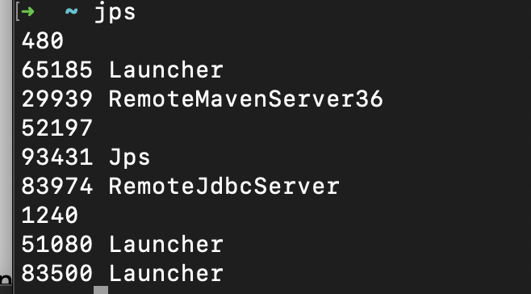
待-l参数会出现比较长的名字：
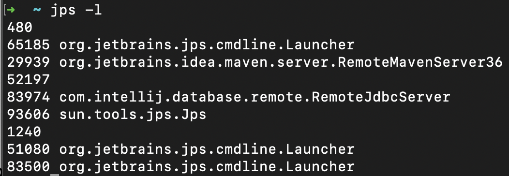

# jstat
jstat的命令全称是Java Vitual Machine Statistics Monitoring Tool 中文名Java虚拟机概况监控工具。
## SYNOPSIS
jstat [generalOption|outputOptions vmid [interval [ s|ms ][count]]]
## PARAMETERS
- generalOption 一个单独的只出现一次的命令行选项 -help或者-options
- outputOptions 一个或者多个输出选项，包含一个单独的statOption，比如-t、-h、-J选项
- vmid 虚拟机进程标识符，可以是本地的也可以是远程的；
- interval[s|ms] 输出/采样间隔时间与单位；
- count 采样展示次数，缺省是无限的一直到虚拟机终止或者jstat终止，必须是一个正数；
## DESCRIPTION
jstat展示jvm进程的性能统计数据。
## VIRTUAL MACHINE IDENTUIFIER
vmid的语法与URI类似：
[protocol:][//]lvmid[@hostname][:port][/servername]
- protocol 没法判断是远程的时候，使用一种本地协议，如果vmid看起来是远程的，那么缺省是rmi；
- lvmid 本地的JVM进程标识符，用来在一个系统中唯一标识一个JVM进程，lvmid是必须提供的，一般来说就是每个操作系统中进程的进程号；
- hostname 主机名或者远程地址；
- port 端口号，如果使用的是RMI，缺省的port是1099；
- servername 如果是RMI，servername代表RMI远程对象的名字。
## OPTIONS
jstat支持2中类型的选项，generalOptions用于让jstat显示用法与版本信息，outputOptions用于决定jstat输出的内容与格式。
## GENERAL OPTIONS
general options是排他的，指定了选项后，不能指定其他的选项与参数
- -help 显示jstat的帮助信息；
- -options 显示统计选项，也就是显示可用的output options。
## OUTPUT OPTIONS
只有在没有指定general options的情况下，才可以指定output options，output options的组成是 -statOption -[output option]的形式；
jstat的输出通常是表格的形式，并且带有表头与标题，-h参数决定表头显示的频率，在不同的参数下，这个表格的内容基本一致，同样名字的列，里面表示的数据含义也是一致的。
-t参数会额外增加一个时间戳列，interval参数指定jstat的采样率，count指定jstat的刷新次数。
### -statOption
这个参数决定了jstat展示的通信信息类型。
｜ Option | Display |
|:-       |:-       |
| class   | 统计class loader的行为 |
| compiler | 统计HotSpot即时编译器的行为 |
| gc      | 统计gc堆的行为 |
| gccapacity | 统计分代与分代空间的容量信息 |
| gccause  | gc统计信息的汇总，还带有最近与当前的gc事件发生原因 |
| gcnew    | 新生代行为信息  |
| gcnewcapacity | 新生代的大小与空间信息 |
| gcold    | 老年代与永久代的行为信息 |
| gcoldcapacity | 老年代的大小与空间信息 |
| gcmetacapacity | 元空间的大小与空间信息 |
| gcutil   | gc统计信息 |
| printcompilation | HotSpot 编译方法信息 |

### -h [n]
每隔多少行展示下表头，如果不设置，只在第一行展示表头。
### -t
在第一列展示时间戳字段，代表jvm的启动时间。
### -JjavaOption
传输java参数给jstat的java启动器。
## STATOPTIONS AND OUTPUT
下面展示了每个-statOption下的输出表格样式。
### -class
| Column | Description |
|:- |:- |
| Loaded | 加载的class数量 |
| Bytes | 加载了多少kb的类 |
| Unloaded | 卸载类的数量 |
| Bytes | 卸载的类有多少KB |
| Time   | 执行类加载与卸载花了多少时间 |

### -compiler
| Column | Description |
|:- |:- |
| Compiled | 即时编译的次数 |
| Failed | 即时编译失败的次数 |
| Invalid | 即时编译无效的次数 |
| Time | 即时编译的时间消耗 |
| FailedType   | 最近一次编译失败的编译类型 |
| FailedMethod  | 最近一次编译失败的类名与方法 |
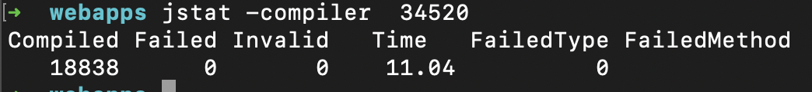
### -gc
| Column | Description |
|:- |:- |
| S0C | 0号survivor空间的当前的容量（KB） |
| S1C | 1号survivor空间的当前的容量 （KB）|
| S0U | 0号survivor空间的已用的容量（KB） |
| S1U | 1号survivor空间的已用的容量（KB） |
| EC   | 当前的eden空间容量（KB） |
| EU  | 当前的eden空间已用容量（KB） |
| OC | 当前的老年代（old capacity）空间容量（KB） |
| OU | 当前的老年代（old capacity）空间已用容量（KB） |
| MC | 元空间容量（KB） |
| MU | 元空间的已用的容量（KB） |
| CCSC | 压缩类空间容量（KB） |
| CCSU | 压缩类空间的已用的容量（KB） |
| YGC   | 新生代gc次数 |
| YGCT  | 新生代GC花费的时间 |
| FGC | 老年代（full gc）的次数 |
| FGCT   | 老年代gc花费的时间 |
| GCT  | 总共的gc花费时间 |
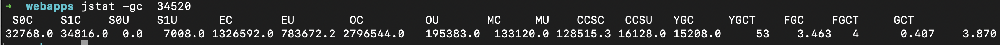
### -gccapacity
| Column | Description |
|:- |:- |
| NGCMN | 最小的新生代容量（KB） |
| NGCMX | 最大的新生代容量 （KB）|
| NGC | 当前的新生代容量（KB） |
| S0C | 0号survivor空间的当前的容量（KB） |
| S1C   | 1号survivor空间的当前的容量（KB） |
| EC  | 当前的eden空间容量（KB） |
| OGCMN | 老生代容量下限值（KB） |
| OGCMX | 老生代容量上限值（KB） |
| OGC | 当前的老生代容量（KB） |
| OC | 当前的老年代（old capacity）空间容量（KB） |
| MCMN   | 元空间容量最小值（KB） |
| MCMX  | 元空间容量最大值（KB） |
| CCSMN | 压缩累空间最小容量值（KB） |
| CCSMX | 压缩类空间最大容量值（KB） |
| CCSC | 压缩类空间容量（KB） |
| YGC  | 新生代GC次数 |
| FGC  | 老生代GC次数 |

### -gcutil
垃圾回收统计数据
| Column | Description |
|:- |:- |
| S0 | 0号survivor已用容量百分比|
| S1 | 1号survivor已用容量百分比 |
| E | Eden空间已用容量百分比 |
| O | 老年代空间已用容量百分比 |
| M   | 元空间已用容量百分比 |
| CCS  | 压缩类空间已用容量百分比 |
| YGC | 新生代GC次数 |
| YGCT | 新生代GC时间 |
| FGC | 老生代GC次数 |
| FGCT | 老生代GC时间 |
| GCT   | 总共的GC时间 |
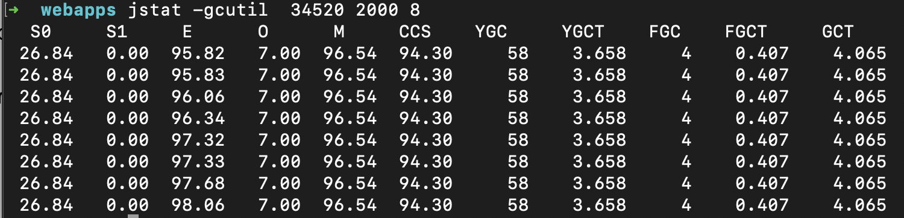
### -gccause
这个statOption会列出垃圾回收的汇总信息，基本与-gcutil的内容一致，但是包含了最精的垃圾回收事件的原因与当前的垃圾回收事件，相比于-gcutil,这个选项多了2列
| Column | Description |
|:- |:- |
| LGCC  | 最近的垃圾回收事件原因 |
| GCC  | 当前的垃圾回收事件 |
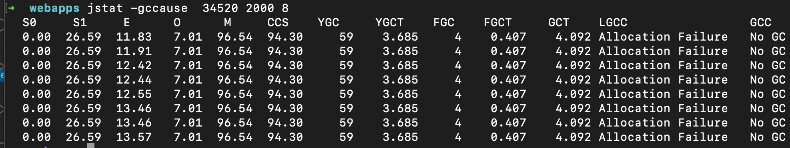
### -gcnew
新生代的统计信息
| Column | Description |
|:- |:- |
| S0C | 0号survivor当前容量（KB）|
| S1C | 1号survivor当前容量（KB） |
| S0U | 0号survivor已用容量（KB） |
| S1U | 1号survivor已用容量（KB） |
| TT   | 占有阈值 |
| MTT  | 最大的占用阈值 |
| DSS | 预期的survivor大小（KB） |
| EC | 当前的eden空间容量（KB） |
| EU | eden空间使用量（KB） |
| YGC | 新生代GC次数 |
| YGCT | 新生代GC时间 |
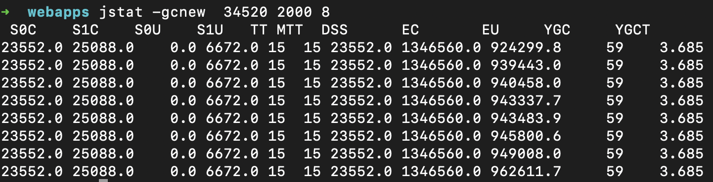
### -gcnewcapacity
新生代空间大小统计数据
| Column | Description |
|:- |:- |
| NGCMN | 新生代容量最小值（KB）|
| NGCMX | 新生代容量最大值（KB） |
| NGC | 新生代容量当前值（KB） |
| S0CMX | 0号survivor容量最大值（KB） |
| S0C   | 0号survivor容量当前值（KB） |
| S1CMX  | 1号survivor容量最大值（KB） |
| S1C | 1号survivor容量当前值（KB） |
| ECMX | eden空间容量最大值（KB） |
| EC | eden空间当前容量（KB） |
| YGC | 新生代GC次数 |
| FGC | 老生代GC次数 |
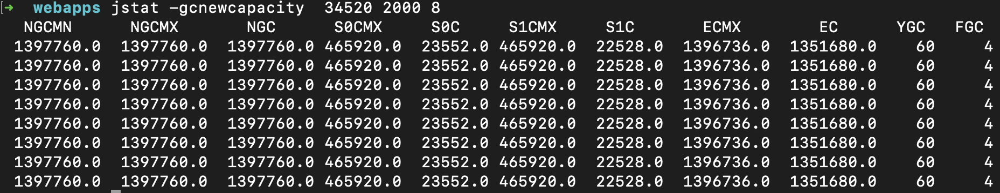
### -gcold
老生代与元空间行为统计信息
| Column | Description |
|:- |:- |
| MC | 元空间容量（KB）|
| MU | 元空间已用（KB） |
| CCSC | 压缩类空间容量（KB） |
| CCSU | 压缩类空间已用容量（KB） |
| OC   | 当前老年代空间容量（KB） |
| OU  | 当前老年代空间已用容量（KB） |
| YGC | 新生代GC次数 |
| FGC | 老生代GC次数 |
| FGCT | 老生代GC耗时 |
| GCT | GC总耗时 |
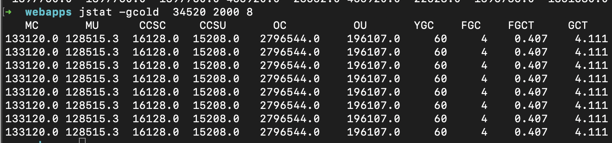
### -gcoldcapacity
老生代大小统计
| Column | Description |
|:- |:- |
| OGCMN | 老生代容量最小值（KB）|
| OGCMX| 老生代容量最大值（KB） |
| OGC | 当前老生代容量（KB） |
| OC | 当前老生代空间容量（KB） |
| YGC | 新生代GC次数 |
| FGC | 老生代GC次数 |
| FGCT | 老生代GC耗时 |
| GCT | GC总耗时 |
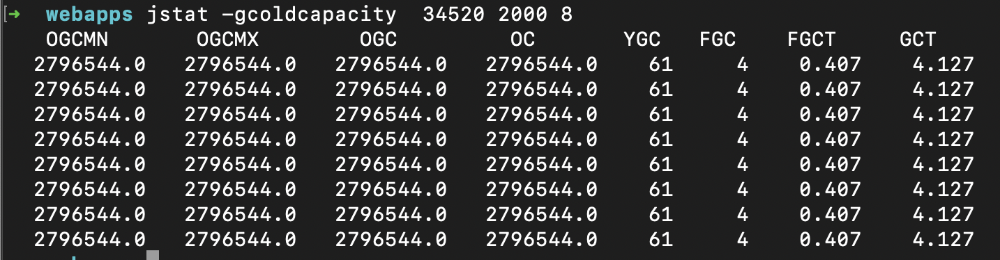
### -gcmetacapacity
元空间大小信息
| Column | Description |
|:- |:- |
| MCMN | 元空间容量最小值（KB）|
| MCMX| 元空间容量最大值（KB） |
| MC | 元空间当前容量（KB） |
| CCSMN | 压缩类空间容量最小值（KB） |
| CCSMX | 压缩类空间容量最大值（KB） |
| YGC | 新生代GC次数 |
| FGC | 老生代GC次数 |
| FGCT | 老生代GC耗时 |
| GCT | GC总耗时 |
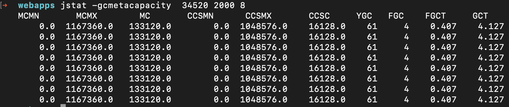
### -printcompilation
java的HotSpot虚拟机编译器方法统计信息
| Column | Description |
|:- |:- |
| Compiled | 最近被编译的方法的编译次数 |
| Size| 最近被编译的方法的编译字节数 |
| Type | 最近被编译的方法的编译的类型 |
| Method | 最近编译的方法的类名与方法名，类名使用/分割，方法名是指定类里面的方法，输出的格式与-XX:+PrintCompilation 参数一致 |
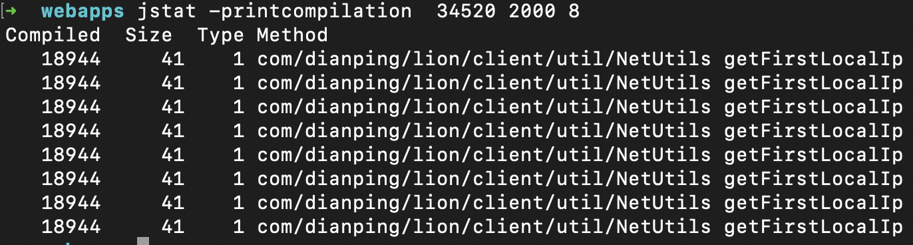

# jstatd
是jstat daemon也就是jstat的后台进程，守护程序；是java虚拟机的监视器，使远程工具可以方便的访问本地的jvm进程。
## synopsis
jstatd [options]
## Description
jstatd是一个远程RMI服务器应用，可以监视本地的JVM进程的创建与销毁事件，并且提供RMI接口用于访问jvm进程的一些信息。
jstatd要求本机上有一个RMI registry，jstatd会通过缺省端口或者指定的端口连接到RMI registry，如果此时没有RMI registry，那么jstatd会内部自己创建一个
并连接到它。
## Options
- -nr jstatd不会自行创建RMI registry；
- -p port RMI registry端口的位置，或者自己创建的registry绑定的端口；
- -n rminame 远程RMI服务在registry中注册的名字，缺省的名字是JStatRemoteHost，如果在本机上有多个jstatd后台进程，每个后台进程可以通过这个参数指定一个唯一的名字，
客户端工具访问jstatd的时候需要在hostid或者vmid部分指定servername；
- Joption，传输给jstatd的jvm参数。
## Security
jstatd只能监控它有权限监控的JVM，通常这个权限就是运行jstatd进程的用户的权限，root用户权限最大，可以监控机器上素有的JVM进程；
jstatd没有对远程的访问做任何的安全方面的控制，因此，jstatd监控的jvm信息对网络上的所有用户开放，这个可能不是你想要的结果，因此，需要加上本地的安全策略；
jstatd会自己安装一个RMISecurityPolicy的实例，这个实例需要一个配置好的安全策略文件来进行控制，文件里面的内容，需要指定的内容与书写规则。
语法在：
[这个超链接里面](http://docs.oracle.com/javase/8/docs/technotes/guides/security/PolicyFiles.html)

下面的策略配置让jstad server没有任何时候的安全限制
>grant codebase "file:${java.home}/../lib/tools.jar" {   
    permission java.security.AllPermission;
};

这个权限设置比全部的权限设置更严格一些，但是也多给了一些不必要的权限。
如果要使用上面的权限配置，运行jstatd的时候指定就可以了。
>jstatd -J-Djava.security.policy=jstatd.all.policy

还可以自己指定更严格的安全策略，如果无法很好的配置安全策略，最安全就是只在本地运行jstat与jps而不是网络。

## Remote Interface

