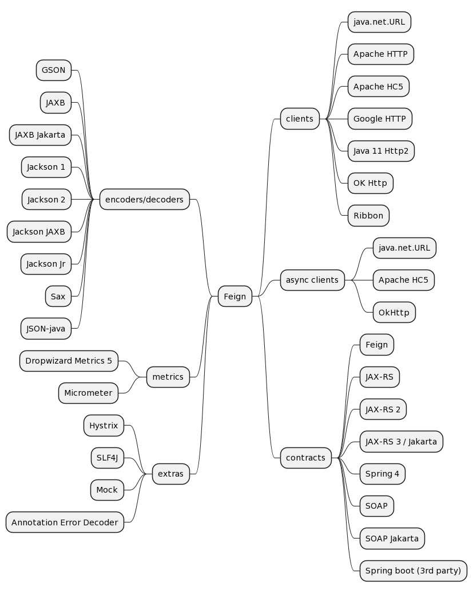

常用的httpclient有以下几种：
- Okhttp；
- httpurlconnection；
- ApacheHttpClient;
- Retrofit;
- Spring RestTemplate；
- Spring WebClient
- Feign
- Spring Cloud Open Feign
- google-http-java-client
- async-http-client
- Unirest

下面着重理解他们的使用方法与各自的特点与优缺点
# Retrofit
一个类型安全的HTTPClient，用java语言编写。
## Introduction
Retrofit将HTTP API映射为Java接口。
```java
public interface GitHubService {
  @GET("users/{user}/repos")
  Call<List<Repo>> listRepos(@Path("user") String user);
}
```
Retrofit会生成`GitHubService`接口的一个代理实现
```java
Retrofit retrofit = new Retrofit.Builder()
    .baseUrl("https://api.github.com/")
    .build();
GitHubService service = retrofit.create(GitHubService.class);
```
对方法的每次调用可以发起一个同步或者异步的HTTP请求
```java
Call<List<Repo>> repos = service.listRepos("octocat");
```
使用注解来描述HTTP请求
- URL路径参数与查询参数
- 对象与请求体的转换
- mulitpart请求与文件上传

## API Declaration
接口方法上的注解与参数的注解表明请求的处理方式。
### REQUEST METHOD
每个方法都必须有一个HTTP注解，提供请求方法和相对URL。有八个内置注解：HTTP、GET、POST、PUT、PATCH、DELETE、OPTIONS和HEAD。资源的相对URL在注解中指定。
```java
@GET("users/list")
@GET("users/list?sort=desc")
```
### URL MANIPULATION
URL参数的形式:
```java
@GET("group/{id}/users")
Call<List<User>> groupList(@Path("id") int groupId);
```
也可以添加查询参数
```java
@GET("group/{id}/users")
Call<List<User>> groupList(@Path("id") int groupId, @Query("sort") String sort);
```
对于多个查询参数，可以组合成map
```java
@GET("group/{id}/users")
Call<List<User>> groupList(@Path("id") int groupId, @QueryMap Map<String, String> options);
```
### REQUEST BODY
形式如下:
```java
@POST("users/new")
Call<User> createUser(@Body User user);
```
对象将会通过Retrofit对象设置的转换器来完成与请求体的转换。如果咩有指定转换器，使用`RequestBody`
### FORM ENCODED AND MULTIPART
支持提交form-encoded and multipart请求。当方法上存在`@FormUrlEncoded`时，将发送表单编码数据。每个键值对都用包含名称和提供值的对象的`@Field`进行注释。
```java
@FormUrlEncoded
@POST("user/edit")
Call<User> updateUser(@Field("first_name") String first, @Field("last_name") String last);
```
当方法上存在`@Multipart`时，将使用multipart请求。 部件使用`@Part`注释来声明。
```java
@Multipart
@PUT("user/photo")
Call<User> updateUser(@Part("photo") RequestBody photo, @Part("description") RequestBody description);
```
multipart使用Retrofit的转换器之一，或者它们可以实现`RequestBody`接口来处理它们自己的序列化。
### HEADER MANIPULATION
```java
@Headers({
    "Accept: application/vnd.github.v3.full+json",
    "User-Agent: Retrofit-Sample-App"
})
@GET("users/{username}")
Call<User> getUser(@Path("username") String username);
```
请注意，header不会相互覆盖。所有具有相同名称的header都将包含在请求中。可以使用`@Header`注释动态更新请求header。必须向`@Header`提供相应的参数。如果值为null，则将省略header。否则，将对该值调用`toString`并使用结果。
```java
@GET("user")
Call<User> getUser(@Header("Authorization") String authorization)
```
与查询参数类似，对于复杂的hdeader组合，可以使用Map。
```java
@GET("user")
Call<User> getUser(@HeaderMap Map<String, String> headers)
```
可以使用[OkHttp拦截器](https://github.com/square/okhttp/wiki/Interceptors)指定需要添加到每个请求的header。
### SYNCHRONOUS VS. ASYNCHRONOUS
`Call`实例可以同步或异步执行。每个实例只能使用一次，但是调用`clone()`将创建一个可以使用的新实例。在Android上，回调将在主线程上执行。 在JVM上，回调将在执行HTTP请求的同一线程上发生。
## Retrofit Configuration
Retrofit是一个类，通过它你的API接口可以变成可调用的对象。默认情况下，Retrofit将为您的平台提供合理的默认设置，但它允许自定义。
### CONVERTERS
默认情况下，Retrofit只能将HTTP body反序列化为OkHttp的`ResponseBody`类型，并且只能接受`@Body`注解的对象为`RequestBody`类型。可以添加转换器以支持其他类型。六个同级模块采用流行的序列化库，以方便您使用。
- Gson: com.squareup.retrofit2:converter-gson
- Jackson: com.squareup.retrofit2:converter-jackson
- Moshi: com.squareup.retrofit2:converter-moshi
- Protobuf: com.squareup.retrofit2:converter-protobuf
- Wire: com.squareup.retrofit2:converter-wire
- Simple XML: com.squareup.retrofit2:converter-simplexml
- JAXB: com.squareup.retrofit2:converter-jaxb
- Scalars (primitives, boxed, and String): com.squareup.retrofit2:converter-scalars

以下是使用`GsonConverterFactory`类生成`GitHubService`接口的实现的示例，该接口使用Gson进行反序列化。
```java
Retrofit retrofit = new Retrofit.Builder()
    .baseUrl("https://api.github.com/")
    .addConverterFactory(GsonConverterFactory.create())
    .build();
GitHubService service = retrofit.create(GitHubService.class);
```
### CUSTOM CONVERTERS
如果您需要与使用Retrofit不支持开箱即用的内容格式（例如 YAML、txt、自定义格式）的API进行通信，或者您希望使用不同的库来实现现有格式，您可以轻松创建您自己的转换器。创建一个扩展`Converter.Factory`类的类，并在构建适配器时传入一个实例。
# Feign
Feign是一个HTTP客户端库，参考了Retrofit、JAXRS-2.0、WebSocket等内容，Feign的首要目标是降低HTTP开发的复杂性。
## Why Feign and not X?
Feign使用Jersey或者CXF等工具来写Java的HTTP客户端。更多的，Feign也可以基于http lib比如Apache HC等的客户端。Feign客户端可以以最小的消耗自定义的编解码器以及错误处理器等连接到HTTP API。
## How does Feign work
Feign的工作原理是将注解处理为模板化请求。在输出之前，参数会以简单的方式应用于这些模板。尽管Feign仅限于支持基于文本的API，但它极大地简化了系统方面，例如重放请求。此外，知道这一点后，Feign可以轻松地对您的转换进行单元测试。
## Java Version Compatibility
Feign 10.X与以上的版本基于Java 8，Feign 9.x可以工作于JDK 6版本以上。
# Feature overview
下面的图是feign提供的关键特性

# Roadmap
# Usage
```xml
<dependency>
    <groupId>io.github.openfeign</groupId>
    <artifactId>feign-core</artifactId>
    <version>??feign.version??</version>
</dependency>
```
## Basics
使用方法类似:
```java
interface GitHub {
  @RequestLine("GET /repos/{owner}/{repo}/contributors")
  List<Contributor> contributors(@Param("owner") String owner, @Param("repo") String repo);

  @RequestLine("POST /repos/{owner}/{repo}/issues")
  void createIssue(Issue issue, @Param("owner") String owner, @Param("repo") String repo);

}

public static class Contributor {
  String login;
  int contributions;
}

public static class Issue {
  String title;
  String body;
  List<String> assignees;
  int milestone;
  List<String> labels;
}

public class MyApp {
  public static void main(String... args) {
    GitHub github = Feign.builder()
                         .decoder(new GsonDecoder())
                         .target(GitHub.class, "https://api.github.com");

    // Fetch and print a list of the contributors to this library.
    List<Contributor> contributors = github.contributors("OpenFeign", "feign");
    for (Contributor contributor : contributors) {
      System.out.println(contributor.login + " (" + contributor.contributions + ")");
    }
  }
}
```
## 接口注解
Feign定义了一个Contract对象，用于定义接口与底层的客户端如何交互工作。Feign的默认的contract定义了下面的注解:
|**注解**|**接口目标**|**使用方法**|
|:---|:---|:---|
|@RequestLine|Method|定义HttpMethod/UriTemplate，路径中表达式包含在{}中，其中表达式使用方法参数中的@Param定义|
|@Param|Parameter|定义一个模板变量，其值将用于解析相应的模板表达式，如果值丢失，它将尝试从字节码方法参数名称中获取名称（如果代码是使用-parameters标志编译的）|
|@Headers|Method,Type|定义一个`HeaderTemplate`；UriTemplate的变体。使用@Param注释值来解析相应的表达式。当用于类型时，模板将应用于每个请求。当用于方法时，模板将仅应用于带注释的方法。|
|@QueryMap|Parameter|定义一个map，pojo，最终转化为多个query string|
|@HeaderMap|Parameter|定义一个map，转换为Http Headers|
|@Body|Method|定义一个模板，类似于`UriTemplate`和`HeaderTemplate`，它使用 @Param注解的值来解析相应的表达式。|

如果请求需要提交到一个不同的host，需要在创建Feign客户端时提供或者对没个方法提供一个URI参数作为目标Host，
```java
@RequestLine("POST /repos/{owner}/{repo}/issues")
void createIssue(URI host, Issue issue, @Param("owner") String owner, @Param("repo") String repo);
```
## Templates and Expressions
Feign表达式表示Simple String Expressions (Level 1)，这是[RFC 6570 URI Template](https://tools.ietf.org/html/rfc6570)定义的。
```java
public interface GitHub {

  @RequestLine("GET /repos/{owner}/{repo}/contributors")
  List<Contributor> contributors(@Param("owner") String owner, @Param("repo") String repository);

  class Contributor {
    String login;
    int contributions;
  }
}

public class MyApp {
  public static void main(String[] args) {
    GitHub github = Feign.builder()
                         .decoder(new GsonDecoder())
                         .target(GitHub.class, "https://api.github.com");

    /* The owner and repository parameters will be used to expand the owner and repo expressions
     * defined in the RequestLine.
     *
     * the resulting uri will be https://api.github.com/repos/OpenFeign/feign/contributors
     */
    github.contributors("OpenFeign", "feign");
  }
}
```
表达式在一对中括号中，可以包含正则表达式，在:后指出来限定值的匹配。比如上面的例子owner必须是字母``{owner:[a-zA-Z]*}。
