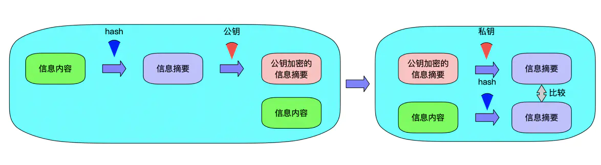
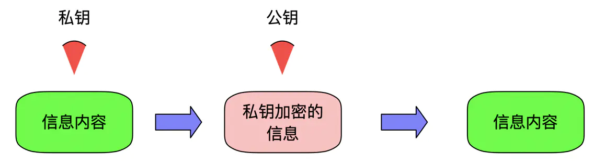

# 对称加密
通信双方的密钥相同，双方怎么获得相同的密钥。对称加密算法DES、3DES、AES。
# 非对称加密
公开密钥加密，公私钥机制。公钥是对外开放的，私钥自己拥有，公钥机密的数据，只能私钥解密。私钥加密的数据，只能用公钥解密。

- 信息的保密性
- 信息的完整性
- 身份识别

# 信息的保密性(机密算法)
信息的保密性我们可以使用对称加密和非对称加密来完成，使用对称加密来完成，速度相对非对称加密很快，但是存在一个安全问题，密钥如何传递？由此通用的方法是使用非对称加密+对称加密来完成。客户端使用公钥对对称加密的密钥进行加密，然后传递给服务端，服务端使用私钥进行解密确认密钥，开始传输数据。

# 信息的完整性(数字签名)
信息传输的途中，信息有可能被第三方劫持篡改，需要保证信息的完整性。通用方法是使用散列算法SHA1，MD5将传输内容hash一次获得hash值，即摘要。客户端使用服务端的公钥对摘要和信息内容进行加密，然后传输给服务端，服务端使用私钥进行解密获得原始内容和摘要值，服务端使用相同的hash算法对原始内容进行hash，然后与摘要值比对，如果一致，说明信息是完整的。

# 身份识别(数字证书)
在信息传输的过程中，通常需要验证信息的发送方的身份。这时，把发送端的公钥发送给接收端，发送端通过把自己的内容使用私钥加密然后发送给接收端，接收端只能用发送端的公钥解密，自然就验证了发送端的身份。

# 数字证书
传输的过程中，客户端如何获得服务器端的公钥呢？