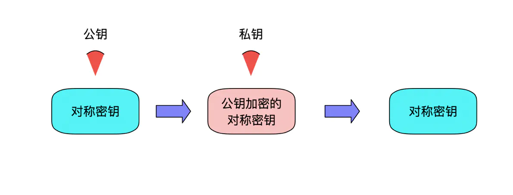

# 对称加密
通信双方的密钥相同，双方怎么获得相同的密钥。对称加密算法DES、3DES、AES。
# 非对称加密
公开密钥加密，公私钥机制。公钥是对外开放的，私钥自己拥有，公钥机密的数据，只能私钥解密。私钥加密的数据，只能用公钥解密。

- 信息的保密性
- 信息的完整性
- 身份识别

# 信息的保密性(机密算法)
信息的保密性我们可以使用对称加密和非对称加密来完成，使用对称加密来完成，速度相对非对称加密很快，但是存在一个安全问题，密钥如何传递？由此通用的方法是使用非对称加密+对称加密来完成。客户端使用公钥对对称加密的密钥进行加密，然后传递给服务端，服务端使用私钥进行解密确认密钥，开始传输数据。

