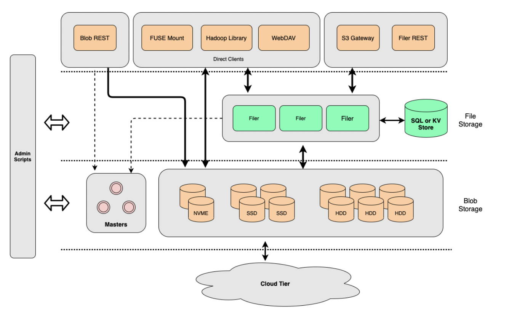

[TOC]

让云存储更便宜，更快。为了减少API的消耗以及传输消耗，减少读写延迟，你可以构建一个Seaweedfs集群做云存储。
# 组件
SeaweedFS包含3个概念性的组件：
- master service，提供分布式的对象存储，用户可以配置复制与副本等；
- volume service，提供分布式的对象存储；用户可以配置复制与副本等机制;
- 可选的filer与s3service是对象存储之上的额外的组件。
这些组件服务都可以运行在不同的服务器上，也可以运行在一个或者不同的实例中。
## Master service
轻量级运行，它标识seaweedfs集群，并且与集群中的所有的参与者通信，通过Raft协议选举一个leader。master服务的数量必须是奇数的，这会确保选举总能达成共识，master服务的数量最好不要太多。
leader是通过raft协议定期选举得到的，负责分配文件id，指定存储的volume，也会决定哪些节点是集群的一部分。fs中的所有的volume都向leader发送心跳，leader根据volume的状态发送文件存储请求。
## Volume service
实际的文件存储服务，它把很多的对象（比如文件或者文件快）打包成一个大的独立的卷，卷可以是任意大小的，数据复制与副本是在卷的层面的，而不是对象层面。
## Filer service
filer服务是做增强服务的。
它会组织fs的卷与对象到机器上的文件系统中，Filer提供了方面的对与对象的操作，比如按照文件系统的方式操作对象，也提供了web APIs用于上传与下载。
## S3 service
提供了对AWS的S3桶的支持。
## Volume
fs中的卷实际就是一个较大的文件，里面包含了很多的小文件，当master启动时，会配置卷的大小，缺省是30GB，并且启动时会初始化8个卷，每个卷都有自己的ttl与复制机制。
## Collection
每个集合实际是卷的分组，最开始，如何集合中没有卷，就回创建一个卷，集合删除很快，只是简单的把卷从集合中移除。
# Getting Started
## 安装Seaweedfs
下载github中release中的包
解压出weed可执行程序。
``` weed -h``` 查看可用的选项；
``` weed master -h``` 查看master的可用的选项；
如果不需要复制机制，这也足够了，使用mdir选项配置生成的顺序文件ID保存的路径。
```weed master -mdir="."```
```weed master -mdir="." -ip=xxx.xxx.xxx.xxx``` 指定IP，默认是localhost
设置volume service
```weed volume -h```
通常volume server分布在不同的机器上，你可以指定可用的disk space master服务的地址与存储的目录
```weed volume -max=100 -mserver="localhost:9333" -dir="./data"```
可以吧master与volume放在一个实例中启动
```weed server -master.port=9333 -volume.port=8080 -dir="./data"```
master与volume安装好了后，使用以下命令测试
```weed upload -dir="/some/big/folder"```
上面的命令会递归的上传所有的文件，你可以指定一些包含规则
```weed upload -dir="/some/big/folder" -include=*.txt```
## 以Docker的方式运行
# Master Server API
所有的API都可以通过加上&pretty=y的参数来格式化json输出。
- 分配一个文件key，
```shell
curl 'yuhan.bestzyx.com:9333/dir/assign?pretty=y'
```
返回的结果
| Parameter | 描述 | 默认值 |
|:-|:-|:-|
|count|分配了多少个文件ID，使用\<fid>_1,<fid_2>的方式表示多个文件ID|1|
|collection|集合的名字|empty|
|dataCenter||empty|
|rack||empty|
|dataNode|volume server地址|empty|
|replication|复制替换策略|默认|
|ttl|文件过期设置，m，h，d,w,m,y|never expire|
|preallocate|如果没有配置的卷，在新的卷上预先分配preallocate大小的空间|master preallocateSize|
|memoryMapMaxSizeMb||0|
|writableVolumeCount|创建新的卷的个数|master preallocateSize|
- 查询volume的内容
```shell
curl "http://localhost:9333/dir/lookup?volumeId=3&pretty=y"
{
  "locations": [
    {
      "publicUrl": "localhost:8080",
      "url": "localhost:8080"
    }
  ]v
}
# Other usages:
# You can actually use the file id to lookup, if you are lazy to parse the file id.
curl "http://localhost:9333/dir/lookup?volumeId=3,01637037d6"
# If you know the collection, specify it since it will be a little faster
curl "http://localhost:9333/dir/lookup?volumeId=3&collection=turbo"
```
可以使用的相关的参数
|Parameter|Description|Default|
|:---|:---|:---|
|volumeId|volume id|empty|
|collection|optional|empty|
|fileId|如果提供了文件ID，会返回文件ID的位置以及一个用于删除与更新文件的JWT|empty|
|read|与fileId共同工作，如果read=yes，会生成用于读的JWT|empty|
- 强制垃圾回收，如果你的系统做了很多次的删除操作，删除文件的磁盘空间不会被同步释放，会有一个后台的任务检查卷的磁盘使用情况，如果空闲空间小于阈值，默认是0.3也就是30%，vavuum任务会使得卷成为只读的，使用留下的文件创建一个新的卷并切换到新的卷，当前垃圾回收是在master节点硬编码的，每15分钟执行一次.
```shell
curl "http://localhost:9333/vol/vacuum"
curl "http://localhost:9333/vol/vacuum?garbageThreshold=0.4"
```
可以使用的参数
|Parameter|Description|Default|
|:---|:---|:---|
|garbageThreshold|minimum garbage ratio|0.3|
- Pre-Allocate Volumes，一个卷的写入操作时串行的，如果你想要提高并发度，你可以预先分配大量的卷，下面是例子
```shell
# specify a specific replication
curl "http://localhost:9333/vol/grow?replication=000&count=4"
{"count":4}
# specify a collection
curl "http://localhost:9333/vol/grow?collection=turbo&count=4"
# specify data center
curl "http://localhost:9333/vol/grow?dataCenter=dc1&count=4"
# specify ttl
curl "http://localhost:9333/vol/grow?ttl=5d&count=4"
```
|Parameter|Description|Default|
|:---|:---|:---|
|count|需要增加多少个卷|required|
|collection|需要集合的名字|empty|
|dataCenter|优先使用的数据中心|empty|
|rack|优先使用的rack|empty|
|dataNode|优先使用的卷的服务器|empty|
|replication|复制策略||
|ttl|文件过期时间设置|永不过期|
|preallocate|为新的卷预分配磁盘空间|master -volumePreallocate|
|memoryMapMaxSizeMb||0|
- 删除集合
```shell
 # delete a collection
curl "http://localhost:9333/col/delete?collection=benchmark&pretty=y"
```
- 检查系统状态
```shell
curl "http://10.0.2.15:9333/cluster/status?pretty=y"
{
  "IsLeader": true,
  "Leader": "10.0.2.15:9333",
  "Peers": [
    "10.0.2.15:9334",
    "10.0.2.15:9335"
  ]
}
```
- 检查卷的状态
```shell
curl "http://localhost:9333/dir/status?pretty=y"
{
  "Topology": {
    "DataCenters": [
      {
        "Free": 3,
        "Id": "dc1",
        "Max": 7,
        "Racks": [
          {
            "DataNodes": [
              {
                "Free": 3,
                "Max": 7,
                "PublicUrl": "localhost:8080",
                "Url": "localhost:8080",
                "Volumes": 4
              }
            ],
            "Free": 3,
            "Id": "DefaultRack",
            "Max": 7
          }
        ]
      },
      {
        "Free": 21,
        "Id": "dc3",
        "Max": 21,
        "Racks": [
          {
            "DataNodes": [
              {
                "Free": 7,
                "Max": 7,
                "PublicUrl": "localhost:8081",
                "Url": "localhost:8081",
                "Volumes": 0
              }
            ],
            "Free": 7,
            "Id": "rack1",
            "Max": 7
          },
          {
            "DataNodes": [
              {
                "Free": 7,
                "Max": 7,
                "PublicUrl": "localhost:8082",
                "Url": "localhost:8082",
                "Volumes": 0
              },
              {
                "Free": 7,
                "Max": 7,
                "PublicUrl": "localhost:8083",
                "Url": "localhost:8083",
                "Volumes": 0
              }
            ],
            "Free": 14,
            "Id": "DefaultRack",
            "Max": 14
          }
        ]
      }
    ],
    "Free": 24,
    "Max": 28,
    "layouts": [
      {
        "collection": "",
        "replication": "000",
        "writables": [
          1,
          2,
          3,
          4
        ]
      }
    ]
  },
  "Version": "0.47"
}
```
# Volume Server API
你可以在所有的http的api后面追加&pretty=y来格式化json的输出。
- 读卷
GET或者HEAD+文件ID可以用来读卷的内容
```shell
curl http://127.0.0.1:8080/3,01637037d6
```
|URL参数｜描述｜默认值
|:---|:---|:---|
|readDeleted|如果是true，就是读一个删除的文件，如果卷服务器重启了或者被压缩了，则读取不到|false|
|width|如果存储的文件是图片类的会设置它的宽度|empty|
|height|如果存储的文件是图片类的会设置它的高度|empty|

 请求头的设置
 |头|描述|默认值|
 |:---|:---|:---|
 |Authorization|JWT|empty|
 |Range|||
 |if-Modified-Since|format "Mon, 02 Jan 2006 15:04:05 GMT", if not modified, return StatusNotModified 304|empty|
 |if-None-Match|如果匹配了Etag，返回304|empty|
 |Accept-Encoding:gzip|通过gzip压缩响应|empty|
 - 卷的写入
 ```shell
 curl -F file=@/home/chris/myphoto.jpg http://127.0.0.1:8080/3,01637037d6
{"size": 43234}
 ```
 返回的size是seaweedFS上的大小，有时候文件会被gzip压缩存储.
 |Parameter|描述|默认值|
 |:---|:---|:---|
 |fsync|如果设置为true，以同步方式写入磁盘|false|
 |type|如果是replicate，那么它是一个复制请求|empty|
 |ts|修改的时间戳|empty|
 |cm|内容是块文件|empty|

 header的信息
 |Header|描述|默认值|
 |:---|:---|:---|
 |Content-Encoding:gzip|上传的内容早已经被压缩成gzip类型了|empty|
 |Content-Type|使用指定的内容类型|application/octet-stream|
 |content-MD5|指定上传内容的md5，md5编码需要使用base64编码|empty|
 |Authorization|JWT master颁发的|empty|
 |Seaweed-xxxx|key-value对，自定义的|empty|
 - 直接上传文件
 ```shell
 curl -F file=@/home/chris/myphoto.jpg http://localhost:9333/submit
{"fid":"3,01fbe0dc6f1f38","fileName":"myphoto.jpg","fileUrl":"localhost:8080/3,01fbe0dc6f1f38","size":68231}
 ```
 这是一个快捷的api，master server会生成一个file id，并根据id存储文件到一个合适的volume服务器上。
 - 删除文件
 ```shell
 curl -X DELETE http://127.0.0.1:8080/3,01637037d6
 ```
 - 查看文件清单
 ```shell
 curl http://127.0.0.1:8080/3,01637037d6?cm=false
 ```
 - 查看Volume服务器的状态
 ```shell
 curl "http://localhost:8080/status?pretty=y"
{
  "Version": "0.34",
  "Volumes": [
    {
      "Id": 1,
      "Size": 1319688,
      "RepType": "000",
      "Version": 2,
      "FileCount": 276,
      "DeleteCount": 0,
      "DeletedByteCount": 0,
      "ReadOnly": false
    },
    {
      "Id": 2,
      "Size": 1040962,
      "RepType": "000",
      "Version": 2,
      "FileCount": 291,
      "DeleteCount": 0,
      "DeletedByteCount": 0,
      "ReadOnly": false
    },
    {
      "Id": 3,
      "Size": 1486334,
      "RepType": "000",
      "Version": 2,
      "FileCount": 301,
      "DeleteCount": 2,
      "DeletedByteCount": 0,
      "ReadOnly": false
    },
    {
      "Id": 4,
      "Size": 8953592,
      "RepType": "000",
      "Version": 2,
      "FileCount": 320,
      "DeleteCount": 2,
      "DeletedByteCount": 0,
      "ReadOnly": false
    },
    {
      "Id": 5,
      "Size": 70815851,
      "RepType": "000",
      "Version": 2,
      "FileCount": 309,
      "DeleteCount": 1,
      "DeletedByteCount": 0,
      "ReadOnly": false
    },
    {
      "Id": 6,
      "Size": 1483131,
      "RepType": "000",
      "Version": 2,
      "FileCount": 301,
      "DeleteCount": 1,
      "DeletedByteCount": 0,
      "ReadOnly": false
    },
    {
      "Id": 7,
      "Size": 46797832,
      "RepType": "000",
      "Version": 2,
      "FileCount": 292,
      "DeleteCount": 0,
      "DeletedByteCount": 0,
      "ReadOnly": false
    }
  ]
}

 ```
 # Filer服务的API
 - POST/PUT/GET 文件
 ```shell
 # Basic Usage:
	//create or overwrite the file, the directories /path/to will be automatically created
	POST /path/to/file
	PUT /path/to/file
	//create or overwrite the file, the filename in the multipart request will be used
	POST /path/to/
	//create or append the file
	POST /path/to/file?op=append
	PUT /path/to/file?op=append
	//get the file content
	GET /path/to/file
	//return a json format subdirectory and files listing
	GET /path/to/
        Accept: application/json
# options for POST a file:
	// set file TTL
	POST /path/to/file?ttl=1d
	// set file mode when creating or overwriting a file
	POST /path/to/file?mode=0755
 ```
 |Parameter|描述|默认值|
 |:---|:---|:---|
 |dataCenter|数据中心|empty|
 |rack|rack|empty|
 |collection|collection|empty|
 |replication|replication|empty|
 |ttl|存活时间，3m、4h、5d、6w、7M、8y|empty|
 |maxMB|最大的块大小|empty|
 |mode|文件模式|0660|
 |op|文件操作，支持append|empty|
 |header: Content-Type|用来自动压缩|empty|
 |header: Seaweed-xxxxx|自定义的header|empty|
 注意的点：
      - 当向Filer写文件时，建议要有重试的策略；
      - PUT不支持自动分块，如果超过256MB，只有前面的256MB会被存储;
      - 当向文件追加时，每一次的追加都会创建一个文件块，并加到文件的元数据中，如果有太多的小的追加，就会有很多小的块。
      ```shell
      # Basic Usage:
> curl -F file=@report.js "http://localhost:8888/javascript/"
{"name":"report.js","size":866,"fid":"7,0254f1f3fd","url":"http://localhost:8081/7,0254f1f3fd"}
> curl  "http://localhost:8888/javascript/report.js"   # get the file content
> curl -I "http://localhost:8888/javascript/report.js" # get only header
...
> curl -F file=@report.js "http://localhost:8888/javascript/new_name.js"    # upload the file to a different name
{"name":"report.js","size":5514}
> curl -T test.yaml http://localhost:8888/test.yaml                         # upload file by PUT
{"name":"test.yaml","size":866}
> curl -F file=@report.js "http://localhost:8888/javascript/new_name.js?op=append"    # append to an file
{"name":"report.js","size":5514}
> curl -T test.yaml http://localhost:8888/test.yaml?op=append                         # append to an file by PUT
{"name":"test.yaml","size":866}
> curl -H "Accept: application/json" "http://localhost:8888/javascript/?pretty=y"            # list all files under /javascript/
curl -H "Accept: application/json" "http://localhost:8888/javascript/?pretty=y"
{
  "Path": "/javascript",
  "Entries": [
    {
      "FullPath": "/javascript/jquery-2.1.3.min.js",
      "Mtime": "2020-04-19T16:08:14-07:00",
      "Crtime": "2020-04-19T16:08:14-07:00",
      "Mode": 420,
      "Uid": 502,
      "Gid": 20,
      "Mime": "text/plain; charset=utf-8",
      "Replication": "000",
      "Collection": "",
      "TtlSec": 0,
      "UserName": "",
      "GroupNames": null,
      "SymlinkTarget": "",
      "Md5": null,
      "Extended": null,
      "chunks": [
        {
          "file_id": "2,087f23051201",
          "size": 84320,
          "mtime": 1587337694775717000,
          "e_tag": "32015dd42e9582a80a84736f5d9a44d7",
          "fid": {
            "volume_id": 2,
            "file_key": 2175,
            "cookie": 587534849
          },
          "is_gzipped": true
        }
      ]
    },
    {
      "FullPath": "/javascript/jquery-sparklines",
      "Mtime": "2020-04-19T16:08:14-07:00",
      "Crtime": "2020-04-19T16:08:14-07:00",
      "Mode": 2147484152,
      "Uid": 502,
      "Gid": 20,
      "Mime": "",
      "Replication": "000",
      "Collection": "",
      "TtlSec": 0,
      "UserName": "",
      "GroupNames": null,
      "SymlinkTarget": "",
      "Md5": null,
      "Extended": null
    }
  ],
  "Limit": 100,
  "LastFileName": "jquery-sparklines",
  "ShouldDisplayLoadMore": false
}
```
- 更新于删除文件的tag
```shell
# put 2 pairs of meta data
curl -X PUT -H "Seaweed-Name1: value1" -H "Seaweed-some: some string value" http://localhost:8888/path/to/a/file?tagging
# read the meta data from HEAD request
curl -I "http://localhost:8888/path/to/a/file"
...
Seaweed-Name1: value1
Seaweed-Some: some string value
...
# delete all "Seaweed-" prefixed meta data
curl -X DELETE http://localhost:8888/path/to/a/file?tagging
# delete specific "Seaweed-" prefixed meta data
curl -X DELETE http://localhost:8888/path/to/a/file?tagging=Name1,Some
```
|Method|Request|Header|Operation|
|:---|:---|:---|:---|
|PUT|\<file_url>?tagging|Seaweed前缀的header|设置元数据|
|DELETE|\<file_url>?tagging||remove all the "Seaweed-" prefixed header|
|DELETE|\<file_url>?tagging=Some,Name||remove the headers "Seaweed-Some", "Seaweed-Name"|
- 创建一个空的文件夹
上传文件时，文件夹是自动创建的，创建一个空的文件夹的方式
```shell
curl -X POST "http://localhost:8888/test/"
```
- 列出一个目录下的所有的文件
有的文件夹可能是非常大的，为了有效的列出文件，我们使用了非传统的方式迭代文件，每次分页都可以提供额外的2个参数
lastFileName或者limit=x，filer会在log(n)的时间内定位到lastFileName的文件位置，返回接下来的x个文件
```shell
curl -H "Accept: application/json" "http://localhost:8888/javascript/?pretty=y&lastFileName=jquery-2.1.3.min.js&limit=2"
{
  "Path": "/javascript",
  "Entries": [
    {
      "FullPath": "/javascript/jquery-sparklines",
      "Mtime": "2020-04-19T16:08:14-07:00",
      "Crtime": "2020-04-19T16:08:14-07:00",
      "Mode": 2147484152,
      "Uid": 502,
      "Gid": 20,
      "Mime": "",
      "Replication": "000",
      "Collection": "",
      "TtlSec": 0,
      "UserName": "",
      "GroupNames": null,
      "SymlinkTarget": "",
      "Md5": null,
      "Extended": null
    }
  ],
  "Limit": 2,
  "LastFileName": "jquery-sparklines",
  "ShouldDisplayLoadMore": false
}
```
|Parameter|描述|默认值|
|limit|显示|100|
|lastFileName|上一批的最后一个文件的文件名|empty|
|namePattern|筛选文件名,大小写敏感，可以使用通配符*与?|empty|
|namePatternExclude|namePattern的反|empty|
- 支持的文件模式
大小写敏感
|Pattern|匹配|
|:---|:---|
|*|任何文件|
|*.jpg|abc.jpg|
|a*.jp*g|abc.jpg, abc.jpeg|
|a*.jp?g|abc.jpeg|
- 删除
   - 删除文件
   ```shell
    curl -X DELETE http://localhost:8888/path/to/file
   ```
   - 删除文件夹
   ```shell
   // recursively delete all files and folders under a path
    > curl -X DELETE http://localhost:8888/path/to/dir?recursive=true
    // recursively delete everything, ignoring any recursive error
    > curl -X DELETE http://localhost:8888/path/to/dir?recursive=true&ignoreRecursiveError=true
    // For Experts Only: remove filer directories only, without removing data chunks. 
    // see https://github.com/chrislusf/seaweedfs/pull/1153
    > curl -X DELETE http://localhost:8888/path/to?recursive=true&skipChunkDeletion=true
   ```

|Parameter|描述|默认值|
|:---|:---|:---|
|recursive|是否递归的删除文件夹|filer.toml|
|ignoreRecursiveError|忽略递归删除中的错误|false|
|skipChunkDeletion|只删除文件目录不删除文件块|false|


# 客户端库
## GRPC APIs
SeaweedFS内部使用GRPC通信，你可以使用这些GRPC的APIs，
这里是[https://github.com/chrislusf/seaweedfs/tree/master/weed/pb](https://github.com/chrislusf/seaweedfs/tree/master/weed/pb) pb文件地址.
当开发兼容HDFS的系统时，可以使用seaweedfs做底层实现，GRPC客户端的java实现版本已经开发了
[https://mvnrepository.com/artifact/com.github.chrislusf/seaweedfs-client]( https://mvnrepository.com/artifact/com.github.chrislusf/seaweedfs-client)

## 使用SeaweedFS的项目
lua-resty-weedfs，nginx后端，文件会使用ffmpeg与graphicsmagick处理;
# SeaweedFS Java Client
之前存在几个Java的客户端，但实际上，SeaweedFS早就支持兼容Hadoop的文件系统，这里是SeaweedFS的JavaAPI实现
[https://github.com/chrislusf/seaweedfs/tree/master/other/java/examples/src/main/java/com/seaweedfs/examples](https://github.com/chrislusf/seaweedfs/tree/master/other/java/examples/src/main/java/com/seaweedfs/examples)
## 创建jar包
```shell
$cd $GOPATH/src/github.com/chrislusf/seaweedfs/other/java/client
$ mvn install
```
maven的形式如下：
```xml
<dependency>
  <groupId>com.github.chrislusf</groupId>
  <artifactId>seaweedfs-client</artifactId>
  <version>1.6.4</version>
</dependency>
```
你也可以从mven的仓库中直接下载最新的版本。
记住：当创建一个FilerClient对象的时候，默认的grpc端口是18888，当启动filer时，
`weed filer -port=8888`，8888就是默认的http端口。
```java
  FilerClient filerClient = new FilerClient("localhost", 18888);
```
## 读文件
```java
 FilerClient filerClient = new FilerClient("localhost", 18888);
  SeaweedInputStream seaweedInputStream = new SeaweedInputStream(filerClient, "/test.zip");
  // next, you can use seaweedInputStream as a normal InputStream
```
## 写文件
```java
  FilerClient filerClient = new FilerClient("localhost", 18888);
  SeaweedOutputStream seaweedOutputStream = new SeaweedOutputStream(filerClient, "/test/"+filename);
  // next, you can use seaweedOutputStream as a normal OutputStream

```
## 观察文件变更
```java
        FilerClient filerClient = new FilerClient("localhost", 18888);

        long sinceNs = (System.currentTimeMillis() - 3600 * 1000) * 1000000L;

        Iterator<FilerProto.SubscribeMetadataResponse> watch = filerClient.watch(
                "/buckets",
                "exampleClientName",
                sinceNs
        );

        System.out.println("Connected to filer, subscribing from " + new Date());

        while (watch.hasNext()) {
            FilerProto.SubscribeMetadataResponse event = watch.next();
            FilerProto.EventNotification notification = event.getEventNotification();
            if (!event.getDirectory().equals(notification.getNewParentPath())) {
                // move an entry to a new directory, possibly with a new name
                if (notification.hasOldEntry() && notification.hasNewEntry()) {
                    System.out.println("moved " + event.getDirectory() + "/" + notification.getOldEntry().getName() + " to " + notification.getNewParentPath() + "/" + notification.getNewEntry().getName());
                } else {
                    System.out.println("this should not happen.");
                }
            } else if (notification.hasNewEntry() && !notification.hasOldEntry()) {
                System.out.println("created entry " + event.getDirectory() + "/" + notification.getNewEntry().getName());
            } else if (!notification.hasNewEntry() && notification.hasOldEntry()) {
                System.out.println("deleted entry " + event.getDirectory() + "/" + notification.getOldEntry().getName());
            } else if (notification.hasNewEntry() && notification.hasOldEntry()) {
                System.out.println("updated entry " + event.getDirectory() + "/" + notification.getNewEntry().getName());
            }
        }

```
##  标准文件操作
```java
  FilerClient filerClient = new FilerClient("localhost", 18888);

  List<FilerProto.Entry> entries = filerClient.listEntries("/");

  for (FilerProto.Entry entry : entries) {
      System.out.println(entry.toString());
  }

  filerClient.mkdirs("/new_folder", 0755);
  filerClient.touch("/new_folder/new_empty_file", 0755);
  filerClient.touch("/new_folder/new_empty_file2", 0755);
  filerClient.rm("/new_folder/new_empty_file", false, true);
  filerClient.rm("/new_folder", true, true);

```
## 高级用法
```java
  // load existing entry
  FilerProto.Entry entry = filerClient.lookupEntry("/some/dir","entryName");

  // change the attribute
  FilerProto.Entry.Builder entryBuilder = FilerProto.Entry.newBuilder(entry);
  FilerProto.FuseAttributes.Builder attrBuilder = FilerProto.FuseAttributes.newBuilder(entry.getAttributes());
  attrBuilder.setMtime(...)

  // save the new entry
  entryBuilder.setAttributes(attrBuilder);
  filerClient.updateEntry("/some/dir", entryBuilder.build());
```
# 复制
SeaweedFS可以支持复制，复制是基于volume实现不是文件级别.
基本的用法如下:
- 启动weed master，可选的指定复制类型
>#001 means for each file a replica will be created in the same rack
>./weed master -defaultReplication=001
- 启动volume
>./weed volume -port=8081 -dir=/tmp/1 -max=100 -mserver="master_address:9333" -dataCenter=dc1 -rack=rack1
>./weed volume -port=8082 -dir=/tmp/2 -max=100 -mserver="master_address:9333" -dataCenter=dc1 -rack=rack1

复制类型的表格如下：

|Value|含义|
|:---|:---|
|000|不复制，只有一份数据|
|001|在同一个rack内复制一次|
|010|在同一个dc内的不同的rack内复制一次|
|100|在不同的dc内复制一次|
|200|在2个不同的dc内复制2次|
|110|在一个dc内的不同的rack内复制一次，在不同的dc内复制一次|
如果复制模式是xyz，含义如下:

|Column|Meaning|
|:--- |:---|
|x|在其他的dc内的复制数量|
|y|number of replica in other racks in the same data center|
|z|number of replica in other servers in the same rack|

x\y\x可以是0，1，2；所以存在9种可能的类型，非常方便扩展，每一种复制类型将会创建x+y+z+1份volume的拷贝.
## 在特定的数据中心上分配File Key
现在当请求一个文件key的时候，dataCenter参数可以限制分配的volume是特定的data center的，如下:
> http://localhost:9333/dir/assign?dataCenter=dc1

## Write and Read
对于读写操作的一致性来说，W=N，R=1，也就是写入操作必须保证N个副本都写入成功，如果一个副本写入操作失败，那么整个写入失败，这使得读比较快速方便，因为读任意一个副本就可以，不需要比较数据是否一致，对于写入失败的操作，有些节点可能写入成功了，那么这些节点的内容应该删掉，因为volume是追加方式写入的，所以物理volume的大小可能优点违反直觉.当一个客户端请求写入时，流程如下:
- 客户端发送一个同步请求到master并获得一个fid;
- master接收到同步请求，选择一个volume server来处理;
- 客户端发送写入请求到其中一个volume服务器，并等待ACK;
- volumme持久化存储文件，根据需要复制文件;
- 如果一切都OK，那么客户端得到OK相应;
如果写入是对filer的，在步骤1之前还有一个步骤，filer在步骤1～5就是客户端的角色.如果一个副本丢失了，不会马上自动修复，如果缺少一个副本，则不会立即进行自动修复。 这是为了防止由于临时卷服务器故障或断开连接而导致过度复制。 相反，该卷将变为只读。 对于任何新的写入，只需将不同的文件 ID 分配给不同的卷。要修复丢失的副本，您可以在杂草外壳中使用 volume.fix.replication。
在weed shell中，你可以改变volume的复制相关的设置，通过`volume.configure.replication`配置。
# Store file with Time To Live


