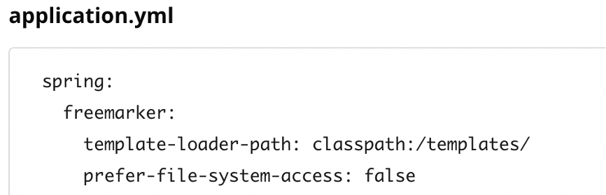
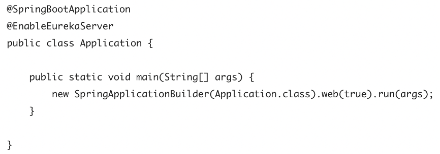
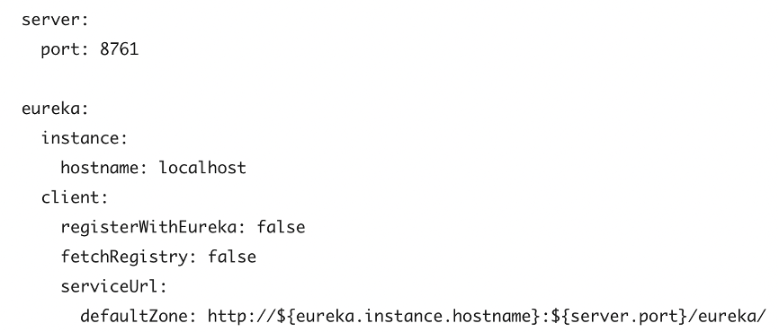
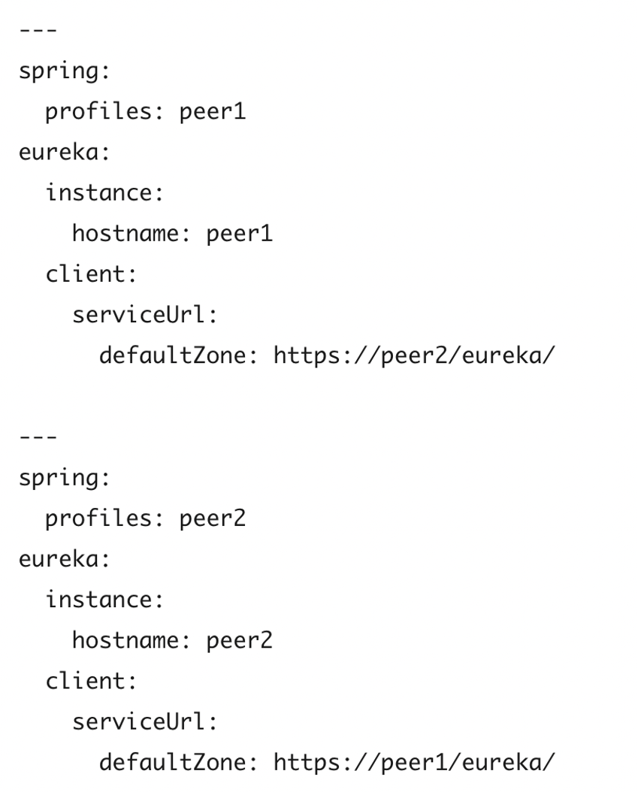
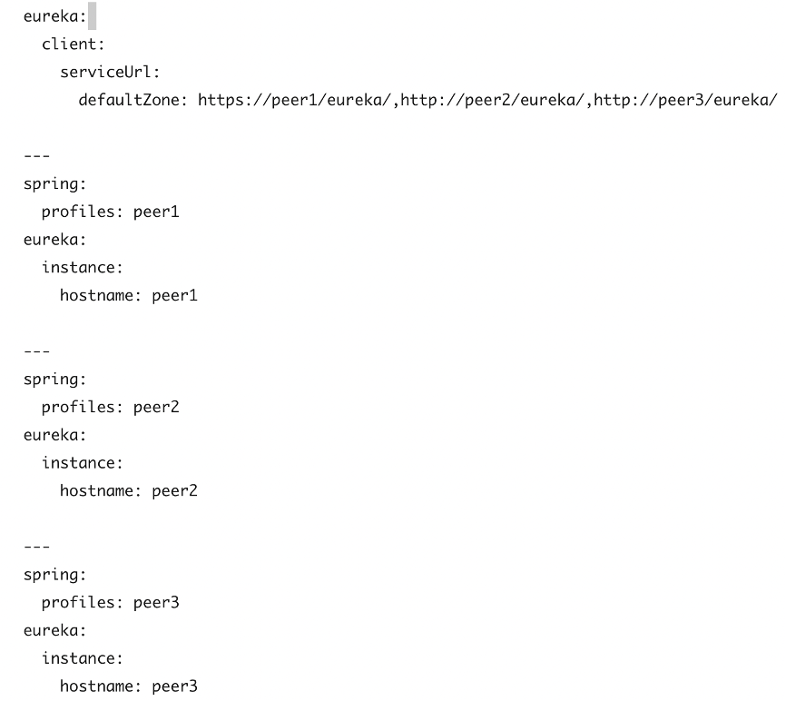
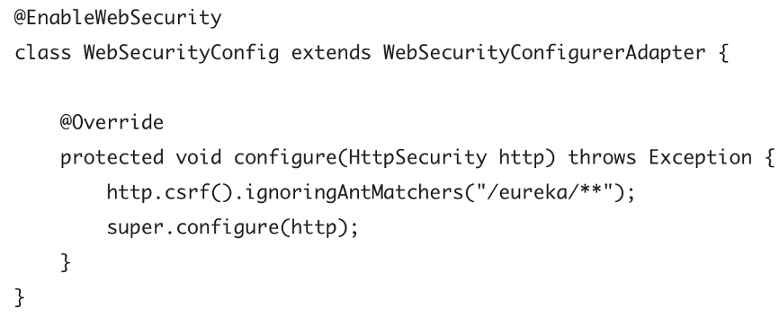

这个工程集成了Netflix开源软件，完成了netflix的自动配置并且绑定到Spring环境，可以使用Spring的编程特性开发，通过几个简单的注解，你就可以快速开启相关的功能并配置一些通用的模式，提供的模式包括服务发现、（CB）断路器、智能路由（Zuul）、与客户端负载均衡（Ribbon）。
# 服务发现：Eureka客户端

# 服务发现：Eureka服务器
## 如何包含Eureka Server
包含Eureka Server只需要在你的工程中添加group id=org.springframework.cloud，artifact id=spring-cloud-starter-netflix-eureka-server的starter，如果你的工程使用Thymeleaf作为模板引擎，Eureka server使用的Freemarker模板引擎可能不能正确加载，在这种情况下，有必要人工配置模板加载器：

## 如何运行一个Eureka Server
启动一个简易的eureka server的方式如下：

server在/eureka/*目录下带有UI与HTTP API的端点。
## 高可用，Zone与Region
Eureka Server没有备份的存储器，注册中的所有的服务实例，必须一直发送心跳，保持他们的注册状态，客户端在内存中也会缓存Eureka的注册信息，所以没有必要每次访问服务时都去注册中心获取服务信息；缺省情况下，每个Eureka Server也是一个Eureka客户端，需要一个服务的URL用来定位对等服务，如果你没有提供，服务运行后，会打印很多日志，反应不能注册为对等实体
## 单体模式
只要有某种监视器或弹性运行时（例如Cloud Foundry），两个缓存（客户端和服务器）和心跳的组合就可以使独立的Eureka服务器对故障具有相当的恢复能力；在独立模式下，您可能希望关闭客户端行为，以使其不会继续尝试连接对等对象或者连接不到时持续报错。单体模式的配置如下：

请注意，serviceUrl指向与本地实例相同的主机。
## 对等感知
通过运行多个实例并要求它们相互注册，可以使Eureka更具弹性并可以使用。实际上，这是默认行为，因此要使其正常工作，您需要做的就是向对等方添加一个有效的serviceUrl，如以下示例所示：

在这个例子中，我们使用了一个YAML文件，通过Profiles的方式可以在2台不同的机器上运行同样的服务，你可以使用这个配置在单一的机器上测试对等感知的功能，事实上，如果机器知道它自己的hostname，那么eureka.instance.hostname是不需要的；你能向系统中添加更多的对等实体，只要他们是互相连通的，他们就会相互同步注册信息，如果对等实体是物理隔离的，原则上来讲，是可以避免脑裂的，除非所有的连接都断开，如下：

## 什么时候使用IP地址
在某些情况下，eureka使用服务的IP地址比使用hostname更合适，设置eureka.instance.preferIpAddress=true，当服务向eureka注册时，它会使用IP地址而不是hostname，如果java无法是被hostname，IP地址就会发送到eureka，只有设置了eureka.instance.hostname属性的值才算明确设定了hostname，你可以在运行时通过设置属性来设置hostname。
## 保护eureka server
你可以通过添加Spring security的方式保护eureka server，缺省情况下，spring secutiy会要求每个请求都带有一个有效的CSR证书，Eureka客户端通常没有这个证书，所以在/eureka/**站点，你需要关闭CSRF检测，如下：

# 属性配置
在附录中