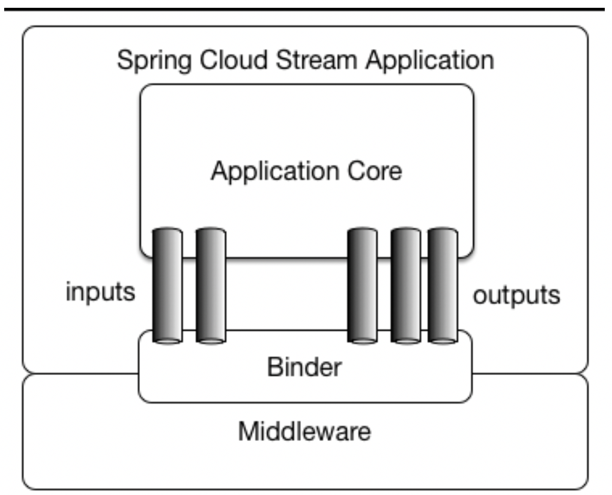
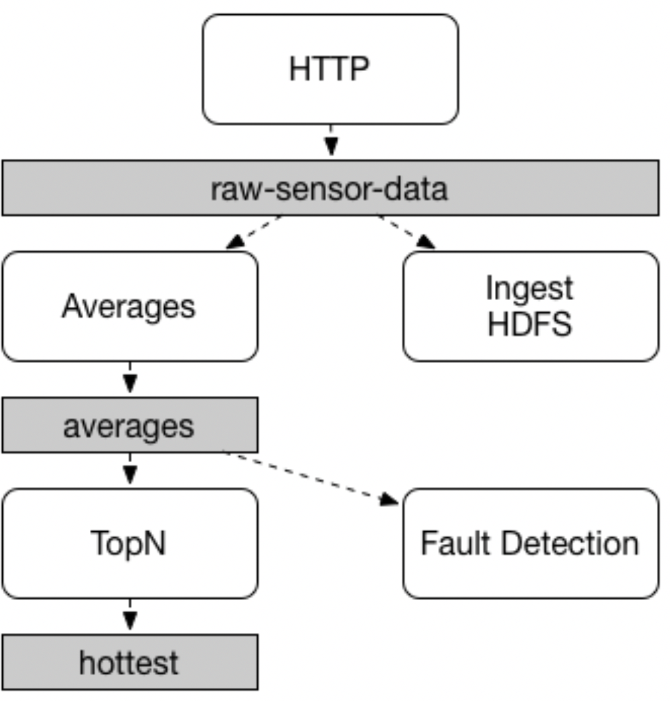
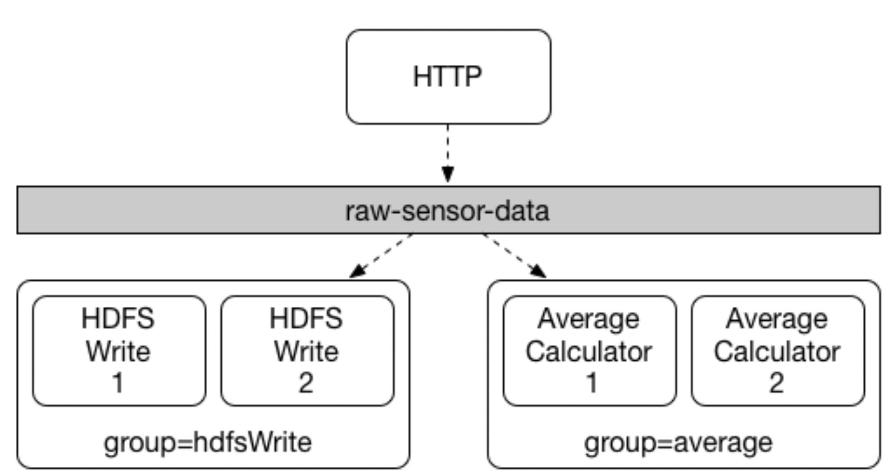
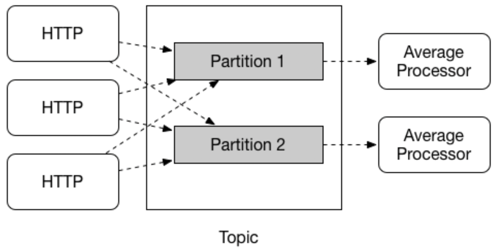
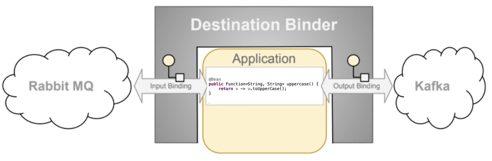
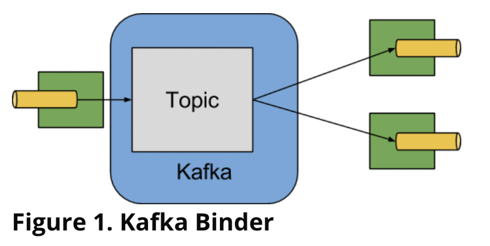

[TOC]
# 前言
## SDI（spring data integration）的简短的历史
数据整合开始于Spring Integration项目，它可以使用Spring编程模型提供的一致的开发体验来构造企业级的整合应用，这种整合遵循一定的模式，按照模式，可以连接很对外部的系统，比如数据库，消息中心或者其他的系统。
随着云时代的到来，企业级应用中逐渐转变成微服务的形式，Spring Boot项目大大提高了开发者开发引用的效率；使用Spring的编程模型以及Spring Boot的运行时责任托管，开发生产级别的基于Spring的微服务就成为自然而然的选择。
为了让Spring整合数据集成的工作，Spring Integration与Spring Boot项目组合起来变成了一个新的项目Spring Cloud Stream。
使用Spring Cloud Stream，开发者可以：
- 独立构建、测试、部署以数据为中心的应用;
- 应用现代的微服务架构模式，特别是使用消息系统整合应用;
- 使用事件机制解耦应用责任，一个事件可以表示某个时间发生的某件事情，下游的消费应用可以在不知到事件起源的情况对事件作出响应;
- 将业务逻辑移植到消息节点上;
- 依靠框架对常见用例的自动内容类型支持。 可以扩展到不同的数据转换类型;
## 快速开始
你可以在5分钟内通过3个步骤快速的熟悉Spring Cloud Stream。我们会向你展示如何创建一个Spring Cloud Stream应用，这个应用可以接受来自消息中间件的消息并打印消息，我们叫它LoggingConsumer，当然这个消费者不具有实际的意义，但是通过它，我们可以快速了解一些主要的概念与对象的定义，对于后续章节的阅读帮助很大.
3个步骤是：
- 使用Spring Initializer创建一个简单的应用;
- 导入应用到你的IDE
- 添加消息处理器，构建&运行。
### 使用Spring Initializer创建一个简单的应用
### 导入应用到你的IDE
### 添加消息处理器，构建&运行
```java
@SpringBootApplication
public class LoggingConsumerApplication {

	public static void main(String[] args) {
		SpringApplication.run(LoggingConsumerApplication.class, args);
	}

	@Bean
	public Consumer<Person> log() {
	    return person -> {
	        System.out.println("Received: " + person);
	    };
	}

	public static class Person {
		private String name;
		public String getName() {
			return name;
		}
		public void setName(String name) {
			this.name = name;
		}
		public String toString() {
			return this.name;
		}
	}
}
```
正如你在上面的列表中看到的：
- 我们正在使用函数式编程模型（可以看[Spring Cloud FUnction suppert](https://docs.spring.io/spring-cloud-stream/docs/3.2.1/reference/html/spring-cloud-stream.html#spring_cloud_function)）来定义一个单个的消息处理器作为Consumer;
- 依赖框架约定，绑定消息处理器到指定的输入地址上;
这使用了框架的一个和行人特性：它会自动把输入的message转换成Person类型的消息体。
# 重要的丢弃
- 基于注解的编程模型，基本上，@EnableBinding、@StreamListener还有其他相关的注解都被遗弃了，现在使用的是函数式编程模型，可以看Spring Cloud Function support章节获取更多的信息;
- Reactive模块（spring-cloud-stream-reactive）停止使用了并且不在分发，使用来了spring-cloud-function的内置支持实现reactive;
- spring-cloud-stream-test-support不在支持了，使用了新的test binder;
- @StreamMessageConverter 不在被使用;
- original-content-type被移除了;
- BinderAwareChannelResolver不在使用，使用了spring.cloud.stream.sendto.destination属性，这主要是为了使用函数式编程模式，对于StreamListener来说，它仍是需要哦的，完全遗弃StreamListener与基于注解的编程模型后，这个类也不会再被使用了.
# 在流数据上下文中使用SpEL
在整个参考文档中，非常多的地方或者案例会使用到SpEL，在使用它前，你需要了解一下SpEL的边界限制。
SpEL 使您可以访问当前消息以及您正在运行的应用程序上下文。但是，了解 SpEL 可以看到什么类型的数据非常重要，尤其是在传入消息的上下文中。来自代理的消息以字节 [] 的形式到达。然后它被绑定器转换为 Message\<byte[]> ，您可以看到消息的有效负载保持其原始形式。消息的标头是 \<String, Object>，其中值通常是一个基本类型的数据或基本类型数据的集合/数组，因此类型是 Object。这是因为 binder并不知道所需的输入类型，因为它无法访问用户代码（函数）。因此，绑定器会接收到带有消息体与消息header的消息，就像通过邮件传递的信件一样。这意味着虽然可以访问消息的有效负载，但您只能以原始数据（即字节 []）的形式访问它。虽然开发人员想要使用SpEL访问作为具体类型（例如 Foo、Bar 等）的有效负载对象的字段的场景可能很常见，但您可以看到实现它是多么困难甚至不可能。这是一个演示问题的示例；想象一下，您有一个路由表达式可以根据负载类型路由到不同的函数。此要求意味着将有效负载从 byte[] 转换为特定类型，然后应用 SpEL。然而，为了执行这样的转换，我们需要知道要传递给转换器的实际类型，而这来自我们不知道是哪一个的函数签名。解决此要求的更好方法是将类型信息作为消息头（例如 application/json;type=foo.bar.Baz ）传递。您将获得一个清晰易读的字符串值，该值可以在一年内访问和评估，并且易于阅读 SpEL 表达式。
另外，使用消息负载做路由决策是不好的实践，因为负载时敏感数据，这种数据只应该被它的最终的接收者读取；而且，如果类比下邮件投递，你不想邮差打开你的信件，通过阅读信件里面的内容来决定投递策略；同样的概念在这里也是适用的，尤其是发送消息相对比较容易包含一些敏感的信息。
# Spring Cloud Stream简介
SCS是一个用于构建消息驱动的微服务应用的框架，SCS基于Spring Boot来构建独立的、生产级别的Spring应用，使用Spring Integration提供连接消息节点的能力，它提供了来自多个供应商的中间件的通用的配置，介绍了持久化的发布订阅语义、消费者组和分区的概念。
通过添加spring-cloud-stream依赖到你应用程序1的classpath下，你可以使用spring-cloud-stream的binder能力来连接到消息节点，你可以实现你自己的函数逻辑，它是以java.util.function.Function的形式运行的。
下面的代码是一个例子：
```java
@SpringBootApplication
public class SampleApplication {

	public static void main(String[] args) {
		SpringApplication.run(SampleApplication.class, args);
	}

    @Bean
	public Function<String, String> uppercase() {
	    return value -> value.toUpperCase();
	}
}
```
下面的列表是相关的测试
```java
@SpringBootTest(classes =  SampleApplication.class)
@Import({TestChannelBinderConfiguration.class})
class BootTestStreamApplicationTests {

	@Autowired
	private InputDestination input;

	@Autowired
	private OutputDestination output;

	@Test
	void contextLoads() {
		input.send(new GenericMessage<byte[]>("hello".getBytes()));
		assertThat(output.receive().getPayload()).isEqualTo("HELLO".getBytes());
	}
}
```
# 主要的概念
SCS提供了很多的抽象与定义来简化编写消息驱动的微服务的应用，这个章节主要讲一下的内容
- SCS引用模型;
- Binder抽象定义;
- 持久化的发布-订阅支持
- 消费者组支持;
- 分片支持;
- 可插拔的Binder SPI
## 应用模型
一个SCS应用由一个中间件中立的核心组成，在应用中通过创建绑定关系与外部系统通信，绑定关系有2方组成，其中一方是外部消息节点暴漏的destination，另一方是代码中的input/output参数，建立绑定所需的消息节点特定细节由特定的Binder中间件实现处理。

scs应用可以以单体的方式运行，为了在生产环境上使用SCS，你可以创建一个Fat JAR。
## Binder抽象
Spring Cloud Stream为Kafka与Rabbit MQ提供了Binder实现，框架也包含一个test binder的实现用于集成测试，可以看Testing章节获得更多详细的信息。Binder抽象也是框架的扩展点之一，这意味着，你可以基于Spring Cloud Stream实现你自己的binder，在[How to create a Spring Cloud Stream Binder from scratch](https://medium.com/@domenicosibilio/how-to-create-a-spring-cloud-stream-binder-from-scratch-ab8b29ee931b)部分有社区成员文档的地址例子等，只需要几个简单的步骤就可以实现一个自定义的binder，详细的步骤在实现自定义的Binders章节。
Spring Cloud Stream使用SpringBoot机制来配置，并且Binder抽象定义让Spring Cloud Stream应用连接中间件更加灵活，比如，开发者可以在运行时动态选择destination与消息处理器的绑定关系，这样的配置可以通过外部配置提供，只要是Spring Boot支持的外部配置方式都可以，在sink例子章节，设置
`spring.cloud.stream.bindings.input.destination=raw-sensor-data`会让引用读取名为raw-sensor-data的kafka topic或者对应的Rabbit
MQ交换队列；Spring Cloud Stream会自动检测并使用classpath下的binder，你可以在同样一份代码的基础上使用不同的中间件，只需要在构建时加载不同的binder实现；对于更复杂的使用场景，你也可以在应用内打包多个binders，在运行时动态选择binder。
## 持久化的pub-sub支持
应用间的pub-sub通信模式，也就是数据通过共享的topic广播，下面的插图中可以看到这样的通信方式。

由传感器上报的数据传输到一个HTTP的端点，然后被发送到一个叫做raw-sensor-data的目的地址，2个微服务应用独立的消费这个目的地址的消息，其中一个执行时间窗口的平均值计算，一个写入原始数据到HDFS（Hadoop Distributed File System）,为了可以处理到数据，2个应用都在运行时声明了这个topic作为输入。pub-sub通信模式可以减少发送者与消费者的复杂性，可以在不破坏历史数据流拓扑的情况下添加新的应用；比如：作为计算平均值应用的下游应用，你可以添加一个应用，你可以添加一个应用计算温度的最大值用于展示与监控，你可以再添加一个应用，用于检测平均值流中的错误；通过共享的topic通信做这些相比比点对点队列解耦了微服务之间的依赖关系.
虽然发布订阅消息的概念并不新鲜，但 Spring Cloud Stream 采取了额外的步骤，使其成为其应用程序模型的一个非常棒的选择。 通过使用原生中间件支持，Spring Cloud Stream 还简化了跨平台发布订阅模型的使用。
## 消费者组
pub-sub模式使得通过共享的topic连接应用更加的简单，引用扩容的能力的是非常重要的，当这样的做的时候，应用的不同的实例是一个竞争的消费者的关系，对于一个给定的message来说，只有一个实例可以处理它。
SCS为了实现这种消费方式，提出了消费者组的概念（这是收到了Kafka消费者组概念的启发，也与之类似）；每一个绑定的消费者都可以使用`spring.cloud.stream.bindings.<bindingName>.group`属性来指定消费者组的名字，对于下图中的消费者来说，属性定义是`spring.cloud.stream.bindings.<bindingName>.group=hdfsWrite`或者`spring.cloud.stream.bindings.<bindingName>.group=average`

订阅给定的destination的消费者组都会收到消息的一个副本，但是每个消费者组中只有有个消费者会处理它；默认情况下，当没有指定消费者组的时候，SCS会给应用分配一个匿名的带序号的消费者组名。
## 消费者类型
支持2种消费者类型：
- 消息驱动的（有时候也叫做异步消费者）
- 轮询驱动的（也叫做同步消费者类型）
在2.0版本以前，只支持异步的消费者类型，一个message只要发送了就会尽快的传递到目的地，一个线程会处理它。
当你想要控制处理的速率，你可能就想要使用同步消费者。
### durability持久性
与SCS的编程模型一脉相承，消费者组的订阅关系是持久的，也就是说，binder实现需要确保组订阅关系被持久存储，一旦，一个组订阅关系被创建，组就开始接收消息，及时消费者此时全部是停止的状态，消息会正常投递到组。
通常来说，当绑定应用与destination的时候，更建议始终指定一个消费者组，当扩容的时候，你必须为它的每个输入的binding指定消费者组，这么做可以防止引用的多个实例都会接收到同样一条消息。
## 分片支持
SCS提供了一个应用的多个实例间的数据分片的支持，在分片场景下，物理通信媒介被视为由多个分片组成；消息的生产者发送消息到多个消费者，分片可以确保，带有没有通用字符特征的数据只会被同一个消费者处理。
SCS为分区场景提供的统一的抽象定义，底层的实现可以是支持分区的也可以不支持分区。分区抽象都可以使用。

分区在有状态的处理领域是需要重点关注的概念，需要确保所有相关的数据按顺序得到处理是很难的（因为性能或者一致性的原因），比如，在时序窗口均值计算的案例中，从一个给定的传感器得到的所有的观测的数据都由一个应用实例来处理是很重要的。为了设置分区处理场景，你必须在数据的生产者与消费者部分都配置分区支持.
# 编程模型
为了理解编程模型，你应该首先了解下面的核心概念
- Destination Binders: 负责与外部的消息系统整合的组件
- Bindings: 外部消息系统与生产者与消费者之间的桥，它是由Destination Binder创建的。
- Message: 生产者发送给Destination binder的数据接口，消费者从Destination binder消费的数据结构.

## Destination Binders
Destination Binders是Spring Cloud Stream组件的扩展，负责为整合外部的消息系统提供必要的配置与实现。整合的过程涉及连接、代理、消息路由、数据类型转换、用户代码调用等等。
Binders处理了很多的样板任务，然而，为了实现功能，binder仍然会需要用户的一些的指令，这些指令通常是binding的配置属性。
讨论所有的binder超出了本节的范围。
## Bindings
早先说明的，Bindings提供了外部消息系统与生产者消者的桥，下面的例子展示了一个配置完全可以运行的Spring Cloud Stream应用，它接受String类型的message，并打印到控制台，转换成大写后发送到下游。
```java
@SpringBootApplication
public class SampleApplication {

	public static void main(String[] args) {
		SpringApplication.run(SampleApplication.class, args);
	}

	@Bean
	public Function<String, String> uppercase() {
	    return value -> {
	        System.out.println("Received: " + value);
	        return value.toUpperCase();
	    };
	}
}
```
上面的例子看起来与一个普通的spring-boot应用没有任何区别，它定义了一个Function类型的bean，所以，它如何成为一个spring cloud stream应用呢？只需要classpath中出现spring-cloud-stream包与bidner的相关的依赖，还有classpath中出现自动配置的相关的类，这样就为spring-boot添加了spring cloud stream的上下文，在这个上下文中的所有的Supplier、Function、Consumer类型的bean都会被认为是消息处理器；这些消息处理器会一句规定的名字转换规则绑定到binder提供的destination上，规则是为了避免多余的配置。
### Binding与Binding names
绑定是一个用来表示源与目标之间的一个桥的抽象定义，绑定又个名字，我们尽力使用较少的配置就可以运行SCS应用，对于约定配置的场景，我们知道名字的生成规则是必要的；在这个整个手册的讲述中，你会一直看到类似于`spring.cloud.stream.bindings.input.destination=myQueue`这种属性配置的例子，这里的input就是我们🈯️的绑定名，它的生成有几种机制；下面的小节讲述了名字的生成规则还有一些有关名字的配置属性。
### Functional binding names
传统的基于注解的编程模式会明确的指定binding的名字，函数式编程模型默认使用一种简单的转换，因而简化了应用的配置，下面让我们看一个例子：
```java
@SpringBootApplication
public class SampleApplication {

	@Bean
	public Function<String, String> uppercase() {
	    return value -> value.toUpperCase();
	}
}
```
在前面这个例子中，我们的应用中定义了一个Function作为消息处理器，它有输入与输出，输入与输出的绑定的名字生成规则如下：
- input-<functionName>-in-<index>
- output-<functionName>-out-<index>
`in`与`out`类似于binding的类型（比如输入与输出），`index`表示的是输入与输出绑定的编号，对于单个的input/output的Function来说，它始终是0。
所以，如果你想把function的输入映射到一个远程的destination比如叫my-topic，你需要配置如下的属性：
> spring.cloud.stream.bindings.uppercase-in-0.destination=my-topic
有时候，为了提高可读性，你可能想要binding的名字更加具有描述性，实现的方式是，你可以把隐含的banding名字映射成一个明确指定的binding名字，你可以通过属性`spring.cloud.stream.function.bindings.<binding-name>`来实现，也可以用于升级以前的基于接口的绑定名方式。
比如
> spring.cloud.stream.function.bindings.uppercase-in-0=input
在前面的例子中，你把uppercase-in-0绑定名映射成input，现在属性配置中的绑定名就变成了input，比如：
> spring.cloud.stream.bindings.input.destination=my-topic
当然，描述性的绑定名会提升可读性，
## 生产与消费消息
SCS应用就是简单的声明Function类型bean，当让在较早的版本中，你可以使用基于注解的配置，从3.x版本开始支持函数式的方式。
### 函数式支持
自从Spring Cloud Stream 2.1版本后，定义stream处理器改为使用内置的spring cloud function，他们可以被表示成Function、Supplier、Consumer类型的bean，为了指出哪些bean是绑定外部destination的，你必须提供`spring.cloud.function.definition`属性。
如果你只有Supplier、Function、Consumer类型的唯一的bean，你可以忽略`spring.cloud.function.definition`属性，因为这样的函数式的bean会被自动发现，最佳实践是，使用这个属性来避免混乱，有时候，自动发现的机制会出错，因为唯一的函数式的bean可能不是用于处理消息的，但是此时因为自动发现机制，它被绑定了，对于这种极少的场景，你可以禁用自动发现机制`spring.cloud.stream.function.autodetect`。
下面是一个例子
```java
@SpringBootApplication
public class MyFunctionBootApp {

	public static void main(String[] args) {
		SpringApplication.run(MyFunctionBootApp.class);
	}

	@Bean
	public Function<String, String> toUpperCase() {
		return s -> s.toUpperCase();
	}
}
```
在前面的例子中，我们定义了一个Function类型的bean，这个bean的名字叫做toUpperCase，作为一个消息处理器，它的输入与输入必须被绑定到外部binder的destination；默认情况下，绑定的名字分别是toUpperCase-in-0与toUpperCase-out-0；下面是几个简单的例子
使用Supplier作为source语义
```java
@SpringBootApplication
public static class SourceFromSupplier {

	@Bean
	public Supplier<Date> date() {
		return () -> new Date(12345L);
	}
}
```
使用Consumer作为sink语义
```java
@SpringBootApplication
public static class SinkFromConsumer {

	@Bean
	public Consumer<String> sink() {
		return System.out::println;
	}
}
```
### Suppliers(Sources)
Function与Consumer是的触发时机是非常清晰明了了的；它们是基于发送给他们绑定的destination的数据触发的，换句话说，它们是传统的事件驱动的组件。
然而，Supplier的触发方式是完全不同呢的，因为根据定义，它是数据的源头，它没有订阅任何输入的destination，因此，必须通过其他的机制触发；也存在一个Supplier实现的问题，Supplier的实现还存在一个问题，就是它是命令式（imperative）还是反应式（reactive）的会与supplier的触发方式直接相关。
考虑下面的例子：
```java
@SpringBootApplication
public static class SupplierConfiguration {

	@Bean
	public Supplier<String> stringSupplier() {
		return () -> "Hello from Supplier";
	}
}
```
前面的例子中的Supplier的bean在每次调用get()方法的时候都会返回一个字符串，然而，谁调用get方法呢？什么时候调用get方法呢？框架提供了一个默认的polling机制（这回答了who的问题），这个轮训机制会触发supplier的调用，并且默认情况下，每秒就会触发一次（回答了触发的时机），换句话说，上面的配置每秒就会产生一条消息，并且，每条消息都会被发送到output的destination中，想要了解更多的轮训机制的细节或者需要定制轮训的一些机制，可以仔细阅读Polling Configuration Propeties章节.
考虑一个不同的例子:
```java
@SpringBootApplication
public static class SupplierConfiguration {

    @Bean
    public Supplier<Flux<String>> stringSupplier() {
        return () -> Flux.fromStream(Stream.generate(new Supplier<String>() {
            @Override
            public String get() {
                try {
                    Thread.sleep(1000);
                    return "Hello from Supplier";
                } catch (Exception e) {
                    // ignore
                }
            }
        })).subscribeOn(Schedulers.elastic()).share();
    }
}
```
前面的Supplier bean采用了reactive的编程模式；与命令式的supplier不同，假设get方法的调用产生的是连续的消息流而不是一个单一的消息的话，它只会被触发一次。框架会识别到这种编程方式的不同并确保这样的supplier只会被触发一次。
然而，想象一个场景，你想从数据源拉取一些数据，并返回有限数量的数据流来表示结果集，reactive的编程模式对于这样的Supplier是完美的匹配机制，然而，由于结果集的有限的特性，这样的Supplier仍然需要周期性的调用。考虑下面的产生有限流的例子
```java
@SpringBootApplication
public static class SupplierConfiguration {

	@PollableBean
	public Supplier<Flux<String>> stringSupplier() {
		return () -> Flux.just("hello", "bye");
	}
}
```
bean本身被PollableBean注解（@Bean注解的子集）修饰，这个注解会通知框架，虽然Supplier是reactive的，但是仍然需要polled。
@PollableBean注解中有个splittable属性，这个属性会通知注解处理器，组件产生的结果必须被分片，因为这个属性默认是true，这意味着框架将拆分返回发送每个项目作为单独的消息。 如果这不是他想要的行为，您可以将其设置为 false，此时供应商将简单地返回生成的 Flux 而不会拆分它。
到目前为止，Supplier因为没有外部的事件驱动，所以是通过一个完全不同的poller机制推动的，这样可能具有一些无法预测的多线程的行为，虽然大多数时候线程机制的细节与函数的下游执行无关，但在某些情况下可能会出现问题，尤其是对于可能对线程亲和性有一定期望的集成框架。 例如，Spring Cloud Sleuth 依赖于存储在线程本地的跟踪数据。 对于这些情况，我们通过 StreamBridge 有另一种机制，用户可以在其中更好地控制线程机制。 您可以在将任意数据发送到输出（例如外部事件驱动源）部分中获得更多详细信息。
### Consumer(Reactive)
Reactive消费者有点特别，因为它有一个void的返回类型，leaving framework with no reference to subscribe to。你不需要写`Consumer<Flux<?>>`，而是写`Function<Flux<?>, Mono<Void>>`，在流的最后调用then操作。
```java
public Function<Flux<?>, Mono<Void>>consumer() {
	return flux -> flux.map(..).filter(..).then();
}
```
因为没有写Consumer，所以你需要记得订阅输入的Flux。
### Polling配置属性
下面是poll机制的相关的配置属性，这些属性都是以spring.cloud.stream.poller开头的：
- fixedDelay: 默认poller的固定的延迟，默认是1000ms;
- maxMessagesPerPoll: 默认poller每次轮询拉取的最大的消息数量，默认是1L
- cron: Cron Trigger的Cron表达式，默认是none
- initialDelay: 周期行的触发器的初始延迟，默认是0;
- timeUnit: 延迟的单位，默认是ms
比如`--spring.cloud.stream.poller.fixed-delay=2000`的设置表示poller的间隔是2s。
这些属性在3.2版本被遗弃了，转而使用Spring Integration的相关的配置，可以看`org.springframework.boot.autoconfigure.integration.IntegrationProperties.Poller`中细节。
### sending arbitrary data to an output（外部事件驱动源）
存在一些场景，实际的数据源可能是一些外部的系统，而不是binder，比如，数据产生的来源是一个REST API；我们如何为这样的数据源与函数式编程机制建立桥？SCS提供了2种机制，让我们详细了解下。
对于这2种机制，我们都是用一个标准的MVC API，通过StreamBridge机制将输入的请求转换成消息流。
```java
@SpringBootApplication
@Controller
public class WebSourceApplication {

	public static void main(String[] args) {
		SpringApplication.run(WebSourceApplication.class, "--spring.cloud.stream.source=toStream");
	}

	@Autowired
	private StreamBridge streamBridge;

	@RequestMapping
	@ResponseStatus(HttpStatus.ACCEPTED)
	public void delegateToSupplier(@RequestBody String body) {
		System.out.println("Sending " + body);
		streamBridge.send("toStream-out-0", body);
	}
}
```
这里，我们注入了一个StreamBridge类型的bean，这个bean可以让我们发送数据到output的binding，记住，前面的例子没有定义任何的源supplier；框架不需要事先就创建source binding；在函数式配置的应用中，binding都是启动时触发创建的；这样做也是OK的，这是因为，StreamBridge将会初始化不存在的output binding的创建工作（如有必要，自动配置destination），初始化是在第一次调用send(...)操作时发生，完成后会缓存binding，用于后续的复用（可以阅读[StreamBridge and Dynamic Destinations](https://docs.spring.io/spring-cloud-stream/docs/3.2.1/reference/html/spring-cloud-stream.html#_streambridge_and_dynamic_destinations)得到更详细的信息）。
然而，如果你想要在启动时就预先创建output binding，你可以使用`spring.cloud.stream.source`属性，你可以声明你的source的名字，提供的名字将会被作为创建一个source binding的触发器，所以在前面的那个例子里面，output binding的名字是toStream-out-0是与binding名字约定规则是一致的，你可以使用;号来表示多个source，比如`spring.cloud.stream.source=foo;bar`。
同时，streamBridge.send(...)方法发送的Object就是要发送的数据，这意味着，你可以发送POJO或者Message对象，发送的过程与使用Function或者Supplier的方式的发送过程是一致的，也就是说，output的类型转换，分区等都是一样的得到处理。
### StreamBridge and Dynamic Destinations
StreamBridge也可以用在这样的场景，output 的destination事先不知道是哪个。下面是一个例子
```java
@SpringBootApplication
@Controller
public class WebSourceApplication {

	public static void main(String[] args) {
		SpringApplication.run(WebSourceApplication.class, args);
	}

	@Autowired
	private StreamBridge streamBridge;

	@RequestMapping
	@ResponseStatus(HttpStatus.ACCEPTED)
	public void delegateToSupplier(@RequestBody String body) {
		System.out.println("Sending " + body);
		streamBridge.send("myDestination", body);
	}
}
```
正如你在前面的例子中看到的，这个例子与上上一个例子差不多，这个没有提供`spring.cloud.stream.source`属性，这里我们发送数据到myDestination，这个binding还不存在，因此这样的名字会被认为是动态destination。
Caching 动态的destination可能会造成内存泄漏，因为动态的destination可能非常多，为了控制这个，我们提供的自清除机制，默认去的缓存的大小是10个，这意味着，如果动态destination的大小超过10，那么超过的动态destination会被清除。你可以使用`spring.cloud.stream.dynamic-destination-cache-size`属性来设置cache的大小。
### StreamBridge中的Output Content Type
如果有必要，你可以提供自己的content type，send的重载方法可以设置content type，如果你发送Message类型的数据，它的content type将会是一致的.
### StreamBridge中使用特定的binder类型
SCS支持多种binder，比如，你可以从kafka接收数据或者发送数据到RabbitMQ。
对于多个binders场景的更多的信息，请阅读[Binder](https://docs.spring.io/spring-cloud-stream/docs/3.2.1/reference/html/spring-cloud-stream.html#spring-cloud-stream-overview-binders)章节，尤其是[Multiple Binders on the Classpath](https://docs.spring.io/spring-cloud-stream/docs/3.2.1/reference/html/spring-cloud-stream.html#multiple-binders)
在多个Binder的应用中，假如你想要使用StreamBridge，你必须告诉StreamBridge，你要使用哪个binder，因此send方法有2个变体
```java
public boolean send(String bindingName, @Nullable String binderType, Object data)

public boolean send(String bindingName, @Nullable String binderType, Object data, MimeType outputContentType)
```
正如你看到的，方法上有一个额外的参数，binderType，这个参数指定使用那个binder来创建动态绑定。当指定了`spring.cloud.stream.source`属性或者binding已经创建的情况下，binderType是没有作用的。
#### 使用channel拦截器
因为StreamBridge使用一个MessageChannel来创建output binding，因此当你使用StreamBridge发送数据时，你可以激活channel拦截器；由应用程序决定在StreamBridge上应用哪些channel拦截器，SCS不会将所有检测到的channel拦截器都注入到StreamBridge中，除非它们被 `@GlobalChannelInterceptor(patterns = "*")`注释；让我们假设在应用中，存在下面2个不同的StreamBridge的bindings。
- `streamBridge.send("foo-out-0", message);`
- `streamBridge.send("bar-out-0", message);`
现在，如果您想在两个 StreamBridge 绑定上应用通道拦截器，那么您可以声明以下 GlobalChannelInterceptor bean
```java
@Bean
@GlobalChannelInterceptor(patterns = "*")
public ChannelInterceptor customInterceptor() {
    return new ChannelInterceptor() {
        @Override
        public Message<?> preSend(Message<?> message, MessageChannel channel) {
        }
    };
}
```
如果你不想要上面的全局的方式，想要binding有自己的拦截器，你可以声明以下的bean
```java
@Bean
@GlobalChannelInterceptor(patterns = "foo-*")
public ChannelInterceptor fooInterceptor() {
    return new ChannelInterceptor() {
        @Override
        public Message<?> preSend(Message<?> message, MessageChannel channel) {
        }
    };
}
```
```java
@Bean
@GlobalChannelInterceptor(patterns = "bar-*")
public ChannelInterceptor barInterceptor() {
    return new ChannelInterceptor() {
        @Override
        public Message<?> preSend(Message<?> message, MessageChannel channel) {
        }
    };
}
```
您可以灵活地定义模式的级别或根据您的业务需求进行定制。
通过这种方法，应用程序能够决定在 StreamBridge 中注入哪些拦截器，而不是应用所有可用的拦截器。
### Reactive函数式支持
因为Spring Cloud Function是在Reactor项目的基础上创建的，在实现Supplier、Function、Consumer时，你不需要做太多的工作，就可以使用reactive编程模型。比如下面的代码:
```java
@SpringBootApplication
public static class SinkFromConsumer {
	@Bean
	public Function<Flux<String>, Flux<String>> reactiveUpperCase() {
		return flux -> flux.map(val -> val.toUpperCase());
	}
}
```
### 函数式组合
使用函数式编程模型，您还可以从函数式组合中受益，您可以从一组简单的函数中动态组合成复杂的处理程序。 作为示例，让我们将以下函数 bean 添加到上面定义的应用程序中
```java
@Bean
public Function<String, String> wrapInQuotes() {
	return s -> "\"" + s + "\"";
}
```
如果想要使用函数组合成新的函数，需要修改`spring.cloud.function.definition`属性，比如想要组合toUpperCase与wrapInQuotes这2个函数，为了支持组合的功能，Spring Cloud Function依赖`|`(pipe)管道运算符，所以，为了完成设置，我们的属性看起来如下:
```properties
spring.cloud.function.definition=toUpperCase|wrapInQuotes
```
函数式组合支持带来的优势就是，开发者可以组合reactive与imperative的函数在一起。
函数组合的结果是一个单一的函数，这个函数的名字可能很长并且含义模糊比如类似这样`foo|bar|baz|xyz`....，当需要用这个函数的名字做其他的一些属性配置的时候会特别的不方便，在[可描述的绑定名字](https://docs.spring.io/spring-cloud-stream/docs/3.2.1/reference/html/spring-cloud-stream.html#_functional_binding_names)章节对这种情况的处理提供了帮助。比如，如果你想要为`toUpperCase|wrapInQuotes`这个函数名字指定一个描述性的名字，我们可以设置如下的属性：
```properties
spring.cloud.stream.function.bindings.toUpperCase|wrapInQuotes-in-0=quotedUpperCaseInput
spring.cloud.stream.bindings.quotedUpperCaseInput.destination=myDestination
```
#### 函数式组合与切面关注
函数组合允许您通过将函数分解为一组简单且可单独管理/可单独测试的组件来降低复杂性，这些组件在运行时人统一的表示为一个组件，从而有效地解决复杂性问题。 但这并不是唯一的好处。您还可以使用组合来解决某些非功能性的切面问题，例如内容填充。 例如，假设您有一条可能缺少某些标头的传入消息，或者某些标头未处于您的业务功能所期望的准确状态。 您现在可以实现一个单独的功能来解决这些问题，然后将其与主要业务功能组合在一起。
```java
@SpringBootApplication
public class DemoStreamApplication {

	public static void main(String[] args) {
		SpringApplication.run(DemoStreamApplication.class,
				"--spring.cloud.function.definition=enrich|echo",
				"--spring.cloud.stream.function.bindings.enrich|echo-in-0=input",
				"--spring.cloud.stream.bindings.input.destination=myDestination",
				"--spring.cloud.stream.bindings.input.group=myGroup");

	}

	@Bean
	public Function<Message<String>, Message<String>> enrich() {
		return message -> {
			Assert.isTrue(!message.getHeaders().containsKey("foo"), "Should NOT contain 'foo' header");
			return MessageBuilder.fromMessage(message).setHeader("foo", "bar").build();
		};
	}

	@Bean
	public Function<Message<String>, Message<String>> echo() {
		return message -> {
			Assert.isTrue(message.getHeaders().containsKey("foo"), "Should contain 'foo' header");
			System.out.println("Incoming message " + message);
			return message;
		};
	}
}
```
虽然很简单，但此示例演示了一个函数如何使用附加标头（非功能性问题）丰富传入的 Message，因此另一个函数 - echo - 可以从中受益。 echo 函数保持干净，只关注业务逻辑。 您还可以看到使用 spring.cloud.stream.function.bindings 属性来简化组合绑定名称。
### 多个输入与输出参数的函数
从spring-cloud-stream的3.0.0版本开始支持具有多个输入和/或多个输出（返回值）的函数。 这实际上意味着什么以及它针对的是什么类型的使用场景？
- 大数据: 想象一下，您正在处理的数据源是任意类型的，并且包含各种类型的数据元素（例如订单、交易等），您实际上需要对其进行整理。
- 数据聚合: 可能需要您合并来自2个以上输入流的数据元素。
上面仅描述了几个用例，在这几个用例中，您都需要使用单个函数来消费和/或生成多个数据流，这就是我们在这里要解决的使用场景。
另外，请注意此处对流概念的强调略有不同。 假设是： 这样的函数（多个输入参数/多个输出参数）只有在它们可以访问实际数据流（而不是单个元素）时才有价值。 为此需要依赖Project Reactor（即 Flux 和 Mono）提供的抽象，而这些抽象已经在类路径上可用它们是作为spring-cloud-functions的依赖引入的.
另一个重要的方面是多个输入/多个输出的表示方式，虽然java提供了很多表示多个事情这样的抽象类比如容器类队列等，但是这些抽象定义缺少在Spring Cloud Stream上下文中很重要的信息，比如：
- 边界
- 参数数量
- 类型信息
比如，Collection类型或者数组类型，只是定义了一个类型的多个值并且所有的值都会向上擦除为Object类型，这回影响Spring Cloud Stream的透明类型转换特性。
所以，为了实现这些需求，最开始Spring Cloud Stream依赖Reactor提供的Tuple抽象支持来完成函数签名，现在使用更加灵活的方式。
让我们看下面的例子
```java
@SpringBootApplication
public class SampleApplication {

	@Bean
	public Function<Tuple2<Flux<String>, Flux<Integer>>, Flux<String>> gather() {
		return tuple -> {
			Flux<String> stringStream = tuple.getT1();
			Flux<String> intStream = tuple.getT2().map(i -> String.valueOf(i));
			return Flux.merge(stringStream, intStream);
		};
	}
}
```
上面的例子展示了一个函数，这个函数有2个输入的参数，一个输出的参数，所以根据定义，2个输入的bindings的名字分别是`gather-in-0`与`gather-in-1`，输出的binding是名字的转换也是一致的，是`gather-out-0`。知道binding的名字可以设置binding的属性，比如，下面的属性会定义`gather-in-0`的content-type：
```properties
spring.cloud.stream.bindings.gather-in-0.content-type=text/plain
```
下面的代码
```java
@SpringBootApplication
public class SampleApplication {

	@Bean
	public static Function<Flux<Integer>, Tuple2<Flux<String>, Flux<String>>> scatter() {
		return flux -> {
			Flux<Integer> connectedFlux = flux.publish().autoConnect(2);
			UnicastProcessor even = UnicastProcessor.create();
			UnicastProcessor odd = UnicastProcessor.create();
			Flux<Integer> evenFlux = connectedFlux.filter(number -> number % 2 == 0).doOnNext(number -> even.onNext("EVEN: " + number));
			Flux<Integer> oddFlux = connectedFlux.filter(number -> number % 2 != 0).doOnNext(number -> odd.onNext("ODD: " + number));

			return Tuples.of(Flux.from(even).doOnSubscribe(x -> evenFlux.subscribe()), Flux.from(odd).doOnSubscribe(x -> oddFlux.subscribe()));
		};
	}
}
```
上面的示例的代码是上上面代码的相反的形式。可以使用下面的代码测试
```java
@Test
public void testSingleInputMultiOutput() {
	try (ConfigurableApplicationContext context = new SpringApplicationBuilder(
			TestChannelBinderConfiguration.getCompleteConfiguration(
					SampleApplication.class))
							.run("--spring.cloud.function.definition=scatter")) {

		InputDestination inputDestination = context.getBean(InputDestination.class);
		OutputDestination outputDestination = context.getBean(OutputDestination.class);

		for (int i = 0; i < 10; i++) {
			inputDestination.send(MessageBuilder.withPayload(String.valueOf(i).getBytes()).build());
		}

		int counter = 0;
		for (int i = 0; i < 5; i++) {
			Message<byte[]> even = outputDestination.receive(0, 0);
			assertThat(even.getPayload()).isEqualTo(("EVEN: " + String.valueOf(counter++)).getBytes());
			Message<byte[]> odd = outputDestination.receive(0, 1);
			assertThat(odd.getPayload()).isEqualTo(("ODD: " + String.valueOf(counter++)).getBytes());
		}
	}
}
```
### 应用中的多个函数
应用中可能存在多个消息处理器，比如下面的代码:
```java
@SpringBootApplication
public class SampleApplication {

	@Bean
	public Function<String, String> uppercase() {
		return value -> value.toUpperCase();
	}

	@Bean
	public Function<String, String> reverse() {
		return value -> new StringBuilder(value).reverse().toString();
	}
}
```
在上面的例子中，我们定义了2个函数uppercase与reverse，首先，正如在前面提到的，如果存在多个的函数定义时，自动监测机制不会起作用，那么就会存在混乱或者冲突的情况，我们需要通过属性`spring.cloud.function.definition`来解决冲突，这个属性指定了我们想要绑定到外部消息系统的真正的函数处理器，如果存在多个消息处理器，使用;分隔符。
使用下面的代码测试
```java
@Test
public void testMultipleFunctions() {
	try (ConfigurableApplicationContext context = new SpringApplicationBuilder(
			TestChannelBinderConfiguration.getCompleteConfiguration(
					ReactiveFunctionConfiguration.class))
							.run("--spring.cloud.function.definition=uppercase;reverse")) {

		InputDestination inputDestination = context.getBean(InputDestination.class);
		OutputDestination outputDestination = context.getBean(OutputDestination.class);

		Message<byte[]> inputMessage = MessageBuilder.withPayload("Hello".getBytes()).build();
		inputDestination.send(inputMessage, "uppercase-in-0");
		inputDestination.send(inputMessage, "reverse-in-0");

		Message<byte[]> outputMessage = outputDestination.receive(0, "uppercase-out-0");
		assertThat(outputMessage.getPayload()).isEqualTo("HELLO".getBytes());

		outputMessage = outputDestination.receive(0, "reverse-out-1");
		assertThat(outputMessage.getPayload()).isEqualTo("olleH".getBytes());
	}
}
```
### 批量消费者
如果使用支持批量监听的 MessageChannelBinder，并且该功能启用时，您可以将 spring.cloud.stream.bindings.<binding-name>.consumer.batch-mode 设置为 true 以启用批量消息功能，传递给函数一个List。
```java
@Bean
public Function<List<Person>, Person> findFirstPerson() {
    return persons -> persons.get(0);
}
```
### 批量生产者
您还可以通过返回一组 Messages 在生产者端使用批处理的概念，这有效地提供了一种相反的效果，其中集合中的每条消息都将由绑定器单独发送。
```java
@Bean
public Function<String, List<Message<String>>> batch() {
	return p -> {
		List<Message<String>> list = new ArrayList<>();
		list.add(MessageBuilder.withPayload(p + ":1").build());
		list.add(MessageBuilder.withPayload(p + ":2").build());
		list.add(MessageBuilder.withPayload(p + ":3").build());
		list.add(MessageBuilder.withPayload(p + ":4").build());
		return list;
	};
}
```
### Spring Integration flow as functions（这里不知道怎么翻译）
### 使用轮询式的消费者
## 错误处理器
在本节中，我们将解释框架提供的错误处理机制背后的一般思想。 我们将使用 Rabbit binder 作为示例，因为各个binder为各自的自有的特性（例如 Kafka binder）机制定义了不同的属性集。错误发生时，Spring Cloud Stream提供了几种灵活的机制来处理它；记住，错误处理依赖binder的实现机制还有使用的编程模型。
当消息处理器抛出一个异常时，它会传播到binder实现中，随后binder传播异常到消息系统，然后框架会尝试重新消费消息，重新消费消息使用Spring Retry提供的RetryTemplate对象来实现，默认的重试次数是3次。重试之后的处理依赖消息系统的机制，有的系统可能丢弃消息，可能重新发送到队列中等待再次处理或者发送消息到DLQ；Rabbit与kafka都支持这些处理方式，然儿，其他的binder可能不支持，所以你需要参考自定义binder的文档说明，来了解bidner对错误处理的支持机制。但是请记住，reactive函数不应被视为消息处理器，因为它并不处理消息，而是提供了一种将框架提供的流（即 Flux）与用户提供的流连接的方法。 从另一种角度来看它是 - 为每个消息调用消息处理程序（即命令式函数），而在reactive函数在初始化期间仅调用一次来连接两个流定义，此时框架有效地移交任何和所有控制到反应式 API。为什么这很重要？ 这是因为您在本节后面阅读的有RetryTemplate、丢弃失败消息、重试、DLQ 和配置属性的任何内容都仅适用于消息处理程序（即命令式函数）。Reactive API提供了一个功能强大的库，这可以帮助您处理各种错误，这些错误处理机制会比简单的消息处理程序情况复杂得多，因此请使用它们，例如 public final Flux<T> retryWhen （重试 retrySpec）； 您可以在 reactor.core.publisher.Flux 中找到
```java
@Bean
public Function<Flux<String>, Flux<String>> uppercase() {
	return flux -> flux
			.retryWhen(Retry.backoff(3, Duration.ofMillis(1000)))
			.map(v -> v.toUpperCase());
}
```
### 丢弃失败的消息
没有特殊配置的情况下，消息系统会丢弃处理失败的消息，这种处理机制在大多数的场景下都是不可接受的，我们需要一些恢复机制来避免消息丢失.
### DLQ-Dead Letter Queue
最常用的机制是DLQ机制，DLQ机制会把失败的消息发送到一个特殊的destination：*Dead Letter Queue*，当配置了DLQ后，失败的消息会被发送到这个特殊的destination中以便执行后续的处理。考虑下面的例子
```java
@SpringBootApplication
public class SimpleStreamApplication {

	public static void main(String[] args) throws Exception {
		SpringApplication.run(SimpleStreamApplication.class,
		  "--spring.cloud.function.definition=uppercase",
		  "--spring.cloud.stream.bindings.uppercase-in-0.destination=uppercase",
		  "--spring.cloud.stream.bindings.uppercase-in-0.group=myGroup",
		  "--spring.cloud.stream.rabbit.bindings.uppercase-in-0.consumer.auto-bind-dlq=true"
		);
	}

	@Bean
	public Function<Person, Person> uppercase() {
		return personIn -> {
		   throw new RuntimeException("intentional");
	      });
		};
	}
}
```
提醒一下，在此示例中，属性 uppercase-in0 对应于输入destination绑定的名称, consumer表明它是消费者有关的属性。当使用DLQ机制的时候，必须提供group属性来正确的命名DLQ的destination，通常group都是与destination属性一起使用的。除了设置了一些标准属性，我们也设置了`auto-bind-dlq`属性命令binder为`uppercase-in-0`这个binding创建并配置DLQDestination，这样，RabbitMQ会额外创建一个名字为`uppercase.myGroup.dlq`的队列。
一旦配置后，所有失败的消息都会转发到这个destination中，保留原始的消息以便进一步的处理。
```text
. . . .
x-exception-stacktrace:	org.springframework.messaging.MessageHandlingException: nested exception is
      org.springframework.messaging.MessagingException: has an error, failedMessage=GenericMessage [payload=byte[15],
      headers={amqp_receivedDeliveryMode=NON_PERSISTENT, amqp_receivedRoutingKey=input.hello, amqp_deliveryTag=1,
      deliveryAttempt=3, amqp_consumerQueue=input.hello, amqp_redelivered=false, id=a15231e6-3f80-677b-5ad7-d4b1e61e486e,
      amqp_consumerTag=amq.ctag-skBFapilvtZhDsn0k3ZmQg, contentType=application/json, timestamp=1522327846136}]
      at org.spring...integ...han...MethodInvokingMessageProcessor.processMessage(MethodInvokingMessageProcessor.java:107)
      at. . . . .
Payload: blah
```
你可以设置不重试，失败马上转发到DLQ，需要设置以下的属性
```properties
spring.cloud.stream.bindings.uppercase-in-0.consumer.max-attempts=1
```
### Retry Template
在本节中，我们将介绍与重试功能配置相关的配置属性。RetryTemplate 是 Spring Retry 库的一部分。虽然涵盖RetryTemplate 的所有功能超出了本文档的讲述范围，但我们将提及以下与 RetryTemplate 相关的消费者的属性.
- maxAttempts: 处理消息的重试次数;
- backOffInitialInterval: 重试的初始间隔;
- backOffMaxInterval: 重试的最大的间隔;
- backOffMultiplier: 重试间隔增长的系数;
- defaultRetryable: 如果抛出的异常不在retryableExceptions属性里面的异常是否要重试，默认是true;
- retryableExceptions: 这是一个map，异常的class名字是key，值是一个boolean，指定会或不会重试的那些异常（和子类）
虽然上述设置足以满足大多数自定义要求，但它们可能无法满足某些复杂的要求，此时您可能需要提供自己的 RetryTemplate 实例。 为此，将其配置为应用程序配置中的 bean。 应用程序提供的实例将覆盖框架提供的实例。 此外，为了避免冲突，您必须将要由绑定器使用的 RetryTemplate 实例限定为 @StreamRetryTemplate。 例如，
```java
@StreamRetryTemplate
public RetryTemplate myRetryTemplate() {
    return new RetryTemplate();
}
```
正如你在上面的例子中看到的，你不需要用@Bean注解，使用@StreamRetryTemplate注解就可以了。

如果你想要使用自定义的RetryTemplate，你可以通过消费者属性指定自定义retryTemplate类型Bean的名字
```java
spring.cloud.stream.bindings.<foo>.consumer.retry-template-name=<your-retry-template-bean-name>
```
# Binders
# 配置选项
SCS支持通用的配置选项，也支持Binder/Binding的配置选项，有的binder还支持额外的配置选项，这些是与特定的中间件的特性有关系的。配置选项支持任何以Spring Boot的方式加载属性的形式加载，包括应用参数、环境变量、YAML、或者属性文件。
## Binding属性
这些属性的属性类是`org.springframework.cloud.stream.config.BindingServiceProperties`主要有以下几个
- spring.cloud.stream.instanceCount=1: 应用部署的实例的个数，在生产者这里分片时需要设置，当`autoRebalanceEnabled=false`时，消费者这里必须设置;
- spring.cloud.stream.instanceIndex: 实例的编号，从0到instanceCount-1，当`autoRebalanceEnabled=false`时用于确定分区的信息;
- spring.cloud.stream.dynamicDestinations='': 可以动态绑定的destination列表;
- spring.cloud.stream.defaultBinder='': 默认使用的binder;
- spring.cloud.stream.overrideCloudConnectors=false: cloud的profile激活时用的;
- spring.cloud.stream.bindingRetryInterval=30: 重试创建binding的间隔，秒为单位，比如，当binder不支持当前的binding或者broker下线时，=0，会以失败处理。
## Binding属性
binding属性的格式是`spring.cloud.stream.bindings.<bindingName>.<property>=<value>`,其中的bindingName表示binding的名字。比如下面的函数
```java
@Bean
public Function<String, String> uppercase() {
	return v -> v.toUpperCase();
}
```
会产生2个binding，uppercase-in-0与uppercase-out-0。为了避免重复的设置，SCS提供了所有的binding都可以使用的属性`spring.cloud.stream.default.<property>=<value>`与`spring.cloud.stream.default.<producer|consumer>.<property>=<value>`.
如果想要避免扩展的binding属性的重复配置，配置扩展通用属性`spring.cloud.stream.<binder-type>.default.<producer|consumer>.<property>=<value>`。
## Common Binding属性
这些属性的类是`org.springframework.cloud.stream.config.BindingProperties`，下面的属性对于input与output的binding都是可用的，下面的属性以`spring.cloud.stream.bindings.<bindingName>.`开头，默认值以`spring.cloud.stream.default`开头。
- destination: binding的目的地地址，通常是中间件的消息管道，如果binding是input类型的，那么destination可以标识多个，以逗号隔开；如果没有设置，会使用binding的名字;
- group=null: binding的消费者组，只会对input类型的binding有效;
- contentType=application/json: binding的内容类型;
- binder=null: binding使用的bidner;
## Consumer属性
属性类`org.springframework.cloud.stream.binder.ConsumerProperties`，下面的属性支队input类型的binding有效，必须以`spring.cloud.stream.bindings.<bindingName>.consumer.`开头，比如`spring.cloud.stream.bindings.input.consumer.concurrency=3`。默认值可以使用`spring.cloud.stream.default.consumer`设置。
- autoStartup=true: Consumer是否需要自动启动;
- concurrency=1: consumer的并发数量;
- partitioned=false: consumer是否从一个分区的生产者种接收数据;
- headerMode: 当设置成none时，关闭header的解析功能，当消息中间件不原生支持header但还是需要header的功能时，特别有效;设置成headers，它使用消息中间件内置的header机制，设置成embeddedHeaders，它把header信息嵌入到消息的payload中;
- maxAttempts=3: 如果处理失败，重新处理消息的次数（包含第一次），设置成1等于不重试;
- backOffInitialInterval=1000: 重试的初始的回退时间;
- backOffMaxInterval=10000: 最大的回退时间;
- backOffMultiplier=2.0: 因子;
- defaultRetryable=true: 当发生不在retryableExceptions里面出现的异常时，是否需要重试;
- instanceCount=-1: 当设置的值>=0,会覆盖`spring.cloud.stream.instanceCount`的数值，如果是负数直接使用`spring.cloud.stream.instanceCount`的值;
- instanceIndex=-1: 当设置为大于等于零的值时，它允许自定义此使用者的实例索引（如果与 spring.cloud.stream.instanceIndex 不同）。 当设置为负值时，它默认为 spring.cloud.stream.instanceIndex。 如果提供了 instanceIndexList，则忽略。 有关更多信息，请参阅实例索引和实例计数；
- instanceIndexList='': 一个应用可以消费多个分区;
- retryableExceptions='': 键中的 Throwable 类名称和值中的布尔值的映射。 指定将或不会重试的那些异常（和子类）。 另请参阅 defaultRetriable。 示例：spring.cloud.stream.bindings.input.consumer.retryable-exceptions.java.lang.IllegalStateException=false;
- useNativeDecoding=false: 设置为true时，入站消息由客户端库直接反序列化，必须进行相应配置（例如，设置合适的Kafka生产者值反序列化器）。 使用此配置时，入站消息解组不基于绑定的 contentType。 使用本机解码时，生产者有责任使用适当的编码器（例如，Kafka 生产者值序列化器）来序列化出站消息。 此外，当使用本机编码和解码时，headerMode=embeddedHeaders 属性将被忽略，并且标题不会嵌入到消息中。 请参阅生产者属性 useNativeEncoding;
- multiplex=false: 设置为 true 时，底层绑定器将在同一输入绑定上使用多个destination;
## 高级消费者配置
对于消息驱动的消费者的底层消息侦听器容器的高级配置，将单个 ListenerContainerCustomizer bean 添加到应用程序上下文。 它将在应用上述属性后调用，并可用于设置其他属性。 同样，对于轮询的消费者，添加 MessageSourceCustomizer bean。
```java
@Bean
public ListenerContainerCustomizer<AbstractMessageListenerContainer> containerCustomizer() {
    return (container, dest, group) -> container.setAdviceChain(advice1, advice2);
}

@Bean
public MessageSourceCustomizer<AmqpMessageSource> sourceCustomizer() {
    return (source, dest, group) -> source.setPropertiesConverter(customPropertiesConverter);
}
```
## producer配置选项
这些属性定义在`org.springframework.cloud.stream.binder.ProducerProperties`类中，下面的属性只对output类型的binding有效，必须是`spring.cloud.stream.bindings.<bindingName>.producer.`开头的，比如`spring.cloud.stream.bindings.func-out-0.producer.partitionKeyExpression=headers.id`。
全局使用的默认值可以使用`spring.cloud.stream.default.producer`开头的属性设置.
- autoStartup=true, 标识producer是否自动启动;
- partitionKeyExpression=null, 一个SpEL表达式，决定如果对发送的消息进行分区，如果设置了这个属性，发送的消息就会被分区，partitionCount必须被设置为一个大于1的值，可以看[Partitioning Support](https://docs.spring.io/spring-cloud-stream/docs/3.2.1/reference/html/spring-cloud-stream.html#partitioning)。
- partitionKeyExtractorName=null, 一个实现了PartitionKeyExtractorStrategy接口的bean的名字，用来提取key来计算分区的ID，与partitionKeyExpression属性是互斥的;
- partitionSelectorName=null，一个实现了PartitionSelectorStrategy接口的bean的名字，用来基于分区的key来计算分区的ID，与partitionSelectorExpression属性互斥;
- partitionSelectorExpression=null, 一个SpEL表达式，来自定义计算分区的ID，如果没有设置，则计算的方式是`hashCode(key) % partitionCount`,这里key是通过属性partitionKeyExpression计算得到的;
- partitionCount=1, 目标分区的数量，如果开启了分区并且目标是分区的，必须设置一个大于1的值，当使用kafka时，这个配置只会被解析为一种提示信息，最终的数量取决于max(当前值，topic的实际的分区数)的最大值;
- requiredGroups, 一个逗号分隔的组的列表，以逗号分隔的组列表，即使它们在创建后开始（例如，通过在 RabbitMQ 中预先创建持久队列），生产者也必须确保消息传递到这些组（这是啥意思，谁知道啊）;
- headerMode=`依赖binder的实现`，设置为`none`时，关闭header功能，当外部的消息系统不是内置支持header时，这个属性特别有用，当设置为headers，使用内置的header机制，当设置为embeddedHeaders，它将headers的信息填充到payload中;
- useNativeEncoding=false, 这个我也不知道啥意思
- errorChannelEnable=false, 如果设置为true，并且，binder支持异步发送，那么发送失败的消息会被发送到一个error channel中，可以看错误处理的相关的小节.
## 高级Producer配置
在某些情况下，Producer Properties 不足以在 Binder 中正确配置生产 MessageHandler，或者在配置此类生产 MessageHandler 时您可能更喜欢编程方法。 不管什么原因，spring-cloud-stream 提供了 ProducerMessageHandlerCustomizer 来完成它
```java
@FunctionalInterface
public interface ProducerMessageHandlerCustomizer<H extends MessageHandler> {

	/**
	 * Configure a {@link MessageHandler} that is being created by the binder for the
	 * provided destination name.
	 * @param handler the {@link MessageHandler} from the binder.
	 * @param destinationName the bound destination name.
	 */
	void configure(H handler, String destinationName);

}
```
你需要做的就是实现这个接口并配置为@bean。
# 内容类型协商
数据转换时任何的消息驱动未服务架构的核心特性之一，在Spring Cloud Stream中，假设数据表示为Spring的Message类型的对象，一个message必须在传递前转换成合适的类型数据与大小，有2个原因：
- 需要把传递进来的数据内容转换成消息处理器支持的消息类型;
- 需要把要发送出去的消息转换成byte[]类型，以方便的物理线路上传输。
Kafka与Rabbit binder会使用byte[]的形式发送数据，这是由binder实现控制的。在Spring Cloud Stream中，消息转换是通过org.springframework.messaging.converter.MessageConverter实现的。
## 机制
为了更好的理解内容类型协商的机制与必要性，我们通过一个简单的例子来解释一下，使用下面简单的消息处理器
```java
public Function<Person, String> personFunction {}
```
上面例子中的handler泗洪一个Person类型的输入参数，并且输出一个String类型的数据。为了让框架成功地将传入的 Message 作为参数传递给这个，它必须以某种方式将 Message 类型的有效负载从byte[]格式转换为 Person 类型。换句话说，框架需要找到合适的MessageConverter并应用Converter。为了完成这些，框架需要来自用户的一些指令。指令之一已经有handler方法的签名提供了（Person类型），因此，从理论上来说，这些已经足够了，然而，对于大多数的场景，为了能找到合适的MessageConverter，框架需要一些额外的指令信息，比如contentType.
Spring Cloud Stream提供了3种定义contentType的机制（按照优先级排序）
- HEADER: Message本身可以传递contentType，通过提供contentType头，你可以声明你要使用的contentType，来定位于应用一个合适的MessageConverter;
- BINDING: 每一个binding可以设置一个contentType，通过`spring.cloud.stream.bindings.input.content-type`属性;
- DEFAULT: 如果contentType没有出现在Message头中，或者没有在binding上设置，那么会使用默认的application/json来定位或者应用合适的MessageConverter.
正如前面所提到的，前面的列表也演示了冲突时的优先级顺序，比如，header头比其他方式的contentType的优先级更高，binding设置的contentType比如默认的contentType优先级高，本质上，这可以让你覆盖默认的contentType，当让，框架也提供了一个有意义的默认值，默认值是由社区反馈确定的。
将 application/json 设为默认值的另一个原因源于分布式微服务架构驱动的互操作性要求，其中生产者和消费者不仅运行在不同的 JVM 上，还可以运行在不同的非 JVM 平台上。
当handler方法返回非void值时，如果返回值是Message类型，那么就直接发送Message，如果不是Message类型，那么会通过返回值构造一个新的Message发送，新的Message的header继承于输入的Message的header，当时header中的内容会经过SpringIntegrationProperties.messageHandlerNotPropagatedHeaders过滤，缺省情况下，只有contentType会被过滤，这意味着，生成的新的message不会带有contentType头信息，这样，contentType就可以在下游变更。你可以始终选择从handler方法返回Message，这样，你可以注入任何头信息。
如果存在内部管道，Message会以同样的方式发送到下一个handler处理，如果没有内部管道，或者已经到了最后一个handler，Message会被发送到output中。
## ContentType与ArgumentType
正如前面提到的，框架选择合适的MessageConverter，需要参数类型或者额外的contentType信息，选择MessageConverter的逻辑是参数解析器（HandlerMethodArgumentResolver）处理的，参数解析器会在用户定义的handler方法调用前被触发，此时框架已经知道真正的参数类型。如果参数类型与当前的payload类型不匹配的话，框架就会委托给预先配置的MessageConverters栈处理，MessageConverters栈会检查栈中的MessageConverter是否能够转换payload。正如你看到的:
```java
Object fromMessage(Message<?> message, Class<?> targetClass);
```
MessageConverter的操作使用targetClass作为参数之一，框架会保证提供的Message始终包含contentType头信息，当没有contentType头信息出现时，框架会注入binding设置的contentType或者默认的contentType头信息。框架可以通过contentType与参数类型的组合决定message是否能够转换为目标类型，如果没有发现合适的MessageConverter，将会抛出异常，你可以通过添加自定义的MessageConverter来处理这种情况[User-defined Message Converters](https://docs.spring.io/spring-cloud-stream/docs/current/reference/html/spring-cloud-stream.html#spring-cloud-stream-overview-user-defined-message-converters)。
但是，如果payload类型与handler方法声明的目标类型匹配时会发生什么？在这种情况下，不会发生任何转换操作；payload将会直接传递到handler方法，这听起来比较直接并且合理，需要注意handler方法使用Message<?>或者Object作为参数的情况，如果目标类型是Object类型，那么本质上，不会发生任何转换操作。期望只通过contentType的信息将Message转换为目标类型是不可能的，contentType只是目标类型的一个补充，如果你想，你可以提供一个hint，MessageConverter可以在转换时使用到这个hint.
## Message Converters
MessageConverter接口定义了2个方法:
```java
Object fromMessage(Message<?> message, Class<?> targetClass);

Message<?> toMessage(Object payload, @Nullable MessageHeaders headers);
```
了解这些方法的约定及其用法很重要，特别是在 Spring Cloud Stream 的上下文中。
fromMessage 方法将传入的Message转换为参数类型。 Message的payload可以是任何类型，是否支持多种类型取决于MessageConverter的实现。 例如，某些JSON转换器可能支持byte[]、String 等payload类型。 当应用程序包含内部管道（即输入→处理程序1→处理程序2→...→输出）并且上游处理程序的输出导致消息可能不是初始线路格式时，这一点很重要。
然而，toMessage方法有着更为严格的规范，这个方法始终将Message转换为有线传输格式byte[]。因此，出于通用的意图和目的（尤其是在实现您自己的转换器时），您可以认为这两种方法的签名为以下的形式：
```java
Object fromMessage(Message<?> message, Class<?> targetClass);
Message<byte[]> toMessage(Object payload, @Nullable MessageHeaders headers);
```
## 已经提供的MessageConverters
如前所述，框架已经提供了一组MessageConverter用于处理常见的使用场景。以下列表按优先级顺序描述了提供的MessageConverter（第一个匹配的MessageConverter会被使用，不会继续向下查找）.
- ApplicationJsonMessageMarshallingConverter: 这是`org.springframework.messaging.converter.MappingJackson2MessageConverter`的一种变体，当contentType设置为applicaion/json时，用于Message的payload与POJO之间的相互转换;
- ByteArrayMessageConverter: 当contentType设置为application/octet-stream，用于Message的payload与byte[]之间的相互转换。它本质上是一种传递，主要是为了向后兼容而存在。
- ObjectStringMessageConverter: 当 contentType 为 text/plain 时，支持将任何类型转换为 String。 它调用 Object 的 toString() 方法，或者，如果有效负载是 byte[]，则调用 new String(byte[]);
- JsonUnmarshallingConverter: 类似于 ApplicationJsonMessageMarshallingConverter。 当 contentType 为 application/x-java-object 时，它支持任何类型的转换。 它期望将实际类型信息作为属性嵌入到 contentType 中（例如，application/x-java-object;type=foo.bar.Cat）。

当没有找到合适的Converter时，框架会抛出异常；发生这种情况时，您应该检查您的代码和配置并确保您没有遗漏任何内容（即确保您通过Binding或Header提供了 contentType）。 但是，很可能，您发现了一些不常见的使用场景（例如自定义 contentType），并且当前提供的 MessageConverters 堆栈不知道如何转换。 如果是这种情况，您可以添加自定义 MessageConverter。 请参阅用户定义的消息转换器。
## 用户自定义MessageConverter
Spring Cloud Stream 公开了一种机制来定义和注册额外的 MessageConverters。 要使用它，请实现 org.springframework.messaging.converter.MessageConverter，将其配置为 @Bean。 然后将其附加到现有的 `MessageConverter` 堆栈中。
重要的是要知道自定义 MessageConverter 实现会被添加到现有堆栈的头部。 因此，自定义 MessageConverter 实现的优先级会比现有的实现高，这使您可以覆盖现有的转换器。
下面是一个例子:
```java
@SpringBootApplication
public static class SinkApplication {

    ...

    @Bean
    public MessageConverter customMessageConverter() {
        return new MyCustomMessageConverter();
    }
}

public class MyCustomMessageConverter extends AbstractMessageConverter {

    public MyCustomMessageConverter() {
        super(new MimeType("application", "bar"));
    }

    @Override
    protected boolean supports(Class<?> clazz) {
        return (Bar.class.equals(clazz));
    }

    @Override
    protected Object convertFromInternal(Message<?> message, Class<?> targetClass, Object conversionHint) {
        Object payload = message.getPayload();
        return (payload instanceof Bar ? payload : new Bar((byte[]) payload));
    }
}
```
# Inter-Application Communication（应用实例通信）
SCS具有应用实例通信的能力，应用实例通信是一个涉及到很多方面的复杂问题，问题点如下:
- 多个应用实例间的连接问题;
- 实例index与实例数量的问题;
- 分片的问题
1. 多个应用实例间的连接问题
虽然SCS使单个的SpringBoot应用可以非常方便的连接到消息系统，但是SCS的典型的使用场景是：创建多个应用间的管道，微服务应用间互相发送数据，你可以通过关联相邻应用间的input/output目的地址实现。假设现在一个设计要求Time Source应用发送数据到Log Sink应用，你可以为2个应用的绑定设置一个共用的名为ticktock的destination。
Time Source应用会设置如下的属性，假设bingding的名字是output）
```yaml
spring.cloud.stream.bindings.output.destination=ticktock
```
Log Sink因果难过会设置如下属性，假设binding的名字是input
```yaml
spring.cloud.stream.bindings.input.destination=ticktock
```
2. 实例index与实例数量的问题
在对SCS应用进行扩缩容时，每个实例都会接收到当前应用一共有多少个实例以及它自己的index是多少，SCS是通过`spring.cloud.stream.instanceCount`与`spring.cloud.stream.instanceIndex`2个属性来实现的，比如，如果HDFS的sink应用存在2个实例，所有3个实例的`spring.cloud.stream.instanceCount=3`，单独的应用的`spring.cloud.stream.instanceIndex`会分别设置为0，1，2.
当SCS应用通过Spring Cloud Data Flow部署时，这些属性是自动配置的，当SCS应用独立启动时，这些属性必须正确设置，默认情况下，`spring.cloud.stream.instanceCount=1`并且`spring.cloud.stream.instanceIndex=0`.
在扩缩容场景中，这两个属性的正确配置对于解决分区行为（见下文）很重要；并且某些绑定器（例如，Kafka 绑定器）总是需要这两个属性以确保数据可以被多个消费者实例正确消费。
3. 分区
分区分2种
- Configuring Output Bindings for Partitioning
  你可以通过设置binding的`partitionKeyExpression`或者`partitionKeyExtractorName`属性以及partitionCount属性，来让output binding发送分区数据，如下面的例子
  ```properties
  spring.cloud.stream.bindings.func-out-0.producer.partitionKeyExpression=headers.id
spring.cloud.stream.bindings.func-out-0.producer.partitionCount=5
  ```
  基于例子中的配置，数据使用下面的逻辑发送到目标分区：依据partitionKeyExpression，为每条需要发送到分区的output binding的消息计算partition key值，partitionKeyExpression是一个 SpEL表达式，根据outbound消息（在前面的示例中，它是消息头中的id的值）计算出分区键值。
  如果SpEL表达式不足以满足您的需求，您可以通过提供一个org.springframework.cloud.stream.binder.PartitionKeyExtractorStrategy接口的实现并将其配置为bean（通过使用@Bean注释）来计算分区键值。如果您在Application Context中有多个 org.springframework.cloud.stream.binder.PartitionKeyExtractorStrategy类型的bean，您可以通过使用 partitionKeyExtractorName属性指定其名称来进一步过滤，如下例所示：
  ```java
  --spring.cloud.stream.bindings.func-out-0.producer.partitionKeyExtractorName=customPartitionKeyExtractor
--spring.cloud.stream.bindings.func-out-0.producer.partitionCount=5
. . .
@Bean
public CustomPartitionKeyExtractorClass customPartitionKeyExtractor() {
    return new CustomPartitionKeyExtractorClass();
}
  ```
  一旦计算出消息键，分区选择过程将目标分区确定为介于0和partitionCount - 1之间。适用于大多数场景的默认计算公式：key.hashCode() % partitionCount。 计算公式可以在binding上进行自定义，通过设置一个SpEL表达式来针对“键”计算（通过partitionSelectorExpression属性）或通过将 org.springframework.cloud.stream.binder.PartitionSelectorStrategy 实现配置为 bean（通过使用@Bean注解）。 与PartitionKeyExtractorStrategy类似，当 Application Context中有多个此类 bean 可用时，您可以使用 spring.cloud.stream.bindings.output.producer.partitionSelectorName属性对其进行进一步过滤，如下例所示：
  ```java
--spring.cloud.stream.bindings.func-out-0.producer.partitionSelectorName=customPartitionSelector
. . .
@Bean
public CustomPartitionSelectorClass customPartitionSelector() {
    return new CustomPartitionSelectorClass();
}
  ```
- Configuring Input Bindings for Partitioning: 输入绑定（绑定名称为 uppercase-in-0）被配置为通过设置其 partitioned 属性以及应用程序本身的 instanceIndex 和 instanceCount 属性来接收分区数据，如下例所示：
```properties
spring.cloud.stream.bindings.uppercase-in-0.consumer.partitioned=true
spring.cloud.stream.instanceIndex=3
spring.cloud.stream.instanceCount=5
```
instanceCount表示分区消费数据的应用实例的总数，应用的多个实例的instanceIndex必须唯一，介于0到instanceCount-1之间，instanceIndex可以帮助应用实例标识它自身消费的唯一分区(s)，而且对于那些不能内置支持分区的binder也是需要instanceIndex的，比如RabbitMQ，每个分区都有一个队列，队列包含instanceIndex，对于Kafka，如果`autoRebalanceEnabled=true`(这是默认的),Kafka Server负责为实例分发分区，所以不需要这些属性，如果`autoRebalanceEnabled=false`，那么binder使用instanceCount与instanceIndex来确定实例订阅的分区（分区数量必须>=实例数量）.Binder分配分区而不是Kafka，如果想要特定分区的数据始终发送到同一个实例，需要正确的设置这2个值，会确保所有的数据都得到消费，而且应用实例间互斥的消费数据.
虽然使用多个实例进行分区数据处理的场景在单独部署的场景中中设置可能会很复杂，但Spring Cloud Dataflow可以通过正确填充输入和输出值并让您依赖运行时基础架构来显着简化流程提供有关实例索引和实例计数的信息。
# Testing
SCS提供了测试微服务应用的相关支持，而且不需要实际的连接到外部的消息系统.
## Spring Integration Test Binder
定义在spring-cloud-stream-test-support模块中的就版本的test binder是专门用来简化消息相关组件的单元测试编写的，因而可能绕过Binder API的某些核心功能。这样的轻量级的当时对于很多测试场景足够了，集成测试时，它需要真实的binders，所以我们启用它。为了统一单元测试与集成测试之间的巨大差异处理，我们开发了新的test binder，新的binder使用Spring Integration框架作为一个JVM内的Message Broker，本质上就是一个不需要网络连接的真正的binder。
## Test Binder Configuration
为了开启Spring Integration Test Binder，你需要
- 添加必须的依赖;
- 移除`spring-cloud-stream-test-support`依赖;
下面是需要添加的依赖
```xml
<dependency>
    <groupId>org.springframework.cloud</groupId>
    <artifactId>spring-cloud-stream</artifactId>
    <version>${spring.cloud.stream.version}</version>
    <type>test-jar</type>
    <scope>test</scope>
    <classifier>test-binder</classifier>
</dependency>
```
## Test Binder使用
你可以为你的微服务编写简单的单元测试
```java
@SpringBootTest
@RunWith(SpringRunner.class)
public class SampleStreamTests {

	@Autowired
	private InputDestination input;

	@Autowired
	private OutputDestination output;

	@Test
	public void testEmptyConfiguration() {
		this.input.send(new GenericMessage<byte[]>("hello".getBytes()));
		assertThat(output.receive().getPayload()).isEqualTo("HELLO".getBytes());
	}

	@SpringBootApplication
	@Import(TestChannelBinderConfiguration.class)
	public static class SampleConfiguration {
		@Bean
		public Function<String, String> uppercase() {
			return v -> v.toUpperCase();
		}
	}
}
```
如果你需要更多的控制，或者想要在同一个测试集中测试多个配置，你可以这样编写单元测试
```java
@EnableAutoConfiguration
public static class MyTestConfiguration {
	@Bean
	public Function<String, String> uppercase() {
			return v -> v.toUpperCase();
	}
}

. . .

@Test
public void sampleTest() {
	try (ConfigurableApplicationContext context = new SpringApplicationBuilder(
				TestChannelBinderConfiguration.getCompleteConfiguration(
						MyTestConfiguration.class))
				.run("--spring.cloud.function.definition=uppercase")) {
		InputDestination source = context.getBean(InputDestination.class);
		OutputDestination target = context.getBean(OutputDestination.class);
		source.send(new GenericMessage<byte[]>("hello".getBytes()));
		assertThat(target.receive().getPayload()).isEqualTo("HELLO".getBytes());
	}
}
```
对与多个Binding或者多个input或者output或者想要明确指定发送或者接收的destination的场景，InputDestination或者OutputDestination的send()与receive()方法有重载的版本，可以指定destination的名字。考虑下面的例子
```java
@EnableAutoConfiguration
public static class SampleFunctionConfiguration {

	@Bean
	public Function<String, String> uppercase() {
		return value -> value.toUpperCase();
	}

	@Bean
	public Function<String, String> reverse() {
		return value -> new StringBuilder(value).reverse().toString();
	}
}
```
编写的实际的单元测试是:
```java
@Test
public void testMultipleFunctions() {
	try (ConfigurableApplicationContext context = new SpringApplicationBuilder(
			TestChannelBinderConfiguration.getCompleteConfiguration(
					SampleFunctionConfiguration.class))
							.run("--spring.cloud.function.definition=uppercase;reverse")) {

		InputDestination inputDestination = context.getBean(InputDestination.class);
		OutputDestination outputDestination = context.getBean(OutputDestination.class);

		Message<byte[]> inputMessage = MessageBuilder.withPayload("Hello".getBytes()).build();
		inputDestination.send(inputMessage, "uppercase-in-0");
		inputDestination.send(inputMessage, "reverse-in-0");

		Message<byte[]> outputMessage = outputDestination.receive(0, "uppercase-out-0");
		assertThat(outputMessage.getPayload()).isEqualTo("HELLO".getBytes());

		outputMessage = outputDestination.receive(0, "reverse-out-0");
		assertThat(outputMessage.getPayload()).isEqualTo("olleH".getBytes());
	}
}
```
对于具有额外的映射属性（例如destination）的场景，您应该使用这些名称。例如，考虑前面测试的另一个版本，我们将uppercase函数的输入和输出显式映射到myInput和myOutput的destination
```java
@Test
public void testMultipleFunctions() {
	try (ConfigurableApplicationContext context = new SpringApplicationBuilder(
			TestChannelBinderConfiguration.getCompleteConfiguration(
					SampleFunctionConfiguration.class))
							.run(
							"--spring.cloud.function.definition=uppercase;reverse",
							"--spring.cloud.stream.bindings.uppercase-in-0.destination=myInput",
							"--spring.cloud.stream.bindings.uppercase-out-0.destination=myOutput"
							)) {

		InputDestination inputDestination = context.getBean(InputDestination.class);
		OutputDestination outputDestination = context.getBean(OutputDestination.class);

		Message<byte[]> inputMessage = MessageBuilder.withPayload("Hello".getBytes()).build();
		inputDestination.send(inputMessage, "myInput");
		inputDestination.send(inputMessage, "reverse-in-0");

		Message<byte[]> outputMessage = outputDestination.receive(0, "myOutput");
		assertThat(outputMessage.getPayload()).isEqualTo("HELLO".getBytes());

		outputMessage = outputDestination.receive(0, "reverse-out-0");
		assertThat(outputMessage.getPayload()).isEqualTo("olleH".getBytes());
	}
}
```
## Test Binder与PollableMessageSource
Spring Integration Test Binder还允许您在使用PollableMessageSource时编写单元测试（有关更多详细信息，请参阅[Using Polled Consumers](https://docs.spring.io/spring-cloud-stream/docs/current/reference/html/spring-cloud-stream.html#spring-cloud-streams-overview-using-polled-consumers)）。
但是需要理解的重要一点是轮询不是事件驱动的，并且PollableMessageSource是轮询策略， 这种策略公开产生（poll for）一个消息（singular）的操作，轮询频率、使用多少线程或从哪里轮询（消息队列或文件系统）完全取决于您； 换句话说，配置轮询器或线程或消息的实际来源是您的责任。 幸运的是，Spring 有很多抽象来配置它。考虑洗面的例子
```java
@Test
public void samplePollingTest() {
	ApplicationContext context = new SpringApplicationBuilder(SamplePolledConfiguration.class)
				.web(WebApplicationType.NONE)
				.run("--spring.jmx.enabled=false", "--spring.cloud.stream.pollable-source=myDestination");
	OutputDestination destination = context.getBean(OutputDestination.class);
	System.out.println("Message 1: " + new String(destination.receive().getPayload()));
	System.out.println("Message 2: " + new String(destination.receive().getPayload()));
	System.out.println("Message 3: " + new String(destination.receive().getPayload()));
}

@Import(TestChannelBinderConfiguration.class)
@EnableAutoConfiguration
public static class SamplePolledConfiguration {
	@Bean
	public ApplicationRunner poller(PollableMessageSource polledMessageSource, StreamBridge output, TaskExecutor taskScheduler) {
		return args -> {
			taskScheduler.execute(() -> {
				for (int i = 0; i < 3; i++) {
					try {
						if (!polledMessageSource.poll(m -> {
							String newPayload = ((String) m.getPayload()).toUpperCase();
							output.send("myOutput", newPayload);
						})) {
							Thread.sleep(2000);
						}
					}
					catch (Exception e) {
						// handle failure
					}
				}
			});
		};
	}
}
```
上面的（非常基本的）示例将以2秒的间隔内生成3条消息，将它们发送到Source的输出desitnation，该绑定器将其发送到OutputDestination，我们在那里检索它们（对于任何断言）。目前，它打印以下内容：
>Message 1: POLLED DATA
Message 2: POLLED DATA
Message 3: POLLED DATA

如您所见，数据是相同的。这是因为此binder定义了一个实际MessageSource的默认实现 - binder会使用poll()操作轮询此Source获取消息。虽然对于大多数测试场景来说已经足够了，但在某些情况下您可能想要定义自己的MessageSource。为此，只需在您的测试配置中配置一个 MessageSource类型的bean，提供您自己的消息来源实现。
```java
@Bean
public MessageSource<?> source() {
	return () -> new GenericMessage<>("My Own Data " + UUID.randomUUID());
}
```
不要将此bean命名为messageSource，因为它会与Spring Boot提供的同名（不同类型）的bean发生冲突，原因不相关。
# Health Indicator
Spring Cloud Stream为binders提供了一个健康指示器。它 binders的名称注册，可以通过设置management.health.binders.enabled属性来启用或禁用。要启用健康检查，您首先需要启用“web”和“actuator”（请参阅​​Binding Visualization and Control），需要包含2者的依赖项。如果应用程序未明确设置management.health.binders.enabled，则management.health.defaults.enabled为true并启用binder健康指标。如果要完全禁用运行状况指示器，则必须management.health.binders.enabled设置为false。
您可以使用Spring Boot Actuator健康端点来访问健康指示器-/actuator/health。默认情况下，将康端点的结果只会显示粗略的应用程序状态。为了从Binder健康指示器接收完整的详细信息，您需要在应用程序中包含属性`management.endpoint.health.show-details=ALWAYS`。健康指标是特定于 binder的，某些binder实现可能不一定提供健康指标。
如果您想完全禁用所有开箱即用的健康指标，而是提供您自己的健康指标，您可以设置属性`management.health.binders.enabled=false`来实现，然后在您的应用程序中提供您自己的HealthIndicator类型的bean。在这种情况下，Spring Boot健康指标基础设施将采用这些自定义bean。即使您没有禁用binder将康指标，您仍然可以提供自己的HealthIndicator类型的bean来添加额外的健康检查的内容。
当您在同一个应用程序中有多个Binder时，默认情况下健康指标就是开启的，除非应用程序设置`management.health.binders.enabled=false`。在这种情况下，如果用户想要禁用所有Binder中的某些Binder的健康检查，需要设置`management.health.binders.enabled=false`并且单独设置Binder特有的属性，相关的内容请参阅连接到多个系统。
如果classpath中存在多个Binder，但并非所有Binder都在应用程序中使用，这可能会导致健康指标上下文中的一些问题。问题与执行健康检查的具体Binder实现细节相关。例如，如果 Kafka binder未注册任何目的地，则可能会将状态确定为DOWN。
让我们看一个具体的情况。假设您在classpath中同时存在Kafka和Kafka Streams2个binder，但仅在应用程序代码中使用Kafka Streams binder，即仅使用了Kafka Streams binder提供的Binding。由于没有使用Kafka Binder，并且它会检查Binder是否注册了任何目的地，因此binder健康检查将失败。顶级应用程序健康检查状态将报告为DOWN。在这种情况下，您可以简单地从应用程序中删除kafka binder的依赖项，因为您没有使用它。

# Apache Kafka Binder
## 用法
为了使用Apache Kafka Binder，你需要添加`spring-cloud-stream-binder-kafka`依赖，如下面的maven所示
```xml
<dependency>
  <groupId>org.springframework.cloud</groupId>
  <artifactId>spring-cloud-stream-binder-kafka</artifactId>
</dependency>
```
还有一个可以替代的方式，使用starter,如下:
```xml
<dependency>
  <groupId>org.springframework.cloud</groupId>
  <artifactId>spring-cloud-starter-stream-kafka</artifactId>
</dependency>
```
## overview
下面是一个kafka如何操作的简单的草图

Apache Kafka Binder实现将每个destination映射成一个Apache Kafka topic；consumer group直接映射为Apache Kafka中同样的概念，Patitioning也是直接映射为Kafka的分区。
binder当前使用的kafka-clients的版本是2.3.1，这个客户端向前兼容(可以看Kafka的官方文档)，但是一些新版本的特性可能不能使用，比如，当与0.11.x.x之前版本的broker通信时，native headers是不支持的，同时0.11.x.x也不支持autoAddPartitions属性。
## 配置选项
本节主要讲述Apache Kafka Binder的配置选项；对于一些通用的配置选项，可以看核心文档中的[binding properties](https://cloud.spring.io/spring-cloud-static/spring-cloud-stream/current/reference/html/spring-cloud-stream.html#binding-properties)部分。
### Kafka Binder属性
|属性名|描述|默认值|
|:---|:---|:---|
|spring.cloud.stream.kafka.binder.brokers|kafka binder连接的broker列表|localhost|
|spring.cloud.stream.kafka.binder.defaultBrokerPort|brokers属性里面可以带有或者不带端口号比如`host1,host2:port2`，当broker没有配置端口号时，这个属性设置默认的端口号|9092|
|spring.cloud.stream.kafka.binder.configuration|Key/Value map, 通用的客户端的属性，会被binder创建的所有的客户端使用，未知的属性会被过滤掉，这里的属性会替换boot中设置的属性值|Empty Map|
|spring.cloud.stream.kafka.binder.consumerProperties|任意的consumer客户端的属性配置，支持已知的或者未知的消费者属性，属性会覆盖boot中的配置，与上面的configuration中的属性|Empty map|
|spring.cloud.stream.kafka.binder.headers|自定义header，这些header会被binder传输，只有在kafka-clients的版本<0.11.0.0时需要，新的版本内置支持headers|empty|
|spring.cloud.stream.kafka.binder.healthTimeout|获取分区信息的等待时间，秒为单位，如果超过则报告一个down|10|
|spring.cloud.stream.kafka.binder.requiredAcks|需要的ack数量，参考kafka文档中的生产者的acks属性|1|
|spring.cloud.stream.kafka.binder.minPartitionCount|只有在设置了autoCreateTopics与autoAddPartitions的时候才有效，binder配置的全局的最小分区数，这个数量可以被生产者的partitionCount替代或者生产者的instanceCount*concurrency设置，取最大值|1|
|spring.cloud.stream.kafka.binder.producerProperties|生产者的属性|Empty map|
|spring.cloud.stream.kafka.binder.replicationFactor|如果autoCreateTopics=true，此时自动创建的主题的复制因子，可以被binding覆盖；如果你使用的是 2.4之前的 Kafka broker 版本，那么这个值应该至少设置为1。从 3.0.8 版本开始，binder 使用 -1 作为默认值，这表明 broker的'default.replication.factor ' 属性将用于确定副本的数量。 请咨询您的 Kafka 管理员，看看是否已经存在最小复制因子的策略，如果存在，那么通常情况下，default.replication.factor就是最小复制因子，这个属性应使用 -1，除非您需要 复制因子大于最小值|-1|
|spring.cloud.stream.kafka.binder.autoCreateTopics|如果设置为 true，则binder会自动创建新主题。 如果设置为 false，则binder依赖于已配置的主题。 在后一种情况下，如果主题不存在，则bidner将无法启动; 此设置独立于broker的 auto.create.topics.enable 设置，不会对其产生影响。 如果服务器设置为自动创建主题，它们可以作为元数据检索请求的一部分创建，默认代理设置。|true|
|spring.cloud.stream.kafka.binder.autoAddPartitions|如果设置为 true，则binder会根据需要创建新分区。 如果设置为 false，则binder依赖于已配置的主题的分区大小。 如果目标主题的分区总数小于预期值，则绑定器无法启动。|false|
|spring.cloud.stream.kafka.binder.transaction.transactionIdPrefix|在binder中启用事务。 请参阅 Kafka 文档中的 transaction.id 和 spring-kafka 文档中的 Transactions。 启用事务后，单个生产者属性将被忽略，所有生产者都使用 spring.cloud.stream.kafka.binder.transaction.producer.* 属性|null(no transaction)|
|spring.cloud.stream.kafka.binder.transaction.producer.*|事务绑定器中生产者的全局生产者属性。 查看 spring.cloud.stream.kafka.binder.transaction.transactionIdPrefix 和 Kafka Producer Properties 以及所有 binders 支持的一般生产者属性|See individual producer properties.|
|spring.cloud.stream.kafka.binder.headerMapperBeanName|KafkaHeaderMapper 的 bean 名称，用于将 spring-messaging 标头映射到 Kafka 标头和从 Kafka 标头映射。 例如，如果您希望在对标头使用 JSON 反序列化的 BinderHeaderMapper bean 中自定义受信任的包，请使用此选项。 如果使用此属性的绑定器无法使用此自定义 BinderHeaderMapper bean，则绑定器将在回退到绑定器创建的默认 BinderHeaderMapper 之前查找名称为 kafkaBinderHeaderMapper 的头映射器 bean，其类型为 BinderHeaderMapper。|none|
|spring.cloud.stream.kafka.binder.considerDownWhenAnyPartitionHasNoLeader|当topic上的任意一个分区没有leader时设置binder的health flag=down|false|
|spring.cloud.stream.kafka.binder.certificateStoreDirectory|当truststore或keystore证书位置以类路径(classpath:... ) 的形式给出时，binder会将资源从 JAR 文件内的类路径位置复制到文件系统上的某个位置。对于节点通信证书（ssl.truststore.location 和 ssl.keystore.location）和用于模式注册的证书（schema.registry.ssl.truststore.location 和 schema.registry.ssl.keystore.location）都是如此。请记住，必须在 spring.cloud.stream.kafka.binder.configuration... 下提供truststore和keystore类路径位置。比如设置spring.cloud.stream.kafka.binder.configuration.ssl.truststore.location、`spring.cloud.stream.kafka.binder.configuration.schema.registry.ssl.truststore.location等。文件会被移动到这个属性值指定的位置下，该位置必须是文件系统上运行应用程序的进程可写的现有目录。如果未设置此值且证书文件是类路径资源，则它将被移动到 System.getProperty("java.io.tmpdir") 返回的系统临时目录。如果此值存在，但在文件系统上找不到该目录或该目录不可写，也是如此。|none|
### Kafka消费者属性
为了避免重复的设置，Spring Cloud Stream 支持通用配置，格式为`spring.cloud.stream.kafka.default.consumer.<property>=<value>`.
下面的属性只对Kafka消费者起作用，必须是`spring.cloud.stream.kafka.bindings.<channelName>.consumer.`开头。
|属性名|描述|默认值|
|:---|:---|:---|
|admin.configuration|自 2.1.1 版起，此属性已被弃用，取而代之的是 topic.properties，并且将在未来版本中删除对它的支持。||
|admin.replicas-assignment|从 2.1.1 版本开始，不推荐使用此属性以支持 topic.replicas-assignment，并且将在未来版本中删除对它的支持。||
|admin.replication-factor|从 2.1.1 版本开始，不推荐使用此属性以支持 topic.replication-factor，并且将在未来版本中删除对它的支持。||
|autoRebalanceEnabled|当为真时，主题分区会在消费者组的成员之间自动重新平衡。 如果为 false，则根据 spring.cloud.stream.instanceCount 和 spring.cloud.stream.instanceIndex 为每个消费者分配一组固定的分区。 这需要在每个启动的实例上正确设置 spring.cloud.stream.instanceCount 和 spring.cloud.stream.instanceIndex 属性。 在这种情况下， spring.cloud.stream.instanceCount 属性的值通常必须大于 1|true|
|ackEachRecord|当 autoCommitOffset设置为true时，此设置命令是否在处理每个记录后直接提交偏移量；默认情况下，在处理完由 consumer.poll() 返回的一批记录中的所有记录后，才会提交偏移量。 轮询返回的记录数可以通过 max.poll.records Kafka 属性控制，该属性通过消费者配置属性设置。 将此设置为 true 可能会导致性能下降，但这样做会降低发生故障时重新传送记录的可能性。 另外，请参阅 binder的requiredAcks 属性，该属性也会影响提交偏移量的性能。 从 3.1 开始弃用这个属性，转而使用 ackMode。 如果未设置ackMode 且未启用批处理模式，则将使用 ackMode=RECORD|false|
|autoCommitOffset|从3.1版本开始，这个属性被弃用，转而使用ackMode代替，这个属性控制当一个消息处理后是否自动提交偏移量，如果设置为false，消费的消息的header中会出现一个类型org.springframework.kafka.support.Acknowledgment的值，key=kafka_acknowledgment，应用可能会使用这个header来确认消息（提交偏移量）,案例程序中有详细的使用方式，当设置为false时，kafka binder设置ack模式=org.springframework.kafka.listener.AbstractMessageListenerContainer.AckMode.MANUAL，应用程序负责确认记录，提交偏移量|true|
|ackMode|藐视容器使用的ack模式，这是一个AckMode类型的枚举值，如果ackEachRecord=true并且消费者不是批量模式，ackMode=RECORD，否则使用这个属性提供的ack模式||
|autoCommitOnError|在轮询式的消费者方式中，如果设置=true，发生错误会自动提交偏移量，如果么有设置或者设置为false，将不会自动提交偏移量，记住，这个属性只会对轮询式的消费者起作用|false|
|resetOffsets|是否重置偏移量到startOffset提供的值，当提供了KafkaBindingRebalanceListener，必须设置为false，可以看[Using a KafkaBindingRebalanceListener.](https://docs.spring.io/spring-cloud-stream-binder-kafka/docs/3.2.1/reference/html/spring-cloud-stream-binder-kafka.html#rebalance-listener)|false|
|startOffset|新的消费者组开始消费的偏移量，允许的值：ealiest与latest，如果明确设置了binding的消费者名字，startOffset被设置为earliest，对于匿名的消费者组，被设置为latest|null(earliest)|
|enableDlq|当设置为true时，启用消费者的DLQ行为，默认情况下，造成错误的消息会被转发到一个名字叫做error.<destination>.<group>的topic中，DLQ主题名字可以通过dlqName配置，或者通过定一个一个DlqDestinationResolver类型的bean来配置，这对于想要重放消息的场景是非常好的，同时可能重放整个原始topic的消息可能会比较麻烦，就重放几条错误消息可能是非常方便的，可以参考[Dead-Letter Topic Processing](https://docs.spring.io/spring-cloud-stream-binder-kafka/docs/3.2.1/reference/html/spring-cloud-stream-binder-kafka.html#kafka-dlq-processing)这个获取更多的信息，从2.0版本开始，发送到DLQ主题的消息被增强了，会额外携带以下的header，x-original-topic、x-exception-message、x-exception-stacktrace，他们的值都是byte[], 默认情况下，失败的记录会被发送到dlq主题中与原始的消息同样的分区，可以参考[Dead-Letter Topic Partition Selection](https://docs.spring.io/spring-cloud-stream-binder-kafka/docs/3.2.1/reference/html/spring-cloud-stream-binder-kafka.html#dlq-partition-selection)来改变这一行为，当destinationIsPattern=true不能开启DLQ|false|
|dlpPartitions|当enableDlq=true时，并可这个属性没有设置，默认的行为是dql分区与原始的主题的分区数一样，而且同样的消息发送到同样的分区中，这个行为可以改变，如果属性设置=1，并且没有DqlParitionFunction定义的话，所有的消息都会写入到分区0中，如果>1, 你必须提供一个DlqPartitionFunction类型的bean，真正的分区数，是有binder的minPartitionCount属性控制的|none|
|configuration|通用 Kafka 消费者属性的键/值对进。 除了拥有 Kafka 消费者属性外，其他配置属性也可以在这里传递。 例如应用程序需要的一些属性，例如 spring.cloud.stream.kafka.bindings.input.consumer.configuration.foo=bar。 bootstrap.servers 属性不能在这里设置； 如果您需要连接到多个集群，请使用多粘合剂支持。|Empty map|
|dlqName|dlq主题的名字，没有指定就是error.<destination>.<group>|null|
|dlqProducerProperties|使用它，可以设置特定于 DLQ 的生产者属性。 所有通过 kafka 生产者属性可用的属性都可以通过这个属性设置。 当在消费者上启用原生解码（即 useNativeDecoding: true）时，应用程序必须为 DLQ 提供相应的键/值序列化器。 这必须以 dlqProducerProperties.configuration.key.serializer 和 dlqProducerProperties.configuration.value.serializer 的形式提供。|Default Kafka producer properties.|
|standardHeaders|指示input适配器填充哪些标准标头。 允许的值：none、id、timestamp 或所有。 如果使用本机反序列化并且接收消息的第一个组件需要 id（例如配置为使用 JDBC 消息存储的聚合器），则很有用。|none|
|converterBeanName|实现 RecordMessageConverter 的 bean 的名称。 在入站通道适配器中用于替换默认的 MessagingMessageConverter|null|
|idleEventInterval|指示最近未收到任何消息的事件之间的间隔（以毫秒为单位）。 使用 ApplicationListener<ListenerContainerIdleEvent> 接收这些事件。 有关用法示例，请参阅示例：暂停和恢复消费者。|30000|
|destinationIsPattern|正则表达式，当设置为true时，destination会被认为是一个正则表达式，|false|
|topic.properties|创建新的topic使用的属性|none|
|topic.replicas-assignment|副本分配的 Map<Integer, List<Integer>> ，键是分区，值是分配。 在配置新主题时使用。 请参阅 kafka-clients jar 中的 NewTopic Javadocs。|none|
|topic.replication-factor|因子|none|
|pollTimeout|轮询式的消费者轮询的超时时间||5s
|transactionManager|KafkaAwareTransactionManager 的 Bean 名称，用于覆盖此绑定的绑定器的事务管理器。 如果要将另一个事务与 Kafka 事务同步，通常需要使用 ChainedKafkaTransactionManager。 为了实现记录的一次性消费和生产，消费者和生产者绑定都必须使用相同的事务管理器进行配置。|none|
|txCommitRecovered||true|
|commonErrorHandlerBeanName|指定每个消费者使用的commonErrorHandler，当配置后，这个handler的优先级是最高的，比binder的其他的错误处理器优先级都高，这是一个处理错误的很快捷的方式；如果应用不想要使用ListenerContainerCustomizer自定义配置，。可以给binder设置一个错误处理器|none|
### Resetting Offsets
当一个应用启动时，分配的分区的初始的偏移量依赖于2个属性`startOffset`与`resetOffsets`；如果`resetOffsets=false`，底层会使用kafka本身的`auto.offset.reset`配置，如果分区内没有binding的消费者组提交的偏移量，这个值通常是earliest或者是latest；默认情况下，明确指定了group的binding会使用earliest，匿名消费者组的bindings会使用latest，这些默认值可以通过设置`startOffset`属性改变，binding第一次启动时，没有提交的偏移量，还有一种没有偏移脸的情况是，偏移量过期被丢弃了，2.1版本之后的kafka server默认的偏移量的过期时间是没有任何消费者存在的情况最多保留7天，可以参考`offsets.retention.minutes`属性确定保留的时间。当`resetOffsets=true`时，binder会从头开始消费分区的消息；下面是2个场景
- 从包含键/值对的压缩主题中消费。 将 resetOffsets 设置为 true 并将 startOffset 设置为最早； 绑定将在所有新分配的分区上执行 seekToBeginning;
- 从包含事件的主题中消费，您只对在此绑定运行时发生的事件感兴趣。 将 resetOffsets 设置为 true 并将 startOffset 设置为最新； 绑定将在所有新分配的分区上执行 seekToEnd;
对topic偏移量的更多的控制，可以看[Using a KafkaBindingRebalanceListener](https://docs.spring.io/spring-cloud-stream-binder-kafka/docs/3.2.1/reference/html/spring-cloud-stream-binder-kafka.html#rebalance-listener)，当提供了listener，resetOffsets应该被设置为true，否则会造成error.
### 批量消费
## 使用一个KafkaBindingRebanceListener
应用在分配分区时，可能想要自己设置消费的起始的偏移量，或者在消费者上执行其他的一些操作，从2.1版本后，你可以在应用的上下文中提供一个KafkaBindingRebalanceListener,它将会被注入到Kafka的消费者的bindings中；如下:
```java
public interface KafkaBindingRebalanceListener {

	/**
	 * Invoked by the container before any pending offsets are committed.
	 * @param bindingName the name of the binding.
	 * @param consumer the consumer.
	 * @param partitions the partitions.
	 */
	default void onPartitionsRevokedBeforeCommit(String bindingName, Consumer<?, ?> consumer,
			Collection<TopicPartition> partitions) {

	}

	/**
	 * Invoked by the container after any pending offsets are committed.
	 * @param bindingName the name of the binding.
	 * @param consumer the consumer.
	 * @param partitions the partitions.
	 */
	default void onPartitionsRevokedAfterCommit(String bindingName, Consumer<?, ?> consumer, Collection<TopicPartition> partitions) {

	}

	/**
	 * Invoked when partitions are initially assigned or after a rebalance.
	 * Applications might only want to perform seek operations on an initial assignment.
	 * @param bindingName the name of the binding.
	 * @param consumer the consumer.
	 * @param partitions the partitions.
	 * @param initial true if this is the initial assignment.
	 */
	default void onPartitionsAssigned(String bindingName, Consumer<?, ?> consumer, Collection<TopicPartition> partitions,
			boolean initial) {

	}

}
```
当您提供重新平衡侦听器时，您不能将 resetOffsets 使用者属性设置为 true。
## Retry与DLQ处理
默认情况下，当你配置retry（maxAttempts）与enableDlq时，这些功能会在binder中执行，侦听器容器或 Kafka 消费者不参与。在某些情况下，最好将此功能移至侦听器容器，例如： 
- 重试和延迟的总和将超过使用者的 max.poll.interval.ms 属性，可能会导致分区重新平衡;
- 你想要发送DL到不同的kafka集群中;
- 你想要体检retry listener到错误处理器;
 为了把这些功能从binder转移到contianer这里来，需要定义一个ListenerContainerWithDlqAndRetryCustomizer类型的bean，这个接口有以下的方法：
 ```java
 /**
 * Configure the container.
 * @param container the container.
 * @param destinationName the destination name.
 * @param group the group.
 * @param dlqDestinationResolver a destination resolver for the dead letter topic (if
 * enableDlq).
 * @param backOff the backOff using retry properties (if configured).
 * @see #retryAndDlqInBinding(String, String)
 */
void configure(AbstractMessageListenerContainer<?, ?> container, String destinationName, String group,
        @Nullable BiFunction<ConsumerRecord<?, ?>, Exception, TopicPartition> dlqDestinationResolver,
        @Nullable BackOff backOff);

/**
 * Return false to move retries and DLQ from the binding to a customized error handler
 * using the retry metadata and/or a {@code DeadLetterPublishingRecoverer} when
 * configured via
 * {@link #configure(AbstractMessageListenerContainer, String, String, BiFunction, BackOff)}.
 * @param destinationName the destination name.
 * @param group the group.
 * @return true to disable retrie in the binding
 */
default boolean retryAndDlqInBinding(String destinationName, String group) {
    return true;
}
 ```
 目标解析器和 BackOff 是从绑定属性（如果已配置）创建的。 然后，您可以使用这些来创建自定义错误处理程序和死信发布者； 例如：
 ```java
 @Bean
ListenerContainerWithDlqAndRetryCustomizer cust(KafkaTemplate<?, ?> template) {
    return new ListenerContainerWithDlqAndRetryCustomizer() {

        @Override
        public void configure(AbstractMessageListenerContainer<?, ?> container, String destinationName,
                String group,
                @Nullable BiFunction<ConsumerRecord<?, ?>, Exception, TopicPartition> dlqDestinationResolver,
                @Nullable BackOff backOff) {

            if (destinationName.equals("topicWithLongTotalRetryConfig")) {
                ConsumerRecordRecoverer dlpr = new DeadLetterPublishingRecoverer(template),
                        dlqDestinationResolver);
                container.setCommonErrorHandler(new DefaultErrorHandler(dlpr, backOff));
            }
        }

        @Override
        public boolean retryAndDlqInBinding(String destinationName, String group) {
            return !destinationName.contains("topicWithLongTotalRetryConfig");
        }

    };
}
 ```
 ## Dead-Letter topic Processing
 ### Dead-Letter Topic Partition Selection
默认情况下，处理失败的消息会被发送的DL主题中的同样编号的分区中，这意味着，DL主题的分区数必须不少于原始主题的分区数；为了改变这个行为，添加一个DlqPartitionFunction类型的bean到应用的上下文中，只需要一个就可以，DlqPartitionFunction函数的参数是消费者组、失败的ConsumerRecord、与exception异常；下面的例子，你可以一直路由的0分区
```java
@Bean
public DlqPartitionFunction partitionFunction() {
    return (group, record, ex) -> 0;
}
```
如果将消费者的 dlqPartitions 属性设置为 1（并且binder的 minPartitionCount 等于 1），则无需提供 DlqPartitionFunction； 框架将始终使用分区 0。如果将消费者的 dlqPartitions 属性设置为大于 1 的值（或binder的 minPartitionCount 大于 1），则必须提供 DlqPartitionFunction bean，即使分区数与 原始主题的分区数相同。可以自定义DLQ主题的名字，需要创建一个DlqDEstinationResolver类型的bean，当binder检测到这个bean，会优先使用这个bean来生成DLQ的主题，如果没有，会使用dlqName属性；如果什么都没发现，使用error.<destination>.<group>，下面是一个例子
```java
@Bean
public DlqDestinationResolver dlqDestinationResolver() {
    return (rec, ex) -> {
        if (rec.topic().equals("word1")) {
            return "topic1-dlq";
        }
        else {
            return "topic2-dlq";
        }
    };
}
```
在为 DlqDestinationResolver 提供实现时要记住的一件重要事情是，binder中的处理器不会为应用程序自动创建主题。 这是因为binder无法推断DLQ 主题的名称， 因此，如果您使用此策略提供 DLQ 名称，则应用程序有责任确保事先创建这些主题。
### Handling Records in a Dead-Letter Topic
因为框架管不到用户如何处理DLQ的消息，也没有提供任何的标准机制来处理这些消息，如果造成失败的原因是短暂的，比如网络抖动等，那么你可能想要吧消息发送回原始的topic，然而，造成失败的原因大多数的情况下都是持久的，这样会造成无限的循环，本节中的例子展示了如何发送回原始的topic,它在尝试了三次后将它们转移到了"parking lot"主题。另外一个scs应用从死信主题中消费消息。
这个例子假设原始的主题是so8400out，消费者组是so8400;
可以考虑使用很多策略:
- 考虑仅在主应用程序未运行时运行重新路由。 否则，瞬态错误的重试会很快用完；
- 或者，使用两阶段方法：使用此应用程序路由到第三个主题，使用另一个从那里路由回主主题;
```properties
spring.cloud.stream.bindings.input.group=so8400replay
spring.cloud.stream.bindings.input.destination=error.so8400out.so8400

spring.cloud.stream.bindings.output.destination=so8400out

spring.cloud.stream.bindings.parkingLot.destination=so8400in.parkingLot

spring.cloud.stream.kafka.binder.configuration.auto.offset.reset=earliest

spring.cloud.stream.kafka.binder.headers=x-retries

```
```java
@SpringBootApplication
@EnableBinding(TwoOutputProcessor.class)
public class ReRouteDlqKApplication implements CommandLineRunner {

    private static final String X_RETRIES_HEADER = "x-retries";

    public static void main(String[] args) {
        SpringApplication.run(ReRouteDlqKApplication.class, args).close();
    }

    private final AtomicInteger processed = new AtomicInteger();

    @Autowired
    private MessageChannel parkingLot;

    @StreamListener(Processor.INPUT)
    @SendTo(Processor.OUTPUT)
    public Message<?> reRoute(Message<?> failed) {
        processed.incrementAndGet();
        Integer retries = failed.getHeaders().get(X_RETRIES_HEADER, Integer.class);
        if (retries == null) {
            System.out.println("First retry for " + failed);
            return MessageBuilder.fromMessage(failed)
                    .setHeader(X_RETRIES_HEADER, new Integer(1))
                    .setHeader(BinderHeaders.PARTITION_OVERRIDE,
                            failed.getHeaders().get(KafkaHeaders.RECEIVED_PARTITION_ID))
                    .build();
        }
        else if (retries.intValue() < 3) {
            System.out.println("Another retry for " + failed);
            return MessageBuilder.fromMessage(failed)
                    .setHeader(X_RETRIES_HEADER, new Integer(retries.intValue() + 1))
                    .setHeader(BinderHeaders.PARTITION_OVERRIDE,
                            failed.getHeaders().get(KafkaHeaders.RECEIVED_PARTITION_ID))
                    .build();
        }
        else {
            System.out.println("Retries exhausted for " + failed);
            parkingLot.send(MessageBuilder.fromMessage(failed)
                    .setHeader(BinderHeaders.PARTITION_OVERRIDE,
                            failed.getHeaders().get(KafkaHeaders.RECEIVED_PARTITION_ID))
                    .build());
        }
        return null;
    }

    @Override
    public void run(String... args) throws Exception {
        while (true) {
            int count = this.processed.get();
            Thread.sleep(5000);
            if (count == this.processed.get()) {
                System.out.println("Idle, exiting");
                return;
            }
        }
    }

    public interface TwoOutputProcessor extends Processor {

        @Output("parkingLot")
        MessageChannel parkingLot();

    }

}
```
## Partitioning with the Kafka Binder
Apache Kafka本身支持分区功能。
有时候，将数据发送到特定的分区是十分有用的，比如：当你想要严格的顺序处理消息时（某个消费者的所有的消息都应该发送到一个分区中）。以下示例显示了如何配置生产者和消费者端：
```java
@SpringBootApplication
@EnableBinding(Source.class)
public class KafkaPartitionProducerApplication {

    private static final Random RANDOM = new Random(System.currentTimeMillis());

    private static final String[] data = new String[] {
            "foo1", "bar1", "qux1",
            "foo2", "bar2", "qux2",
            "foo3", "bar3", "qux3",
            "foo4", "bar4", "qux4",
            };

    public static void main(String[] args) {
        new SpringApplicationBuilder(KafkaPartitionProducerApplication.class)
            .web(false)
            .run(args);
    }

    @InboundChannelAdapter(channel = Source.OUTPUT, poller = @Poller(fixedRate = "5000"))
    public Message<?> generate() {
        String value = data[RANDOM.nextInt(data.length)];
        System.out.println("Sending: " + value);
        return MessageBuilder.withPayload(value)
                .setHeader("partitionKey", value)
                .build();
    }

}
```
```yaml
spring:
  cloud:
    stream:
      bindings:
        output:
          destination: partitioned.topic
          producer:
            partition-key-expression: headers['partitionKey']
            partition-count: 12
```
必须预先给主题配置足够多的分区来达到消费者组所需的并发性能。上面的配置最多支持12个消费者实例（如果并发为 2,那么消费者实例=6，如果并发=3，那么消费者实例数量=4，依此类推）。通常最好“过度配置”分区以允许将来增加消费者或并发性。
上述配置使用默认分区逻辑算法（key.hashCode() % partitionCount）。 这可能不是一个合适的平衡算法，具体取决于键值。 您可以使用 partitionSelectorExpression或 partitionSelectorClass属性覆盖此默认值。
由于分区由 Kafka 原生处理，因此在消费者端不需要特殊配置。 Kafka 跨实例分配分区。以下 Spring Boot 应用程序侦听 Kafka 流并打印（到控制台）每条消息所在的分区 ID：
```java
@SpringBootApplication
@EnableBinding(Sink.class)
public class KafkaPartitionConsumerApplication {

    public static void main(String[] args) {
        new SpringApplicationBuilder(KafkaPartitionConsumerApplication.class)
            .web(false)
            .run(args);
    }

    @StreamListener(Sink.INPUT)
    public void listen(@Payload String in, @Header(KafkaHeaders.RECEIVED_PARTITION_ID) int partition) {
        System.out.println(in + " received from partition " + partition);
    }

}
```
```yaml
spring:
  cloud:
    stream:
      bindings:
        input:
          destination: partitioned.topic
          group: myGroup
```
你可以根据需要添加实例，Kafka会重新平衡分区分配，如果实例数（instanceCount*concurrency）超过分区数，那么部分消费者处于空闲状态。
# kafka Tips, Tricks and Recipes
## Simple DLQ with Kafka
作为一个开发者，我想写一个消费kafka Topic的消费者应用，然而，如果消费的过程中发生了错误，我不想要应用完全停止消费，我想要把处理错误的消息记录发送到DLT后继续处理后续的消息记录。一种解决方案是使用SCS的DLQ机制，出于讨论的目的，让我们假设以下是我们的消费者实现。
```java
@Bean
public Consumer<byte[]> processData() {
  return s -> {
     throw new RuntimeException();
  };
```
这是一个非常简单的函数，它会为其处理的所有记录引发异常，但您可以使用此函数并将其扩展到任何其他类似情况。为了发送错误的记录到DLT，我们需要提供下面的配置:
```yaml
spring.cloud.stream:
  bindings:
   processData-in-0:
     group: my-group
     destination: input-topic
 kafka:
   bindings:
     processData-in-0:
       consumer:
         enableDlq: true
         dlqName: input-topic-dlq
```
为了激活DLQ，消费者应用必须提供group。匿名消费者不能使用DLQ功能。我们还需要通过将Kafka消费者绑定上的enableDLQ属性设置为true来启用DLQ。最后，我们可以可选的指定DLT的名字，这是通过Kafka消费者绑定上的dlqName属性实现的，如果不指定这个场景默认使用input-topic-dlq.my-group.error作为DLT的topic。请注意，在上面提供的消费者例子中，负载的类型是byte[]，默认情况下，Kafka Binder中的DLQ生产者能处理的默认的负载是byte[\]类型数据，如果不是byte[]类型，我们需要提供合适的序列化器配置，比如，我们重写消费者实现如下:
```java
@Bean
public Consumer<String> processData() {
  return s -> {
     throw new RuntimeException();
  };
}
```
现在，我们需要告诉Spring Cloud Stream，我们希望在写入DLT时如何序列化数据。 这是此场景的修改配置:
```yaml
spring.cloud.stream:
  bindings:
   processData-in-0:
     group: my-group
     destination: input-topic
 kafka:
   bindings:
     processData-in-0:
       consumer:
         enableDlq: true
         dlqName: input-topic-dlq
         dlqProducerProperties:
           configuration:
             value.serializer: org.apache.kafka.common.serialization.StringSerializer
```
## DLQ with Advanced Retry Options
这类似于上面的方法，但作为开发人员，我想配置重试的处理方式。如果你按照上面的方法进行操作，当遇到处理错误时，会使用KafkaBinder内部默认的重试机制，默认情况下，binder最多尝试处理3次，第一次处理失败后的延迟是1秒，每次延迟的回退时间是2.0倍数递增直到最大的10秒，你可以更改所有这些配置，如下所示:
```properties
spring.cloud.stream.bindings.processData-in-0.consumer.maxAtttempts
spring.cloud.stream.bindings.processData-in-0.consumer.backOffInitialInterval
spring.cloud.stream.bindings.processData-in-0.consumer.backOffMultipler
spring.cloud.stream.bindings.processData-in-0.consumer.backOffMaxInterval
```
如果需要，您还可以通过提供布尔值映射来提供可重试异常的列表。 例如，
```properties
spring.cloud.stream.bindings.processData-in-0.consumer.retryableExceptions.java.lang.IllegalStateException=true
spring.cloud.stream.bindings.processData-in-0.consumer.retryableExceptions.java.lang.IllegalArgumentException=false
```
默认情况下，将重试上面配置中未列出的任何异常。如果需要改更默认的行为，那么您可以通过以下方式变更:
```properties
spring.cloud.stream.bindings.processData-in-0.consumer.defaultRetryable=false
```
您还可以提供自己的 RetryTemplate 并将其标记为 @StreamRetryTemplate，它将被 binder 扫描和使用。 当您需要更复杂的重试策略和策略时，这很有用。如果您有多个 @StreamRetryTemplate bean，那么您可以使用该属性指定您的绑定需要哪一个:
```properties
spring.cloud.stream.bindings.processData-in-0.consumer.retry-template-name=<your-retry-template-bean-name>
```
## Handling Deserialization errors with DLQ
消费者处理器遇到了反序列化异常，我希望SCS的DLQ机制可以处理这种情况，但是实际上没有，我应该怎么办？
正常的DLQ机制是不会处理这种异常的，这是因为，这种异常发生于消费者的poll()操作完成之前，Spring Kafka项目提供了很多方式来解决这个问题，让我们了解下，假如下面是我们的消费者:
```java
@Bean
public Consumer<String> functionName() {
    return s -> {
        System.out.println(s);
    };
}
```
它只是一个单一的String参数的简单函数，我们想绕过SCS提供的消息转换器，并希望使用native反序列化器。对于字符串类型，这没有多大意义，但对于像 AVRO等更复杂的类型，您必须依赖外部反序列化器，因此希望将转换委托给 Kafka。现在，当消费者收到数据时，让我们假设有一条坏记录导致了反序列化错误，例如，可能有人传递了一个整数而不是字符串。在这种情况下，如果您不在应用程序中执行任何操作，则 excption 将通过链传播，您的应用程序最终将退出。为了处理这个问题，您可以添加一个配置 DefaultErrorHandler 的 ListenerContainerCustomizer @Bean。此 DefaultErrorHandler 配置有 DeadLetterPublishingRecoverer。我们还需要为消费者配置一个 ErrorHandlingDeserializer。这听起来像是很多复杂的事情，但实际上，在这种情况下归结为这 3 个 bean。
```java
@Bean
	public ListenerContainerCustomizer<AbstractMessageListenerContainer<byte[], byte[]>> customizer(DefaultErrorHandler errorHandler) {
		return (container, dest, group) -> {
			container.setErrorHandler(errorHandler);
		};
	}
```
```java
@Bean
	public DefaultErrorHandler errorHandler(DeadLetterPublishingRecoverer deadLetterPublishingRecoverer) {
		return new DefaultErrorHandler(deadLetterPublishingRecoverer);
	}
```
```java
@Bean
	public DeadLetterPublishingRecoverer publisher(KafkaOperations bytesTemplate) {
		return new DeadLetterPublishingRecoverer(bytesTemplate);
	}
```
让我们逐一分析。第一个是采用DefaultErrorHandler的ListenerContainerCustomizer bean。该容器现在使用该特定错误处理程序进行定制。您可以在此处了解有关容器自定义的更多信息。第二个bean是配置了发布到DLT的DefaultErrorHandler。有关DefaultErrorHandler的更多详细信息，请参见此处。第三个bean是最终负责发送到DLT的DeadLetterPublishingRecoverer。默认情况下，DLT主题命名为 ORIGINAL_TOPIC_NAME.DLT。你可以改变它。有关更多详细信息，请参阅文档。我们还需要通过应用程序配置来配置一个 ErrorHandlingDeserializer。ErrorHandlingDeserializer 委托给实际的反序列化器。如果出现错误，它将记录的键/值设置为空，并包含消息的原始字节。然后它在标头中设置异常并将此记录传递给侦听器，然后侦听器调用已注册的错误处理程序。以下是所需的配置：
```yaml
spring.cloud.stream:
  function:
    definition: functionName
  bindings:
    functionName-in-0:
      group: group-name
      destination: input-topic
      consumer:
       use-native-decoding: true
  kafka:
    bindings:
      functionName-in-0:
        consumer:
          enableDlq: true
          dlqName: dlq-topic
          dlqProducerProperties:
            configuration:
              value.serializer: org.apache.kafka.common.serialization.StringSerializer
          configuration:
            value.deserializer: org.springframework.kafka.support.serializer.ErrorHandlingDeserializer
            spring.deserializer.value.delegate.class: org.apache.kafka.common.serialization.StringDeserializer
```
我们通过绑定上的配置属性提供 ErrorHandlingDeserializer。 我们还指出要委托的实际反序列化器是 StringDeserializer。请记住，上面的 dlq 属性都与本秘籍中的讨论无关。 它们纯粹是为了解决任何应用程序级别的错误。
# Spring Cloud Alibaba RocketMQ Binder
RocketMQ Binder的实现依赖RocketMQ-Spring框架，它是RocketMQ与Spring Boot的整合框架，主要提供了3个特性：
- 使用RocketMQTemplate来统一发送消息，包括同步、异步与事务消息;
- @RocketMQTransactionListener 注解用来处理事务消息的坚挺与回查;
- @RocketMQMessageListener注解用来消费消息;
RocketMQ Binder的核心类RocketMQMessageChannelBinder实现了Spring Cloud Stream的规范，内部会构建RocketMQInBoundChannelAdapter与RocketMQMessageHandler。RocketMQMessageHandler会基于Binding配置构造RocketMQTemplate，RocketMQTemplate内部吧spring-messaging模块内org.springframework.messaging.Message消息转换成RocketMQ的消息类org.apache.rocketmq.common.message.Message，然后发送出去。
RocketMQInboundChannelAdapter也会基于Binding配置构造RocketMQListenerBindingContainer，RocketMQListenerBindingContainer内部会启动RocketMQ Consumer接收消息。支持在Header中设置相关的key
```java
MessageBuilder builder = MessageBuilder.withPayload(msg)
    .setHeader(RocketMQHeaders.TAGS, "binder")
    .setHeader(RocketMQHeaders.KEYS, "my-key")
    .setHeader("DELAY", "1");
Message message = builder.build();
output().send(message);
```
RcoketMQ支持MessageSource，如下：
```java
@SpringBootApplication
@EnableBinding(MQApplication.PolledProcessor.class)
public class MQApplication {

  private final Logger logger =
  	  LoggerFactory.getLogger(MQApplication.class);

  public static void main(String[] args) {
    SpringApplication.run(MQApplication.class, args);
  }

  @Bean
  public ApplicationRunner runner(PollableMessageSource source,
  	    MessageChannel dest) {
    return args -> {
      while (true) {
        boolean result = source.poll(m -> {
          String payload = (String) m.getPayload();
          logger.info("Received: " + payload);
          dest.send(MessageBuilder.withPayload(payload.toUpperCase())
              .copyHeaders(m.getHeaders())
              .build());
        }, new ParameterizedTypeReference<String>() { });
        if (result) {
          logger.info("Processed a message");
        }
        else {
          logger.info("Nothing to do");
        }
        Thread.sleep(5_000);
      }
    };
  }

  public static interface PolledProcessor {

    @Input
    PollableMessageSource source();

    @Output
    MessageChannel dest();

  }

}
```
RocketMQ Binder的配置属性
```properties
spring.cloud.stream.rocketmq.binder.name-server=127.0.0.1:9876
# name=srv地址
spring.cloud.stream.rocketmq.binder.access-key=null
# 阿里云账号ak
spring.cloud.stream.rocketmq.binder.secret-key=null
# 阿里云账号sk
spring.cloud.stream.rocketmq.binder.enable-msg-trace=true
# 是否为Producer与Consumer开启消息轨迹功能
spring.cloud.stream.rocketmq.binder.customized-trace-topic=RMQ_SYS_TRACE_TOPIC
# 消息轨迹开启后存储的 topic 名称

```
Rocket MQ Consumer属性
```properties
spring.cloud.stream.rocketmq.bindings.<channelName>.consumer.enable=true
# 是否启用Consumer
spring.cloud.stream.rocketmq.bindings.<channelName>.consumer.tags=''
# Consumer基于TAGS订阅，多个tag以||分隔
spring.cloud.stream.rocketmq.bindings.<channelName>.consumer.sql=''
# Connsumer基于SQL订阅
spring.cloud.stream.rocketmq.bindings.<channelName>.consumer.broadcasting=false
# Consumer 是否是广播消费模式。如果想让所有的订阅者都能接收到消息，可以使用广播模式
spring.cloud.stream.rocketmq.bindings.<channelName>.consumer.orderly=false
# Consumer 是否同步消费消息模式
spring.cloud.stream.rocketmq.bindings.<channelName>.consumer.delayLevelWhenNextConsume=0
# -1,不重复，直接放入死信队列
# 0,broker 控制重试策略
# >0,client 控制重试策略
spring.cloud.stream.rocketmq.bindings.<channelName>.consumer.suspendCurrentQueueTimeMillis=1000
# 同步消费消息模式下消费失败后再次消费的时间间隔

```
RocketMQ Producer属性，这些属性都以`spring.cloud.stream.rocketmq.bindings.<channelName>.producer.`开头
```properties
enable=true
# 是否启用 Producer
group=''
# Producer group name。
maxMessageSize=8249344
# 消息发送的最大字节数
transactional=false
# 是否发送事务消息
sync=false
# 是否使用同步得方式发送消息。
vipChannelEnabled=true
# 是否在 Vip Channel 上发送消息
sendMessageTimeout=3000
# 发送消息的超时时间(毫秒)
compressMessageBodyThreshold=4096
# 消息体压缩阀值(当消息体超过 4k 的时候会被压缩)
retryTimesWhenSendFailed=2
# 在同步发送消息的模式下，消息发送失败的重试次数
retryTimesWhenSendAsyncFailed=2
# 在异步发送消息的模式下，消息发送失败的重试次数。
retryNextServer=false
# 消息发送失败的情况下是否重试其它的 broker。
```
