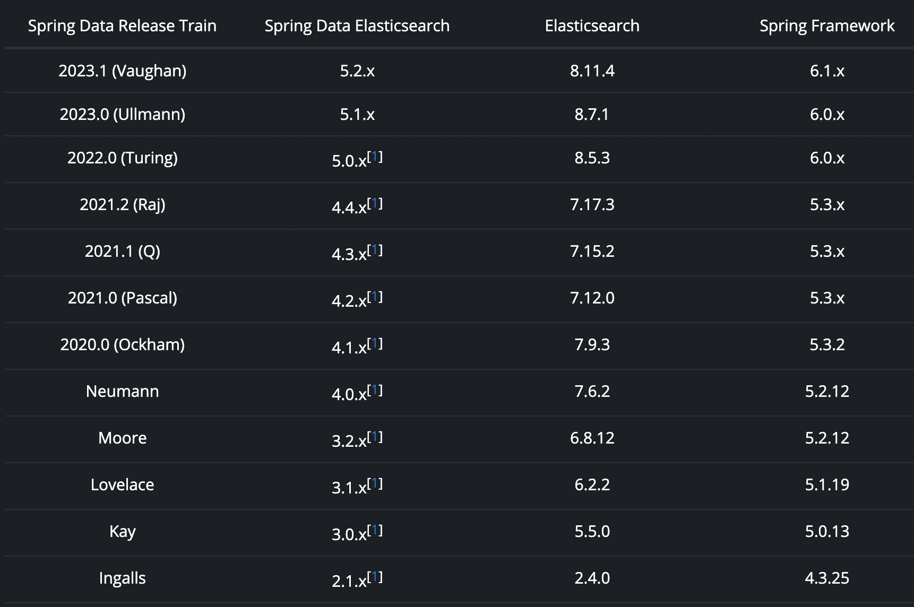

[TOC]
version=5.2.3
Spring Data for Elasticsearch是所有Spring Data项目的一部分。Spring Data项目致力于提供熟悉且一致的基于Spring的编程模型在此基础上保留存储特有的特性与能力。Spring Data Elasticsearch与es集成，Spring Data Elasticsearch的关键功能是代表ES Document的POJO中心模型与Repository风格的数据访问层。
- Clients: 不同HTTP Clients的连接与配置
- ElasticsearchTemplate与ReactiveElasticsearchTemplate: 帮助类，提供了ES索引操作与POJO之间的对象映射
- Object Mapping: 功能强大的注解驱动的对象映射器
- Entity Callbacks: save/update/delete的前后回调
- Data Repositories: 支持自定义查询的Repositories接口
- Join-Typs，Routing，Scripting: 集成特殊的ES特性

Spring Data Elasticsearch为ES数据库提供了repository支持，通过一致性的编程模型简化了开发。
- Versions: 版本兼容矩阵
- Clients: ES客户端配置
- Elasticsearch: Elasticsearch支持
- Repositories: Elasticsearch Repositories
- Migration: 迁移指南

# Versions
下面表格是Spring Data版本序列与其对应的Spring Data Elasticsearch版本使用ES与Spring版本

# overview
SDE是Spring Data项目的其中一部分。Spring Data项目为所有的数据存储中间件提供类似与一致性的基于Spring的编程模型。同时也支持数据存储库特有的特性与能力。SDE项目提供了与ES的整合。SDE的关键能力是POJO中心模型。使用POJO中心模型完成与ES文档的交互。使方便的编写Repository风格的数据访问层。
## Features
- 支持Spring所有配置方式
- ElasticsearchTemplate提高了执行ES操作的效率。
- 丰富的对象映射机制
- 基于注解的mapping元数据
- 支持Repository接口，支持自定义finder方法
- CDI支持

# Preface
SDE项目应用Spring核心概念到ES的开发中。提供了:
- Templates提供了高抽象度的文档存储、搜索、排序与聚合计算
- Repositories提供了通过接口定义查询的能力

# Elasticsearch Support
Spring Data Elasticssearch包含了很多的特性
- 为不同的Elasticsearch提供Spring配置支持
- The ElasticsearchTemplate与 ReactiveElasticsearchTemplate帮助类提供了对象映射
- 异常翻译为Spring的Data Access异常体系
- 功能强大的对象映射功能
- 映射注解，支持元注解
- 基于Java的query、criteria与update DSLs
- 命令式与响应式Repository接口的自动实现，支持自定义查询方法

对于大多数面向数据的任务，你都可以使用`[Reactive]ElasticsearchTemplate`与`Repository`,他们都具有丰富的对象映射功能。
## Elasticsearch Clients
本章阐述ES Client实现的配置与使用。SDE在一个Elasticsearch client(由Elasticsearch client libraries提供)上操作，这个client连接了一个ES节点或者一个ES集群。虽然可以直接使用ES的client来与集群通信，但是使用SDE的应用通常使用更高的抽象层Elasticsearch Operations与Elasticsearch Repositories来与ES通信。
### Imperative Rest Client
为了使用命令式客户端，必须配置一个configuration bean如下:
```java
@Configuration
public class MyClientConfig extends ElasticsearchConfiguration {

	@Override
	public ClientConfiguration clientConfiguration() {
		return ClientConfiguration.builder() // builder方法的详细描述，参考https://docs.spring.io/spring-data/elasticsearch/reference/elasticsearch/clients.html#elasticsearch.clients.configuration          
			.connectedTo("localhost:9200")
			.build();
	}
}
```
ElasticsearchConfiguration类可以做更多的配置，比如覆写`jsonMapper()`或者`transportOptions()`方法。下面的bean可以注入到其他的Spring组件中:
```java
@Autowired
ElasticsearchOperations operations;     // 一个ElasticsearchOperations实现

@Autowired
ElasticsearchClient elasticsearchClient; // 一个co.elastic.clients.elasticsearch.ElasticsearchClient实例

@Autowired
RestClient restClient;                   // Elasticsearch库中的底层RestClient

@Autowired
JsonpMapper jsonpMapper;                 // Elasticsearch Transport使用JsonMapper
```
基本上你只需要使用`ElasticsearchOperations`来与ES集群交互就可以。实际上，Repositories也是实际使用的这个实例。
### Reactive Rest Client
使用到响应式技术栈时，配置类是不同的
```java
@Configuration
public class MyClientConfig extends ReactiveElasticsearchConfiguration {

	@Override
	public ClientConfiguration clientConfiguration() {
		return ClientConfiguration.builder()           
			.connectedTo("localhost:9200")
			.build();
	}
}
```
`ReactiveElasticsearchConfiguration`可以通过方法覆写做更多的配置。下面的beans可以注入其他的Spring组件
```java
@Autowired
ReactiveElasticsearchOperations operations; //ReactiveElasticsearchOperations的实现

@Autowired
ReactiveElasticsearchClient elasticsearchClient;// org.springframework.data.elasticsearch.client.elc.ReactiveElasticsearchClient的实例，这是一个基于Elasticsearch客户端实现的响应式实现

@Autowired
RestClient restClient; // 同前面

@Autowired
JsonpMapper jsonpMapper; //同前面
```
基本上，你只需要使用`ReactiveElasticsearchOperations`来与ES集群交互。
### Client Configuration
客户端行为可以通过`ClientConfiguration`改变，可选的可以设置SSL、connect/socket超时、headers与其他的参数。
```java
HttpHeaders httpHeaders = new HttpHeaders();
httpHeaders.add("some-header", "on every request")// 定义默认的headers

ClientConfiguration clientConfiguration = ClientConfiguration.builder()
  .connectedTo("localhost:9200", "localhost:9291") // 提供集群地址
  .usingSsl()//开启ssl，这个方法存在重载的版本，可以传递SSLContext等
  .withProxy("localhost:8888") // 设置一个代理
  .withPathPrefix("ela")  // 设置一个路径前缀，当集群在反向代理后面时使用
  .withConnectTimeout(Duration.ofSeconds(5))//设置connection超时
  .withSocketTimeout(Duration.ofSeconds(3)) //设置socket超时
  .withDefaultHeaders(defaultHeaders) //设置headers
  .withBasicAuth(username, password)  // 添加basic认证
  .withHeaders(() -> {     // 一个Supplier<HttpHeaders>对象，每次请求被发送到es前调用，
    HttpHeaders headers = new HttpHeaders();
    headers.add("currentTime", LocalDateTime.now().format(DateTimeFormatter.ISO_LOCAL_DATE_TIME));
    return headers;
  })
  .withClientConfigurer(     // 用来配置已创建的client，可以添加多次
    ElasticsearchClientConfigurationCallback.from(clientBuilder -> {
  	  // ...
      return clientBuilder;
  	}))
  . // ... other options
  .build();
```
Supplier<HttpHeaders>的方式运行动态添加headers，比如认证的JWT tokens等。
### Client configuration callbacks
`ClientConfiguration`类提供了很多参数来配置客户端，如果这些参数还不够，用户可以使用`withClientConfigurer(ClientConfigurationCallback<?>)`添加回调函数。提供下面2种回调
1. Configuration of the low level Elasticsearch RestClient
   此回调提供了`org.elasticsearch.client.RestClientBuilder`，可用于配置Elasticsearch RestClient:
   ```java
    ClientConfiguration.builder()
        .withClientConfigurer(ElasticsearchClients.ElasticsearchRestClientConfigurationCallback.from(restClientBuilder -> {
            // configure the Elasticsearch RestClient
            return restClientBuilder;
        }))
        .build();
   ```
2. Configuration of the HttpAsyncClient used by the low level Elasticsearch RestClient
   此回调提供`org.apache.http.impl.nio.client.HttpAsyncClientBuilder`来配置`RestClient`使用的`HttpCLient`。
   ```java
    ClientConfiguration.builder()
        .withClientConfigurer(ElasticsearchClients.ElasticsearchHttpClientConfigurationCallback.from(httpAsyncClientBuilder -> {
            // configure the HttpAsyncClient
            return httpAsyncClientBuilder;
        }))
        .build();
   ```
### Client Logging
为了查看发送到服务器或者从服务器的返回，传输层上的Request/Response日志级别需要调整，设置`tracer`包的日志级别为trace
```xml
<logger name="tracer" level="trace"/>
```
## Elasticsearch Object Mapping
SDE的对象映射指的的在领域实体的Java对象与ES中存储的JSON数据之间的互相映射。内部用来完成映射的类是`MappingElasticsearchConverter`。
### Meta Model Object Mapping
基于元模型的方式使用领域类型信息读写Elasticsearch。可以为特定领域类型映射注册`Converter`实例。
#### 映射注解
`MappingElasticsearchConverter`转换器使用元数据完成对象与doc之间的映射。元数据来自于注解的实体的属性。注解主要有:
- @Document: 应用在类的级别，表示这个类药映射到索引，最重要的属性如下:
  - indexName: 索引名字，可以包含一个SpEL模板表达式比如`log-#{T(java.time.LocalDate).now().toString()}`
  - createIndex: 开关，是否在repository启动阶段创建索引，默认创建
- @Id: field级别，标记field为id
- @Transient、@ReadOnlyProperty、@WriteOnlyProperty: 控制哪些字段是只读的或者只写的,具体参考[Controlling which properties are written to and read from Elasticsearch](https://docs.spring.io/spring-data/elasticsearch/reference/elasticsearch/object-mapping.html#elasticsearch.mapping.meta-model.annotations.read-write)
- `@PersistenceConstructor`: 标记一个构造函数作为实例化对象时使用，构造函数的参数通过检索到的文档中的同名字段的值传递。
- `@Field`: 应用于field上，定义了field的属性，大多数的属性对应了es Mapping中的定义，下面的列表是不完整的，参考注解的JavaDoc:
  - name: Field的名字，出现在es的doc中，如果没有设置，则是field的名字
  - type: field的类型，可以是*ext, Keyword, Long, Integer, Short, Byte, Double, Float, Half_Float, Scaled_Float, Date, Date_Nanos, Boolean, Binary, Integer_Range, Float_Range, Long_Range, Double_Range, Date_Range, Ip_Range, Object, Nested, Ip, TokenCount, Percolator, Flattened, Search_As_You_Type*这些类型，可以参考官方文档，如果没有指定，默认是`FieldType.Auto`类型，也就是说这个es中不会存在这个属性的映射，当第一次存储数据时动态添加映射
  - format: 一个或者多个内置的date格式化，参考下一节[Date format mapping](https://docs.spring.io/spring-data/elasticsearch/reference/elasticsearch/object-mapping.html#elasticsearch.mapping.meta-model.annotations.date-formats)
  - pattern: 一个或者多个自定义date格式化，参考下一节[Date format mapping](https://docs.spring.io/spring-data/elasticsearch/reference/elasticsearch/object-mapping.html#elasticsearch.mapping.meta-model.annotations.date-formats)
  - store: 是否在es中存储field原本的值，默认是false
  - analyzer、searchAnalyzer、normalizer: 指定自定义的分析器与normalizer
- `@GeoPoint`: 标记一个field是`geo_point`数据类型，如果field的类型是`GeoPoint`这个注解可以忽略
- `@ValueConverter`: 定义一个类来转换属性类型，与注册的Spring的`Converter`不同，它只转换注解的属性不是领域类型的全部属性

mapping元数据基础逻辑定义在spring-data-commons项目中。
#### 控制哪些属性从es中读写
注解定义了属性的值是否要写入es或者从es中读取。
- `@Transient`: 这个注解的属性不会被映射为es中的字段。它的值不会被发送到es，从es中读出的文档中，这个属性也没有值
- `@ReadOnlyProperty`: 不会被写入到es，但是可以从es读出的doc中填充值
- `@WriteOnlyProperty`: 与`@ReadOnlyProperty`相反
#### Date format mapping
`TemporalAccessor`的子类型或者`java.util.Date`类型要注解为es的`FieldType.Date`类型或者自定义一个转换器。下面的段落描述了`FieldType.Date`的用法。`@Field`注解有2个属性定义了date格式化。可以参考[Elasticsearch Built In Formats](https://www.elastic.co/guide/en/elasticsearch/reference/current/mapping-date-format.html#built-in-date-formats)与[Elasticsearch Custom Date Formats](https://www.elastic.co/guide/en/elasticsearch/reference/current/mapping-date-format.html#custom-date-formats)。`format`属性用来定义至少一个预定义格式。如果没有定义，默认值是`_date_optional_time`与`epoch_millis`，pattern属性可以用来添加额外的自定义format格式。如果你只想要使用自定义日期格式，必须设置`format={}`。下面的表格展示了不同的属性下生成的mapping
|annotation|format string in elasticsearch mapping|
|:---|:---|
|`@Field(type=FieldType.Date)`|date_optional_time||epoch_millis|
|`@Field(type=FieldType.Date, format=DateFormat.basic_date)`|basic_date|
|`@Field(type=FieldType.Date, format={DateFormat.basic_date, DateFormat.basic_time})`|basic_date||basic_time|
|`@Field(type=FieldType.Date, pattern="dd.MM.uuuu")`|date_optional_time||epoch_millis||dd.MM.uuuu|
|`@Field(type=FieldType.Date, format={}, pattern="dd.MM.uuuu")`|dd.MM.uuuu|

如果你正在使用一个自定义的日期格式，你应该使用uuuu而不是yyyy来表示年，具体参考[change in Elasticsearch 7](https://www.elastic.co/guide/en/elasticsearch/reference/current/migrate-to-java-time.html#java-time-migration-incompatible-date-formats)
#### Range types
但一个field被定义为以下类型时`Integer_Range, Float_Range, Long_Range, Double_Range, Date_Range, Ip_Range`field必须是能够映射到es的range类型的一种类，比如:
```java
class SomePersonData {

    @Field(type = FieldType.Integer_Range)
    private ValidAge validAge;

    // getter and setter
}

class ValidAge {
    @Field(name="gte")
    private Integer from;

    @Field(name="lte")
    private Integer to;

    // getter and setter
}
```
SDE提供了`Range<T>`类
```java
class SomePersonData {

    @Field(type = FieldType.Integer_Range)
    private Range<Integer> validAge;

    // getter and setter
}
```
支持的参数类型有`Integer`, `Long`, `Float`, `Double`, `Date`与实现`TemporalAccessor`接口的类
#### Mapped field names
字段名可以是类的属性名或者`@Field`中指定的名字，或者也可以定义自定义的命名策略`FieldNamingStrategy`，如果es客户端配置为`SnakeCaseFieldNamingStrategy`策略，命名会被映射为下划线风格。`@Field`中指定的名字具有最高优先级。
#### Non-field-backed properties
通常实体中的属性就是es中映射的字段，在有一些场景下，一个属性值是计算出来的并且应该store到es。这种场景下`@Field`可以放到Getter方法上，方法也必须使用注解`@AccessType(AccessType.Type.PROPERTY)`，第三个需要的注解是`@WriteOnlyProperty`，例子如下:
```java
@Field(type = Keyword)
@WriteOnlyProperty
@AccessType(AccessType.Type.PROPERTY)
public String getProperty() {
	return "some value that is calculated here";
}
```
#### Other property annotations
- `@IndexedIndexName`: 可以在实体的`String`属性上设置此注解。该属性不会写入映射，也不会存储在Elasticsearch中，也不会从 Elasticsearch文档中读取其值。持久保存实体后，例如调用`ElasticsearchOperations.save(T entity)`，从该调用返回的实体将包含索引的名称。当索引名称由bean动态设置或写入写入别名时，这非常有用。将一些值放入此类属性中不会设置存储实体要存储的索引！

### Mapping Rules
映射使用发送到服务器的文档中嵌入的类型提示来允许通用类型映射。这些类型提示在文档中表示为`_class`属性，并为每个聚合根编写。
```
public class Person {              
  @Id String id;
  String firstname;
  String lastname;
}

Copied!
{
  "_class" : "com.example.Person", // 默认情况下，领域类型的class name就是类型暗示
  "id" : "cb7bef",
  "firstname" : "Sarah",
  "lastname" : "Connor"
}
```
使用`@TypeAlias`来自定义类型暗示。内嵌对象没有类型暗示，除非属性类型是`Object`。可以关系写类型暗示的功能，特别是使用的索引早就存在的情况下，里面可能没有类型映射并且映射类型设置为严格，此时写入类型暗示将会报错因为field不能动态的添加。类型暗示可以全局关闭，只需要在继承`AbstractElasticsearchConfiguration`的配置类中覆盖方法`writeTypeHints()`，可以关闭单一索引的类型暗示
```java
@Document(indexName = "index", writeTypeHint = WriteTypeHint.FALSE)
```
我们强烈建议不要禁用类型提示。仅在必要时才禁用。禁用类型提示可能会导致在多态数据的情况下无法从Elasticsearch正确检索文档，或者文档检索可能完全失败。

地理空间类型`Point&GeoPoint`会被转换为lat/lon对
```java
public class Address {
  String city, street;
  Point location;
}
{
  "city" : "Los Angeles",
  "street" : "2800 East Observatory Road",
  "location" : { "lat" : 34.118347, "lon" : -118.3026284 }
}
```
SDE通过提供`GeoJson`接口来支持几何徒行并且支持不同几何图形实现
```java
public class Address {

  String city, street;
  GeoJsonPoint location;
}
{
  "city": "Los Angeles",
  "street": "2800 East Observatory Road",
  "location": {
    "type": "Point",
    "coordinates": [-118.3026284, 34.118347]
  }
}
```
下面是`GeoJson`接口类型的实现
- `GeoJsonPoint`
- `GeoJsonMultiPoint`
- `GeoJsonLineString`
- `GeoJsonMultiLineString`
- `GeoJsonPolygon`
- `GeoJsonMultiPolygon`
- `GeoJsonGeometryCollection`

集合中的值都是相同的mapping规则
```java
public class Person {
  List<Person> friends;
}
{
  "friends" : [ { "firstname" : "Kyle", "lastname" : "Reese" } ]
}
```
对于Maps内的值，在类型提示和自定义转换方面应用与聚合根相同的映射规则。然而，Map键需要一个字符串才能由Elasticsearch处理。
```java
public class Person {

  // ...

  Map<String, Address> knownLocations;

}
{
  "knownLocations" : {
    "arrivedAt" : {
       "city" : "Los Angeles",
       "street" : "2800 East Observatory Road",
       "location" : { "lat" : 34.118347, "lon" : -118.3026284 }
     }
  }
}
```
### Custom Conversions
`ElasticsearchCustomConversions`允许注册特定类型的mapping规则。
```java
@Configuration
public class Config extends ElasticsearchConfiguration  {

	@NonNull
	@Override
	public ClientConfiguration clientConfiguration() {
		return ClientConfiguration.builder() //
				.connectedTo("localhost:9200") //
				.build();
	}

  @Bean
  @Override
  public ElasticsearchCustomConversions elasticsearchCustomConversions() {
    return new ElasticsearchCustomConversions(
      Arrays.asList(new AddressToMap(), new MapToAddress()));   // 注册转换器实现    
  }

  @WritingConverter                   // 用来把DomianType写到es时的转换器                              
  static class AddressToMap implements Converter<Address, Map<String, Object>> {

    @Override
    public Map<String, Object> convert(Address source) {

      LinkedHashMap<String, Object> target = new LinkedHashMap<>();
      target.put("ciudad", source.getCity());
      // ...

      return target;
    }
  }

  @ReadingConverter            // 从es中读取结果时的转换器                                     
  static class MapToAddress implements Converter<Map<String, Object>, Address> {

    @Override
    public Address convert(Map<String, Object> source) {

      // ...
      return address;
    }
  }
}
{
  "ciudad" : "Los Angeles",
  "calle" : "2800 East Observatory Road",
  "localidad" : { "lat" : 34.118347, "lon" : -118.3026284 }
}
```

## Elasticsearch Operations
SDE使用几个接口定义了索引上的操作。
- IndexOperations，定义了索引级别的行为，比如创建/删除索引;
- DocumentOperations，定义了基于id的存储、更新、检索文档的行为；
- SearchOperations，定义了查询搜索文档的行为;
- ElasticsearchOperations，将DocumentOperations与SearchOperations接口行为组合起来。

这些接口就类似ES API的结构分类。接口的实现提供:
- 索引管理功能;
- mapping读写功能
- 查询/criteria API
- 资源管理/异常处理

`IndexOperations`接口可以通过ElasticsearchOperations获取，比如`operations.indexOps(clazz)`，通过`IndexOperations`可以创建索引、设置mapping、存储模板或者设置别名等，索引的详细信息可以通过`@Setting`注解设置。参考[index setting](https://docs.spring.io/spring-data/elasticsearch/docs/current/reference/html/#elasticsearc.misc.index.settings)获得更多的信息。这些操作都不是自动操作的。需要用户手动处理。自动操作需要使用SDE的Repository，可以参考[Automatic creation of indices with the corresponding mapping](https://docs.spring.io/spring-data/elasticsearch/docs/current/reference/html/#elasticsearch.repositories.autocreation)。
### 例子
下面的例子展示了如何在Spring REST Controller中使用一个注入的ElasticsearchOperations对象。例子假设`Person`类具有注解`@Documents`，`@Id`等，可以参考[Mapping Annotation Overview](https://docs.spring.io/spring-data/elasticsearch/docs/current/reference/html/#elasticsearch.mapping.meta-model.annotations)
```java
@RestController
@RequestMapping("/")
public class TestController {

  private  ElasticsearchOperations elasticsearchOperations;

  public TestController(ElasticsearchOperations elasticsearchOperations) { // 构造器中注入
    this.elasticsearchOperations = elasticsearchOperations;
  }

  @PostMapping("/person")
  public String save(@RequestBody Person person) { // 存储文档，id是从返回的实体中读取的，因为原始对象中可能是空的，id是由es生成的                        
    Person savedEntity = elasticsearchOperations.save(person);
    return savedEntity.getId();
  }

  @GetMapping("/person/{id}")
  public Person findById(@PathVariable("id")  Long id) {//通过id检索文档                   
    Person person = elasticsearchOperations.get(id.toString(), Person.class);
    return person;
  }
}
```
### Search Result Types
当文档通过`DocumentOperations`接口的方法检索时，只会返回发现的文档。当通过`SearchOperations`接口的方法搜索时，每个实体会返回一些额外的信息，比如每个实体的score与sortValues。为了返回这些信息，每个实体都会wrapped到一个`SearchHit`对象中，这个对象包含了实体相关的额外信息。这些`SearchHit`对象自身在一个`SearchHits`对象中返回，这个对象包含了这个搜索相关的额外的信息，比如maxScore或者请求的聚合信息。下面时涉及到的类与接口
- `SearchHit<T>`包含的信息如下:
  - id
  - score
  - Sort Values
  - Highlight fields
  - inner hists，一个内嵌的SearchHits对象
  - 检索的实体类型T
- `SearchHits<T>`包含的信息如下:
  - Number of total hits
  - Total hits relation
  - Maximum score
  - A list of SearchHit<T> objects
  - Returned aggregations
  - Returned suggest results
- `SearchPage<T>`是一个Spring Data Page的实现，内部包含一个`SearchHits<T>`，可以通过repository方法用来分页访问
- `SearchScrollHits<T>`是由底层的滚动API返回的，它在`SearchHits<T>`的基础上额外增加了滚动id。
- `SearchHitsIterator<T>`是`SearchOperations`接口中的流式方法返回的迭代器。
- `ReactiveSearchHits`: ReactiveSearchOperations has methods returning a Mono<ReactiveSearchHits<T>>, this contains the same information as a SearchHits<T> object, but will provide the contained SearchHit<T> objects as a Flux<SearchHit<T>> and not as a list.
### Queries
`SearchOperations`与`ReactiveSearchOperations`接口中定义的几乎所有的方法都使用`Query`参数，这个参数定义了要执行的搜索查询。它是一个接口，SDE提供了3种实现:
#### CriteriaQuery
`CriteriaQuery`查询允许在你不需要了解ES查询语法的情况创建搜索查询。通过链式或者组合式的方式创建Criteria对象查询，这个对象指定了要搜索的文档必须满足的断言。组合断言的时候，AND会转换为ES的must查询，OR会转化为ES中的should查询。`Criteria`以及其用法可以通过下面的例子解释:
```java
Criteria criteria = new Criteria("price").is(42.0);
Query query = new CriteriaQuery(criteria);
```
条件可以组成链，这个链会转换为一个逻辑AND
```java
Criteria criteria = new Criteria("price").greaterThan(42.0).lessThan(34.0);
Query query = new CriteriaQuery(criteria);
```
当链式组合`Criteria`的时候，默认使用AND逻辑
```java
Criteria criteria = new Criteria("lastname").is("Miller")// 第一个断言
  .and("firstname").is("James") // and()创建了一个新的Criteria并把它链接到第一个                          
Query query = new CriteriaQuery(criteria);
```
如果想要创建nested查询，你需要使用子查询。假设需要查询lastname=Miller，并且firstname=jack或者John的所有人。
```java
Criteria miller = new Criteria("lastName").is("Miller") // 为last name创建第一个Criteria 
  .subCriteria(    // 使用AND连接一个subCriteria                                     
    new Criteria().or("firstName").is("John") //sub Criteria是一个or表达式           
      .or("firstName").is("Jack")                        
  );
Query query = new CriteriaQuery(criteria);
```
请参考`Criteria`类的API文档获得更多的操作信息。
#### StringQuery
这个类使用一个JSON字符串作为ES查询。下面的代码展示了一个搜索firstname=Jack的人的查询。
```java
Query query = new StringQuery("{ \"match\": { \"firstname\": { \"query\": \"Jack\" } } } ");
SearchHits<Person> searchHits = operations.search(query, Person.class);
```
如果你之前已经有了es查询，那么使用StringQuery是合适的。
#### NativeQuery
`NativeQuery`是使用复杂查询时候该使用的，或者是使用`Criteria`API无法表达的时候应该使用的。比如，当构建查询或者使用聚合查询的时候，它允许使用来自官方包的所有的`co.elastic.clients.elasticsearch._types.query_dsl.Query`实现，因此命名为native。下面的代码展示了如何通过一个给定的firstname搜索人并且对于发现的人，做一个terms聚合操作，计算lastnames的出现次数。
```java
Query query = NativeQuery.builder()
	.withAggregation("lastNames", Aggregation.of(a -> a
		.terms(ta -> ta.field("last-name").size(10))))
	.withQuery(q -> q
		.match(m -> m
			.field("firstName")
			.query(firstName)
		)
	)
	.withPageable(pageable)
	.build();

SearchHits<Person> searchHits = operations.search(query, Person.class);
```
这是query接口的特殊实现。
#### SearchTemplateQuery
这是`Query`接口的特殊实现，与一个保存的search template组合使用，可以参考[Search Template support](https://docs.spring.io/spring-data/elasticsearch/reference/elasticsearch/misc.html#elasticsearch.misc.searchtemplates)获取详细的信息。
## Reactive Elasticsearch Operations
`ReactiveElasticsearchOperations`是一个网关，通过`ReactiveElasticsearchClient`执行各种high level命令。`ReactiveElasticsearchTemplate`是`ReactiveElasticsearchOperations`的默认实现。使用`ReactiveElasticsearchOperations`需要知晓底层实际使用的客户端。请参考[Reactive Rest Client](https://docs.spring.io/spring-data/elasticsearch/docs/current/reference/html/#elasticsearch.clients.reactiverestclient)获取更多详细的信息。`ReactiveElasticsearchOperations`让你可以存储、find与删除你的领域对象，并且可以把领域对象映射到ES中的文档。下面是一个例子:
```java
@Document(indexName = "marvel")
public class Person {

  private @Id String id;
  private String name;
  private int age;
  // Getter/Setter omitted...
}
ReactiveElasticsearchOperations operations;
operations.save(new Person("Bruce Banner", 42))// 插入一个person文档到marvel索引中，id是由es服务端生成，并放到返回的对象中                    
  .doOnNext(System.out::println)
  .flatMap(person -> operations.get(person.id, Person.class))//在marvel索引中通过id匹配查询Person      
  .doOnNext(System.out::println)
  .flatMap(person -> operations.delete(person))// 通过id删除Person                    
  .doOnNext(System.out::println)
  .flatMap(id -> operations.count(Person.class)) //计算文档总数                  
  .doOnNext(System.out::println)
  .subscribe();                                                    
```
上面在控制台输出如下的信息:
> Person(id=QjWCWWcBXiLAnp77ksfR, name=Bruce Banner, age=42)
> Person(id=QjWCWWcBXiLAnp77ksfR, name=Bruce Banner, age=42)
> QjWCWWcBXiLAnp77ksfR
> 0
## Entity Callbacks
Spring Data基础组件提供了在特定的方法调用发生前/后修改实体的钩子。这些被称为`EntityCallback`的东西提供了方便的回调风格的方式来检查或者修改实体。一个`EntityCallbacl`就类似一个一个特定的`ApplicationListener`，一些Spring Data模块也会发布存储相关的事件(比如`BeforeSaveEvent`)，事件处理器可以修改给定的实体。在一些场景下，比如数据是不可修改的类型，这些事件会发生问题。同时，事件发布依赖`ApplicationEventMulticaster`。如果配置了一个异步的`TaskExecutor`，可能会导致无法预料的后果，因为事件处理在另外一个线程中。实体回调是通过API类型区分的。也就是说同步的API只会识别同步的实体回调，响应式的API只会识别响应式的实体回调。实体回调API是在Spring Data Commons 2.2开始引入的。修改实体推荐这种方式。实体相关的
### 实现实体回调
`EntityCallback`与他的泛型类型参数所表示的领域类型直接相关。每一个Spring Data模块都预定义了一些`EntityCallback`接口涵盖实体的所有生命周期
```java
@FunctionalInterface
public interface BeforeSaveCallback<T> extends EntityCallback<T> {

	/**
	 * Entity callback method invoked before a domain object is saved.
	 * Can return either the same or a modified instance.
	 *
	 * @return the domain object to be persisted.
	 */
	// BeforeSaveCallback方法在实体被保存前调用，返回一个可能被修改的对象
	T onBeforeSave(T entity,// 保存前的实体
		String collection);// store相关的参数
}
```
```java
@FunctionalInterface
public interface ReactiveBeforeSaveCallback<T> extends EntityCallback<T> {

	/**
	 * Entity callback method invoked on subscription, before a domain object is saved.
	 * The returned Publisher can emit either the same or a modified instance.
	 *
	 * @return Publisher emitting the domain object to be persisted.
	 */
	// subscription上调用，在实体被保存前，发出一个可能修改的对象实例
	Publisher<T> onBeforeSave(T entity,
		String collection);
}
```
可选的实体回调参数由实现Spring Data的模块所定义，并从`EntityCallback.callback()`的调用站点推断。实现满足你需求的接口，比如下面的例子:
```java
class DefaultingEntityCallback implements BeforeSaveCallback<Person>, Ordered {

	@Override
	public Object onBeforeSave(Person entity, String collection) {//

		if(collection == "user") {
		    return // ...
		}

		return // ...
	}

	@Override
	public int getOrder() {// 实体回调的顺序，
		return 100;
	}
}
```
### Registering Entity Callbacks
`EntityCallback`beans需要注册到`ApplicationContext`中，然后就会被自动应用。大多数的API都实现了`ApplicationContextAware`接口因此可以访问`ApplicationContext`。下面的例子是注册的:
```java
@Order(1)//BeforeSaveCallback从`@Order`定义顺序
@Component
class First implements BeforeSaveCallback<Person> {

	@Override
	public Person onBeforeSave(Person person) {
		return // ...
	}
}

@Component
class DefaultingEntityCallback implements BeforeSaveCallback<Person>,
                                                           Ordered {// 从Ordered接口获得顺序

	@Override
	public Object onBeforeSave(Person entity, String collection) {
		// ...
	}

	@Override
	public int getOrder() {
		return 100;
	}
}

@Configuration
public class EntityCallbackConfiguration {
    // beforeSaveback使用了一个lambda表达式，默认是无序的并且会被最后调用。lambda表达式实现的回调不会暴露类型信息因此使用不可分配的实体调用这些回调会影响回调吞吐量。 使用类或枚举来启用回调 bean 的类型过滤。
    @Bean
    BeforeSaveCallback<Person> unorderedLambdaReceiverCallback() {
        return (BeforeSaveCallback<Person>) it -> // ...
    }
}

@Component
class UserCallbacks implements BeforeConvertCallback<User>,//在一个实现类中实现多个实体回调接口
                                        BeforeSaveCallback<User> {

	@Override
	public Person onBeforeConvert(User user) {
		return // ...
	}

	@Override
	public Person onBeforeSave(User user) {
		return // ...
	}
}
```
### Store specific EntityCallbacks
Spring Data Elasticsearch使用`EntityCallback`API来完成用户支持，支持的实体回调如下表
|Callback|Method|Description|Order|
|:---|:---|:---|:---|
|Reactive/BeforeConvertCallback|onBeforeConvert(T entity, IndexCoordinates index)|在一个领域对象被转换为一个`org.springframework.data.elasticsearch.core.document.Document`前调用|Ordered.LOWEST_PRECEDENCE|
|Reactive/AfterLoadCallback|onAfterLoad(Document document, Class<T> type, IndexCoordinates indexCoordinates)|es中的结果读取到`org.springframework.data.elasticsearch.core.document.Document`之后调用|Ordered.LOWEST_PRECEDENCE|
|Reactive/AfterConvertCallback|onAfterConvert(T entity, Document document, IndexCoordinates indexCoordinates)|`org.springframework.data.elasticsearch.core.document.Document`被转换为领域对象后调用|Ordered.LOWEST_PRECEDENCE|
|Reactive/AuditingEntityCallback|onBeforeConvert(Object entity, IndexCoordinates index)||100|
|Reactive/AfterSaveCallback|T onAfterSave(T entity, IndexCoordinates index)|一个领域对象被保存后调用|Ordered.LOWEST_PRECEDENCE|
## Elasticsearch Auditing
为了判断一个实体对象是否是新的，实体需要实现`Persistable<ID>`接口:
```java
package org.springframework.data.domain;
public interface Persistable<ID> {
    @Nullable
    ID getId();

    boolean isNew();
}
```
Id的存在并不能决定一个实体是否是新的，需要额外的信息，一种方式是使用创建实体时的用户信息来辅助决策，比如:
```java
@Document(indexName = "person")
public class Person implements Persistable<Long> {
    @Id private Long id;
    private String lastName;
    private String firstName;
    @CreatedDate
    @Field(type = FieldType.Date, format = DateFormat.basic_date_time)
    private Instant createdDate;
    @CreatedBy
    private String createdBy
    @Field(type = FieldType.Date, format = DateFormat.basic_date_time)
    @LastModifiedDate
    private Instant lastModifiedDate;
    @LastModifiedBy
    private String lastModifiedBy;

    public Long getId() {
        return id;
    }

    @Override
    public boolean isNew() {
        return id == null || (createdDate == null && createdBy == null);
    }
}
```
用户相关信息可以通过`AuditorAware`与`ReactiveAuditorAware`接口提供，在一个configuration类上注解`@EnableElasticsearchAuditing`来开启用户信息功能
```java
@Configuration
@EnableElasticsearchRepositories
@EnableElasticsearchAuditing
class MyConfiguration {
   // configuration code
}
```
```java
@Configuration
@EnableReactiveElasticsearchRepositories
@EnableReactiveElasticsearchAuditing
class MyConfiguration {
   // configuration code
}
```
如果应用中包含多个为不同领域类型准备的`AuditorAware`，你必须提供bean的名字到`@EnableElasticsearchAuditing`注解的`auditorAwareRef`参数上。
## Join-Type实现
SDE支持ES的join数据类型。对于一个使用父子关系的实体，必须有个类型`JoinField`的属性假设`Statement`实体，可能是一个question、answer、comment或者一个vote。
```java
@Document(indexName = "statements")
@Routing("routing")//这是一个路由信息
public class Statement {
    @Id
    private String id;

    @Field(type = FieldType.Text)
    private String text;

    @Field(type = FieldType.Keyword)
    private String routing;

    @JoinTypeRelations(
        relations =
            {
                @JoinTypeRelation(parent = "question", children = {"answer", "comment"}),
                @JoinTypeRelation(parent = "answer", children = "vote")
            }
    )
    private JoinField<String> relation;//一个question可能有answer或者comments，一个answer可能有votes，JoinField属性用于将关系的名称（问题、答案、评论或投票）与父ID组合起来。泛型类型必须与@Id注解的属性相同。

    private Statement() {
    }

    public static StatementBuilder builder() {
        return new StatementBuilder();
    }

    public String getId() {
        return id;
    }

    public void setId(String id) {
        this.id = id;
    }

    public String getRouting() {
        return routing;
    }

    public void setRouting(Routing routing) {
        this.routing = routing;
    }

    public String getText() {
        return text;
    }

    public void setText(String text) {
        this.text = text;
    }

    public JoinField<String> getRelation() {
        return relation;
    }

    public void setRelation(JoinField<String> relation) {
        this.relation = relation;
    }

    public static final class StatementBuilder {
        private String id;
        private String text;
        private String routing;
        private JoinField<String> relation;

        private StatementBuilder() {
        }

        public StatementBuilder withId(String id) {
            this.id = id;
            return this;
        }

        public StatementBuilder withRouting(String routing) {
            this.routing = routing;
            return this;
        }

        public StatementBuilder withText(String text) {
            this.text = text;
            return this;
        }

        public StatementBuilder withRelation(JoinField<String> relation) {
            this.relation = relation;
            return this;
        }

        public Statement build() {
            Statement statement = new Statement();
            statement.setId(id);
            statement.setRouting(routing);
            statement.setText(text);
            statement.setRelation(relation);
            return statement;
        }
    }
}
```
产生的mapping如下：
```json
{
  "statements": {
    "mappings": {
      "properties": {
        "_class": {
          "type": "text",
          "fields": {
            "keyword": {
              "type": "keyword",
              "ignore_above": 256
            }
          }
        },
        "routing": {
          "type": "keyword"
        },
        "relation": {
          "type": "join",
          "eager_global_ordinals": true,
          "relations": {
            "question": [
              "answer",
              "comment"
            ],
            "answer": "vote"
          }
        },
        "text": {
          "type": "text"
        }
      }
    }
  }
}
```
下面是增删改查的代码:
```java
void init() {
    repository.deleteAll();

    Statement savedWeather = repository.save(
        Statement.builder()
            .withText("How is the weather?")
            .withRelation(new JoinField<>("question"))// 创建一个question
            .build());

    Statement sunnyAnswer = repository.save(
        Statement.builder()
            .withText("sunny")
            .withRelation(new JoinField<>("answer", savedWeather.getId()))// 第一个answer
            .build());

    repository.save(
        Statement.builder()
            .withText("rainy")
            .withRelation(new JoinField<>("answer", savedWeather.getId()))//第二个answer
            .build());

    repository.save(
        Statement.builder()
            .withText("I don't like the rain")
            .withRelation(new JoinField<>("comment", savedWeather.getId()))//comment
            .build());

    repository.save(
        Statement.builder()
            .withText("+1 for the sun")
            ,withRouting(savedWeather.getId())
            .withRelation(new JoinField<>("vote", sunnyAnswer.getId()))
            .build());
}
```
必须使用native query来检索数据，目前还不支持标准`Repository`的方式，也可以使用[自定义Repository实现](https://docs.spring.io/spring-data/elasticsearch/reference/repositories/custom-implementations.html)的方式.
```java
SearchHits<Statement> hasVotes() {

	Query query = NativeQuery.builder()
		.withQuery(co.elastic.clients.elasticsearch._types.query_dsl.Query.of(qb -> qb
			.hasChild(hc -> hc
				.queryName("vote")
				.query(matchAllQueryAsQuery())
				.scoreMode(ChildScoreMode.None)
			)))
		.build();

	return operations.search(query, Statement.class);
}
```
## Routing values
当Elasticsearch存储文档到一个有多个分片的索引时，基于文档的id来决定要存储的分片，有时候需要让一组文档保存到统一个分片上，比如`join`数据类型的具有相关关系的文档。为此，Elasticsearch提供了定义路由的可能性，该路由是用来计算分片的值，而不是id。
SDE支持通过入的方式定义路由
### Routing on join-types
当使用join数据类型时，SDE将会自动使用`JoinField`属性的parent属性值作为路由值。当父子关系之后一级时，这是正确的。如果深度高于1级，路由需要另外一种机制来决定。
### Custom routing values
为了定义一个实体的自定义路由值。SDE提供了`@Routing`注解
```java
@Document(indexName = "statements")
@Routing("routing")// 定义routing作为路由值
public class Statement {
    @Id
    private String id;
    @Field(type = FieldType.Text)
    private String text;
    @JoinTypeRelations(
        relations =
            {
                @JoinTypeRelation(parent = "question", children = {"answer", "comment"}),
                @JoinTypeRelation(parent = "answer", children = "vote")
            }
    )
    private JoinField<String> relation;
    @Nullable
    @Field(type = FieldType.Keyword)
    private String routing;//routing属性
    // getter/setter...
}
```
如果注解的路由定义是一个普通的字符串而不是一个SpEL表达式，它被解释为实体的一个属性，也可以使用SpEL表达式
```java
@Document(indexName = "statements")
@Routing("@myBean.getRouting(#entity)")
public class Statement{
    // all the needed stuff
}
```
在这个场景下，用户需要提供一个叫做myBean的bean，它有一个方法`String getRouting(Object)`通过#entity的方式引用实体对象，如果普通属性与SpEL不足以表达路由需求。可以提供了一个实现了`RoutingResolver`接口的类，可以在`Elasticsearch`对象中设置。
```java
RoutingResolver resolver = ...;
ElasticsearchOperations customOperations= operations.withRouting(resolver);
```
`withRouting()`方法返回原来的`ElasticsearchOperations`实例的copy，当在一个实体上定义了路由并保存到es时，检索或者删除操作也必须指定相同的值。对于不使用实体的方法，比如`get(ID)`或者`delete(ID)`可以使用`ElasticsearchOperations.withRouting(RoutingResolver)`方法
```java
String id = "someId";
String routing = "theRoutingValue";

// get an entity
Statement s = operations
                .withRouting(RoutingResolver.just(routing))
                .get(id, Statement.class);

// delete an entity
operations.withRouting(RoutingResolver.just(routing)).delete(id);
```
## 其他的ES操作支持
这个章节介绍`Repository`不支持的es操作的额外支持，建议把这些操作添加为自定义实现[Custom Repository Implementations](https://docs.spring.io/spring-data/elasticsearch/reference/repositories/custom-implementations.html)。
### Index settings
当使用SDE创建索引时，不同的索引设置可以通过`@Setting`注解定义。可以使用的参数如下:
- `useServerConfiguration`: 不发送任何的setting参数，由ES服务器配置决定他们
- `settingPath`: 引用一个json文件，文件中定义了相关的setting，文件必须是相对于classpath的。
- `shards`: 分片数量，默认是1
- `replicas`: 副本数量，默认是1
- `refreshIntervall`: 默认是1s
- `indexStoreType`: 默认是`fs`

也可以定义索引排序
```java
@Document(indexName = "entities")
@Setting(
  sortFields = { "secondField", "firstField" },//
  sortModes = { Setting.SortMode.max, Setting.SortMode.min },//
  sortOrders = { Setting.SortOrder.desc, Setting.SortOrder.asc },
  sortMissingValues = { Setting.SortMissing._last, Setting.SortMissing._first })
class Entity {
    @Nullable
    @Id private String id;

    @Nullable
    @Field(name = "first_field", type = FieldType.Keyword)
    private String firstField;

    @Nullable @Field(name = "second_field", type = FieldType.Keyword)
    private String secondField;

    // getter and setter...
}
```
### Inde Mapping
当SDE通过`IndexOperations.createMapping()`方法创建索引mapping，它会使用到前面讲述的注解，尤其是`@Field`注解，此外，也可以向类添加一个`@Mapping`注解，注解有如下的属性:
  - `mappingPath`: JSON格式的classpath资源，如果不是空的，将会认为是mapping，二期不会处理其他的mapping情况
  - `enabled`: 当设置为false，this flag is written to the mapping and no further processing is done.
  - `dateDetection`与`numericDetection`:  set the corresponding properties in the mapping when not set to DEFAULT.
  - `dynamicDateFormats`: 不是空的，定义了自动检测的date数据的日期格式
  - `runtimeFieldsPath`: 一个JSON格式的classpath资源，包含了所有的运行时fields的定义，比如:
     ```json
      {
        "day_of_week": {
          "type": "keyword",
          "script": {
            "source": "emit(doc['@timestamp'].value.dayOfWeekEnum.getDisplayName(TextStyle.FULL, Locale.ROOT))"
          }
        }
      }
     ```
### Filter Builder
Filter Builder提高查询速度
```java
private ElasticsearchOperations operations;

IndexCoordinates index = IndexCoordinates.of("sample-index");

Query query = NativeQuery.builder()
	.withQuery(q -> q
		.matchAll(ma -> ma))
	.withFilter( q -> q
		.bool(b -> b
			.must(m -> m
				.term(t -> t
					.field("id")
					.value(documentId))
			)))
	.build();

SearchHits<SampleEntity> sampleEntities = operations.search(query, SampleEntity.class, index);
```
### Using Scroll For Big Result Set
ES提供滚动式API以便以分块的形式获取大数据集的所有数据。SDE使用滚动式API实现了`<T> SearchHitsIterator<T> SearchOperations.searchForStream(Query query, Class<T> clazz, IndexCoordinates index)`方法。
```java
IndexCoordinates index = IndexCoordinates.of("sample-index");
Query searchQuery = NativeQuery.builder()
    .withQuery(q -> q
        .matchAll(ma -> ma))
    .withFields("message")
    .withPageable(PageRequest.of(0, 10))
    .build();
SearchHitsIterator<SampleEntity> stream = elasticsearchOperations.searchForStream(searchQuery, SampleEntity.class,
index);
List<SampleEntity> sampleEntities = new ArrayList<>();
while (stream.hasNext()) {
  sampleEntities.add(stream.next());
}
stream.close();
```
`SearchOperations`API并没有提供访问scroll id的方法，如果需要访问scroll id，可以使用`AbstractElasticsearchTemplate`的几个方法，这个类是不同的`ElasticsearchOperations`实现的基类。
```java
@Autowired ElasticsearchOperations operations;

AbstractElasticsearchTemplate template = (AbstractElasticsearchTemplate)operations;

IndexCoordinates index = IndexCoordinates.of("sample-index");

Query query = NativeQuery.builder()
    .withQuery(q -> q
        .matchAll(ma -> ma))
    .withFields("message")
    .withPageable(PageRequest.of(0, 10))
    .build();

SearchScrollHits<SampleEntity> scroll = template.searchScrollStart(1000, query, SampleEntity.class, index);

String scrollId = scroll.getScrollId();
List<SampleEntity> sampleEntities = new ArrayList<>();
while (scroll.hasSearchHits()) {
  sampleEntities.addAll(scroll.getSearchHits());
  scrollId = scroll.getScrollId();
  scroll = template.searchScrollContinue(scrollId, 1000, SampleEntity.class);
}
template.searchScrollClear(scrollId);
```
想要`Repository`方法使用scrollAPI，返回类型必须定义为`Stream`。然后，该方法的实现将使用`ElasticsearchTemplate`中的scroll方法。
```java
interface SampleEntityRepository extends Repository<SampleEntity, String> {

    Stream<SampleEntity> findBy();

}
```
### Sort options
除了[Paging and Sorting](https://docs.spring.io/spring-data/elasticsearch/reference/repositories/query-methods-details.html#repositories.paging-and-sorting)中描述的默认sort选项以外，SDE提供了继承`org.springframework.data.domain.Sort.Order`的`org.springframework.data.elasticsearch.core.query.Order`它提供了额外的排序参数。`org.springframework.data.elasticsearch.core.query.GeoDistanceOrder`提供了基于地理距离的排序。
### Runtime Fields
ES从7.12版本开始支持运行时field，SDE通过2种方式支持:
1. Runtime field definitions in the index mappings: 这是第一种方式，也就是几那个定义添加到index的mapping中，mapping必须是JSON文件的方式提供
   ```json
    {
      "day_of_week": {
        "type": "keyword",
        "script": {
          "source": "emit(doc['@timestamp'].value.dayOfWeekEnum.getDisplayName(TextStyle.FULL, Locale.ROOT))"
        }
      }
    }
   ```
   JSON文件必须出现在classpath中，然后在`@Mapping`注解中设置
   ```java
    @Document(indexName = "runtime-fields")
    @Mapping(runtimeFieldsPath = "/runtime-fields.json")
    public class RuntimeFieldEntity {
      // properties, getter, setter,...
    }
   ```
2. Runtime fields definitions set on a Query: 这种方式是把runtime fields定义添加到一个搜索查询。
   ```java
    @Document(indexName = "some_index_name")
    public class SomethingToBuy {

      private @Id @Nullable String id;
      @Nullable @Field(type = FieldType.Text) private String description;
      @Nullable @Field(type = FieldType.Double) private Double price;

      // getter and setter
    }
   ```
   以下查询使用一个运行时field，该field通过在价格上添加19%来计算PriceWithTax值，并在搜索查询中使用该值来查找PriceWithTax高于或等于给定值的所有实体:
   ```java
    RuntimeField runtimeField = new RuntimeField("priceWithTax", "double", "emit(doc['price'].value * 1.19)");
    Query query = new CriteriaQuery(new Criteria("priceWithTax").greaterThanEqual(16.5));
    query.addRuntimeField(runtimeField);

    SearchHits<SomethingToBuy> searchHits = operations.search(query, SomethingToBuy.class);
   ```
   每种query接口的实现都可以这么使用。
### Point In Time(PIT)API
`ElasticsearchOperations`支持ES的时刻API，下面的代码片段展示了如何使用这个API:
```java
ElasticsearchOperations operations; // autowired
Duration tenSeconds = Duration.ofSeconds(10);

String pit = operations.openPointInTime(IndexCoordinates.of("person"), tenSeconds);//创建一个point in time，a keep-alive duration and retrieve its id 

// create query for the pit
Query query1 = new CriteriaQueryBuilder(Criteria.where("lastName").is("Smith"))
    .withPointInTime(new Query.PointInTime(pit, tenSeconds))//把id输入到查询中，来搜索下一个keep-alive的value
    .build();
SearchHits<Person> searchHits1 = operations.search(query1, Person.class);
// do something with the data

// create 2nd query for the pit, use the id returned in the previous result
Query query2 = new CriteriaQueryBuilder(Criteria.where("lastName").is("Miller"))
    .withPointInTime(
        new Query.PointInTime(searchHits1.getPointInTimeId(), tenSeconds))//对于下一个查询，使用从前面搜索中返回的id
    .build();
SearchHits<Person> searchHits2 = operations.search(query2, Person.class);
// do something with the data

operations.closePointInTime(searchHits2.getPointInTimeId());//结束时，使用最后返回的id关闭point in time
```
### Search Template support
支持搜索模板，为了使用搜索模板，首先需要创建一个存储脚本。`ElasticsearchOperations`接口继承了`ScriptOperations`接口，所以提供脚本相关的功能。下面的例子假设一个`Person`实体，一个搜索模板脚本如下:
```java
import org.springframework.data.elasticsearch.core.ElasticsearchOperations;
import org.springframework.data.elasticsearch.core.script.Script;

operations.putScript(                            (1)使用putScript()方法来存储搜索模板脚本
  Script.builder()
    .withId("person-firstname")                  (2)脚本的名字或者ID
    .withLanguage("mustache")                    (3)搜索模板中的脚本语言必须是mustache语言
    .withSource("""                              (4)脚本source
      {
        "query": {
          "bool": {
            "must": [
              {
                "match": {
                  "firstName": "{{firstName}}"   (5)脚本中的搜索参数
                }
              }
            ]
          }
        },
        "from": "{{from}}",                      (6)分页参数
        "size": "{{size}}"                       (7)分页参数
      }
      """)
    .build()
);
```
为了在一个搜索查询中使用搜索模板，SDE提供了`Query`的实现`SearchTemplateQuery`类型，在下面的代码中，我们会在自定义`Repository`实现中添加搜索模板的调用。首先定义接口
```java
interface PersonCustomRepository {
	SearchPage<Person> findByFirstNameWithSearchTemplate(String firstName, Pageable pageable);
}
```
```java
public class PersonCustomRepositoryImpl implements PersonCustomRepository {

  private final ElasticsearchOperations operations;

  public PersonCustomRepositoryImpl(ElasticsearchOperations operations) {
    this.operations = operations;
  }

  @Override
  public SearchPage<Person> findByFirstNameWithSearchTemplate(String firstName, Pageable pageable) {

    var query = SearchTemplateQuery.builder()// 创建一个SearchTemplateQuery
      .withId("person-firstname")//提供搜索模板的ID
      .withParams(
        Map.of(//参数通过Map传递
          "firstName", firstName,
          "from", pageable.getOffset(),
          "size", pageable.getPageSize()
          )
      )
      .build();

    SearchHits<Person> searchHits = operations.search(query, Person.class);//执行搜索

    return SearchHitSupport.searchPageFor(searchHits, pageable);
  }
}
```
### Nested sort
SDE支持内嵌对象的排序。下面的例子来自于`org.springframework.data.elasticsearch.core.query.sort.NestedSortIntegrationTests`类，展示了如何定义内嵌排序
```java
var filter = StringQuery.builder("""
	{ "term": {"movies.actors.sex": "m"} }
	""").build();
var order = new org.springframework.data.elasticsearch.core.query.Order(Sort.Direction.DESC,
	"movies.actors.yearOfBirth")
	.withNested(
		Nested.builder("movies")
			.withNested(
				Nested.builder("movies.actors")
					.withFilter(filter)
					.build())
			.build());

var query = Query.findAll().addSort(Sort.by(order));
```
关于过滤查询，不能在这里使用`CriteriaQuery`，因为这个查询将会被转换为ES的内嵌查询，内嵌查询不能工作在filter上下文中，所以，只有`StringQuery`与`NativeQuery`可以在这里使用，当使用他们之一时，比如上面的term query，elasticsearch field会被使用到。
## Scripted and runtime fields
SDE支持脚本field与runtime field。关于这2个field的定义，可以参考es的官方文档https://www.elastic.co/guide/en/elasticsearch/reference/current/modules-scripting.html与https://www.elastic.co/guide/en/elasticsearch/reference/8.9/runtime.html。使用SDE，你可以:
- scripted fields: 基于结果文档计算出来的字段并被添加到返回的文档中
- runtime fields: 基于已存储的文档计算出来的结果，可以用在查询或者返回的搜索结果中

下面的代码片段将会展示你可以做的事情
在这些例子中使用的实体是`Person`，这个实体拥有`birthDate`与`age`属性，其中`birthDate`是固定的，`age`依赖查询发起的时间是动态计算出来的。
```java
@Document(indexName = "persons")
public record Person(
        @Id
        @Nullable
        String id,
        @Field(type = Text)
        String lastName,
        @Field(type = Text)
        String firstName,
        @Field(type = Keyword)
        String gender,
        @Field(type = Date, format = DateFormat.basic_date)
        LocalDate birthDate,
        @Nullable
        @ScriptedField Integer age                   // age属性是计算出来的并且在搜索的结果中
  ) {
    public Person(String id,String lastName, String firstName, String gender, String birthDate) {
        this(id,                                     // 一个方便的构造函数用来设置测试数据
            lastName,
            firstName,
            LocalDate.parse(birthDate, DateTimeFormatter.ISO_LOCAL_DATE),
            gender,
            null);
    }
}
```
`age`属性使用`@ScriptedField`修饰，这个字段不会写入到mapping中而是根据搜索结果计算出来的。
例子中使用的`Repository`
```java
public interface PersonRepository extends ElasticsearchRepository<Person, String> {

    SearchHits<Person> findAllBy(ScriptedField scriptedField);

    SearchHits<Person> findByGenderAndAgeLessThanEqual(String gender, Integer age, RuntimeField runtimeField);
}
```
service类注入了一个`Repository`和一个`ElasticsearchOperations`实例，以显示填充和使用`age`属性的多种方法。我们将代码分成不同的部分以将解释
```java
@Service
public class PersonService {
    private final ElasticsearchOperations operations;
    private final PersonRepository repository;

    public PersonService(ElasticsearchOperations operations, SaRPersonRepository repository) {
        this.operations = operations;
        this.repository = repository;
    }

    public void save() { (1)
        List<Person> persons = List.of(
                new Person("1", "Smith", "Mary", "f", "1987-05-03"),
                new Person("2", "Smith", "Joshua", "m", "1982-11-17"),
                new Person("3", "Smith", "Joanna", "f", "2018-03-27"),
                new Person("4", "Smith", "Alex", "m", "2020-08-01"),
                new Person("5", "McNeill", "Fiona", "f", "1989-04-07"),
                new Person("6", "McNeill", "Michael", "m", "1984-10-20"),
                new Person("7", "McNeill", "Geraldine", "f", "2020-03-02"),
                new Person("8", "McNeill", "Patrick", "m", "2022-07-04"));

        repository.saveAll(persons);
    }
```
下面的代码片段将展示如何使用脚本字段来计算并返回人员的年龄。脚本字段只能向返回的数据添加一些内容，年龄不能在查询中使用（请参阅运行时字段）。
```java
    public SearchHits<Person> findAllWithAge() {

        var scriptedField = ScriptedField.of("age",// 定义一个ScriptedField计算一个人的年龄
                ScriptData.of(b -> b
                        .withType(ScriptType.INLINE)
                        .withScript("""
                                Instant currentDate = Instant.ofEpochMilli(new Date().getTime());
                                Instant startDate = doc['birth-date'].value.toInstant();
                                return (ChronoUnit.DAYS.between(startDate, currentDate) / 365);
                                """)));

        // version 1: use a direct query
        var query = new StringQuery("""
                { "match_all": {} }
                """);
        query.addScriptedField(scriptedField);// 当使用`Query`时，添加脚本字段到query中，
        query.addSourceFilter(FetchSourceFilter.of(b -> b.withIncludes("*")));// 当添加一个脚本字段到一个Query中时，需要一个额外的source filter从文档中检索出字段

        var result1 = operations.search(query, Person.class);//获取数据

        // version 2: use the repository
        var result2 = repository.findAllBy(scriptedField);// 如果使用Repository，需要做的就只是将脚本字段作为参数传输

        return result1;
    }
```
使用运行时字段时，可以在查询本身中使用计算值。在以下代码中，它用于运行针对给定性别和最大年龄的人员的查询：
```java
    public SearchHits<Person> findWithGenderAndMaxAge(String gender, Integer maxAge) {
       // 定义了运行时字段，计算一个人的给定年龄
        var runtimeField = new RuntimeField("age", "long", """ 
                                Instant currentDate = Instant.ofEpochMilli(new Date().getTime());
                                Instant startDate = doc['birth-date'].value.toInstant();
                                emit (ChronoUnit.DAYS.between(startDate, currentDate) / 365);
                """);

        // variant 1 : use a direct query
        var query = CriteriaQuery.builder(Criteria
                        .where("gender").is(gender)
                        .and("age").lessThanEqual(maxAge))
                .withRuntimeFields(List.of(runtimeField))//当使用Query时，添加运行时字段
                .withFields("age")
                .withSourceFilter(FetchSourceFilter.of(b -> b.withIncludes("*")))
                .build();

        var result1 = operations.search(query, Person.class);

        // variant 2: use the repository
        var result2 = repository.findByGenderAndAgeLessThanEqual(gender, maxAge, runtimeField);

        return result1;
    }
}
```
# Elasticsearch Repositories
本章包含了ES Repository实现的细节。
```java
@Document(indexName="books")
class Book {
    @Id
    private String id;

    @Field(type = FieldType.text)
    private String name;

    @Field(type = FieldType.text)
    private String summary;

    @Field(type = FieldType.Integer)
    private Integer price;

	// getter/setter ...
}
```
## 索引/mapping的自动创建
`@Document`注解由一个createIndex的参数。如果参数设置为true，SDE将会在启动Repository支持的阶段检查索引是否存在。如果不存在，将会创建索引与mapping，索引的细节可以通过`@Setting`注解设置，参考[Index settings](https://docs.spring.io/spring-data/elasticsearch/docs/current/reference/html/#elasticsearc.misc.index.settings)获取更多的信息。
## Query methods
### Query lookup strategies
es模块支持构建所有基本的查询: string查询、native search查询、criteria查询或者方法名查询。从方法名派生查询有时实现不了或者方法名不可读。在这种情况下，你可以使用`@Query`注解查询，参考[Using @Query Annotation](https://docs.spring.io/spring-data/elasticsearch/docs/current/reference/html/#elasticsearch.query-methods.at-query)。
### Query创建
通常来说，查询创建机制就是[QueryMethod](https://docs.spring.io/spring-data/elasticsearch/docs/current/reference/html/#repositories.query-methods)里面所描述的，下面是一个例子，这个例子展示了ES查询方法是如何翻译为ES查询的:
```java
interface BookRepository extends Repository<Book, String> {
  List<Book> findByNameAndPrice(String name, Integer price);
}
```
上面的方法名将会翻译为下面的查询:
```json
{
    "query": {
        "bool" : {
            "must" : [
                { "query_string" : { "query" : "?", "fields" : [ "name" ] } },
                { "query_string" : { "query" : "?", "fields" : [ "price" ] } }
            ]
        }
    }
}
```
支持的关键字列表如下,集体列表的内容参考官方文档吧.
### Method return types
Repository方法可以返回下面的类型:
- List<T>
- Stream<T>
- SearchHits<T>
- List<SearchHit<T>>
- Stream<SearchHit<T>>
- SearchPage<T>

### Using @Query注解
在方法上声明查询，参数可以通过查询字符串中的占位符定义。占位符类似?0,?1,?2这种:
```java
interface BookRepository extends ElasticsearchRepository<Book, String> {
    @Query("{\"match\": {\"name\": {\"query\": \"?0\"}}}")
    Page<Book> findByName(String name,Pageable pageable);
}
```
注解参数中的字符串必须是一个有效的ES JSON查询。它将会作为query元素的值发送给ES。产生的查询例子如下:
```json
{
  "query": {
    "match": {
      "name": {
        "query": "John"
      }
    }
  }
}
```
集合参数的查询方法如下:
```java
@Query("{\"ids\": {\"values\": ?0 }}")
List<SampleEntity> getByIds(Collection<String> ids);
```
将会返回IDs规定的所有文档:
```json
{
  "query": {
    "ids": {
      "values": ["id1", "id2", "id3"]
    }
  }
}
```
## Reactive Elasticsearch Repositories
Reactive Elasticsearch Repositories通过Reactive Elasticsearch Operations实现。SDE Reactive repo使用Project Reactor作为底层库。有3个可用的接口：
- ReactiveRepository
- ReactiveCrudRepository
- ReactiveSortingRepository
### Usage
```java
interface ReactivePersonRepository extends ReactiveSortingRepository<Person, String> {

  Flux<Person> findByFirstname(String firstname);//查询给定firstname的所有人                                 

  Flux<Person> findByFirstname(Publisher<String> firstname);// 通过Publisher的输入来查询人                        

  Flux<Person> findByFirstnameOrderByLastname(String firstname);                    

  Flux<Person> findByFirstname(String firstname, Sort sort);                        

  Flux<Person> findByFirstname(String firstname, Pageable page);                    

  Mono<Person> findByFirstnameAndLastname(String firstname, String lastname);       

  Mono<Person> findFirstByLastname(String lastname);                                

  @Query("{ \"bool\" : { \"must\" : { \"term\" : { \"lastname\" : \"?0\" } } } }")
  Flux<Person> findByLastname(String lastname);                                     

  Mono<Long> countByFirstname(String firstname)                                     

  Mono<Boolean> existsByFirstname(String firstname)                                 

  Mono<Long> deleteByFirstname(String firstname)                                    
}
```
### Configuration
对于Java配置，使用`@EnableReactiveElasticsearchRepositories`注解，如果没有配置base package，底层狂简扫描configuration class所在的包。下面的代码是个例子:
```java
@Configuration
@EnableReactiveElasticsearchRepositories
public class Config extends AbstractReactiveElasticsearchConfiguration {

  @Override
  public ReactiveElasticsearchClient reactiveElasticsearchClient() {
    return ReactiveRestClients.create(ClientConfiguration.localhost());
  }
}
```
因为前一个示例中的存储库扩展了ReactiveSortingRepository，所以所有CRUD操作以及对实体进行排序访问的方法都是可用的。使用存储库实例是一个将依赖注入到客户端的问题，如下面的例子所示:
```java
public class PersonRepositoryTests {

  @Autowired ReactivePersonRepository repository;

  @Test
  public void sortsElementsCorrectly() {

    Flux<Person> persons = repository.findAll(Sort.by(new Order(ASC, "lastname")));

    // ...
  }
}
```
## Annotations for repository methods
### @Highlight
`@Highlight`注解定义了返回的实体中，哪些fields应该高亮。下面是一个例子:
```java
interface BookRepository extends Repository<Book, String> {

    @Highlight(fields = {
        @HighlightField(name = "name"),
        @HighlightField(name = "summary")
    })
    SearchHits<Book> findByNameOrSummary(String text, String summary);
}
```
可以定义多个fields都是高亮的，可以通过`@HighlightParameters`注解来定制`@Highlight`与`@HighlightField`注解。在搜索结果中，highlight数据可以从SearchHit中检索。
### @SourceFilters
有时候用户不需要实体中所有的属性。只需要一个子集。ES提供了source过滤的能力来减少数据量。如果Query+`ElasticsearchOperations`可以很容易的通过设置source filter来实现，如果使用repository方法，可以使用这个注解:
```java
interface BookRepository extends Repository<Book, String> {
    @SourceFilters(includes = "name")
    SearchHits<Book> findByName(String text);
}
```
## 基于注解的配置
SDE repositories可以通过Java注解启动。
```java
@Configuration
@EnableElasticsearchRepositories(// 启动repository支持，如果没有配置base package，将会使用它放置的配置类所在的包
  basePackages = "org.springframework.data.elasticsearch.repositories"
  )
static class Config {

  @Bean
  public ElasticsearchOperations elasticsearchTemplate() {//
      // ...
  }
}

class ProductService {

  private ProductRepository repository;//注入

  public ProductService(ProductRepository repository) {
    this.repository = repository;
  }

  public Page<Product> findAvailableBookByName(String name, Pageable pageable) {
    return repository.findByAvailableTrueAndNameStartingWith(name, pageable);
  }
}
```
## Elasticsearch Repositories using CDI
SDE可以配置使用CDI功能。
```java
class ElasticsearchTemplateProducer {

  @Produces
  @ApplicationScoped
  public ElasticsearchOperations createElasticsearchTemplate() {
    // ...                               (1)
  }
}

class ProductService {

  private ProductRepository repository;  (2)
  public Page<Product> findAvailableBookByName(String name, Pageable pageable) {
    return repository.findByAvailableTrueAndNameStartingWith(name, pageable);
  }
  @Inject
  public void setRepository(ProductRepository repository) {
    this.repository = repository;
  }
}
```
# Auditing
## Basics
Spring Data提供了丰富的支持，可以透明地跟踪谁创建或更改了实体以及更改发生的时间。要从该功能中受益，您必须为实体类配备auditing元数据，这些元数据可以使用注解或实现接口来定义。此外，必须通过注解配置或XML配置来开启auditing以注册所需的基础架构组件。请参阅特定sotre部分的配置示例。仅跟踪创建和修改日期的应用程序不需要使其实体实现`AuditorAware`。
### Annotation-based Auditing Metadata
我们提供`@CreatedBy`和`@LastModifiedBy`来捕获创建或修改实体的用户，以及`@CreatedDate`和`@LastModifiedDate`来捕获更改发生的时间。
```java
class Customer {
  @CreatedBy
  private User user;

  @CreatedDate
  private Instant createdDate;

  // … further properties omitted
}
```
正如您所看到的，可以根据您想要捕获的信息有选择地应用注解。这些注解指示在发生更改时进行捕获，可用于JDK8日期和时间类型、long、Long以及旧版Java日期和日历的属性。auditing元数据不一定需要存在于根级实体中，也可以添加到嵌入式实体中（取决于使用的实际存储），如下面的代码片段所示。
```java
class Customer {
  private AuditMetadata auditingMetadata;
  // … further properties omitted
}
class AuditMetadata {
  @CreatedBy
  private User user;
  @CreatedDate
  private Instant createdDate;
}
```
### Interface-based Auditing Metadata
如果您不想使用注解来定义auditing元数据，您可以让您的域类实现`Auditable`接口。它公开了所有auditing属性的setter方法。
### AuditorAware
如果您使用`@CreatedBy`或`@LastModifiedB`，auditing基础设施需要以某种方式了解当前principal。为此，我们提供了一个`AuditorAware<T>`SPI接口，您必须实现该接口来告诉基础架构当前与应用程序交互的用户或系统是谁。泛型类型T定义了用`@CreatedBy`或`@LastModifiedBy`注释的属性必须是什么类型。
以下示例显示了使用Spring Security的Authentication对象的接口的实现:
```java
class SpringSecurityAuditorAware implements AuditorAware<User> {

  @Override
  public Optional<User> getCurrentAuditor() {

    return Optional.ofNullable(SecurityContextHolder.getContext())
            .map(SecurityContext::getAuthentication)
            .filter(Authentication::isAuthenticated)
            .map(Authentication::getPrincipal)
            .map(User.class::cast);
  }
}
```
该实现访问Spring Security提供的Authentication对象，并查找您在`UserDetailsService`实现中创建的自定义`UserDetails`实例。我们在这里假设您通过UserDetails实现公开域用户，但根据找到的身份验证，您也可以从任何地方查找它。
### ReactiveAuditorAware
使用reactive基础设施时，您可能希望利用上下文信息来提供`@CreatedBy`或`@LastModifiedBy`信息。我们提供了一个`ReactiveAuditorAware<T>`SPI接口，您必须实现该接口来告诉基础架构当前与应用程序交互的用户或系统是谁。泛型类型T定义了用`@CreatedBy`或`@LastModifiedBy`注释的属性必须是什么类型。以下示例显示了使用反应式Spring Security的Authentication对象的接口实现：
```java
class SpringSecurityAuditorAware implements ReactiveAuditorAware<User> {

  @Override
  public Mono<User> getCurrentAuditor() {

    return ReactiveSecurityContextHolder.getContext()
                .map(SecurityContext::getAuthentication)
                .filter(Authentication::isAuthenticated)
                .map(Authentication::getPrincipal)
                .map(User.class::cast);
  }
}
```
该实现访问Spring Security提供的Authentication对象，并查找您在`UserDetailsService`实现中创建的自定义`UserDetails`实例。 我们在这里假设您通过`UserDetails`实现公开域用户，但根据找到的身份验证，您也可以从任何地方查找它。
## Elasticsearch Auditing
### Preparing entities
为了使auditing代码能够确定实体实例是否是新的，该实体必须实现`Persistable<ID>`接口，其定义如下:
```java
package org.springframework.data.domain;
import org.springframework.lang.Nullable;
public interface Persistable<ID> {
    @Nullable
    ID getId();
    boolean isNew();
}
```
由于Id的存在不足以确定`Elasticsearch`中的实体是否是新实体，因此需要额外的信息。一种方法是使用与创建相关的auditing字段来做出此决定.Person实体可能如下所示，为简洁起见，省略getter和setter方法:
```java
@Document(indexName = "person")
public class Person implements Persistable<Long> {
    @Id private Long id;
    private String lastName;
    private String firstName;
    @CreatedDate
    @Field(type = FieldType.Date, format = DateFormat.basic_date_time)
    private Instant createdDate;
    @CreatedBy
    private String createdBy
    @Field(type = FieldType.Date, format = DateFormat.basic_date_time)
    @LastModifiedDate
    private Instant lastModifiedDate;
    @LastModifiedBy
    private String lastModifiedBy;

    public Long getId() {     //                                            (1)
        return id;
    }

    @Override
    public boolean isNew() {
        return id == null || (createdDate == null && createdBy == null);  (2)
    }
}
```
### Activating auditing
设置实体并提供`AuditorAware`或`ReactiveAuditorAware`, 必须通过在配置类上设置 `@EnableElasticsearchAuditing`来激活auditing：
```java
@Configuration
@EnableElasticsearchRepositories
@EnableElasticsearchAuditing
class MyConfiguration {
   // configuration code
}
@Configuration
@EnableReactiveElasticsearchRepositories
@EnableReactiveElasticsearchAuditing
class MyConfiguration {
   // configuration code
}
```
如果您的代码包含多个不同类型的AuditorAware bean，则必须提供该bean的名称，以用作 `@EnableElasticsearchAuditing`注释的`AuditorAwareRef`参数的参数。

