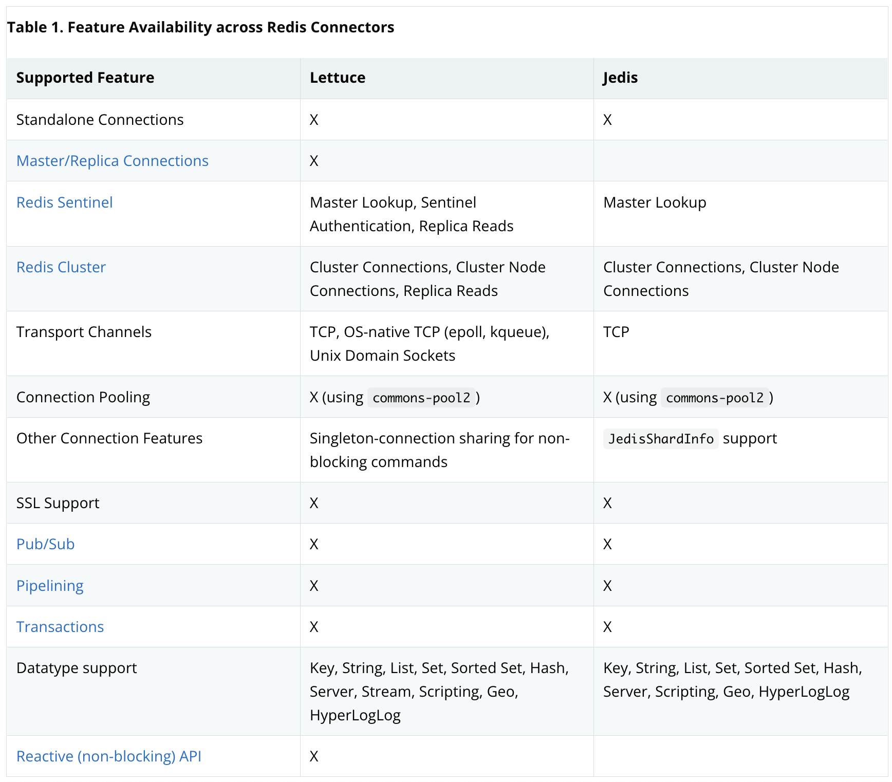
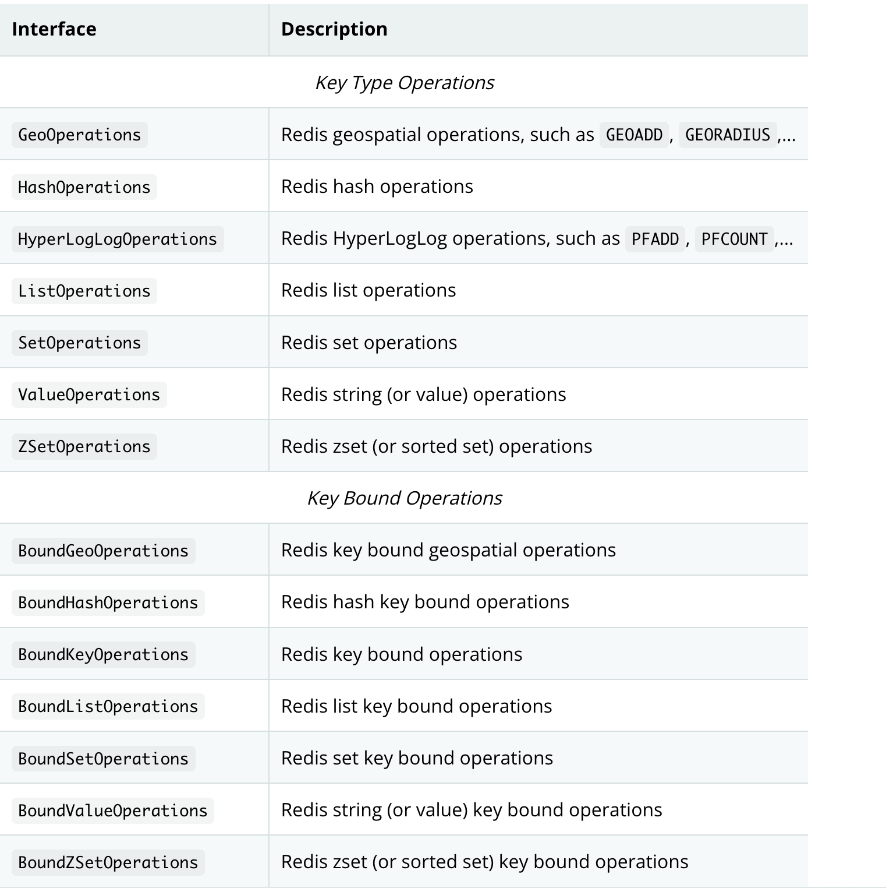
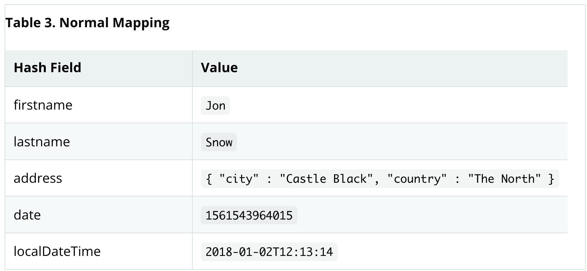
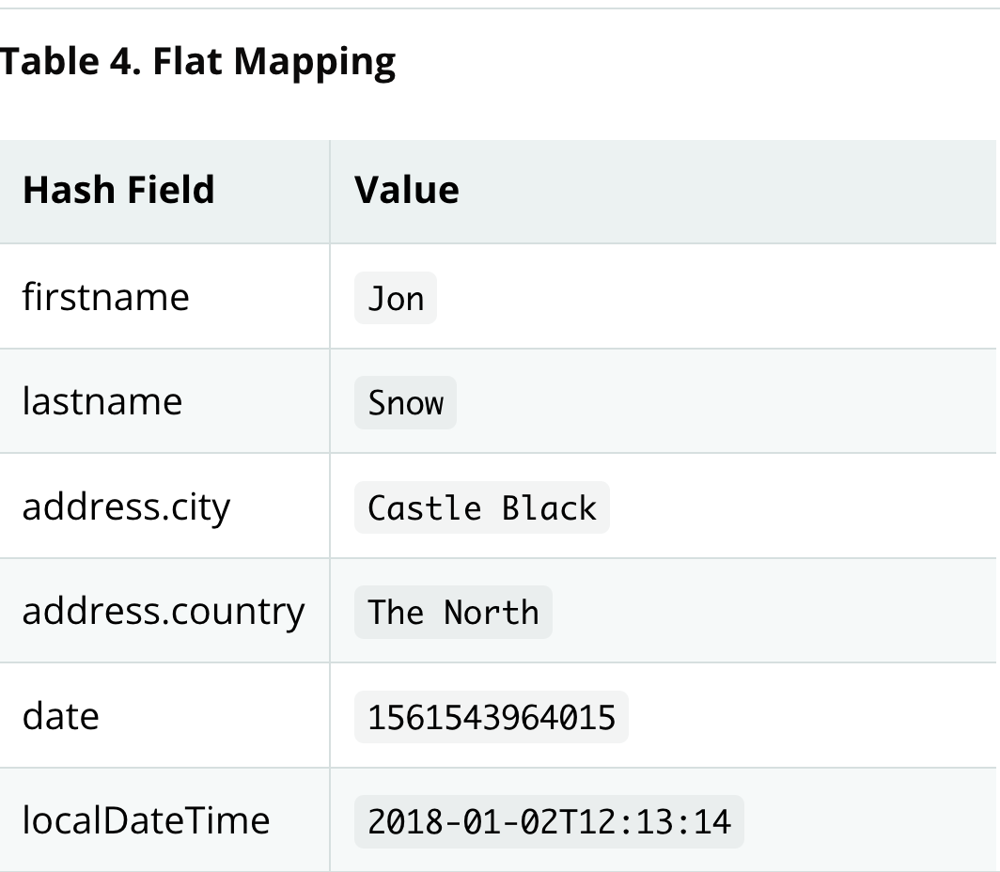

[TOC]
Spring Data Redis项目整合了key-value模式的数据存储开发与Spring概念；我们提供了一个高度抽象的Template接口类，这个Template用于发送与接受消息；你可能注意到了，它与JDBC有点类似。
# Learning Spring
Spring Data使用了Spring框架的核心功能，包括：
- IOC容器
- 类型转换系统
- 表达式语言
- JMX整合
- DAO异常体系。

虽然您不需要了解 Spring API，但了解它们背后的概念很重要。 至少，控制反转 (IoC) 背后的想法应该很熟悉，并且您应该熟悉您选择使用的任何 IoC 容器。

Redis支持的核心功能可以直接使用，无需调用Spring Container的IoC服务。 这很像 JdbcTemplate，它可以“独立”使用，无需 Spring 容器的任何其他服务。 要利用 Spring Data Redis 的所有功能，例如存储库支持，您需要配置库的某些部分以使用 Spring。

要了解有关 Spring 的更多信息，您可以参考详细解释 Spring 框架的综合文档。 有很多关于这个主题的文章、博客条目和书籍。 有关更多信息，请参阅 Spring 框架主页。

一般来说，这应该是想要尝试 Spring Data Redis 的开发人员的起点。
# 学习NoSQL与key-value存储
NoSQL 存储席卷了存储世界。 这是一个广阔的领域，有大量的解决方案、术语和模式（更糟糕的是，甚至术语本身也有多种含义）。 虽然有些原则是通用的，但在一定程度上熟悉Spring Data Redis支持的底层存储是至关重要的。熟悉这些底层存储的最佳方法是阅读他们的文档并遵循他们的示例。完成它们通常不会超过五到十分钟，如果您来自仅 RDMBS 的背景，很多时候这些练习可能会让您大开眼界。
## 尝试例子
你可以在[https://github.com/spring-projects/spring-data-keyvalue-examples](https://github.com/spring-projects/spring-data-keyvalue-examples)这个专门的Spring Data示例存储库中找到键值存储的各种示例。 对于Spring Data Redis，您应该特别注意retwisj 示例，这是一个构建在 Redis 之上的 Twitter 克隆，可以在本地运行或部署到云中。 有关更多信息，请参阅其文档，以下博客条目。
# 要求
Spring Data Redis 2.x的使用需要JDK 8.0或者以上的版本，Spring Framework 5.3.10版本及以上。至于key-value存储，Redis需要2.6.x版本及以上，Spring Data Redis的功能当前是在Redis 4.0版本以上测试的。
# 额外的帮助资源
学习一个新框架并不总是那么简单。 在本节中，我们尝试提供我们认为易于遵循的 Spring Data Redis 模块入门指南。 但是，如果您遇到问题或需要建议，请随时使用以下链接之一：
- 社区论坛：Stack Overflow的Spring Data板块是一个所有的Spring Data用户共享信息与帮助解决问题的地方，提问前需要注册;
- 专业的支持：专业的，源码级别的支持，需要确保问题的响应时间的情况下，可以去Pivotal Software公司的官网请求帮助，这是Spring与Spring Data的开发者公司。
# 开发工作
更多的Spring Data源码仓库的信息，构建与快照版本发布，可以看Spring Data的github主页。您可以通过 spring-data 或 spring-data-redis 与 Stack Overflow 上的开发人员进行交互，帮助使 Spring Data 最好地满足 Spring 社区的需求。如果您遇到错误或想提出改进建议（包括本文档），请在 Github 上登录。要及时了解 Spring 生态系统中的最新消息和公告，请订阅 Spring 社区门户。
# 版本变更
# 依赖
由于各个Spring Data模块的发布日期是不同的，它们中的大多数带有不同的主要和次要版本号。找到兼容版本的最简单方法是依赖我们提供的 Spring Data Release Train BOM，这个里面会把兼容的版本定义在一起，在 Maven 项目中，您将在 POM 的 <dependencyManagement /> 部分声明此依赖项，如下所示：
```xml
<dependencyManagement>
  <dependencies>
    <dependency>
      <groupId>org.springframework.data</groupId>
      <artifactId>spring-data-bom</artifactId>
      <version>2021.0.5</version>
      <scope>import</scope>
      <type>pom</type>
    </dependency>
  </dependencies>
</dependencyManagement>
```
当前的集中发布的版本是2021.0.5，train版本使用格式为YYYY.MINOR.MICRO格式的版本号，版本名字是${calver}格式的发布版本是GA发布版本与service版本，下面格式的版本是其他版本：${calver}-${modifier}，在这里，modifier可以是下面的值
- SNAPSHOT：当前的快照版本;
- M1, M2：里程碑版本;
- RC1, RC2：候选发布版本;
你可以在Spring Data的例子仓库中找到使用这个BOM的例子，使用这种方式，你可以在<dependencies/>模块的声明中声明任何的你需要的Spring Data模块，并且可以不带版本号。
# 概述
参考文档的这个部分解释了Spring Data Redis提供的核心的功能，它解释了Key-Value模块的概念与语义，以及不同的蔟存储空间的语法，本文档只涉及到Spring Data Redis，并且用户需要提前熟悉key-value存储与Spring的相关的概念。
Redis support提供了Redis模块的所有相关的特性
Redis Repositories提供Redis的repository支持。
这篇文档是SDR的参考指南。
# 为什么使用Spring Data Redis
Spring 框架是领先的全栈 Java/JEE 应用程序框架。 它通过使用依赖注入、AOP 和可移植服务抽象来提供轻量级容器和非侵入式编程模型。NoSQL 存储系统为横向可扩展性和速度提供了经典 RDBMS 的替代方案。 在实现方面，键值存储代表了 NoSQL 空间中最大（也是最古老）的成员之一。Spring Data Redis (SDR) 框架通过 Spring 出色的基础架构支持消除了与存储交互所需的冗余任务和样板代码，从而使编写使用 Redis 键值存储的 Spring 应用程序变得容易。
# Redis support
>Redis 是一种高级键值对存储。 它类似于 memcached，但数据集不是易失性的，值可以是字符串，就像在 memcached 中一样，还可以是列表、集合和有序集合。 所有这些数据类型都可以通过原子操作进行操作，以推送/弹出元素、添加/删除元素、执行服务器端联合、交集、集合之间的差异等。 Redis 支持不同类型的排序功能。Spring Data Redis 提供了 Spring 应用程序对 Redis 的轻松配置和访问。 它提供了用于与底层存储交互的低级和高级抽象，使用户摆脱了基础设施问题。
## Getting Started
添加依赖
```xml
<dependencies>

  <!-- other dependency elements omitted -->

  <dependency>
    <groupId>org.springframework.data</groupId>
    <artifactId>spring-data-redis</artifactId>
    <version>2.6.1</version>
  </dependency>

</dependencies>
```
## Redis Requirements
Redis>2.6版本以上，Spring Data Redis集成了Lettuce与Jedis2个主流的开源的Redis的Java库。
## Redis Support High-level View
Redis 支持提供了几个组件。 对于大多数任务，最好使用高级抽象和支持服务。 请注意，在任何时候，您都可以使用任意的Redis组件层。 例如，您可以获得一个低级连接（甚至是本机库）来直接与 Redis 通信。
##  Connecting to Redis
使用 Redis 和 Spring 时的首要任务之一是通过 IoC 容器连接到存储。 为此，需要一个 Java 连接器（或绑定）。 无论您选择哪种库，您只需要使用一组 Spring Data Redis API（在所有连接器中的行为一致）：org.springframework.data.redis.connection 包及其 RedisConnection 和 RedisConnectionFactory 接口，用于使用和检索 与 Redis 的活动连接。
### RedisConnection and RedisConnectionFactory
RedisConnection 为 Redis 通信提供了核心构建块，因为它处理与 Redis 后端的通信。 它还自动将底层连接库异常转换为 Spring 一致的 DAO 异常层次结构，以便您可以在不更改任何代码的情况下切换连接器，因为操作语义保持不变。对于需要原生库 API 的极端情况，RedisConnection 提供了一个专用方法 (getNativeConnection)，该方法返回用于通信的原始底层对象。活动 RedisConnection 对象是通过 RedisConnectionFactory 创建的。 此外，工厂充当 PersistenceExceptionTranslator 对象，这意味着，一旦声明，它们就可以让您进行透明的异常翻译。 例如，您可以通过使用@Repository 注释和AOP 来进行异常翻译。 有关更多信息，请参阅 Spring Framework 文档中的专用部分。使用 RedisConnectionFactory 最简单的方法是通过 IoC 容器配置适当的连接器并将其注入到使用类中。不幸的是，目前，并非所有连接器都支持所有 Redis 功能。 在底层库不支持的 Connection API 上调用方法时，会引发 UnsupportedOperationException。 以下概述说明了各个 Redis 连接器支持的功能：

### Configuring the Lettuce Connector
Lettuce 是 Spring Data Redis 通过 org.springframework.data.redis.connection.lettuce 包支持的基于 Netty 的开源连接器
```xml
<dependencies>

  <!-- other dependency elements omitted -->

  <dependency>
    <groupId>io.lettuce</groupId>
    <artifactId>lettuce-core</artifactId>
    <version>6.1.6.RELEASE</version>
  </dependency>

</dependencies>
```
```java
@Configuration
class AppConfig {

  @Bean
  public LettuceConnectionFactory redisConnectionFactory() {

    return new LettuceConnectionFactory(new RedisStandaloneConfiguration("server", 6379));
  }
}
```
还有一些可以调整的Lettuce特定连接参数。 默认情况下，由 LettuceConnectionFactory 创建的所有 LettuceConnection 实例在执行非阻塞或者非事务的操作时会共享线程安全的native connection。 要每次都使用专用连接，请将 shareNativeConnection 设置为 false。 LettuceConnectionFactory可以配置使用 LettucePool连接池来池化阻塞与事务操作的连接，如果 shareNativeConnection 设置为 false，就可以池化所有的连接。Lettuce 与 Netty 的native transports集成，让您可以使用 Unix 域套接字与 Redis 通信。 确保包含与您的运行时环境匹配的适当本机传输依赖项。 以下示例显示如何在 /var/run/redis.sock 为 Unix 域套接字创建生菜连接工厂：
```java
@Configuration
class AppConfig {

  @Bean
  public LettuceConnectionFactory redisConnectionFactory() {

    return new LettuceConnectionFactory(new RedisSocketConfiguration("/var/run/redis.sock"));
  }
}
```
### Configuring the Jedis Connector
Jedis 是 Spring Data Redis 模块通过 org.springframework.data.redis.connection.jedis 包支持的社区驱动连接器。
```xml
<dependencies>

  <!-- other dependency elements omitted -->

  <dependency>
    <groupId>redis.clients</groupId>
    <artifactId>jedis</artifactId>
    <version>3.7.1</version>
  </dependency>

</dependencies>
```
```java
@Configuration
class AppConfig {

  @Bean
  public JedisConnectionFactory redisConnectionFactory() {
    return new JedisConnectionFactory();
  }
}
```
```java
@Configuration
class RedisConfiguration {

  @Bean
  public JedisConnectionFactory redisConnectionFactory() {

    RedisStandaloneConfiguration config = new RedisStandaloneConfiguration("server", 6379);
    return new JedisConnectionFactory(config);
  }
}
```
### Write to Master, Read from Replica
Redis Master/Replica 设置 — 没有自动故障转移（自动故障转移参见：Sentinel） — 不仅允许数据安全地存储在更多节点上。 它还允许通过使用 Lettuce 从副本读取数据，同时将写入推送到主服务器。 您可以使用 LettuceClientConfiguration 设置要使用的读/写策略，如下例所示：
```java
@Configuration
class WriteToMasterReadFromReplicaConfiguration {

  @Bean
  public LettuceConnectionFactory redisConnectionFactory() {

    LettuceClientConfiguration clientConfig = LettuceClientConfiguration.builder()
      .readFrom(REPLICA_PREFERRED)
      .build();

    RedisStandaloneConfiguration serverConfig = new RedisStandaloneConfiguration("server", 6379);

    return new LettuceConnectionFactory(serverConfig, clientConfig);
  }
}
```
对于通过 INFO 命令报告非公共地址的环境（例如，使用 AWS 时），请使用 RedisStaticMasterReplicaConfiguration 而不是 RedisStandaloneConfiguration。 请注意，RedisStaticMasterReplicaConfiguration 不支持 Pub/Sub，因为缺少跨单个服务器的 Pub/Sub 消息传播。
## Redis Sentinel Support
对于高可用 Redis，Spring Data Redis 支持 Redis Sentinel，使用 RedisSentinelConfiguration，如下例所示：
```java
/**
 * Jedis
 */
@Bean
public RedisConnectionFactory jedisConnectionFactory() {
  RedisSentinelConfiguration sentinelConfig = new RedisSentinelConfiguration()
  .master("mymaster")
  .sentinel("127.0.0.1", 26379)
  .sentinel("127.0.0.1", 26380);
  return new JedisConnectionFactory(sentinelConfig);
}

/**
 * Lettuce
 */
@Bean
public RedisConnectionFactory lettuceConnectionFactory() {
  RedisSentinelConfiguration sentinelConfig = new RedisSentinelConfiguration()
  .master("mymaster")
  .sentinel("127.0.0.1", 26379)
  .sentinel("127.0.0.1", 26380);
  return new LettuceConnectionFactory(sentinelConfig);
}
```
RedisSentinelConfiguration 也可以使用 PropertySource 定义，它允许您设置以下属性：
- spring.redis.sentinel.master: name of the master node.
- spring.redis.sentinel.nodes: Comma delimited list of host:port pairs.
- spring.redis.sentinel.password: The password to apply when authenticating with Redis Sentinel
有时，需要与其中一个哨兵直接互动。 使用 RedisConnectionFactory.getSentinelConnection() 或 RedisConnection.getSentinelCommands() 可以让您访问配置的第一个活动 Sentinel
## Working with Objects through RedisTemplate
大多数用户可能会使用 RedisTemplate 及其对应的包 org.springframework.data.redis.core。 实际上，模板是 Redis 模块的中心类，因为它具有丰富的功能集。 该模板为 Redis 交互提供了高级抽象。 虽然 RedisConnection 提供了接受和返回二进制值（字节数组）的低级方法，但模板负责序列化和连接管理，使用户免于处理此类细节。

此外，该模板提供了操作视图（按照 Redis 命令参考中的分组），这些视图提供了丰富的通用接口，用于处理特定类型或特定键（通过 KeyBound 接口），如下表所述：

配置后，模板是线程安全的，可以跨多个实例重用。

RedisTemplate 对其大部分操作使用基于 Java 的序列化程序。这意味着模板写入或读取的任何对象都通过Java进行序列化和反序列化。您可以更改模板上的序列化机制，Redis 模块提供了几种实现，可在 org.springframework.data.redis.serializer 包中找到。有关详细信息，请参阅序列化程序。您还可以通过将 enableDefaultSerializer 属性设置为 false 将任何序列化程序设置为 null 并将 RedisTemplate 与原始字节数组一起使用。请注意，模板要求所有键都是非空的。但是，只要底层序列化程序接受它们，值就可以为空。阅读每个序列化程序的 Javadoc 以获取更多信息。

对于需要某个模板视图的情况，将该视图声明为依赖项并注入模板。容器自动执行转换，消除了 opsFor[X] 调用，如下例所示：
```java
public class Example {

  // inject the actual template
  @Autowired
  private RedisTemplate<String, String> template;

  // inject the template as ListOperations
  @Resource(name="redisTemplate")
  private ListOperations<String, String> listOps;

  public void addLink(String userId, URL url) {
    listOps.leftPush(userId, url.toExternalForm());
  }
}
```
## String-focused Convenience Classes
由于存储在 Redis 中的键和值通常是 java.lang.String，因此 Redis 模块为 RedisConnection 和 RedisTemplate 提供了两个扩展，分别是 StringRedisConnection（及其 DefaultStringRedisConnection 实现）和 StringRedisTemplate 作为方便的一站式解决方案 用于密集的字符串操作。 除了绑定到字符串键之外，模板和连接还使用下面的 StringRedisSerializer，这意味着存储的键和值是人类可读的（假设在 Redis 和您的代码中使用相同的编码）。 以下清单显示了一个示例：
```java
public class Example {

  @Autowired
  private StringRedisTemplate redisTemplate;

  public void addLink(String userId, URL url) {
    redisTemplate.opsForList().leftPush(userId, url.toExternalForm());
  }
}
```
与其他 Spring 模板一样，RedisTemplate 和 StringRedisTemplate 让您可以通过 RedisCallback 接口直接与 Redis 对话。 此功能可让您完全控制，因为它直接与 RedisConnection 对话。 请注意，当使用 StringRedisTemplate 时，回调会接收 StringRedisConnection 的实例。 以下示例展示了如何使用 RedisCallback 接口
```java
public void useCallback() {

  redisTemplate.execute(new RedisCallback<Object>() {
    public Object doInRedis(RedisConnection connection) throws DataAccessException {
      Long size = connection.dbSize();
      // Can cast to StringRedisConnection if using a StringRedisTemplate
      ((StringRedisConnection)connection).set("key", "value");
    }
   });
}
```
## Serializers
从框架的角度来看，Redis 中存储的数据只是字节。虽然 Redis 本身支持各种类型，但在大多数情况下，这些类型指的是数据的存储方式，而不是它所代表的内容。由用户决定是否将信息转换为字符串或任何其他对象。在 Spring Data 中，用户（自定义）类型和原始数据（反之亦然）之间的转换由 org.springframework.data.redis.serializer 包中的 Redis 处理。这个包包含两种类型的序列化器，顾名思义，它们负责序列化过程
- 基于 RedisSerializer 的双向序列化器
- 使用 RedisElementReader 和 RedisElementWriter 的元素读取器和写入器。
这些变体之间的主要区别在于，RedisSerializer 主要序列化为 byte[]，而 readers 和 writers 使用 ByteBuffer。
有多种实现可用（包括本文档中已经提到的两种）：
- JdkSerializationRedisSerializer，默认用于 RedisCache 和 RedisTemplate。
- StringRedisSerializer。

但是，可以通过 Spring OXM 支持使用 OxmSerializer 进行对象/XML 映射，或者使用 Jackson2JsonRedisSerializer 或 GenericJackson2JsonRedisSerializer 以 JSON 格式存储数据。请注意，存储格式不仅限于值。它可以用于键、值或散列，没有任何限制。
默认情况下，RedisCache 和 RedisTemplate 配置为使用 Java 原生序列化。 Java 本机序列化以允许运行由有效载荷引起的远程代码而闻名，该有效载荷利用注入未经验证的字节码的易受攻击的库和类。 被操纵的输入可能会导致在反序列化步骤期间在应用程序中运行不需要的代码。 因此，不要在不受信任的环境中使用序列化。 通常，我们强烈推荐使用任何其他消息格式（例如 JSON）。

如果您担心 Java 序列化导致的安全漏洞，请考虑核心 JVM 级别的通用序列化过滤器机制，该机制最初是为 JDK 9 开发的，但向后移植到 JDK 8、7 和 6.
## Hash mapping
可以使用 Redis 中的各种数据结构来存储数据。 Jackson2JsonRedisSerializer 可以转换 JSON 格式的对象。 理想情况下，可以使用普通键将 JSON 存储为值。 您可以使用 Redis 哈希实现更复杂的结构化对象映射。 Spring Data Redis 提供了将数据映射到哈希的各种策略（取决于用例）：
- 直接映射，使用 HashOperations 和序列化器
- 使用 Redis Repository库
- 使用 HashMapper 和 HashOperations
### Hash Mappers
哈希映射器是将字典对象转换为 Map<K, V> 并返回。 HashMapper旨在与 Redis 哈希一起使用。
有多种实现可供选择：
- BeanUtilsHashMapper 使用 Spring 的 BeanUtils。
- ObjectHashMapper使用Object-to-Hash Mapping。
- Jackson2HashMapper 使用 FasterXML Jackson。

以下示例显示了一种实现哈希映射的方法：
```java
public class Person {
  String firstname;
  String lastname;

  // …
}

public class HashMapping {

  @Autowired
  HashOperations<String, byte[], byte[]> hashOperations;

  HashMapper<Object, byte[], byte[]> mapper = new ObjectHashMapper();

  public void writeHash(String key, Person person) {

    Map<byte[], byte[]> mappedHash = mapper.toHash(person);
    hashOperations.putAll(key, mappedHash);
  }

  public Person loadHash(String key) {

    Map<byte[], byte[]> loadedHash = hashOperations.entries("key");
    return (Person) mapper.fromHash(loadedHash);
  }
}
```
### Jackson2HashMapper
Jackson2HashMapper 使用 FasterXML Jackson 为域对象提供 Redis 哈希映射。 Jackson2HashMapper 可以将顶级属性映射为 Hash 字段名称，并且可以选择展平结构。 简单类型映射到简单值。 复杂类型（嵌套对象、集合、映射等）表示为嵌套 JSON。

扁平化为所有嵌套属性创建单独的哈希条目，并尽可能将复杂类型解析为简单类型。

考虑以下类及其包含的数据结构
```java
public class Person {
  String firstname;
  String lastname;
  Address address;
  Date date;
  LocalDateTime localDateTime;
}

public class Address {
  String city;
  String country;
}
```
正常的json化的结构

战平的json化的结构

展平要求所有属性名称不干扰 JSON 路径。 使用扁平化时，不支持在映射键中使用点或括号或作为属性名称。 生成的哈希无法映射回对象。java.util.Date and java.util.Calendar are represented with milliseconds. JSR-310 Date/Time types are serialized to their toString form if jackson-datatype-jsr310 is on the class path.
# Reactive Redis support
# Redis Cluster
# Redis Repositories
使用Redis Repository可以让你自由的在领域对象与Redis Hash之间相互转化，应用自定义的映射策略，使用第二索引。Redis Repositories不支持事务，确保使用的RedisTemplate关闭了事务。
## Usage
Spring Data Redis让你可以非常方便的实现领域实体，如下面的例子所示
```java
@RedisHash("people")
public class Person {

  @Id String id;
  String firstname;
  String lastname;
  Address address;
}
```
我们在这里有一个非常简单的领域对象，注意到在类上有一个@RedisHash注解，一个叫做id的属性上有一个@Id注解，这2个可以用来创建存储hash值的实际使用的key，使用@Id表示的属性或者名字叫id的属性通常都会考虑作为标识属性。为了存储与检索，我们需要定义Repo，如下:
```java
public interface PersonRepository extends CrudRepository<Person, String> {

}
```
因为我们的repo继承于CrudRepository，它提供了基本的CRUD与find操作，我们把这些东西组合起来需要做的事情就是配置Spring，如下所示:
```java
@Configuration
@EnableRedisRepositories
public class ApplicationConfig {

  @Bean
  public RedisConnectionFactory connectionFactory() {
    return new JedisConnectionFactory();
  }

  @Bean
  public RedisTemplate<?, ?> redisTemplate(RedisConnectionFactory redisConnectionFactory) {

    RedisTemplate<byte[], byte[]> template = new RedisTemplate<byte[], byte[]>();
    template.setConnectionFactory(redisConnectionFactory);
    return template;
  }
}
```
跟据前面的设置，我们可以注入PersonRepository，如下所示:
```java
@Autowired PersonRepository repo;

public void basicCrudOperations() {

  Person rand = new Person("rand", "al'thor");
  rand.setAddress(new Address("emond's field", "andor"));

  repo.save(rand);                                         

  repo.findOne(rand.getId());                              

  repo.count();                                            

  repo.delete(rand);                                       
}
```
如果当前值为null则生成一个新id或重用已设置的id值，并将Person类型的属性存储在Redis哈希中，其键具有keyspace:id的模式，在这种情况下，它可能是 people:5d67b7e1- 8640-4475-beeb-c666fab4c0e5。可以使用提供的id来检索存储在keyspace:id键的领域对象，计算keyspace=people下所有的实体数量。
## Object Mapping Fundamentals
这一节主要讲Spring Data对象映射、对象创建、属性访问变更的基本原理，请注意，本节仅适用于不使用底层数据存储（如JPA）的对象映射的Spring Data模块。 还请务必查阅特定于存储的部分以获取特定于存储的对象映射，例如索引、自定义列或字段名称等。Spring Data对象映射的核心责任是创建领域对象实例并映射存储的数据，这意味着我们需要2个基础的步骤:
- 需要构造函数来创建实例;
- 创建的实例需要设置属性
### Object creation
Spring Data 自动尝试检测持久实体的构造函数以用于创建该类型的对象。 解析算法的工作原理如下:
- 如果存在使用@PersistenceCreator的静态工厂方法，则使用它;
- 如果存在一个构造函数，那么使用它;
- 如果存在多个构造函数，并且只有其中一个使用了@PersistenceCreator注解，那么使用它;
- 如果有一个无参的构造函数，那么使用它并忽略其他的构造函数.

解析算法认为构造函数与工厂方法的参数名与实体中的属性名对应，这需要class文件支持参数名信息，或者早构造函数的参数上使用@ConstructorProperties标注，可以使用@Value自定义解析过程。为了避免反射的过多的消耗，Spring Data对象创建默认使用一个人自动生成的工厂类，这个工厂类会直接调用领域类的构造函数，比如如下:
```java
class Person {
  Person(String firstname, String lastname) { … }
}
```
系统会自动创建一个等价于下面类的工厂类
```java
class PersonObjectInstantiator implements ObjectInstantiator {

  Object newInstance(Object... args) {
    return new Person((String) args[0], (String) args[1]);
  }
}
```
相比于反射，这提升了大约10%的性能，此优化需要领域类满足一些条件
- 不能是private类
- 不能是非静态内部类
- 不能是CGLib代理类
- 构造函数不能是private的
### Property population
一旦创建了实体的实例，Spring Data接下来填充字段，除非字段通过构造函数的方式已经填充了，使用的填充算法如下:
- 如果属性是不可变更的，并且实体暴漏了一个with...的方法，使用with...方法来创建一个新的实体;
- 如果属性访问定义了setter与getter，那么调用setter方法;
- 如果属性是可修改的，直接设置属性
- 如果属性是不可变更的，使用构造函数创建实例的拷贝
- 缺省情况下，直接设置属性
与对象构造中的优化类，Spring Data也会生成访问者类，用于与实体类实例交互
```java
class Person {

  private final Long id;
  private String firstname;
  private @AccessType(Type.PROPERTY) String lastname;

  Person() {
    this.id = null;
  }

  Person(Long id, String firstname, String lastname) {
    // Field assignments
  }

  Person withId(Long id) {
    return new Person(id, this.firstname, this.lastame);
  }

  void setLastname(String lastname) {
    this.lastname = lastname;
  }
}
```
```java
class PersonPropertyAccessor implements PersistentPropertyAccessor {

  private static final MethodHandle firstname;//缺省情况下，Spring Data使用field-access读写属性值，因为field的private的可见性规则，MethoidHandles用来与field交互           

  private Person person;//访问器含有一个可变更的对象实例，                                    

  public void setProperty(PersistentProperty property, Object value) {

    String name = property.getName();

    if ("firstname".equals(name)) {
      firstname.invoke(person, (String) value);             
    } else if ("id".equals(name)) {
      this.person = person.withId((Long) value);//这个类暴漏了一个withId()的方法，用于设置标识符，当一个实例插入到数据库中时，生成一个标识符，调用withId(...)创建一个新的Person对象，所有后续的变更都会发生在新的实例上   
    } else if ("lastname".equals(name)) {
      this.person.setLastname((String) value);// 允许直接方法调用            
    }
  }
}
```
这大约给我们提升了25%的性能，相比于反射，执行这样优化的领域类需要满足的要求如下:
- 类型不能在默认或者java包下
- 类型与构造函数必须是public的;
- 内部类的类型必须是static的;
- 使用的 Java 运行时必须允许在原始 ClassLoader 中声明类。 Java 9 和更高版本施加了某些限制；

缺省情况下，Spring Data尝试使用生成的属性访问器，如果不行，降级为基于反射的方式.让我们看一下下面的实体
```java
class Person {

  private final @Id Long id;//标识符属性是final的，但是在构造函数中被设置为null，类暴漏了一个withId(...)的方法用来设置标识属性，原来的Person实例保持不变，因为创建了一个新的， wither 方法是可选的，因为持久性构造函数（参见 6）实际上是一个复制构造函数，设置属性将被转换为创建一个新实例并应用新的标识符值.    
  private final String firstname, lastname; // 这2个属性是不可变更属性，通过getter房方法获取                             
  private final LocalDate birthday;
  private final int age;    //age是一个不可变更属性，但是衍生自birthday属性，根据上面的设计，                                        

  private String comment;                                                   
  private @AccessType(Type.PROPERTY) String remarks;  
  //remarks属性是可变更的，                      

  static Person of(String firstname, String lastname, LocalDate birthday) { 
//类暴漏了一个工厂方法，与一个构造函数用于创建对象，这里的想法是使用工厂方法而不是构造函数是为避免通过`@PersistenceCreator`造成的构造函数混乱，如果你想要使用工厂方法里创建对象，加上注解@PersistenceCreator
    return new Person(null, firstname, lastname, birthday,
      Period.between(birthday, LocalDate.now()).getYears());
  }

  Person(Long id, String firstname, String lastname, LocalDate birthday, int age) {//

    this.id = id;
    this.firstname = firstname;
    this.lastname = lastname;
    this.birthday = birthday;
    this.age = age;
  }

  Person withId(Long id) {                                                  
    return new Person(id, this.firstname, this.lastname, this.birthday, this.age);
  }

  void setRemarks(String remarks) {                                         
    this.remarks = remarks;
  }
}
```
### General Recommendations
- 尽量使用不可变对象，不可变对象很容易创建，因为实例化对象只要调用其构造函数即可，还可以避免对象被外部的代码调用setter方法等设置垃圾数据，如果您需要这样的功能，最好将package设置成protected，以便它们只能被有限数量的类型调用。 仅构造函数实现比属性填充快30%;
- 提供一个全参数的构造函数，即使您不能或不想将实体建模为不可变值，提供一个将实体的所有属性（包括可变属性）作为参数的构造函数仍然有价值，因为这允许对象映射跳过属性填充 以获得最佳性能;
- 使用工厂方法而不是过度复杂重载的构造函数，避免使用@persistenceCreator去消除调用构造函数的模糊性，相对于最佳性能所需的全参数构造函数，我们通常希望能够使用更多特定于应用程序用例的构造函数，这些构造函数省略了自动生成的标识符等内容。这是一种既定的模式，就是使用静态工厂方法来而不是全参数构造函数的重载形式;
- 确保遵守生成实例化器与属性访问器的类的约束;
- 对于生成的标识符，仍然使用final field与全参数构造函数的组合形式，或者是一个with...的静态方法;
- 使用Lombok来避免样板代码，因为持久化操作需要全参数的构造函数，写这些构造函数通常都是无聊的代码重复，可以使用Lombok的@AllArgsConstructor来避免这种情况.

Java可以灵活的设计领域对象类，子类可以定义个与父类同名的属性，看一下限免的例子:
```java
public class SuperType {

   private CharSequence field;

   public SuperType(CharSequence field) {
      this.field = field;
   }

   public CharSequence getField() {
      return this.field;
   }

   public void setField(CharSequence field) {
      this.field = field;
   }
}
public class SubType extends SuperType {

   private String field;

   public SubType(String field) {
      super(field);
      this.field = field;
   }

   @Override
   public String getField() {
      return this.field;
   }

   public void setField(String field) {
      this.field = field;

      // optional
      super.setField(field);
   }
}
```
2个类都定义了field属性，子类会屏蔽父类的同名属性，依赖于类设计，使用构造函数是可以设置父类的field属性的方式，也可以调用super.setField(...)的方式设置父类的field属性，所有这些都造成了一定程度的混乱，因为同名的属性有不同的值，如果同名的属性的类型不是互相兼容的，Spring Data会忽略父类的属性，也就是说，被屏蔽的父类属性的类型必须是它子类同名属性的父类型或者相同了日行，否则，父类型中的属性会被认为是transient的，我们通常建议使用不同的属性名.Spring Data支持覆盖属性持有不同的值，从编程模型的角度来看有几个注意的点如下:
- 哪个同名属性应该被持久化存储（默认是所有已声明的属性），你可以通过注解@Transient排除不需要持久存储的属性;
- 如果在数据存储种表示属性，使用相同的field/column映射可能会造成不同的值，需要使用注解明确的指定一个额外的field/column映射名字;
- @AccessType(PROPERTY)注解不能用在父类的属性上
### Kotlin support
## Object-to-Hash Mapping
Redis Repository支持将对象持久化为Hash，这需要有对象到Hash的转换，这是通过RedisConverter完成的，默认实现的Converter是将属性值转换为Redis的native 字节数组.给定前面章节中的Person类型，默认映射如下所示:
>_class = org.example.Person                 
id = e2c7dcee-b8cd-4424-883e-736ce564363e
firstname = rand                            
lastname = al’thor
address.city = emond's field                
address.country = andor

- _class属性包含在所有对象内，包括内嵌的，或者抽象的;
- 简单属性值通过名字的path映射
- 复杂类型的属性呢通过点号分隔的path路径映射

下面的表格描述了默认的映射规则
|Type|Sample|Mapped Value|
|:---|:---|:---|
|Simple Type|String firstname="rand"|firstname="rand"|
|byte array|byte[] image = "rand".getBytes();|image = "rand"|
|Complex Type(for example, Address)|Address address = new Address("emond’s field");|address.city = "emond’s field"|
|List of Simple Type|List<String> nicknames = asList("dragon reborn", "lews therin");|nicknames.[0] = "dragon reborn",nicknames.[1] = "lews therin"|
|Map of Simple Type|Map<String, String> atts = asMap({"eye-color", "grey"}, {"…​|atts.[eye-color] = "grey",atts.[hair-color] = "…​|
|List of Complex Type|List<Address> addresses = asList(new Address("em…​|addresses.[0].city = "emond’s field",addresses.[1].city = "…​|
|Map of Complex Type|Map<String, Address> addresses = asMap({"home", new Address("em…​|addresses.[home].city = "emond’s field",addresses.[work].city = "…​|

由于这种扁平的表示结构，Hash的key需要时简单的类型，比如Stirng或者nummber.映射行为可以通过在RedisCustomConversions中注册自定义的Converter改变，这些转换器可以转换对象到字节[]或者Map<String,byte[]>, 第一个适用于（例如）将复杂类型转换为（例如）二进制JSON表示，这种JSON表示仍然使用默认映射哈希结构， 第二个选项提供对结果哈希的完全控制。写对象到Hash会把当前的hash删掉，重新创建一个完整的hash。下面是2个byte数组转换器的例子
```java
@WritingConverter
public class AddressToBytesConverter implements Converter<Address, byte[]> {

  private final Jackson2JsonRedisSerializer<Address> serializer;

  public AddressToBytesConverter() {

    serializer = new Jackson2JsonRedisSerializer<Address>(Address.class);
    serializer.setObjectMapper(new ObjectMapper());
  }

  @Override
  public byte[] convert(Address value) {
    return serializer.serialize(value);
  }
}

@ReadingConverter
public class BytesToAddressConverter implements Converter<byte[], Address> {

  private final Jackson2JsonRedisSerializer<Address> serializer;

  public BytesToAddressConverter() {

    serializer = new Jackson2JsonRedisSerializer<Address>(Address.class);
    serializer.setObjectMapper(new ObjectMapper());
  }

  @Override
  public Address convert(byte[] value) {
    return serializer.deserialize(value);
  }
}
```使用上面的字节数组转换器，将会产生下面的输出
>_class = org.example.Person
id = e2c7dcee-b8cd-4424-883e-736ce564363e
firstname = rand
lastname = al’thor
address = { city : "emond's field", country : "andor" }

下面2个例子展示了使用Map转换器的结果
```java
@WritingConverter
public class AddressToMapConverter implements Converter<Address, Map<String,byte[]>> {

  @Override
  public Map<String,byte[]> convert(Address source) {
    return singletonMap("ciudad", source.getCity().getBytes());
  }
}

@ReadingConverter
public class MapToAddressConverter implements Converter<Map<String, byte[]>, Address> {

  @Override
  public Address convert(Map<String,byte[]> source) {
    return new Address(new String(source.get("ciudad")));
  }
}
```
产生的结果如下:
>_class = org.example.Person
id = e2c7dcee-b8cd-4424-883e-736ce564363e
firstname = rand
lastname = al’thor
ciudad = "emond's field"

如果您想避免将整个 Java 类名写为类型信息，并且希望使用一个键，您可以在被持久化的实体类上使用 @TypeAlias 注释。 如果您需要更多地自定义映射，请查看 TypeInformationMapper 接口。 该接口的一个实例可以在 DefaultRedisTypeMapper 上进行配置，它可以在 MappingRedisConverter 上进行配置。以下示例显示如何为实体定义类型别名:
```java
@TypeAlias("pers")
class Person {

}
```
造成的结果是hash中的_class=pers。下面的例子展示了如何在MappingRedisConverter中配置一个自定义的RedisTypeMapper。定义一个自定义的Mapper
```java
class CustomRedisTypeMapper extends DefaultRedisTypeMapper {
  //implement custom type mapping here
}
```
注册自定义的Mapper
```java
@Configuration
class SampleRedisConfiguration {

  @Bean
  public MappingRedisConverter redisConverter(RedisMappingContext mappingContext,
        RedisCustomConversions customConversions, ReferenceResolver referenceResolver) {

    MappingRedisConverter mappingRedisConverter = new MappingRedisConverter(mappingContext, null, referenceResolver,
            customTypeMapper());

    mappingRedisConverter.setCustomConversions(customConversions);

    return mappingRedisConverter;
  }

  @Bean
  public RedisTypeMapper customTypeMapper() {
    return new CustomRedisTypeMapper();
  }
}
```
## Keyspaces
键空间定义了用于为Redis Hash创建实际键的前缀，不明确指定情况下前缀为getClass().getName()，你可以改变这种默认的行为，可以通过在聚合根类上设置@RedisHash或通过编程的方式更改。但是，注解的键空间设置会取代任何其他配置。
以下示例显示了如何使用@EnableRedisRepositories注解设置键空间配置:
```java
@Configuration
@EnableRedisRepositories(keyspaceConfiguration = MyKeyspaceConfiguration.class)
public class ApplicationConfig {

  //... RedisConnectionFactory and RedisTemplate Bean definitions omitted

  public static class MyKeyspaceConfiguration extends KeyspaceConfiguration {

    @Override
    protected Iterable<KeyspaceSettings> initialConfiguration() {
      return Collections.singleton(new KeyspaceSettings(Person.class, "people"));
    }
  }
}
```
下面的例子展示了如何通过编程的方式设置键空间
```java
@Configuration
@EnableRedisRepositories
public class ApplicationConfig {

  //... RedisConnectionFactory and RedisTemplate Bean definitions omitted

  @Bean
  public RedisMappingContext keyValueMappingContext() {
    return new RedisMappingContext(
      new MappingConfiguration(new IndexConfiguration(), new MyKeyspaceConfiguration()));
  }

  public static class MyKeyspaceConfiguration extends KeyspaceConfiguration {

    @Override
    protected Iterable<KeyspaceSettings> initialConfiguration() {
      return Collections.singleton(new KeyspaceSettings(Person.class, "people"));
    }
  }
}
```
## 第二索引
第二索引用来开启基于native redis结构的查找操作，每次保存时的值都会存在索引中，当对象被删除或者过期时从索引中移除。以前面的Person类型为例，我们可以为firstname创建一个索引，通过在firstname上放置@Indexed注解，如下所示:
```java
@RedisHash("people")
public class Person {

  @Id String id;
  @Indexed String firstname;
  String lastname;
  Address address;
}
```
实际属性值的的内容创建索引，保存2个person后的索引可能如下:
### Geospatial Index
	假设Address类型含有一个Point类型的location属性，Point类型含有特定地址的地理位置坐标，通过在属性上标注@GeoIndexed注解，Spring Data Redis会使用Redis的GEO命令添加这些值，如下面的例子所示:
```java
@RedisHash("people")
public class Person {

  Address address;

  // ... other properties omitted
}

public class Address {

  @GeoIndexed Point location;

  // ... other properties omitted
}

public interface PersonRepository extends CrudRepository<Person, String> {

  /**
   * 在一个内嵌属性上建立的方法声明，使用Point与Distance
   */
  List<Person> findByAddressLocationNear(Point point, Distance distance);
  /**
   * 在一个内嵌属性上建立的方法声明，使用Circle来搜索
   */
  List<Person> findByAddressLocationWithin(Circle circle);                    
}

Person rand = new Person("rand", "al'thor");
rand.setAddress(new Address(new Point(13.361389D, 38.115556D)));
/**
 * 底层执行的命令 GEOADD people:address:location 13.361389 38.115556 e2c7dcee-b8cd-4424-883e-736ce564363e
 */
repository.save(rand);                                                        
/**
 * 底层实际执行的命令 GEORADIUS people:address:location 15.0 37.0 200.0 km
 */
repository.findByAddressLocationNear(new Point(15D, 37D), new Distance(200)); 
```
在前面的例子中，经纬度通过Redis的GEOADD命令存储，使用对象的ID属性作为GEO类型的成员名字，Find方法允许使用Circle、Point或者Distance来查询这些值.
## Query by Example
### Introduction
本章提供了对QBE的间隔简单的介绍并解释如何使用它。Query by Example (QBE) 是一种用户友好的查询技术，具有简单的接口。 它允许动态创建查询，并且不需要您编写包含字段名称的查询。 事实上，QBE根本不需要您使用特定于存储的查询语言来编写查询。
### Usage
QBE API包含3个部分
- Probe: 带有填充值的领域对象;
- ExampleMatcher: ExampleMatcher定义如何匹配特定字段的细节，可以被复用;
- Example: 一个Example包含probe与ExampleMatcher，用来创建查询

QBE适合的几种场景
- 带有静态与动态约束限制的查询;
- 领域对象需要频繁的重构，不需要担心破坏现有的查询;
- 查询不依赖底层存储的API

QBE也有一些不足，主要有:
- 不支持内嵌的或者分醉的属性约束，比如`firstname = ?0 or (firstname = ?1 and lastname = ?2)`;
- 字符串只支持starts/contains/ends/regex匹配，其他类型的属性只支持精确匹配

在开始学些QBE的例子之前，你需要一个领域对象，也需要创建repo接口，如下所示:
```java
public class Person {

  @Id
  private String id;
  private String firstname;
  private String lastname;
  private Address address;

  // … getters and setters omitted
}
```
上面的例子是一个简单的领域对象，你可以使用它创建一个Example，缺省情况下，null的field会被忽略，字符串匹配会使用存储组件对应的操作翻译，属性是否包含在QBE的查询中基于nullability的，使用基本类型的属性比如int，float等会始终包含除非声明忽略属性。

Example可以通过使用of静态工厂方法或者使用ExampleMatcher来生成，Example是可变更的
```java
Person person = new Person();                         
person.setFirstname("Dave");                          

Example<Person> example = Example.of(person);         
```
你可以通过repo接口执行QBE查询，这样做，需要repo继承QueryByExampleExecutor<T>，下面是QueryByExampleExecutor<T>的摘录
```java
public interface QueryByExampleExecutor<T> {

  <S extends T> S findOne(Example<S> example);

  <S extends T> Iterable<S> findAll(Example<S> example);

  // … more functionality omitted.
}
```
### Exmple Matchers
Example不止默认的设置，你可以指定字符串匹配、null处理，这些可以通过ExampleMatcher来处理，如下所示:
```java
Person person = new Person();                          
person.setFirstname("Dave");                           

ExampleMatcher matcher = ExampleMatcher.matching()  //创建一个期望匹配所有值的Matcher，   
  .withIgnorePaths("lastname")    // 忽略lastname属性                    
  .withIncludeNullValues()       // 包含null值                      
  .withStringMatcher(StringMatcher.ENDING);  //字符串执行后缀匹配          

Example<Person> example = Example.of(person, matcher); 
```
默认情况下，ExampleMatcher期望所有设置的值的一个匹配，这是一个and的关系，如果你想哟匹配任意一个谓词就可以，那么使用`ExampleMatcher.matchingAny()`，你可以指定每个单独属性的匹配行为，你可以调整匹配选项、大小写敏感性如下所示:
```java
ExampleMatcher matcher = ExampleMatcher.matching()
  .withMatcher("firstname", endsWith())
  .withMatcher("lastname", startsWith().ignoreCase());
}
```
另外一种配置匹配选项的方式是使用lambda表达式，这种方式会创建回调，回调可以修改匹配器的行为，你不需要返回匹配器，因为配置选项已经在匹配器对象内部，下面的例子展示了一个使用lambda表达式的匹配器的例子:
```java
ExampleMatcher matcher = ExampleMatcher.matching()
  .withMatcher("firstname", match -> match.endsWith())
  .withMatcher("firstname", match -> match.startsWith());
}
```
Example创建的查询会merge配置，默认的匹配设置是在ExampleMatcher级别设置的，单独的设置可以设置在特定的属性上，设置在ExampleMatcher上的配置可以由属性设置继承，属性的设置的优先级更高，下表描述了不同的ExampleMatcher设置的作用域
|Setting|Scope|
|:---|:---|
|Null-handling|ExampleMatcher|
|String matching|ExampleMatcher and property path|
|Ignoring properties|Property path|
|Case sensitivity|ExampleMatcher and property path|
|Value transformation|Property path|
### Running an Example
```java
interface PersonRepository extends QueryByExampleExecutor<Person> {
}

class PersonService {

  @Autowired PersonRepository personRepository;

  List<Person> findPeople(Person probe) {
    return personRepository.findAll(Example.of(probe));
  }
}
```
RedisRepo支持，带有第二索引，使用SpringData QBE特性的一部分，特别的，只有exact、case-sensitive、non-null值用来构建查询，第二索引使用基于集合的操作（交集，并集），来决定匹配的key，向查询添加一个不是索引的属性返回空，因为不存在对应的索引，QBE支持会检查查询中属性都在索引中。
不区分大小写的查询和不受支持的 StringMatcher 实例在运行时被拒绝。
以下列表显示了受支持的QBE查询选项：
- 区分大小写，简单和嵌套属性的精确匹配
- any/all匹配模式
- 标准值的值转换
- 从条件中排除空值

以下列表显示了QBE不支持的属性：
- 不区分大小写的匹配
- 正则表达式，前缀/包含/后缀字符串匹配
- 查询关联、集合和类似地图的属性
- 从criteria中包含空值
- 带有排序的findAll 

## Time To Live
Redis 中存储的对象可能仅在一定时间内有效。 这对于在 Redis 中持久化短期对象特别有用，而无需在它们达到生命周期结束时手动删除它们。 可以使用 @RedisHash(timeToLive=...​) 以及使用 KeyspaceSettings（请参阅 Keyspaces）设置以秒为单位的过期时间。
可以通过在数字属性或方法上使用 @TimeToLive 注释来设置更灵活的过期时间。 但是，不要对同一类中的方法和属性应用 @TimeToLive。 以下示例显示了属性和方法上的 @TimeToLive 注释：
```java
public class TimeToLiveOnProperty {

  @Id
  private String id;

  @TimeToLive
  private Long expiration;
}

public class TimeToLiveOnMethod {

  @Id
  private String id;

  @TimeToLive
  public long getTimeToLive() {
  	return new Random().nextLong();
  }
}
```
存储库实现确保通过 RedisMessageListenerContainer 订阅 Redis 键空间通知。
当过期时间被设置为正值，执行Redis中的EXPIRE命令，此时除了持久化原来的数据外，一会持久化一个副本，设置的过期时间比原来的数据延后5分钟，这是为了确保让Spring Data Redis可以发布RedisKeyExpiredEvent，当一个key过期后，即使被删了，也会在SpringEventPublisher中保留过期的值，所有连接Redis，使用Spring Data Redis Repo的应用都可以收到这个事件，默认情况下，key过期监听器是关闭的，这个可以在`@EnableRedisRepositories`中调整，也可以使用RedisKeyValueAdapter来开启监听器，可以参考[EnableKeyspaceEvents](https://docs.spring.io/spring-data/redis/docs/2.7.1/api/org/springframework/data/redis/core/RedisKeyValueAdapter.EnableKeyspaceEvents.html)获取可能的值。
RedisKeyExpiredEvent保留了已过期对象的副本与其key，延迟或者关闭过期事件监听器会影响RedisKeyExpiredEvent事件的发布，一个关闭的事件监听器不会发布过期事件，延迟启动的事件监听器会造成事件丢失。keyspace同志消息监听器会修改redis中的notify-keyspace-events设置，键空间通知消息侦听器会更改 Redis 中的 notify-keyspace-events 设置（如果尚未设置）。 现有设置不会被覆盖，因此您必须正确设置这些设置（或将其留空）。 请注意，在 AWS ElastiCache 上禁用了 CONFIG，启用侦听器会导致错误。 要解决此问题，请将 keyspaceNotificationsConfigParameter 参数设置为空字符串。 这可以防止使用 CONFIG 命令。Redis的Pub/Sub消息不回被持久化，如果一个key在应用down机的时候过期，过期事件不会被处理，这可能导致第二索引包含已过期的对象的key引用。`@EnableKeyspaceEvent(shadowCopy=OFF)`会关闭额外拷贝来减少redis的数据存储量，RedisKeyExpiredEvent将只会包含过期key的id。
## Persisting References
标注属性为@Reference，可以只是保存一个key引用而不是全部的数据，对于内嵌类型的属性来说比较方便，当从redis中加载时，key引用会被自动解析并映射为对象，如下面的例子所示:
>_class = org.example.Person
id = e2c7dcee-b8cd-4424-883e-736ce564363e
firstname = rand
lastname = al’thor
mother = people:a9d4b3a0-50d3-4538-a2fc-f7fc2581ee56 

引用存储了引用对象的完整的key(keyspace:id)
当引用对象已经保存后，不回被再次持久化，你必须单独的保存引用对象的持久化变更。
## Persisting Partial Updates
在一些场景中，你不需要完整的加载或者更新整个实体，只是为了变更一个值，完全没必要。记录属性的上一次更新时间戳是这种情况的一种可能的方案，`PartialUpdate`让你可以在对象上定义set与delete行为，
# Appendixes

