[TOC]

# 第1章 Spring Security架构概览
Spring Security方便集成在Spring Boot与Spring Cloud项目中，因为它们就是同归属于一个家族。比shiro啥的有优势。
## Spring Security简介
java安全管理的实现方案
- Shiro，轻量、简单、易于集成，但是不擅长微服务;
- Spring Security，支持oauth2，Spring Cloud也推出了相关的支持，更适合微服务;
- 开发者自己实现，网络攻击可能存在.

Spring Security最早叫做Acegi Security，是基于Spring的一种框架，主要是为Spring框架提供安全相关的功能，后来改名了叫Spring Security，一直是配置繁琐；但是Spring Boot的出现解决了这个问题，因为可以提供自动化的配置。
## Spring Security核型功能
- 认证（你是谁）
- 授权（你可以做什么）

支持的认证方式：
- 表单认证
- OAuth2.0认证
- SAML2.0认证
- CAS认证
- RememberMe自动认证
- JAAS认证
- OpenID去中心化认证
- Pre-Authentication Scenarios认证
- X509认证
- HTTP Basic认证
- HTTP Digest认证

也可以引入第三方的支持或者自定义认证逻辑支持更多的认证方式，认证于授权是解耦的，互不影响，Spring Security支持URL请求授权、方法访问授权、SpEL访问控制、域对象安全(ACL)、动态权限配置、RBAC模型等。Spring Security还帮助我们做了网络攻击的防护
## Spring Security整体架构
在Spring Security的设计中，认证（Authentication）与授权（Authorization）是分开的，无论使用什么样的授权方式都不会影响认证；用户的认证信息主要是由Authentication的实现类来保存，Authentication接口如下：
```java
package org.springframework.security.core;

import java.io.Serializable;
import java.security.Principal;
import java.util.Collection;

import org.springframework.security.authentication.AuthenticationManager;
import org.springframework.security.core.context.SecurityContextHolder;

/**
 * Represents the token for an authentication request or for an authenticated principal
 * once the request has been processed by the
 * {@link AuthenticationManager#authenticate(Authentication)} method.
 * <p>
 * Once the request has been authenticated, the <tt>Authentication</tt> will usually be
 * stored in a thread-local <tt>SecurityContext</tt> managed by the
 * {@link SecurityContextHolder} by the authentication mechanism which is being used. An
 * explicit authentication can be achieved, without using one of Spring Security's
 * authentication mechanisms, by creating an <tt>Authentication</tt> instance and using
 * the code:
 *
 * <pre>
 * SecurityContextHolder.getContext().setAuthentication(anAuthentication);
 * </pre>
 *
 * Note that unless the <tt>Authentication</tt> has the <tt>authenticated</tt> property
 * set to <tt>true</tt>, it will still be authenticated by any security interceptor (for
 * method or web invocations) which encounters it.
 * <p>
 * In most cases, the framework transparently takes care of managing the security context
 * and authentication objects for you.
 *
 * @author Ben Alex
 */
public interface Authentication extends Principal, Serializable {
	// ~ Methods
	// ========================================================================================================

	/**
	 * Set by an <code>AuthenticationManager</code> to indicate the authorities that the
	 * principal has been granted. Note that classes should not rely on this value as
	 * being valid unless it has been set by a trusted <code>AuthenticationManager</code>.
	 * <p>
	 * Implementations should ensure that modifications to the returned collection array
	 * do not affect the state of the Authentication object, or use an unmodifiable
	 * instance.
	 * </p>
	 *
	 * @return the authorities granted to the principal, or an empty collection if the
	 * token has not been authenticated. Never null.
	 */
	Collection<? extends GrantedAuthority> getAuthorities();

	/**
	 * The credentials that prove the principal is correct. This is usually a password,
	 * but could be anything relevant to the <code>AuthenticationManager</code>. Callers
	 * are expected to populate the credentials.
	 *
	 * @return the credentials that prove the identity of the <code>Principal</code>
	 */
	Object getCredentials();

	/**
	 * Stores additional details about the authentication request. These might be an IP
	 * address, certificate serial number etc.
	 *
	 * @return additional details about the authentication request, or <code>null</code>
	 * if not used
	 */
	Object getDetails();

	/**
	 * The identity of the principal being authenticated. In the case of an authentication
	 * request with username and password, this would be the username. Callers are
	 * expected to populate the principal for an authentication request.
	 * <p>
	 * The <tt>AuthenticationManager</tt> implementation will often return an
	 * <tt>Authentication</tt> containing richer information as the principal for use by
	 * the application. Many of the authentication providers will create a
	 * {@code UserDetails} object as the principal.
	 *
	 * @return the <code>Principal</code> being authenticated or the authenticated
	 * principal after authentication.
	 */
	Object getPrincipal();

	/**
	 * Used to indicate to {@code AbstractSecurityInterceptor} whether it should present
	 * the authentication token to the <code>AuthenticationManager</code>. Typically an
	 * <code>AuthenticationManager</code> (or, more often, one of its
	 * <code>AuthenticationProvider</code>s) will return an immutable authentication token
	 * after successful authentication, in which case that token can safely return
	 * <code>true</code> to this method. Returning <code>true</code> will improve
	 * performance, as calling the <code>AuthenticationManager</code> for every request
	 * will no longer be necessary.
	 * <p>
	 * For security reasons, implementations of this interface should be very careful
	 * about returning <code>true</code> from this method unless they are either
	 * immutable, or have some way of ensuring the properties have not been changed since
	 * original creation.
	 *
	 * @return true if the token has been authenticated and the
	 * <code>AbstractSecurityInterceptor</code> does not need to present the token to the
	 * <code>AuthenticationManager</code> again for re-authentication.
	 */
	boolean isAuthenticated();

	/**
	 * See {@link #isAuthenticated()} for a full description.
	 * <p>
	 * Implementations should <b>always</b> allow this method to be called with a
	 * <code>false</code> parameter, as this is used by various classes to specify the
	 * authentication token should not be trusted. If an implementation wishes to reject
	 * an invocation with a <code>true</code> parameter (which would indicate the
	 * authentication token is trusted - a potential security risk) the implementation
	 * should throw an {@link IllegalArgumentException}.
	 *
	 * @param isAuthenticated <code>true</code> if the token should be trusted (which may
	 * result in an exception) or <code>false</code> if the token should not be trusted
	 *
	 * @throws IllegalArgumentException if an attempt to make the authentication token
	 * trusted (by passing <code>true</code> as the argument) is rejected due to the
	 * implementation being immutable or implementing its own alternative approach to
	 * {@link #isAuthenticated()}
	 */
	void setAuthenticated(boolean isAuthenticated) throws IllegalArgumentException;
}
```
- getAuthenorities() 用来获取用户的权限；
- getCredentials()  用来获取用户的凭证，一般来说就是密码；
- getDetials() 用来获取用户携带的详细的信息；
- getPrincipal() 用来获取当前用户，例如是一个用户名或者是一个用户对象；
- isAuthenticated() 当前用户是否认证成功;

不同的认证方式对应不同的Authentication接口的实现，Spring Security中的认证的工作主要由AuthenticationManager负责；该接口的定义如下: 
```java
package org.springframework.security.authentication;

import org.springframework.security.core.Authentication;
import org.springframework.security.core.AuthenticationException;

/**
 * Processes an {@link Authentication} request.
 *
 * @author Ben Alex
 */
public interface AuthenticationManager {
	// ~ Methods
	// ========================================================================================================

	/**
	 * Attempts to authenticate the passed {@link Authentication} object, returning a
	 * fully populated <code>Authentication</code> object (including granted authorities)
	 * if successful.
	 * <p>
	 * An <code>AuthenticationManager</code> must honour the following contract concerning
	 * exceptions:
	 * <ul>
	 * <li>A {@link DisabledException} must be thrown if an account is disabled and the
	 * <code>AuthenticationManager</code> can test for this state.</li>
	 * <li>A {@link LockedException} must be thrown if an account is locked and the
	 * <code>AuthenticationManager</code> can test for account locking.</li>
	 * <li>A {@link BadCredentialsException} must be thrown if incorrect credentials are
	 * presented. Whilst the above exceptions are optional, an
	 * <code>AuthenticationManager</code> must <B>always</B> test credentials.</li>
	 * </ul>
	 * Exceptions should be tested for and if applicable thrown in the order expressed
	 * above (i.e. if an account is disabled or locked, the authentication request is
	 * immediately rejected and the credentials testing process is not performed). This
	 * prevents credentials being tested against disabled or locked accounts.
	 *
	 * @param authentication the authentication request object
	 *
	 * @return a fully authenticated object including credentials
	 *
	 * @throws AuthenticationException if authentication fails
	 */
	Authentication authenticate(Authentication authentication)
			throws AuthenticationException;
}
```
这个接口只有一个方法authenticate，有3种返回的方式：
- Authentication表示认证成功;
- 抛出AuthenticationException，表示用户输入了无效的凭证;
- 返回null，表示不能判定.

主要的实现类是ProviderManager，ProviderManager管理了众多的AuthenticationProvider实例，AuthenticationProvider有点类似于AuthenticationManager，但是它多了一个supports()方法用来判断是否支持给定的Authentication类型。AuthenticationProvider接口定义如下：
```java
package org.springframework.security.authentication;

import org.springframework.security.core.Authentication;
import org.springframework.security.core.AuthenticationException;

/**
 * Indicates a class can process a specific
 * {@link org.springframework.security.core.Authentication} implementation.
 *
 * @author Ben Alex
 */
public interface AuthenticationProvider {
	// ~ Methods
	// ========================================================================================================

	/**
	 * Performs authentication with the same contract as
	 * {@link org.springframework.security.authentication.AuthenticationManager#authenticate(Authentication)}
	 * .
	 *
	 * @param authentication the authentication request object.
	 *
	 * @return a fully authenticated object including credentials. May return
	 * <code>null</code> if the <code>AuthenticationProvider</code> is unable to support
	 * authentication of the passed <code>Authentication</code> object. In such a case,
	 * the next <code>AuthenticationProvider</code> that supports the presented
	 * <code>Authentication</code> class will be tried.
	 *
	 * @throws AuthenticationException if authentication fails.
	 */
	Authentication authenticate(Authentication authentication)
			throws AuthenticationException;

	/**
	 * Returns <code>true</code> if this <Code>AuthenticationProvider</code> supports the
	 * indicated <Code>Authentication</code> object.
	 * <p>
	 * Returning <code>true</code> does not guarantee an
	 * <code>AuthenticationProvider</code> will be able to authenticate the presented
	 * instance of the <code>Authentication</code> class. It simply indicates it can
	 * support closer evaluation of it. An <code>AuthenticationProvider</code> can still
	 * return <code>null</code> from the {@link #authenticate(Authentication)} method to
	 * indicate another <code>AuthenticationProvider</code> should be tried.
	 * </p>
	 * <p>
	 * Selection of an <code>AuthenticationProvider</code> capable of performing
	 * authentication is conducted at runtime the <code>ProviderManager</code>.
	 * </p>
	 *
	 * @param authentication
	 *
	 * @return <code>true</code> if the implementation can more closely evaluate the
	 * <code>Authentication</code> class presented
	 */
	boolean supports(Class<?> authentication);
}
```
由于Authentication拥有众多的实现类，不同的实现类由不同的AuthenticationProvider来处理，所以有个supports方法，用来判断Provider是否支持对应的Authentication；在一个完整的认证流程中，可能存在多个Provider（比如项目同时支持表单登录与验证码登录），这些Provider统一由Manager来管理，ProviderManager由一个可选的parent，当所有的AuthenticationProvider都处理失败时，就会调用parent认证。相当于一个备用的认证方式。
授权有2个关键的接口
- AccessDecisionManager
- AccessDecisionVoter

AccessDecisionVoter是一个投票器，用于检查用户是否应该具备应有的角色；AccessDecisionManager是一个决策器，用来决定此次访问是否被允许；它们都有众多的实现类，AccessDecisionManager会挨个遍历AccessDecisionVoter，决定是否允许用户访问；有点类似于AuthenticationProvider与ProviderManager的关系。
在Spring Security中，用户请求资源需要的角色会被封装成ConfigAttributes，投票器做的事情就是判断ConfigAttributes与当前用户的角色是否匹配。
在Spring Security中，认证与授权都是通过过滤器来完成的，下面列表的默认加载是指引入Spring Security依赖后，开发者不做任何配置自动加载的过滤器，Spring Security的过滤器如下：

|过滤器|过滤器的作用|是否默认加载|
|:---:|:---:|:---:|
|ChannelProcessingFilter|过滤请求协议如HTTTP与HTTPS|NO|
|WebAsyncManagerIntegrationFilter|将WebAsyncManager与Spring Security上下文进行集成|YES|
|SecurityContextpersistenceFilter|在处理请求之前，将安全信息加载到SecurityContextHolder种以方便后续使用，请求结束后再擦除SecurityContextHolder中的信息|YES|
|HeaderWriterFilter|头信息加入到响应中|YES|
|CorsFilter|处理跨域问题|NO|
|CsrfFilter|处理CSRF攻击|YES|
|LogoutFilter|处理注销登录|YES|
|OAuth2AuthorizationRequestRedirectFilter|处理OAuth2认证重定向|NO|
|Saml2WebSsoAuthenticationRequestFilter|处理SAML认证|NO|
|X509AuthenticationFilter|处理X509认证|NO|
|AbstractPreAuthenticatedProcessingFilter|处理预认证问题|NO|
|CasAuthenticationFilter|处理CAS单点登录|NO|
|OAuth2LoginAuthenticationFilter|处理OAuth2认证|NO|
|Saml2WebssoAuthenticationFilter|处理SAML认证|NO|
|UsernammePasswordAuthenticationFilter|处理表单登录|YES|
|OpenIDAuthenticationFilter|处理OpenID认证|NO|
|DefaultLoginPageGeneratingFilter|配置默认登录页面|YES|
|DefaultLogoutPageGeneratingFilter|配置默认注销页面|YES|
|ConcurrentSessionFilter|处理Session有效期|NO|
|DigestAuthenticationFilter|处理HTTP摘要认证|NO|
|BearerTokenAuthenticationFilter|处理OAuth2认证时的Access Token|NO|
|BasicAuthenticationFilter|处理HttBasic登录|YES|
|RequestCacheAwareFilter|处理请求缓存|YES|
|SecurityContextHolderAwareRequestFilter|包装原始请求|YES|
|JaasApiIntegrationFilter|处理JAAS认证|NO|
|RememberMeAuthenticationFilter|处理RememberMe登录|NO|
|AnonymousAuthenticationFilter|配置匿名认证|YES|
|OAuth2AuthenticationCodeGrantFilter|处理OAuth2认证中的授权码|NO|
|SessionManagementFilter|处理Session并发问题|YES|
|ExceptionTranslationFilter|处理异常认证/授权中的情况|YES|
|FilterSecurityInterceptor|处理授权|YES|
|SwitchUserFilter|处理账户切换|NO|

Spring Security的所有的功能都是通过这些过滤器来实现的，这些过滤器按照既定的优先级排列形成过滤器链；也可以自定义过滤器，并通过@Order来调整自定义过滤器在过滤器链中的位置。默认的过滤器并不是直接在Web项目的原生过滤器链中，而是通过一个FilterChainProxy来统一管理，Spring Security中的过滤器链通过FilterChainProxy嵌入到Web项目的原生过滤器链中，如下图
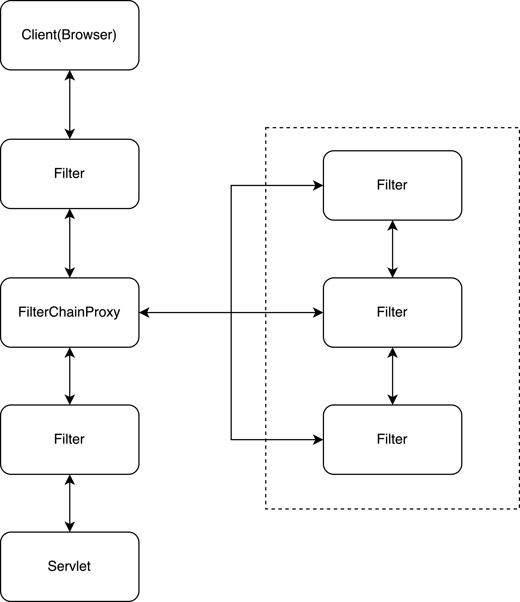
过滤器链可能存在多个
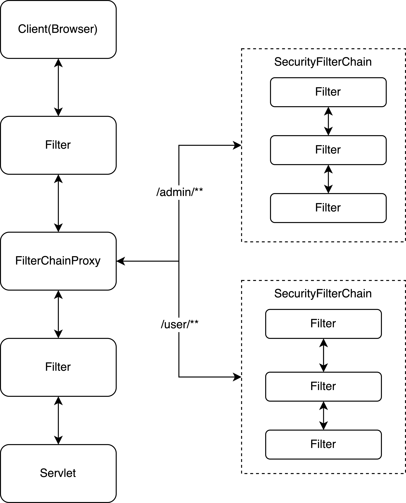
FilterChainProxy会通过DelegatingFilterProxy整合到原生过滤器链中。
Spring Security还对登录成功后的用户信息数据做了线程绑定（Session中也会存储一份）。使用的是ThreadLocal的机制，SecurityContextHolder中会存储这个变量，当处理完成，SecurityContextHolder会把数据清空，并放到Session中，以后每当有请求到来，先到session中取出登录数据放到SecurityContextHolder中，然后处理完，再次保存到Session中。但是如果是异步执行的话，线程中获取不到登录用户信息，特别是使用`@Async`时候，Spring Security为此提供了解决方案
```java
@Configuration
public class Config extends AsyncConfigurerSupport {
    @Override
    public Executor getAsyncExecutor() {
        return new DelegatingSecurityContextExecutorService(
                Executors.newFixedThreadPool(5));
    }
}
```
# 第2章 认证
## Spring Security的基本认证
引进依赖
```xml
              <dependency>
                    <groupId>org.springframework.boot</groupId>
                    <artifactId>spring-boot-starter-security</artifactId>
                    <version>2.7.1</version>
                </dependency>
```
来看一下请求的流程

- 客户端发起请求访问/hello接口，这个接口被鉴权
- 请求达到服务端走了一遍security的过滤器链，然后到达FilterSecurityInterceptor被拦截下来，因为发现用户未认证抛出AccessDeniedException异常
- 异常在ExceptionTranslationFilter中被捕获，ExceptionTranslationFilter通过调用LoginUrlAuthenticationEntryPoint#commence方法给客户端返回302，要求客户端重定向到/login页面
- 客户端发起/login请求
- /login请求被DefaultLoginPageGeneratingFilter过滤器拦截下来，并在该过滤器中返回登录页面

引入Starter依赖后，Spring Boot做了很多事情:
- 开启Spring Security的自动化配置，自动创建一个名叫springDSecurityFilterChain的过滤器，注入到Spring容器中，负责所有安全的事情，包括认证，授权等，实际是里面的过滤器链处理的;
- 创建一个UserDetailsService的实例，负责提供用户数据，默认的用户是基于内存的用户，用户名是user，密码随机生成;
- 给用户生成默认的登录页面
- 开启CSRF攻击防御
- 开启会话固定攻击防御
- 集成X-XSS-Protection
- 集成X-Frame-Options以防止单击劫持

spring security定义了UserDetails接口定义用户对象，提供这个接口的是UserDetailsService，参数是一个username，开发者要自己实现，Spring Security也提供了一些实现，如下图:
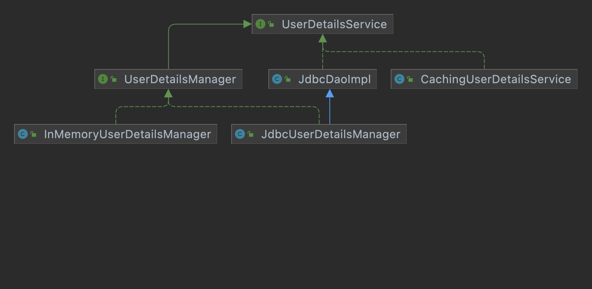

- UserDetailsManager, 在UserDetailsService基础上额外添加了一些操作用户的方法;
- JdbcDaoImpl通过spring-jdbc实现通过数据库查询用户;
- InMemoryUserDetailsManager,实现基于内存的用户增删改查的方法;
- JdbcUserDetailsManager, 通过jdbc实现用户的增删改查;
- CachingUserDetailsService, 缓存的方式;
- UserDetailsServiceDelegator, 提供UserDetailsService懒加载的功能；
- ReactiveUserDetailsServiceAdapter。 为WebFlux模块定义的UserDetailsService实现

如果没有提供，使用的就是InMemoryUserDetailsManager实现。Spring Security自动化配置的类是UserDetailsServiceAutoConfiguration，Spring Security提供了UserDetails的一个实现叫User，可以构造UserDetails的实例，在UserDetailsServiceAutoConfiguration中使用SecurityProperties类获取了默认的用户名与密码，所以如果想要改变这个直接在application.properties文件里面改就行. 可以看下这个类
```java
@Configuration(proxyBeanMethods = false)
@ConditionalOnClass(AuthenticationManager.class)
@ConditionalOnBean(ObjectPostProcessor.class)
@ConditionalOnMissingBean(
		value = { AuthenticationManager.class, AuthenticationProvider.class, UserDetailsService.class },
		type = { "org.springframework.security.oauth2.jwt.JwtDecoder",
				"org.springframework.security.oauth2.server.resource.introspection.OpaqueTokenIntrospector" })
public class UserDetailsServiceAutoConfiguration {

	private static final String NOOP_PASSWORD_PREFIX = "{noop}";

	private static final Pattern PASSWORD_ALGORITHM_PATTERN = Pattern.compile("^\\{.+}.*$");

	private static final Log logger = LogFactory.getLog(UserDetailsServiceAutoConfiguration.class);

	@Bean
	@ConditionalOnMissingBean(
			type = "org.springframework.security.oauth2.client.registration.ClientRegistrationRepository")
	@Lazy
	public InMemoryUserDetailsManager inMemoryUserDetailsManager(SecurityProperties properties,
			ObjectProvider<PasswordEncoder> passwordEncoder) {
		SecurityProperties.User user = properties.getUser();
		List<String> roles = user.getRoles();
		return new InMemoryUserDetailsManager(
				User.withUsername(user.getName()).password(getOrDeducePassword(user, passwordEncoder.getIfAvailable()))
						.roles(StringUtils.toStringArray(roles)).build());
	}

	private String getOrDeducePassword(SecurityProperties.User user, PasswordEncoder encoder) {
		String password = user.getPassword();
		if (user.isPasswordGenerated()) {
			logger.info(String.format("%n%nUsing generated security password: %s%n", user.getPassword()));
		}
		if (encoder != null || PASSWORD_ALGORITHM_PATTERN.matcher(password).matches()) {
			return password;
		}
		return NOOP_PASSWORD_PREFIX + password;
	}

}
```
存在2个默认页面，登陆与注销页面，是由DefaultLoginPageGeneratingFilter与DefaultLogoutPageGeneratingFilter2个过滤器处理的，DefaultLoginPageGeneratingFilter专门处理重定向过来的/login接口，核心代码如下：
```java
public void doFilter(ServletRequest req, ServletResponse res, FilterChain chain)
			throws IOException, ServletException {
		HttpServletRequest request = (HttpServletRequest) req;
		HttpServletResponse response = (HttpServletResponse) res;

		boolean loginError = isErrorPage(request);
		boolean logoutSuccess = isLogoutSuccess(request);
		if (isLoginUrlRequest(request) || loginError || logoutSuccess) {
			String loginPageHtml = generateLoginPageHtml(request, loginError,
					logoutSuccess);
			response.setContentType("text/html;charset=UTF-8");
			response.setContentLength(loginPageHtml.getBytes(StandardCharsets.UTF_8).length);
			response.getWriter().write(loginPageHtml);

			return;
		}

		chain.doFilter(request, response);
	}
```
- doFilter中只处理/login登陆请求，这个在代码中有判断;
- 通过generateLoginPageHtml方法生成登陆的html页面，根据是否登陆错误，会把这些信息拼接上;
- 然后通过HttpServletResponse写到响应流中，然后return;
DefaultLogoutPageGeneratingFilter的源代码更好懂，核心源码如下:
```java
	protected void doFilterInternal(HttpServletRequest request,
			HttpServletResponse response, FilterChain filterChain)
			throws ServletException, IOException {
		if (this.matcher.matches(request)) {
			renderLogout(request, response);
		} else {
			filterChain.doFilter(request, response);
		}
	}
```
## 登录表单配置
定义一个login.html，登录的页面，核心代码如下:
```html
                    <form id="login-form" class="form" action="/doLogin" method="post">
                        <h3 class="text-center text-info">登录</h3>
                        <div class="form-group">
                            <label for="username" class="text-info">用户名:</label><br>
                            <input type="text" name="uname" id="username" class="form-control">
                        </div>
                        <div class="form-group">
                            <label for="password" class="text-info">密码:</label><br>
                            <input type="text" name="passwd" id="password" class="form-control">
                        </div>
                        <div class="form-group">
                            <input type="submit" name="submit" class="btn btn-info btn-md" value="登录">
                        </div>
                    </form>
```
提供一个Spring Security的配置类，核心代码如下:
```java
@Configuration
public class SecurityConfig extends WebSecurityConfigurerAdapter {
    @Override
    protected void configure(final HttpSecurity http) throws Exception {
        http.authorizeRequests().anyRequest().authenticated().and().formLogin()
                .loginPage("/login.html").loginProcessingUrl("doLogin")
                .defaultSuccessUrl("/hello").failureUrl("/login.html")
                .usernameParameter("uname").passwordParameter("passwd")
                .permitAll().and().csrf().disable();
    }
}
```
- 这是一个链式配置;
- authorizeRequests()表示开启权限配置，anyRequest().authenticated()表示所有的请求都要认证之后才能访问;
- and()方法会返回HttpSecurityBuilder的一个子类，实际就是HttpSecurity，表示开启新一轮的配置；
- formLogin()表示开启表单登录配置，loginPage用来配置登录页面地址，loginProcessingUrl用来配置登录接口地址，defaultSuccessUrl表示登录成功后的跳转接口，failureUrl表示登录失败后的跳转地址，usernameParameter表示登录用户参数名称，passwordParameter表示登录密码参数名称，permitAll()表示与登录相关的页面与接口不做拦截;
- csrf().disable()表示禁用CSRF防御功能.

配置细节:
1. 登录成功

除了defaultSuccessUrl可以配置登录成功后的跳转地址外，successForwardUrl也可以配置登录成功后的跳转; 区别如下:
- defaultSuccessUrl表示用户登录成功后，会自动重定向到之前的地址上，如果用户直接访问登录页面，那么成功后会转到defaultSuccessUrl指定的路径；
- successForwardUrl不会考虑用户之前的的访问地址，只要用户登录成功就在服务器端跳转到successForwardUrl指定的页面;
- defaultSuccessUrl有一个重载方法，第二个参数如果为true，那么实现的效果与successForwardUrl一致，区别是defaultSuccessUrl是通过重定向实现跳转，successForwardUrl是直接在服务器端跳转;

实现successForwardUrl与defaultSuccessUrl的机制是`AuthenticationSuccessHandler`实例，它是专门用来处理登录成功的事情，接口的代码如下:
```java
public interface AuthenticationSuccessHandler {

	/**
	 * Called when a user has been successfully authenticated.
	 *
	 * @param request the request which caused the successful authentication
	 * @param response the response
	 * @param chain the {@link FilterChain} which can be used to proceed other filters in the chain
	 * @param authentication the <tt>Authentication</tt> object which was created during
	 * the authentication process.
	 * @since 5.2.0
	 */
	default void onAuthenticationSuccess(HttpServletRequest request,
			HttpServletResponse response, FilterChain chain, Authentication authentication)
			throws IOException, ServletException{
		onAuthenticationSuccess(request, response, authentication);
		chain.doFilter(request, response);
	}

	/**
	 * Called when a user has been successfully authenticated.
	 *
	 * @param request the request which caused the successful authentication
	 * @param response the response
	 * @param authentication the <tt>Authentication</tt> object which was created during
	 * the authentication process.
	 */
	void onAuthenticationSuccess(HttpServletRequest request,
			HttpServletResponse response, Authentication authentication)
			throws IOException, ServletException;

}

```
`Authentication`保存了登录成功后的用户信息，它有3个实现类:
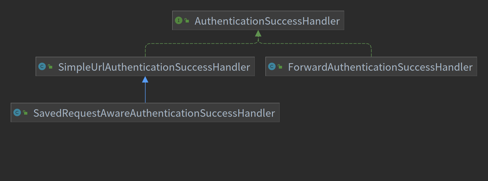
- `SimpleUrlAuthenticationSuccessHandler`继承自`AbstractAuthenticationTargetUrlRequestHandler`通过handle方法实现请求的重定向;
- `SavedRequestAwareAuthenticationSuccessHandler`在`SimpleUrlAuthenticationSuccessHandler`的基础上增加了请求缓存的功能，可以记录之前请求的地址，在成功后重定向到之前访问的地址;
- `ForwardAuthenticationSuccessHandler`就是一个服务端跳转;
  
实现defaultSuccessUrl的实现类是`SavedRequestAwareAuthenticationSuccessHandler`，核心源码如下:
```java
public class SavedRequestAwareAuthenticationSuccessHandler extends
		SimpleUrlAuthenticationSuccessHandler {
	protected final Log logger = LogFactory.getLog(this.getClass());

	private RequestCache requestCache = new HttpSessionRequestCache();

	@Override
	public void onAuthenticationSuccess(HttpServletRequest request,
			HttpServletResponse response, Authentication authentication)
			throws ServletException, IOException {
		SavedRequest savedRequest = requestCache.getRequest(request, response);

		if (savedRequest == null) {
			super.onAuthenticationSuccess(request, response, authentication);

			return;
		}
		String targetUrlParameter = getTargetUrlParameter();
		if (isAlwaysUseDefaultTargetUrl()
				|| (targetUrlParameter != null && StringUtils.hasText(request
						.getParameter(targetUrlParameter)))) {
			requestCache.removeRequest(request, response);
			super.onAuthenticationSuccess(request, response, authentication);

			return;
		}

		clearAuthenticationAttributes(request);

		// Use the DefaultSavedRequest URL
		String targetUrl = savedRequest.getRedirectUrl();
		logger.debug("Redirecting to DefaultSavedRequest Url: " + targetUrl);
		getRedirectStrategy().sendRedirect(request, response, targetUrl);
	}

	public void setRequestCache(RequestCache requestCache) {
		this.requestCache = requestCache;
	}
}
```
- 首先向缓存中获取请求，如果没有，说明访问的直接就是登录地址，则调用父类处理，直接重定向到defaultSuccessUrl;
- 接下来获取getTargetUrlParameter是判断使用是否在路径上指定了要跳转的地址，这个有个专门的参数，比如target=xxxx，这个方法是获取参数的key;
- 接下来判断isAlwaysUseDefaultTargetUrl()，如果为true，则始终重定向到defaultSuccessUrl指定的地址，如果为false，但是targetUrlParameter存在，则重定向到参数指定的地址;
- 从缓存中的请求中获取重定向的地址;
k可以定义自己的`SavedRequestAwareAuthenticationSuccessHandler`，比如:
```java
    @Override
    protected void configure(final HttpSecurity http) throws Exception {
        http.authorizeRequests().anyRequest().authenticated().and().formLogin()
                .loginPage("/login.html").loginProcessingUrl("/doLogin")
                .successHandler(authenticationSuccessHandler())
                .failureUrl("/login.html").usernameParameter("uname")
                .passwordParameter("passwd").permitAll().and().csrf().disable();
    }
    
    @Bean
    public AuthenticationSuccessHandler authenticationSuccessHandler() {
        final SavedRequestAwareAuthenticationSuccessHandler successHandler = new SavedRequestAwareAuthenticationSuccessHandler();
        successHandler.setDefaultTargetUrl("/index");
        successHandler.setTargetUrlParameter("target");
        return successHandler;
    }
```
successForwardUrl对应的实现类是`ForwardAuthenticationSuccessHandler`，核心源码如下:
```java
public class ForwardAuthenticationSuccessHandler implements AuthenticationSuccessHandler {

	private final String forwardUrl;

	/**
	 * @param forwardUrl
	 */
	public ForwardAuthenticationSuccessHandler(String forwardUrl) {
		Assert.isTrue(UrlUtils.isValidRedirectUrl(forwardUrl),
				() -> "'" + forwardUrl + "' is not a valid forward URL");
		this.forwardUrl = forwardUrl;
	}

	public void onAuthenticationSuccess(HttpServletRequest request, HttpServletResponse response, Authentication authentication) throws IOException, ServletException {
		request.getRequestDispatcher(forwardUrl).forward(request, response);
	}
}
```
对于前后端分离的项目，页面跳转都是前端操作的，不需要后端作，此时可以自定义`AuthenticationSuccessHandler`实现来决定返回给前端的内容.
2. 登录失败的处理逻辑

添加模板处理引擎
```xml
        <dependency>
            <groupId>org.springframework.boot</groupId>
            <artifactId>spring-boot-starter-thymeleaf</artifactId>
        </dependency>
```
添加能显示登录失败的html模板
```html
                    <form id="login-form" class="form" action="/doLogin" method="post">
                        <h3 class="text-center text-info">登录</h3>
                        <div th:text="${SPRING_SECURITY_LAST_EXCEPTION}"></div>
                        <div class="form-group">
                            <label for="username" class="text-info">用户名:</label><br>
                            <input type="text" name="uname" id="username" class="form-control">
                        </div>
                        <div class="form-group">
                            <label for="password" class="text-info">密码:</label><br>
                            <input type="text" name="passwd" id="password" class="form-control">
                        </div>
                        <div class="form-group">
                            <input type="submit" name="submit" class="btn btn-info btn-md" value="登录">
                        </div>
                    </form>
```
里面多个个动态展示登录失败信息的内容，以为是动态的，所以需要设置一个接口地址:
```java
@Controller
public class LoginPageController {
    
    @RequestMapping("/mylogin.html")
    public String login() {
        return "mylogin";
    }
}
```
最后修改安全配置为:
```java
    @Override
    protected void configure(final HttpSecurity http) throws Exception {
        http.authorizeRequests().anyRequest().authenticated().and().formLogin()
                .loginPage("/mylogin.html").loginProcessingUrl("/doLogin")
                .successHandler(authenticationSuccessHandler())
                .failureForwardUrl("/mylogin.html").usernameParameter("uname")
                .passwordParameter("passwd").permitAll().and().csrf().disable();
    }
```
使用了failureForwardUrl而不是failureUrl是因为failureUrl是客户端重定向，没有携带登录失败的信息，因为是一次新的请求，而failureForwardUrl是服务端重定向，登录失败的请求会被html渲染处理，登录失败对应的实现类是`AuthenticationFailureHandler`，接口代码如下:
```java
public interface AuthenticationFailureHandler {

	/**
	 * Called when an authentication attempt fails.
	 * @param request the request during which the authentication attempt occurred.
	 * @param response the response.
	 * @param exception the exception which was thrown to reject the authentication
	 * request.
	 */
	void onAuthenticationFailure(HttpServletRequest request,
			HttpServletResponse response, AuthenticationException exception)
			throws IOException, ServletException;
}
```
它有5个实现类，类图如下:
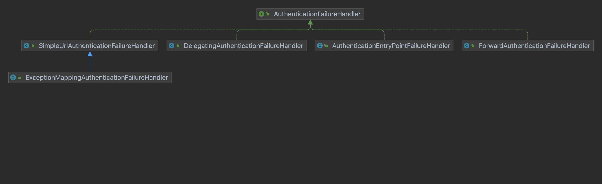
- `SimpleUrlAuthenticationFailureHandler`的默认的处理逻辑就是重定向到登录页，可有配置forwardToDestination设置为服务端重定向，failureUrl对应的实现就是这个;
- `ExceptionMappingAuthenticationFailureHandler`可以根据不同的异常类型映射到不同的路径;
- `ForwardAuthenticationFailureHandler`是服务端跳转到登录页，对应的配置是fialureForwardUrl;
- `AuthenticationEntryPointFailureHandler`新的类，可以通过`AuthenticationEntrypoint`处理登录异常;
- `DelegatingAuthenticationFailureHandler`可以实现为不同的登录异常配置不同的登录失败处理回调;

使用`SimpleUrlAuthenticationFailureHandler`实现`ForwardAuthenticationFailureHandler`的逻辑代码如下:
```java
    @Bean
    public AuthenticationFailureHandler authenticationFailureHandler() {
        final SimpleUrlAuthenticationFailureHandler failureHandler = new SimpleUrlAuthenticationFailureHandler();
        failureHandler.setUseForward(true);
        failureHandler.setDefaultFailureUrl("/mylogin.html");
        return failureHandler;
    }
```
核心源码如下:
```java
public class SimpleUrlAuthenticationFailureHandler implements
		AuthenticationFailureHandler {
	protected final Log logger = LogFactory.getLog(getClass());

	private String defaultFailureUrl;
	private boolean forwardToDestination = false;
	private boolean allowSessionCreation = true;
	private RedirectStrategy redirectStrategy = new DefaultRedirectStrategy();

	public SimpleUrlAuthenticationFailureHandler() {
	}

	public SimpleUrlAuthenticationFailureHandler(String defaultFailureUrl) {
		setDefaultFailureUrl(defaultFailureUrl);
	}

	/**
	 * Performs the redirect or forward to the {@code defaultFailureUrl} if set, otherwise
	 * returns a 401 error code.
	 * <p>
	 * If redirecting or forwarding, {@code saveException} will be called to cache the
	 * exception for use in the target view.
	 */
	public void onAuthenticationFailure(HttpServletRequest request,
			HttpServletResponse response, AuthenticationException exception)
			throws IOException, ServletException {

		if (defaultFailureUrl == null) {
			logger.debug("No failure URL set, sending 401 Unauthorized error");

			response.sendError(HttpStatus.UNAUTHORIZED.value(),
				HttpStatus.UNAUTHORIZED.getReasonPhrase());
		}
		else {
			saveException(request, exception);

			if (forwardToDestination) {
				logger.debug("Forwarding to " + defaultFailureUrl);

				request.getRequestDispatcher(defaultFailureUrl)
						.forward(request, response);
			}
			else {
				logger.debug("Redirecting to " + defaultFailureUrl);
				redirectStrategy.sendRedirect(request, response, defaultFailureUrl);
			}
		}
	}

	/**
	 * Caches the {@code AuthenticationException} for use in view rendering.
	 * <p>
	 * If {@code forwardToDestination} is set to true, request scope will be used,
	 * otherwise it will attempt to store the exception in the session. If there is no
	 * session and {@code allowSessionCreation} is {@code true} a session will be created.
	 * Otherwise the exception will not be stored.
	 */
	protected final void saveException(HttpServletRequest request,
			AuthenticationException exception) {
		if (forwardToDestination) {
			request.setAttribute(WebAttributes.AUTHENTICATION_EXCEPTION, exception);
		}
		else {
			HttpSession session = request.getSession(false);

			if (session != null || allowSessionCreation) {
				request.getSession().setAttribute(WebAttributes.AUTHENTICATION_EXCEPTION,
						exception);
			}
		}
	}

	/**
	 * The URL which will be used as the failure destination.
	 *
	 * @param defaultFailureUrl the failure URL, for example "/loginFailed.jsp".
	 */
	public void setDefaultFailureUrl(String defaultFailureUrl) {
		Assert.isTrue(UrlUtils.isValidRedirectUrl(defaultFailureUrl),
				() -> "'" + defaultFailureUrl + "' is not a valid redirect URL");
		this.defaultFailureUrl = defaultFailureUrl;
	}

	protected boolean isUseForward() {
		return forwardToDestination;
	}

	/**
	 * If set to <tt>true</tt>, performs a forward to the failure destination URL instead
	 * of a redirect. Defaults to <tt>false</tt>.
	 */
	public void setUseForward(boolean forwardToDestination) {
		this.forwardToDestination = forwardToDestination;
	}

	/**
	 * Allows overriding of the behaviour when redirecting to a target URL.
	 */
	public void setRedirectStrategy(RedirectStrategy redirectStrategy) {
		this.redirectStrategy = redirectStrategy;
	}

	protected RedirectStrategy getRedirectStrategy() {
		return redirectStrategy;
	}

	protected boolean isAllowSessionCreation() {
		return allowSessionCreation;
	}

	public void setAllowSessionCreation(boolean allowSessionCreation) {
		this.allowSessionCreation = allowSessionCreation;
	}
}
```
可以仔细看保存登录异常的代码，在forawrdToDestination的不同值保存的地方也是不同的.
3. 注销登录的处理逻辑
```java
    @Override
    protected void configure(final HttpSecurity http) throws Exception {
        http.authorizeRequests().anyRequest().authenticated().and().formLogin()
                .loginPage("/mylogin.html").loginProcessingUrl("/doLogin")
                .successHandler(authenticationSuccessHandler())
                .failureHandler(authenticationFailureHandler())
                .usernameParameter("uname").passwordParameter("passwd")
                .permitAll().and().logout().logoutUrl("/logout")
                .invalidateHttpSession(true).clearAuthentication(true)
                .logoutSuccessUrl("/mylogin.html").and().csrf().disable();
    }
```
- 通过.logout()方法开启注销登录配置;
- logoutUrl()指定注销登录请求地址，默认是GET请求，路径为/logout
- invalidateHttpSession指定是否使session失效;
- clearAuthentication表示是否清除认证信息;
- logoutSuccessUrl表示注销登录后的跳转地址;
  
当然也可以自定义注销成功后的处理，比如在前后端处理中返回JSON，logoutSuccessUrl对应的实现类是`LogoutSuccessHandler`，与前面的登录成功的关系类似。

## 登录用户数据获取
登录成功后获取用户对象的2种方式:
- 从SecurityContextHolder中获取;
- 从当前请求对象中获取;

无论哪种获取方式都是获取`Authentication`对象
- 作为`AuthenticationManager`的输入参数，提供用户身份认证的凭据，此时isAuthenticated=false，表示用户还未认证;
- 代表经过身份认证的用户，此时`Authentication`可以从`SecurityContextHolder`中获取;
`Authentication`对象包含3方面的信息:
- principal: 定义认证的用户，如果用户使用用户名/密码的方式登录，principal就是一个UserDetails对象;
- credentials: 登录凭证，一般就是密码，登录成功后，这个信息会被自动擦除，以免泄漏;
- authorities: 用户被授予的权限信息.

Java本身提供了`Principal`接口来描述认证主体，可以代表登录ID，Spring Security提供了`Authentication`代表登录用户信息，继承自`Principal`，核心代码如下:
```java
public interface Authentication extends Principal, Serializable {
	// ~ Methods
	// ========================================================================================================

	/**
	 * Set by an <code>AuthenticationManager</code> to indicate the authorities that the
	 * principal has been granted. Note that classes should not rely on this value as
	 * being valid unless it has been set by a trusted <code>AuthenticationManager</code>.
	 * <p>
	 * Implementations should ensure that modifications to the returned collection array
	 * do not affect the state of the Authentication object, or use an unmodifiable
	 * instance.
	 * </p>
	 *
	 * @return the authorities granted to the principal, or an empty collection if the
	 * token has not been authenticated. Never null.
	 */
	Collection<? extends GrantedAuthority> getAuthorities();

	/**
	 * The credentials that prove the principal is correct. This is usually a password,
	 * but could be anything relevant to the <code>AuthenticationManager</code>. Callers
	 * are expected to populate the credentials.
	 *
	 * @return the credentials that prove the identity of the <code>Principal</code>
	 */
	Object getCredentials();

	/**
	 * Stores additional details about the authentication request. These might be an IP
	 * address, certificate serial number etc.
	 *
	 * @return additional details about the authentication request, or <code>null</code>
	 * if not used
	 */
	Object getDetails();

	/**
	 * The identity of the principal being authenticated. In the case of an authentication
	 * request with username and password, this would be the username. Callers are
	 * expected to populate the principal for an authentication request.
	 * <p>
	 * The <tt>AuthenticationManager</tt> implementation will often return an
	 * <tt>Authentication</tt> containing richer information as the principal for use by
	 * the application. Many of the authentication providers will create a
	 * {@code UserDetails} object as the principal.
	 *
	 * @return the <code>Principal</code> being authenticated or the authenticated
	 * principal after authentication.
	 */
	Object getPrincipal();

	/**
	 * Used to indicate to {@code AbstractSecurityInterceptor} whether it should present
	 * the authentication token to the <code>AuthenticationManager</code>. Typically an
	 * <code>AuthenticationManager</code> (or, more often, one of its
	 * <code>AuthenticationProvider</code>s) will return an immutable authentication token
	 * after successful authentication, in which case that token can safely return
	 * <code>true</code> to this method. Returning <code>true</code> will improve
	 * performance, as calling the <code>AuthenticationManager</code> for every request
	 * will no longer be necessary.
	 * <p>
	 * For security reasons, implementations of this interface should be very careful
	 * about returning <code>true</code> from this method unless they are either
	 * immutable, or have some way of ensuring the properties have not been changed since
	 * original creation.
	 *
	 * @return true if the token has been authenticated and the
	 * <code>AbstractSecurityInterceptor</code> does not need to present the token to the
	 * <code>AuthenticationManager</code> again for re-authentication.
	 */
	boolean isAuthenticated();

	/**
	 * See {@link #isAuthenticated()} for a full description.
	 * <p>
	 * Implementations should <b>always</b> allow this method to be called with a
	 * <code>false</code> parameter, as this is used by various classes to specify the
	 * authentication token should not be trusted. If an implementation wishes to reject
	 * an invocation with a <code>true</code> parameter (which would indicate the
	 * authentication token is trusted - a potential security risk) the implementation
	 * should throw an {@link IllegalArgumentException}.
	 *
	 * @param isAuthenticated <code>true</code> if the token should be trusted (which may
	 * result in an exception) or <code>false</code> if the token should not be trusted
	 *
	 * @throws IllegalArgumentException if an attempt to make the authentication token
	 * trusted (by passing <code>true</code> as the argument) is rejected due to the
	 * implementation being immutable or implementing its own alternative approach to
	 * {@link #isAuthenticated()}
	 */
	void setAuthenticated(boolean isAuthenticated) throws IllegalArgumentException;
}
```
- getAuthorities()用来获取用户权限;
- getCredentials()用来获取用户凭证，就是密码;
- getDetails()用来获取用户的详细信息;
- getPrincipal()获取当前用户信息，可能是用户名或者用户对象;
- isAuthenticated()当前用户是否认证成功

不同的认证方式对应不同的Authentication实例，它的实现类主要有:
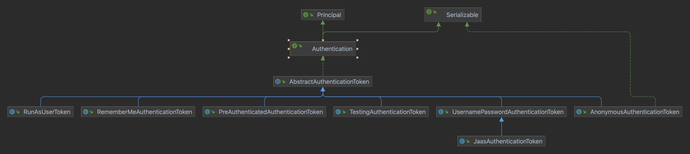
- `AbstractAuthenticationToken`:对`Authentication`进行了实现;
- `RememberMeAuthenticationToken`: 如果用户使用RememberMe的方式登录，则登录信息封装在这里面;
- `TestingAuthenticationToken`: 单元测试时封装的用户对象;
- `AnonymousAuthenticationToken`: 匿名登录时封装的用户对象;
- `RunAsUserToken`: 替换验证身份时封装的用户对象;
- `UsernamePasswordAuthenticationToken`: 表单登录时封装的用户对象;
- `JaasAuthenticationToken`: JAAS认证时封装的用户对象;
- `PreAuthenticatedAuthenticationToken`: Pre-Authentication场景下封装的用户对象

1. 从SecurityContextHolder中获取
```java
    @GetMapping("/user")
    public void printUser() {
        final Authentication authentication = SecurityContextHolder.getContext()
                .getAuthentication();
        log.info("username: {}", authentication.getName());
        log.info("role: {}", authentication.getAuthorities());
    }
```
SecurityContextHolder包含SecurityContext，SecurityContext包含Authentication。SecurityContextHolder包含3种存储策略
- MODE_THREADLOCAL: 将SecurityContext放在ThreadLocal中, 这是默认的存储策略, 但是子线程就获取不到;
- MODE_INHERITTABLETHREADLOCAL: 子线程可以从父线程中继承登录用户数据;
- MODE_GLOBAL: 登录数据保存在一个静态变量中

`SecurityContextHolderStrategy`接口定义了SecurityContext的增删改查方法，核心源码如下:
```java
public interface SecurityContextHolderStrategy {
	// ~ Methods
	// ========================================================================================================

	/**
	 * Clears the current context.
	 */
	void clearContext();

	/**
	 * Obtains the current context.
	 *
	 * @return a context (never <code>null</code> - create a default implementation if
	 * necessary)
	 */
	SecurityContext getContext();

	/**
	 * Sets the current context.
	 *
	 * @param context to the new argument (should never be <code>null</code>, although
	 * implementations must check if <code>null</code> has been passed and throw an
	 * <code>IllegalArgumentException</code> in such cases)
	 */
	void setContext(SecurityContext context);

	/**
	 * Creates a new, empty context implementation, for use by
	 * <tt>SecurityContextRepository</tt> implementations, when creating a new context for
	 * the first time.
	 *
	 * @return the empty context.
	 */
	SecurityContext createEmptyContext();
}
```
- clearContext(): 清除存储的SecurityContext;
- getContext(): 获取存储的SecurityContext;
- setContext(): 设置存储的SecurityContext;
- createEmptyContext(): 创建一个空的SecurityContext对象;
这个接口有3个实现，分别对应上面说的3种:
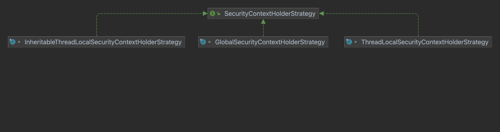
ThreadLocalSecurityContextHolderStrategy核心源码如下: 
```java
final class ThreadLocalSecurityContextHolderStrategy implements
		SecurityContextHolderStrategy {
	// ~ Static fields/initializers
	// =====================================================================================

	private static final ThreadLocal<SecurityContext> contextHolder = new ThreadLocal<>();

	// ~ Methods
	// ========================================================================================================

	public void clearContext() {
		contextHolder.remove();
	}

	public SecurityContext getContext() {
		SecurityContext ctx = contextHolder.get();

		if (ctx == null) {
			ctx = createEmptyContext();
			contextHolder.set(ctx);
		}

		return ctx;
	}

	public void setContext(SecurityContext context) {
		Assert.notNull(context, "Only non-null SecurityContext instances are permitted");
		contextHolder.set(context);
	}

	public SecurityContext createEmptyContext() {
		return new SecurityContextImpl();
	}
}
```
InheritableThreadLocalSecurityContextHolderStrategy核心源码如下:
```java
final class InheritableThreadLocalSecurityContextHolderStrategy implements
		SecurityContextHolderStrategy {
	// ~ Static fields/initializers
	// =====================================================================================

	private static final ThreadLocal<SecurityContext> contextHolder = new InheritableThreadLocal<>();

	// ~ Methods
	// ========================================================================================================

	public void clearContext() {
		contextHolder.remove();
	}

	public SecurityContext getContext() {
		SecurityContext ctx = contextHolder.get();

		if (ctx == null) {
			ctx = createEmptyContext();
			contextHolder.set(ctx);
		}

		return ctx;
	}

	public void setContext(SecurityContext context) {
		Assert.notNull(context, "Only non-null SecurityContext instances are permitted");
		contextHolder.set(context);
	}

	public SecurityContext createEmptyContext() {
		return new SecurityContextImpl();
	}
}
```
```java
final class GlobalSecurityContextHolderStrategy implements SecurityContextHolderStrategy {
	// ~ Static fields/initializers
	// =====================================================================================

	private static SecurityContext contextHolder;

	// ~ Methods
	// ========================================================================================================

	public void clearContext() {
		contextHolder = null;
	}

	public SecurityContext getContext() {
		if (contextHolder == null) {
			contextHolder = new SecurityContextImpl();
		}

		return contextHolder;
	}

	public void setContext(SecurityContext context) {
		Assert.notNull(context, "Only non-null SecurityContext instances are permitted");
		contextHolder = context;
	}

	public SecurityContext createEmptyContext() {
		return new SecurityContextImpl();
	}
}
```
Holder的源码如下:
```java
/**
 * Associates a given {@link SecurityContext} with the current execution thread.
 * <p>
 * This class provides a series of static methods that delegate to an instance of
 * {@link org.springframework.security.core.context.SecurityContextHolderStrategy}. The
 * purpose of the class is to provide a convenient way to specify the strategy that should
 * be used for a given JVM. This is a JVM-wide setting, since everything in this class is
 * <code>static</code> to facilitate ease of use in calling code.
 * <p>
 * To specify which strategy should be used, you must provide a mode setting. A mode
 * setting is one of the three valid <code>MODE_</code> settings defined as
 * <code>static final</code> fields, or a fully qualified classname to a concrete
 * implementation of
 * {@link org.springframework.security.core.context.SecurityContextHolderStrategy} that
 * provides a public no-argument constructor.
 * <p>
 * There are two ways to specify the desired strategy mode <code>String</code>. The first
 * is to specify it via the system property keyed on {@link #SYSTEM_PROPERTY}. The second
 * is to call {@link #setStrategyName(String)} before using the class. If neither approach
 * is used, the class will default to using {@link #MODE_THREADLOCAL}, which is backwards
 * compatible, has fewer JVM incompatibilities and is appropriate on servers (whereas
 * {@link #MODE_GLOBAL} is definitely inappropriate for server use).
 *
 * @author Ben Alex
 *
 */
public class SecurityContextHolder {
	// ~ Static fields/initializers
	// =====================================================================================

	public static final String MODE_THREADLOCAL = "MODE_THREADLOCAL";
	public static final String MODE_INHERITABLETHREADLOCAL = "MODE_INHERITABLETHREADLOCAL";
	public static final String MODE_GLOBAL = "MODE_GLOBAL";
	public static final String SYSTEM_PROPERTY = "spring.security.strategy";
	private static String strategyName = System.getProperty(SYSTEM_PROPERTY);
	private static SecurityContextHolderStrategy strategy;
	private static int initializeCount = 0;

	static {
		initialize();
	}

	// ~ Methods
	// ========================================================================================================

	/**
	 * Explicitly clears the context value from the current thread.
	 */
	public static void clearContext() {
		strategy.clearContext();
	}

	/**
	 * Obtain the current <code>SecurityContext</code>.
	 *
	 * @return the security context (never <code>null</code>)
	 */
	public static SecurityContext getContext() {
		return strategy.getContext();
	}

	/**
	 * Primarily for troubleshooting purposes, this method shows how many times the class
	 * has re-initialized its <code>SecurityContextHolderStrategy</code>.
	 *
	 * @return the count (should be one unless you've called
	 * {@link #setStrategyName(String)} to switch to an alternate strategy.
	 */
	public static int getInitializeCount() {
		return initializeCount;
	}

	private static void initialize() {
		if (!StringUtils.hasText(strategyName)) {
			// Set default
			strategyName = MODE_THREADLOCAL;
		}

		if (strategyName.equals(MODE_THREADLOCAL)) {
			strategy = new ThreadLocalSecurityContextHolderStrategy();
		}
		else if (strategyName.equals(MODE_INHERITABLETHREADLOCAL)) {
			strategy = new InheritableThreadLocalSecurityContextHolderStrategy();
		}
		else if (strategyName.equals(MODE_GLOBAL)) {
			strategy = new GlobalSecurityContextHolderStrategy();
		}
		else {
			// Try to load a custom strategy
			try {
				Class<?> clazz = Class.forName(strategyName);
				Constructor<?> customStrategy = clazz.getConstructor();
				strategy = (SecurityContextHolderStrategy) customStrategy.newInstance();
			}
			catch (Exception ex) {
				ReflectionUtils.handleReflectionException(ex);
			}
		}

		initializeCount++;
	}

	/**
	 * Associates a new <code>SecurityContext</code> with the current thread of execution.
	 *
	 * @param context the new <code>SecurityContext</code> (may not be <code>null</code>)
	 */
	public static void setContext(SecurityContext context) {
		strategy.setContext(context);
	}

	/**
	 * Changes the preferred strategy. Do <em>NOT</em> call this method more than once for
	 * a given JVM, as it will re-initialize the strategy and adversely affect any
	 * existing threads using the old strategy.
	 *
	 * @param strategyName the fully qualified class name of the strategy that should be
	 * used.
	 */
	public static void setStrategyName(String strategyName) {
		SecurityContextHolder.strategyName = strategyName;
		initialize();
	}

	/**
	 * Allows retrieval of the context strategy. See SEC-1188.
	 *
	 * @return the configured strategy for storing the security context.
	 */
	public static SecurityContextHolderStrategy getContextHolderStrategy() {
		return strategy;
	}

	/**
	 * Delegates the creation of a new, empty context to the configured strategy.
	 */
	public static SecurityContext createEmptyContext() {
		return strategy.createEmptyContext();
	}

	@Override
	public String toString() {
		return "SecurityContextHolder[strategy='" + strategyName + "'; initializeCount="
				+ initializeCount + "]";
	}
}
```
子线程获取不到用户信息，但是可以使用继承的方式，通过源码可以知道可以通过`spring.security.strategy`环境变量改变存储的实现。`SecurityContextHolder`实现是通过`SecurityContextPersistenceFilter`实现的.
`SecurityContextPersistenceFilter`过滤器位于`WebAsyncManagerIntegrationFilter`之后，主要做2件事情:
- 当请求过来时，从HttpSession中获取`SecurityContext`并放入`SecurityContextHolder`中;
- 请求结束时，从`SecurityContextHolder`获取`SecurityContext`存入`httpSession`同时擦除`SecurityContextHolder`中的登录用户信息;

存入`httpSession`主要针对异步Servlet，同步的Servlet不是在这里存入的，而是响应提交时，就存到HttpSession中去了。Filter中使用了`SecurityContextRepository`接口实现.
```java
public interface SecurityContextRepository {

	/**
	 * Obtains the security context for the supplied request. For an unauthenticated user,
	 * an empty context implementation should be returned. This method should not return
	 * null.
	 * <p>
	 * The use of the <tt>HttpRequestResponseHolder</tt> parameter allows implementations
	 * to return wrapped versions of the request or response (or both), allowing them to
	 * access implementation-specific state for the request. The values obtained from the
	 * holder will be passed on to the filter chain and also to the <tt>saveContext</tt>
	 * method when it is finally called. Implementations may wish to return a subclass of
	 * {@link SaveContextOnUpdateOrErrorResponseWrapper} as the response object, which
	 * guarantees that the context is persisted when an error or redirect occurs.
	 *
	 * @param requestResponseHolder holder for the current request and response for which
	 * the context should be loaded.
	 *
	 * @return The security context which should be used for the current request, never
	 * null.
	 */
	SecurityContext loadContext(HttpRequestResponseHolder requestResponseHolder);

	/**
	 * Stores the security context on completion of a request.
	 *
	 * @param context the non-null context which was obtained from the holder.
	 * @param request
	 * @param response
	 */
	void saveContext(SecurityContext context, HttpServletRequest request,
			HttpServletResponse response);

	/**
	 * Allows the repository to be queried as to whether it contains a security context
	 * for the current request.
	 *
	 * @param request the current request
	 * @return true if a context is found for the request, false otherwise
	 */
	boolean containsContext(HttpServletRequest request);
}
```
- loadContext() 加载`SecurityContext`对象;
- saveContext() 保存`SecurityContext`对象;
- containsContext() 判断`SecurityContext`对象是否存在;

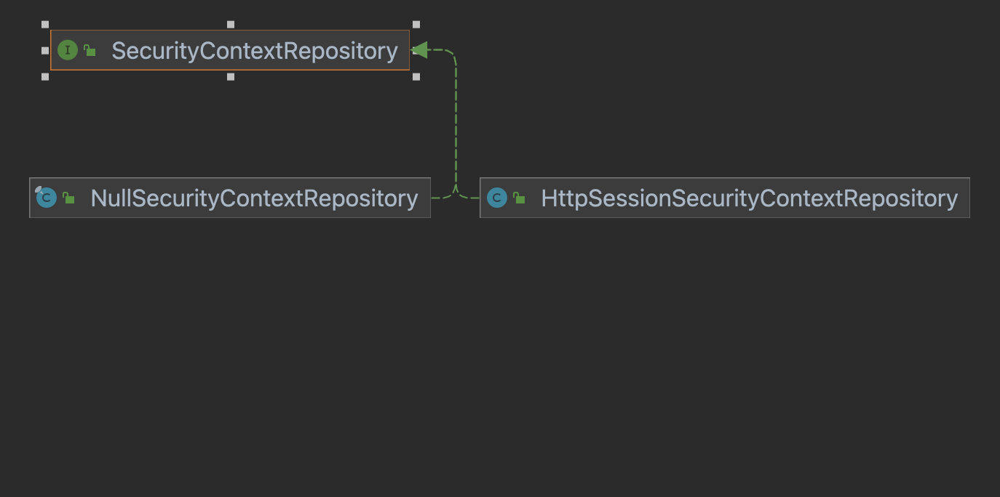
- `NullSecurityContextRepository`是一个简单的null实现;
- `HttpSessionSecurityContextRepository`是默认的实现，完成了到HttpSession到SecuirtyContext的存储与加载，`HttpSessionSecurityContextRepository`内部封装了请求与响应，使用了2个内部类.
1. SaveToSessionResponseWrapper，其继承关系图如下:
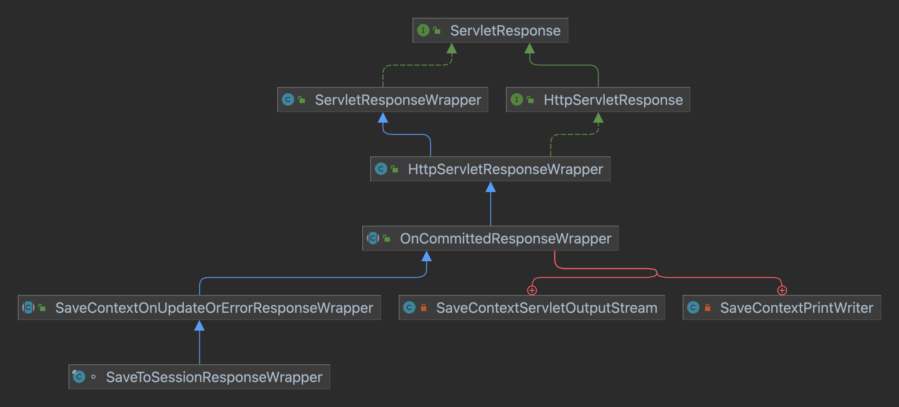
- HttpServletResponseWrapper: 实现了HttpServletResponse接口，是HttpServletResponse的装饰类，可以方便的操作参数与输出流;
- OnCommittedResponseWrapper: OnCommittedResponseWrapper继承自HttpServletResponseWrapper，对其功能进行了增强，最重要的增强是可以获取HttpServletResponse的提交行为，当HttpServletResponse的sendError、sendRedirect、flushBuffer、flush以及close被调用时，onResponseCommitted方法会被触发，开发者可以在onResponseCommitted方法中做一些数据保存工作，比如保存SecurityContext;
- `SaveContextOnUpdateOrErrorResponseWrapper`: 继承`OnCommittedResponseWrapper`对onResponseCommitted做了实现，里面声明了一个contextSaved变量，表示SecurityContext是否存储成功，实现的过程是调用saveContext将SecurityContext保存到HttpSession，同时将contextSaved=true，saveContext也是一个抽象方法，具体的实现在`SaveToSessionResponseWrapper`类中; 核心代码如下:
```java
	/**
	 * Wrapper that is applied to every request/response to update the
	 * <code>HttpSession<code> with
	 * the <code>SecurityContext</code> when a <code>sendError()</code> or
	 * <code>sendRedirect</code> happens. See SEC-398.
	 * <p>
	 * Stores the necessary state from the start of the request in order to make a
	 * decision about whether the security context has changed before saving it.
	 */
	final class SaveToSessionResponseWrapper extends
			SaveContextOnUpdateOrErrorResponseWrapper {

		private final HttpServletRequest request;
		private final boolean httpSessionExistedAtStartOfRequest;
		private final SecurityContext contextBeforeExecution;
		private final Authentication authBeforeExecution;

		/**
		 * Takes the parameters required to call <code>saveContext()</code> successfully
		 * in addition to the request and the response object we are wrapping.
		 *
		 * @param request the request object (used to obtain the session, if one exists).
		 * @param httpSessionExistedAtStartOfRequest indicates whether there was a session
		 * in place before the filter chain executed. If this is true, and the session is
		 * found to be null, this indicates that it was invalidated during the request and
		 * a new session will now be created.
		 * @param context the context before the filter chain executed. The context will
		 * only be stored if it or its contents changed during the request.
		 */
		SaveToSessionResponseWrapper(HttpServletResponse response,
				HttpServletRequest request, boolean httpSessionExistedAtStartOfRequest,
				SecurityContext context) {
			super(response, disableUrlRewriting);
			this.request = request;
			this.httpSessionExistedAtStartOfRequest = httpSessionExistedAtStartOfRequest;
			this.contextBeforeExecution = context;
			this.authBeforeExecution = context.getAuthentication();
		}

		/**
		 * Stores the supplied security context in the session (if available) and if it
		 * has changed since it was set at the start of the request. If the
		 * AuthenticationTrustResolver identifies the current user as anonymous, then the
		 * context will not be stored.
		 *
		 * @param context the context object obtained from the SecurityContextHolder after
		 * the request has been processed by the filter chain.
		 * SecurityContextHolder.getContext() cannot be used to obtain the context as it
		 * has already been cleared by the time this method is called.
		 *
		 */
		@Override
		protected void saveContext(SecurityContext context) {
			final Authentication authentication = context.getAuthentication();
			HttpSession httpSession = request.getSession(false);

			// See SEC-776
			if (authentication == null || trustResolver.isAnonymous(authentication)) {
				if (logger.isDebugEnabled()) {
					logger.debug("SecurityContext is empty or contents are anonymous - context will not be stored in HttpSession.");
				}

				if (httpSession != null && authBeforeExecution != null) {
					// SEC-1587 A non-anonymous context may still be in the session
					// SEC-1735 remove if the contextBeforeExecution was not anonymous
					httpSession.removeAttribute(springSecurityContextKey);
				}
				return;
			}

			if (httpSession == null) {
				httpSession = createNewSessionIfAllowed(context);
			}

			// If HttpSession exists, store current SecurityContext but only if it has
			// actually changed in this thread (see SEC-37, SEC-1307, SEC-1528)
			if (httpSession != null) {
				// We may have a new session, so check also whether the context attribute
				// is set SEC-1561
				if (contextChanged(context)
						|| httpSession.getAttribute(springSecurityContextKey) == null) {
					httpSession.setAttribute(springSecurityContextKey, context);

					if (logger.isDebugEnabled()) {
						logger.debug("SecurityContext '" + context
								+ "' stored to HttpSession: '" + httpSession);
					}
				}
			}
		}

		private boolean contextChanged(SecurityContext context) {
			return context != contextBeforeExecution
					|| context.getAuthentication() != authBeforeExecution;
		}

		private HttpSession createNewSessionIfAllowed(SecurityContext context) {
			if (isTransientAuthentication(context.getAuthentication())) {
				return null;
			}

			if (httpSessionExistedAtStartOfRequest) {
				if (logger.isDebugEnabled()) {
					logger.debug("HttpSession is now null, but was not null at start of request; "
							+ "session was invalidated, so do not create a new session");
				}

				return null;
			}

			if (!allowSessionCreation) {
				if (logger.isDebugEnabled()) {
					logger.debug("The HttpSession is currently null, and the "
							+ HttpSessionSecurityContextRepository.class.getSimpleName()
							+ " is prohibited from creating an HttpSession "
							+ "(because the allowSessionCreation property is false) - SecurityContext thus not "
							+ "stored for next request");
				}

				return null;
			}
			// Generate a HttpSession only if we need to

			if (contextObject.equals(context)) {
				if (logger.isDebugEnabled()) {
					logger.debug("HttpSession is null, but SecurityContext has not changed from default empty context: ' "
							+ context
							+ "'; not creating HttpSession or storing SecurityContext");
				}

				return null;
			}

			if (logger.isDebugEnabled()) {
				logger.debug("HttpSession being created as SecurityContext is non-default");
			}

			try {
				return request.getSession(true);
			}
			catch (IllegalStateException e) {
				// Response must already be committed, therefore can't create a new
				// session
				logger.warn("Failed to create a session, as response has been committed. Unable to store"
						+ " SecurityContext.");
			}

			return null;
		}
	}
```
- saveContext(): 保存SecurityContext到HttpSession中;
- contextChanged(): SecurityContext是否发生变化;
- createNewSessionIfAllowed: 创建HttpSession对象;

1. SaveToSessionRequestWrapper，核心代码如下:
```java
	private static class SaveToSessionRequestWrapper extends
			HttpServletRequestWrapper {
		private final SaveContextOnUpdateOrErrorResponseWrapper response;

		SaveToSessionRequestWrapper(HttpServletRequest request,
				SaveContextOnUpdateOrErrorResponseWrapper response) {
			super(request);
			this.response = response;
		}

		@Override
		public AsyncContext startAsync() {
			response.disableSaveOnResponseCommitted();
			return super.startAsync();
		}

		@Override
		public AsyncContext startAsync(ServletRequest servletRequest,
				ServletResponse servletResponse) throws IllegalStateException {
			response.disableSaveOnResponseCommitted();
			return super.startAsync(servletRequest, servletResponse);
		}
	}
```
主要的作用是禁止在异步Servlet提交时保存Context.

`HttpSessionSecurityContextRepository`完整的核心实现如下:
```java
public class HttpSessionSecurityContextRepository implements SecurityContextRepository {
	/**
	 * The default key under which the security context will be stored in the session.
	 */
	public static final String SPRING_SECURITY_CONTEXT_KEY = "SPRING_SECURITY_CONTEXT";

	protected final Log logger = LogFactory.getLog(this.getClass());

	/**
	 * SecurityContext instance used to check for equality with default (unauthenticated)
	 * content
	 */
	private final Object contextObject = SecurityContextHolder.createEmptyContext();
	private boolean allowSessionCreation = true;
	private boolean disableUrlRewriting = false;
	private String springSecurityContextKey = SPRING_SECURITY_CONTEXT_KEY;

	private AuthenticationTrustResolver trustResolver = new AuthenticationTrustResolverImpl();

	/**
	 * Gets the security context for the current request (if available) and returns it.
	 * <p>
	 * If the session is null, the context object is null or the context object stored in
	 * the session is not an instance of {@code SecurityContext}, a new context object
	 * will be generated and returned.
	 */
	public SecurityContext loadContext(HttpRequestResponseHolder requestResponseHolder) {
		HttpServletRequest request = requestResponseHolder.getRequest();
		HttpServletResponse response = requestResponseHolder.getResponse();
		HttpSession httpSession = request.getSession(false);

		SecurityContext context = readSecurityContextFromSession(httpSession);

		if (context == null) {
			if (logger.isDebugEnabled()) {
				logger.debug("No SecurityContext was available from the HttpSession: "
						+ httpSession + ". " + "A new one will be created.");
			}
			context = generateNewContext();

		}

		SaveToSessionResponseWrapper wrappedResponse = new SaveToSessionResponseWrapper(
				response, request, httpSession != null, context);
		requestResponseHolder.setResponse(wrappedResponse);

		requestResponseHolder.setRequest(new SaveToSessionRequestWrapper(
				request, wrappedResponse));

		return context;
	}

	public void saveContext(SecurityContext context, HttpServletRequest request,
			HttpServletResponse response) {
		SaveContextOnUpdateOrErrorResponseWrapper responseWrapper = WebUtils
				.getNativeResponse(response,
						SaveContextOnUpdateOrErrorResponseWrapper.class);
		if (responseWrapper == null) {
			throw new IllegalStateException(
					"Cannot invoke saveContext on response "
							+ response
							+ ". You must use the HttpRequestResponseHolder.response after invoking loadContext");
		}
		// saveContext() might already be called by the response wrapper
		// if something in the chain called sendError() or sendRedirect(). This ensures we
		// only call it
		// once per request.
		if (!responseWrapper.isContextSaved()) {
			responseWrapper.saveContext(context);
		}
	}

	public boolean containsContext(HttpServletRequest request) {
		HttpSession session = request.getSession(false);

		if (session == null) {
			return false;
		}

		return session.getAttribute(springSecurityContextKey) != null;
	}

	/**
	 *
	 * @param httpSession the session obtained from the request.
	 */
	private SecurityContext readSecurityContextFromSession(HttpSession httpSession) {
		final boolean debug = logger.isDebugEnabled();

		if (httpSession == null) {
			if (debug) {
				logger.debug("No HttpSession currently exists");
			}

			return null;
		}

		// Session exists, so try to obtain a context from it.

		Object contextFromSession = httpSession.getAttribute(springSecurityContextKey);

		if (contextFromSession == null) {
			if (debug) {
				logger.debug("HttpSession returned null object for SPRING_SECURITY_CONTEXT");
			}

			return null;
		}

		// We now have the security context object from the session.
		if (!(contextFromSession instanceof SecurityContext)) {
			if (logger.isWarnEnabled()) {
				logger.warn(springSecurityContextKey
						+ " did not contain a SecurityContext but contained: '"
						+ contextFromSession
						+ "'; are you improperly modifying the HttpSession directly "
						+ "(you should always use SecurityContextHolder) or using the HttpSession attribute "
						+ "reserved for this class?");
			}

			return null;
		}

		if (debug) {
			logger.debug("Obtained a valid SecurityContext from "
					+ springSecurityContextKey + ": '" + contextFromSession + "'");
		}

		// Everything OK. The only non-null return from this method.

		return (SecurityContext) contextFromSession;
	}

	/**
	 * By default, calls {@link SecurityContextHolder#createEmptyContext()} to obtain a
	 * new context (there should be no context present in the holder when this method is
	 * called). Using this approach the context creation strategy is decided by the
	 * {@link SecurityContextHolderStrategy} in use. The default implementations will
	 * return a new <tt>SecurityContextImpl</tt>.
	 *
	 * @return a new SecurityContext instance. Never null.
	 */
	protected SecurityContext generateNewContext() {
		return SecurityContextHolder.createEmptyContext();
	}

	/**
	 * If set to true (the default), a session will be created (if required) to store the
	 * security context if it is determined that its contents are different from the
	 * default empty context value.
	 * <p>
	 * Note that setting this flag to false does not prevent this class from storing the
	 * security context. If your application (or another filter) creates a session, then
	 * the security context will still be stored for an authenticated user.
	 *
	 * @param allowSessionCreation
	 */
	public void setAllowSessionCreation(boolean allowSessionCreation) {
		this.allowSessionCreation = allowSessionCreation;
	}

	/**
	 * Allows the use of session identifiers in URLs to be disabled. Off by default.
	 *
	 * @param disableUrlRewriting set to <tt>true</tt> to disable URL encoding methods in
	 * the response wrapper and prevent the use of <tt>jsessionid</tt> parameters.
	 */
	public void setDisableUrlRewriting(boolean disableUrlRewriting) {
		this.disableUrlRewriting = disableUrlRewriting;
	}

	/**
	 * Allows the session attribute name to be customized for this repository instance.
	 *
	 * @param springSecurityContextKey the key under which the security context will be
	 * stored. Defaults to {@link #SPRING_SECURITY_CONTEXT_KEY}.
	 */
	public void setSpringSecurityContextKey(String springSecurityContextKey) {
		Assert.hasText(springSecurityContextKey,
				"springSecurityContextKey cannot be empty");
		this.springSecurityContextKey = springSecurityContextKey;
	}
	private boolean isTransientAuthentication(Authentication authentication) {
		return AnnotationUtils.getAnnotation(authentication.getClass(), Transient.class) != null;
	}

	/**
	 * Sets the {@link AuthenticationTrustResolver} to be used. The default is
	 * {@link AuthenticationTrustResolverImpl}.
	 *
	 * @param trustResolver the {@link AuthenticationTrustResolver} to use. Cannot be
	 * null.
	 */
	public void setTrustResolver(AuthenticationTrustResolver trustResolver) {
		Assert.notNull(trustResolver, "trustResolver cannot be null");
		this.trustResolver = trustResolver;
	}
}
```
- SPRING_SECURITY_CONTEXT_KEY变量定义了HttpSession中存储的key的名称;
- trustResolver是一个用户身份评估器，用来判断当前用户是匿名用户还是RememberMe用户;
- loadContext()方法，从HttpSession中读取Context或者返回的一个表示空的Context;
- saveContext()方法将Context保存到HttpSession;
- containsContext()判断请求中是否已经存在Context对象;

`HttpSessionSecurityContextRepository`提供的所有的功能都在`SecurityContextPersistenceFilter`过滤器中调用，下面看下核心源代码:
```java
public class SecurityContextPersistenceFilter extends GenericFilterBean {

	static final String FILTER_APPLIED = "__spring_security_scpf_applied";

	private SecurityContextRepository repo;

	private boolean forceEagerSessionCreation = false;

	public SecurityContextPersistenceFilter() {
		this(new HttpSessionSecurityContextRepository());
	}

	public SecurityContextPersistenceFilter(SecurityContextRepository repo) {
		this.repo = repo;
	}

	public void doFilter(ServletRequest req, ServletResponse res, FilterChain chain)
			throws IOException, ServletException {
		HttpServletRequest request = (HttpServletRequest) req;
		HttpServletResponse response = (HttpServletResponse) res;

		if (request.getAttribute(FILTER_APPLIED) != null) {
			// ensure that filter is only applied once per request
			chain.doFilter(request, response);
			return;
		}

		final boolean debug = logger.isDebugEnabled();

		request.setAttribute(FILTER_APPLIED, Boolean.TRUE);

		if (forceEagerSessionCreation) {
			HttpSession session = request.getSession();

			if (debug && session.isNew()) {
				logger.debug("Eagerly created session: " + session.getId());
			}
		}

		HttpRequestResponseHolder holder = new HttpRequestResponseHolder(request,
				response);
		SecurityContext contextBeforeChainExecution = repo.loadContext(holder);

		try {
			SecurityContextHolder.setContext(contextBeforeChainExecution);

			chain.doFilter(holder.getRequest(), holder.getResponse());

		}
		finally {
			SecurityContext contextAfterChainExecution = SecurityContextHolder
					.getContext();
			// Crucial removal of SecurityContextHolder contents - do this before anything
			// else.
			SecurityContextHolder.clearContext();
			repo.saveContext(contextAfterChainExecution, holder.getRequest(),
					holder.getResponse());
			request.removeAttribute(FILTER_APPLIED);

			if (debug) {
				logger.debug("SecurityContextHolder now cleared, as request processing completed");
			}
		}
	}

	public void setForceEagerSessionCreation(boolean forceEagerSessionCreation) {
		this.forceEagerSessionCreation = forceEagerSessionCreation;
	}
}
```
- 从request中获取FILTER_APPLIED属性，主要是确保请求只会被当前的filter处理一次，没有的化写入一个;
- forceEagerSessionCreation表示是否要在过滤器链执行前创建会话;
- 构造HttpRequestResponseHolder对象;
- repo.loadContext(holder)调用repo加载Context对象;
- 将获取的Context放入到`SecurityContextHolder`中SecurityContextHolder.setContext(contextBeforeChainExecution);
- 执行后面的过滤器链，但是此时request与reponse已经是被holder封装的了;
- 在finally中，清空`SecurityContextHolder`里面的context，然后把context保存回Session，因为Context可能发生了变更;

2. 从当前请求对象中获取
```java
    @RequestMapping("/authentication")
    public String sayAuth(final Authentication authentication) {
        return authentication.toString();
    }
    
    @RequestMapping("/principal")
    public String sayPrincipal(final Principal principal) {
        return principal.toString();
    }
```
这些信息都来自HttpServletRequest，在不同的部署环境下，其实现是不同的，如果是Tomcat，其实现是RequestFacade，如果使用了Spring Security，那么其实现是`Servlet3SecurityContextHolderAwareRequestWrapper`，其继承关系如下:
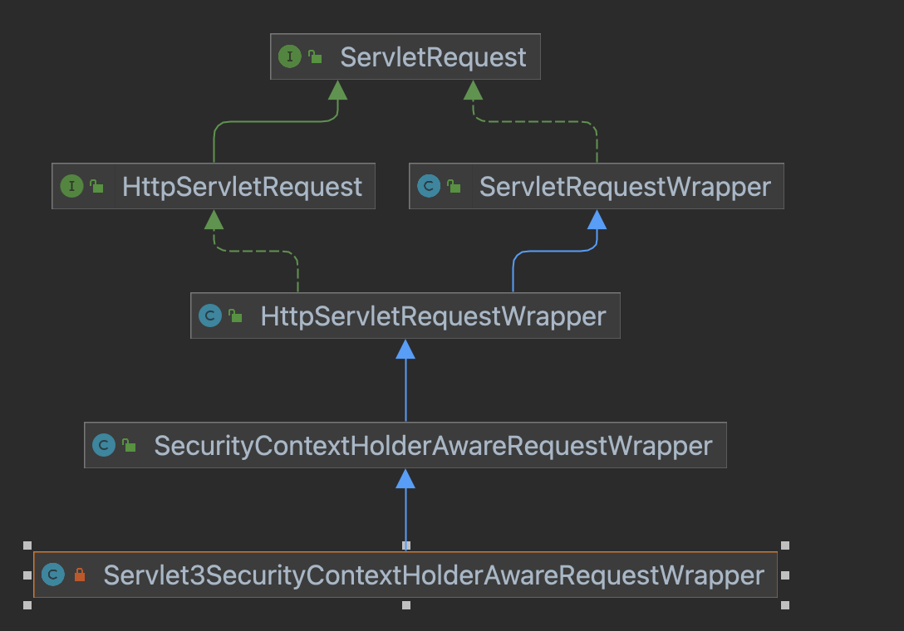
`SecurityContextHolderAwareRequestWrapper`实现了3.0版本之前的3个安全方法，`Servlet3SecurityContextHolderAwareRequestWrapper`实现了3.0版本的3个安全方法，核心源码如下:
```java
public class SecurityContextHolderAwareRequestWrapper extends HttpServletRequestWrapper {
	// ~ Instance fields
	// ================================================================================================

	private final AuthenticationTrustResolver trustResolver;

	/**
	 * The prefix passed by the filter. It will be prepended to any supplied role values
	 * before comparing it with the roles obtained from the security context.
	 */
	private final String rolePrefix;

	// ~ Constructors
	// ===================================================================================================

	/**
	 * Creates a new instance with {@link AuthenticationTrustResolverImpl}.
	 *
	 * @param request
	 * @param rolePrefix
	 */
	public SecurityContextHolderAwareRequestWrapper(HttpServletRequest request,
			String rolePrefix) {
		this(request, new AuthenticationTrustResolverImpl(), rolePrefix);
	}

	/**
	 * Creates a new instance
	 *
	 * @param request the original {@link HttpServletRequest}
	 * @param trustResolver the {@link AuthenticationTrustResolver} to use. Cannot be
	 * null.
	 * @param rolePrefix The prefix to be added to {@link #isUserInRole(String)} or null
	 * if no prefix.
	 */
	public SecurityContextHolderAwareRequestWrapper(HttpServletRequest request,
			AuthenticationTrustResolver trustResolver, String rolePrefix) {
		super(request);
		Assert.notNull(trustResolver, "trustResolver cannot be null");
		this.rolePrefix = rolePrefix;
		this.trustResolver = trustResolver;
	}

	// ~ Methods
	// ========================================================================================================

	/**
	 * Obtain the current active <code>Authentication</code>
	 *
	 * @return the authentication object or <code>null</code>
	 */
	private Authentication getAuthentication() {
		Authentication auth = SecurityContextHolder.getContext().getAuthentication();

		if (!trustResolver.isAnonymous(auth)) {
			return auth;
		}

		return null;
	}

	/**
	 * Returns the principal's name, as obtained from the
	 * <code>SecurityContextHolder</code>. Properly handles both <code>String</code>-based
	 * and <code>UserDetails</code>-based principals.
	 *
	 * @return the username or <code>null</code> if unavailable
	 */
	@Override
	public String getRemoteUser() {
		Authentication auth = getAuthentication();

		if ((auth == null) || (auth.getPrincipal() == null)) {
			return null;
		}

		if (auth.getPrincipal() instanceof UserDetails) {
			return ((UserDetails) auth.getPrincipal()).getUsername();
		}

		return auth.getPrincipal().toString();
	}

	/**
	 * Returns the <code>Authentication</code> (which is a subclass of
	 * <code>Principal</code>), or <code>null</code> if unavailable.
	 *
	 * @return the <code>Authentication</code>, or <code>null</code>
	 */
	@Override
	public Principal getUserPrincipal() {
		Authentication auth = getAuthentication();

		if ((auth == null) || (auth.getPrincipal() == null)) {
			return null;
		}

		return auth;
	}

	private boolean isGranted(String role) {
		Authentication auth = getAuthentication();

		if (rolePrefix != null && role != null && !role.startsWith(rolePrefix)) {
			role = rolePrefix + role;
		}

		if ((auth == null) || (auth.getPrincipal() == null)) {
			return false;
		}

		Collection<? extends GrantedAuthority> authorities = auth.getAuthorities();

		if (authorities == null) {
			return false;
		}

		for (GrantedAuthority grantedAuthority : authorities) {
			if (role.equals(grantedAuthority.getAuthority())) {
				return true;
			}
		}

		return false;
	}

	/**
	 * Simple searches for an exactly matching
	 * {@link org.springframework.security.core.GrantedAuthority#getAuthority()}.
	 * <p>
	 * Will always return <code>false</code> if the <code>SecurityContextHolder</code>
	 * contains an <code>Authentication</code> with <code>null</code>
	 * <code>principal</code> and/or <code>GrantedAuthority[]</code> objects.
	 *
	 * @param role the <code>GrantedAuthority</code><code>String</code> representation to
	 * check for
	 *
	 * @return <code>true</code> if an <b>exact</b> (case sensitive) matching granted
	 * authority is located, <code>false</code> otherwise
	 */
	@Override
	public boolean isUserInRole(String role) {
		return isGranted(role);
	}

	@Override
	public String toString() {
		return "SecurityContextHolderAwareRequestWrapper[ " + getRequest() + "]";
	}
}
```
- getAuthentication就是从SecurityContextHolder中获取登录对象;
- getRemoteUser获取Authentication对象，如果其中的Principal是UserDetails，则返回用户名，否则Principal就是用户名;
- getUserPrincipal,与getAuthentication差不多;
- isGranted, 比较Authentication的Authority与传入参数的角色比较;
- isUserInRole，与isGranted差不多;
通过HttpServletRequest就可以获取很多用户信息。
```java
@GetMapping("/user/http")
    public void printUser(final HttpServletRequest request) {
        log.info("remote user: {}", request.getRemoteUser());
        final Authentication auth = (Authentication) request.getUserPrincipal();
        log.info("username: {}, details: {}, authorities: {}", auth.getName(),
                auth.getDetails(), auth.getAuthorities());
        log.info("is admin: {}", request.isUserInRole("admin"));
    }
```
Spring Security通过SecurityContextHolderAwareRequestFilter将请求包装为`Servlet3SecurityContextHolderAwareRequestWrapper`，其核心源码如下:
```java
public class SecurityContextHolderAwareRequestFilter extends GenericFilterBean {
	// ~ Instance fields
	// ================================================================================================

	private String rolePrefix = "ROLE_";

	private HttpServletRequestFactory requestFactory;

	private AuthenticationEntryPoint authenticationEntryPoint;

	private AuthenticationManager authenticationManager;

	private List<LogoutHandler> logoutHandlers;

	private AuthenticationTrustResolver trustResolver = new AuthenticationTrustResolverImpl();

	// ~ Methods
	// ========================================================================================================

	public void setRolePrefix(String rolePrefix) {
		Assert.notNull(rolePrefix, "Role prefix must not be null");
		this.rolePrefix = rolePrefix;
		updateFactory();
	}

	/**
	 * <p>
	 * Sets the {@link AuthenticationEntryPoint} used when integrating
	 * {@link HttpServletRequest} with Servlet 3 APIs. Specifically, it will be used when
	 * {@link HttpServletRequest#authenticate(HttpServletResponse)} is called and the user
	 * is not authenticated.
	 * </p>
	 * <p>
	 * If the value is null (default), then the default container behavior will be be
	 * retained when invoking {@link HttpServletRequest#authenticate(HttpServletResponse)}
	 * .
	 * </p>
	 *
	 * @param authenticationEntryPoint the {@link AuthenticationEntryPoint} to use when
	 * invoking {@link HttpServletRequest#authenticate(HttpServletResponse)} if the user
	 * is not authenticated.
	 */
	public void setAuthenticationEntryPoint(
			AuthenticationEntryPoint authenticationEntryPoint) {
		this.authenticationEntryPoint = authenticationEntryPoint;
	}

	/**
	 * <p>
	 * Sets the {@link AuthenticationManager} used when integrating
	 * {@link HttpServletRequest} with Servlet 3 APIs. Specifically, it will be used when
	 * {@link HttpServletRequest#login(String, String)} is invoked to determine if the
	 * user is authenticated.
	 * </p>
	 * <p>
	 * If the value is null (default), then the default container behavior will be
	 * retained when invoking {@link HttpServletRequest#login(String, String)}.
	 * </p>
	 *
	 * @param authenticationManager the {@link AuthenticationManager} to use when invoking
	 * {@link HttpServletRequest#login(String, String)}
	 */
	public void setAuthenticationManager(AuthenticationManager authenticationManager) {
		this.authenticationManager = authenticationManager;
	}

	/**
	 * <p>
	 * Sets the {@link LogoutHandler}s used when integrating with
	 * {@link HttpServletRequest} with Servlet 3 APIs. Specifically it will be used when
	 * {@link HttpServletRequest#logout()} is invoked in order to log the user out. So
	 * long as the {@link LogoutHandler}s do not commit the {@link HttpServletResponse}
	 * (expected), then the user is in charge of handling the response.
	 * </p>
	 * <p>
	 * If the value is null (default), the default container behavior will be retained
	 * when invoking {@link HttpServletRequest#logout()}.
	 * </p>
	 *
	 * @param logoutHandlers the {@code List&lt;LogoutHandler&gt;}s when invoking
	 * {@link HttpServletRequest#logout()}.
	 */
	public void setLogoutHandlers(List<LogoutHandler> logoutHandlers) {
		this.logoutHandlers = logoutHandlers;
	}

	public void doFilter(ServletRequest req, ServletResponse res, FilterChain chain)
			throws IOException, ServletException {
		chain.doFilter(this.requestFactory.create((HttpServletRequest) req,
				(HttpServletResponse) res), res);
	}

	@Override
	public void afterPropertiesSet() throws ServletException {
		super.afterPropertiesSet();
		updateFactory();
	}

	private void updateFactory() {
		String rolePrefix = this.rolePrefix;
		this.requestFactory = createServlet3Factory(rolePrefix);
	}

	/**
	 * Sets the {@link AuthenticationTrustResolver} to be used. The default is
	 * {@link AuthenticationTrustResolverImpl}.
	 *
	 * @param trustResolver the {@link AuthenticationTrustResolver} to use. Cannot be
	 * null.
	 */
	public void setTrustResolver(AuthenticationTrustResolver trustResolver) {
		Assert.notNull(trustResolver, "trustResolver cannot be null");
		this.trustResolver = trustResolver;
		updateFactory();
	}

	private HttpServletRequestFactory createServlet3Factory(String rolePrefix) {
		HttpServlet3RequestFactory factory = new HttpServlet3RequestFactory(rolePrefix);
		factory.setTrustResolver(this.trustResolver);
		factory.setAuthenticationEntryPoint(this.authenticationEntryPoint);
		factory.setAuthenticationManager(this.authenticationManager);
		factory.setLogoutHandlers(this.logoutHandlers);
		return factory;
	}
}
```
## 用户定义
自定义用户其实就是使用UserDetailsService的不同的实现类来提供用户数据，同时将配置好的UserDetailsService配置给AuthenticationManagerBuilder，系统再将UserDetailsService提供给AuthenticationProvider使用。
### 基于内存
```java
    @Override
    protected void configure(final AuthenticationManagerBuilder auth)
            throws Exception {
        final InMemoryUserDetailsManager mudm = new InMemoryUserDetailsManager();
        mudm.createUser(User.withUsername("javabody").password("{noop}123456")
                .roles("admin").build());
        auth.userDetailsService(mudm);
    }
```
{noop}表示密码明文存储.实现原理很简单。
### 基于JdbcUserDetailsManager
支持将用户数据持久化道数据库，并且将SQL都封装好了，建表语句如下:
```sql
create table users(username varchar_ignorecase(50) not null primary key,password varchar_ignorecase(500) not null,enabled boolean not null);
create table authorities (username varchar_ignorecase(50) not null,authority varchar_ignorecase(50) not null,constraint fk_authorities_users foreign key(username) references users(username));
create unique index ix_auth_username on authorities (username,authority);
```
重写配置类如下:
```java
    @Autowired
    private DataSource dataSource;
    
    @Override
    protected void configure(final AuthenticationManagerBuilder auth)
            throws Exception {
        final JdbcUserDetailsManager manager = new JdbcUserDetailsManager(
                dataSource);
        auth.userDetailsService(manager);
        // final InMemoryUserDetailsManager mudm = new
        // InMemoryUserDetailsManager();
        // mudm.createUser(User.withUsername("javaboy").password("{noop}163766")
        // .roles("admin").build());
        // auth.userDetailsService(mudm);
    }
```
JdbcUserDetailsManager继承了JdbcDaoImpl类实现了UserDetailsService，核心源码如下:
```java
public UserDetails loadUserByUsername(String username)
			throws UsernameNotFoundException {
		List<UserDetails> users = loadUsersByUsername(username);

		if (users.size() == 0) {
			this.logger.debug("Query returned no results for user '" + username + "'");

			throw new UsernameNotFoundException(
					this.messages.getMessage("JdbcDaoImpl.notFound",
							new Object[] { username }, "Username {0} not found"));
		}

		UserDetails user = users.get(0); // contains no GrantedAuthority[]

		Set<GrantedAuthority> dbAuthsSet = new HashSet<>();

		if (this.enableAuthorities) {
			dbAuthsSet.addAll(loadUserAuthorities(user.getUsername()));
		}

		if (this.enableGroups) {
			dbAuthsSet.addAll(loadGroupAuthorities(user.getUsername()));
		}

		List<GrantedAuthority> dbAuths = new ArrayList<>(dbAuthsSet);

		addCustomAuthorities(user.getUsername(), dbAuths);

		if (dbAuths.size() == 0) {
			this.logger.debug("User '" + username
					+ "' has no authorities and will be treated as 'not found'");

			throw new UsernameNotFoundException(this.messages.getMessage(
					"JdbcDaoImpl.noAuthority", new Object[] { username },
					"User {0} has no GrantedAuthority"));
		}

		return createUserDetails(username, user, dbAuths);
	}
```
这种方式不够灵活，局限性大，不是开发中的常见的方案.
### 基于MyBatis
创建3个表:
```sql
CREATE TABLE `role` (
  `id` int(11) NOT NULL AUTO_INCREMENT,
  `name` varchar(32) DEFAULT NULL,
  `nameZh` varchar(32) DEFAULT NULL,
  PRIMARY KEY (`id`)
) ENGINE=InnoDB DEFAULT CHARSET=utf8;

LOCK TABLES `role` WRITE;
/*!40000 ALTER TABLE `role` DISABLE KEYS */;

INSERT INTO `role` (`id`, `name`, `nameZh`)
VALUES
	(1,'ROLE_dba','数据库管理员'),
	(2,'ROLE_admin','系统管理员'),
	(3,'ROLE_user','用户');

/*!40000 ALTER TABLE `role` ENABLE KEYS */;
UNLOCK TABLES;


# Dump of table user
# ------------------------------------------------------------

CREATE TABLE `user` (
  `id` int(11) NOT NULL AUTO_INCREMENT,
  `username` varchar(32) DEFAULT NULL,
  `password` varchar(255) DEFAULT NULL,
  `enabled` tinyint(1) DEFAULT NULL,
  `accountNonExpired` tinyint(1) DEFAULT NULL,
  `accountNonLocked` tinyint(1) DEFAULT NULL,
  `credentialsNonExpired` tinyint(1) DEFAULT NULL,
  PRIMARY KEY (`id`)
) ENGINE=InnoDB DEFAULT CHARSET=utf8;

LOCK TABLES `user` WRITE;
/*!40000 ALTER TABLE `user` DISABLE KEYS */;

INSERT INTO `user` (`id`, `username`, `password`, `enabled`, `accountNonExpired`, `accountNonLocked`, `credentialsNonExpired`)
VALUES
	(1,'root','{noop}123',1,1,1,1),
	(2,'admin','{noop}123',1,1,1,1),
	(3,'sang','{noop}123',1,1,1,1);

/*!40000 ALTER TABLE `user` ENABLE KEYS */;
UNLOCK TABLES;


# Dump of table user_role
# ------------------------------------------------------------

CREATE TABLE `user_role` (
  `id` int(11) NOT NULL AUTO_INCREMENT,
  `uid` int(11) DEFAULT NULL,
  `rid` int(11) DEFAULT NULL,
  PRIMARY KEY (`id`),
  KEY `uid` (`uid`),
  KEY `rid` (`rid`)
) ENGINE=InnoDB DEFAULT CHARSET=utf8;

LOCK TABLES `user_role` WRITE;
/*!40000 ALTER TABLE `user_role` DISABLE KEYS */;

INSERT INTO `user_role` (`id`, `uid`, `rid`)
VALUES
	(1,1,1),
	(2,1,2),
	(3,2,2),
	(4,3,3);

/*!40000 ALTER TABLE `user_role` ENABLE KEYS */;
UNLOCK TABLES;
```
写数据库mapper
```xml
<?xml version="1.0" encoding="UTF-8" ?>
<!DOCTYPE mapper
        PUBLIC "-//mybatis.org//DTD Config 3.0//EN"
        "http://mybatis.org/dtd/mybatis-3-mapper.dtd">
<mapper namespace="com.zyx.spring.security.user.domain.UserMapper">
    <select id="loadUserByUsername" resultType="User">
        select *
        from user
        where username = #{username}
    </select>
    <select id="getRolesByUid" resultType="Role">
        select r.*
        from role r
                 left join user_role ur on r.id = ur.rid
        where ur.uid = #{id}
    </select>
</mapper>
```
根据mapper写UserDetailsService
```java
@Service
public class MyUserDetailsService implements UserDetailsService {
    
    private final UserMapper userMapper;
    
    public MyUserDetailsService(final UserMapper userMapper) {
        this.userMapper = userMapper;
    }
    
    @Override
    public UserDetails loadUserByUsername(final String username)
            throws UsernameNotFoundException {
        final User user = userMapper.loadUserByUsername(username);
        if (user == null) {
            throw new UsernameNotFoundException("用户不存在");
        }
        user.setRoles(userMapper.getRolesByUid(user.getId()));
        return user;
    }
}
```
配置里面注入
```java
    @Override
    protected void configure(final AuthenticationManagerBuilder auth)
            throws Exception {
        auth.userDetailsService(userDetailsService);
    }
```
### 基于JPA

# 第3章 认证流程分析
## 登录流程分析
登录认证流程最重要的4个类:
- AuthenticationManager
- ProviderManager;
- AuthenticationProvider;
- AbstractAuthenticationProcessingFilter
### AuthenticationManager
定义了如何执行认证操作，认证成功后，会返回一个Authentication对象，然后会设置到SecurityContextHolder中；
### AuthenticationProvider
不同的身份类型执行具体的认证，这个接口有2个方法:
- authenticate方法用来执行具体的身份认证;
- supports用来判断当前的Provider是否支持对应的身份类型;
  
当使用用户名/密码的登录方式时，AuthenticationProvider的实现是DaoAuthenticationProvider，它继承于`AbstractUserDetailsAuthenticationProvider`，先看一下核心源码:
```java
public abstract class AbstractUserDetailsAuthenticationProvider
		implements AuthenticationProvider, InitializingBean, MessageSourceAware {

	protected final Log logger = LogFactory.getLog(getClass());

	protected MessageSourceAccessor messages = SpringSecurityMessageSource.getAccessor();

	private UserCache userCache = new NullUserCache();

	private boolean forcePrincipalAsString = false;

	protected boolean hideUserNotFoundExceptions = true;

	private UserDetailsChecker preAuthenticationChecks = new DefaultPreAuthenticationChecks();

	private UserDetailsChecker postAuthenticationChecks = new DefaultPostAuthenticationChecks();

	private GrantedAuthoritiesMapper authoritiesMapper = new NullAuthoritiesMapper();

	/**
	 * Allows subclasses to perform any additional checks of a returned (or cached)
	 * <code>UserDetails</code> for a given authentication request. Generally a subclass
	 * will at least compare the {@link Authentication#getCredentials()} with a
	 * {@link UserDetails#getPassword()}. If custom logic is needed to compare additional
	 * properties of <code>UserDetails</code> and/or
	 * <code>UsernamePasswordAuthenticationToken</code>, these should also appear in this
	 * method.
	 * @param userDetails as retrieved from the
	 * {@link #retrieveUser(String, UsernamePasswordAuthenticationToken)} or
	 * <code>UserCache</code>
	 * @param authentication the current request that needs to be authenticated
	 * @throws AuthenticationException AuthenticationException if the credentials could
	 * not be validated (generally a <code>BadCredentialsException</code>, an
	 * <code>AuthenticationServiceException</code>)
	 */
	protected abstract void additionalAuthenticationChecks(UserDetails userDetails,
			UsernamePasswordAuthenticationToken authentication) throws AuthenticationException;

	@Override
	public final void afterPropertiesSet() throws Exception {
		Assert.notNull(this.userCache, "A user cache must be set");
		Assert.notNull(this.messages, "A message source must be set");
		doAfterPropertiesSet();
	}

	@Override
	public Authentication authenticate(Authentication authentication) throws AuthenticationException {
		Assert.isInstanceOf(UsernamePasswordAuthenticationToken.class, authentication,
				() -> this.messages.getMessage("AbstractUserDetailsAuthenticationProvider.onlySupports",
						"Only UsernamePasswordAuthenticationToken is supported"));
		String username = determineUsername(authentication);
		boolean cacheWasUsed = true;
		UserDetails user = this.userCache.getUserFromCache(username);
		if (user == null) {
			cacheWasUsed = false;
			try {
				user = retrieveUser(username, (UsernamePasswordAuthenticationToken) authentication);
			}
			catch (UsernameNotFoundException ex) {
				this.logger.debug("Failed to find user '" + username + "'");
				if (!this.hideUserNotFoundExceptions) {
					throw ex;
				}
				throw new BadCredentialsException(this.messages
						.getMessage("AbstractUserDetailsAuthenticationProvider.badCredentials", "Bad credentials"));
			}
			Assert.notNull(user, "retrieveUser returned null - a violation of the interface contract");
		}
		try {
			this.preAuthenticationChecks.check(user);
			additionalAuthenticationChecks(user, (UsernamePasswordAuthenticationToken) authentication);
		}
		catch (AuthenticationException ex) {
			if (!cacheWasUsed) {
				throw ex;
			}
			// There was a problem, so try again after checking
			// we're using latest data (i.e. not from the cache)
			cacheWasUsed = false;
			user = retrieveUser(username, (UsernamePasswordAuthenticationToken) authentication);
			this.preAuthenticationChecks.check(user);
			additionalAuthenticationChecks(user, (UsernamePasswordAuthenticationToken) authentication);
		}
		this.postAuthenticationChecks.check(user);
		if (!cacheWasUsed) {
			this.userCache.putUserInCache(user);
		}
		Object principalToReturn = user;
		if (this.forcePrincipalAsString) {
			principalToReturn = user.getUsername();
		}
		return createSuccessAuthentication(principalToReturn, authentication, user);
	}

	private String determineUsername(Authentication authentication) {
		return (authentication.getPrincipal() == null) ? "NONE_PROVIDED" : authentication.getName();
	}

	/**
	 * Creates a successful {@link Authentication} object.
	 * <p>
	 * Protected so subclasses can override.
	 * </p>
	 * <p>
	 * Subclasses will usually store the original credentials the user supplied (not
	 * salted or encoded passwords) in the returned <code>Authentication</code> object.
	 * </p>
	 * @param principal that should be the principal in the returned object (defined by
	 * the {@link #isForcePrincipalAsString()} method)
	 * @param authentication that was presented to the provider for validation
	 * @param user that was loaded by the implementation
	 * @return the successful authentication token
	 */
	protected Authentication createSuccessAuthentication(Object principal, Authentication authentication,
			UserDetails user) {
		// Ensure we return the original credentials the user supplied,
		// so subsequent attempts are successful even with encoded passwords.
		// Also ensure we return the original getDetails(), so that future
		// authentication events after cache expiry contain the details
		UsernamePasswordAuthenticationToken result = UsernamePasswordAuthenticationToken.authenticated(principal,
				authentication.getCredentials(), this.authoritiesMapper.mapAuthorities(user.getAuthorities()));
		result.setDetails(authentication.getDetails());
		this.logger.debug("Authenticated user");
		return result;
	}

	protected void doAfterPropertiesSet() throws Exception {
	}

	public UserCache getUserCache() {
		return this.userCache;
	}

	public boolean isForcePrincipalAsString() {
		return this.forcePrincipalAsString;
	}

	public boolean isHideUserNotFoundExceptions() {
		return this.hideUserNotFoundExceptions;
	}

	/**
	 * Allows subclasses to actually retrieve the <code>UserDetails</code> from an
	 * implementation-specific location, with the option of throwing an
	 * <code>AuthenticationException</code> immediately if the presented credentials are
	 * incorrect (this is especially useful if it is necessary to bind to a resource as
	 * the user in order to obtain or generate a <code>UserDetails</code>).
	 * <p>
	 * Subclasses are not required to perform any caching, as the
	 * <code>AbstractUserDetailsAuthenticationProvider</code> will by default cache the
	 * <code>UserDetails</code>. The caching of <code>UserDetails</code> does present
	 * additional complexity as this means subsequent requests that rely on the cache will
	 * need to still have their credentials validated, even if the correctness of
	 * credentials was assured by subclasses adopting a binding-based strategy in this
	 * method. Accordingly it is important that subclasses either disable caching (if they
	 * want to ensure that this method is the only method that is capable of
	 * authenticating a request, as no <code>UserDetails</code> will ever be cached) or
	 * ensure subclasses implement
	 * {@link #additionalAuthenticationChecks(UserDetails, UsernamePasswordAuthenticationToken)}
	 * to compare the credentials of a cached <code>UserDetails</code> with subsequent
	 * authentication requests.
	 * </p>
	 * <p>
	 * Most of the time subclasses will not perform credentials inspection in this method,
	 * instead performing it in
	 * {@link #additionalAuthenticationChecks(UserDetails, UsernamePasswordAuthenticationToken)}
	 * so that code related to credentials validation need not be duplicated across two
	 * methods.
	 * </p>
	 * @param username The username to retrieve
	 * @param authentication The authentication request, which subclasses <em>may</em>
	 * need to perform a binding-based retrieval of the <code>UserDetails</code>
	 * @return the user information (never <code>null</code> - instead an exception should
	 * the thrown)
	 * @throws AuthenticationException if the credentials could not be validated
	 * (generally a <code>BadCredentialsException</code>, an
	 * <code>AuthenticationServiceException</code> or
	 * <code>UsernameNotFoundException</code>)
	 */
	protected abstract UserDetails retrieveUser(String username, UsernamePasswordAuthenticationToken authentication)
			throws AuthenticationException;

	public void setForcePrincipalAsString(boolean forcePrincipalAsString) {
		this.forcePrincipalAsString = forcePrincipalAsString;
	}

	/**
	 * By default the <code>AbstractUserDetailsAuthenticationProvider</code> throws a
	 * <code>BadCredentialsException</code> if a username is not found or the password is
	 * incorrect. Setting this property to <code>false</code> will cause
	 * <code>UsernameNotFoundException</code>s to be thrown instead for the former. Note
	 * this is considered less secure than throwing <code>BadCredentialsException</code>
	 * for both exceptions.
	 * @param hideUserNotFoundExceptions set to <code>false</code> if you wish
	 * <code>UsernameNotFoundException</code>s to be thrown instead of the non-specific
	 * <code>BadCredentialsException</code> (defaults to <code>true</code>)
	 */
	public void setHideUserNotFoundExceptions(boolean hideUserNotFoundExceptions) {
		this.hideUserNotFoundExceptions = hideUserNotFoundExceptions;
	}

	@Override
	public void setMessageSource(MessageSource messageSource) {
		this.messages = new MessageSourceAccessor(messageSource);
	}

	public void setUserCache(UserCache userCache) {
		this.userCache = userCache;
	}

	@Override
	public boolean supports(Class<?> authentication) {
		return (UsernamePasswordAuthenticationToken.class.isAssignableFrom(authentication));
	}

	protected UserDetailsChecker getPreAuthenticationChecks() {
		return this.preAuthenticationChecks;
	}

	/**
	 * Sets the policy will be used to verify the status of the loaded
	 * <tt>UserDetails</tt> <em>before</em> validation of the credentials takes place.
	 * @param preAuthenticationChecks strategy to be invoked prior to authentication.
	 */
	public void setPreAuthenticationChecks(UserDetailsChecker preAuthenticationChecks) {
		this.preAuthenticationChecks = preAuthenticationChecks;
	}

	protected UserDetailsChecker getPostAuthenticationChecks() {
		return this.postAuthenticationChecks;
	}

	public void setPostAuthenticationChecks(UserDetailsChecker postAuthenticationChecks) {
		this.postAuthenticationChecks = postAuthenticationChecks;
	}

	public void setAuthoritiesMapper(GrantedAuthoritiesMapper authoritiesMapper) {
		this.authoritiesMapper = authoritiesMapper;
	}

	private class DefaultPreAuthenticationChecks implements UserDetailsChecker {

		@Override
		public void check(UserDetails user) {
			if (!user.isAccountNonLocked()) {
				AbstractUserDetailsAuthenticationProvider.this.logger
						.debug("Failed to authenticate since user account is locked");
				throw new LockedException(AbstractUserDetailsAuthenticationProvider.this.messages
						.getMessage("AbstractUserDetailsAuthenticationProvider.locked", "User account is locked"));
			}
			if (!user.isEnabled()) {
				AbstractUserDetailsAuthenticationProvider.this.logger
						.debug("Failed to authenticate since user account is disabled");
				throw new DisabledException(AbstractUserDetailsAuthenticationProvider.this.messages
						.getMessage("AbstractUserDetailsAuthenticationProvider.disabled", "User is disabled"));
			}
			if (!user.isAccountNonExpired()) {
				AbstractUserDetailsAuthenticationProvider.this.logger
						.debug("Failed to authenticate since user account has expired");
				throw new AccountExpiredException(AbstractUserDetailsAuthenticationProvider.this.messages
						.getMessage("AbstractUserDetailsAuthenticationProvider.expired", "User account has expired"));
			}
		}

	}

	private class DefaultPostAuthenticationChecks implements UserDetailsChecker {

		@Override
		public void check(UserDetails user) {
			if (!user.isCredentialsNonExpired()) {
				AbstractUserDetailsAuthenticationProvider.this.logger
						.debug("Failed to authenticate since user account credentials have expired");
				throw new CredentialsExpiredException(AbstractUserDetailsAuthenticationProvider.this.messages
						.getMessage("AbstractUserDetailsAuthenticationProvider.credentialsExpired",
								"User credentials have expired"));
			}
		}

	}
}
```
- 是一个抽象类;
- 声明一个用户缓存对象，一开始是空的，nullcache;
- hideUserNotFoundExceptions表示是否隐藏用户名查找失败的异常，这是为了确保安全，登录失败给出模糊提示，防止测试出系统用户名，用户名查找失败会有单独的UserNameNotFoundException，开启这个后，统一返回BadCredentailsException异常;
- forcePrincipalAsString表示Authentication中的Principal是当成UserDetails还是用户名来处理;
- preAuthenticationChecks做用户状态检查，验证用户状态是否正常;
- postAuthenticationChecks密码验证成功后，校验密码是否过期;
- additionalAuthenticationChecks是抽象方法，放在子类中实现，就是校验密码;
- authenticate首先获取用户名，根据用户名到缓存中取用户，如果不存在，则调用retrieveUser方法从数据库中获取用户对象，如果不存在，抛出`UsernameNotFoundException`异常，然后调用`preAuthenticationChecks`检查用户对象，调用`additionalAuthenticationChecks`校验用户对象与待处理的Token对象，通常就是校验密码，如果校验失败并且用户对象是缓存得到的，则从数据库中获取用户对象重新校验，然后校验`postAuthenticationChecks`,放入缓存中，调用`createSuccessAuthentication`方法创建一个认证后的UsernamePasswordAuthenticationToken对象，其中包含了认证主体、凭证于角色等信息。
  
其中几个重要的方法在`DaoAuthenticationProvider`类中实现:
```java
public class DaoAuthenticationProvider extends AbstractUserDetailsAuthenticationProvider {

	/**
	 * The plaintext password used to perform PasswordEncoder#matches(CharSequence,
	 * String)} on when the user is not found to avoid SEC-2056.
	 */
	private static final String USER_NOT_FOUND_PASSWORD = "userNotFoundPassword";

	private PasswordEncoder passwordEncoder;

	/**
	 * The password used to perform {@link PasswordEncoder#matches(CharSequence, String)}
	 * on when the user is not found to avoid SEC-2056. This is necessary, because some
	 * {@link PasswordEncoder} implementations will short circuit if the password is not
	 * in a valid format.
	 */
	private volatile String userNotFoundEncodedPassword;

	private UserDetailsService userDetailsService;

	private UserDetailsPasswordService userDetailsPasswordService;

	public DaoAuthenticationProvider() {
		setPasswordEncoder(PasswordEncoderFactories.createDelegatingPasswordEncoder());
	}

	@Override
	@SuppressWarnings("deprecation")
	protected void additionalAuthenticationChecks(UserDetails userDetails,
			UsernamePasswordAuthenticationToken authentication) throws AuthenticationException {
		if (authentication.getCredentials() == null) {
			this.logger.debug("Failed to authenticate since no credentials provided");
			throw new BadCredentialsException(this.messages
					.getMessage("AbstractUserDetailsAuthenticationProvider.badCredentials", "Bad credentials"));
		}
		String presentedPassword = authentication.getCredentials().toString();
		if (!this.passwordEncoder.matches(presentedPassword, userDetails.getPassword())) {
			this.logger.debug("Failed to authenticate since password does not match stored value");
			throw new BadCredentialsException(this.messages
					.getMessage("AbstractUserDetailsAuthenticationProvider.badCredentials", "Bad credentials"));
		}
	}

	@Override
	protected void doAfterPropertiesSet() {
		Assert.notNull(this.userDetailsService, "A UserDetailsService must be set");
	}

	@Override
	protected final UserDetails retrieveUser(String username, UsernamePasswordAuthenticationToken authentication)
			throws AuthenticationException {
		prepareTimingAttackProtection();
		try {
			UserDetails loadedUser = this.getUserDetailsService().loadUserByUsername(username);
			if (loadedUser == null) {
				throw new InternalAuthenticationServiceException(
						"UserDetailsService returned null, which is an interface contract violation");
			}
			return loadedUser;
		}
		catch (UsernameNotFoundException ex) {
			mitigateAgainstTimingAttack(authentication);
			throw ex;
		}
		catch (InternalAuthenticationServiceException ex) {
			throw ex;
		}
		catch (Exception ex) {
			throw new InternalAuthenticationServiceException(ex.getMessage(), ex);
		}
	}

	@Override
	protected Authentication createSuccessAuthentication(Object principal, Authentication authentication,
			UserDetails user) {
		boolean upgradeEncoding = this.userDetailsPasswordService != null
				&& this.passwordEncoder.upgradeEncoding(user.getPassword());
		if (upgradeEncoding) {
			String presentedPassword = authentication.getCredentials().toString();
			String newPassword = this.passwordEncoder.encode(presentedPassword);
			user = this.userDetailsPasswordService.updatePassword(user, newPassword);
		}
		return super.createSuccessAuthentication(principal, authentication, user);
	}

	private void prepareTimingAttackProtection() {
		if (this.userNotFoundEncodedPassword == null) {
			this.userNotFoundEncodedPassword = this.passwordEncoder.encode(USER_NOT_FOUND_PASSWORD);
		}
	}

	private void mitigateAgainstTimingAttack(UsernamePasswordAuthenticationToken authentication) {
		if (authentication.getCredentials() != null) {
			String presentedPassword = authentication.getCredentials().toString();
			this.passwordEncoder.matches(presentedPassword, this.userNotFoundEncodedPassword);
		}
	}

	/**
	 * Sets the PasswordEncoder instance to be used to encode and validate passwords. If
	 * not set, the password will be compared using
	 * {@link PasswordEncoderFactories#createDelegatingPasswordEncoder()}
	 * @param passwordEncoder must be an instance of one of the {@code PasswordEncoder}
	 * types.
	 */
	public void setPasswordEncoder(PasswordEncoder passwordEncoder) {
		Assert.notNull(passwordEncoder, "passwordEncoder cannot be null");
		this.passwordEncoder = passwordEncoder;
		this.userNotFoundEncodedPassword = null;
	}

	protected PasswordEncoder getPasswordEncoder() {
		return this.passwordEncoder;
	}

	public void setUserDetailsService(UserDetailsService userDetailsService) {
		this.userDetailsService = userDetailsService;
	}

	protected UserDetailsService getUserDetailsService() {
		return this.userDetailsService;
	}

	public void setUserDetailsPasswordService(UserDetailsPasswordService userDetailsPasswordService) {
		this.userDetailsPasswordService = userDetailsPasswordService;
	}

}
```
- 首先定义一个常量`USER_NOT_FOUND_PASSWORD`，当用户不存在时，这个用户的默认密码；
- `PasswordEncoder`是一个密码加密于比对工具;
- `userNotFoundEncodedPassword`保存默认密码加密后的值;
- `UserDetailsService`是一个用户查找对象;
- `UserDetailsPasswordService`用来提供密码修改服务;
- `additionalAuthenticationChecks`进行密码校验，从数据库查询的用户对象与登录输入的参数，使用`PasswordEncoder.matches`完成密码匹配;
- `retrieveUser`获取用户对象，首先调用`prepareTimingAttackProtection`对默认密码编码，如果用户存在，则使用	`mitigateAgainstTimingAttack`方法比对默认密码，这是为了避免旁道攻击，攻击者可以通过测算认证的时间判断用户名是否存在，这样处理后，不能通过执行时间判断用户名是否存在;
- `createSuccessAuthentication`则是登录成功后，创建新的Token，同时判断是否需要密码升级;

### ProviderManager
是AuthenticationManager的实现类，一个完整的认证流程可能由多个AuthenticationProvider提供，ProviderManager可以配置parent的ProviderManager，自己认证失败后，可以向parent继续认证，ProviderManager可以有多个，并且可以共用同一个parent，存在多个过滤器链的时候很有用;重点看下ProviderManager的authenticate方法:
```java
@Override
	public Authentication authenticate(Authentication authentication) throws AuthenticationException {
		Class<? extends Authentication> toTest = authentication.getClass();
		AuthenticationException lastException = null;
		AuthenticationException parentException = null;
		Authentication result = null;
		Authentication parentResult = null;
		int currentPosition = 0;
		int size = this.providers.size();
		for (AuthenticationProvider provider : getProviders()) {
			if (!provider.supports(toTest)) {
				continue;
			}
			if (logger.isTraceEnabled()) {
				logger.trace(LogMessage.format("Authenticating request with %s (%d/%d)",
						provider.getClass().getSimpleName(), ++currentPosition, size));
			}
			try {
				result = provider.authenticate(authentication);
				if (result != null) {
					copyDetails(authentication, result);
					break;
				}
			}
			catch (AccountStatusException | InternalAuthenticationServiceException ex) {
				prepareException(ex, authentication);
				// SEC-546: Avoid polling additional providers if auth failure is due to
				// invalid account status
				throw ex;
			}
			catch (AuthenticationException ex) {
				lastException = ex;
			}
		}
		if (result == null && this.parent != null) {
			// Allow the parent to try.
			try {
				parentResult = this.parent.authenticate(authentication);
				result = parentResult;
			}
			catch (ProviderNotFoundException ex) {
				// ignore as we will throw below if no other exception occurred prior to
				// calling parent and the parent
				// may throw ProviderNotFound even though a provider in the child already
				// handled the request
			}
			catch (AuthenticationException ex) {
				parentException = ex;
				lastException = ex;
			}
		}
		if (result != null) {
			if (this.eraseCredentialsAfterAuthentication && (result instanceof CredentialsContainer)) {
				// Authentication is complete. Remove credentials and other secret data
				// from authentication
				((CredentialsContainer) result).eraseCredentials();
			}
			// If the parent AuthenticationManager was attempted and successful then it
			// will publish an AuthenticationSuccessEvent
			// This check prevents a duplicate AuthenticationSuccessEvent if the parent
			// AuthenticationManager already published it
			if (parentResult == null) {
				this.eventPublisher.publishAuthenticationSuccess(result);
			}

			return result;
		}

		// Parent was null, or didn't authenticate (or throw an exception).
		if (lastException == null) {
			lastException = new ProviderNotFoundException(this.messages.getMessage("ProviderManager.providerNotFound",
					new Object[] { toTest.getName() }, "No AuthenticationProvider found for {0}"));
		}
		// If the parent AuthenticationManager was attempted and failed then it will
		// publish an AbstractAuthenticationFailureEvent
		// This check prevents a duplicate AbstractAuthenticationFailureEvent if the
		// parent AuthenticationManager already published it
		if (parentException == null) {
			prepareException(lastException, authentication);
		}
		throw lastException;
	}
```
- 首先获取Authencation参数的类型;
- 分别定义当前认证的异常于结果，parent认证的异常于结果;
- getProviders获取当前Manager管理的所有的AuthenticationProvider，遍历认证;
- 调用`provider.authenticate`认证，认证成功，返回Authentication对象，并拷贝UserDetails，如果认证失败，则用lastException记录异常;
- 循环结束后result还没有值，则调用parent处理,如果有值则擦除密码，发布登录成功事件,parent认证的结果不需要发送，因为parent‘自己已经发送了;
- 接下来，如果lastException==null，书评parent==null活着provider没有，此时构造`ProviderNotFoundException`异常给lastException;
- 如果parentException==null发布认证失败事件，如果不为null，说明parent自己发布过了;
- 最后抛出lastException异常

### AbstractAuthenticationProcessingFilter
AbstractAuthenticationProcessingFilter所处的位置于工作流程:
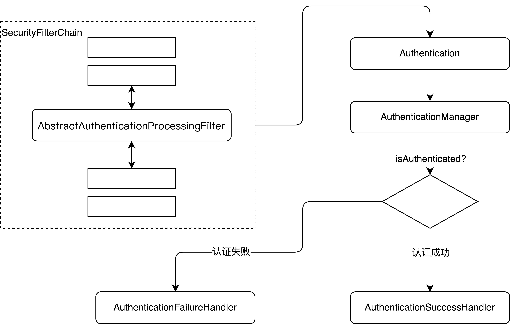
他是一个抽象类，如果username/password登录方式对应的实现类是`UsernammePasswordAuthenticationFilter`,构造的Authentication对象是UsernamePasswordAuthenticationToken。
- 当用户提交登录请求时，`UsernammePasswordAuthenticationFilter`会从request中解析出用户名/密码，创建出一个UsernamePasswordAuthenticationToken对象;
- UsernamePasswordAuthenticationToken会被传入ProviderManager中进行具体的认证操作;
- 如果认证失败，则SecurityContextHolder中的相关的信息将被清除，登录失败回调会被调用;
- 如果认证成功，则会进行登录信息存储、Session并发处理、登录成功事件发布以及登录成功方法回调等操作;

`AbstractAuthenticationProcessingFilter`的核心源码如下:
```java
public abstract class AbstractAuthenticationProcessingFilter extends GenericFilterBean
		implements ApplicationEventPublisherAware, MessageSourceAware {

	protected ApplicationEventPublisher eventPublisher;

	protected AuthenticationDetailsSource<HttpServletRequest, ?> authenticationDetailsSource = new WebAuthenticationDetailsSource();

	private AuthenticationManager authenticationManager;

	protected MessageSourceAccessor messages = SpringSecurityMessageSource.getAccessor();

	private RememberMeServices rememberMeServices = new NullRememberMeServices();

	private RequestMatcher requiresAuthenticationRequestMatcher;

	private boolean continueChainBeforeSuccessfulAuthentication = false;

	private SessionAuthenticationStrategy sessionStrategy = new NullAuthenticatedSessionStrategy();

	private boolean allowSessionCreation = true;

	private AuthenticationSuccessHandler successHandler = new SavedRequestAwareAuthenticationSuccessHandler();

	private AuthenticationFailureHandler failureHandler = new SimpleUrlAuthenticationFailureHandler();

	private SecurityContextRepository securityContextRepository = new NullSecurityContextRepository();

	/**
	 * @param defaultFilterProcessesUrl the default value for <tt>filterProcessesUrl</tt>.
	 */
	protected AbstractAuthenticationProcessingFilter(String defaultFilterProcessesUrl) {
		setFilterProcessesUrl(defaultFilterProcessesUrl);
	}

	/**
	 * Creates a new instance
	 * @param requiresAuthenticationRequestMatcher the {@link RequestMatcher} used to
	 * determine if authentication is required. Cannot be null.
	 */
	protected AbstractAuthenticationProcessingFilter(RequestMatcher requiresAuthenticationRequestMatcher) {
		Assert.notNull(requiresAuthenticationRequestMatcher, "requiresAuthenticationRequestMatcher cannot be null");
		this.requiresAuthenticationRequestMatcher = requiresAuthenticationRequestMatcher;
	}

	/**
	 * Creates a new instance with a default filterProcessesUrl and an
	 * {@link AuthenticationManager}
	 * @param defaultFilterProcessesUrl the default value for <tt>filterProcessesUrl</tt>.
	 * @param authenticationManager the {@link AuthenticationManager} used to authenticate
	 * an {@link Authentication} object. Cannot be null.
	 */
	protected AbstractAuthenticationProcessingFilter(String defaultFilterProcessesUrl,
			AuthenticationManager authenticationManager) {
		setFilterProcessesUrl(defaultFilterProcessesUrl);
		setAuthenticationManager(authenticationManager);
	}

	/**
	 * Creates a new instance with a {@link RequestMatcher} and an
	 * {@link AuthenticationManager}
	 * @param requiresAuthenticationRequestMatcher the {@link RequestMatcher} used to
	 * determine if authentication is required. Cannot be null.
	 * @param authenticationManager the {@link AuthenticationManager} used to authenticate
	 * an {@link Authentication} object. Cannot be null.
	 */
	protected AbstractAuthenticationProcessingFilter(RequestMatcher requiresAuthenticationRequestMatcher,
			AuthenticationManager authenticationManager) {
		setRequiresAuthenticationRequestMatcher(requiresAuthenticationRequestMatcher);
		setAuthenticationManager(authenticationManager);
	}

	@Override
	public void afterPropertiesSet() {
		Assert.notNull(this.authenticationManager, "authenticationManager must be specified");
	}

	/**
	 * Invokes the {@link #requiresAuthentication(HttpServletRequest, HttpServletResponse)
	 * requiresAuthentication} method to determine whether the request is for
	 * authentication and should be handled by this filter. If it is an authentication
	 * request, the {@link #attemptAuthentication(HttpServletRequest, HttpServletResponse)
	 * attemptAuthentication} will be invoked to perform the authentication. There are
	 * then three possible outcomes:
	 * <ol>
	 * <li>An <tt>Authentication</tt> object is returned. The configured
	 * {@link SessionAuthenticationStrategy} will be invoked (to handle any
	 * session-related behaviour such as creating a new session to protect against
	 * session-fixation attacks) followed by the invocation of
	 * {@link #successfulAuthentication(HttpServletRequest, HttpServletResponse, FilterChain, Authentication)}
	 * method</li>
	 * <li>An <tt>AuthenticationException</tt> occurs during authentication. The
	 * {@link #unsuccessfulAuthentication(HttpServletRequest, HttpServletResponse, AuthenticationException)
	 * unsuccessfulAuthentication} method will be invoked</li>
	 * <li>Null is returned, indicating that the authentication process is incomplete. The
	 * method will then return immediately, assuming that the subclass has done any
	 * necessary work (such as redirects) to continue the authentication process. The
	 * assumption is that a later request will be received by this method where the
	 * returned <tt>Authentication</tt> object is not null.
	 * </ol>
	 */
	@Override
	public void doFilter(ServletRequest request, ServletResponse response, FilterChain chain)
			throws IOException, ServletException {
		doFilter((HttpServletRequest) request, (HttpServletResponse) response, chain);
	}

	private void doFilter(HttpServletRequest request, HttpServletResponse response, FilterChain chain)
			throws IOException, ServletException {
		if (!requiresAuthentication(request, response)) {
			chain.doFilter(request, response);
			return;
		}
		try {
			Authentication authenticationResult = attemptAuthentication(request, response);
			if (authenticationResult == null) {
				// return immediately as subclass has indicated that it hasn't completed
				return;
			}
			this.sessionStrategy.onAuthentication(authenticationResult, request, response);
			// Authentication success
			if (this.continueChainBeforeSuccessfulAuthentication) {
				chain.doFilter(request, response);
			}
			successfulAuthentication(request, response, chain, authenticationResult);
		}
		catch (InternalAuthenticationServiceException failed) {
			this.logger.error("An internal error occurred while trying to authenticate the user.", failed);
			unsuccessfulAuthentication(request, response, failed);
		}
		catch (AuthenticationException ex) {
			// Authentication failed
			unsuccessfulAuthentication(request, response, ex);
		}
	}

	/**
	 * Indicates whether this filter should attempt to process a login request for the
	 * current invocation.
	 * <p>
	 * It strips any parameters from the "path" section of the request URL (such as the
	 * jsessionid parameter in <em>https://host/myapp/index.html;jsessionid=blah</em>)
	 * before matching against the <code>filterProcessesUrl</code> property.
	 * <p>
	 * Subclasses may override for special requirements, such as Tapestry integration.
	 * @return <code>true</code> if the filter should attempt authentication,
	 * <code>false</code> otherwise.
	 */
	protected boolean requiresAuthentication(HttpServletRequest request, HttpServletResponse response) {
		if (this.requiresAuthenticationRequestMatcher.matches(request)) {
			return true;
		}
		if (this.logger.isTraceEnabled()) {
			this.logger
					.trace(LogMessage.format("Did not match request to %s", this.requiresAuthenticationRequestMatcher));
		}
		return false;
	}

	/**
	 * Performs actual authentication.
	 * <p>
	 * The implementation should do one of the following:
	 * <ol>
	 * <li>Return a populated authentication token for the authenticated user, indicating
	 * successful authentication</li>
	 * <li>Return null, indicating that the authentication process is still in progress.
	 * Before returning, the implementation should perform any additional work required to
	 * complete the process.</li>
	 * <li>Throw an <tt>AuthenticationException</tt> if the authentication process
	 * fails</li>
	 * </ol>
	 * @param request from which to extract parameters and perform the authentication
	 * @param response the response, which may be needed if the implementation has to do a
	 * redirect as part of a multi-stage authentication process (such as OpenID).
	 * @return the authenticated user token, or null if authentication is incomplete.
	 * @throws AuthenticationException if authentication fails.
	 */
	public abstract Authentication attemptAuthentication(HttpServletRequest request, HttpServletResponse response)
			throws AuthenticationException, IOException, ServletException;

	/**
	 * Default behaviour for successful authentication.
	 * <ol>
	 * <li>Sets the successful <tt>Authentication</tt> object on the
	 * {@link SecurityContextHolder}</li>
	 * <li>Informs the configured <tt>RememberMeServices</tt> of the successful login</li>
	 * <li>Fires an {@link InteractiveAuthenticationSuccessEvent} via the configured
	 * <tt>ApplicationEventPublisher</tt></li>
	 * <li>Delegates additional behaviour to the
	 * {@link AuthenticationSuccessHandler}.</li>
	 * </ol>
	 *
	 * Subclasses can override this method to continue the {@link FilterChain} after
	 * successful authentication.
	 * @param request
	 * @param response
	 * @param chain
	 * @param authResult the object returned from the <tt>attemptAuthentication</tt>
	 * method.
	 * @throws IOException
	 * @throws ServletException
	 */
	protected void successfulAuthentication(HttpServletRequest request, HttpServletResponse response, FilterChain chain,
			Authentication authResult) throws IOException, ServletException {
		SecurityContext context = SecurityContextHolder.createEmptyContext();
		context.setAuthentication(authResult);
		SecurityContextHolder.setContext(context);
		this.securityContextRepository.saveContext(context, request, response);
		if (this.logger.isDebugEnabled()) {
			this.logger.debug(LogMessage.format("Set SecurityContextHolder to %s", authResult));
		}
		this.rememberMeServices.loginSuccess(request, response, authResult);
		if (this.eventPublisher != null) {
			this.eventPublisher.publishEvent(new InteractiveAuthenticationSuccessEvent(authResult, this.getClass()));
		}
		this.successHandler.onAuthenticationSuccess(request, response, authResult);
	}

	/**
	 * Default behaviour for unsuccessful authentication.
	 * <ol>
	 * <li>Clears the {@link SecurityContextHolder}</li>
	 * <li>Stores the exception in the session (if it exists or
	 * <tt>allowSesssionCreation</tt> is set to <tt>true</tt>)</li>
	 * <li>Informs the configured <tt>RememberMeServices</tt> of the failed login</li>
	 * <li>Delegates additional behaviour to the
	 * {@link AuthenticationFailureHandler}.</li>
	 * </ol>
	 */
	protected void unsuccessfulAuthentication(HttpServletRequest request, HttpServletResponse response,
			AuthenticationException failed) throws IOException, ServletException {
		SecurityContextHolder.clearContext();
		this.logger.trace("Failed to process authentication request", failed);
		this.logger.trace("Cleared SecurityContextHolder");
		this.logger.trace("Handling authentication failure");
		this.rememberMeServices.loginFail(request, response);
		this.failureHandler.onAuthenticationFailure(request, response, failed);
	}

	protected AuthenticationManager getAuthenticationManager() {
		return this.authenticationManager;
	}

	public void setAuthenticationManager(AuthenticationManager authenticationManager) {
		this.authenticationManager = authenticationManager;
	}

	/**
	 * Sets the URL that determines if authentication is required
	 * @param filterProcessesUrl
	 */
	public void setFilterProcessesUrl(String filterProcessesUrl) {
		setRequiresAuthenticationRequestMatcher(new AntPathRequestMatcher(filterProcessesUrl));
	}

	public final void setRequiresAuthenticationRequestMatcher(RequestMatcher requestMatcher) {
		Assert.notNull(requestMatcher, "requestMatcher cannot be null");
		this.requiresAuthenticationRequestMatcher = requestMatcher;
	}

	public RememberMeServices getRememberMeServices() {
		return this.rememberMeServices;
	}

	public void setRememberMeServices(RememberMeServices rememberMeServices) {
		Assert.notNull(rememberMeServices, "rememberMeServices cannot be null");
		this.rememberMeServices = rememberMeServices;
	}

	/**
	 * Indicates if the filter chain should be continued prior to delegation to
	 * {@link #successfulAuthentication(HttpServletRequest, HttpServletResponse, FilterChain, Authentication)}
	 * , which may be useful in certain environment (such as Tapestry applications).
	 * Defaults to <code>false</code>.
	 */
	public void setContinueChainBeforeSuccessfulAuthentication(boolean continueChainBeforeSuccessfulAuthentication) {
		this.continueChainBeforeSuccessfulAuthentication = continueChainBeforeSuccessfulAuthentication;
	}

	@Override
	public void setApplicationEventPublisher(ApplicationEventPublisher eventPublisher) {
		this.eventPublisher = eventPublisher;
	}

	public void setAuthenticationDetailsSource(
			AuthenticationDetailsSource<HttpServletRequest, ?> authenticationDetailsSource) {
		Assert.notNull(authenticationDetailsSource, "AuthenticationDetailsSource required");
		this.authenticationDetailsSource = authenticationDetailsSource;
	}

	@Override
	public void setMessageSource(MessageSource messageSource) {
		this.messages = new MessageSourceAccessor(messageSource);
	}

	protected boolean getAllowSessionCreation() {
		return this.allowSessionCreation;
	}

	public void setAllowSessionCreation(boolean allowSessionCreation) {
		this.allowSessionCreation = allowSessionCreation;
	}

	/**
	 * The session handling strategy which will be invoked immediately after an
	 * authentication request is successfully processed by the
	 * <tt>AuthenticationManager</tt>. Used, for example, to handle changing of the
	 * session identifier to prevent session fixation attacks.
	 * @param sessionStrategy the implementation to use. If not set a null implementation
	 * is used.
	 */
	public void setSessionAuthenticationStrategy(SessionAuthenticationStrategy sessionStrategy) {
		this.sessionStrategy = sessionStrategy;
	}

	/**
	 * Sets the strategy used to handle a successful authentication. By default a
	 * {@link SavedRequestAwareAuthenticationSuccessHandler} is used.
	 */
	public void setAuthenticationSuccessHandler(AuthenticationSuccessHandler successHandler) {
		Assert.notNull(successHandler, "successHandler cannot be null");
		this.successHandler = successHandler;
	}

	public void setAuthenticationFailureHandler(AuthenticationFailureHandler failureHandler) {
		Assert.notNull(failureHandler, "failureHandler cannot be null");
		this.failureHandler = failureHandler;
	}

	/**
	 * Sets the {@link SecurityContextRepository} to save the {@link SecurityContext} on
	 * authentication success. The default action is not to save the
	 * {@link SecurityContext}.
	 * @param securityContextRepository the {@link SecurityContextRepository} to use.
	 * Cannot be null.
	 */
	public void setSecurityContextRepository(SecurityContextRepository securityContextRepository) {
		Assert.notNull(securityContextRepository, "securityContextRepository cannot be null");
		this.securityContextRepository = securityContextRepository;
	}

	protected AuthenticationSuccessHandler getSuccessHandler() {
		return this.successHandler;
	}

	protected AuthenticationFailureHandler getFailureHandler() {
		return this.failureHandler;
	}

}
```
- 首先requiresAuthentication判断是否是登录认证请求，不是的话走剩余的过滤器链;
- 调用抽象方法`attemptAuthentication`获得认证后的对象;
- 认证成功后，通过`this.sessionStrategy.onAuthentication(authenticationResult, request, response);`方法来处理session并发问题;
- `continueChainBeforeSuccessfulAuthentication`变量用来判断请求是否还需要剩余的过滤器处理，通常是false;
- `unsuccessfulAuthentication(request, response, failed)`处理认证失败的事情，做了3件事1.从SecurityContextHolder中清除数据，2. 清除cookie，3. 调用认证失败的回调方法;
- `successfulAuthentication(request, response, chain, authenticationResult)`处理认证成功事宜，主要做了4件事1. SecurityContextHolder中存入用户信息，2. 处理Cookie，3. 发布认证成功事件，4.调用认证成功的回调方法;

`UsernamePasswordAuthenticationFilter`中的实现如下:
```java
public class UsernamePasswordAuthenticationFilter extends AbstractAuthenticationProcessingFilter {

	public static final String SPRING_SECURITY_FORM_USERNAME_KEY = "username";

	public static final String SPRING_SECURITY_FORM_PASSWORD_KEY = "password";

	private static final AntPathRequestMatcher DEFAULT_ANT_PATH_REQUEST_MATCHER = new AntPathRequestMatcher("/login",
			"POST");

	private String usernameParameter = SPRING_SECURITY_FORM_USERNAME_KEY;

	private String passwordParameter = SPRING_SECURITY_FORM_PASSWORD_KEY;

	private boolean postOnly = true;

	public UsernamePasswordAuthenticationFilter() {
		super(DEFAULT_ANT_PATH_REQUEST_MATCHER);
	}

	public UsernamePasswordAuthenticationFilter(AuthenticationManager authenticationManager) {
		super(DEFAULT_ANT_PATH_REQUEST_MATCHER, authenticationManager);
	}

	@Override
	public Authentication attemptAuthentication(HttpServletRequest request, HttpServletResponse response)
			throws AuthenticationException {
		if (this.postOnly && !request.getMethod().equals("POST")) {
			throw new AuthenticationServiceException("Authentication method not supported: " + request.getMethod());
		}
		String username = obtainUsername(request);
		username = (username != null) ? username.trim() : "";
		String password = obtainPassword(request);
		password = (password != null) ? password : "";
		UsernamePasswordAuthenticationToken authRequest = UsernamePasswordAuthenticationToken.unauthenticated(username,
				password);
		// Allow subclasses to set the "details" property
		setDetails(request, authRequest);
		return this.getAuthenticationManager().authenticate(authRequest);
	}

	/**
	 * Enables subclasses to override the composition of the password, such as by
	 * including additional values and a separator.
	 * <p>
	 * This might be used for example if a postcode/zipcode was required in addition to
	 * the password. A delimiter such as a pipe (|) should be used to separate the
	 * password and extended value(s). The <code>AuthenticationDao</code> will need to
	 * generate the expected password in a corresponding manner.
	 * </p>
	 * @param request so that request attributes can be retrieved
	 * @return the password that will be presented in the <code>Authentication</code>
	 * request token to the <code>AuthenticationManager</code>
	 */
	@Nullable
	protected String obtainPassword(HttpServletRequest request) {
		return request.getParameter(this.passwordParameter);
	}

	/**
	 * Enables subclasses to override the composition of the username, such as by
	 * including additional values and a separator.
	 * @param request so that request attributes can be retrieved
	 * @return the username that will be presented in the <code>Authentication</code>
	 * request token to the <code>AuthenticationManager</code>
	 */
	@Nullable
	protected String obtainUsername(HttpServletRequest request) {
		return request.getParameter(this.usernameParameter);
	}

	/**
	 * Provided so that subclasses may configure what is put into the authentication
	 * request's details property.
	 * @param request that an authentication request is being created for
	 * @param authRequest the authentication request object that should have its details
	 * set
	 */
	protected void setDetails(HttpServletRequest request, UsernamePasswordAuthenticationToken authRequest) {
		authRequest.setDetails(this.authenticationDetailsSource.buildDetails(request));
	}

	/**
	 * Sets the parameter name which will be used to obtain the username from the login
	 * request.
	 * @param usernameParameter the parameter name. Defaults to "username".
	 */
	public void setUsernameParameter(String usernameParameter) {
		Assert.hasText(usernameParameter, "Username parameter must not be empty or null");
		this.usernameParameter = usernameParameter;
	}

	/**
	 * Sets the parameter name which will be used to obtain the password from the login
	 * request..
	 * @param passwordParameter the parameter name. Defaults to "password".
	 */
	public void setPasswordParameter(String passwordParameter) {
		Assert.hasText(passwordParameter, "Password parameter must not be empty or null");
		this.passwordParameter = passwordParameter;
	}

	/**
	 * Defines whether only HTTP POST requests will be allowed by this filter. If set to
	 * true, and an authentication request is received which is not a POST request, an
	 * exception will be raised immediately and authentication will not be attempted. The
	 * <tt>unsuccessfulAuthentication()</tt> method will be called as if handling a failed
	 * authentication.
	 * <p>
	 * Defaults to <tt>true</tt> but may be overridden by subclasses.
	 */
	public void setPostOnly(boolean postOnly) {
		this.postOnly = postOnly;
	}

	public final String getUsernameParameter() {
		return this.usernameParameter;
	}

	public final String getPasswordParameter() {
		return this.passwordParameter;
	}

}
```
-  定义登录表单的用户名与密码字段的名字，默认是username/password
-  默认定义指处理POST /login登录请求;
-  提取出用户名与密码；
-  根据用户名密码构造出一个未经过认证的UsernamePasswordAuthenticationToken对象，传入AuthenticationManager方法中认证;

## 配置多个数据源
## 添加登录验证码
实现登录验证码的思路:
- 自定义过滤器;
- 自定义认证逻辑;

# 第4章 过滤器链分析
Spring Security的所有功能都是通过过滤器来实现的。
## 初始化流程分析
### ObjectPostProcessor
`ObjectPostProcessor`是对象后置处理器，用于对对象创建后做补充处理，其定义如下:
```java
public interface ObjectPostProcessor<T> {

	/**
	 * Initialize the object possibly returning a modified instance that should be used
	 * instead.
	 * @param object the object to initialize
	 * @return the initialized version of the object
	 */
	<O extends T> O postProcess(O object);

}
```
其实现关系如下图:
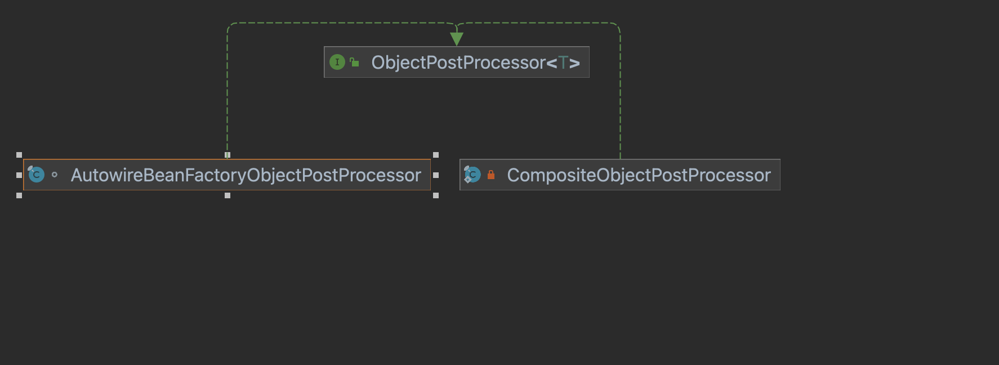
- `AutowireBeanFactoryObjectPostProcessor`，主要用来将一个对象注入到Spring容器中，因为Spring Security很多组件是new出来的需要注入到容器中;
- `CompositeObjectPostProcessor`，一个代理的组合过滤器对象，里面维护了`ObjectPostProcessor`的列表;

开发者可以灵活的配置项目中需要哪些Spring Security过滤器，一旦选定过滤器后，每一个过滤器都会有一个对应的配置器，叫做xxxConfigurer，过滤器都是在xxxConfigurer中new出来的，然后在`ObjectPostProcessor`中处理注入到Spring容器中。
### SecurityFilterChain
过滤器链对象，源码如下:
```java
public interface SecurityFilterChain {
	boolean matches(HttpServletRequest request);
	List<Filter> getFilters();
}
```
- matches()用来判断请求是否应该被当前过滤器链处理;
- getFilters() 返回过滤器链拥有的所有的Spring Security过滤器;

只有一个实现，源码如下:
```java
public final class DefaultSecurityFilterChain implements SecurityFilterChain {

	private static final Log logger = LogFactory.getLog(DefaultSecurityFilterChain.class);

	private final RequestMatcher requestMatcher;

	private final List<Filter> filters;

	public DefaultSecurityFilterChain(RequestMatcher requestMatcher, Filter... filters) {
		this(requestMatcher, Arrays.asList(filters));
	}

	public DefaultSecurityFilterChain(RequestMatcher requestMatcher, List<Filter> filters) {
		if (filters.isEmpty()) {
			logger.info(LogMessage.format("Will not secure %s", requestMatcher));
		}
		else {
			logger.info(LogMessage.format("Will secure %s with %s", requestMatcher, filters));
		}
		this.requestMatcher = requestMatcher;
		this.filters = new ArrayList<>(filters);
	}

	public RequestMatcher getRequestMatcher() {
		return this.requestMatcher;
	}

	@Override
	public List<Filter> getFilters() {
		return this.filters;
	}

	@Override
	public boolean matches(HttpServletRequest request) {
		return this.requestMatcher.matches(request);
	}

	@Override
	public String toString() {
		return this.getClass().getSimpleName() + " [RequestMatcher=" + this.requestMatcher + ", Filters=" + this.filters
				+ "]";
	}

}
```
### SecurityBuilder
Spring Security中所有需要构建的对象都可以通过SecurityBuilder来实现，过滤器链、过滤器、AuthenticationManager等，其实现体系如下:
```java
public interface SecurityBuilder<O> {

	/**
	 * Builds the object and returns it or null.
	 * @return the Object to be built or null if the implementation allows it.
	 * @throws Exception if an error occurred when building the Object
	 */
	O build() throws Exception;

}
```
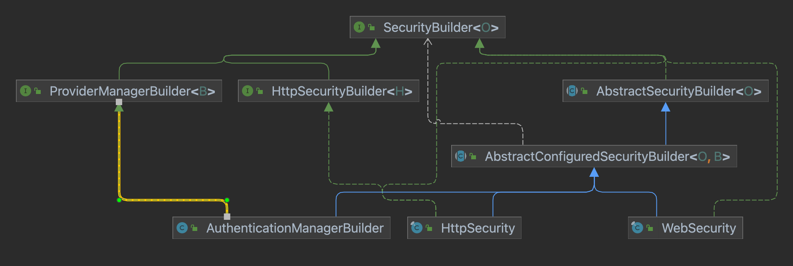
1. HttpSecurityBuilder，它是用来构建HttpSecurity这个对象的，其核心源码如下:
```java
public interface HttpSecurityBuilder<H extends HttpSecurityBuilder<H>>
		extends SecurityBuilder<DefaultSecurityFilterChain> {

	/**
	 * Gets the {@link SecurityConfigurer} by its class name or <code>null</code> if not
	 * found. Note that object hierarchies are not considered.
	 * @param clazz the Class of the {@link SecurityConfigurer} to attempt to get.
	 */
	<C extends SecurityConfigurer<DefaultSecurityFilterChain, H>> C getConfigurer(Class<C> clazz);

	/**
	 * Removes the {@link SecurityConfigurer} by its class name or <code>null</code> if
	 * not found. Note that object hierarchies are not considered.
	 * @param clazz the Class of the {@link SecurityConfigurer} to attempt to remove.
	 * @return the {@link SecurityConfigurer} that was removed or null if not found
	 */
	<C extends SecurityConfigurer<DefaultSecurityFilterChain, H>> C removeConfigurer(Class<C> clazz);

	/**
	 * Sets an object that is shared by multiple {@link SecurityConfigurer}.
	 * @param sharedType the Class to key the shared object by.
	 * @param object the Object to store
	 */
	<C> void setSharedObject(Class<C> sharedType, C object);

	/**
	 * Gets a shared Object. Note that object heirarchies are not considered.
	 * @param sharedType the type of the shared Object
	 * @return the shared Object or null if it is not found
	 */
	<C> C getSharedObject(Class<C> sharedType);

	/**
	 * Allows adding an additional {@link AuthenticationProvider} to be used
	 * @param authenticationProvider the {@link AuthenticationProvider} to be added
	 * @return the {@link HttpSecurity} for further customizations
	 */
	H authenticationProvider(AuthenticationProvider authenticationProvider);

	/**
	 * Allows adding an additional {@link UserDetailsService} to be used
	 * @param userDetailsService the {@link UserDetailsService} to be added
	 * @return the {@link HttpSecurity} for further customizations
	 */
	H userDetailsService(UserDetailsService userDetailsService) throws Exception;

	/**
	 * Allows adding a {@link Filter} after one of the known {@link Filter} classes. The
	 * known {@link Filter} instances are either a {@link Filter} listed in
	 * {@link #addFilter(Filter)} or a {@link Filter} that has already been added using
	 * {@link #addFilterAfter(Filter, Class)} or {@link #addFilterBefore(Filter, Class)}.
	 * @param filter the {@link Filter} to register after the type {@code afterFilter}
	 * @param afterFilter the Class of the known {@link Filter}.
	 * @return the {@link HttpSecurity} for further customizations
	 */
	H addFilterAfter(Filter filter, Class<? extends Filter> afterFilter);

	/**
	 * Allows adding a {@link Filter} before one of the known {@link Filter} classes. The
	 * known {@link Filter} instances are either a {@link Filter} listed in
	 * {@link #addFilter(Filter)} or a {@link Filter} that has already been added using
	 * {@link #addFilterAfter(Filter, Class)} or {@link #addFilterBefore(Filter, Class)}.
	 * @param filter the {@link Filter} to register before the type {@code beforeFilter}
	 * @param beforeFilter the Class of the known {@link Filter}.
	 * @return the {@link HttpSecurity} for further customizations
	 */
	H addFilterBefore(Filter filter, Class<? extends Filter> beforeFilter);

	/**
	 * Adds a {@link Filter} that must be an instance of or extend one of the Filters
	 * provided within the Security framework. The method ensures that the ordering of the
	 * Filters is automatically taken care of.
	 *
	 * The ordering of the Filters is:
	 *
	 * <ul>
	 * <li>{@link ForceEagerSessionCreationFilter}</li>
	 * <li>{@link DisableEncodeUrlFilter}</li>
	 * <li>{@link ChannelProcessingFilter}</li>
	 * <li>{@link SecurityContextPersistenceFilter}</li>
	 * <li>{@link LogoutFilter}</li>
	 * <li>{@link X509AuthenticationFilter}</li>
	 * <li>{@link AbstractPreAuthenticatedProcessingFilter}</li>
	 * <li><a href="
	 * {@docRoot}/org/springframework/security/cas/web/CasAuthenticationFilter.html">CasAuthenticationFilter</a></li>
	 * <li>{@link UsernamePasswordAuthenticationFilter}</li>
	 * <li>{@link OpenIDAuthenticationFilter}</li>
	 * <li>{@link org.springframework.security.web.authentication.ui.DefaultLoginPageGeneratingFilter}</li>
	 * <li>{@link org.springframework.security.web.authentication.ui.DefaultLogoutPageGeneratingFilter}</li>
	 * <li>{@link ConcurrentSessionFilter}</li>
	 * <li>{@link DigestAuthenticationFilter}</li>
	 * <li>{@link org.springframework.security.oauth2.server.resource.web.BearerTokenAuthenticationFilter}</li>
	 * <li>{@link BasicAuthenticationFilter}</li>
	 * <li>{@link RequestCacheAwareFilter}</li>
	 * <li>{@link SecurityContextHolderAwareRequestFilter}</li>
	 * <li>{@link JaasApiIntegrationFilter}</li>
	 * <li>{@link RememberMeAuthenticationFilter}</li>
	 * <li>{@link AnonymousAuthenticationFilter}</li>
	 * <li>{@link SessionManagementFilter}</li>
	 * <li>{@link ExceptionTranslationFilter}</li>
	 * <li>{@link FilterSecurityInterceptor}</li>
	 * <li>{@link SwitchUserFilter}</li>
	 * </ul>
	 * @param filter the {@link Filter} to add
	 * @return the {@link HttpSecurity} for further customizations
	 */
	H addFilter(Filter filter);

}
```
- HttpSecurityBuilder的范型就是其自身，实际就是HttpSecurity;
- 指定的SecurityBuilder构建的对象是`SecurityFilterChain`;
- getConfigurer用来获取一个配置器，也就是xxxConfigurer;
- removeConfigurer移除一个配置器;
- sharedObject的setter/getter设置获取多个配置器之间共享的对象;
- authenticationProvider设置一个AuthenticationProvider;
- userDetailsService设置一个userDetailsService;
- addFilterBefore/addFilterAfter在某个过滤器之后或者之前添加一个自定义的过滤器;
- addFilter添加一个过滤器，自动排序;

2. AbstractSecurityBuilder
AbstractSecurityBuilder添加了只会build一次的逻辑:
```java
public abstract class AbstractSecurityBuilder<O> implements SecurityBuilder<O> {

	private AtomicBoolean building = new AtomicBoolean();

	private O object;

	@Override
	public final O build() throws Exception {
		if (this.building.compareAndSet(false, true)) {
			this.object = doBuild();
			return this.object;
		}
		throw new AlreadyBuiltException("This object has already been built");
	}

	/**
	 * Gets the object that was built. If it has not been built yet an Exception is
	 * thrown.
	 * @return the Object that was built
	 */
	public final O getObject() {
		if (!this.building.get()) {
			throw new IllegalStateException("This object has not been built");
		}
		return this.object;
	}
	/**
	 * Subclasses should implement this to perform the build.
	 * @return the object that should be returned by {@link #build()}.
	 * @throws Exception if an error occurs
	 */
	protected abstract O doBuild() throws Exception;
}
```
- building变量是一个多线程环境下的标志变量;
- build重写，设置为final，确保只构建一次;
- getObject方法用来返回构建的对象;
- doBuild方法则是具体的构建方法，是抽象的子类来实现;

3. AbstractConfiguredSecurityBuilder
```java
private enum BuildState {

		/**
		 * This is the state before the {@link Builder#build()} is invoked
		 */
		UNBUILT(0),

		/**
		 * The state from when {@link Builder#build()} is first invoked until all the
		 * {@link SecurityConfigurer#init(SecurityBuilder)} methods have been invoked.
		 */
		INITIALIZING(1),

		/**
		 * The state from after all {@link SecurityConfigurer#init(SecurityBuilder)} have
		 * been invoked until after all the
		 * {@link SecurityConfigurer#configure(SecurityBuilder)} methods have been
		 * invoked.
		 */
		CONFIGURING(2),

		/**
		 * From the point after all the
		 * {@link SecurityConfigurer#configure(SecurityBuilder)} have completed to just
		 * after {@link AbstractConfiguredSecurityBuilder#performBuild()}.
		 */
		BUILDING(3),

		/**
		 * After the object has been completely built.
		 */
		BUILT(4);

		private final int order;

		BuildState(int order) {
			this.order = order;
		}

		public boolean isInitializing() {
			return INITIALIZING.order == this.order;
		}

		/**
		 * Determines if the state is CONFIGURING or later
		 * @return
		 */
		public boolean isConfigured() {
			return this.order >= CONFIGURING.order;
		}

	}
```
首先定义了构建过程的几种状态。其余的核心源码如下:
```java
public abstract class AbstractConfiguredSecurityBuilder<O, B extends SecurityBuilder<O>>
		extends AbstractSecurityBuilder<O> {

	private final Log logger = LogFactory.getLog(getClass());

	private final LinkedHashMap<Class<? extends SecurityConfigurer<O, B>>, List<SecurityConfigurer<O, B>>> configurers = new LinkedHashMap<>();

	private final List<SecurityConfigurer<O, B>> configurersAddedInInitializing = new ArrayList<>();

	private final Map<Class<?>, Object> sharedObjects = new HashMap<>();

	private final boolean allowConfigurersOfSameType;

	private BuildState buildState = BuildState.UNBUILT;

	private ObjectPostProcessor<Object> objectPostProcessor;

	/***
	 * Creates a new instance with the provided {@link ObjectPostProcessor}. This post
	 * processor must support Object since there are many types of objects that may be
	 * post processed.
	 * @param objectPostProcessor the {@link ObjectPostProcessor} to use
	 */
	protected AbstractConfiguredSecurityBuilder(ObjectPostProcessor<Object> objectPostProcessor) {
		this(objectPostProcessor, false);
	}

	/***
	 * Creates a new instance with the provided {@link ObjectPostProcessor}. This post
	 * processor must support Object since there are many types of objects that may be
	 * post processed.
	 * @param objectPostProcessor the {@link ObjectPostProcessor} to use
	 * @param allowConfigurersOfSameType if true, will not override other
	 * {@link SecurityConfigurer}'s when performing apply
	 */
	protected AbstractConfiguredSecurityBuilder(ObjectPostProcessor<Object> objectPostProcessor,
			boolean allowConfigurersOfSameType) {
		Assert.notNull(objectPostProcessor, "objectPostProcessor cannot be null");
		this.objectPostProcessor = objectPostProcessor;
		this.allowConfigurersOfSameType = allowConfigurersOfSameType;
	}

	/**
	 * Similar to {@link #build()} and {@link #getObject()} but checks the state to
	 * determine if {@link #build()} needs to be called first.
	 * @return the result of {@link #build()} or {@link #getObject()}. If an error occurs
	 * while building, returns null.
	 */
	public O getOrBuild() {
		if (!isUnbuilt()) {
			return getObject();
		}
		try {
			return build();
		}
		catch (Exception ex) {
			this.logger.debug("Failed to perform build. Returning null", ex);
			return null;
		}
	}

	/**
	 * Applies a {@link SecurityConfigurerAdapter} to this {@link SecurityBuilder} and
	 * invokes {@link SecurityConfigurerAdapter#setBuilder(SecurityBuilder)}.
	 * @param configurer
	 * @return the {@link SecurityConfigurerAdapter} for further customizations
	 * @throws Exception
	 */
	@SuppressWarnings("unchecked")
	public <C extends SecurityConfigurerAdapter<O, B>> C apply(C configurer) throws Exception {
		configurer.addObjectPostProcessor(this.objectPostProcessor);
		configurer.setBuilder((B) this);
		add(configurer);
		return configurer;
	}

	/**
	 * Applies a {@link SecurityConfigurer} to this {@link SecurityBuilder} overriding any
	 * {@link SecurityConfigurer} of the exact same class. Note that object hierarchies
	 * are not considered.
	 * @param configurer
	 * @return the {@link SecurityConfigurerAdapter} for further customizations
	 * @throws Exception
	 */
	public <C extends SecurityConfigurer<O, B>> C apply(C configurer) throws Exception {
		add(configurer);
		return configurer;
	}

	/**
	 * Sets an object that is shared by multiple {@link SecurityConfigurer}.
	 * @param sharedType the Class to key the shared object by.
	 * @param object the Object to store
	 */
	@SuppressWarnings("unchecked")
	public <C> void setSharedObject(Class<C> sharedType, C object) {
		this.sharedObjects.put(sharedType, object);
	}

	/**
	 * Gets a shared Object. Note that object heirarchies are not considered.
	 * @param sharedType the type of the shared Object
	 * @return the shared Object or null if it is not found
	 */
	@SuppressWarnings("unchecked")
	public <C> C getSharedObject(Class<C> sharedType) {
		return (C) this.sharedObjects.get(sharedType);
	}

	/**
	 * Gets the shared objects
	 * @return the shared Objects
	 */
	public Map<Class<?>, Object> getSharedObjects() {
		return Collections.unmodifiableMap(this.sharedObjects);
	}

	/**
	 * Adds {@link SecurityConfigurer} ensuring that it is allowed and invoking
	 * {@link SecurityConfigurer#init(SecurityBuilder)} immediately if necessary.
	 * @param configurer the {@link SecurityConfigurer} to add
	 */
	@SuppressWarnings("unchecked")
	private <C extends SecurityConfigurer<O, B>> void add(C configurer) {
		Assert.notNull(configurer, "configurer cannot be null");
		Class<? extends SecurityConfigurer<O, B>> clazz = (Class<? extends SecurityConfigurer<O, B>>) configurer
				.getClass();
		synchronized (this.configurers) {
			if (this.buildState.isConfigured()) {
				throw new IllegalStateException("Cannot apply " + configurer + " to already built object");
			}
			List<SecurityConfigurer<O, B>> configs = null;
			if (this.allowConfigurersOfSameType) {
				configs = this.configurers.get(clazz);
			}
			configs = (configs != null) ? configs : new ArrayList<>(1);
			configs.add(configurer);
			this.configurers.put(clazz, configs);
			if (this.buildState.isInitializing()) {
				this.configurersAddedInInitializing.add(configurer);
			}
		}
	}

	/**
	 * Gets all the {@link SecurityConfigurer} instances by its class name or an empty
	 * List if not found. Note that object hierarchies are not considered.
	 * @param clazz the {@link SecurityConfigurer} class to look for
	 * @return a list of {@link SecurityConfigurer}s for further customization
	 */
	@SuppressWarnings("unchecked")
	public <C extends SecurityConfigurer<O, B>> List<C> getConfigurers(Class<C> clazz) {
		List<C> configs = (List<C>) this.configurers.get(clazz);
		if (configs == null) {
			return new ArrayList<>();
		}
		return new ArrayList<>(configs);
	}

	/**
	 * Removes all the {@link SecurityConfigurer} instances by its class name or an empty
	 * List if not found. Note that object hierarchies are not considered.
	 * @param clazz the {@link SecurityConfigurer} class to look for
	 * @return a list of {@link SecurityConfigurer}s for further customization
	 */
	@SuppressWarnings("unchecked")
	public <C extends SecurityConfigurer<O, B>> List<C> removeConfigurers(Class<C> clazz) {
		List<C> configs = (List<C>) this.configurers.remove(clazz);
		if (configs == null) {
			return new ArrayList<>();
		}
		return new ArrayList<>(configs);
	}

	/**
	 * Gets the {@link SecurityConfigurer} by its class name or <code>null</code> if not
	 * found. Note that object hierarchies are not considered.
	 * @param clazz
	 * @return the {@link SecurityConfigurer} for further customizations
	 */
	@SuppressWarnings("unchecked")
	public <C extends SecurityConfigurer<O, B>> C getConfigurer(Class<C> clazz) {
		List<SecurityConfigurer<O, B>> configs = this.configurers.get(clazz);
		if (configs == null) {
			return null;
		}
		Assert.state(configs.size() == 1,
				() -> "Only one configurer expected for type " + clazz + ", but got " + configs);
		return (C) configs.get(0);
	}

	/**
	 * Removes and returns the {@link SecurityConfigurer} by its class name or
	 * <code>null</code> if not found. Note that object hierarchies are not considered.
	 * @param clazz
	 * @return
	 */
	@SuppressWarnings("unchecked")
	public <C extends SecurityConfigurer<O, B>> C removeConfigurer(Class<C> clazz) {
		List<SecurityConfigurer<O, B>> configs = this.configurers.remove(clazz);
		if (configs == null) {
			return null;
		}
		Assert.state(configs.size() == 1,
				() -> "Only one configurer expected for type " + clazz + ", but got " + configs);
		return (C) configs.get(0);
	}

	/**
	 * Specifies the {@link ObjectPostProcessor} to use.
	 * @param objectPostProcessor the {@link ObjectPostProcessor} to use. Cannot be null
	 * @return the {@link SecurityBuilder} for further customizations
	 */
	@SuppressWarnings("unchecked")
	public B objectPostProcessor(ObjectPostProcessor<Object> objectPostProcessor) {
		Assert.notNull(objectPostProcessor, "objectPostProcessor cannot be null");
		this.objectPostProcessor = objectPostProcessor;
		return (B) this;
	}

	/**
	 * Performs post processing of an object. The default is to delegate to the
	 * {@link ObjectPostProcessor}.
	 * @param object the Object to post process
	 * @return the possibly modified Object to use
	 */
	protected <P> P postProcess(P object) {
		return this.objectPostProcessor.postProcess(object);
	}

	/**
	 * Executes the build using the {@link SecurityConfigurer}'s that have been applied
	 * using the following steps:
	 *
	 * <ul>
	 * <li>Invokes {@link #beforeInit()} for any subclass to hook into</li>
	 * <li>Invokes {@link SecurityConfigurer#init(SecurityBuilder)} for any
	 * {@link SecurityConfigurer} that was applied to this builder.</li>
	 * <li>Invokes {@link #beforeConfigure()} for any subclass to hook into</li>
	 * <li>Invokes {@link #performBuild()} which actually builds the Object</li>
	 * </ul>
	 */
	@Override
	protected final O doBuild() throws Exception {
		synchronized (this.configurers) {
			this.buildState = BuildState.INITIALIZING;
			beforeInit();
			init();
			this.buildState = BuildState.CONFIGURING;
			beforeConfigure();
			configure();
			this.buildState = BuildState.BUILDING;
			O result = performBuild();
			this.buildState = BuildState.BUILT;
			return result;
		}
	}

	/**
	 * Invoked prior to invoking each {@link SecurityConfigurer#init(SecurityBuilder)}
	 * method. Subclasses may override this method to hook into the lifecycle without
	 * using a {@link SecurityConfigurer}.
	 */
	protected void beforeInit() throws Exception {
	}

	/**
	 * Invoked prior to invoking each
	 * {@link SecurityConfigurer#configure(SecurityBuilder)} method. Subclasses may
	 * override this method to hook into the lifecycle without using a
	 * {@link SecurityConfigurer}.
	 */
	protected void beforeConfigure() throws Exception {
	}

	/**
	 * Subclasses must implement this method to build the object that is being returned.
	 * @return the Object to be buit or null if the implementation allows it
	 */
	protected abstract O performBuild() throws Exception;

	@SuppressWarnings("unchecked")
	private void init() throws Exception {
		Collection<SecurityConfigurer<O, B>> configurers = getConfigurers();
		for (SecurityConfigurer<O, B> configurer : configurers) {
			configurer.init((B) this);
		}
		for (SecurityConfigurer<O, B> configurer : this.configurersAddedInInitializing) {
			configurer.init((B) this);
		}
	}

	@SuppressWarnings("unchecked")
	private void configure() throws Exception {
		Collection<SecurityConfigurer<O, B>> configurers = getConfigurers();
		for (SecurityConfigurer<O, B> configurer : configurers) {
			configurer.configure((B) this);
		}
	}
	private Collection<SecurityConfigurer<O, B>> getConfigurers() {
		List<SecurityConfigurer<O, B>> result = new ArrayList<>();
		for (List<SecurityConfigurer<O, B>> configs : this.configurers.values()) {
			result.addAll(configs);
		}
		return result;
	}
	/**
	 * Determines if the object is unbuilt.
	 * @return true, if unbuilt else false
	 */
	private boolean isUnbuilt() {
		synchronized (this.configurers) {
			return this.buildState == BuildState.UNBUILT;
		}
	}
}
```
- private final LinkedHashMap<Class<? extends SecurityConfigurer<O, B>>, List<SecurityConfigurer<O, B>>> configurers = new LinkedHashMap<>() 声明配置类对象, key是class，value是list的实例对象;
- 2个apply方法向configurers里面添加配置器;
- add方法中判断下构建的状态，同时根据allowConfigurersOfSameType标志判断是添加还是覆盖同类型的配置器，一般情况下是false;
- getConfigurers返回某个配置类的所有的实例;
- removeConfigurers移除某个类型的所有配置类实例并返回;
- getConfigurer获取某个配置类实例的第一项;
- removeConfigurer移除某个类型的所有配置类实例并返回第一项;
- getConfigurers私有方法把所有的配置类实例打平到集合中返回;
  
核心的doBuild方法如下:
- 一边更新构建状态一边执行构建方法;首先执行空的beforeInit初始化方法空的什么也不做;
- init()是执行所有配置实例的初始化方法;
- beforeConfigure可以在configure之前做一些准备工作，也是一个空方法;
- configure方法执行所有配置实例的configure方法，完成配置;
- 最后执行performBuild空方法完构建;
4. ProviderManagerBuilder
核心实现代码如下:
```java
public interface ProviderManagerBuilder<B extends ProviderManagerBuilder<B>>
		extends SecurityBuilder<AuthenticationManager> {

	/**
	 * Add authentication based upon the custom {@link AuthenticationProvider} that is
	 * passed in. Since the {@link AuthenticationProvider} implementation is unknown, all
	 * customizations must be done externally and the {@link ProviderManagerBuilder} is
	 * returned immediately.
	 *
	 * Note that an Exception is thrown if an error occurs when adding the
	 * {@link AuthenticationProvider}.
	 * @return a {@link ProviderManagerBuilder} to allow further authentication to be
	 * provided to the {@link ProviderManagerBuilder}
	 */
	B authenticationProvider(AuthenticationProvider authenticationProvider);

}
```
定义了构建的对象是AuthenticationManager，同时还有一个authenticationProvider()方法
5. AuthenticationManagerBuilder
用来构建AuthenticationManager对象，继承了AbstractConfiguredSecurityBuilder，实现了ProviderManagerBuilder接口，核心源码如下:
```java
public class AuthenticationManagerBuilder
		extends AbstractConfiguredSecurityBuilder<AuthenticationManager, AuthenticationManagerBuilder>
		implements ProviderManagerBuilder<AuthenticationManagerBuilder> {

	private final Log logger = LogFactory.getLog(getClass());

	private AuthenticationManager parentAuthenticationManager;

	private List<AuthenticationProvider> authenticationProviders = new ArrayList<>();

	private UserDetailsService defaultUserDetailsService;

	private Boolean eraseCredentials;

	private AuthenticationEventPublisher eventPublisher;

	/**
	 * Creates a new instance
	 * @param objectPostProcessor the {@link ObjectPostProcessor} instance to use.
	 */
	public AuthenticationManagerBuilder(ObjectPostProcessor<Object> objectPostProcessor) {
		super(objectPostProcessor, true);
	}

	/**
	 * Allows providing a parent {@link AuthenticationManager} that will be tried if this
	 * {@link AuthenticationManager} was unable to attempt to authenticate the provided
	 * {@link Authentication}.
	 * @param authenticationManager the {@link AuthenticationManager} that should be used
	 * if the current {@link AuthenticationManager} was unable to attempt to authenticate
	 * the provided {@link Authentication}.
	 * @return the {@link AuthenticationManagerBuilder} for further adding types of
	 * authentication
	 */
	public AuthenticationManagerBuilder parentAuthenticationManager(AuthenticationManager authenticationManager) {
		if (authenticationManager instanceof ProviderManager) {
			eraseCredentials(((ProviderManager) authenticationManager).isEraseCredentialsAfterAuthentication());
		}
		this.parentAuthenticationManager = authenticationManager;
		return this;
	}
	/**
	 * Sets the {@link AuthenticationEventPublisher}
	 * @param eventPublisher the {@link AuthenticationEventPublisher} to use
	 * @return the {@link AuthenticationManagerBuilder} for further customizations
	 */
	public AuthenticationManagerBuilder authenticationEventPublisher(AuthenticationEventPublisher eventPublisher) {
		Assert.notNull(eventPublisher, "AuthenticationEventPublisher cannot be null");
		this.eventPublisher = eventPublisher;
		return this;
	}
	/**
	 * @param eraseCredentials true if {@link AuthenticationManager} should clear the
	 * credentials from the {@link Authentication} object after authenticating
	 * @return the {@link AuthenticationManagerBuilder} for further customizations
	 */
	public AuthenticationManagerBuilder eraseCredentials(boolean eraseCredentials) {
		this.eraseCredentials = eraseCredentials;
		return this;
	}
	/**
	 * Add in memory authentication to the {@link AuthenticationManagerBuilder} and return
	 * a {@link InMemoryUserDetailsManagerConfigurer} to allow customization of the in
	 * memory authentication.
	 *
	 * <p>
	 * This method also ensure that a {@link UserDetailsService} is available for the
	 * {@link #getDefaultUserDetailsService()} method. Note that additional
	 * {@link UserDetailsService}'s may override this {@link UserDetailsService} as the
	 * default.
	 * </p>
	 * @return a {@link InMemoryUserDetailsManagerConfigurer} to allow customization of
	 * the in memory authentication
	 * @throws Exception if an error occurs when adding the in memory authentication
	 */
	public InMemoryUserDetailsManagerConfigurer<AuthenticationManagerBuilder> inMemoryAuthentication()
			throws Exception {
		return apply(new InMemoryUserDetailsManagerConfigurer<>());
	}
	/**
	 * Add JDBC authentication to the {@link AuthenticationManagerBuilder} and return a
	 * {@link JdbcUserDetailsManagerConfigurer} to allow customization of the JDBC
	 * authentication.
	 *
	 * <p>
	 * When using with a persistent data store, it is best to add users external of
	 * configuration using something like <a href="https://flywaydb.org/">Flyway</a> or
	 * <a href="https://www.liquibase.org/">Liquibase</a> to create the schema and adding
	 * users to ensure these steps are only done once and that the optimal SQL is used.
	 * </p>
	 *
	 * <p>
	 * This method also ensure that a {@link UserDetailsService} is available for the
	 * {@link #getDefaultUserDetailsService()} method. Note that additional
	 * {@link UserDetailsService}'s may override this {@link UserDetailsService} as the
	 * default. See the <a href=
	 * "https://docs.spring.io/spring-security/site/docs/current/reference/htmlsingle/#user-schema"
	 * >User Schema</a> section of the reference for the default schema.
	 * </p>
	 * @return a {@link JdbcUserDetailsManagerConfigurer} to allow customization of the
	 * JDBC authentication
	 * @throws Exception if an error occurs when adding the JDBC authentication
	 */
	public JdbcUserDetailsManagerConfigurer<AuthenticationManagerBuilder> jdbcAuthentication() throws Exception {
		return apply(new JdbcUserDetailsManagerConfigurer<>());
	}
	/**
	 * Add authentication based upon the custom {@link UserDetailsService} that is passed
	 * in. It then returns a {@link DaoAuthenticationConfigurer} to allow customization of
	 * the authentication.
	 *
	 * <p>
	 * This method also ensure that the {@link UserDetailsService} is available for the
	 * {@link #getDefaultUserDetailsService()} method. Note that additional
	 * {@link UserDetailsService}'s may override this {@link UserDetailsService} as the
	 * default.
	 * </p>
	 * @return a {@link DaoAuthenticationConfigurer} to allow customization of the DAO
	 * authentication
	 * @throws Exception if an error occurs when adding the {@link UserDetailsService}
	 * based authentication
	 */
	public <T extends UserDetailsService> DaoAuthenticationConfigurer<AuthenticationManagerBuilder, T> userDetailsService(
			T userDetailsService) throws Exception {
		this.defaultUserDetailsService = userDetailsService;
		return apply(new DaoAuthenticationConfigurer<>(userDetailsService));
	}
	/**
	 * Add LDAP authentication to the {@link AuthenticationManagerBuilder} and return a
	 * {@link LdapAuthenticationProviderConfigurer} to allow customization of the LDAP
	 * authentication.
	 *
	 * <p>
	 * This method <b>does NOT</b> ensure that a {@link UserDetailsService} is available
	 * for the {@link #getDefaultUserDetailsService()} method.
	 * @return a {@link LdapAuthenticationProviderConfigurer} to allow customization of
	 * the LDAP authentication
	 * @throws Exception if an error occurs when adding the LDAP authentication
	 */
	public LdapAuthenticationProviderConfigurer<AuthenticationManagerBuilder> ldapAuthentication() throws Exception {
		return apply(new LdapAuthenticationProviderConfigurer<>());
	}
	/**
	 * Add authentication based upon the custom {@link AuthenticationProvider} that is
	 * passed in. Since the {@link AuthenticationProvider} implementation is unknown, all
	 * customizations must be done externally and the {@link AuthenticationManagerBuilder}
	 * is returned immediately.
	 *
	 * <p>
	 * This method <b>does NOT</b> ensure that the {@link UserDetailsService} is available
	 * for the {@link #getDefaultUserDetailsService()} method.
	 *
	 * Note that an {@link Exception} might be thrown if an error occurs when adding the
	 * {@link AuthenticationProvider}.
	 * @return a {@link AuthenticationManagerBuilder} to allow further authentication to
	 * be provided to the {@link AuthenticationManagerBuilder}
	 */
	@Override
	public AuthenticationManagerBuilder authenticationProvider(AuthenticationProvider authenticationProvider) {
		this.authenticationProviders.add(authenticationProvider);
		return this;
	}
	@Override
	protected ProviderManager performBuild() throws Exception {
		if (!isConfigured()) {
			this.logger.debug("No authenticationProviders and no parentAuthenticationManager defined. Returning null.");
			return null;
		}
		ProviderManager providerManager = new ProviderManager(this.authenticationProviders,
				this.parentAuthenticationManager);
		if (this.eraseCredentials != null) {
			providerManager.setEraseCredentialsAfterAuthentication(this.eraseCredentials);
		}
		if (this.eventPublisher != null) {
			providerManager.setAuthenticationEventPublisher(this.eventPublisher);
		}
		providerManager = postProcess(providerManager);
		return providerManager;
	}
	/**
	 * Determines if the {@link AuthenticationManagerBuilder} is configured to build a non
	 * null {@link AuthenticationManager}. This means that either a non-null parent is
	 * specified or at least one {@link AuthenticationProvider} has been specified.
	 *
	 * <p>
	 * When using {@link SecurityConfigurer} instances, the
	 * {@link AuthenticationManagerBuilder} will not be configured until the
	 * {@link SecurityConfigurer#configure(SecurityBuilder)} methods. This means a
	 * {@link SecurityConfigurer} that is last could check this method and provide a
	 * default configuration in the {@link SecurityConfigurer#configure(SecurityBuilder)}
	 * method.
	 * @return true, if {@link AuthenticationManagerBuilder} is configured, otherwise
	 * false
	 */
	public boolean isConfigured() {
		return !this.authenticationProviders.isEmpty() || this.parentAuthenticationManager != null;
	}
	/**
	 * Gets the default {@link UserDetailsService} for the
	 * {@link AuthenticationManagerBuilder}. The result may be null in some circumstances.
	 * @return the default {@link UserDetailsService} for the
	 * {@link AuthenticationManagerBuilder}
	 */
	public UserDetailsService getDefaultUserDetailsService() {
		return this.defaultUserDetailsService;
	}
	/**
	 * Captures the {@link UserDetailsService} from any {@link UserDetailsAwareConfigurer}
	 * .
	 * @param configurer the {@link UserDetailsAwareConfigurer} to capture the
	 * {@link UserDetailsService} from.
	 * @return the {@link UserDetailsAwareConfigurer} for further customizations
	 * @throws Exception if an error occurs
	 */
	private <C extends UserDetailsAwareConfigurer<AuthenticationManagerBuilder, ? extends UserDetailsService>> C apply(
			C configurer) throws Exception {
		this.defaultUserDetailsService = configurer.getUserDetailsService();
		return super.apply(configurer);
	}
}
```
- 构造方法调用了父类的构造方法，第二个参数传了true，表示允许同类型的配置实例存在;
- parentAuthenticationManager用来给AuthenticationManager设置parent;
- inMemoryAuthentication()方法配置一个基于内存的用户源配置;
- jdbcAuthentication与userDetailsService方法与inMemoryAuthentication()方法类似，也是用来配置数据源的;
- authenticationProvider()方法用于向authenticationProviders集合中添加AuthenticationProvider对象;
- performBuild()方法执行具体的构建，简而言之就是创建AuthenticationManager的实现ProviderManager对象，再用后置处理器对象处理一下就可以;

6. HttpSecurity
它的主要作用是用来构建一条过滤器链，实际就是构建一个DefaultSecurityFilterChain对象，一个DefaultSecurityFilterChain包含一个路径匹配器与多个过滤器，HttpSecurity通过收集所有的xxxConfigurer，保存到父类AbstractConfiguredSecurityBuilder的configurers变量中，再将这些xxxConfigurer构建为具体的过滤器，添加到HttpSecurity的filters对象中.核心源码如下:
```java
public final class HttpSecurity extends AbstractConfiguredSecurityBuilder<DefaultSecurityFilterChain, HttpSecurity>
		implements SecurityBuilder<DefaultSecurityFilterChain>, HttpSecurityBuilder<HttpSecurity> {
	/**
	 * Specifies to support form based authentication. If
	 * {@link FormLoginConfigurer#loginPage(String)} is not specified a default login page
	 * will be generated.
	 *
	 * <h2>Example Configurations</h2>
	 *
	 * The most basic configuration defaults to automatically generating a login page at
	 * the URL "/login", redirecting to "/login?error" for authentication failure. The
	 * details of the login page can be found on
	 * {@link FormLoginConfigurer#loginPage(String)}
	 *
	 * <pre>
	 * &#064;Configuration
	 * &#064;EnableWebSecurity
	 * public class FormLoginSecurityConfig extends WebSecurityConfigurerAdapter {
	 *
	 * 	&#064;Override
	 * 	protected void configure(HttpSecurity http) throws Exception {
	 * 		http.authorizeRequests().antMatchers(&quot;/**&quot;).hasRole(&quot;USER&quot;).and().formLogin();
	 * 	}
	 *
	 * 	&#064;Override
	 * 	protected void configure(AuthenticationManagerBuilder auth) throws Exception {
	 * 		auth.inMemoryAuthentication().withUser(&quot;user&quot;).password(&quot;password&quot;).roles(&quot;USER&quot;);
	 * 	}
	 * }
	 * </pre>
	 *
	 * The configuration below demonstrates customizing the defaults.
	 *
	 * <pre>
	 * &#064;Configuration
	 * &#064;EnableWebSecurity
	 * public class FormLoginSecurityConfig extends WebSecurityConfigurerAdapter {
	 *
	 * 	&#064;Override
	 * 	protected void configure(HttpSecurity http) throws Exception {
	 * 		http.authorizeRequests().antMatchers(&quot;/**&quot;).hasRole(&quot;USER&quot;).and().formLogin()
	 * 				.usernameParameter(&quot;username&quot;) // default is username
	 * 				.passwordParameter(&quot;password&quot;) // default is password
	 * 				.loginPage(&quot;/authentication/login&quot;) // default is /login with an HTTP get
	 * 				.failureUrl(&quot;/authentication/login?failed&quot;) // default is /login?error
	 * 				.loginProcessingUrl(&quot;/authentication/login/process&quot;); // default is /login
	 * 																		// with an HTTP
	 * 																		// post
	 * 	}
	 *
	 * 	&#064;Override
	 * 	protected void configure(AuthenticationManagerBuilder auth) throws Exception {
	 * 		auth.inMemoryAuthentication().withUser(&quot;user&quot;).password(&quot;password&quot;).roles(&quot;USER&quot;);
	 * 	}
	 * }
	 * </pre>
	 * @return the {@link FormLoginConfigurer} for further customizations
	 * @throws Exception
	 * @see FormLoginConfigurer#loginPage(String)
	 */
	public FormLoginConfigurer<HttpSecurity> formLogin() throws Exception {
		return getOrApply(new FormLoginConfigurer<>());
	}

	/**
	 * Specifies to support form based authentication. If
	 * {@link FormLoginConfigurer#loginPage(String)} is not specified a default login page
	 * will be generated.
	 *
	 * <h2>Example Configurations</h2>
	 *
	 * The most basic configuration defaults to automatically generating a login page at
	 * the URL "/login", redirecting to "/login?error" for authentication failure. The
	 * details of the login page can be found on
	 * {@link FormLoginConfigurer#loginPage(String)}
	 *
	 * <pre>
	 * &#064;Configuration
	 * &#064;EnableWebSecurity
	 * public class FormLoginSecurityConfig extends WebSecurityConfigurerAdapter {
	 *
	 * 	&#064;Override
	 * 	protected void configure(HttpSecurity http) throws Exception {
	 * 		http
	 * 			.authorizeRequests((authorizeRequests) -&gt;
	 * 				authorizeRequests
	 * 					.antMatchers(&quot;/**&quot;).hasRole(&quot;USER&quot;)
	 * 			)
	 * 			.formLogin(withDefaults());
	 * 	}
	 * }
	 * </pre>
	 *
	 * The configuration below demonstrates customizing the defaults.
	 *
	 * <pre>
	 * &#064;Configuration
	 * &#064;EnableWebSecurity
	 * public class FormLoginSecurityConfig extends WebSecurityConfigurerAdapter {
	 *
	 * 	&#064;Override
	 * 	protected void configure(HttpSecurity http) throws Exception {
	 * 		http
	 * 			.authorizeRequests((authorizeRequests) -&gt;
	 * 				authorizeRequests
	 * 					.antMatchers(&quot;/**&quot;).hasRole(&quot;USER&quot;)
	 * 			)
	 * 			.formLogin((formLogin) -&gt;
	 * 				formLogin
	 * 					.usernameParameter(&quot;username&quot;)
	 * 					.passwordParameter(&quot;password&quot;)
	 * 					.loginPage(&quot;/authentication/login&quot;)
	 * 					.failureUrl(&quot;/authentication/login?failed&quot;)
	 * 					.loginProcessingUrl(&quot;/authentication/login/process&quot;)
	 * 			);
	 * 	}
	 * }
	 * </pre>
	 * @param formLoginCustomizer the {@link Customizer} to provide more options for the
	 * {@link FormLoginConfigurer}
	 * @return the {@link HttpSecurity} for further customizations
	 * @throws Exception
	 * @see FormLoginConfigurer#loginPage(String)
	 */
	public HttpSecurity formLogin(Customizer<FormLoginConfigurer<HttpSecurity>> formLoginCustomizer) throws Exception {
		formLoginCustomizer.customize(getOrApply(new FormLoginConfigurer<>()));
		return HttpSecurity.this;
	}

		}
```
- 以表单登录为例,HttpSecurity有2个重载的formLogin方法，无参的formLogin返回一个FormLoginConfigurer<HttpSecurity>对象，第二个有参的formLogin方法参数是一个FormLoginConfigurer对象，返回值是一个HttpSecurity对象，然后调用getOrApply方法看父类中是否存在同样的类型的配置，如果存在，则不添加到父类的configurers中，其他配置与formLogin配置类似;
- 每一套过滤器链都会有一个AuthenticationManager对象执行认证，功过authenticationProvider方法配置执行认证的authenticationProvider对象，通过userDetailsService方法配置UserDetailsService，最后在beforeConfigure方法中触发AuthenticationManager的构建;
- performBuild方法则是进行DefaultSecurityFilterChain的构建，传入请求匹配器与过滤器集合filters，filters会按照优先级进行排序;
- 通过addFilterAfter、addFilterBefore可以在某个过滤器之后或者之前添加自定义的过滤器;
- addFilter方法可以向过滤器链中添加过滤器，过滤器必须是Spring Security提供的实现或者子类;
- addFilterAt方法可以在指定位置添加一个过滤器，在同一个位置添加多个过滤器不会覆盖现有的过滤器;

7. WebSecurity
一个HttpSecurity可以构建一个过滤器链，也就是一个DefaultSecurityFilterChain对象，一个项目中可以存在多个HttpSecurity，可以构建多个过滤器链，WebSecurity负责构建更大层面的过滤器，将所有的过滤器链对象重新构建为FilterChainProxy对象，核心源码如下:
```java
public final class WebSecurity extends AbstractConfiguredSecurityBuilder<Filter, WebSecurity>
		implements SecurityBuilder<Filter>, ApplicationContextAware, ServletContextAware {

	private final Log logger = LogFactory.getLog(getClass());

	private final List<RequestMatcher> ignoredRequests = new ArrayList<>();

	private final List<SecurityBuilder<? extends SecurityFilterChain>> securityFilterChainBuilders = new ArrayList<>();

	private IgnoredRequestConfigurer ignoredRequestRegistry;

	private FilterSecurityInterceptor filterSecurityInterceptor;

	private HttpFirewall httpFirewall;

	private RequestRejectedHandler requestRejectedHandler;

	private boolean debugEnabled;

	private WebInvocationPrivilegeEvaluator privilegeEvaluator;

	private DefaultWebSecurityExpressionHandler defaultWebSecurityExpressionHandler = new DefaultWebSecurityExpressionHandler();

	private SecurityExpressionHandler<FilterInvocation> expressionHandler = this.defaultWebSecurityExpressionHandler;

	private Runnable postBuildAction = () -> {
	};

	private ServletContext servletContext;

	/**
	 * Creates a new instance
	 * @param objectPostProcessor the {@link ObjectPostProcessor} to use
	 * @see WebSecurityConfiguration
	 */
	public WebSecurity(ObjectPostProcessor<Object> objectPostProcessor) {
		super(objectPostProcessor);
	}

	/**
	 * <p>
	 * Allows adding {@link RequestMatcher} instances that Spring Security should ignore.
	 * Web Security provided by Spring Security (including the {@link SecurityContext})
	 * will not be available on {@link HttpServletRequest} that match. Typically the
	 * requests that are registered should be that of only static resources. For requests
	 * that are dynamic, consider mapping the request to allow all users instead.
	 * </p>
	 *
	 * Example Usage:
	 *
	 * <pre>
	 * webSecurityBuilder.ignoring()
	 * // ignore all URLs that start with /resources/ or /static/
	 * 		.antMatchers(&quot;/resources/**&quot;, &quot;/static/**&quot;);
	 * </pre>
	 *
	 * Alternatively this will accomplish the same result:
	 *
	 * <pre>
	 * webSecurityBuilder.ignoring()
	 * // ignore all URLs that start with /resources/ or /static/
	 * 		.antMatchers(&quot;/resources/**&quot;).antMatchers(&quot;/static/**&quot;);
	 * </pre>
	 *
	 * Multiple invocations of ignoring() are also additive, so the following is also
	 * equivalent to the previous two examples:
	 *
	 * <pre>
	 * webSecurityBuilder.ignoring()
	 * // ignore all URLs that start with /resources/
	 * 		.antMatchers(&quot;/resources/**&quot;);
	 * webSecurityBuilder.ignoring()
	 * // ignore all URLs that start with /static/
	 * 		.antMatchers(&quot;/static/**&quot;);
	 * // now both URLs that start with /resources/ and /static/ will be ignored
	 * </pre>
	 * @return the {@link IgnoredRequestConfigurer} to use for registering request that
	 * should be ignored
	 */
	public IgnoredRequestConfigurer ignoring() {
		return this.ignoredRequestRegistry;
	}

	/**
	 * Allows customizing the {@link HttpFirewall}. The default is
	 * {@link StrictHttpFirewall}.
	 * @param httpFirewall the custom {@link HttpFirewall}
	 * @return the {@link WebSecurity} for further customizations
	 */
	public WebSecurity httpFirewall(HttpFirewall httpFirewall) {
		this.httpFirewall = httpFirewall;
		return this;
	}

	/**
	 * Controls debugging support for Spring Security.
	 * @param debugEnabled if true, enables debug support with Spring Security. Default is
	 * false.
	 * @return the {@link WebSecurity} for further customization.
	 * @see EnableWebSecurity#debug()
	 */
	public WebSecurity debug(boolean debugEnabled) {
		this.debugEnabled = debugEnabled;
		return this;
	}

	/**
	 * <p>
	 * Adds builders to create {@link SecurityFilterChain} instances.
	 * </p>
	 *
	 * <p>
	 * Typically this method is invoked automatically within the framework from
	 * {@link WebSecurityConfigurerAdapter#init(WebSecurity)}
	 * </p>
	 * @param securityFilterChainBuilder the builder to use to create the
	 * {@link SecurityFilterChain} instances
	 * @return the {@link WebSecurity} for further customizations
	 */
	public WebSecurity addSecurityFilterChainBuilder(
			SecurityBuilder<? extends SecurityFilterChain> securityFilterChainBuilder) {
		this.securityFilterChainBuilders.add(securityFilterChainBuilder);
		return this;
	}

	/**
	 * Set the {@link WebInvocationPrivilegeEvaluator} to be used. If this is not
	 * specified, then a {@link DefaultWebInvocationPrivilegeEvaluator} will be created
	 * when {@link #securityInterceptor(FilterSecurityInterceptor)} is non null.
	 * @param privilegeEvaluator the {@link WebInvocationPrivilegeEvaluator} to use
	 * @return the {@link WebSecurity} for further customizations
	 */
	public WebSecurity privilegeEvaluator(WebInvocationPrivilegeEvaluator privilegeEvaluator) {
		this.privilegeEvaluator = privilegeEvaluator;
		return this;
	}

	/**
	 * Set the {@link SecurityExpressionHandler} to be used. If this is not specified,
	 * then a {@link DefaultWebSecurityExpressionHandler} will be used.
	 * @param expressionHandler the {@link SecurityExpressionHandler} to use
	 * @return the {@link WebSecurity} for further customizations
	 */
	public WebSecurity expressionHandler(SecurityExpressionHandler<FilterInvocation> expressionHandler) {
		Assert.notNull(expressionHandler, "expressionHandler cannot be null");
		this.expressionHandler = expressionHandler;
		return this;
	}

	/**
	 * Gets the {@link SecurityExpressionHandler} to be used.
	 * @return the {@link SecurityExpressionHandler} for further customizations
	 */
	public SecurityExpressionHandler<FilterInvocation> getExpressionHandler() {
		return this.expressionHandler;
	}

	/**
	 * Gets the {@link WebInvocationPrivilegeEvaluator} to be used.
	 * @return the {@link WebInvocationPrivilegeEvaluator} for further customizations
	 */
	public WebInvocationPrivilegeEvaluator getPrivilegeEvaluator() {
		if (this.privilegeEvaluator != null) {
			return this.privilegeEvaluator;
		}
		return (this.filterSecurityInterceptor != null)
				? new DefaultWebInvocationPrivilegeEvaluator(this.filterSecurityInterceptor) : null;
	}

	/**
	 * Sets the {@link FilterSecurityInterceptor}. This is typically invoked by
	 * {@link WebSecurityConfigurerAdapter}.
	 * @param securityInterceptor the {@link FilterSecurityInterceptor} to use
	 * @return the {@link WebSecurity} for further customizations
	 * @deprecated Use {@link #privilegeEvaluator(WebInvocationPrivilegeEvaluator)}
	 * instead
	 */
	public WebSecurity securityInterceptor(FilterSecurityInterceptor securityInterceptor) {
		this.filterSecurityInterceptor = securityInterceptor;
		return this;
	}

	/**
	 * Executes the Runnable immediately after the build takes place
	 * @param postBuildAction
	 * @return the {@link WebSecurity} for further customizations
	 */
	public WebSecurity postBuildAction(Runnable postBuildAction) {
		this.postBuildAction = postBuildAction;
		return this;
	}

	/**
	 * Sets the handler to handle
	 * {@link org.springframework.security.web.firewall.RequestRejectedException}
	 * @param requestRejectedHandler
	 * @return the {@link WebSecurity} for further customizations
	 * @since 5.7
	 */
	public WebSecurity requestRejectedHandler(RequestRejectedHandler requestRejectedHandler) {
		Assert.notNull(requestRejectedHandler, "requestRejectedHandler cannot be null");
		this.requestRejectedHandler = requestRejectedHandler;
		return this;
	}

	@Override
	protected Filter performBuild() throws Exception {
		Assert.state(!this.securityFilterChainBuilders.isEmpty(),
				() -> "At least one SecurityBuilder<? extends SecurityFilterChain> needs to be specified. "
						+ "Typically this is done by exposing a SecurityFilterChain bean "
						+ "or by adding a @Configuration that extends WebSecurityConfigurerAdapter. "
						+ "More advanced users can invoke " + WebSecurity.class.getSimpleName()
						+ ".addSecurityFilterChainBuilder directly");
		int chainSize = this.ignoredRequests.size() + this.securityFilterChainBuilders.size();
		List<SecurityFilterChain> securityFilterChains = new ArrayList<>(chainSize);
		List<RequestMatcherEntry<List<WebInvocationPrivilegeEvaluator>>> requestMatcherPrivilegeEvaluatorsEntries = new ArrayList<>();
		for (RequestMatcher ignoredRequest : this.ignoredRequests) {
			WebSecurity.this.logger.warn("You are asking Spring Security to ignore " + ignoredRequest
					+ ". This is not recommended -- please use permitAll via HttpSecurity#authorizeHttpRequests instead.");
			SecurityFilterChain securityFilterChain = new DefaultSecurityFilterChain(ignoredRequest);
			securityFilterChains.add(securityFilterChain);
			requestMatcherPrivilegeEvaluatorsEntries
					.add(getRequestMatcherPrivilegeEvaluatorsEntry(securityFilterChain));
		}
		for (SecurityBuilder<? extends SecurityFilterChain> securityFilterChainBuilder : this.securityFilterChainBuilders) {
			SecurityFilterChain securityFilterChain = securityFilterChainBuilder.build();
			securityFilterChains.add(securityFilterChain);
			requestMatcherPrivilegeEvaluatorsEntries
					.add(getRequestMatcherPrivilegeEvaluatorsEntry(securityFilterChain));
		}
		if (this.privilegeEvaluator == null) {
			this.privilegeEvaluator = new RequestMatcherDelegatingWebInvocationPrivilegeEvaluator(
					requestMatcherPrivilegeEvaluatorsEntries);
		}
		FilterChainProxy filterChainProxy = new FilterChainProxy(securityFilterChains);
		if (this.httpFirewall != null) {
			filterChainProxy.setFirewall(this.httpFirewall);
		}
		if (this.requestRejectedHandler != null) {
			filterChainProxy.setRequestRejectedHandler(this.requestRejectedHandler);
		}
		filterChainProxy.afterPropertiesSet();

		Filter result = filterChainProxy;
		if (this.debugEnabled) {
			this.logger.warn("\n\n" + "********************************************************************\n"
					+ "**********        Security debugging is enabled.       *************\n"
					+ "**********    This may include sensitive information.  *************\n"
					+ "**********      Do not use in a production system!     *************\n"
					+ "********************************************************************\n\n");
			result = new DebugFilter(filterChainProxy);
		}
		this.postBuildAction.run();
		return result;
	}

	private RequestMatcherEntry<List<WebInvocationPrivilegeEvaluator>> getRequestMatcherPrivilegeEvaluatorsEntry(
			SecurityFilterChain securityFilterChain) {
		List<WebInvocationPrivilegeEvaluator> privilegeEvaluators = new ArrayList<>();
		for (Filter filter : securityFilterChain.getFilters()) {
			if (filter instanceof FilterSecurityInterceptor) {
				DefaultWebInvocationPrivilegeEvaluator defaultWebInvocationPrivilegeEvaluator = new DefaultWebInvocationPrivilegeEvaluator(
						(FilterSecurityInterceptor) filter);
				defaultWebInvocationPrivilegeEvaluator.setServletContext(this.servletContext);
				privilegeEvaluators.add(defaultWebInvocationPrivilegeEvaluator);
				continue;
			}
			if (filter instanceof AuthorizationFilter) {
				AuthorizationManager<HttpServletRequest> authorizationManager = ((AuthorizationFilter) filter)
						.getAuthorizationManager();
				AuthorizationManagerWebInvocationPrivilegeEvaluator evaluator = new AuthorizationManagerWebInvocationPrivilegeEvaluator(
						authorizationManager);
				evaluator.setServletContext(this.servletContext);
				privilegeEvaluators.add(evaluator);
			}
		}
		return new RequestMatcherEntry<>(securityFilterChain::matches, privilegeEvaluators);
	}

	@Override
	public void setApplicationContext(ApplicationContext applicationContext) throws BeansException {
		this.defaultWebSecurityExpressionHandler.setApplicationContext(applicationContext);
		try {
			this.defaultWebSecurityExpressionHandler.setRoleHierarchy(applicationContext.getBean(RoleHierarchy.class));
		}
		catch (NoSuchBeanDefinitionException ex) {
		}
		try {
			this.defaultWebSecurityExpressionHandler
					.setPermissionEvaluator(applicationContext.getBean(PermissionEvaluator.class));
		}
		catch (NoSuchBeanDefinitionException ex) {
		}
		this.ignoredRequestRegistry = new IgnoredRequestConfigurer(applicationContext);
		try {
			this.httpFirewall = applicationContext.getBean(HttpFirewall.class);
		}
		catch (NoSuchBeanDefinitionException ex) {
		}
		try {
			this.requestRejectedHandler = applicationContext.getBean(RequestRejectedHandler.class);
		}
		catch (NoSuchBeanDefinitionException ex) {
		}
	}

	@Override
	public void setServletContext(ServletContext servletContext) {
		this.servletContext = servletContext;
	}

	/**
	 * An {@link IgnoredRequestConfigurer} that allows optionally configuring the
	 * {@link MvcRequestMatcher#setMethod(HttpMethod)}
	 *
	 * @author Rob Winch
	 */
	public final class MvcMatchersIgnoredRequestConfigurer extends IgnoredRequestConfigurer {

		private final List<MvcRequestMatcher> mvcMatchers;

		private MvcMatchersIgnoredRequestConfigurer(ApplicationContext context, List<MvcRequestMatcher> mvcMatchers) {
			super(context);
			this.mvcMatchers = mvcMatchers;
		}

		public IgnoredRequestConfigurer servletPath(String servletPath) {
			for (MvcRequestMatcher matcher : this.mvcMatchers) {
				matcher.setServletPath(servletPath);
			}
			return this;
		}

	}

	/**
	 * Allows registering {@link RequestMatcher} instances that should be ignored by
	 * Spring Security.
	 *
	 * @author Rob Winch
	 * @since 3.2
	 */
	public class IgnoredRequestConfigurer extends AbstractRequestMatcherRegistry<IgnoredRequestConfigurer> {

		IgnoredRequestConfigurer(ApplicationContext context) {
			setApplicationContext(context);
		}

		@Override
		public MvcMatchersIgnoredRequestConfigurer mvcMatchers(HttpMethod method, String... mvcPatterns) {
			List<MvcRequestMatcher> mvcMatchers = createMvcMatchers(method, mvcPatterns);
			WebSecurity.this.ignoredRequests.addAll(mvcMatchers);
			return new MvcMatchersIgnoredRequestConfigurer(getApplicationContext(), mvcMatchers);
		}

		@Override
		public MvcMatchersIgnoredRequestConfigurer mvcMatchers(String... mvcPatterns) {
			return mvcMatchers(null, mvcPatterns);
		}
		@Override
		protected IgnoredRequestConfigurer chainRequestMatchers(List<RequestMatcher> requestMatchers) {
			WebSecurity.this.ignoredRequests.addAll(requestMatchers);
			return this;
		}
		/**
		 * Returns the {@link WebSecurity} to be returned for chaining.
		 */
		public WebSecurity and() {
			return WebSecurity.this;
		}

	}
}
```
- ignoredRequests声明不需要认证处理的请求，比如前端静态资源;
- 生命securityFilterChainBuilders为HttpSecurity的集合，每一个HttpSecurity声明后，通过addSecurityFilterChainBuilder方法添加到集合中;
- httpFirewall用来配置请求防火墙;
- performBuild()执行构建，首先统计被忽略的请求+HttpSecurity创建的出来的过滤器链的个数，创建一个个数大小的DefaultSecurityFilterChain的集合securityFilterChains，对于每个被忽略的请求，创建一个DefaultSecurityFilterChain，但是没有任何过滤器，对于每个HttpSecurity，调用build构建出DefaultSecurityFilterChain添加到集合集合中，最后设置防火墙，然后返回;

FilterChainProxy就是最终构建出来的代理过滤器链，通过Spring的DelegatingFilterProxy嵌入到Web Filter中.
### FilterChainProxy
```java
public class FilterChainProxy extends GenericFilterBean {

	private static final Log logger = LogFactory.getLog(FilterChainProxy.class);

	private static final String FILTER_APPLIED = FilterChainProxy.class.getName().concat(".APPLIED");

	private List<SecurityFilterChain> filterChains;

	private FilterChainValidator filterChainValidator = new NullFilterChainValidator();

	private HttpFirewall firewall = new StrictHttpFirewall();

	private RequestRejectedHandler requestRejectedHandler = new DefaultRequestRejectedHandler();

	public FilterChainProxy() {
	}

	public FilterChainProxy(SecurityFilterChain chain) {
		this(Arrays.asList(chain));
	}

	public FilterChainProxy(List<SecurityFilterChain> filterChains) {
		this.filterChains = filterChains;
	}

	@Override
	public void afterPropertiesSet() {
		this.filterChainValidator.validate(this);
	}

	@Override
	public void doFilter(ServletRequest request, ServletResponse response, FilterChain chain)
			throws IOException, ServletException {
		boolean clearContext = request.getAttribute(FILTER_APPLIED) == null;
		if (!clearContext) {
			doFilterInternal(request, response, chain);
			return;
		}
		try {
			request.setAttribute(FILTER_APPLIED, Boolean.TRUE);
			doFilterInternal(request, response, chain);
		}
		catch (RequestRejectedException ex) {
			this.requestRejectedHandler.handle((HttpServletRequest) request, (HttpServletResponse) response, ex);
		}
		finally {
			SecurityContextHolder.clearContext();
			request.removeAttribute(FILTER_APPLIED);
		}
	}

	private void doFilterInternal(ServletRequest request, ServletResponse response, FilterChain chain)
			throws IOException, ServletException {
		FirewalledRequest firewallRequest = this.firewall.getFirewalledRequest((HttpServletRequest) request);
		HttpServletResponse firewallResponse = this.firewall.getFirewalledResponse((HttpServletResponse) response);
		List<Filter> filters = getFilters(firewallRequest);
		if (filters == null || filters.size() == 0) {
			if (logger.isTraceEnabled()) {
				logger.trace(LogMessage.of(() -> "No security for " + requestLine(firewallRequest)));
			}
			firewallRequest.reset();
			chain.doFilter(firewallRequest, firewallResponse);
			return;
		}
		if (logger.isDebugEnabled()) {
			logger.debug(LogMessage.of(() -> "Securing " + requestLine(firewallRequest)));
		}
		VirtualFilterChain virtualFilterChain = new VirtualFilterChain(firewallRequest, chain, filters);
		virtualFilterChain.doFilter(firewallRequest, firewallResponse);
	}

	/**
	 * Returns the first filter chain matching the supplied URL.
	 * @param request the request to match
	 * @return an ordered array of Filters defining the filter chain
	 */
	private List<Filter> getFilters(HttpServletRequest request) {
		int count = 0;
		for (SecurityFilterChain chain : this.filterChains) {
			if (logger.isTraceEnabled()) {
				logger.trace(LogMessage.format("Trying to match request against %s (%d/%d)", chain, ++count,
						this.filterChains.size()));
			}
			if (chain.matches(request)) {
				return chain.getFilters();
			}
		}
		return null;
	}

	/**
	 * Convenience method, mainly for testing.
	 * @param url the URL
	 * @return matching filter list
	 */
	public List<Filter> getFilters(String url) {
		return getFilters(this.firewall.getFirewalledRequest((new FilterInvocation(url, "GET").getRequest())));
	}

	/**
	 * @return the list of {@code SecurityFilterChain}s which will be matched against and
	 * applied to incoming requests.
	 */
	public List<SecurityFilterChain> getFilterChains() {
		return Collections.unmodifiableList(this.filterChains);
	}

	/**
	 * Used (internally) to specify a validation strategy for the filters in each
	 * configured chain.
	 * @param filterChainValidator the validator instance which will be invoked on during
	 * initialization to check the {@code FilterChainProxy} instance.
	 */
	public void setFilterChainValidator(FilterChainValidator filterChainValidator) {
		this.filterChainValidator = filterChainValidator;
	}

	/**
	 * Sets the "firewall" implementation which will be used to validate and wrap (or
	 * potentially reject) the incoming requests. The default implementation should be
	 * satisfactory for most requirements.
	 * @param firewall
	 */
	public void setFirewall(HttpFirewall firewall) {
		this.firewall = firewall;
	}

	/**
	 * Sets the {@link RequestRejectedHandler} to be used for requests rejected by the
	 * firewall.
	 * @param requestRejectedHandler the {@link RequestRejectedHandler}
	 * @since 5.2
	 */
	public void setRequestRejectedHandler(RequestRejectedHandler requestRejectedHandler) {
		Assert.notNull(requestRejectedHandler, "requestRejectedHandler may not be null");
		this.requestRejectedHandler = requestRejectedHandler;
	}

	@Override
	public String toString() {
		StringBuilder sb = new StringBuilder();
		sb.append("FilterChainProxy[");
		sb.append("Filter Chains: ");
		sb.append(this.filterChains);
		sb.append("]");
		return sb.toString();
	}

	private static String requestLine(HttpServletRequest request) {
		return request.getMethod() + " " + UrlUtils.buildRequestUrl(request);
	}

	/**
	 * Internal {@code FilterChain} implementation that is used to pass a request through
	 * the additional internal list of filters which match the request.
	 */
	private static final class VirtualFilterChain implements FilterChain {

		private final FilterChain originalChain;

		private final List<Filter> additionalFilters;

		private final FirewalledRequest firewalledRequest;

		private final int size;

		private int currentPosition = 0;

		private VirtualFilterChain(FirewalledRequest firewalledRequest, FilterChain chain,
				List<Filter> additionalFilters) {
			this.originalChain = chain;
			this.additionalFilters = additionalFilters;
			this.size = additionalFilters.size();
			this.firewalledRequest = firewalledRequest;
		}

		@Override
		public void doFilter(ServletRequest request, ServletResponse response) throws IOException, ServletException {
			if (this.currentPosition == this.size) {
				if (logger.isDebugEnabled()) {
					logger.debug(LogMessage.of(() -> "Secured " + requestLine(this.firewalledRequest)));
				}
				// Deactivate path stripping as we exit the security filter chain
				this.firewalledRequest.reset();
				this.originalChain.doFilter(request, response);
				return;
			}
			this.currentPosition++;
			Filter nextFilter = this.additionalFilters.get(this.currentPosition - 1);
			if (logger.isTraceEnabled()) {
				logger.trace(LogMessage.format("Invoking %s (%d/%d)", nextFilter.getClass().getSimpleName(),
						this.currentPosition, this.size));
			}
			nextFilter.doFilter(request, response, this);
		}

	}

	public interface FilterChainValidator {

		void validate(FilterChainProxy filterChainProxy);

	}

	private static class NullFilterChainValidator implements FilterChainValidator {

		@Override
		public void validate(FilterChainProxy filterChainProxy) {
		}

	}

}
```
- 首先声明了3个变量，filterChains就是保存过滤器链的集合;
- filterChainValidator是过滤器链验证，默认没有验证;
- 有一个默认的防火墙对象;
- doFilter是整个Spring Security过滤器链的入口，主要的方法在doFilterInternal中;
- 在doFilterInternal方法中，首先将对象转换成FiredwalledRequest对象，将response也进行同样的处理，然后通过getFilters方法找到request匹配的过滤器链（遍历过滤器链集合filterChains，返回第一个匹配的过滤器链），返回该过滤器链的所有的Filters，如果filters==null或者是空，就继续执行别的去了，如果不为空就是要经过Spring Security的过滤器处理，构建一个虚拟的过滤器链对象VirtualFilterChain，执行其doFilter方法;
- VirtualFilterChain是一个嵌套内部类
- originChain表示原生的过滤器链也就是Web容器的Filter过滤器链;
- additionalFilters存储的filter就是本次请求需要经过的Filter;
- firedwalledRequest表示当前请求对象;
- size表示过滤器链的大小;
- currentPosition表示过滤链执行的下标;
### SecurityConfigurer
核心源码:
```java
public interface SecurityConfigurer<O, B extends SecurityBuilder<O>> {

	/**
	 * Initialize the {@link SecurityBuilder}. Here only shared state should be created
	 * and modified, but not properties on the {@link SecurityBuilder} used for building
	 * the object. This ensures that the {@link #configure(SecurityBuilder)} method uses
	 * the correct shared objects when building. Configurers should be applied here.
	 * @param builder
	 * @throws Exception
	 */
	void init(B builder) throws Exception;

	/**
	 * Configure the {@link SecurityBuilder} by setting the necessary properties on the
	 * {@link SecurityBuilder}.
	 * @param builder
	 * @throws Exception
	 */
	void configure(B builder) throws Exception;
}
```
- init 用来完成配置类的初始化工作;
- configure进行配置类的配置.
方法的参数都是SecurityBuilder对象，用来对SecurityBuilder做初始化与配置.其几个主要的实现类如下:
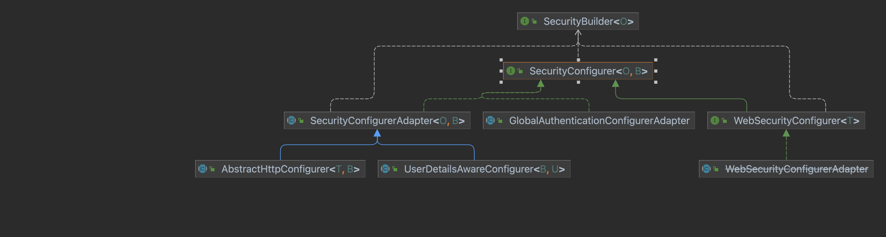
1. `SecurityConfigurerAdapter`的核心源码如下:
```java
public abstract class SecurityConfigurerAdapter<O, B extends SecurityBuilder<O>> implements SecurityConfigurer<O, B> {

	private B securityBuilder;

	private CompositeObjectPostProcessor objectPostProcessor = new CompositeObjectPostProcessor();

	@Override
	public void init(B builder) throws Exception {
	}

	@Override
	public void configure(B builder) throws Exception {
	}

	/**
	 * Return the {@link SecurityBuilder} when done using the {@link SecurityConfigurer}.
	 * This is useful for method chaining.
	 * @return the {@link SecurityBuilder} for further customizations
	 */
	public B and() {
		return getBuilder();
	}

	/**
	 * Gets the {@link SecurityBuilder}. Cannot be null.
	 * @return the {@link SecurityBuilder}
	 * @throws IllegalStateException if {@link SecurityBuilder} is null
	 */
	protected final B getBuilder() {
		Assert.state(this.securityBuilder != null, "securityBuilder cannot be null");
		return this.securityBuilder;
	}

	/**
	 * Performs post processing of an object. The default is to delegate to the
	 * {@link ObjectPostProcessor}.
	 * @param object the Object to post process
	 * @return the possibly modified Object to use
	 */
	@SuppressWarnings("unchecked")
	protected <T> T postProcess(T object) {
		return (T) this.objectPostProcessor.postProcess(object);
	}

	/**
	 * Adds an {@link ObjectPostProcessor} to be used for this
	 * {@link SecurityConfigurerAdapter}. The default implementation does nothing to the
	 * object.
	 * @param objectPostProcessor the {@link ObjectPostProcessor} to use
	 */
	public void addObjectPostProcessor(ObjectPostProcessor<?> objectPostProcessor) {
		this.objectPostProcessor.addObjectPostProcessor(objectPostProcessor);
	}

	/**
	 * Sets the {@link SecurityBuilder} to be used. This is automatically set when using
	 * {@link AbstractConfiguredSecurityBuilder#apply(SecurityConfigurerAdapter)}
	 * @param builder the {@link SecurityBuilder} to set
	 */
	public void setBuilder(B builder) {
		this.securityBuilder = builder;
	}

	/**
	 * An {@link ObjectPostProcessor} that delegates work to numerous
	 * {@link ObjectPostProcessor} implementations.
	 *
	 * @author Rob Winch
	 */
	private static final class CompositeObjectPostProcessor implements ObjectPostProcessor<Object> {

		private List<ObjectPostProcessor<?>> postProcessors = new ArrayList<>();

		@Override
		@SuppressWarnings({ "rawtypes", "unchecked" })
		public Object postProcess(Object object) {
			for (ObjectPostProcessor opp : this.postProcessors) {
				Class<?> oppClass = opp.getClass();
				Class<?> oppType = GenericTypeResolver.resolveTypeArgument(oppClass, ObjectPostProcessor.class);
				if (oppType == null || oppType.isAssignableFrom(object.getClass())) {
					object = opp.postProcess(object);
				}
			}
			return object;
		}

		/**
		 * Adds an {@link ObjectPostProcessor} to use
		 * @param objectPostProcessor the {@link ObjectPostProcessor} to add
		 * @return true if the {@link ObjectPostProcessor} was added, else false
		 */
		private boolean addObjectPostProcessor(ObjectPostProcessor<?> objectPostProcessor) {
			boolean result = this.postProcessors.add(objectPostProcessor);
			this.postProcessors.sort(AnnotationAwareOrderComparator.INSTANCE);
			return result;
		}
	}
}
```
- 这是一个抽象类，主要是用于继承的，里面定义securityBuilder属性，主要and()方法是用来支持链式调用的;
- 定义了复合的`CompositeObjectPostProcessor`对象后置处理器;
2. `UserDetailsAwareConfigurer`
UserDetailsAwareConfigurer的子类主要负责配置用户认证相关的组件，如UserDetailsService等，UserDetailsAwareConfigurer中提供了获取UserDetailsService的抽象方法，具体实现在子类中，核心源码如下:
```java
public abstract class UserDetailsAwareConfigurer<B extends ProviderManagerBuilder<B>, U extends UserDetailsService>
		extends SecurityConfigurerAdapter<AuthenticationManager, B> {

	/**
	 * Gets the {@link UserDetailsService} or null if it is not available
	 * @return the {@link UserDetailsService} or null if it is not available
	 */
	public abstract U getUserDetailsService();

}
```
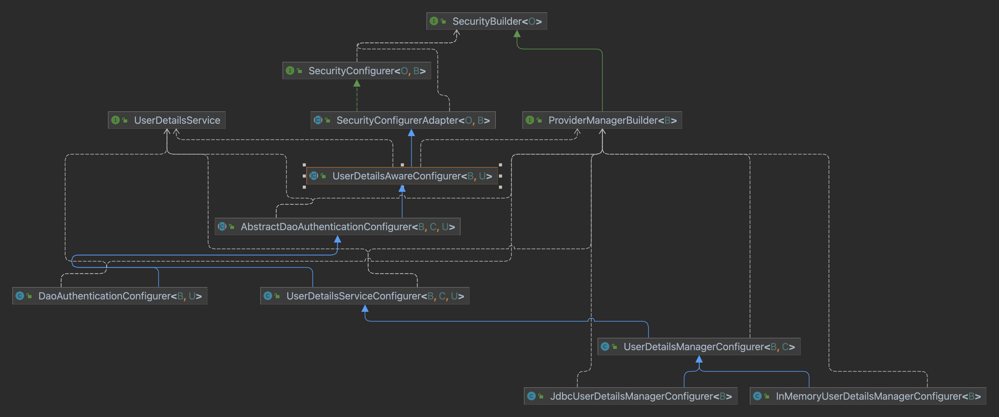
- `AbstractDaoAuthenticationConfigurer`完成对DaoAuthenticationProvider的配置;
- `UserDetailsServiceConfigurer`完成对UserDetailsService的配置;
- `UserDetailsManagerConfigurer`使用UserDetailsManager构建用户对象，完成对AuthenticationManagerBuilder的填充;
- `JdbcUserDetailsManagerConfigurer`配置JdbcUserDetailsManager并填充到AuthenticationManagerBuilder中;
- `InMemoryUserDetailsManagerConfigurer`配置InMemoryUserDetailsManager
- `DaoAuthenticationConfigurer`完成对DaoAuthenticationProvider的配置
3. AbstractHttpConfigurer
AbstractHttpConfigurer主要是为了给在HttpSecurity中使用的配置类添加方便的父类，提取出共同的操作，核心源码如下:
```java
public abstract class AbstractHttpConfigurer<T extends AbstractHttpConfigurer<T, B>, B extends HttpSecurityBuilder<B>>
		extends SecurityConfigurerAdapter<DefaultSecurityFilterChain, B> {

	/**
	 * Disables the {@link AbstractHttpConfigurer} by removing it. After doing so a fresh
	 * version of the configuration can be applied.
	 * @return the {@link HttpSecurityBuilder} for additional customizations
	 */
	@SuppressWarnings("unchecked")
	public B disable() {
		getBuilder().removeConfigurer(getClass());
		return getBuilder();
	}

	@SuppressWarnings("unchecked")
	public T withObjectPostProcessor(ObjectPostProcessor<?> objectPostProcessor) {
		addObjectPostProcessor(objectPostProcessor);
		return (T) this;
	}

}
```
只有2个方法，一个用于禁用某一个配置，一个用于添加对象后置处理器.它的实现类比较多。这个后续补充吧.
4. GlobalAuthenticationConfigrerAdapter
主要用于配置全局AuthenticationManagerBuilder，在AuthenticationConfiguration类中会自动使用`GlobalAuthenticationConfigrerAdapter`提供的Bean来配置全局AuthenticationManagerBuilder.有4个不同的子类:
- `InitializeAuthenticationProviderBeanManagerConfigurer`，初始化全局的AuthenticationProvider对象;
- `InitializeAuthenticationProviderManagerConfigurer`，配置全局的AuthenticationProvider对象，配置过程就是从Spring容器中查找AuthenticationProvider并设置给全局的AuthenticationManagerBuilder对象;
- `InitializeUserDetailsBeanManagerConfigurer`，初始化全局的UserDetailsService对象;
- `InitializeUserDetailsManagerConfigurer`，配置全局的UserDetailsService对象，配置过程就是从Spring容器中查找UserDetailsService，并设置给全局的AuthenticationManagerBuilder对象;
- `EnableGlobalAuthenticationAutowiredConfigurer`，从Spring容器中加载被@EnableGlobalAuthentication注解标记的Bean。
5. WebSecurityConfigurer
一个空接口，用来定制化WebSecurity，只有一个实现类，就是`WebSecurityConfigurerAdapter`，多数都是继承`WebSecurityConfigurerAdapter`实现对WebSecurity的自定义配置
6. WebSecurityConfigurerAdapter
`WebSecurityConfigurerAdapter`是一个创建`WebSecurityConfigurer`的基类，可以覆盖类内的方法完成对WebSecurity与HttpSecurity的定制，里面包含2个AuthenticationManagerBuilder对象，
```java
	private AuthenticationManagerBuilder authenticationBuilder;
	private AuthenticationManagerBuilder localConfigureAuthenticationBldr;
```
- localConfigureAuthenticationBldr负责构建全局的`AuthenticationManager`，
- authenticationBuilder负责构建局部的`AuthenticationManager`，全局的`AuthenticationManager`是所有局部的`AuthenticationManager`的parent，核心代码如下:
```java
@Order(100)
@Deprecated
public abstract class WebSecurityConfigurerAdapter implements WebSecurityConfigurer<WebSecurity> {

	private final Log logger = LogFactory.getLog(WebSecurityConfigurerAdapter.class);

	private ApplicationContext context;

	private ContentNegotiationStrategy contentNegotiationStrategy = new HeaderContentNegotiationStrategy();

	private ObjectPostProcessor<Object> objectPostProcessor = new ObjectPostProcessor<Object>() {
		@Override
		public <T> T postProcess(T object) {
			throw new IllegalStateException(ObjectPostProcessor.class.getName()
					+ " is a required bean. Ensure you have used @EnableWebSecurity and @Configuration");
		}
	};

	private AuthenticationConfiguration authenticationConfiguration;

	private AuthenticationManagerBuilder authenticationBuilder;

	private AuthenticationManagerBuilder localConfigureAuthenticationBldr;

	private boolean disableLocalConfigureAuthenticationBldr;

	private boolean authenticationManagerInitialized;

	private AuthenticationManager authenticationManager;

	private AuthenticationTrustResolver trustResolver = new AuthenticationTrustResolverImpl();

	private HttpSecurity http;

	private boolean disableDefaults;

	/**
	 * Creates an instance with the default configuration enabled.
	 */
	protected WebSecurityConfigurerAdapter() {
		this(false);
	}

	/**
	 * Creates an instance which allows specifying if the default configuration should be
	 * enabled. Disabling the default configuration should be considered more advanced
	 * usage as it requires more understanding of how the framework is implemented.
	 * @param disableDefaults true if the default configuration should be disabled, else
	 * false
	 */
	protected WebSecurityConfigurerAdapter(boolean disableDefaults) {
		this.disableDefaults = disableDefaults;
	}

	/**
	 * Used by the default implementation of {@link #authenticationManager()} to attempt
	 * to obtain an {@link AuthenticationManager}. If overridden, the
	 * {@link AuthenticationManagerBuilder} should be used to specify the
	 * {@link AuthenticationManager}.
	 *
	 * <p>
	 * The {@link #authenticationManagerBean()} method can be used to expose the resulting
	 * {@link AuthenticationManager} as a Bean. The {@link #userDetailsServiceBean()} can
	 * be used to expose the last populated {@link UserDetailsService} that is created
	 * with the {@link AuthenticationManagerBuilder} as a Bean. The
	 * {@link UserDetailsService} will also automatically be populated on
	 * {@link HttpSecurity#getSharedObject(Class)} for use with other
	 * {@link SecurityContextConfigurer} (i.e. RememberMeConfigurer )
	 * </p>
	 *
	 * <p>
	 * For example, the following configuration could be used to register in memory
	 * authentication that exposes an in memory {@link UserDetailsService}:
	 * </p>
	 *
	 * <pre>
	 * &#064;Override
	 * protected void configure(AuthenticationManagerBuilder auth) {
	 * 	auth
	 * 	// enable in memory based authentication with a user named
	 * 	// &quot;user&quot; and &quot;admin&quot;
	 * 	.inMemoryAuthentication().withUser(&quot;user&quot;).password(&quot;password&quot;).roles(&quot;USER&quot;).and()
	 * 			.withUser(&quot;admin&quot;).password(&quot;password&quot;).roles(&quot;USER&quot;, &quot;ADMIN&quot;);
	 * }
	 *
	 * // Expose the UserDetailsService as a Bean
	 * &#064;Bean
	 * &#064;Override
	 * public UserDetailsService userDetailsServiceBean() throws Exception {
	 * 	return super.userDetailsServiceBean();
	 * }
	 *
	 * </pre>
	 * @param auth the {@link AuthenticationManagerBuilder} to use
	 * @throws Exception
	 */
	protected void configure(AuthenticationManagerBuilder auth) throws Exception {
		this.disableLocalConfigureAuthenticationBldr = true;
	}

	/**
	 * Creates the {@link HttpSecurity} or returns the current instance
	 * @return the {@link HttpSecurity}
	 * @throws Exception
	 */
	@SuppressWarnings({ "rawtypes", "unchecked" })
	protected final HttpSecurity getHttp() throws Exception {
		if (this.http != null) {
			return this.http;
		}
		AuthenticationEventPublisher eventPublisher = getAuthenticationEventPublisher();
		this.localConfigureAuthenticationBldr.authenticationEventPublisher(eventPublisher);
		AuthenticationManager authenticationManager = authenticationManager();
		this.authenticationBuilder.parentAuthenticationManager(authenticationManager);
		Map<Class<?>, Object> sharedObjects = createSharedObjects();
		this.http = new HttpSecurity(this.objectPostProcessor, this.authenticationBuilder, sharedObjects);
		if (!this.disableDefaults) {
			applyDefaultConfiguration(this.http);
			ClassLoader classLoader = this.context.getClassLoader();
			List<AbstractHttpConfigurer> defaultHttpConfigurers = SpringFactoriesLoader
					.loadFactories(AbstractHttpConfigurer.class, classLoader);
			for (AbstractHttpConfigurer configurer : defaultHttpConfigurers) {
				this.http.apply(configurer);
			}
		}
		configure(this.http);
		return this.http;
	}

	private void applyDefaultConfiguration(HttpSecurity http) throws Exception {
		http.csrf();
		http.addFilter(new WebAsyncManagerIntegrationFilter());
		http.exceptionHandling();
		http.headers();
		http.sessionManagement();
		http.securityContext();
		http.requestCache();
		http.anonymous();
		http.servletApi();
		http.apply(new DefaultLoginPageConfigurer<>());
		http.logout();
	}

	/**
	 * Override this method to expose the {@link AuthenticationManager} from
	 * {@link #configure(AuthenticationManagerBuilder)} to be exposed as a Bean. For
	 * example:
	 *
	 * <pre>
	 * &#064;Bean(name name="myAuthenticationManager")
	 * &#064;Override
	 * public AuthenticationManager authenticationManagerBean() throws Exception {
	 *     return super.authenticationManagerBean();
	 * }
	 * </pre>
	 * @return the {@link AuthenticationManager}
	 * @throws Exception
	 */
	public AuthenticationManager authenticationManagerBean() throws Exception {
		return new AuthenticationManagerDelegator(this.authenticationBuilder, this.context);
	}

	/**
	 * Gets the {@link AuthenticationManager} to use. The default strategy is if
	 * {@link #configure(AuthenticationManagerBuilder)} method is overridden to use the
	 * {@link AuthenticationManagerBuilder} that was passed in. Otherwise, autowire the
	 * {@link AuthenticationManager} by type.
	 * @return the {@link AuthenticationManager} to use
	 * @throws Exception
	 */
	protected AuthenticationManager authenticationManager() throws Exception {
		if (!this.authenticationManagerInitialized) {
			configure(this.localConfigureAuthenticationBldr);
			if (this.disableLocalConfigureAuthenticationBldr) {
				this.authenticationManager = this.authenticationConfiguration.getAuthenticationManager();
			}
			else {
				this.authenticationManager = this.localConfigureAuthenticationBldr.build();
			}
			this.authenticationManagerInitialized = true;
		}
		return this.authenticationManager;
	}

	/**
	 * Override this method to expose a {@link UserDetailsService} created from
	 * {@link #configure(AuthenticationManagerBuilder)} as a bean. In general only the
	 * following override should be done of this method:
	 *
	 * <pre>
	 * &#064;Bean(name = &quot;myUserDetailsService&quot;)
	 * // any or no name specified is allowed
	 * &#064;Override
	 * public UserDetailsService userDetailsServiceBean() throws Exception {
	 * 	return super.userDetailsServiceBean();
	 * }
	 * </pre>
	 *
	 * To change the instance returned, developers should change
	 * {@link #userDetailsService()} instead
	 * @return the {@link UserDetailsService}
	 * @throws Exception
	 * @see #userDetailsService()
	 */
	public UserDetailsService userDetailsServiceBean() throws Exception {
		AuthenticationManagerBuilder globalAuthBuilder = this.context.getBean(AuthenticationManagerBuilder.class);
		return new UserDetailsServiceDelegator(Arrays.asList(this.localConfigureAuthenticationBldr, globalAuthBuilder));
	}

	/**
	 * Allows modifying and accessing the {@link UserDetailsService} from
	 * {@link #userDetailsServiceBean()} without interacting with the
	 * {@link ApplicationContext}. Developers should override this method when changing
	 * the instance of {@link #userDetailsServiceBean()}.
	 * @return the {@link UserDetailsService} to use
	 */
	protected UserDetailsService userDetailsService() {
		AuthenticationManagerBuilder globalAuthBuilder = this.context.getBean(AuthenticationManagerBuilder.class);
		return new UserDetailsServiceDelegator(Arrays.asList(this.localConfigureAuthenticationBldr, globalAuthBuilder));
	}

	@Override
	public void init(WebSecurity web) throws Exception {
		HttpSecurity http = getHttp();
		web.addSecurityFilterChainBuilder(http).postBuildAction(() -> {
			FilterSecurityInterceptor securityInterceptor = http.getSharedObject(FilterSecurityInterceptor.class);
			web.securityInterceptor(securityInterceptor);
		});
	}

	/**
	 * Override this method to configure {@link WebSecurity}. For example, if you wish to
	 * ignore certain requests.
	 *
	 * Endpoints specified in this method will be ignored by Spring Security, meaning it
	 * will not protect them from CSRF, XSS, Clickjacking, and so on.
	 *
	 * Instead, if you want to protect endpoints against common vulnerabilities, then see
	 * {@link #configure(HttpSecurity)} and the {@link HttpSecurity#authorizeRequests}
	 * configuration method.
	 */
	@Override
	public void configure(WebSecurity web) throws Exception {
	}

	/**
	 * Override this method to configure the {@link HttpSecurity}. Typically subclasses
	 * should not invoke this method by calling super as it may override their
	 * configuration. The default configuration is:
	 *
	 * <pre>
	 * http.authorizeRequests().anyRequest().authenticated().and().formLogin().and().httpBasic();
	 * </pre>
	 *
	 * Any endpoint that requires defense against common vulnerabilities can be specified
	 * here, including public ones. See {@link HttpSecurity#authorizeRequests} and the
	 * `permitAll()` authorization rule for more details on public endpoints.
	 * @param http the {@link HttpSecurity} to modify
	 * @throws Exception if an error occurs
	 */
	protected void configure(HttpSecurity http) throws Exception {
		this.logger.debug("Using default configure(HttpSecurity). "
				+ "If subclassed this will potentially override subclass configure(HttpSecurity).");
		http.authorizeRequests((requests) -> requests.anyRequest().authenticated());
		http.formLogin();
		http.httpBasic();
	}

	/**
	 * Gets the ApplicationContext
	 * @return the context
	 */
	protected final ApplicationContext getApplicationContext() {
		return this.context;
	}

	@Autowired
	public void setApplicationContext(ApplicationContext context) {
		this.context = context;
		ObjectPostProcessor<Object> objectPostProcessor = context.getBean(ObjectPostProcessor.class);
		LazyPasswordEncoder passwordEncoder = new LazyPasswordEncoder(context);
		this.authenticationBuilder = new DefaultPasswordEncoderAuthenticationManagerBuilder(objectPostProcessor,
				passwordEncoder);
		this.localConfigureAuthenticationBldr = new DefaultPasswordEncoderAuthenticationManagerBuilder(
				objectPostProcessor, passwordEncoder) {

			@Override
			public AuthenticationManagerBuilder eraseCredentials(boolean eraseCredentials) {
				WebSecurityConfigurerAdapter.this.authenticationBuilder.eraseCredentials(eraseCredentials);
				return super.eraseCredentials(eraseCredentials);
			}

			@Override
			public AuthenticationManagerBuilder authenticationEventPublisher(
					AuthenticationEventPublisher eventPublisher) {
				WebSecurityConfigurerAdapter.this.authenticationBuilder.authenticationEventPublisher(eventPublisher);
				return super.authenticationEventPublisher(eventPublisher);
			}

		};
	}

	@Autowired(required = false)
	public void setTrustResolver(AuthenticationTrustResolver trustResolver) {
		this.trustResolver = trustResolver;
	}

	@Autowired(required = false)
	public void setContentNegotationStrategy(ContentNegotiationStrategy contentNegotiationStrategy) {
		this.contentNegotiationStrategy = contentNegotiationStrategy;
	}

	@Autowired
	public void setObjectPostProcessor(ObjectPostProcessor<Object> objectPostProcessor) {
		this.objectPostProcessor = objectPostProcessor;
	}

	@Autowired
	public void setAuthenticationConfiguration(AuthenticationConfiguration authenticationConfiguration) {
		this.authenticationConfiguration = authenticationConfiguration;
	}

	private AuthenticationEventPublisher getAuthenticationEventPublisher() {
		if (this.context.getBeanNamesForType(AuthenticationEventPublisher.class).length > 0) {
			return this.context.getBean(AuthenticationEventPublisher.class);
		}
		return this.objectPostProcessor.postProcess(new DefaultAuthenticationEventPublisher());
	}

	/**
	 * Creates the shared objects
	 * @return the shared Objects
	 */
	private Map<Class<?>, Object> createSharedObjects() {
		Map<Class<?>, Object> sharedObjects = new HashMap<>();
		sharedObjects.putAll(this.localConfigureAuthenticationBldr.getSharedObjects());
		sharedObjects.put(UserDetailsService.class, userDetailsService());
		sharedObjects.put(ApplicationContext.class, this.context);
		sharedObjects.put(ContentNegotiationStrategy.class, this.contentNegotiationStrategy);
		sharedObjects.put(AuthenticationTrustResolver.class, this.trustResolver);
		return sharedObjects;
	}

	/**
	 * Delays the use of the {@link UserDetailsService} from the
	 * {@link AuthenticationManagerBuilder} to ensure that it has been fully configured.
	 *
	 * @author Rob Winch
	 * @since 3.2
	 */
	static final class UserDetailsServiceDelegator implements UserDetailsService {

		private List<AuthenticationManagerBuilder> delegateBuilders;

		private UserDetailsService delegate;

		private final Object delegateMonitor = new Object();

		UserDetailsServiceDelegator(List<AuthenticationManagerBuilder> delegateBuilders) {
			Assert.isTrue(!delegateBuilders.contains(null),
					() -> "delegateBuilders cannot contain null values. Got " + delegateBuilders);
			this.delegateBuilders = delegateBuilders;
		}

		@Override
		public UserDetails loadUserByUsername(String username) throws UsernameNotFoundException {
			if (this.delegate != null) {
				return this.delegate.loadUserByUsername(username);
			}
			synchronized (this.delegateMonitor) {
				if (this.delegate == null) {
					for (AuthenticationManagerBuilder delegateBuilder : this.delegateBuilders) {
						this.delegate = delegateBuilder.getDefaultUserDetailsService();
						if (this.delegate != null) {
							break;
						}
					}
					if (this.delegate == null) {
						throw new IllegalStateException("UserDetailsService is required.");
					}
					this.delegateBuilders = null;
				}
			}
			return this.delegate.loadUserByUsername(username);
		}

	}

	/**
	 * Delays the use of the {@link AuthenticationManager} build from the
	 * {@link AuthenticationManagerBuilder} to ensure that it has been fully configured.
	 *
	 * @author Rob Winch
	 * @since 3.2
	 */
	static final class AuthenticationManagerDelegator implements AuthenticationManager {

		private AuthenticationManagerBuilder delegateBuilder;

		private AuthenticationManager delegate;

		private final Object delegateMonitor = new Object();

		private Set<String> beanNames;

		AuthenticationManagerDelegator(AuthenticationManagerBuilder delegateBuilder, ApplicationContext context) {
			Assert.notNull(delegateBuilder, "delegateBuilder cannot be null");
			Field parentAuthMgrField = ReflectionUtils.findField(AuthenticationManagerBuilder.class,
					"parentAuthenticationManager");
			ReflectionUtils.makeAccessible(parentAuthMgrField);
			this.beanNames = getAuthenticationManagerBeanNames(context);
			validateBeanCycle(ReflectionUtils.getField(parentAuthMgrField, delegateBuilder), this.beanNames);
			this.delegateBuilder = delegateBuilder;
		}

		@Override
		public Authentication authenticate(Authentication authentication) throws AuthenticationException {
			if (this.delegate != null) {
				return this.delegate.authenticate(authentication);
			}
			synchronized (this.delegateMonitor) {
				if (this.delegate == null) {
					this.delegate = this.delegateBuilder.getObject();
					this.delegateBuilder = null;
				}
			}
			return this.delegate.authenticate(authentication);
		}

		private static Set<String> getAuthenticationManagerBeanNames(ApplicationContext applicationContext) {
			String[] beanNamesForType = BeanFactoryUtils.beanNamesForTypeIncludingAncestors(applicationContext,
					AuthenticationManager.class);
			return new HashSet<>(Arrays.asList(beanNamesForType));
		}

		private static void validateBeanCycle(Object auth, Set<String> beanNames) {
			if (auth == null || beanNames.isEmpty() || !(auth instanceof Advised)) {
				return;
			}
			TargetSource targetSource = ((Advised) auth).getTargetSource();
			if (!(targetSource instanceof LazyInitTargetSource)) {
				return;
			}
			LazyInitTargetSource lits = (LazyInitTargetSource) targetSource;
			if (beanNames.contains(lits.getTargetBeanName())) {
				throw new FatalBeanException(
						"A dependency cycle was detected when trying to resolve the AuthenticationManager. "
								+ "Please ensure you have configured authentication.");
			}
		}

	}

	static class DefaultPasswordEncoderAuthenticationManagerBuilder extends AuthenticationManagerBuilder {

		private PasswordEncoder defaultPasswordEncoder;

		/**
		 * Creates a new instance
		 * @param objectPostProcessor the {@link ObjectPostProcessor} instance to use.
		 */
		DefaultPasswordEncoderAuthenticationManagerBuilder(ObjectPostProcessor<Object> objectPostProcessor,
				PasswordEncoder defaultPasswordEncoder) {
			super(objectPostProcessor);
			this.defaultPasswordEncoder = defaultPasswordEncoder;
		}

		@Override
		public InMemoryUserDetailsManagerConfigurer<AuthenticationManagerBuilder> inMemoryAuthentication()
				throws Exception {
			return super.inMemoryAuthentication().passwordEncoder(this.defaultPasswordEncoder);
		}

		@Override
		public JdbcUserDetailsManagerConfigurer<AuthenticationManagerBuilder> jdbcAuthentication() throws Exception {
			return super.jdbcAuthentication().passwordEncoder(this.defaultPasswordEncoder);
		}

		@Override
		public <T extends UserDetailsService> DaoAuthenticationConfigurer<AuthenticationManagerBuilder, T> userDetailsService(
				T userDetailsService) throws Exception {
			return super.userDetailsService(userDetailsService).passwordEncoder(this.defaultPasswordEncoder);
		}

	}

	static class LazyPasswordEncoder implements PasswordEncoder {

		private ApplicationContext applicationContext;

		private PasswordEncoder passwordEncoder;

		LazyPasswordEncoder(ApplicationContext applicationContext) {
			this.applicationContext = applicationContext;
		}

		@Override
		public String encode(CharSequence rawPassword) {
			return getPasswordEncoder().encode(rawPassword);
		}

		@Override
		public boolean matches(CharSequence rawPassword, String encodedPassword) {
			return getPasswordEncoder().matches(rawPassword, encodedPassword);
		}

		@Override
		public boolean upgradeEncoding(String encodedPassword) {
			return getPasswordEncoder().upgradeEncoding(encodedPassword);
		}

		private PasswordEncoder getPasswordEncoder() {
			if (this.passwordEncoder != null) {
				return this.passwordEncoder;
			}
			PasswordEncoder passwordEncoder = getBeanOrNull(PasswordEncoder.class);
			if (passwordEncoder == null) {
				passwordEncoder = PasswordEncoderFactories.createDelegatingPasswordEncoder();
			}
			this.passwordEncoder = passwordEncoder;
			return passwordEncoder;
		}

		private <T> T getBeanOrNull(Class<T> type) {
			try {
				return this.applicationContext.getBean(type);
			}
			catch (NoSuchBeanDefinitionException ex) {
				return null;
			}
		}

		@Override
		public String toString() {
			return getPasswordEncoder().toString();
		}

	}
}
```
- init方法中，先调用getHttp方法获取一个HttpSecurity实例，添加到WebSecurity对象中，再由WebSecurity对象构建;
- getHttp()方法中，如果http已经初始化，返回，否则初始化;
- authenticationManager()方法中，如果全局的AuthenticationManager还没有初始化，先调用configure方法，接下来进入到if分支中，调用`this.authenticationConfiguration.getAuthenticationManager()`获取全局的AuthenticationManager，如果开发者自己重写了configure(AuthenticationManagerBuilder)方法，就会进入都else分支，通过`localConfigureAuthenticationBldr`来构建；
- 返回到getHttp方法中，获取全局的AuthenticationManager后设置到AuthenticationBuilder，然后构建一个HttpSecurity实例，调用configure方法进行扩展配置。
### 初始化流程分析
如果是Spring Boot项目，Security初始化从自动化配置类开始,代码如下:
```java
@AutoConfiguration
@ConditionalOnClass(DefaultAuthenticationEventPublisher.class)
@EnableConfigurationProperties(SecurityProperties.class)
@Import({ SpringBootWebSecurityConfiguration.class, SecurityDataConfiguration.class })
public class SecurityAutoConfiguration {
	@Bean
	@ConditionalOnMissingBean(AuthenticationEventPublisher.class)
	public DefaultAuthenticationEventPublisher authenticationEventPublisher(ApplicationEventPublisher publisher) {
		return new DefaultAuthenticationEventPublisher(publisher);
	}
}
```
- `SpringBootWebSecurityConfiguration`的主要作用是在开发者没有提供`WebSecurityConfigurerAdapter`实例的情况下，提供默认的`WebSecurityConfigurerAdapter`:
```java
@Configuration(proxyBeanMethods = false)
@ConditionalOnWebApplication(type = Type.SERVLET)
class SpringBootWebSecurityConfiguration {
	/**
	 * The default configuration for web security. It relies on Spring Security's
	 * content-negotiation strategy to determine what sort of authentication to use. If
	 * the user specifies their own {@code WebSecurityConfigurerAdapter} or
	 * {@link SecurityFilterChain} bean, this will back-off completely and the users
	 * should specify all the bits that they want to configure as part of the custom
	 * security configuration.
	 */
	@Configuration(proxyBeanMethods = false)
	@ConditionalOnDefaultWebSecurity
	static class SecurityFilterChainConfiguration {
		@Bean
		@Order(SecurityProperties.BASIC_AUTH_ORDER)
		SecurityFilterChain defaultSecurityFilterChain(HttpSecurity http) throws Exception {
			http.authorizeRequests().anyRequest().authenticated();
			http.formLogin();
			http.httpBasic();
			return http.build();
		}
	}
	/**
	 * Configures the {@link ErrorPageSecurityFilter}.
	 */
	@Configuration(proxyBeanMethods = false)
	@ConditionalOnClass(WebInvocationPrivilegeEvaluator.class)
	@ConditionalOnBean(WebInvocationPrivilegeEvaluator.class)
	static class ErrorPageSecurityFilterConfiguration {
		@Bean
		FilterRegistrationBean<ErrorPageSecurityFilter> errorPageSecurityFilter(ApplicationContext context) {
			FilterRegistrationBean<ErrorPageSecurityFilter> registration = new FilterRegistrationBean<>(
					new ErrorPageSecurityFilter(context));
			registration.setDispatcherTypes(DispatcherType.ERROR);
			return registration;
		}
	}
	/**
	 * Adds the {@link EnableWebSecurity @EnableWebSecurity} annotation if Spring Security
	 * is on the classpath. This will make sure that the annotation is present with
	 * default security auto-configuration and also if the user adds custom security and
	 * forgets to add the annotation. If {@link EnableWebSecurity @EnableWebSecurity} has
	 * already been added or if a bean with name
	 * {@value BeanIds#SPRING_SECURITY_FILTER_CHAIN} has been configured by the user, this
	 * will back-off.
	 */
	@Configuration(proxyBeanMethods = false)
	@ConditionalOnMissingBean(name = BeanIds.SPRING_SECURITY_FILTER_CHAIN)
	@ConditionalOnClass(EnableWebSecurity.class)
	@EnableWebSecurity
	static class WebSecurityEnablerConfiguration {
	}
}
```
- `SecurityDataConfiguration`提供Security的SpEL支持
```java
@Configuration(proxyBeanMethods = false)
@ConditionalOnClass(SecurityEvaluationContextExtension.class)
public class SecurityDataConfiguration {

	@Bean
	@ConditionalOnMissingBean
	public SecurityEvaluationContextExtension securityEvaluationContextExtension() {
		return new SecurityEvaluationContextExtension();
	}

}
```
`WebSecurityEnablerConfiguration`是一个非常重要的类，这里添加了@EnableWebSecurity注解，这个注解又引入了关键的配置类`WebSecurityConfiguration`
```java
@Retention(RetentionPolicy.RUNTIME)
@Target(ElementType.TYPE)
@Documented
@Import({ WebSecurityConfiguration.class, SpringWebMvcImportSelector.class, OAuth2ImportSelector.class,
		HttpSecurityConfiguration.class })
@EnableGlobalAuthentication
@Configuration
public @interface EnableWebSecurity {

	/**
	 * Controls debugging support for Spring Security. Default is false.
	 * @return if true, enables debug support with Spring Security
	 */
	boolean debug() default false;

}
```
- WebSecurityConfiguration用来配置WebSecurity
- SpringWebMvcImportSelector，如果是Mvc环境，引入相关的配置;
- OAuth2ImportSelector是否存在OAuth2，引入相关的配置;
- `@EnableGlobalAuthentication`开启全局配置;
```java
@Retention(RetentionPolicy.RUNTIME)
@Target(ElementType.TYPE)
@Documented
@Import(AuthenticationConfiguration.class)
@Configuration
public @interface EnableGlobalAuthentication {
}
```
最重要的2个类: WebSecurityConfiguration与AuthenticationConfiguration;
#### WebSecurityConfiguration
它的主要的作用就是创建FilterChainProxy，先构建WebSecurity对象，再通过WebSecurity构建出FilterChainProxy。核心源码如下:
```java
@Configuration(proxyBeanMethods = false)
public class WebSecurityConfiguration implements ImportAware, BeanClassLoaderAware {

	private WebSecurity webSecurity;

	private Boolean debugEnabled;

	private List<SecurityConfigurer<Filter, WebSecurity>> webSecurityConfigurers;

	private List<SecurityFilterChain> securityFilterChains = Collections.emptyList();

	private List<WebSecurityCustomizer> webSecurityCustomizers = Collections.emptyList();

	private ClassLoader beanClassLoader;

	@Autowired(required = false)
	private ObjectPostProcessor<Object> objectObjectPostProcessor;

	@Bean
	public static DelegatingApplicationListener delegatingApplicationListener() {
		return new DelegatingApplicationListener();
	}

	@Bean
	@DependsOn(AbstractSecurityWebApplicationInitializer.DEFAULT_FILTER_NAME)
	public SecurityExpressionHandler<FilterInvocation> webSecurityExpressionHandler() {
		return this.webSecurity.getExpressionHandler();
	}
	/**
	 * Creates the Spring Security Filter Chain
	 * @return the {@link Filter} that represents the security filter chain
	 * @throws Exception
	 */
	@Bean(name = AbstractSecurityWebApplicationInitializer.DEFAULT_FILTER_NAME)
	public Filter springSecurityFilterChain() throws Exception {
		boolean hasConfigurers = this.webSecurityConfigurers != null && !this.webSecurityConfigurers.isEmpty();
		boolean hasFilterChain = !this.securityFilterChains.isEmpty();
		Assert.state(!(hasConfigurers && hasFilterChain),
				"Found WebSecurityConfigurerAdapter as well as SecurityFilterChain. Please select just one.");
		if (!hasConfigurers && !hasFilterChain) {
			WebSecurityConfigurerAdapter adapter = this.objectObjectPostProcessor
					.postProcess(new WebSecurityConfigurerAdapter() {
					});
			this.webSecurity.apply(adapter);
		}
		for (SecurityFilterChain securityFilterChain : this.securityFilterChains) {
			this.webSecurity.addSecurityFilterChainBuilder(() -> securityFilterChain);
			for (Filter filter : securityFilterChain.getFilters()) {
				if (filter instanceof FilterSecurityInterceptor) {
					this.webSecurity.securityInterceptor((FilterSecurityInterceptor) filter);
					break;
				}
			}
		}
		for (WebSecurityCustomizer customizer : this.webSecurityCustomizers) {
			customizer.customize(this.webSecurity);
		}
		return this.webSecurity.build();
	}
	/**
	 * Creates the {@link WebInvocationPrivilegeEvaluator} that is necessary to evaluate
	 * privileges for a given web URI
	 * @return the {@link WebInvocationPrivilegeEvaluator}
	 */
	@Bean
	@DependsOn(AbstractSecurityWebApplicationInitializer.DEFAULT_FILTER_NAME)
	public WebInvocationPrivilegeEvaluator privilegeEvaluator() {
		return this.webSecurity.getPrivilegeEvaluator();
	}
	/**
	 * Sets the {@code <SecurityConfigurer<FilterChainProxy, WebSecurityBuilder>}
	 * instances used to create the web configuration.
	 * @param objectPostProcessor the {@link ObjectPostProcessor} used to create a
	 * {@link WebSecurity} instance
	 * @param beanFactory the bean factory to use to retrieve the relevant
	 * {@code <SecurityConfigurer<FilterChainProxy, WebSecurityBuilder>} instances used to
	 * create the web configuration
	 * @throws Exception
	 */
	@Autowired(required = false)
	public void setFilterChainProxySecurityConfigurer(ObjectPostProcessor<Object> objectPostProcessor,
			ConfigurableListableBeanFactory beanFactory) throws Exception {
		this.webSecurity = objectPostProcessor.postProcess(new WebSecurity(objectPostProcessor));
		if (this.debugEnabled != null) {
			this.webSecurity.debug(this.debugEnabled);
		}
		List<SecurityConfigurer<Filter, WebSecurity>> webSecurityConfigurers = new AutowiredWebSecurityConfigurersIgnoreParents(
				beanFactory).getWebSecurityConfigurers();
		webSecurityConfigurers.sort(AnnotationAwareOrderComparator.INSTANCE);
		Integer previousOrder = null;
		Object previousConfig = null;
		for (SecurityConfigurer<Filter, WebSecurity> config : webSecurityConfigurers) {
			Integer order = AnnotationAwareOrderComparator.lookupOrder(config);
			if (previousOrder != null && previousOrder.equals(order)) {
				throw new IllegalStateException("@Order on WebSecurityConfigurers must be unique. Order of " + order
						+ " was already used on " + previousConfig + ", so it cannot be used on " + config + " too.");
			}
			previousOrder = order;
			previousConfig = config;
		}
		for (SecurityConfigurer<Filter, WebSecurity> webSecurityConfigurer : webSecurityConfigurers) {
			this.webSecurity.apply(webSecurityConfigurer);
		}
		this.webSecurityConfigurers = webSecurityConfigurers;
	}
	@Autowired(required = false)
	void setFilterChains(List<SecurityFilterChain> securityFilterChains) {
		this.securityFilterChains = securityFilterChains;
	}
	@Autowired(required = false)
	void setWebSecurityCustomizers(List<WebSecurityCustomizer> webSecurityCustomizers) {
		this.webSecurityCustomizers = webSecurityCustomizers;
	}
	@Bean
	public static BeanFactoryPostProcessor conversionServicePostProcessor() {
		return new RsaKeyConversionServicePostProcessor();
	}
	@Override
	public void setImportMetadata(AnnotationMetadata importMetadata) {
		Map<String, Object> enableWebSecurityAttrMap = importMetadata
				.getAnnotationAttributes(EnableWebSecurity.class.getName());
		AnnotationAttributes enableWebSecurityAttrs = AnnotationAttributes.fromMap(enableWebSecurityAttrMap);
		this.debugEnabled = enableWebSecurityAttrs.getBoolean("debug");
		if (this.webSecurity != null) {
			this.webSecurity.debug(this.debugEnabled);
		}
	}
	@Override
	public void setBeanClassLoader(ClassLoader classLoader) {
		this.beanClassLoader = classLoader;
	}
	/**
	 * A custom version of the Spring provided AnnotationAwareOrderComparator that uses
	 * {@link AnnotationUtils#findAnnotation(Class, Class)} to look on super class
	 * instances for the {@link Order} annotation.
	 *
	 * @author Rob Winch
	 * @since 3.2
	 */
	private static class AnnotationAwareOrderComparator extends OrderComparator {

		private static final AnnotationAwareOrderComparator INSTANCE = new AnnotationAwareOrderComparator();

		@Override
		protected int getOrder(Object obj) {
			return lookupOrder(obj);
		}
		private static int lookupOrder(Object obj) {
			if (obj instanceof Ordered) {
				return ((Ordered) obj).getOrder();
			}
			if (obj != null) {
				Class<?> clazz = ((obj instanceof Class) ? (Class<?>) obj : obj.getClass());
				Order order = AnnotationUtils.findAnnotation(clazz, Order.class);
				if (order != null) {
					return order.value();
				}
			}
			return Ordered.LOWEST_PRECEDENCE;
		}
	}
}
```
- 实现了ImportAware接口，与@Import注解一起使用，获取到导入地方的一些设置;
- webSecurity是需要构建的对象;
- webSecurityConfigurers保存了所有的配置类，一个SecurityConfigurer可以创建一个HttpSecurity，构建出一条过滤器链;
- objectObjectPostProcessor是对象后置处理器，从spring容器中注入.
- setFilterChainProxySecurityConfigurer用来构建一个WebSecurity对象，并加载所有的配置.使用`new AutowiredWebSecurityConfigurersIgnoreParents(beanFactory)`获取BeanFactory中的所有的WebConfigurer对象，获取方法如下:
```java
	public List<SecurityConfigurer<Filter, WebSecurity>> getWebSecurityConfigurers() {
		List<SecurityConfigurer<Filter, WebSecurity>> webSecurityConfigurers = new ArrayList<>();
		Map<String, WebSecurityConfigurer> beansOfType = this.beanFactory.getBeansOfType(WebSecurityConfigurer.class);
		for (Entry<String, WebSecurityConfigurer> entry : beansOfType.entrySet()) {
			webSecurityConfigurers.add(entry.getValue());
		}
		return webSecurityConfigurers;
	}
```
可以看到是调用的BeanFactory的getBeansOfType方法，
