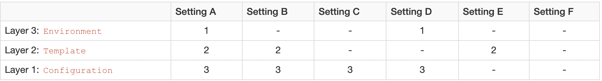

# 模板开发指南
## 入门
### 模板+数据模型=输出
### 数据模型一览
### 模板一览
## 数值，类型
### 基本内容
### 类型
## 模板
### 总体结构
### 指令
### 表达式
### 插值
## 其他
### 自定义指令
### 在模板中定义变凉
### 命名空间
### 替换(方括号)语法
# 程序开发指南
## 入门
### 创建Configuration实例
首创建`freemarker.template.Configuration`实例，然后调整设置，`Configuration`实例是存储FreeMarker应用级设置的核心部分，同时，它处理创建和缓存预解析模板的工作。也许你只在应用生命周期的开始执行一次:
```java
// Create your Configuration instance, and specify if up to what FreeMarker
// version (here 2.3.22) do you want to apply the fixes that are not 100%
// backward-compatible. See the Configuration JavaDoc for details.
Configuration cfg = new Configuration(Configuration.VERSION_2_3_22);

// Specify the source where the template files come from. Here I set a
// plain directory for it, but non-file-system sources are possible too:
cfg.setDirectoryForTemplateLoading(new File("/where/you/store/templates"));

// Set the preferred charset template files are stored in. UTF-8 is
// a good choice in most applications:
cfg.setDefaultEncoding("UTF-8");

// Sets how errors will appear.
// During web page *development* TemplateExceptionHandler.HTML_DEBUG_HANDLER is better.
cfg.setTemplateExceptionHandler(TemplateExceptionHandler.RETHROW_HANDLER);
```
应该使用单例实例配置。不需要重复创建`Configuration`实例；它的代价很高，尤其是会丢失缓存。`Configuration`实例就是应用级别的单例。当使用多线程应用程序(比如Web网站)，`Configuration`实例中的设置就不能被修改。它们可以被视作为有效的不可改变的对象，也可以继续使用安全发布技术(参考JSR 133和相关的文献)来保证实例对其它线程也可用。比如，通过final或volatile字段来声明实例，或者通过线程安全的IoC容器，但不能作为普通字段。(Configuration中不处理修改设置的方法是线程安全的。)
### 创建数据模型
在简单的示例中你可以使用java.lang和java.util包中的类，还有用户自定义的Java Bean来构建数据对象:
- 使用java.lang.String来构建字符串;
- 使用java.lang.Number来派生数字类型;
- 使用java.lang.Boolean来构建布尔值;
- 使用java.util.List或Java数组来构建序列;
- 使用java.util.Map来构建哈希表;
- 使用自定义的bean类来构建哈希表，bean中的项和bean的属性对应。比如，product的price属性(getProperty())可以通过product.price获取。(bean的action也可以通过这种方式拿到；要了解更多可以参看[这里](file:///Users/zhangyongxiang/Downloads/FreeMarker_2.3.23_Manual_zh_CN/pgui_misc_beanwrapper.html);

如果配置设置项object_wrapper的值是用于所有真实步骤，这里描述的行为才好用。任何由ObjectWrapper包装成的哈希表可以用作根root，也可以在模板中和点、 []操作符使用。如果不是包装成哈希表的对象不能作为根root，也不能像那样在模板中使用。
### 获取模版
模板代表了`freemarker.template.Template`实例。典型的做法是从`Configuration`实例中获取一个`Template`实例。无论什么时候你需要一个模板实例， 都可以使用它的`getTemplate`方法来获取。在之前设置的目录中的test.ftl文件中存储示例模板，那么就可以这样来做:
```java
Template temp = cfg.getTemplate("test.ftl");
```
当调用这个方法的时候，将会创建一个test.ftl的Template实例，通过读取/where/you/store/templates/test.ftl文件，之后解析(编译)它。Template 实例以解析后的形式存储模板， 而不是以源文件的文本形式。Configuration缓存Template实例，当再次获得test.ftl的时候，它可能再读取和解析模板文件了， 而只是返回第一次的Template实例。
### 合并模板与数据模型
我们已经知道，数据模型+模板-输出，我们有了一个数据模型和一个模板，为了输出就要合并他们，这是由模板的process方法完成的，它又数据模型root和Writer作为参数，然后向Writer对象写入产生的内容，为简单起见，这里我们只做标准的输出。
```java
Writer out = new OutputStreamWriter(System.out);
temp.process(root, out);
```
这会向终端输出合并后的内容。
### 将代码放在一起
```java
import freemarker.template.*;
import java.util.*;
import java.io.*;

public class Test {

    public static void main(String[] args) throws Exception {
        
        /* ------------------------------------------------------------------------ */    
        /* You should do this ONLY ONCE in the whole application life-cycle:        */    
    
        /* Create and adjust the configuration singleton */
        Configuration cfg = new Configuration(Configuration.VERSION_2_3_22);
        cfg.setDirectoryForTemplateLoading(new File("/where/you/store/templates"));
        cfg.setDefaultEncoding("UTF-8");
        cfg.setTemplateExceptionHandler(TemplateExceptionHandler.RETHROW);

        /* ------------------------------------------------------------------------ */    
        /* You usually do these for MULTIPLE TIMES in the application life-cycle:   */    

        /* Create a data-model */
        Map root = new HashMap();
        root.put("user", "Big Joe");
        Map latest = new HashMap();
        root.put("latestProduct", latest);
        latest.put("url", "products/greenmouse.html");
        latest.put("name", "green mouse");

        /* Get the template (uses cache internally) */
        Template temp = cfg.getTemplate("test.ftl");

        /* Merge data-model with template */
        Writer out = new OutputStreamWriter(System.out);
        temp.process(root, out);
        // Note: Depending on what `out` is, you may need to call `out.close()`.
        // This is usually the case for file output, but not for servlet output.
    }
}
```
## 数据模型
### 基本内容
入门章节中，已经演示过如何使用基本的Java类来构建数据模型，在内部，模板中可用的变量都是实现了`freemarker.template.TemplateModel`接口的Java对象，但在数据模型中，可以使用基本的Java集合类作为变量，因为这些变量会在内部被替换为适当的TemplateModel类型，这种功能特性被称作是对象包装。对象包装功能可以透明的把任何类型的对象转换为实现了TemplateModel接口类型的实例，这就使得下面的转换成为可能，如在模板中把`java.sql.ResultSet`转换为序列变量， 把`javax.servlet.ServletRequest`对象转换成包含请求属性的哈希表变量，甚至可以遍历XML文档作为FTL变量(参考这里)。包装(转换)这些对象，需要使用合适的，也就是所谓的对象包装器实现(可能是自定义的实现)；这将在后面讨论。现在的要点是想从模板访问任何对象，它们早晚都要转换为实现了`TemplateModel`接口的对象。那么首先你应该熟悉来写`TemplateModel`接口的实现类。
有一个粗略的`freemarker.template.TemplateModel`子接口对应每种基本变量类型(TemplateHashModel对应哈希表，TemplateSequenceModel应序列， TemplateNumberModel对应数字等等)。比如，想为模板使用`java.sql.ResultSet` 变量作为一个序列，那么就需要编写一个`TemplateSequenceModel`的实现类，这个类要能够读取`java.sql.ResultSet`中的内容。我们常这么说，使用`TemplateModel`的实现类包装了`java.sql.ResultSet`，基本上只是封装`java.sql.ResultSet`来提供使用普通的`TemplateSequenceModel`接口访问它。请注意一个类可以实现多个 `TemplateModel`接口；这就是为什么FTL变量可以有多种类型 (参看模板开发指南/数值，类型/基本内容)
这些接口的一个细小的实现是和`freemarker.template`包一起提供的，例如，将一个String转换为FTL的字符串变量，可以使用SimpleScalar，将`java.util.Map`转换成FTL的哈希表变量，可以使用`SimpleHash`等等。如果向尝试自己的`TemplateModel`实现，一个简单的方式是创建它的实例，然后将这个实例放入数据模型中(也就是把它放到哈希表的根root上)。对象包装器会给模板提供它的原状，因为它已经实现了TemplateModel接口，所以没有转换的需要。
### 标量
- 布尔值
- 数字
- 字符串
- 日期类型(子类型： 日期(没有时间部分)，时间或者日期-时间)
  
每一种标量类型都是Template*type*Model接口的实现，这里的type就是类型的名称，这些接口只定义了一个方法`type getAsType()`，它返回变量的Java类型(boolean、Number、String和Date各自代表的值)。由于历史遗留的原因，字符串标量的接口是`TemplateScalarModel`，而不是TemplateStringModel。这些接口的一个细小的实现和`Simple*type*`类在freemarker.template包中，但是却没有SimpleBooleanModel类型；为了代表布尔值，可以使用`TemplateBooleanModel.TRUE`和`TemplateBooleanModel.FALSE`来单独使用。由于历史遗留的原因，字符串标量的实现类是SimpleScalar，而不是 SimpleString。
对于日期类型来说，有一些难题，因为Java API通常不区别`java.util.Date`只存储日期部分、时间部分或者2者都存储。为了用本文正确显示值(或者进行其他确定的操作)，Freemarker必须知道哪个部分存储了有意义的信息，那部分没有被使用（通常是标记为0）。不幸的是，通常该信息只是当值从数据库中取得时可用，因为大多数数据库有独立的日期、时间和日期-时间类型，java.sql有3个对应的java.util.Date子类和它们相匹配。`TemplateDateModel`接口有2个方法:
- java.sql.Date getAsDate()
- int getDateType()

该接口典型的实现时存储一个java.util.Date对象，加上一个整数来辨别子类型。这个整数的值是TemplateDateModel接口中的常量之一: DATE、TIME、DATETIME、UNKNOWN。`java.lang`和 `java.util`下的类通常被自动转换成`TemplateModel`的实现类，就是所谓的对象包装器ObjectWrapper(请参考之前的对象包装介绍)。如果对象包装器要包装`java.util.Date`类，它不是`java.sq`日期类的实例，那就不能决定子类型是什么，所以使用`UNKNOWN`。之后，如果模板需要使用这个变量，而且操作也需要子类型，那就会停止执行并抛出错误。为了避免这种情况的发生，对于那些可能有问题的变量，模板开发人员必须明确地指定子类型，使用内建函数date，time或datetime(比如lastUpdated?datetime)。请注意，如果和格式化参数一起使用内建函数string，比如foo?string("MM/dd/yyyy")，那么FreeMarker就不必知道子类型了。
### 容器
1. 哈希表
   哈希表是实现了TemplateHashModel接口的Java对象，TemplateHashModel有2个方法:
   - TemplateModel get(String key)
   - boolean isEmpty()
   
   get方法当在给定的名称没有找到子变量时返回null。`TemplateHashModelEx`接口扩展了`TemplateHashModel`。它增加了更多的方法，使得可以使用内建函数values和keys来枚举哈希表中的子变量。经常使用的实现类是SimpleHash，该类实现了`TemplateHashModelEx`接口，从内部来说，它使用一个`java.util.Hash`类型的对象存储子变量。 `SimpleHash`类的方法可以添加和移除子变量。 这些方法应该用来在变量被创建之后直接初始化。在FTL中，容器时一成不变的，也就是不能添加、替换和移除容器中的子变量。
2. 序列
   序列是实现了TemplateSequenceModel接口的Java对象，包含2个方法:
   - `TemplateModel get(int index)`
   - `int size()`
   
   经常使用的实现类是`SimpleSequence`。该类内部使用一个`java.util.List`类型的对象存储它的子变量。`SimpleSequence`有添加子元素的方法。在序列创建之后应该使用这些方法来填充序列。
3. 集合
   集合是实现了`TemplateCollectionModel`接口的Java对象。这个接口定义了一个方法： `TemplateModelIterator iterator()`。 `TemplateModelIterator`接口和`java.util.Iterator`相似，但是它返回`TemplateModels`而不是`Object`， 而且它能抛出 `TemplateModelException`异常。通常使用的实现类是`SimpleCollection`。
### 方法
方法变量在存于实现了`TemplateMethodModel`接口的模板中，这个接口包含一个方法: `TemplateModel exec(java.util.List arguments)`。当使用方法调用表达式调用方法时，exec方法将会被调用，形参将会包含FTL方法调用形参的值。`exec`方法的返回值给出了FTL方法调用表达式的返回值。`TemplateMethodModelEx`接口扩展了`TemplateMethodModel`接口。它没有添加任何新方法。事实上这个对象实现这个标记接口是给FTL引擎暗示，形式参数应该直接以 `TemplateModel`的形式放进`java.util.List`。否则将会以String形式放入list。出于这些很明显的原因，这些接口没有默认的实现。例如：下面这个方法，返回第一个字符串在第二个字符串第一次出现时的索引位置， 如果第二个字符串中不包含第一个字符串，则返回-1:
```java
public class IndexOfMethod implements TemplateMethodModel {
    
    public TemplateModel exec(List args) throws TemplateModelException {
        if (args.size() != 2) {
            throw new TemplateModelException("Wrong arguments");
        }
        return new SimpleNumber(
            ((String) args.get(1)).indexOf((String) args.get(0)));
    }
}
```
如果将一个实例放入根数据模型中，像这样:
```java
root.put("indexOf", new IndexOfMethod());
```
那么可以在模板中调用
```ftl
<#assign x = "something">
${indexOf("met", x)}
${indexOf("foo", x)}
```
如果需要访问FTL运行时环境(读/写变量，获取本地化信息等)，则可以使用Environment.getCurrentEnvironment()来获取。
### 指令
Java程序员可以使用`TemplateDirectiveModel`接口在Java代码中实现自定义指令。详情可以参加API文档。我们要实现一个指令， 这个指令可以将在它开始标签和结束标签之内的字符都转换为大写形式。 就像这个模板:
```html
foo
<@upper>
  bar
  <#-- All kind of FTL is allowed here -->
  <#list ["red", "green", "blue"] as color>
    ${color}
  </#list>
  baaz
</@upper>
wombat
```
指令源码:
```java
package com.example;
import java.io.IOException;
import java.io.Writer;
import java.util.Map;

import freemarker.core.Environment;
import freemarker.template.TemplateDirectiveBody;
import freemarker.template.TemplateDirectiveModel;
import freemarker.template.TemplateException;
import freemarker.template.TemplateModel;
import freemarker.template.TemplateModelException;

/**
 *  FreeMarker user-defined directive that progressively transforms
 *  the output of its nested content to upper-case.
 *  
 *  
 *  <p><b>Directive info</b></p>
 * 
 *  <p>Directive parameters: None
 *  <p>Loop variables: None
 *  <p>Directive nested content: Yes
 */
public class UpperDirective implements TemplateDirectiveModel {
    
    public void execute(Environment env,
            Map params, TemplateModel[] loopVars,
            TemplateDirectiveBody body)
            throws TemplateException, IOException {
        // Check if no parameters were given:
        if (!params.isEmpty()) {
            throw new TemplateModelException(
                    "This directive doesn't allow parameters.");
        }
        if (loopVars.length != 0) {
                throw new TemplateModelException(
                    "This directive doesn't allow loop variables.");
        }
        
        // If there is non-empty nested content:
        if (body != null) {
            // Executes the nested body. Same as <#nested> in FTL, except
            // that we use our own writer instead of the current output writer.
            body.render(new UpperCaseFilterWriter(env.getOut()));
        } else {
            throw new RuntimeException("missing body");
        }
    }
    
    /**
     * A {@link Writer} that transforms the character stream to upper case
     * and forwards it to another {@link Writer}.
     */ 
    private static class UpperCaseFilterWriter extends Writer {
       
        private final Writer out;
           
        UpperCaseFilterWriter (Writer out) {
            this.out = out;
        }

        public void write(char[] cbuf, int off, int len)
                throws IOException {
            char[] transformedCbuf = new char[len];
            for (int i = 0; i < len; i++) {
                transformedCbuf[i] = Character.toUpperCase(cbuf[i + off]);
            }
            out.write(transformedCbuf);
        }

        public void flush() throws IOException {
            out.flush();
        }

        public void close() throws IOException {
            out.close();
        }
    }

}
```
现在我们需要创建这个类的实例， 然后让这个指令在模板中可以通过名称"upper"来访问 (或者是其它我们想用的名字)。一个可行的方案是把这个指令放到数据模型中:`root.put("upper", new com.example.UpperDirective());`，但更好的做法是将常用的指令作为共享变量放到 Configuration中。当然也可以使用内建函数new将指令放到一个FTL库(宏的集合，就像在模板中， 使用 include或import)中：
```ftl
<#-- Maybe you have directives that you have implemented in FTL -->
<#macro something>
  ...
</#macro>

<#-- Now you can't use <#macro upper>, but instead you can: -->
<#assign upper = "com.example.UpperDirective"?new()>
示例 2
```
`TemplateDirectiveModel`对象通常不应该是有状态的，这一点非常重要。一个经常犯的错误是存储指令的状态然后在对象的属性中调用执行。想一下相同指令的嵌入调用，或者指令对象被用作共享变量，并通过多线程同时访问。不幸的是，`TemplateDirectiveModel`不支持传递参数的位置(而不是参数名称)。从FreeMarker 2.4版本开始，它将被修正。
### 结点变量
节点变量体现了树形结构中的结点，结点变量的引入是为了帮助用户在数据模型中处理XML文档。但是它们也可以用于构建树状模型。如需要有关从模板语言角度考虑的结点信息，那么可以阅读之前章节。结点变量有下列属性，它们都由TemplateNodeModel接口的方法提供:
- 基本属性:
  - `TemplateSequenceModel getChildNodes()`: 一个结点的子结点序列(除非这个结点是叶子结点，这时方法返回一个空序列或者是null)。 子结点本身应该也是结点变量;
  - `TemplateNodeModel getParentNode()`:  一个结点只有一个父结点(除非这个结点是结点树的根结点，这时方法返回null).
- 可选属性，如果一个属性在具体的使用中没有意义，那对应的方法应该返回null:
  - `String getNodeName()`: 结点名称也是宏的名称，当使用 recurse 和 visit指令时， 它用来控制结点。因此，如果想通过结点使用这些指令， 那么结点的名称是 必须的。
  - `String getNodeType()`: 在XML中: "element"，"text"，"comment"等。如果这些信息可用，就是通过recurse 和 visit 指令来查找结点的默认处理宏。而且，它对其他有具体用途的应用程序也是有用的;
  - `String getNamespaceURI()`:这个结点所属的命名空间(和用于库的FTL命名空间无关)。例如，在XML中， 这就是元素和属性所属XML命名空间的URI。这个信息如果可用，就是通过 recurse 和 visit 指令来查找存储控制宏的FTL命名空间。
### 对象包装
对象包装器是实现了`freemarker.template.ObjectWrapper`接口的类，它的目标是实现Java对象(应用程序中特定类等，比如String、Map、List实例)和FTL类型系统之间的映射。它指定了模板如何在数据模型(包含从模板中调用的Java方法的返回值)中发现Java对象。 对象包装器作为插件放入Configuration中，可以使用 object_wrapper属性设置(或者使用Configuration.setObjectWrapper)。从技术角度来说，FTL类型系统由之前介绍过的`TemplateModel`子接口 (`TemplateScalarModel`，`TemplateHashMode`， `TemplateSequenceModel`等)来表示。要映射Java对象到FTL类型系统中，对象包装器的`TemplateModel wrap(java.lang.Object obj)`方法会被调用。有时FreeMarker需要撤回映射，此时 对象包装器ObjectWrapper的`Object unwrap(TemplateModel)`方法就被调用了(或其他的变化，请参考API文档来获取详细内容)。最后的操作是在`ObjectWrapperAndUnwrapper`中，它是`ObjectWrapper`的子接口。很多实际的包装器会实现`ObjectWrapperAndUnwrapper`接口。我们来看一下包装Java对象并包含其他对象(比如 `Map`，`List`，数组，或者有JavaBean属性的对象)是如何进行的。可以这么说，对象包装器将`Object[]`数组包装成`TemplateSquenceModel`接口的一些实现。当FreeMarker需要FTL序列中项的时候，它会调用 `TemplateSquenceModel.get(int index)`方法。该方法的返回值是`TemplateModel`，也就是说，`TemplateSquenceModel`实现不仅仅可以从给定的数组序列获取对象，也可以负责在返回它之前包装该值。为了解决这个问题，典型的`TemplateSquenceModel`实现将会存储创建它的`ObjectWrapper`，之后再调用该 `ObjectWrapper`来包装包含的值。相同的逻辑代表了`TemplateHashModel`或其他的`TemplateModel`，它是其它`TemplateModel`的容器。因此，通常不论值的层次结构有多深，所有值都会被同一个 ObjectWrapper包装。(要创建`TemplateModel`的实现类，请遵循这个原则，可以使用`freemarker.template.WrappingTemplateModel`作为基类。)。数据模型本身(root变量)是`TemplateHashModel`。 在`Template.process`中指定的root对象将会被在`object_wrapper`配置中设置的对象包装器所包装，并产生一个`TemplateHashModel`。从此，被包含值的包装遵循之前描述的逻辑(比如，容器负责包装它的子实例)。行为良好的对象包装器都会绕过已经实现`TemplateModel`接口的对象。如果将已经实现`TemplateModel`的对象放到数据模型中(或者从模板中调用的Java方法返回这个对象)，那么就可以避免实际的对象包装。当特别是通过模板访问创建的值时，通常会这么做。因此，要避免更多上面对象包装的性能问题，但也可以精确控制模板可以看到的内容(不是基于当前对象包装器的映射策略)。常见的应用程序使用该手法是使用`freemarker.template.SimpleHash`作为数据模型的根root(而不是Map)，当使用`SimpleHash`的put方法来填充(这点很重要，它不会复制已经填充并存在的Map)。这会加快顶层数据模型变量的访问速度。

object_wrapper Configuration的默认设置是`freemarker.template.DefaultObjectWrapper`实例。除非有特别的需求，那么建议使用这个对象包装器，或者是自定义的DefaultObjectWrapper的子类。它会识别大部分基本的Java类型，比如`String`， `Number`，`Boolean`，`Date`，`List`(通常还有全部的`java.util.Collection`类型)，数组，`Map`等。并把它们自然地包装成匹配`TemplateModel`接口的对象。它也会使用`freemarker.ext.dom.NodeModel`来包装W3C DOM结点，所以可以很方便地处理XML，在XML章节会有描述)。对于Jython对象，会代理到`freemarker.ext.jython.JythonWrapper`上。 而对于其它所有对象，则会调用`BeansWrapper.wrap(超类的方法)`，暴露出对象的JavaBean属性作为哈希表项 (比如FTL中的 myObj.foo会在后面调用getFoo())， 也会暴露出对象(比如FTL中的 myObj.bar(1, 2) 就会调用方法) 的公有方法(JavaBean action)。(关于对象包装器的更多信息，请参阅 该章节。)关于 DefaultObjectWrapper 更多值得注意的细节:
- 不用经常使用它的构造方法，而是使用`DefaultObjectWrapperBuilder`来创建它。这就允许 FreeMarker使用单例;
- DefaultObjectWrapper有incompatibleImprovements属性，这在2.3.22或更高版本中是极力推荐的(参看该效果的 API文档)。如何来设置:
  - 如果已经在2.3.22或更高版本的Configuration中设置了incompatible_improvements选项，而没有设置object_wrapper选项(那么它就保留默认值)，我们就什么都做不了了，因为它已经使用了同等 incompatibleImprovements属性值的DefaultObjectWrapper单例;
  - 另外也可以在`Configuration`中独立设置incompatibleImprovements。基于如何创建/设置 ObjectWrapper，可以通过这样完成 (假设想要 incompatibleImprovements 2.3.22):
    - `... = new DefaultObjectWrapperBuilder(Configuration.VERSION_2_3_22).build()`;
    - `... = new DefaultObjectWrapper(Configuration.VERSION_2_3_22)`;
    - 使用object_wrapper属性`object_wrapper=DefaultObjectWrapper(2.3.21)`;
    - 通过`FreemarkerServlet`配置 object_wrapper 和在 web.xml 中的 init-param 属性来配置
      ```xml
      <init-param>
        <param-name>object_wrapper</param-name>
        <param-value>DefaultObjectWrapper(2.3.21)</param-value>
      </init-param>
      ```
- 在新的或测试覆盖良好的项目中，也建议设置`forceLegacyNonListCollections`属性为false。 如果使用.properties或FreemarkerServlet初始化参数，就会像DefaultObjectWrapper(2.3.22, forceLegacyNonListCollections=false),同时，使用Java API可以在 DefaultObjectWrapperBuilder对象调用 build()之前调用 setForceLegacyNonListCollections(false);
- 自定义 DefaultObjectWrapper 的最常用方法是覆盖`handleUnknownType`方法.

假定有一个特定的类:
```java
package com.example.myapp;

public class Tupple<E1, E2> {
    public Tupple(E1 e1, E2 e2) { ... }
    public E1 getE1() { ... }
    public E2 getE2() { ... }
}
```
若想让模板将它视作长度为2的序列，那么就可以这么来调用`someTuple[1]`、 `<#list someTupple ...>`, 或者`someTupple?size`。需要创建一个`TemplateSequenceModel`实现来适配Tuple到`TemplateSequenceModel`接口:
```java
package com.example.myapp.freemarker;

...

public class TuppleAdapter extends WrappingTemplateModel implements TemplateSequenceModel,
        AdapterTemplateModel {
    
    private final Tupple<?, ?> tupple;
    
    public TuppleAdapter(Tupple<?, ?> tupple, ObjectWrapper ow) {
        super(ow);  // coming from WrappingTemplateModel
        this.tupple = tupple;
    }

    @Override  // coming from TemplateSequenceModel
    public int size() throws TemplateModelException {
        return 2;
    }
    
    @Override  // coming from TemplateSequenceModel
    public TemplateModel get(int index) throws TemplateModelException {
        switch (index) {
        case 0: return wrap(tupple.getE1());
        case 1: return wrap(tupple.getE2());
        default: return null;
        }
    }

    @Override  // coming from AdapterTemplateModel
    public Object getAdaptedObject(Class hint) {
        return tupple;
    }
}
```
- `TemplateSequenceModel`: 将原有对象定义为序列接口对象;
- `WrappingTemplateModel`: 只是一个方便使用的类，用于`TemplateModel`对象进行自身包装，通常仅对包含其他对象的对象需要，参考上面的`wrap(...)`调用;
- `AdapterTemplateModel`: 表明模板模型适配一个已经存在的对象到`TemplateModel`接口，那么丢掉包装就会给出原有对象;
  
最后，我们告诉FreeMarker用`TuppleAdapter`(或者可以将它们传递到FreeMarker之前手动包装它们)包装Tupple。那样的话，首先创建一个自定义的对象包装器:
```java
package com.example.myapp.freemarker;

...

public class MyAppObjectWrapper extends DefaultObjectWrapper {

    public MyAppObjectWrapper(Version incompatibleImprovements) {
        super(incompatibleImprovements);
    }
    
    @Override
    protected TemplateModel handleUnknownType(final Object obj) throws TemplateModelException {
        if (obj instanceof Tupple) {
            return new TuppleAdapter((Tupple<?, ?>) obj, this);
        }
        
        return super.handleUnknownType(obj);
    }
}
```
那么当配置FreeMarker将我们的对象包装器插在:
```java
// Where you initialize the cfg *singleton* (happens just once in the application life-cycle):
cfg = new Configuration(Configuration.VERSION_2_3_22);
...
cfg.setObjectWrapper(new MyAppObjectWrapper(cfg.getIncompatibleImprovements()));
```
## 配置
### 基本内容
首先，确保你已经阅读了入门章节。配置(configuration)就是`freemarker.template.Configuration`对象，它存储了常用(全局，应用程序级)的设置，定义了想要在所有模板中可用的变量(称为共享变量)，而且他会处理`Template`实例的新建和缓存。应用程序典型的用法是使用一个独立的共享Configuration实例，更精确的说，典型的做法是每一个独立开发的组件都有一个`Configuration`实例，它在内部使用FreeMarker，每一个都创建它自己的实例。运行中的模板会受配置设置的影响，每个`Template`实例通过对应`Template`构造方法参数，都有和它相关联的`Configuration`实例。通常可以使用 `Configuration.getTemplate`(而不是直接调用Template的构造方法)来获得`Template`实例，此时，关联的 `Configuration`实例就是调用`getTemplate`方法的。

### 共享变量
Shared variables(共享变量)是为所有模板定义的变量。可以使用`setSharedVariable`方法向配置中添加共享变量:
```java
Configuration cfg = new Configuration(Configuration.VERSION_2_3_22);
cfg.setSharedVariable("warp", new WarpDirective());
cfg.setSharedVariable("company", "Foo Inc.");
```
在所有使用这个配置的模板中，名为wrap的用户自定义指令和一个名称为company的字符串会在数据模型的根root上可见，那就不用在根哈希表上一次又一次的添加它们。在传递给`Template.process`的根root对象里的变量将会隐藏同名的共享变量。如果配置对象在多线程环境中使用，不要使用`TemplateModel`实现类来作为共享变量，因为它不是线程安全的，这也是基于Servlet应用程序的典型情形。出于向后兼容的特性，共享变量的集合初始化时不能为空，它包含下列用户自定义指令(用户自定义指令使用时需要用@来代替#):
|**名称**|**类**|
|:----|:---|
|capture_output|freemarker.template.utility.CaptureOutput|
|compress|freemarker.template.utility.StandardCompress|
|html_escape|freemarker.template.utility.HtmlEscape|
|normalize_newlines|freemarker.template.utility.NormalizeNewlines|
|xml_escape|freemarker.template.utility.XmlEscape|
### 配置设置
Settings(配置设置)是影响FreeMarker行为的已被命名的值。配置设置有很多，例如: locale, number_format, default_encoding, template_exception_handler。可以参考[Configuration.setSetting(...)的Java API文档](http://freemarker.org/docs/api/freemarker/template/Configuration.html#setSetting-java.lang.String-java.lang.String-)来查看配置设置的完整列表。配置设置存储在`Configuration`实例中，可以在Template实例中被覆盖。比如，在配置中给locale设置为en_US，那么使用该配置的所有模版中的locale都适用en_US，除非在模版中locale被明确的设置成其他不同的值(参见[localization](file:///Users/zhangyongxiang/Downloads/FreeMarker_2.3.23_Manual_zh_CN/ref_directive_include.html#ref_directive_include_localized))。因此，在Configuration中的值充当默认值，这些值在每个模板中也可以被覆盖。在Configuration或Template实例中的值也可以在单独调用Templat.process方法后被覆盖。对于每个调用了`freemarker.core.Environment`对象的值在内部创建时就持有模板执行的运行时环境，也包括了那个级别被覆盖了的设置信息。在模板执行时，那里存储的值也可以被改变。所以模板本身也可以设置配置信息，比如在输出中途来变换locale设置。配置信息可以被想象成3层(Configuration\Template\Environment)，最高层包含特定的值，它为设置信息提供最有效的值。比如:

配置信息的有效值是: A=1, B=2, C=3, D=1, E=2。F=null。如何准确设置配置信息:
- Configuration层: 原则上设置配置信息时使用`Configuration`对象的setter方法，例如:
  ```java
    Configuration myCfg = new Configuration(Configuration.VERSION_2_3_23);
    myCfg.setTemplateExceptionHandler(TemplateExceptionHandler.RETHROW_HANDLER);
    myCfg.setDefaultEncoding("UTF-8");
  ```
  在真正使用Configuration对象之前来配置它，后面必须将它视为只读的对象。在实践中，比如很多Web应用框架中，就应该使用这种框架特定的配置方式来进行配置，比如使用成对的String来配置(像在.properties属性配置文件中那样)。在这种情况下，框架的作者大多数使用`Configuration`对象的setString(String name, String value)方法。Spring框架中可以这么设置:
  ```xml
  <bean id="freemarkerConfig"
    class="org.springframework.web.servlet.view.freemarker.FreeMarkerConfigurer">
  <property name="freemarkerSettings">
    <props>
      <prop key="incompatible_improvements">2.3.23</prop>
      <prop key="template_exception_handler">rethrow</prop>
      <prop key="default_encoding">UTF-8</prop>
    </props>
  </property>
  </bean>
  ```
- Template层: 对于被请求的本地化信息，模板的locale设备由`Configuration.getTemplate(...)`来设置。否则，就不能在这里进行设置，除非想控制Template对象来代替`freemarker.cache.TemplateCache`，这样的话，应该在Template对象第一次被使用前就设置配置信息，然后将Template对象视为只读的;
- Environment层: 这里有2种配置方法:
  - 使用Java API: 使用Environment对象的setter方法。当然需要在模板执行之前来做。因为当调用`template.process(...)`时会遇到问题，因为在内部创建Environment对象后立即就执行模板了，导致没有机会来进行设置。这个问题的解决可以使用下面的步骤:
  ```java
  Environment env = myTemplate.createProcessingEnvironment(root, out);
  env.setLocale(java.util.Locale.ITALY);
  env.setNumberFormat("0.####");
  env.process();  // process the template
  ```
  - 在模板中(通常这被认为是不好的做法)直接使用setting指令，例如:
  ```ftl
  <#setting locale="it_IT">
  <#setting number_format="0.####">
  ```
要知道`FreeMarker`支持什么样的配置信息还有它们的意义，可以先看看FreeMarker Java API文档中的下面这部分内容：
- 在三层中`freemarker.core.Configurable`的setter方法来配置;
- 只在`Configuration`层可用的`freemarker.template.Configuration`的setter方法来配置;
- 在三层中可用String键-值对书写的`freemarker.core.Configurable.setSetting(String,String)`配置;
- 只在Configuration层中可用String键-值对书写的`freemarker.template.Configuration.setSetting(String, String)`配置;

### 模板加载
#### 模板加载器
模板加载器是加载基于抽象模板路径下，比如"index.ftl"或者"products/catalog.ftl"的原生文本数据对象。这由具体的模板加载器对象来确定它们取得请求数据时使用了什么样的数据来源(文件夹中的文件，数据等)。当调用`cfg.getTemplate()`时，FreeMarker询问模板加载器是否已经为cfg建立返回给定模板路径的文本，之后freemarker解析文本生成模板。
##### 内建模板加载器
在`Configuration`中可以使用下面的方法来方便3种模板加载。每种方法都会在其内部新建一个模板加载器对象，然后创建`Configuration`实例来使用它。
```java
void setDirectoryForTemplateLoading(File dir);
```
```java
void setClassForTemplateLoading(Class cl, String prefix);
```
```java
void setServletContextForTemplateLoading(Object servletContext, String path);
```
上述的第一种方法在磁盘的文件系统上设置了一个明确的目录，它确定了从哪里加载模板。不要说可能，File参数肯定是一个存在的目录。否则将会抛出异常。第二个调用方法使用了一个Class类型的参数和一个前缀。这是让你来指定什么时候通过相同的机制来加载模板，不过是用Java的ClassLoader来加载类。这就意味着传入的class参数会被`Class.getResource()`用来调用方法来找到模板。参数prefix是给模板的名称来加前缀的。在实际运行的环境中，类加载机制首选用来加载模板的方法，通常情况下，从类路径下加载文件的这种机制，要比从文件系统的特定目录位置加载安全而且简单。在最终的应用程序中，所有代码都使用.jar文件打包也是不错的，这样用户就可以直接执行包含所有资源的.jar文件了。第三种调用方式需要web应用地上下文和一个基路径作为参数，这个基路径是web应用根路径(WEB-INF目录的上级目录)的相对路径。那么加载器会从Web应用目录开始加载模板。尽管加载方法对没有打包的.war文件起作用，因为它使用了`servletContext.getResource()`方法来访问模板，注意这里我们指的是目录。如果忽略了第二个参数，那么就可以混合存储静态文件和.ftl文件，只是.ftl文件可以被送到客户端执行。当然必须在WEB-INF/web.xml中配置一个Servlet来处理URI格式为*.ftl的用户请求，否则客户端无法获取到模板，因此你将会看到Web服务器给出的秘密提示内容。在站点中不能使用空路径，在站点中不能使用空路径，这是一个问题， 你应该在 WEB-INF 目录下的某个位置存储模板文件， 这样模板源文件就不会偶然地被执行到，这种机制对servlet应用程序来加载模板来说， 是非常好用的方式，而且模板可以自动更新而不需重启Web应用程序， 但是对于类加载机制，这样就行不通了。
##### 从多个位置加载模板
如果需要从多个位置加载模板，那就不得不为每个位置都实例化模板加载器对象，将它们包装到一个称为`MultiTemplateLoader`的特殊模板加载器，最终这个加载器传递给`Configuration`对象setTemplateLoader(TemplateLoader loader)方法。下面给出一个使用类加载器从2个不同位置加载模板模板的实例:
```java
import freemarker.cache.*; // template loaders live in this package
...
FileTemplateLoader ftl1 = new FileTemplateLoader(new File("/tmp/templates"));
FileTemplateLoader ftl2 = new FileTemplateLoader(new File("/usr/data/templates"));
ClassTemplateLoader ctl = new ClassTemplateLoader(getClass(), "");
TemplateLoader[] loaders = new TemplateLoader[] { ftl1, ftl2, ctl };
MultiTemplateLoader mtl = new MultiTemplateLoader(loaders);
cfg.setTemplateLoader(mtl);
```
现在，FreeeMarker将会尝试从/tmp/templates目录加载模板，如果在这个目录下没有发现请求的模板额，它就会继续尝试从/user/data/templates目录下加载，如果还是没有发现请求的模板，那么它就会使用类加载器来加载模板。
##### 从其他资源加载模板
如果内建的类加载器都不适合使用，那么就需要来编写自己的类加载器了，这个类需要实现`freemarker.cache.TemplateLoader`接口，然后将它传递给`Configuration`对象的`setTemplateLoader(TemplateLoader loader)`方法。可以阅读API Javadoc文档获取更多信息。如果模板需要通过URL访问其他模板，那么就不需要实现TemplateLoader接口了，可以选择子接口`freemarker.cache.URLTemplateLoader`来替代，只需要实现`URL getURL(String templateName)`方法即可。
##### 模板名称(模板路径)
解析模板的名称，也就是模板路径，是由模板解析器来决定的。但是要和其他对路径的格式要求很严格的组件一起使用。通常来说，强烈建议模板加载器使用URL风格的路径。在URL路径(或者在UNIX路径)中符号有其他含义时，那么路径中不要使用/(路径分隔符)字符，.(目录符号)和..(父目录符号)。字符\*(星号)是被保留的，它用于FreeMarker的模板获取特性。://(假如使用了template_name_format配置设置到DEFAULT_2_4_0，:字符)是被保留用来指定体系部分的，和URI中的相似。比如someModule://foo/bar.ftl使用someModule，或者假定DEFAULT_2_4_0格式，classpath://foo/bar.ftl使用classpath体系。解释体系部分完全由TemplateLoader决定。FreeMarker通常在将路径传递到TemplateLoader之前把它们正常化，所以路径中不会包含/../这样的内容，路径会相对于虚构的模板根路径(也就是它们不会以/开头)。其中也不会包含\*，因为模板获取发生在很早的阶段。此外，将template_name_format设置为DEFAULT_2_4_0，多个连续的/将会被处理成单独的/，除非它们是://模式分隔符的一部分。
#### 模板缓存
FreeMarker是会缓存模板的假如使用Configuration对象的方法来创建Template对象)。这就是会说当调用`getTemplate()`方法时，FreeMarker不但返回了Template对象，而且还将会将它换存在缓存中。当下一次再以相同路径调用`getTemplate()`方法时，那么它只会返回缓存的Template实例，而不会再次加载和解析模板文件了。如果更改了模板文件，当下次调用模板时，FreeMarker将会自动重新载入和解析模板。然而，要检查模板文件是否改变内容了是需要时间的，有一个`Configuration`级别的设置被称作更新延迟，它可以用来配置这个时间。这个时间就是从上次对某个模板检查更新后，再次检查模板所要的间隔的时间。其默认是5秒，如果想要看到模板立即更新的效果，那么就要把它设置为0，要注意某些模板加载器也许在模板更新时可能会有问题。例如，典型的例子就是在基于类加载器的模板加载器就不会注意到模板文件内容的改变。当调用了`getTemplate()`方法时，于此同时FreeMarker意识到这个模板文件已经被移除了，所以这个模板也会在从缓存中移除。如果Java虚拟机认为会有内存溢出时，默认情况它会从缓存中移除任意模板。此外，你还可以使用`Configuration`对象的clearTemplateCache方法手动清空缓存。何时将一个被缓存了的模板清除的实际应用策略是由配置的属性cache_storage来确定的，通过这个属性可以配置任何CacheStorage的实现。对于大部分用户来说，使用`freemarker.cache.MruCacheStorage`就足够了。这个缓存存储实现了二级最近使用的缓存。在第一级缓存中，组件被强烈引用到特定的最大数目(引用次数最多的组件不会被Java虚拟机抛弃，而引用次数很少的组件则相反)。当超过最大数量时，最近最少使用的组件将被送至二级缓存中，在那里它们被很少引用，直到达到另一个更大的数目。引用强度的大小可以由构造方法来指定，例如，设置强烈部分为20，轻微部分为250:
```java
cfg.setCacheStorage(new freemarker.cache.MruCacheStorage(20, 250))
```
或者使用MruCacheStorage缓存，它是默认的缓存存储实现:
```java
cfg.setSetting(Configuration.CACHE_STORAGE_KEY, "strong:20, soft:250");
```
当创建了一个新的Configuration对象时，它使用一个strongSizeLimit值为0的MruCacheStorage缓存来初始化，softSizeLimit的值是Integer.MAX_VALUE。但是使用非0的strongSizeLimit对于高负载的服务器来说也许是一个更好的策略，对于少量引用的组件来说，如果资源消耗已经很高的话。
### 错误控制
#### 可能的异常
关于FreeMarker发生的异常分类如下:
- 当配置FreeMarker时发生异常: 典型的情况，就是在应用程序初始化时，仅仅配置了一次FreeMarker。在这个过程中，异常就会发生，从FreeMarker的API中就很清楚;
- 当加载和解析模板时发生异常: 调用了`Configuration.getTemplate(...)`方法，FreeMarker就要把模板文件加载到内存中然后来解析它。这期间可能发生的异常有:
  - 因为模板文件没找到发生的IOException异常，或在读取文件时发生其他的I/O问题。比如没有读取文件的权限，或者是磁盘错误。这些错误的发出者是TemplateLoader对象，可以将它作为插件设置到Configuration对象中。
  - 根据FTL语言的规则，模板文件发生语法错误时发生`freemarker.core.ParseEception`异常，这是IOException异常的一个子类.
- 执行模板时发生的异常，当调用了`Template.process(...)`方法时会发生的2种异常:
  - 写入输出对象时发生错误而导致的IOException异常;
  - 执行模板时发生其他问题导致的`freemarker.template.TemplateException`异常。
#### 根据TemplateException来自定义处理方式
`TemplateException`异常在模板处理期间的抛出是由`freemarker.template.TemplateExceptionHandler`对象控制的，这个对象可以使用 `setTemplateExceptionHandler(...)`方法配置到`Configuration`对象中。`TemplateExceptionHandler`对象只包含一个方法:
```java
void handleTemplateException(TemplateException te, Environment env, Writer out) 
        throws TemplateException;
```
无论`TemplateException`异常什么时候发生，这个方法都会被调用。异常处理是传递的te参数控制的，模板处理的运行时(Runtime，译者注)环境可以访问env变量，处理器可以使用out变量来打印输出信息。如果方法抛出异常(通常是重复抛出te)，那么模板的执行就会中止，而且`Template.process(...)`方法也会抛出同样的异常。如果`handleTemplateException`对象不抛出异常，那么模板将会继续执行，就好像什么也没有发生过一样，但是引发异常的语句将会被跳过(后面会详细说)。当然，控制器仍然可以在输出中打印错误提示信息。任何一种情况下，当 `TemplateExceptionHandler`被调用前， FreeMarker将会记录异常日志。我们用实例来看一下，当错误控制器不抛出异常时，FreeMarker是如何跳过出错语句的。假设我们已经使用了如下模板异常控制器:
```java
class MyTemplateExceptionHandler implements TemplateExceptionHandler {
    public void handleTemplateException(TemplateException te, Environment env, java.io.Writer out)
            throws TemplateException {
        try {
            out.write("[ERROR: " + te.getMessage() + "]");
        } catch (IOException e) {
            throw new TemplateException("Failed to print error message. Cause: " + e, env);
        }
    }
}
cfg.setTemplateExceptionHandler(new MyTemplateExceptionHandler());
```
详细的参考文档，FreeMarker带有的预先编写的错误控制器:
- TemplateExceptionHandler.RETHROW_HANDLER: 简单重新抛出所有异常而不会做其它的事情。这个控制器对Web应用程序(假设你在发生异常之后不想继续执行模板)来说非常好，因为它在生成的页面发生错误的情况下，给了你很多对Web应用程序的控制权 (因为FreeMarker不向输出中打印任何关于该错误的信息);
- TemplateExceptionHandler.IGNORE_HANDLER: 简单地压制所有异常(但是要记住，FreeMarker 仍然会写日志)。 它对处理异常没有任何作用，也不会重新抛出异常。
- TemplateExceptionHandler.HTML_DEBUG_HANDLER: 和DEBUG_HANDLER相同，但是它可以格式化堆栈跟踪信息， 那么就可以在Web浏览器中来阅读错误信息。 当你在制作HTML页面时，建议使用它而不是 DEBUG_HANDLER;
- TemplateExceptionHandler.DEBUG_HANDLER: 打印堆栈跟踪信息(包括FTL错误信息和FTL堆栈跟踪信息)和重新抛出的异常。 这是默认的异常控制器(也就是说，在所有新的 Configuration 对象中，它是初始化好的)。

#### 在模板中明确地处理错误
尽管它和FreeMarker的配置(本章的主题)无关，但是为了说明的完整性，在这里提及一下，你可以在模板中直接控制错误。通常这不是一个好习惯(尽量保持模板简单，技术含量不要太高)，但有时仍然需要:
- 处理不存在/为空的变量: 模板开发指南/模板/表达式/处理不存在的值;
- 在发生障碍的"porlets"中留存下来，还可以扩展参考： 模板语言参考 /指令参考/attempt, recover;
### 不兼容改进设置
todo
## 其他
### 变量，范围
当调用Template.process方法时，它会在方法内部创建一个Environment对象，在process返回之前一直使用，该对象存储模板执行时的运行状态信息。除了这些，他还会存储有模板中指令，如assign、macro、local、global创建的变量，它不会尝试修改传递给process的数据模型对象，也不会创建或替换存储在配置中的共享变量。FreeMarker查找变量的优先级如下:
- Environment变量
  - 如果在循环中，在循环变量的集合中，循环变量由list指令等创建;
  - 如果在macro中，在macro的局部变量集合中，局部变量可以由local指令创建，而且，宏的参数也是局部变量;
  - 在当前的命名空间中，可以使用assign指令将变量放到一个命名空间中;
  - 在由global指令创建的变量集合中。FTL将它们视为数据模型的普通成员变量一样来控制它们。也就是说，它们在所有的命名空间中都可见，
    你也可以像访问一个数据模型中的数据一样来访问它们。
- 传递给process方法的数据模型对象
- Configuration对象存储的共享变量集合
  
在实际操作中，来自模板设计者的观点是这6种情况应该只有4种，因为从那种观点来看，后面3种(由global创建的变量，真实的数据模型对象，共享变量)共同构成了全局变量的集合。
### 字符集问题
### 多线程
在多线程运行环境中，Configuration实例，Template实例和数据模型应该是永远不能改变(只读)的对象。也就是说，创建和初始化它们(如使用set等方法)之后，就不能再修改它们了(比如不能再次调用set等修改方法)。这就允许我们在多线程环境中避免代价很大的同步锁问题。要小心Template实例；当使用了Configuration.getTemplate方法获得Template一个实例时，也许得到的是从模板缓存中缓存的实例，这些实例都已经被其他线程使用了，所以不要调用它们的set方法(当然调用process方法还是不错的)。如果只从同一个独立线程中访问所有对象，那么上面所述的限制将不会起作用。使用FTL来修改数据模型对象或者共享变量是不太可能的，除非将方法(或其他对象)放到数据模型中来做。我们不鼓励你编写修改数据模型对象或共享变量的方法。多试试使用存储在环境对象(这个对象是为独立的Template.process调用而创建的，用来存储模板处理的运行状态)中的变量，所以最好不要修改那些由多线程使用的数据。要获取更多信息，请阅读：变量，范围。
### Bean的包装
### 日志
### 在Servlet中使用FreeMarker
### 为FreeMarker配置安全策略
### 遗留的XML包装实现
### 和Ant一起使用FreeMarker
### Jython包装器
# 模板语言参考
## 内建函数参考
## 指令参考
## 特殊变量参考
## FTL中的保留名称
## 废弃的FTL结构
# XML处理指南
## 前言
## 揭示XML文档
## 必要的XML处理
## 声明的XML处理
