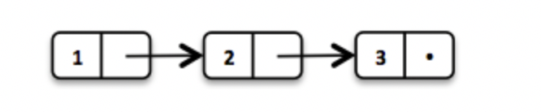
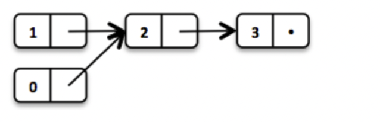
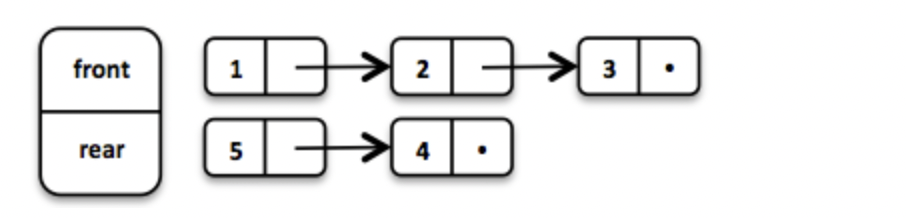
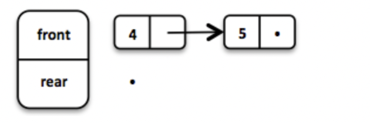
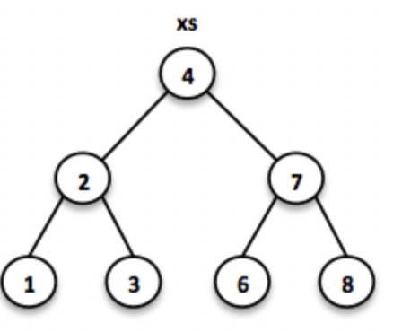
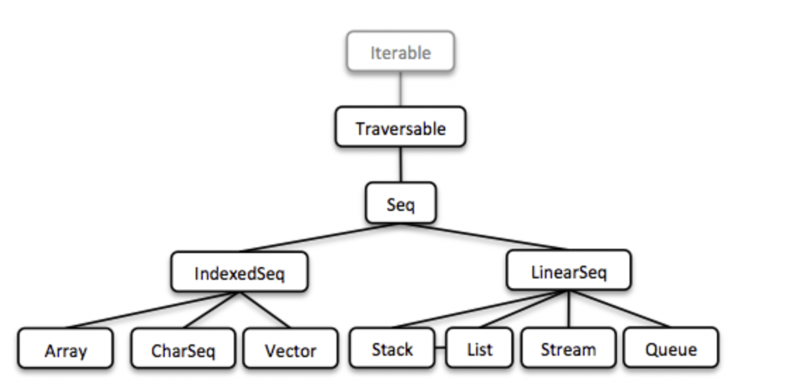
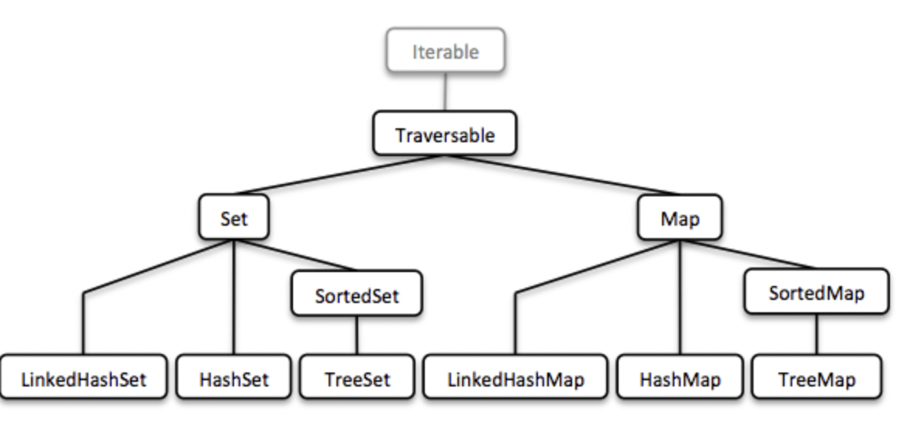
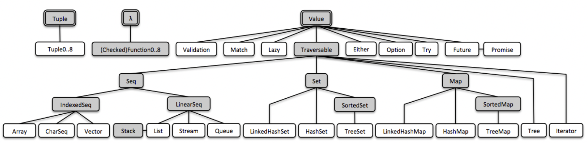

Vavr前身叫做javaslang，是一个java8+的函数库，provides persistent data types and functional control structures.
[TOC]
# introduction
## Functional Data Structures in java8 with Vavr
Java8的lambda表达式让我们可以创建完美的API，它们增强的java的表达式功能，Vavr通过lambda创建了很多机遇函数式编程的新特性，其中一个就是函数式的集合库，是替代java标准集合库的完美替代者。
## 函数式编程
在开始讲述一些最基本的数据结构前，这一节会帮助你了解下，创建Vavr与Java集合库的一些背景。
### 副作用
Java 应用程序通常有很多副作用。 它们使某种状态发生变异，也许是外部世界。 常见的副作用是更改对象或变量、打印到控制台、写入日志文件或数据库。 如果副作用以不受欢迎的方式影响我们程序的语义，则它们被认为是有害的。
例如，如果一个函数抛出一个异常并且这个异常被解释，它被认为是影响我们程序的副作用。 此外，异常就像非本地 goto 语句。 它们破坏了正常的控制流。 然而，现实世界的应用程序确实会产生副作用。
```java
int divide(int dividend, int divisor) {
    // throws if divisor is zero
    return dividend / divisor;
}
```
使用函数式的编程场景，我们更倾向把副作用（异常）压缩到一个Try中
```java
Try<Integer> divide(Integer dividend, Integer divisor) {
    return Try.of(() -> dividend / divisor);
}
```
这样，函数不会再抛出异常，我们通过Try让可能发生的失败暴漏出来。
### 引用透明度
对于一个函数，或者更普遍的表达式来说，引用透明指的是一个调用可以在不影响程序行为的情况下被它的值替换，简单来说，给出以下输入，输出是一致的
```java
// not referentially transparent
Math.random();

// referentially transparent
Math.max(1, 2);
```
如果函数中的所有的表达式都是引用透明的，那么这个函数被称为透明函数，由纯函数组成的应用程序虽然很可能在编译后才能工作，但是我们能够对此进行推理。 单元测试很容易编写，调试成为过去的遗物。
### 对值的深入认识
Rich Hickey，Clojure的创建者对值的问题做了非常伟大的讲述，他认为不可以变值是最有趣的；原因如下：
- 不可变值是线程安全的，不需要加锁;
- 是稳定的，因为equals与hashCode行为不变，是可靠的hash结构的key;
- 不需要克隆;
- 在未经检查的转换中能保证类型安全，编写更好java代码的关键就是使用透明函数与不可变值。
Vavr为了实现这些目标，提供了必要的控制与集合。
## 容器数据结构
Vavr的集合库由大量的基于lambda的函数式数据结构组成，与java原生的集合库公用的接口只有Iterable，主要的原因是，java原生集合接口的设值方法不会返回集合中的对象。
### 可变数据结构
java是一个OOP语言，我们把数据的状态封装到对象来实现数据隐藏并提供Getter/Setter方法来控制这些状态，java集合框架就是基于这个观点创建的。
```java
interface Collection<E> {
    // removes all elements from this collection
    void clear();
}
```
今天，我将 void 返回类型理解为一种气味。 这是副作用发生的证据，状态发生了突变。 共享可变状态是一个重要的失败来源，不仅在并发设置中。
### 不可变数据结构
不可变数据结构在创建后就不能变更，在java中，他们通常用于一个一个集合wrapper的角色，如下：
```java
List<String> list = Collections.unmodifiableList(otherList);

// Boom!
list.add("why not?");
```
有很多库都提供了类似这样的包装方法，作用都是返回集合的不可变的视图，传统上，调用变更方法，会抛出运行时异常。
### 一致性数据结构
一致性数据结构会保存数据的以前的版本，因此是变相的可不变，一致性数据结构允许任何版本上的变更与查询。
很多操作的变更范围都不是很大，每次都完全copy数据效率不高，为了节省时间与内存，识别版本之间相似的内容并共享相似的内容是非常重要的。
## 函数式数据结构
也可以叫做透明函数数据结构，它们都是不可变的与一致性的，函数式数据结构的方法都是引用透明的。Vavr开发了大量广泛使用的函数式数据结构，下面的例子将会深入的介绍。
### LinkedList
一个广泛使用的并且也是最简单的函数式数据结构是LinkedList，它是一个有着头节点与尾节点的列表，一个LinkedList的行为更加类似于一个Stack，定义了LIFO的一些方法。
在Vavr中，我们这样来实例化一个List
```java
// = List(1, 2, 3)
List<Integer> list1 = List.of(1, 2, 3);
```
列表中的每个元素都是一个分离的node，最后一个元素的tail是nil。
如下图

下面的操作可以让我们共享List不同版本的元素
```java
// = List(0, 2, 3)
List<Integer> list2 = list1.tail().prepend(0);
```
头节点0被链接到原始链表的头节点的尾链表的前面，原始的链表保持不变。如下图：

这个操作可以在常数的时间内完成，换句话说，这个操作不依赖链表的大小，大多数其他的操作都是线性时间完成的，在Vavr中，使用接口LinearSeq表达线性操作。
如果我们需要一些读区操作在常量时间内完成，可以使用Vavr的Array与Vector，它们都有随机存取的能力。数组类型低层使用的是java原生的数组类型，插入与删除都需要线性的时间，向量表的实现介于数组与线性表之间，它常用在大量随机存取与变更频繁的场景中。
事实上，linked list可以用来实现Queue数据结构。
### Queue
一个高效的函数式Queue可以通过2个linkedlist实现，前面的线性表持用反向入队的元素，后面的linkedlist持用正向入队的元素；2种入队操作都是常量时间的。
```java
Queue<Integer> queue = Queue.of(1, 2, 3)
                            .enqueue(4)
                            .enqueue(5);
```
Queue由3个元素初始化完成，然后2个元素进入rear线性表。

如果front链表的元素都出队了，rear链表就回反转称为新的front链表。

当元素出队时，我们得到队头元素与剩余的队列元素队列，剩余元素的队列是一个新的版本的队列，因为队列也是一种函数式数据结构，它必须是不可变的与一致性的，原始的Queue不会受到影响。
```java
Queue<Integer> queue = Queue.of(1, 2, 3);

// = (1, Queue(2, 3))
Tuple2<Integer, Queue<Integer>> dequeued =
        queue.dequeue();
```
当队列是空的，出队操作会发生什么？dequeue()会抛出一个NoSuchElementException的异常，函数式的处理方式是返回一个Optional的结果。
```java
// = Some((1, Queue()))
Queue.of(1).dequeueOption();

// = None
Queue.empty().dequeueOption();
```
optional的结果不论是否是空的都可以进一步的处理
```java
// = Queue(1)
Queue<Integer> queue = Queue.of(1);

// = Some((1, Queue()))
Option<Tuple2<Integer, Queue<Integer>>> dequeued =
        queue.dequeueOption();

// = Some(1)
Option<Integer> element = dequeued.map(Tuple2::_1);

// = Some(Queue())
Option<Queue<Integer>> remaining =
        dequeued.map(Tuple2::_2);
```
### 排序set
是比queue更频繁使用的数据结构，我们用二叉树来模拟set的操作，二叉树是由一些包含值与最多2个孩子的node组成。
我们构建一个二叉搜索树，通过Comparator比较元素的顺序，即左子树的所有的节点值\<当前节点的值，右子树的所有的值大于当前节点的值。
```java
// = TreeSet(1, 2, 3, 4, 6, 7, 8)
SortedSet<Integer> xs = TreeSet.of(6, 1, 3, 2, 4, 7, 8);
```

在这样的树上搜索会花费O(logn)的时间复杂度，我们从root开始搜索，判断是否找到了元素，因为我们知道元素的全部顺序，所以我们可以决定去左/右子树继续寻找。
```java
// = TreeSet(1, 2, 3);
SortedSet<Integer> set = TreeSet.of(2, 3, 1, 2);

// = TreeSet(3, 2, 1);
Comparator<Integer> c = (a, b) -> b - a;
SortedSet<Integer> reversed = TreeSet.of(c, 2, 3, 1, 2);
```
大多数的树操作带有固有的递归性，插入操作与搜索操作时类似的，当搜索到达终点时，就回创建一个的节点，整个路径会进行一定的重构达到平衡；
```java
// = TreeSet(1, 2, 3, 4, 5, 6, 7, 8)
SortedSet<Integer> ys = xs.add(5);
```

在vavr中，我们是使用红黑树来实现二叉搜索树的，它使用一种特殊的颜色策略来保证插入与删除后的树的平衡。
## 集合的状态
一般来说，我们观察到编程语言的演变。 好的功能会遗留下来，其他的则会慢慢消失。 但 Java 不同，它必然永远向后兼容。 这是一种力量，但也会减缓演变。
Lambda让java与scala更接近了，虽然它们目前还是有很大的不同；Martin Odersky认为java的Stream是iterator的另一种形式，java8的Stream API提升了集合的操作，Stream做的是定义一个计算单元，把这个单元关联到一个特定的结合上。
```java
// i + 1
i.prepareForAddition()
 .add(1)
 .mapBackToInteger(Mappers.toInteger())
```
这就是Java 8Stream的工作方式，它是java集合上的一个可计算层。
```java
// = ["1", "2", "3"] in Java 8
Arrays.asList(1, 2, 3)
      .stream()
      .map(Object::toString)
      .collect(Collectors.toList())
```
Vavr收到Scala的启发，
```java
// = Stream("1", "2", "3") in Vavr
Stream.of(1, 2, 3).map(Object::toString)
```
### Seq
Seq是一个接口，表示实现的集合类的元素是顺序的，连续的；上面讲的Linked List、Stream、Lazy Linked List都是Seq接口的实现类，它允许我们处理可能是无限长的元素的序列。

所有的集合都是Iterable的实现类，因为可以在的for-循环中使用。
```java
for (String s : List.of("Java", "Advent")) {
    // side effects and mutation
}
```
我们也可以通过内化的池技术与lambda来实现同样的行为
```java
List.of("Java", "Advent").forEach(s -> {
    // side effects and mutation
});
```
不论如何，正如我们前面看到的例子，我们更喜欢表达式返回结果而不是啥都没有，下面看一个简单的例子，
```java
String join(String... words) {
    StringBuilder builder = new StringBuilder();
    for(String s : words) {
        if (builder.length() > 0) {
            builder.append(", ");
        }
        builder.append(s);
    }
    return builder.toString();
}
```
函数式的表达方式是：
```java
String join(String... words) {
    return List.of(words)
               .intersperse(", ")
               .foldLeft(new StringBuilder(), StringBuilder::append)
               .toString();
}
```
使用vavr可以实现非常丰富多彩的操作，这里使用流式函数调用完成功能，还有更简单的写法：
```java
List.of(words).mkString(", ");
```
### Set与Map
序列非常重要，但是还不够完整，因为无法表达Sets与Maps，因为它们不是连续的，是基于树的。

上面我们描述了如何使用二叉搜索树来模拟Set，一个排序Map相比于排序Set的区别就是是key/value结构的，并且按照key排序。
HashMap是由HAMT实现的，HashSet是基于key-key的HashMap实现的。
我们的Map没有特殊的Entry类型来表达key-value对，我们使用了元组的概念，Tuple2类似于Entry，可以用来表达pair，元组的值是可以枚举的。
```java
// = (1, "A")
Tuple2<Integer, String> entry = Tuple.of(1, "A");

Integer key = entry._1;
String value = entry._2;
```
Vavr中大量使用了Maps与Tuples，多值的函数返回类型使用元组是必然的。
```java
// = HashMap((0, List(2, 4)), (1, List(1, 3)))
List.of(1, 2, 3, 4).groupBy(i -> i % 2);

// = List((a, 0), (b, 1), (c, 2))
List.of('a', 'b', 'c').zipWithIndex();
```
# Getting started
使用maven的方式
# 使用指南
Vavr中包含一些设计良好的基本类型，这些类型基本是java中没有的或者不太完善的，比如Tuple、Value与lambda。
在Vavr中，所有的内容主要由下面的部分组成

## 元组
java里面没有元组类型，一个元组包含固定数量的元素，这些元素被当成一个整体看待，与数组或者线性表不同，一个元组可以持有不同类型的元素，但是元组是不可变的，元组类型有Tuple1、Tuple2、Tuple3.。。。，现在最多有8元组。
### 创建元组
```java
// (Java, 8)
Tuple2<String, Integer> java8 = Tuple.of("Java", 8); 

// "Java"
String s = java8._1; 

// 8
Integer i = java8._2; 
```
### 组件映射
使用Function
```java
// (vavr, 1)
Tuple2<String, Integer> that = java8.map(
        s -> s.substring(2) + "vr",
        i -> i / 8
);
```
### 使用mapper映射
```java
// (vavr, 1)
Tuple2<String, Integer> that = java8.map(
        (s, i) -> Tuple.of(s.substring(2) + "vr", i / 8)
);
```
### 转换元组
```java
// "vavr 1"
String that = java8.apply(
        (s, i) -> s.substring(2) + "vr " + i / 8
);
```
## Functions
函数式编程就是值与值的转换，java8提供了Function与BiFunction类型，Vavr提供了0->8个参数的Function类型，名字类似于Function[n]，如果你需要一个Function抛出检查异常，可以是使用CheckedFunction[n]，下面的lambda表达式创建了一个Function，计算2个数的和
```java
// sum.apply(1, 2) = 3
Function2<Integer, Integer, Integer> sum = (a, b) -> a + b;
```
也可以使用静态的工厂方法Function3.of(....)等，从方法引用创建Function。
```java
Function3<String, String, String, String> function3 =
        Function3.of(this::methodWhichAccepts3Parameters);
```
事实上，Vavr函数式接口是java8函数式接口的变体，提供的特性有：
- 组合
- Lifting
- Currying
- Memoization
### Composition
