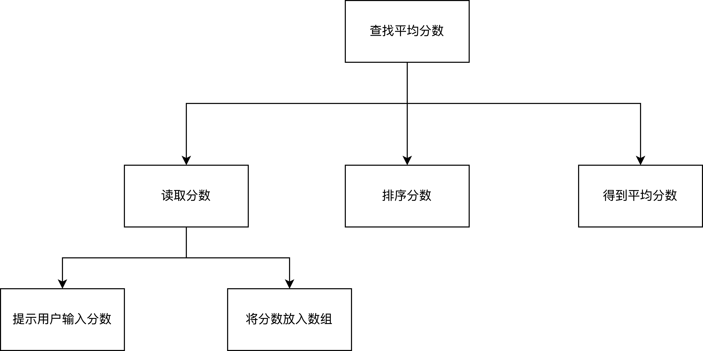
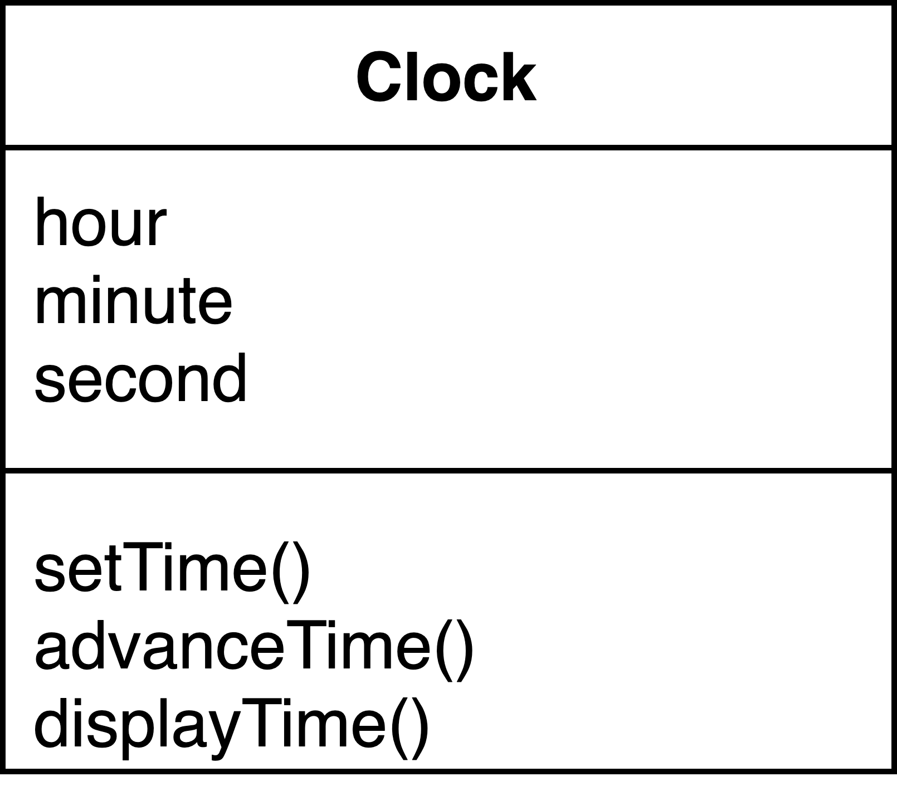
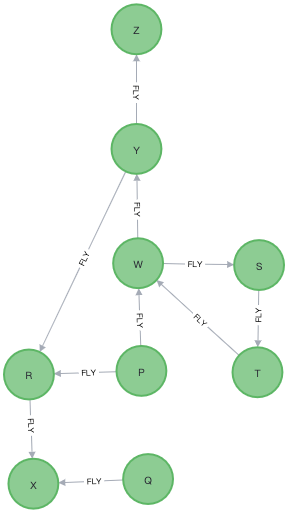
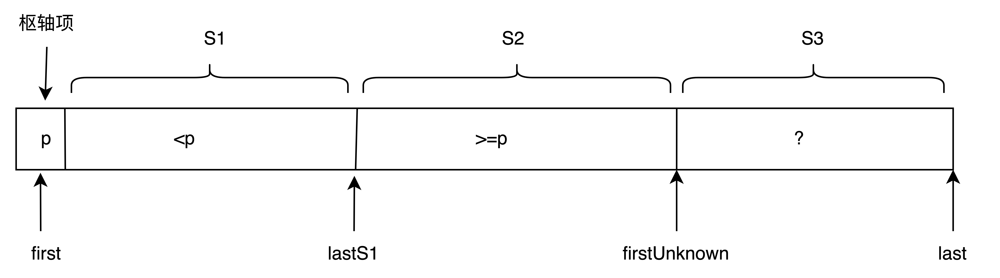
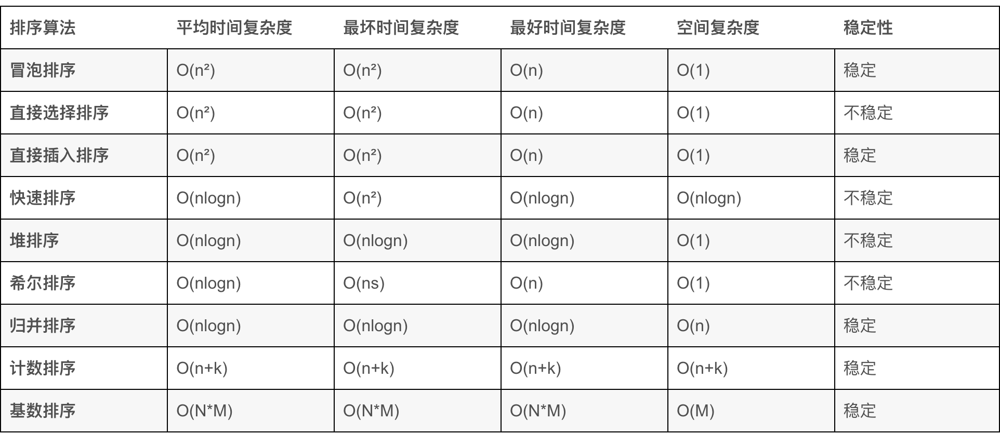

[TOC]
# 第2章 编程原理与软件工程
本章讲一些编程的基本原理，用来应对复杂的大型程序。
## 2.1 问题求解与软件工程
问题求解是指描述问题以及开发计算机程序来解决问题的整个过程，这个过程包含多个阶段，比如：理解待解决的问题，设计概念化的方案、用计算机程序设实现解决方案。
解决方案由算法与数据结构2部分组成，算法是对在有限时间内求解问题的方法的分步描述。
软件生命周期分为9个阶段。这9个阶段都以文档记录为核心。
- 第一阶段 问题描述：软件的目标，问题的所有方面。必须对最初的问题描述进行准确的定义与详细的说明；在编写软件规范时，需要回答的问题有：1.输入什么数据、2.那些数据有效、3.哪些数据无效、4.软件的使用者是谁、5.选择什么什么形式的用户界面、6.要求进行什么错误检测显示什么错误消息、7.有什么假设、8.有特例么、9.选用哪种输出形式、10.需要哪些文档记录、11.未来要对软件进行哪些改进。
- 第二阶段 设计：对规模较大或者复杂度较大的程序，需要分解问题为若干个可以控制的小问题，最终程序会包含多个模块。一个例子：移动图形到一个新的坐标，问题描述如下:
    - f方法接收一个(x,y)坐标
    - 方法将图形移到屏幕的一个新的位置
上述的初始条件与结束条件不够充分，坐标能出现什么样的值，坐标是起始点还是结束点，都没有说明。预定条件需要更详细的说明。
```c
move(x,y)
// moves a shape to coordinate (x,y) on the screen
// Precondition: the calling program provides an (x,y) pair, both integers where 0<=x<=MAX_XCOOR and 0<=y<=MAX_YCOOR where MAX_XCOOR and MAX_YCOOR are class constants that specify the maximum coordinate values
// PostCondition: the shape is moved to the (x,y)
```
编写初始条件：描述方法形参、说明常量、列出假设条件
编写结束方法：描述方法对形参的作用，说明返回值，描述已发生的其他的操作。
准确的文档记录很重要，时间推移与团队扩大，都需要文档。
- 第三阶段：风险分析，影响项目进度成本等，影响软件的生命周期。
- 第四阶段：验证
断言（assertion）是对算法中某处具体条件的描述，初始条件与结束条件是方法开始与结束的断言；
不变式（invariant）是算法中某个位置一个恒为true的条件；
循环不变式（loop invariant）算法中循环前后恒为true的一个条件。
验证算法，就是对算法的每个步骤能够得出步骤前的断言导出步骤后的断言，则步骤正确，一直到结束条件的断言正确，则算法程序正确。
有点类似于几何推理。使用循环不变式来推导迭代算法的正确性。例子，证明代码可以计算出数组前n项的和
```c
int sum = 0;
int j = 0;
while(j < n) {
    sum+=item[j];
    ++j;
}
```
每一次循环执行完，sum都是元素item[0]到item[j-1]的和，这就是一个循环不变式，对于一个循环下列情况不变式恒为true.
1. 初始化步骤之后，循环开始执行之前;
2. 再循环的每次迭代前;
3. 在循环的每次迭代后;
4. 循环终止后.

对于上面的例子有:
```c
int sum = 0;
int j = 0;
// 不变式恒为true
while(j < n) {
    // 不变式恒为true
    sum+=item[j];
    ++j;
    // 不变式恒为true
}
// 不变式恒为true
```
通过观察不变式，可以证明算法是正确的，其实就是数学归纳法。
1. 开始时不变式必为true，开始前，sum=j=0，不变式是sum包含元素item[0]到item[-1]的和，这个范围没有元素，不变式为true
2. 循环的执行必须维持不变式的值，不变式在循环的恩和迭代前为true，迭代后必为true，sum的最后一个元素是item[j-1]，估迭代前与迭代后都是true的。
3. 不变式必须证明算法的正确性，就是结束后不变式为true。结束后，j=n，sum等于元素item[0]到item[n-1]的和，所以算法正确；
4. 循环必须能够终止.

开始时，不变式是true，意味着建立了数学归纳法的基例，类似于对于自然数0，属性是true，正确循环迭代维持值是归纳步骤，类似于对于k，属性为true，则对于k+1，属性是true。结束后得出结论。
- 第五阶段：编码,编码工作不是软件生命周期的主要部分，只是相对次要的工作。
- 第六阶段：测试，使用边角值测试，使用无效的值测试.
- 第七阶段：完善解决方案，通常解决问题的最好的方法就是在解决方案的设计期间做一些简化建设，比如：假设输入是某种格式，而且其内容是正确的，之后基于这些假设开发完整的工作程序，接下来，可向程序天际复杂的输入与输出处理附加的功能与更多的错误检查。这种简化问题的方法使问题解决过程需要加入一个完善步骤。
- 第八阶段：生产,
- 第九阶段：维护

如果解决方案在软件生命周期的所有阶段引发的总成本最低，它就是一个优秀的解决方案。
## 2.2 面向对象设计
解决方案设计中确定对象的2种技术
- 抽象
- 信息隐藏

1. 过程抽象
在设计一个问题解决方案的一部分使用的一个方法时，每个方法最初表示为一个箱子，箱子指出方法做什么，但不说明如何做。每个箱子都不知道其他箱子执行的方式。只知道其他箱子完成什么任务。比如一个方法做排序，只知道可以排序，不知道具体是如何排序的。这样，解决方案的各个组件就彼此分离开来。

过程抽象分离了方法的功能与实现方式，抽象就是描述方法的功能而不实现，着眼于高级功能，不使细节影响到我们。
2. 数据抽象
数据抽象注重操作执行什么任务不考虑如何实现操作；解决方法的其他模块知道它们可以执行哪些操作，但不了解数据存储方式以及操作执行方式；数据抽象是本书的主要内容，抽象的分析数据（考虑对数据执行哪些操作而不是如何执行这些操作），定义抽象数据类型（abstract data type），ADT是指一个数据集合与这个集合上的一组操作。在问题求解的过程中，ADT支持算法，算法不是ADT的组成部分，应协作开发算法与ADT，解决问题的全局算法要给出在数据上执行的操作，操作又给出ADT以及在数据上执行操作的算法。也可能以相反的方向进行。
2种观点：
- 数据结构支持精巧的算法
- 算法支持精巧的数据结构
3. 信息隐藏
抽象过程描述外部接口，对外部隐藏细节，要确保其他模块不能改变本模块的细节；模块的使用者不需要考虑实现细节，模块的实现者不需要考虑其用法。

面向对象的设计方案的开发方式是开发组合了数据与操作的对象，表示现实的实体或者操作过程，这种面向对象的模块化方法生成具有行为的对象的集合。
封装意思就是装箱封闭，是隐藏内部细节的技术，方法封装了操作，对象封装了数据与操作。
设计模块化的解决方案的步骤：
- 标识问题中的对象，一种简单的方法是考虑问题描述中的名词与动词，名词是对象，动词是操作。类型相同的一组对象叫做类。
OOP：
1. 封装：对象组合数据与操作
2. 继承：类可从其他类中继承属性
3. 多态（有多种形式）：对象可以在执行时确定需要什么样的操作，某个对象的输出取决于执行操作的对象。

功能分解（也叫做自上而下的设计）有助于把对象中的复杂任务分解为更便于管理的目的单一的任务与子任务。功能分解的原理为：逐步细化任务以完成任务。下图是解决问题的方法的层次结构

设计问题的求解方案时，一般使用面向对象的设计（OOP）、功能分解（FD）、抽象与信息隐藏技术，下面的设计原则总结了导出模块化解决方案的方法。
- 使用OOD与FD生成模块化解决方案。协作开发抽象数据类型与算法。
- 为主要设计数据的问题使用OOD
- 使用FD为对象的操作设计算法
- 使用FD为强调算法的问题设计解决方案
- 在设计ADT与算法时，侧重做什么而不是如何做
- 考虑将以前编写的软件组件包含到设计方案中。

UML是表达面向对象设计的一种建模语言；提供了图表与文本描述规范，在表示解决方案的整体设计包括类的规范与类彼此交互的各种方式时，图表非常有效。一个解决方案通常会涉及许多类，表示类之间交互能力是UML的长处之一。类图指定了类的名称、数据成员、操作。一个简单的类图

数据成员的UML表示法 visibility  name: type=default value
visibility的值是+=public，-=private，#=protected
操作的UML表示法 visibility name (parameter list):return-type {property-string}
parameter list的语法 direction name: type=default value
面向对象的解决方案更具有普遍性，功能分解会使的比较容易实现，可以继承复用类，减少代码的数量，继承可以随便更改不影响以前的逻辑使用的父类。
## 2.3 关键编程问题
关键的编程问题
- 模块化
- 可修改
- 易用
- 防故障编程
- 风格
- 调试
1. 模块化
面向对象设计就是模块化设计，模块化方便组建大型程序，支持大型程序的调试，并且能够隔离错误；方便修改，消除冗余代码。
2. 可修改性
通过方法与命名常量来提高程序的可修改性
- 方法：将共同的操作提取为方法；
- 命令常量：将共同需要使用的常量提取为命名常量，方便变更。
3. 易用性
- 交互环境程序总应该以意图明确的方式提示用户输入数据;
- 一定要显示输入，方便用户检查数据；
- 输出有明显的标志；
4. 防故障编程
防故障程序是指无论以什么方式使用，它都能合理执行的程序。
- 防止数据输入错误
- 防止程序逻辑错误
5. 风格
- 广泛使用方法，如果一组语句多次重复执行，编写为方法;
- 使用私有数据字段，符合信息隐藏原理;
- 错误处理，检查错误，返回值或者抛出异常;
- 可读性，选择具有描述作用的标识符，通过缩进样式来增强程序的可读性；
- 文档记录，编写良好的文档，方便别人读取、使用】修改，文档的内容
  - 程序的初始注释：作用描述、作者与日期、程序输入与输出的描述、程序用法描述、所需数据类型的假设、异常描述、主要类;
  - 各个类的初始注释，声明类的作用，描述类包含的数据;
  - 各个方法的初始注释，声明方法的作用、初始条件、结束条件和调用的方法;
  - 各个方法体的注释，解释重要功能与微妙的逻辑.
6. 调试，调试埋点需要放在良好的位置，并逐步缩小范围。
- 调试方法，使用监视窗口或者System.out.println();
- 调试循环，开始与结束
- if,else,
- 使用System.out.println();
## 2.4 小结
## 2.6 自我测试题
1. 循环不变式是sum是item[0]到item[index]的和
2. 方法的uml表示法如下：+ sum(in count:int): int
## 2.7 练习题
1. effect：计算输入的美元美分扣除物品总额后的剩余美元或者美分，
    precondition：输入MAX_DOLLORx>0 x>y>0，都是浮点数，表示美元数额。
    postcondition：x-y后剩余的美元金额
2. 
    - Date plusOneDay(Date date)
    - effect desc: 计算给定日期的下一天的日期
    - precondition: Date使一个从0000-00-00开始的有效日期，表示日期
    - postcondition: 在Date的基础上+1
```java
public class Exercise2 {
    /**
     * @param date a specific day
     * @return date+1day
     */
    public LocalDate plusOneDay(final LocalDate date) {
        return date.plusDays(1);
    }
}
```
# 第3章 递归: 镜子
递归是计算机科学家使用的最强大的问题求解技术之一。
## 3.1 递归解决方案
递归是强大的问题求解技术，思想类似于自上而下将复杂的问题分解为更小的问题，而且最特殊的就是小问题与初始问题的类型完全相同。新建递归解决方案时要牢记以下4个问题
- 怎样根据同类型的更小问题来定义问题
- 各个递归调用怎样减小问题的规模
- 什么样的问题实例可以用作基例
- 随着问题规模的减小，最终能否到达基例
### 3.1.1 递归值方法：n的阶乘
箱式跟踪是跟踪递归方法的执行情况的一种系统方法。建立箱式跟踪的步骤
- 在递归方法体中标记各个递归调用，可能包含多个递归调用，使用一个独立的标记
```java
if(n == 0){
    return 1;
}else{
    return n*fact(n-1);
    // A ，递归调用后返回A点
}
```
- 执行中，使用新箱表示各个方法调用，在新箱中指示方法的局部环境;
- 绘制一个箭头，从启动递归过程的语句指向第一个箱;
- 不断生成箱子;
- 与栈一样，不断从箭头向上返回;
递归方法也存在不变式。
### 3.1.2 递归void方法
## 3.2 计数
兔子计数的问题
- 兔子产生不死
- 兔子在出生后2个月性成熟，性成熟在生命的第三个月开始
- 兔子总是雌雄配对而生，产出一对雌雄兔子
构建一个递归的方案来计算rabbit(n), 必须确定如何用rabbit(n-1)来计算rabbit(n)，rabbit(n)=n月开始前的兔子对数(rabbit(n-1))+当月产出的兔子对数，在n月初，并不是所有的的rabbit(n-1)个兔子都成熟了，只有n-2月前出生的兔子才成熟了，于是n月初产出的兔子个数是rabbit(n-2)。于是得到递归的关系是rabbit(n)=rabbit(n-1)+rabbit(n-2)。某些情况下，可以通过解决相同类型的多个更小的问题来解决初始问题。需要注意基例的问题。得到兔子的递归的定义如下:

这正好是一个斐波那契数列，java代码如下:
```java
public static int rabbit(n){
    //Computes a term in the Fibonacci sequence
    //Precondition: n is positive integer
    //PostCondition: Returns the nth Fibonacci number
    if(n<2){
        return 1;
    }else{
        return rabbit(n-1)+rabbit(n-2);
    }
```
组织游行队伍的问题，长为n的游行队伍，乐队不能相邻，有n个彩车与n个乐队，乐队-彩车，彩车-乐队是不同的排列，组织游行队伍的方法数是各排列类型的数目之和.
- P(n) 是组织长为n的排列的方法数
- F(n)是长为n，以彩车结尾的排列方法数；
- B(n)是长为n，以乐队结尾的方法数;
则P(n)=F(n)+B(n).
F(n)=P(n-1),B(n)=F(n-1)=P(n-2)，则可以得到
P(n)=P(n-1)+P(n-2).
得到的公式是：

- 可以通过分解来解决问题;
- 基例值非常重要。
Spock的困惑：访问n颗行星中的k颗，有多少中选择，不考虑访问行星的顺序。基于行星X，得到选择数
c(n,k)=包含行星X的k颗行星的组合数+不包含行星X的k颗行星的组合数
c(n,k)=c(n-1,k-1)+c(n-1,k)
若访问所有的行星那么n=k，则c(k,k)=1, 如果k=0，那么c(n,0)=1,如果k>n,c(n,k)=0，得到的公式是

## 3.3 数组查找
分而治之就是通过分解问题，处理子问题来推进算法。binarySearch方法的代码如下:
```java
public static int binarySearch(int anArray[], int first, int last, int value){
    int index;
    if(first>last){
        index=-1;
    }
    else{
        int mid=(first+last)/2;
        if(value==anArray[mid]){
            index=mid;
        }else if(value<anArray[mid]){
            // POINT X
            index=binarySearch(anArray, first, mid-1, value);
        }else{
            // POINT Y
            index=binarySearch(anArray, mid+1, last, value);
        }
    }
    return index;
}
```
二分查找的不变式是若value出现在数组中，则anArray[first]<=value<=anArray[last]。
统计学家经常需要数据集合的中值，在已排序的集合中，中值位于集合中心，未排序的数据集合中，小于中值与大于中值的值数相同。要递归的解决一个问题，应根据一个或者多个同类型的更小问题编写解决方案，更小的概念确保能够达到基例。但是查找第k个最小项的问题与之前的问题不同，它没办法根据问题的规模决定递归，而是根据元素的值决定的。递归的解决方案如下：
- 在数组中选择枢轴项(pivot item);
- 围绕枢轴项，合理排列数组项;
- 将该策略递归的用于一个数组段.
公式是

下面是伪码解决方案
```java
ksmall(in k:integer, anArray: ArrayType, in first:integer, in last:integer)
// return the kth smallest value in anArray[first...last]
choose a pivot item p fromm anArray[first...last]
partition the items of anArray[first...last] about p
if(k< pivotIndex-first+1)
    return ksmall(k,anArray,first,pivotIndex-1)
else if(k==pivotIndex-first+1)
    return p;
else return ksmall(k-(pivotIndex-first+1),anArray,pivotIndex+1,last);
```
上述问题的关键是如何选择枢轴项p以及围绕所选的p划分数组。这是快速排序的雏形。
## 3.4 组织数据
汉诺塔问题的解决方案
solveTowers(in count:integer, in source:Pole, in destination:Pole, in spare:Pole)
  if(count is 1){
      move a disk directly from source to destination
  }else{
      solveTowers(count-1, source,spare,destination);
      solveTowers(1,source,destination,spare);
      solveTowers(count-1,source,destination,spare);
  }
## 3.5 递归与效率
递归是一种强大的问题解决技术，常用于为最复杂的问题生成清晰的解决方案，易于理解与描述。递归的效率不高的2个因素：
- 与方法调用相关的开销;
- 一些递归算法的内在低效性。
只有问题没有简单的迭代解决方案递归方案才是有价值的。内在低效性与使用的求解方法有关，比如rabbit案例中，很多值被反复计算了很多次。往往迭代解决方法的效率更高，我们通常会首先想到递归方法，可以合理的转换为迭代方案，比如rabbit的迭代方案如下:
```java
public static int iterativeRabbit(int n){
    // iterative solution to the rabbit problem
    // initialize base cases
    int previous = 1;
    int current = 1;
    int next = 1;
    for(int i=3;i<=n;i++){
        next = current + previous;
        previous=current;
        current=next;
    }
    return next;
}
```
如果方法的最后一个操作是单个递归调用，称为尾递归。尾递归方法转换为迭代方式是非常方便的。
## 3.6 小结
- 递归技术通过解决相同类型的，规模更小的问题来解决问题;
- 构建递归解决方案时，需要注意以下4点:
    - 如何用相同类型的规模更小的问题来定义问题;
    - 每次递归调用怎样减少问题的规模;
    - 什么问题实例可以作为基例;
    - 随着问题规模的缩减，最终能到达基例么;
- 在构建递归解决方案时，应该假设：若递归调用的初始条件是true，则其结束条件也为true;
- 可以通过箱式跟踪递归方法的操作;
- 递归方案更容易想出来，并易于理解、描述与实现;
- 递归解决方法可以转换为迭代解决方案;
- 如果可以用迭代方法就用迭代方法.
## 3.7 自测题
# 第4章 墙
数据抽象可以增强程序的模块化.
## 4.1 抽象数据类型
模块化是增强程序可管理性的技术，组件分解、内聚、错误分离等。开发模块化程序，首先关注模块的功能是什么，不考虑其实现，这就是过程抽象。模块必须标明隐藏的信息并且保证这些信息外界无法访问，仅知道功能以及如何使用。通常问题的解决方案需要对数据进行操作，这些操作分为3类:
- 向数据集合添加数据;
- 从数据集合中删除数据;
- 提出与数据集合中的数据相关的问题;
数据抽象只关系可以对集合进行哪些操作，不关心实现；数据集合与针对这些数据的一组操作称为抽象数据类型（ADT）,有些抽象数据类型可以由编程语言直接表示，如果没法直接表示就要设计一个抽象数据类型，并用语言的一些特性实现操作。ADT并不是数据结构的别名，它们不相同: 
- ADT是指数据集合和针对这些数据的一组操作
- 数据结构是编程语言中用于存储数据集合的一种结构。
## 4.2 指定ADT
- 操作抽象;
- adt的设计应该在问题解决过程中逐步得出，下面介绍一个推演ADT的例子
1. 例子：计算给定年份中所有假日的日期，实现方案之一是查日历，以下是伪代码表示
```java
listHolidays(in year: integer)
// display the dates of all holidays in a given year
    date= date of first day of year
    while(date is before the first day of year+1){
        if(date is a holiday){
            write (date is a holiday)
        }
        date=date of next day
    }
```
该问题的数据是由年月日构成的日期，对日期数据的操作抽象有:
- 确定给定年份的第一天的日期
- 确定一个日期是否在另一个日期之前
- 确定一个是否是假日
- 确定指定日期后一天的日期.
可以定义ADT的的操作如下:
- +firstDay(in year:integer):Date {query}//return the date of the frist day of a given year
- +isBefore(in date1:Date, in date2:Date): bool {query}//
- +isHoliday(in date:Date):boolean {query}
- +nextDay(in date:Date):Date {query}
2. 例子: 约见簿，创建呢一个一年期的约见簿，上午8点到下午5点，每次30分钟。存储约见的日期、时间与性质的简单描述。定义一个ADT约见簿，数据项是约见，约见由日期、时间与目的组成，ADT的主要操作是
- 为某天、某时某目的约见
- 取消约见
- 查询给定时间是否有约见
- 确定呢给定时间约见的性质
操作如下:
- +createAppointmentBook()
- +isAppointment(in date:Date, in time:Time): boolean {query}
- +makeAppointment(in date:Date, in time:Time, in purpose: String): boolean
- +cancelAppointment(in date:Date, in time:Time): boolean
- +checkAppointment(in date:Date, in time:Time): String {query}
## 4.3 实现ADT
实现ADT时应该设计一种数据结构来表示ADT的数据，然后按照ADT操作，编写方法来访问数据，使用自上而下的方法设计ADT操作的算法，将每一次更进一步的具体描述看作对其抽象前去的实现形式，只有能使用编程语言的数据结构来表示ADT的数据这种细化过程才停止，编程语言越初级，实现级别越多。使用ADT的程序只能看到作用于数据的墙，数据的数据结构与ADT操作的实现过程都隐藏在墙后。
非面向对象的实现比如c语言，客户代码是可以随便绕过墙的，并没有严格的限制，Java等面向对象的实现因为封装、接口等机制严格限制了这种行为。
OOP编程是组件或者对象的集合，而不是操作序列，封装特性支持ADT的墙规则。
## 4.4 小结
- 数据抽象技术用于控制程序与数据结构间的交互，它在程序的数据结构周围建墙，这类似于其他模块化设计围绕程序算法建墙，使用这样的墙，可以简化程序的设计、实现、读取与修改;
- 一组数据管理操作的规范以及这些操作处理的数据值就是一个ADT;
- 对于ADT的正式数学研究采用公理系统指定ADT操作的行为;
- 只有完整定义ADT后，才能考虑如何实现ADT，为正确选择实现ADT的数据结构，要考虑ADT操作的细节，也要考虑使用操作的具体情况;
- 即使已经选择了用来实现ADT的数据结构，程序的其余部分也不应该依赖这个选择，换言之，只能通过ADT操作访问数据结构，实现过程将隐藏在ADT操作的墙之后，在Java中，未实施墙，将ADT定义为类，对使用ADT的程序隐藏ADT的实现过程;
- 对象封装数据与数据上的操作，在Java中，对象是类的实例，类是编程人员定义的数据类型;
# 第5章 链表
## 5.1 预备知识
数组不适合用来实现ADT列表，主要是由于它是定长的，而且因为物理有序，插入/删除数据需要移动数据，链表是更灵活的数据结构。
使用Java引用的ADT实现方式于数据结构都称为“基于引用”。
使用数组的方式可以使用一种变长数组的方式实现ADT列表，具体的实现方式是，当达到容量限制后，分配一个更大的数组，并复制原来数组的内容到新的数组。具体的代码如下:
```java
if (capacityIncrement == 0){
    capacity *= 2;
}else{
    capacity += capacityIncrement;
}
// now create a new array using the updated capacity value
double[] newArray = new double[capacity];
//copy the contents of the original array to the new array
for (int i = 0;i < myArray.length; i++){
    newArray[i]=myArray[i];
}
// now change th referennce to the original array to the new array
myArray=newArray;
```
java中的Vector于ArrayList都是使用这种方式实现的。
构建链表的节点定义
```java
public class Node<T extends Object> {
    
    private T item;
    
    private Node<T> next;
    
    private Node(final T item, final Node<T> next) {
        this.item = item;
        this.next = next;
    }
    
    public Node(final T item) {
        this(item, null);
    }
    
    public T getItem() {
        return item;
    }
    
    public void setItem(final T item) {
        this.item = item;
    }
    
    public Node<T> getNext() {
        return next;
    }
    
    public void setNext(final Node<T> next) {
        this.next = next;
    }
}
```
链表必须有一个head引用，要不找不到链表的其他节点。不一定基于引用来实现链表，可以使用数组来实现链表。
## 5.2 链表编程
显示链表的数据
```java
    public void display() {
        for (Node<T> curr = head; curr != null; curr = curr.getNext()) {
            System.err.println(curr.getItem());
        }
    }
```
删除链表中的节点涉及到删除中间节点与删除头节点。
```java
    public void delete(final T item) {
        Node<T> prev = null;
        Node<T> curr = head;
        while (curr != null && !Objects.equals(curr.getItem(), item)) {
            prev = curr;
            curr = curr.getNext();
        }
        if (curr != null) {
            if (prev != null) {
                // 中间节点的情况
                prev.setNext(curr.getNext());
            } else {
                //头节点的情况
                head = curr.getNext();
            }
        }
    }
```
按照index删除节点的元素
```java
    public void delete(int index) {
        Node<T> prev = null;
        Node<T> curr = head;
        while (curr != null && index-- > 0) {
            prev = curr;
            curr = curr.getNext();
        }
        if (index <= 0) {
            if (index < 0) {
                head = curr.getNext();
            } else {
                prev.setNext(curr.getNext());
            }
        }
    }
```
删除过程包含3步:
- 定位要删除的节点;
- 通过更改引用，将节点从链表中分离出来;
- 把这个节点返回给系统;

插入过程与删除过程类似，分为3个步骤:
- 确定插入位置;
- 新建一个节点，并在其中存储新数据;
- 通过更改引用，将新节点连接到链表中.
考虑有序表的情况
curr指向第一个大于newValue的节点，prev指向最后一个小与newValue的节点。查询的伪代码如下:
```java
// determine the point of insertion into a sorted linked list
// initialize prev and curr to start the traversal from the beginning of the list
prev=null;
curr=head;
// advance prev and curr as long as nenwValue>the current data item
// Loop invariant: newValue > data items in all
// holds at and before the node that prev references
while(newValue>curr.getItem()){
    prev=curr;
    curr=curr.getNext();
}
```
上述的伪代码中，当newValue大于所有的值时，curr最后一次循环是null，此时抛出空指针异常，修改如下:
```java
// determine the point of insertion into a sorted linked list
// initialize prev and curr to start the traversal from the beginning of the list
prev=null;
curr=head;
// advance prev and curr as long as nenwValue>the current data item
// Loop invariant: newValue > data items in all
// holds at and before the node that prev references
while(curr!=null&&newValue>curr.getItem()){
    prev=curr;
    curr=curr.getNext();
}
newNode.setNext(curr);
prev.setNext(newNode);
//下面的情况是链表头的情况
if(prev==null){
    head=newNode;
}
```
复用之前定义的ADT列表接口
```java
public interface ListInterface<T extends Object & Comparable<T>> {
    // list operations:
    boolean isEmpty();
    
    int size();
    
    void add(int index, T item) throws IndexOutOfBoundsException;
    
    void remove(int index) throws IndexOutOfBoundsException;
    
    T get(int index) throws IndexOutOfBoundsException;
    
    void removeAll();
}
```
基于数组与基于引用的实现的比较
基于数组的缺点：定长需要考虑ADT的最大存储个数，可能会造成空间浪费，采用变长数组也会造成空间浪费，而且复制元素比较耗时;适合列表项比较少的场景，空间浪费不严重，单节点内存少，因为下一个节点通过下标隐式得到，对特定值的访问都是O(1)时间复杂度，插入/删除节点要移动元素
基于引用的优缺点:不受长度限制，不会浪费节点空间，按需分配，访问特点节点O(n)时间复杂度，都要从头开始遍历，插入/删除节点不用移动元素。
递归方法需要头引用作为实参，不能作为类的公有成员。
## 5.3 链表的各种变体
1. 尾引用。
为了方便向链表的末尾新增元素，不需要每次都从头开始遍历，增加一个tail尾引用变量就可以了。
2. 循环链表
tail.next=head就是循环链表，前面都叫做线性链表。适合于循环访问的情况。
3. 虚拟头节点
就是在链表中head指向一个一直存在的头节点，这样，插入与删除的行为就会保持一致，不需要为第一个节点的情况做特殊考虑。
4. 双向链表
就是节点存储前驱与后继，双向链表可以做成循环双向链表。为了避免头尾节点处理的复杂性，双向链表一般都有虚拟头节点。
## 5.4 清单应用程序
## 5.6 小结
- 可以使用引用变量实现链表数据结构
- 链表中的各个引用指向链表中的下一个节点;
- 在链表中插入与删除数据的算法都涉及下列步骤：从头遍历链表，直到适当的位置，执行引用更改，改变链表结构；
- 基于数组的方式使用隐式排序方案;
- 在基于数组的实现中，可直接访问数组中的任何元素，在基于引用的实现中，必须遍历链表才能访问一个特定的节点，数组的访问时间是常量，链表的访问时间取决于节点在链表中的位置;
- 链表可以执行递归操作;
- 使用尾引用，可方便的定位链表尾，若需追加操作，者特别有用;
# 第6章 递归问题求解技术
## 回溯
一种连续猜测的组织化方法，若某种猜测行不通，则撤回，并用另一种猜测替换它，这种反向折回并试探新步骤序列的策略称为回溯（backtracking）。可以与递归操作一起来解决问题。
八皇后问题，8行8列，不能对角线，不能在同一行，同一列。使用回溯的方法解决，伪代码如下:
```java
placeQueue(in currColumn: integer)
// please queens in columns numbered currColumn through 8.
if(currColumn>8){
    the problem is solved
}else{
    while(unconsidered squares exist in currColumn and the problem is unsolved){
        determine the next square in column currColumn that
        is not under attack by a queen in an earlier column
        if( such a square exists){
            place a queen in the square
            placeQueen(currColumn+1);
            if (no queen is possible in column currColumn+1){
                remove queen from column currColumn and consider the next square in that column
            }
        }
    }
}
clear all squares on the board
if(a solution exists){
    display solution
}else{
    display message
}
```
书写的java代码如下
```java
package com.zyx.java.adt.chapter6;

/**
 * @version 1.0
 * @name: zhangyongxiang
 * @author: zhangyongxiang@baidu.com
 * @date 2022/4/21 13:04
 * @description:
 **/

public class Queens {
    // squares per row or column
    private static final int BOARD_SIZE = 8;
    
    // used to indicate an empty square
    private static final int EMPTY = 0;
    
    // used to indicate square contains a queen
    private static final int QUEEN = 1;
    
    private final int[][] board;
    
    private Queens() {
        this.board = new int[BOARD_SIZE][BOARD_SIZE];
    }
    
    /**
     * clears the board
     * Precondition: None
     * Postcondition: Sets all squares to EMPTY
     */
    public void clearBoard() {
        for (int i = 0; i < BOARD_SIZE; i++) {
            for (int j = 0; j < BOARD_SIZE; j++) {
                board[i][j] = EMPTY;
            }
        }
    }
    
    /**
     * Display the board
     * Precondition: None
     * Postcondition: board is written to standard output; zero is an EMPTY
     * square, one is
     * a square containing a queen(QUEEN)
     */
    private void displayBoard() {
        for (int i = 0; i < BOARD_SIZE; i++) {
            for (int j = 0; j < BOARD_SIZE; j++) {
                System.out.print(board[i][j] + "\t");
            }
            System.out.println();
        }
    }
    
    /**
     * Places queens in columns of the board beginning at the column specified
     * Precondition: Queens are placed correctly in columns 1 through column - 1
     * Postcondition: if a solution is found each column of th board contains
     * one queen and method return true;
     * otherwise returns false(no solution exists for a queen anywhere in column
     * specified)
     * 
     * @param column
     * @return
     */
    private boolean placeQueue(final int column) {
        if (column > BOARD_SIZE) {
            return true; // base case
        } else {
            boolean queenPlaced = false;
            int row = 1;
            while (!queenPlaced && row <= BOARD_SIZE) {
                // if square can be attacked
                if (isUnderAttack(row, column)) {
                    ++row; // consider next square in column
                } else {
                    setQueen(row, column);
                    queenPlaced = placeQueue(column + 1);
                    // if no queen is possible in next column
                    if (!queenPlaced) {
                        // backtrack: remove queen placed earlier and try next
                        // square in column
                        removeQueen(row, column);
                        ++row;
                    }
                }
            }
            return queenPlaced;
        }
    }
    
    /**
     * Removes a queen at quare indicated by row and column .
     * Precondition: None
     * Postcondition: Sets the square on the board in given row and column to
     * EMPTY
     * 
     * @param row
     * @param column
     */
    private void removeQueen(final int row, final int column) {
        board[row - 1][column - 1] = EMPTY;
    }
    
    /**
     * Sets a queen at square indicated by row and column.
     * Precondition: None
     * Postcondition: Sets the quare in the board in a given row and column to
     * QUEEN
     *
     * @param row
     * @param column
     */
    private void setQueen(final int row, final int column) {
        board[row - 1][column - 1] = QUEEN;
    }
    
    /**
     * Determines whether the square on the board at a given row and column is
     * under attack by any queens in the column 1 through column-1
     * Precondition: Each column between 1 and column-1 has a queen placed in a
     * square at a specific row.
     * None of thes queens can be attacked by any other queen.
     * Postcondition: If the designated square is under attack, return true,
     * otherwise return false.
     * 
     * @param row
     * @param column
     * @return
     */
    private boolean isUnderAttack(final int row, final int column) {
        final int boardRow = row - 1;
        final int boardColumn = column - 1;
        for (int i = 0; i < boardColumn; i++) {
            if (board[boardRow][i] == QUEEN) {
                return true;
            }
        }
        for (int i = 0; i < boardRow; i++) {
            if (board[i][boardColumn] == QUEEN) {
                return true;
            }
        }
        for (int i = 1; boardRow - i >= 0 && boardColumn - i >= 0; i++) {
            if (board[boardRow - i][boardColumn - i] == QUEEN) {
                return true;
            }
        }
        for (int i = 1; boardColumn - i >= 0
                && boardRow + i < BOARD_SIZE; i++) {
            if (board[boardRow + i][boardColumn - i] == QUEEN) {
                return true;
            }
        }
        return false;
    }
    
    public static void main(final String[] args) {
        final Queens queens = new Queens();
        queens.placeQueue(1);
        queens.displayBoard();
    }
}
```
## 定义语言
语言是字符串的集合，语法正确的Java集合的定义:
> JavaPropgrams = {字符串w: w是语法正确的Java程序}
语言不一定是指编程语言或者用于交流的语言，满足某些语法规则的字符串的集合都叫做语言，语法提出了语言的规则，大多的语法本质上都是递归的，一个好处是语法（确定字符串是否是给定语言）可以使用简洁的递归算法表示。这种算法叫做语言的识别算法。
1. 语法基础知识
- x|y表示x或者y
- xy表示x后接y，或者x·y，·被省略了，表示连接或者追加;
- <word>表示定义确定的word的任何实例
以JavaIds={w: w是一个有效的Java标识符}
有效的Java标识符以字母开头，后接0个或者多个字母或者数字，_或者$也算合法的字符。表示标识符定义的好的方法是使用语法图

或者使用文字语法表示:
> \<identifier>=\<letter>|\<identifier>\<letter>|\<identifier>\<digit>|$\<identifier>|_\<identifier>
\<letter>=a|b|...|z|A|B|...|Z
\<digit>=0|1|...|9

identifier出现在自己的定义中，所以是递归的。要确定给出的字符串w是否是JavaIds语言，识别算法：若w的长度为1且字符是字母，则w属于该语言，这个语句是基例，若w的长度大于1，w的最后一个字符是字母或者数字，且前面的字符是一个标识符，w属于该语言。伪代码如下:
```java
isId(in w:string):boolean
// returns true if w is a legal Java identifier
// otherwise returns false
if(w is of length 1){//base case
    if(w is a letter){
        return true;
    }else{
        return false;
    }
}
else if(th last character of w is a letter or a digit){
    return isId(w minus its last character);
}else{
    return false;
}
```
2. 2种简单语言
回文Palindromes={w:从左向右读与从右向左读相同}
语法的递归定义：
- w是回文
- 去掉第一个与最后一个字符的w是回文,且去掉的字符相同
基例要考虑奇偶数的情况。
回文Palindromes的语法如下:
> \<pal>=empty string|\<ch>|a\<pal>a|b\<pal>b|c\<pal>c|...|z\<pal>z
\<ch>=a|b|...|z|A|B|...|Z
识别算法的伪代码如下:
```java
isPal(in w:string):boolean
// returns true if the string w of letters is a palindrome otherwise returns false;
if(w is the empty string or w is of length 1){
    return true;
}else if(w''s first and last characters are the same letter){
    return isPal(w minus its first and last characters);
}else{
    return false;
}
```
3. 代数表达式
根据操作符所在位置的不同将代数表达式分为前、中、后缀代数表达式，完全加括号的中缀表达式通过合理的将()替换为操作符是非常方便的将中缀表达式转换为前、后缀代数表达式，前缀与后缀表达式的优点：不需要设定优先级规则、关联规则与小括号，语法简单，识别与计算表达式的算法容易编写。定义前缀代数表达式的语法为:
<前缀>=<标识符>|<操作符><前缀><前缀>
<操作符>=+｜-｜*｜/
<标识符>=a|b|...|z
可以看到是递归结构的.首先构建一个递归的值方法endPre(first,last),返回前缀表达式尾自负的索引或者如果不是前缀表达式返回-1，方法的伪代码如下:
```java
endPre(in first:integer, in last: integer)
// finds the end of a prefix expression, if one exists.
// Precondition: the substring of strExp from first through last contains no blank characters。
// Postcondition: Returns the index of the last character in strExp that begins at index first, if one exists,
// or returns -1 if no such prefix expression exists
if(first<0 or first>last){
    return -1;
}
ch=character at position first of strExp
if(ch is an identifier){
    // index of last character in simple prefix expression
    return first;
}else if(ch is an operator){
    // find the end of the first prefix expression
    firstEnd=endPre(first+1,last);
    if(firstEnd>-1){
        return endPre(firstEnd+1,last);
    }else{
        return -1;
    }
}else{
    return -1;
}
```
通过endPre确定isPre的方法的伪代码如下:
```java
isPre()
// Determines whether the string expression in this class is a prefix expression.
// Precondition: the class has a data field strExp that has been initialized with a string expression that contains no blank characters.
// Postcondition: return true if the expression is in prefix form otherwise return false.
size = length of expression strExp
lastChar = endPre(0, size - 1)
if(lastChar>=0 and lastChar == size -1 ){
    return true;
}else{
    return false;
}
```
计算前缀代数表达式的伪代码如下:
```java
evaluatePrefix(in strExp: String): float
// evaluate the prefix exprerssion strExp
// Precondition: strExp is a string consisting of a valid prefix expression containing no blanks.
// Postcondition: returns the value of the prefix expression.
ch - first character of expression strExp
delete first character of expression strExp
if(ch is an identifier){
    // base case - single identifier
    return value of the identifier;
}else{
    operand1=evaluatePrefix(strExp);
    operand2=evaluatePrefix(strExp);
    return operand1 op operand2;
}
```
定义后缀表达式的语法为:
\<后缀>=\<标识符>|\<后缀>\<后缀>\<操作符>
\<操作符>=+|-|*|/
\<标识符>=a|b|...|z
将起前缀表达式转换为后缀表达式的方法的伪代码如下:
```java
convert(in pre: string):string
// Converts a prefix expression pre to postfix form
// Precondition: The expression inn the string pre is a valid prefix expression
// PostCondition: Returns the equivalent postfix expression as a string
//check the first character of the given string
ch = first character of pre
delete first character of pre
if(ch is a lowercase letter){
    // base case - single identifier expression
    return ch as a string
}else{
    // do the conversion resursively
    postfix1=convert(pre)
    postfix2=convert(pre)
    return postfix1+postfix2+ch;
}
```
## 归纳和数学归纳法的关系
递归与数学归纳法之间存在密切关系，通过递归解决问题时，要指定一个或者多个基例的解，然后考虑如何从同类型的更小的问题的解道出任意搭戏哦问题的解。数学归纳法与此类似，通过证明基例（0或1）的属性，然后证明如果对于小与N的自然数，该属性为证真，对于任意自然数N，该属性必为真，从而证明自然数的属性。
经常用归纳来证明递归算法的正确性。
以下伪代码描述的递归算法实现的阶乘
```java
fact(in n:integer):integer
if(n is 0 ){
    return 0;
}else{
    return n*fact(n-1);
}
```
fact会下下列值
>fact(0)=0!=1 n=0
fact(n)=n!=n*(n-1)*...*1 n>0

- 基例：n=0时属性为真
现在要证明对于任意的k，属性为真，则对于k+1，属性为真
- 归纳假设：对于任意数n=k，属性为真即fact(k)=k(k-1)....1
- 归纳结论，对于n=k+1,属性为真，也就是证明fact(k+1)=(k+1)k(k-1)....1
根据fact方法定义，fact(k+1)=(k+1)*fact(k)=(k+1)k(k-1)....1， 证毕
前面介绍过汉诺塔问题的解决方案，基本算法的伪代码如下:
```java
solveTowers(in count:integer, in source:Pole, in destination:Pole, in spare:Pole)
if(count is 1){
    move a disk directly from source to destination
}else{
    solveTowers(count-1, source, spare, destination);
    solveTowers(1, source, destination, spare);
    solveTowers(count-1, spare, destination, source);
}
```
设 moves(N)是N个圆盘的移动次数，当N=1时，moves(N)=1
moves(N)=moves(N-1)+moves(1)+moves(N-1)=2<sup>N</sup>-1，下面根据数学归纳法证明这个公式
- 基例: N=1时 2<sup>1</sup>-1=1，所以属性为真，下面要证明，对于任意的数k，属性为真，那么对于k+1，属性为真。
- 归纳假设: 设对于任意的数N=k，属性为真，即moves(k)=2<sup>k</sup>-1;
- 归纳结论: 说明N=k+1属性为真，必须证明moves(k+1)=2<sup>k+1</sup>-1, 根据moves的递归关系
moves(k+1)=2moves(k)+1=2*(2<sup>k</sup>-1)+1=2<sup>k+1</sup>-1.证毕。
## 小结
- 回溯是一种解决问题的策略，涉及递归及一系列最终导出解的猜测，如果某种猜测行不通，则反向折回，替换猜测，并再次试探完成解决方案;
- 语法是定义语言的工具，语言是一个符号串集合，使用语法定义语言，经常可以构建直接基于语法的识别算法，语法通常都是递归的，因此可以简明扼要的描述大量语言;
- 代数表达式语言存在好几种，各有优劣，前缀与后缀表达式难于使用，但是语法简单，还消除了二义性。中缀表达式易于使用，但是需要括号、关联规则与优先级规则等，语法复杂;
- 数学归纳法与递归有密切的关系，可以用归纳来证明递归算法的正确性。
- 解决递归类问题的2种方案1.数学归纳法与2.循环不变式。
# 第7章 栈
栈具有后进先出的特点，栈与递归存在重要的关系。
## ADT 栈
在设计问题的解决方案时，可推演出用于解决问题的抽象数据类型的规范。
考虑打字场景\<-表示backspace就是退格。
>abcc\<-ddde\<-\<-\<-ef\<-fg

如何读取输入行并获得正确的输入，设计解决方案时，必须涉及到存储输入行的环节，先根据解决方案定义数据存储上的操作，初始的解决方案可能如下:
```java
// read the line, correcting mistake along the way
while(not end of line){
    Read a new character ch
    if(ch is not a '<-'){
        add ch to adt
    }else{
        remove from the adt the item added most recently
    }
}
```
得到ADT应该包含的操作:
- 向ADT添加新项;
- 从ADT中删除最近添加的项;
需要判断当ADT为空时，继续\<-的后果，结果就是什么也不操作,如果要倒叙展示输入的文字，则还要检索数据项
```java
// read the line, correcting mistake along the way
while(not end of line){
    Read a new character ch
    if(ch is not a '<-'){
        add ch to adt
    }else if(ADT is not empty){
        retrieve from adt the item added most recently and put it in ch
        write ch
        remove from the adt the item added most recently
    }else{
        ignore <-
    }
}
```
ADT的操作
- 确定ADT是否为空
- 从ADT中检索最近加入的项
这就是栈，栈包含的主要的操作
- 创建一个空栈
- 确定栈是否为空
- 向栈中加入新项;
- 从栈中删除最近加入的项;
- 从栈中检索最近加入的项;
- 从栈中删除所有项;
栈的伪代码表示
```java
// StackItemType is the type of the items stored in the stack
+createStack()
// create a empty stack
+isEmpty():Boolean {query}
// determines whether a stack is empty
+push(in newItem:StackItemType) throws StackException
// adds newItem to the top of the stack, throws StackException if the insertion is not successful
+pop():StackItemType throws StackException
// retrieves and then removes the top of the stack(the item that was added most recently).
// throws StackException if the deletion is not successful
+popAll()
// removes all items from the stack
+peek():StackItemType throws StackException
// retrieves the top of the stack. that is, peek retrieves the item that was added most recently.
// retrieves dose not change the stack, throws StackException if the retrieval is not successful
```
UML图就忽略了。
## ADT栈的简单应用
1. 检查括号匹配
匹配的条件
- 每遇到一个}都有前面遇到的{匹配;
- 达到字符串结尾时，各个{都有相应的匹配;
伪代码的解决方案如下:
```java
aStack.createStack();
balancedSoFar=true;
i=0;
while(balancedSoFar and i \< length of aString){
    ch=character at position i in aString
    ++i;
    // push an open brace
    if(ch is '{'){
        aStack.push('{');
    }
    // close brace
    else if(ch is '}'){
        if(!aStack.isEmpty()){
            openBrace=aStack.pop();
        }else{
            balancedSoFar=false;
        }
    }
}
if(balancedSoFar and aStack.isEmpty()){
    aString is balanced braces
}else{
    aString dose not have balanced brances;
}
```
更简单的解决方案：跟踪当前未匹配的左大括号的数目。
防故障编程: 
2. 识别语言中的字符串
识别某个字符串是否在下面的语言中
> L={w$w': w是除$外的字符串，w可能为空，w'=reverse(w)}

类似于回文，可以用栈解决下面是伪代码
```java
aStack.createStack();
// push the characters before $, that is the character in w onto the stack
i=0;
ch=character at position i in aString
while(ch is not '$'){
    aStack.push(ch)
    ++i;
    ch=character at position i in aString
}
// skip the $
++i;
// match the reverse of w
inLanguage=true;// assume string is in Language
while(inLanguage and i < length of aString>){
    ch=character at position i in aString
    try{
        stackTop=aStack.pop();
        if(stackTop equals ch){
            ++i;//characters match
        }else{
            // top of stack is not ch
            inLanguage=false;
        }
    }
    catch(StackException e){
        // aStack.pop() failed, aStack is empty(first half of string is shorter than second  half)
        inLanguage=false;
    }
}
if(inLanguage and aStack.isEmpty()){
    aString is in language
}else{
    aString is not in language;
}
```
## ADT栈的实现
定义接口规范
```java
package com.zyx.java.adt.chapter7;
public interface StackInterface<T> {
    /**
     * determines whether the stack is empty.
     * Precondition: None
     * Postcondition: Returns true if the stack is empty otherwise returns
     * false.
     * 
     * @return true or false
     */
    boolean isEmpty();
    
    /**
     * removes all the items from the stack.
     * Precondition: None
     * Postcondition: Stack is empty.
     */
    void popAll();
    
    /**
     * add an item to the top of a stack
     * Precondition: newItem is the item to be added
     * Postcondition: If insertion is successful, newItem is on the top of the
     * stack.
     * Exception: Some implementations may throw Stackexception when newItem
     * cannot be placed on the stack.
     * 
     * @param newItem
     * @throws StackException
     */
    void push(T newItem) throws StackException;
    
    /**
     * remove the top of a stack.
     * Precondition: None.
     * Postcondition: if the stack is not empty, the item that was added most
     * recently is removed from the stack and returned.
     * Exception: Throws StackException if the stack is empty.
     * 
     * @return
     * @throws StackException
     */
    T pop() throws StackException;
    
    /**
     * retrieves the top of a stack.
     * Precondition: none.
     * Postcondition: if the stack is not empty, the item that was added most
     * recently is returned. the stack ias unchanged.
     * Exception: Throws StackException if the stack is empty.
     * 
     * @return
     * @throws StackException
     */
    T peek() throws StackException;
    
}
```
1. 基于数组的实现
```java
package com.zyx.java.adt.chapter7;

/**
 * @version 1.0
 * @name: zhangyongxiang
 * @author: zhangyongxiang@baidu.com
 * @date 2022/5/26 02:02
 * @description:
 **/

public class StackArrayBased<T> implements StackInterface<T> {
    private final int MAX_STACK = 50;
    private T items[];
    private int top;
    
    public StackArrayBased() {
        items = (T[]) new Object[MAX_STACK];
        top = -1;
    }
    
    @Override
    public boolean isEmpty() {
        return top < 0;
    }
    
    @Override
    public boolean isFull() {
        return top == MAX_STACK - 1;
    }
    
    @Override
    public void popAll() {
        top = -1;
    }
    
    @Override
    public void push(final T newItem) throws StackException {
        if (!isFull()) {
            items[++top] = newItem;
        } else {
            throw new StackException("stack full");
        }
    }
    
    @Override
    public T pop() throws StackException {
        if (!isEmpty()) {
            return items[top--];
        } else {
            throw new StackException("stack empty");
        }
    }
    
    @Override
    public T peek() throws StackException {
        if (!isEmpty()) {
            return items[top];
        } else {
            throw new StackException("stack empty");
        }
    }
}
```
2. 基于引用的实现
```java
package com.zyx.java.adt.chapter7;

import com.zyx.java.adt.chapter5.Node;

/**
 * @version 1.0
 * @name: zhangyongxiang
 * @author: zhangyongxiang@baidu.com
 * @date 2022/5/26 02:14
 * @description:
 **/

public class StackReferenceBased<T extends Comparable<T>>
        implements StackInterface<T> {
    
    private Node<T> top;
    
    public StackReferenceBased() {
        top = null;
    }
    
    @Override
    public boolean isEmpty() {
        return top == null;
    }
    
    @Override
    public boolean isFull() {
        return false;
    }
    
    @Override
    public void popAll() {
        top = null;
    }
    
    @Override
    public void push(final T newItem) {
        top = new Node<>(newItem, top);
    }
    
    @Override
    public T pop() throws StackException {
        if (!isEmpty()) {
            final Node<T> temp = top;
            top = top.getNext();
            return temp.getItem();
        } else {
            throw new StackException("stack empty");
        }
    }
    
    @Override
    public T peek() throws StackException {
        if (!isEmpty()) {
            return top.getItem();
        } else {
            throw new StackException("stack empty");
        }
    }
}

```
3. 使用ADT列表的实现
```java
package com.zyx.java.adt.chapter7;

import com.zyx.java.adt.chapter5.LinkedList;
import com.zyx.java.adt.chapter5.ListInterface;

/**
 * @version 1.0
 * @name: zhangyongxiang
 * @author: zhangyongxiang@baidu.com
 * @date 2022/5/26 02:21
 * @description:
 **/

public class StackListBased<T extends Comparable<T>>
        implements StackInterface<T> {
    
    private ListInterface<T> list;
    
    public StackListBased() {
        list = new LinkedList<>();
    }
    
    @Override
    public boolean isEmpty() {
        return list.isEmpty();
    }
    
    @Override
    public boolean isFull() {
        return false;
    }
    
    @Override
    public void popAll() {
        list.removeAll();
    }
    
    @Override
    public void push(final T newItem) throws StackException {
        list.add(1, newItem);
    }
    
    @Override
    public T pop() throws StackException {
        if (!isEmpty()) {
            final T temp = list.get(1);
            list.remove(1);
            return temp;
        } else {
            throw new StackException("stack empty");
        }
    }
    
    @Override
    public T peek() throws StackException {
        if (!isEmpty()) {
            return list.get(1);
        } else {
            throw new StackException("stack empty");
        }
    }
}
```
4. 各种实现的比较
归根结底，ADT的实现都是基于数组或者基于引用。数组实现有容量限制。
## 应用: 代数表达式
1. 计算后缀表达式
ADT栈可以非常方便的解决后缀表达式，伪代码如下:
```java
for(each character ch in the string){
    if(ch is an operand){
        push value that operand ch represents onto stack
    }else{//ch is an operator named op
        //evaluate and push the result
        operand2=pop the top of the stack;
        operand1=pop the top of the stack;
        result=operand1 op operand2
        push result onto stack
    }
}
```
2. 将中缀表达式转换为后缀表达式
中缀表达式转换为后缀表达式的3个事实
- 操作数的先后顺序保持不变;
- 操作符相对于操作数只向右移；
- 删除所有小括号;
收腰任务是如何放置操作符。一种初始的方案为:
```java
initialize postfixExp to the null string
for(each character ch in the infix expression){
    switch(ch){
        case ch is an operand:
           append ch to the end of postfixExp;
           break;
        case ch is an operator:
           store ch until you know where to place it;
           break;
        case ch is '(' or ')':
           discard ch
           break;
    }
}
```
>小括号表示的含义是计算子表达式的值，忽略内部细节

考虑小括号、优先级与从左到右关联的中缀表达式的步骤
- 遇到操作数时，追加到postfixExp后面，后缀表达式操作数的顺序与在中缀表达式中一样；
- 使'('入栈;
- 遇到操作符时，若栈为空，操作符入栈，若非空，则使优先级更高的操作符出栈追加到postfixExp后面，遇到(或者优先级更低或者栈空时，停止，使新的操作符入栈，优先级相同，也要出栈，因为这是从左到右的规则;
- 遇到')'时，操作符出栈追加到postfixExp后，直到遇到匹配的'('为止；
- 到达字符串尾，将栈的剩余内容追加到postfixExp后面.
伪代码的解决方案是:
```java
initialize postfixExp to the null string
for(each character ch in the infix expression){
    switch(ch){
        case ch is an operand:
           postfixExp=postfixExp+ch
           break;
        case '(': //save '(' on stack
           aStack.push(ch);
           break;
        case ')':// pop stack until matching '('
           while(top of stack is not '('){
                postfixExp=postfixExp+aStack.pop();
           }
           openParen=aStack.pop();//remove open parenthesis
           break;
        case ch is an operator://process stack operators of greater precedence
           while(!aStack.isEmpty() and top of stack is not '(' and precedence(ch)<=precedence(top of stack)){
               postfixExp=postfixExp+aStack.pop();
           }
           aStack.push(ch);//save new operator
           break;
    }
}
// append to postfixExp the operators remaining in the stack
while(!aStack.isEmpty()){
    postfixExp=postfixExp+aStack.pop();
}
```
## 应用: 查找问题
对于每个客户请求，找出一个从始发城市到目的城市的航班，有3个文件:
- 城市名字;
- 城市名对，每对表示一个航班的始发城市和目的城市;
- 城市名对，每对表示一个始发城市到目的城市的请求;

C1->C2表示C2与C1邻接，称为有向路径，但是C1不是与C2邻接的。
1. 使用栈的非递归解决方案
开发使用穷举算法，也就是尝试没种可能的航班。也就是回溯法，深度遍历类似。就是不断折返。算法的伪代码如下:
```java
aStack.createStack();
aStack.push(originCity);// push origin city onto stack
while(a sequence of flights from the origin to the destination has not been found){
    if(you need to backtrack from the city on the top of the stack){
        temp=aStack.pop();
    }else{
        select a destination city C for s flight from the city on the top of the stack;
        aStack.push(C)
    }
}
```
while循环的不变式是`栈包含从栈底城市出发到栈顶城市的有向路径`，已经访问过的城市无序再次访问，因为有2种情况
- 可能是一个loop，那么可以忽略loop,直接访问;
- 当前访问的节点的下游路径都已经尝试过，不能到达目的地，无序再次尝试;
所以需要对访问过的节点做标记,新的算法如下:
```java
aStack.createStack();
clear marks on all cities
aStack.push(originCity);// push origin city onto stack
mark the origin as visited
while(a sequence of flights from the origin to the destination has not been found){
    if(no flights exist from the city on the top of the stack to unvisited cities){
        temp=aStack.pop();
    }else{
        select a destination city C for s flight from the city on the top of the stack;
        aStack.push(C);
        mark C as visisted;
    }
}
```
判断循环的终止条件
```java
+searchS(in originCity: city, in  destinationCity:city)
// searches for a sequence of flights from originCity to destinationCity
aStack.createStack();
clear marks on all cities
aStack.push(originCity);// push origin city onto stack
mark the origin as visited
while(!aStack().isEmpty() and destination city is not at the top of the stack){
    if(no flights exist from the city on the top of the stack to unvisited cities){
        temp=aStack.pop();
    }else{
        select a destination city C for s flight from the city on the top of the stack;
        aStack.push(C);
        mark C as visisted;
    }
}
return !aStack.isEmpty();
```
可以将航班图抽象为一个ADT，这个ADT的操作有：将数据放入航班图、插入一个城市的临接城市、显示航班图、显示所有城市的列表、显示给定城市的所有临接城市、查找出发城市到目的城市的路径等。UML表示如下:
+createFlightMap();
// creates an empty flight map
+readFlightMap(in cityFileName:string, in flightFileName:string )
// reads flight information into the flight map
+displayFlightMap() {query}
// display flight information
+displayAllCities() {query}
// displays the names of all cities that HPAir serves
+displayAdjacentCities(in aCity:City) {query}
// display all cities that are adjacent to a given city
+markVisisted(in aCity:City)
// marks a city as visited
+unvisitAll()
// clears marks on all cities
+isVisited(in aCity:City):boolean {query}
// determines whether a city was visited
+insertAdjacent(in aCity:City, in asjCity: City)
// insert a city adjacent to another city in a flight map
+getNextCity(in fromCity:City, out nextCity:City):boolean
// returns the next unvisited city, if any, that is adjacent to a given city, returns true if an unvisited adjacent city was found, false otherwise
+isPath(in originCity:City, in destinationCity:City):boolean
// determines whether a sequence of flights exists between two cities
下面的java方法使用searchS算法实现isPath，使用Map存储航班图
```java
public boolean isPath(City originCity, City destinationCity){
/**
 * determines whether a sequence of flights between two cities exists.Nonrecursive stack version.
 * Precondition: originCity and destinationCity are the origin and destination cities, respectively.
 * Postcondition: return true if originCity to desitnationCity, otherwise returns false. cities visited during the
 * search are marked as visited in th flight map.
 * implementation notes: uses a stack for the cities of a potential path. calls unvisitAll, markVisited, and getNextCity
 */
 StackReferenceBased stack=new StackReferenceBased();
 City topCity, nextCity;
 stack.push(originCity);
 markVisited(originCity);
 topCity=stack.peek();
 while(!stack.isEmpty()&&topCity.compareTo(destinationCity)!=0){
     // loop invariant: stack contains a directed path from the origin city at the bottom of the stack to the city at the top of the stack
     // find an unvisited city adjacent to the city on the top if the stack
     nextCity=getNextCity(topCity);
     if(nextCity==null){
         stack.pop();
     }else{
         stack.push(nextCity);
         markVisited(nextCity);
     }
      topCity=stack.peek();
 }
 return !stack.isEmpty();
}
```
2. 递归解决方案
```java
public boolean isPath(City originCity, City destinationCity){
    City nextCity;
    boolean done;
    markVisited(originCity);
    // base case: the destinationCity is reached
    if(originCity.compareTo(destinationCity) == 0){
        return true;
    }else{// try a flight to each unvisited city
        done=false;
        nextCity=getNextCity(originCity);
        while(nextCity!=null&&!done){
            done=isPath(nextCity,destinationCity);
            if(!done){
                nextCity=getNextCity(originCity);
            }
        }
        return done;
    }
}
```
## 栈和递归的关系
ADT栈隐含递归概念，总是可以用栈来完成递归方法的操作。
## 小结
- ADT栈有后进先出的特性;
- 栈可以非常方便的计算后缀代数表达式;
# 第8章 队列
队列先进先出，通常用于解决涉及等待的问题。
## ADT队列
队列类似于人员排队，队列的操作只在2端发生，具有FIFO特性，包含的操作
## ADT队列的简单应用
1. 读取字符串
2. 识别回文
## 实现
1. 基于引用的实现
使用线性链表，
```java
public class QueueReferenceBased<T extends Comparable<T>>
        implements QueueInterface<T> {
    
    private Node<T> lastNode;
    
    private QueueReferenceBased() {
        this.lastNode = null;
    }
    
    @Override
    public boolean isEmpty() {
        return lastNode == null;
    }
    
    @Override
    public void enqueue(final T newItem) throws QueueException {
        final Node<T> newNode = new Node<>(newItem);
        if (isEmpty()) {
            newNode.setNext(newNode);
        } else {
            newNode.setNext(lastNode.getNext());
            lastNode.setNext(newNode);
        }
        lastNode = newNode;
    }
    
    @Override
    public T dequeue() throws QueueException {
        if (!isEmpty()) {
            final Node<T> firstNode = lastNode.getNext();
            if (firstNode == lastNode) {
                lastNode = null;
            } else {
                lastNode.setNext(firstNode.getNext());
            }
            return firstNode.getItem();
        } else {
            throw new QueueException("empty queue");
        }
    }
    
    @Override
    public void dequeueAll() {
        this.lastNode = null;
    }
    
    @Override
    public T peek() throws QueueException {
        if (!isEmpty()) {
            
            return lastNode.getNext().getItem();
        } else {
            throw new QueueException("empty queue");
        }
    }
    
    public static void main(final String[] args) throws QueueException {
        final QueueInterface<Integer> queue = new QueueReferenceBased<>();
        
        for (int i = 0; i < 9; i++) {
            queue.enqueue(i);
        }
    }
}
```
2. 基于数组的实现
队列的基于数组的实现可以实现循环队列，需要有一个front与end指针。一般使用环形数组，也就是循环数组。困难时检测队列为空还是满，因为队列为空与满的状态都是一样的，都是front超过end一个位置。使用模运算完成循环队列的增加.
- 有一种办法区分就是记录队列中的项数；
- 使用full标志;
- 留一个位置用于标志位，这个位置代表队头位置，就是表示head，这个head就是一直是无效数据的，因为数据已经在最近一次操作中移走了，当(back+1)%(MAX_QUEUE+1)时，则队列满，当front==back时，队列空。
```java
public class QueueArrayBased<T> implements QueueInterface<T> {
    
    private static final int MAX_QUEUE = 50;// maximum size of queue
    
    private final Object[] items;
    
    private int front;
    private int back;
    private int count;
    
    public QueueArrayBased() {
        this.items = new Object[MAX_QUEUE];
        front = 0;
        back = MAX_QUEUE - 1;
        count = 0;
    }
    
    @Override
    public boolean isEmpty() {
        return count == 0;
    }
    
    private boolean isFull() {
        return count == MAX_QUEUE;
    }
    
    @Override
    public void enqueue(final T newItem) throws QueueException {
        if (!isFull()) {
            back = (back + 1) % MAX_QUEUE;
            items[back] = newItem;
            ++count;
        } else {
            throw new QueueException("queue is full");
        }
    }
    
    @Override
    public T dequeue() throws QueueException {
        if (!isEmpty()) {
            final T element = (T) items[front];
            front = (front + 1) % MAX_QUEUE;
            --count;
            return element;
        } else {
            throw new QueueException("queue is empty");
        }
    }
    
    @Override
    public void dequeueAll() {
        front = 0;
        back = MAX_QUEUE - 1;
        count = 0;
    }
    
    @Override
    public T peek() throws QueueException {
        if (!isEmpty()) {
            return (T) items[front];
        } else {
            throw new QueueException("queue is empty");
        }
    }
}
```
3. 使用ADT列表的实现
ADT列表可以实现队列。队列头表示元素1，队列尾表示元素list.size()+1.
```java
public class QueueListBased<T extends Comparable<T>>
        implements QueueInterface<T> {
    
    private final ListInterface<T> list;
    
    public QueueListBased() {
        list = new LinkedList<>();
    }
    
    @Override
    public boolean isEmpty() {
        return list.isEmpty();
    }
    
    @Override
    public void enqueue(final T newItem) throws QueueException {
        list.add(list.size() + 1, newItem);
    }
    
    @Override
    public T dequeue() throws QueueException {
        if (!isEmpty()) {
            final T element = list.get(1);
            list.remove(1);
            return element;
        } else {
            throw new QueueException("queue is empty");
        }
    }
    
    @Override
    public void dequeueAll() {
        list.removeAll();
    }
    
    @Override
    public T peek() throws QueueException {
        if (!isEmpty()) {
            return list.get(1);
        } else {
            throw new QueueException("queue is empty");
        }
    }
}
```
4. JCF接口Queue
JCF提供了Queue接口，继承与Collection接口，还添加了一些自己的方法:
- poll()与remove()移除队头，如果为空，poll()返回null，remove()抛出异常;
- element()与peek()检索队头，如果为空，element()抛出异常，peek()返回null;
- add()与offer()添加元素，添加失败时，add()返回未检查异常，offer()返回false;
Queue的实现有LinkedList与PriorityQueue，LinkedList用作队列实现要注意，LinkedList允许元素为null，poll返回null的时候要注意区分，确认队列的大小，最好不要有null元素。
5. 比较实现
## 基于位置的ADT概览
## 模拟应用
## 小结
- 队列操作的定义使ADT队列具有先进先出的特性;
- 队列的插入与删除操作需要高效的访问队列的2端，因此，队列的基于引用的实现使用循环链表、包含头引用与尾引用的线性链表;
- 队列的基于数组的实现存在右向移动的倾向，使得队列满了实际却不满，最好的方式是使用循环队列;
- 如果使用循环数组实现队列，需要能够判断队空还是队满，可以对队列计数、使用full标志、保持一个数组位置为标识位;
- 现实系统的模型常使用队列，特别是事件驱动的程序;
# 第9章 高级Java主题
## 继承
继承指一个类从以前的类继承属性的能力，实际是类之间的关系，通过继承，定义新类时可以重用已经开发的软件组件，不能直接访问超类的私有成员，Java有4中访问修饰符级别，代表不同的访问权限。类有2种基本的关系:
- is-a, 继承就是is-a的关系， 可以用子类实例替换超类实例，这是完全兼容的;
- has-a, 包含关系。
## 动态绑定与抽象类
多态性就是根据实际运行对象决定行为而不是编译时确定，也叫做动态绑定。
## ADT列表与有序表
## Java范型
基本类型不能作为范型类型的参数，范型类型不能实例化数组。？代表未知的类型，是作为范型通配符存在的。注意extends与super的区别，以及结合?的使用.
## 迭代器
迭代器是一个可以访问对象集合的对象，当是每次只访问一个对象，迭代器遍历对象集合中的每个对象。
## 小结
- 类可以有超类也可以有子类，子类继承前面定义的超类的所有成员，但是只能访问公有与受保护的成员，子类只能通过超类的方法访问私有成员，类与子类的方法都可以访问受保护的成员;
- 在继承时，超类的公有与受保护成员依然是子类的公有与受保护成员，这样的子类与超类兼容，可使用超类的地方就可以使用子类的实例，超类与子类之间存在is-a关系;
- 如果子类的方法与超类的方法具有相同的参数声明，则子类的方法重写超类的方法，若超类将一个方法声明为final，则不能重写;
- 类的抽象方法可以在子类中实现;
# 第10章 算法的效率与排序
在计算机科学的高级主题中，分析算法的基本数学技术占重要位置，可用来规范的证明一个算法优于另一个算法.
## 确定算法的效率
需要在算法的效率与可维护性方面取得平衡，算法分析是用来比较不同解决方法的效率的工具，算法的效率在解决方案的总成本中占支配地位，算法的效率主要看时间与空间占用，时间效率是重点。时间效率的比较:
- 应独立于代码实现;
- 独立于运行的计算机;
- 独立于使用的数据
1. 算法的执行时间
算法的执行时间与它所需要的操作次数有关，统计算法的操作次数是估算算法效率的方式。
2. 算法增率
算法的时间要求按照规模比例变化，称为增率（growth rate），这种方式独立于计算机与代码实现等因素，可用于客观的评估算法的优劣。
3. 数量阶分析和大$O$表示法
如果算法A需要的时间与$f(n)$成正比，则称$f(n)$阶，表示为$O(f(n))$，函数$f(n)$称为算法的增率函数(growth-rate function)，该表示法使用大写字母$O$来表示阶(order)，故称为大$O$表示法，若规模为$n$的问题需要的时间与$n$成正比，则问题表示为$O(n)$。若存在常量$k$与$n_0$，使算法A在解决问题规模$ n\geq {n}_{0} $的问题时，需要的时间单元不大于$k*f(n)$，则算法A为$f(n)$阶，表示为$O(f(n))$。
常见增率函数按增速排列:
$$ O(1)<O({log}_{2}n)<O(n)<O(n*{log}_{2}n)<O({n}^{2})<O({n}^{3})<O({2}^{n}) $$
- $O(1)$, 问题的时间要求恒定不变，不受问题规模n的影响
- $O(log_2n)$，问题的规模增加时，对算法的时间要求将缓慢增加
- $O(n)$，随问题规模的增加而增加
- $O(n*log_2n)$，比线性的快
- $O(n^2)$，随问题规模的增加而快速的增加，通常是2个循环这种;
- $O(n^3)$，比上面的·更快
- $O(2^n)$，穷举法，增长速率快

对大问题，算法的效率主要由增率决定。
- 可忽略算法增率函数的低阶项;
- 可忽略算法增率函数中的高阶项的倍数常量;
- $O(f(n)) + O(g(n))=O(f(n)+g(n))$ 可组合增率函数

问题的规模相同，可能问题不同，时间要不同，算法分最坏情况与平均情况。
- 最坏情况分析(worst-case analysis)
- 平均情况分析(average-case ananlysis)

4. 正确分析问题
最适当的ADT实现主要取决于应用程序执行操作的频率。只有在问题规模足够大的情况下，算法的增率才有意义，规模小，随便哪种实现都差不多。算法要在执行时间要求与存储空间要求之间做权衡，只考虑效率的显著的差别，

5. 查找算法的效率

## 排序算法及其效率
排序是指按升序或降序组织数据集合的过程，算法分2类:
- 内部排序，数据集合全部在内存中
- 外部排序，不全在内存中

### 选择排序
类似于扑克牌排序过程，查找剩余元素的最大项与最后一个元素交换，然后递归处理剩余的未排序的元素。直到最后剩余一个元素就不需要处理了。
java代码如下:
```java
/**
     * sorts the items in an array into ascending order.
     * Precondition: theArray is an array of n items
     * Postcondition: theArray is sorted into ascending order.
     * 
     * @param theArray
     * @param n
     * @param <T>
     */
    public static <T> void selectionSort(final Comparable<T>[] theArray,
            final int n) {
        for (int last = n - 1; last >= 1; last--) {
            final int largest = indexOfLargest(theArray, last);
            final Comparable<T> tmp = theArray[largest];
            theArray[largest] = theArray[largest];
            theArray[largest] = tmp;
        }
    }
    
    /**
     * Finds the largest item in an array
     * Precondition: theArray is an array of size items
     * size>=1
     * 
     * @param theArray
     * @param maxIndex
     * @return
     * @param <T>
     */
    private static <T> int indexOfLargest(final Comparable<T>[] theArray,
            final int maxIndex) {
        int largest = 0;
        for (int index = largest; index <= maxIndex; index++) {
            if (theArray[index].compareTo((T) theArray[largest]) > 0) {
                largest = index;
            }
        }
        return largest;
    }
```
选择排序的增率函数是$O(n^2)$，排序算法中的基本操作室比较、交换与移动元素，考虑这3种操作的次数，因为Java是引用的方式，所以只有比较操作的成本最好，移动与交换成本不高，不依赖数据肚饿初始的顺序，只适用较小的n值。
### 冒泡排序
冒泡排序比较相邻项，若为逆序就交换它们。代码如下:
```java
    /**
     * sorts the items in an array into ascending order.
     * Precondition: theArray is an array of n items
     * Postcondition: theArray is sorted into ascending order.
     * 
     * @param theArray
     * @param n
     * @param <T>
     */
    public static <T> void bubbleSort(final Comparable<T>[] theArray,
            final int n) {
        
        boolean sorted = false;
        
        for (int pass = 1; pass < n && !sorted; pass++) {
            sorted = true;
            for (int index = 0; index < n - pass; index++) {
                final int nextIndex = index + 1;
                if (theArray[index].compareTo((T) theArray[nextIndex]) > 0) {
                    swap(theArray, index, nextIndex);
                    sorted = false;
                }
            }
        }
    }
```
冒泡排序最坏情况下是$O(n^2)$时间复杂度，最好情况下就是已经有序，此时执行$n-1$次比较，时间复杂度是$O(n)$.
### 插入排序
插入排序将数据分为已排序区域与未排序区域，每次从未排序区域取出一个值放到已排序的区域，直到未排序区域的元素为空，第一次时theArray[0]就是已排序区域了，因为只有一个元素。代码实现如下：
```java
    /**
     * sorts the items in an array into ascending order.
     * Precondition: theArray is an array of n items
     * Postcondition: theArray is sorted into ascending order.
     *
     * @param theArray
     * @param n
     * @param <T>
     */
    public static <T> void insertionSort(final Comparable<T>[] theArray,
            final int n) {
        for (int unsorted = 1; unsorted < n; unsorted++) {
            final Comparable<T> nextItem = theArray[unsorted];
            int loc = unsorted;
            while (loc > 0 && nextItem.compareTo((T) theArray[loc - 1]) < 0) {
                theArray[loc] = theArray[loc - 1];
                loc--;
            }
            theArray[loc] = nextItem;
        }
    }
    
```
插入排序的阶是$O(n^2)$。对于小于25个项的数组，插入排序简单易行，超过这个数，增率比较大。
### 归并排序
归并排序与快速排序是2种重要的分而治之排序算法。归并排序也适用于外部文件。归并排序是一种递归排序算法。无论原始顺序如何，归并排序性能不变，将数据一分为2，2个子数组排序，排好后，通过临时数组的方式将2个子数组合并。归并排序的伪代码如下:
```java
+mergeSort(inout theArray: itemArray, in first:integer, in last:integer)
// sorts theArray[first...last] by 
// 1. sorting the first half of the array
// 2. sorting the second half of the array
// 3. merging the two sorted halves
if(first<last){
    mid=(first+last)/2
    mergesort(theArray, first, mid)
    mergesort(theArray, mid+1, last)
    merge(theArray, first, mid last)
}
```
java代码如下:
```java
    /**
     * merges two sorted array segments theArray[first...mid] and
     * theArray[mid+1...last] into one sorted array.
     * Precondition: first<=mid<=last. the subarrays theArray[first...mid] and
     * theArray[mid+1...last]
     * are each sorted in increasing order.
     * Postcondition: theArray[first...last] is sorted.
     * Implementation note: This method merges the two subarrays
     * into a temporary array and copies the result into the original arrat
     * anArray.
     * 
     * @param theArray
     * @param first
     * @param mid
     * @param last
     * @param <T>
     */
    private static <T> void merge(final Comparable<T>[] theArray,
            final int first, final int mid, final int last) {
        final Comparable<T>[] tempArray = new Comparable[theArray.length];
        int first1 = first;
        final int last1 = mid;
        int first2 = mid + 1;
        final int last2 = last;
        int index = first1;
        while (first1 <= last1 && first2 <= last2) {
            if (theArray[first1].compareTo((T) theArray[first2]) <= 0) {
                tempArray[index++] = theArray[first1++];
            } else {
                tempArray[index++] = theArray[first2++];
            }
        }
        while (first1 <= last1) {
            tempArray[index++] = theArray[first1++];
        }
        while (first2 <= last2) {
            tempArray[index++] = theArray[first2++];
        }
        for (index = first; index <= last; index++) {
            theArray[index] = tempArray[index];
        }
    }
    
    /**
     * sorts the items in an array into ascending order
     * Precondition: theArray[first...last] is an array
     * Postcondition: theArray[first...last] is sorted in ascending order
     * 
     * @param theArray
     * @param first
     * @param last
     * @param <T>
     */
    private static <T> void mergeSort(final Comparable<T>[] theArray,
            final int first, final int last) {
        if (first < last) {
            final int mid = (first + last) / 2;
            mergeSort(theArray, first, mid);
            mergeSort(theArray, mid + 1, last);
            merge(theArray, first, mid, last);
        }
    }
```
归并排序的时间复杂度是$O(n{log}_{2}n)$。
### 快速排序
快速排序的重点就是枢轴项，左侧都小于枢轴项，右侧的都大于枢轴项，快速排序的算法伪代码如下:
```java
+quicksort(inout theArray: ItemArray, in first: integer, in last: integer){
    // sorts theArray[first...last]
    if(first<last>){
        choose a pivot item p from theArray[first...last]
        Partition the items of theArray[first...last]
        quicksort(theArray,first,pivot-1);
        quicksort(theArray,pivot+1,last);
    }
}
```
与第三章介绍的查找第$k$个最小整数问题的伪代码比较如下:
```java
+kSmall(in k:integer,in theArray: ItemArray, in first: integer, in last: integer){
    // returns the kth smallest value in theArray[first...last]
    choose a pivot item p from theArray[first...last]
    Partition the items of theArray[first...last]
    if(k<pivotIndex - first + 1){
        return kSmall(k,theArray,first, pivotIndex-1)
    }else if(k == pivotIndex - first + 1){
        return p;
    }else {
        return kkSmall(k-(pivotIndex-first+1), theArray, pivotIndex+1,last);
    }
}
```
围绕枢轴项划分数组是难点所在，选择theArray[first]作为数组的枢轴项，且定义$S_1$是小于枢轴项的集合，$S_2$是大于等于枢轴项的集合，定义数组的索引first、lastS1、firstUnknown与last通过这些索引划分数组，分成$S_1$、$S_2$与未处理的区域。如下图:

在整个划分的过程中
> 区域S1的项都是小与枢轴项，区域S2的项都大于等于枢轴项

为了使不变式在开始执行时为真，需要设置索引的形式如下:
> lastS1=first
> firstUnknown=first+1

划分算法的每个步骤都分析未知区域的一项，确定它是属于$S_1$还是$S_2$，下面是划分算法的伪代码:
```java
+partition(inout theArray: ItemArray, in first:integer, in last: integer){
    // returns the index of the pivot element after partitioning theArray[first...last]
    // initialize
    Choose the pivot and swap it with theArrayp[first]
    p=theArray[first];// p is the pivot
    lastS1=first;// set S1 and S2 empty
    firstUnknown=first+1; // set unkown region to theArray[first+1...last]
    // determine the region S1 and S2
    while(firstUnknown<=last){
        // consider the placement of the leftmost item in the unkown region
        if(theArray[firstUnknown]<p){
            move theArray[firstUnkown] into S1
        }else{
            move theArray[firstUnkown] into S2
        }
    }
    place pivot in proper position between S1 and S2, and mark its new location
    swap theArray[first] with theArray[lastS1]
    return lastS1;// the index of the pivot element
}
```
考虑算法的2种操作
1. 将theArray[firstUnkown]移入S1
S2在S1与未知区域之间，可以体通过移动元素的方式实现，讲S2的第一项theArray[lastS1+1]与theArray[firstUnkown]交换，使lastS1加1，theArray[firstUnkown]的项位于S1的最右端，使firstUnkown加1，那么之前S2最左端的成员就会变成S2最右端的成员。

2. 将theArray[firstUnkown]移入S2
因为S2与未知区域相邻，所以firstUnknown+1即可。

最后，lastS1是S1最右端，交换theArray[first]与theArray[lastS1]并返回lastS1，此时枢轴项放入正确的位置。

用上面的不变式证明划分算法的正确性，需要4个步骤:
- 循环开始执行前，不变式必为true，因为S1与S2都是空的，所以不变式为true;
- 循环的执行，不变式必为true，即要说明若不变式在执行循环的任一迭代前为true，则迭代后必为true。划分算法中循环的每次迭代都根据某一项是否小于枢轴项从而将该项从未知区域移到S1与S2，移动前为true，则移动后也是true;
- 不变式必须证明算法的正确性，即要说明，若循环终止时不变式为true，则算法正确，划分算法中终止条件是未知区域为空，如果位置区域为空，则数组项要么在S1中要么在S2中，划分算法完成任务;
- 循环必须终止，即要说明循环经经过有限次的迭代后终止，划分算法中，每次迭代位置区域-1，因此循环会终止.

下面的Java方法实现了快速排序
```java
 
    /**
     * choose a pivot for quicksort's partition algorithm and swaps it with the
     * first item in an array
     * Precondition: theArray is an array
     * Postcontion: theArray[first] is the pivot
     * 
     * @param theArray
     * @param first
     * @param last
     * @param <T>
     */
    private static <T> void choosePivot(final Comparable<T>[] theArray,
            final int first, final int last) {}
    
    /**
     * partitions an array for quicksort
     * Precondition: theArray[first...last] is an array, first<=last
     * Postcondition: returns the index of the pivot element of
     * theArray[first...last]
     * Upon completion of the method, this will be the index value lastS1 such
     * that
     * S1=theArray[first...lastS1-1]<pivot
     * theArray[lastS1]==pivot
     * S2=theArray[lastS1+1...last]>=pivot
     * 
     * @param theArray
     * @param first
     * @param last
     * @return
     * @param <T>
     */
    private static <T> int partition(final Comparable<T>[] theArray,
            final int first, final int last) {
        Comparable<T> tempItem;
        // place pivot in theArray[first]
        choosePivot(theArray, first, last);
        final Comparable<T> pivot = theArray[first];
        // initially everything but pivot is in unknown
        int lastS1 = first;// index of last item of S1
        // move one item at a time until unknown region is empty, firstUnknown
        // is the index of first item in unknown region
        for (int firstUnknown = first
                + 1; firstUnknown <= last; firstUnknown++) {
            // invariant: theArray[first...lastS1-1]<pivot
            // theArray[lastS1+1...last]>=pivot
            // move item from unknown to proper region
            if (theArray[firstUnknown].compareTo((T) pivot) < 0) {
                lastS1++;
                swap(theArray, firstUnknown, lastS1);
            }
        }
        swap(theArray, first, lastS1);
        
        return lastS1;
    }
    
    /**
     * Sorts the items in an array into ascending order
     * Precondition: theArray[first...last] is an array
     * Postcondition: theArray[first...last] is sorted
     * 
     * @param theArray
     * @param first
     * @param last
     * @param <T>
     */
    private static <T> void quicksort(final Comparable<T>[] theArray,
            final int first, final int last) {
        final int pivotIndex;
        if (first < last) {
            pivotIndex = partition(theArray, first, last);
            quicksort(theArray, first, pivotIndex - 1);
            quicksort(theArray, pivotIndex + 1, last);
        }
    }
```
在最坏情况下，也就是有序的情况下，快排是$O(n^2)$阶的，除非数组已经有序，否则快排总是最优的。
### 基数排序
radix sort，一个简单的例子就是：给一个扑克牌排序，首先将相同的排面值分到一组，一共13组，A，2，3...
然后按面值将每组排好序，然后每次取出一张分到4种纸牌花色中，这样，最终排序是按照花色与大小排序的。
这个书没有做过多的介绍。

各种排序算法的时间比较如下:


排序算法是否稳定关系是否支持第二次排序。
## 小结
- 数量阶分析和大$O$表示法度量算法的时间要求，算法的时间要求可以使用增率函数，变成一个问题规模的函数，使用这种办法可以不考虑无法控制的计算机速度和编程技巧等因素来分析算法的效率;
- 在问题规模较大的情况下，通过分析增率函数来比较算法的效率，只有增率函数的显著差异才有意义;
- 最坏情况分析考虑的是，对于指定规模的问题，算法需要的最大工作量，而平均情况分析考虑的是算法需要的预期工作量;
- 选择排序、冒泡排序、插入排序都是$O(n_2)$阶算法；
- 快速排序与归并排序是2种非常有效的递归排序算法，在平均情况下，快速排序是已知最快的排序算法，但是在最坏情况下比归并排序慢，归并排序在所有情况下的性能都是一致的，但是归并排序需要额外的空间;
- 一般的，不应仅通过研究某个实现的运行时间来分析算法，运行时间受多种因素的影响，如编程风格、计算机和应用于程序运行的数据;
- 在比较各种解决方案的效率时，要着眼于显著的区别，这个规则与计算机程序的多维成本相符;
- 使用大$O$表示法的时候要记住，$O(f(n))$表示一个不等量，它不是函数，只是一种表示方法，意指是$f(n)$阶
- 如果问题的规模很小，不必做过多的分析，应将着眼点放在算法的简单性上;

# 第11章 树
线性ADT的主要操作如下:
- 讲数据插入到数据集合中;
- 从数据集合中删除数据;
- 从数据集合中查询数据

ADT列表、栈、队列都是面向位置的，栈与队列对位置坐了特殊的限制，比如栈是只能在一端操作，队列只能在2端操作，有序表是面向值的。
## 术语
树可以用来表示关系，树本质上有层次的，存在根节点、父子节点、叶节点的定义。节点之间的父子关系归为祖先(ancestor)与子孙(descendant)关系，树的根是树中每个节点的祖先，子树是树的一个节点加上该节点的所有子孙，因为树本质上体现了层次结构可以表示具有层次特性的信息。
树的定义：
树是一个或者多个节点的集合。它的定义是递归的，
- 单个根节点是一个树;
- 由已存在的树作为子树来构成的更大的树

二叉树是特殊的一般树，它的定义如下: 就是规定节点的子树最多有2个，子树可以为空.
二叉查找树是一个按节点值排序的二叉树，对于各个节点$n$，二叉查找树满足3个属性:
- $n$的值大于左子树$T_L$中所有节点的值;
- $n$的值小于右子树$T_R$中所有节点的值;
- $T_L$与$T_R$都是二叉查找树;

树的高度的定义: 根节点到叶节点最长路径上的节点数。还可以使用级别的方式定义树的高度:
- 若$n$是$T$的根，则$n$在第1级
- 若$n$不是$T$的根，则$n$的级别比其父节点的级别高1;

树的高度是一个递归定义$$height(T)=1+max{height(T_L), height(T_R)}$$
满二叉树，就是完整的所有节点的二叉树，它的递归定义如下:
- 若$T$为空，则$T$是高度为0的满二叉树;
- 若$T$非空，且高度$h$>0，若根的2个子树都存在且都是高度$h-1$的满二叉树，则$T$是满二叉树;

完全二叉树，就是按层次不会遍历，不会出现中间节点缺失的二叉树，满二叉树也是完全二叉树。二叉树的任意一个节点的2个子树的高度差<=1，则是平衡二叉树也叫做高度平衡二叉树。
## ADT二叉树
所有二叉树都要实现的公共操作:
- 构建一颗空二叉树;
- 根据给定元素构建一颗单节点二叉树;
- 从二叉树中删除所有节点，使其为空;
- 确定二叉树是否为空;
- 确定哪个数据是二叉树的根;
- 为二叉树的根设置数据

除了以上的基本操作外，还需要一些额外的操作，总的操作如下:

- +createBinaryTree()// creates an empty binary tree
- +createBinaryTree(in rootItem: TreeItemType)// create a one-node binary tree whose root contains rootItem
- +makeEmpty()// removes all of the nodes from a binary tree, leaving an empty tree
- +isEmpty(): boolean {query} //determines whether a binary tree is empty
- +getRootItem(): TreeItemType throws TreeException {query}// retrieves the data item in the root of a nonempty binary tree, throws TreeException if the tree is empty
- +setRootItem(in rootItem: TreeItemType) throws UnsupportedOperationTreeException// sets the data item in the root of a binary tree, throws UnsupportedOperationTreeException if the method is not implemented.
- +createBinaryTree(in rootItem: TreeItemType, in leftTree: BinaryTree, in rightTree: BinaryTree)//creates a binary tree whose root contains rootItem and has leftTree and rightTree, respectively, as its left and right subtrees.
- +setRootData(in newItem: TreeItemType) //replace the data item in the root of a binary tree with newItem, if the tree is not empty, however, if the tree is empty, creates  a root node whose data item is newItem and inserts the new node into the tree.
- +attachLeft(in newItem: TreeItemType) throws TreeException // attaches a left child containing newItem to the root of a binary tree, Throws TreeException if the binary tree is empty (no root to attach to) or a left subtree already exists (should explicitly detach it first)
- +attachRight(in newItem: TreeItemType) throws TreeException // attaches a right child containing newItem to the root of a binary tree, Throws TreeException if the binary tree is empty (no root to attach to) or a right subtree already exists (should explicitly detach it first)
- +attachLeftSubtree(in leftTree: BinaryTree) throws TreeException // attaches leftTree as the left subtree of the root of a binary tree and makes leftTree empty so that it cannot be used as a reference into this tree, Throws TreeException if the binary tree is empty (no root to attach to) or a left subtree already exists (should explicitly detach it first)
- +attachRightSubtree(in rightTree: BinaryTree) throws TreeException // attaches rightTree as the right subtree of the root of a binary tree and makes leftTree empty so that it cannot be used as a reference into this tree, Throws TreeException if the binary tree is empty (no root to attach to) or a left subtree already exists (should explicitly detach it first)
- +detachLeftSubtree(): BinaryTree throws TreeException// detaches and returns the left subtree of a bianry tree's root throws TreeException if the binary tree is empty(no root node to detach from)
- +detachRightSubtree(): BinaryTree throws TreeException// detaches and returns the right subtree of a bianry tree's root throws TreeException if the binary tree is empty(no root node to detach from)

二叉树的遍历访问树中每一个节点，根据二叉树的递归特性可以设计递归遍历算法，形式为：
```java
+traverse(in binTree: BinaryTree)
// traverses the binary tree binTree
if(binTree is not empty){
    traverse(Left subtree of binTree's root);
    traverse(Right subtree of binTree's root);
}
```
根据访问根节点的顺序，定义了preorder、inorder、postorder3种遍历方式，如果二叉树对应代数表达式，则3种遍历方式分别对应前缀、中缀与后缀表达式。

二叉树有3种表示方式：
1. 使用数组表示二叉树
若使用Java类来定义树的节点，可以通过树节点的数组表示二叉树，节点包含数据部分与2个索引，比如下面的Java代码:
```java
@Data
public class TreeNode<T> {
    private T item;
    // 若没有左子节点，则=-1
    private int leftChild;
    // 若没有右子节点，则=-1
    private int rightChild;
}
public abstract class BinaryTreeArrayBased<T> {
    protected final int MAX_NODES = 100;
    
    protected ArrayList<TreeNode<T>> tree;
    // 树根在数组tree内的索引，若树为空=-1，
    protected int root;
    
    protected int free;
}
```
插入与删除操作会使树发生变化，故节点可能不是数组的连续元素，该实现要求建立一个可用节点列表，即空闲表(free list)，要将新节点插入树中，首先从空闲列表中获得一个可用的节点，要从树中删除一个节点，则将其放入空闲列表，以便后面重用该节点，free变量是空闲列表中第一个节点的索引，空闲表中各个节点的rightChild字段是空闲表中下一节点的索引。
2. 使用数组表示完全二叉树
完全二叉树使用标准分级方案对节点编号，根节点的编号是1，按照层次从左到右分别递增编号，按照编号将节点放入数组$tree$中，$tree[i]$包含编号$i$的节点，根据编号的规则，则$tree[i]$的左子节点的编号是$tree[2i+1]$,右子节点的编号是$[2i+2]$, 父节点的编号是$tree[(i-1)/2]$，必须是完全二叉树才可以;
3. 基于引用的表示
Java引用来链接树的节点，代码如下:
```java
@Data
class TreeNode<T> {
    private T item;
    private TreeNode<T> leftChild;
    private TreeNode<T> rightChild;
}
```
二叉树基于引用表示的实现:
首先定义二叉树基类如下:
```java
@Data
class TreeNode<T> {
    private T item;
    
    private TreeNode<T> leftChild;
    
    private TreeNode<T> rightChild;
    
    public TreeNode(final T item) {
        this(item, null, null);
    }
    
    private TreeNode(final T item, final TreeNode<T> leftChild,
                     final TreeNode<T> rightChild) {
        this.item = item;
        this.leftChild = leftChild;
        this.rightChild = rightChild;
    }
}
```
接下来定义二叉树抽象类的共同操作:
```java
public abstract class BinaryTreeBasis<T> {
    
    private TreeNode<T> root;
    
    public BinaryTreeBasis() {}
    
    private BinaryTreeBasis(final T rootItem) {
        this.root = new TreeNode<>(rootItem);
    }
    
    public boolean isEmpty() {
        return root == null;
    }
    
    public void makeEmpty() {
        root = null;
    }
    
    public T getRootItem() throws TreeException {
        if (root == null) {
            throw new TreeException("TreeException: Empty tree");
        } else {
            return root.getItem();
        }
    }
    
    public abstract void setRootItem(T newItem);
}
```
定义一个一般的二叉树实现:
```java
public class BinaryTree<T> extends BinaryTreeBasis<T> {
    
    public BinaryTree() {}
    
    public BinaryTree(final T rootItem) {
        super(rootItem);
    }
    
    private BinaryTree(final TreeNode<T> rootNode) {
        root = rootNode;
    }
    
    public BinaryTree(final T rootItem, final BinaryTree<T> leftTree,
            final BinaryTree<T> rightTree) {
        super(rootItem);
        attachLeftSubtree(leftTree);
        attachRightSubtree(rightTree);
    }
    
    public void attachLeft(final T newItem) {
        if (!isEmpty() && root.getLeftChild() == null) {
            root.setLeftChild(new TreeNode<>(newItem));
        }
    }
    
    public void attachRight(final T newItem) {
        if (!isEmpty() && root.getRightChild() == null) {
            root.setRightChild(new TreeNode<>(newItem));
        }
    }
    
    private void attachLeftSubtree(final BinaryTree<T> leftTree)
            throws TreeException {
        if (isEmpty()) {
            throw new TreeException("empty tree");
        } else if (root.getLeftChild() != null) {
            throw new TreeException("left tree already exists");
        } else {
            root.setLeftChild(leftTree.root);
            leftTree.makeEmpty();
        }
    }
    
    private void attachRightSubtree(final BinaryTree<T> rightTree)
            throws TreeException {
        if (isEmpty()) {
            throw new TreeException("empty tree");
        } else if (root.getRightChild() != null) {
            throw new TreeException("left tree already exists");
        } else {
            root.setRightChild(rightTree.root);
            rightTree.makeEmpty();
        }
    }
    
    public BinaryTree<T> detachLeftSubtree() throws TreeException {
        if (isEmpty()) {
            throw new TreeException("empty tree");
        } else {
            final BinaryTree<T> left = new BinaryTree<>(root.getLeftChild());
            root.setLeftChild(null);
            return left;
        }
    }
    
    public BinaryTree<T> detachRightSubtree(final BinaryTree<T> rightTree)
            throws TreeException {
        if (isEmpty()) {
            throw new TreeException("empty tree");
        } else {
            final BinaryTree<T> right = new BinaryTree<>(root.getRightChild());
            root.setRightChild(null);
            return right;
        }
    }
    
    @Override
    public void setRootItem(final T newItem) {
        if (root == null) {
            root = new TreeNode<>(newItem);
        } else {
            root.setItem(newItem);
        }
    }
}
```
迭代器访问树节点的顺序依赖于树的遍历操作，前中后；实现树迭代器需要实现Iterator接口，里面有3个方法，在`BinaryTreeBasis`中实现就可以，下面是TreeIterator的定义:
```java
public class TreeIterator<T> implements Iterator<T> {
    
    private final BinaryTreeBasis<T> binTree;
    
    private TreeNode<T> currentNode;
    
    private final LinkedList<TreeNode<T>> queue;
    
    TreeIterator(final BinaryTreeBasis<T> binTree) {
        this.binTree = binTree;
        currentNode = null;
        queue = new LinkedList<>();
    }
    
    @Override
    public boolean hasNext() {
        return !queue.isEmpty();
    }
    
    @Override
    public T next() {
        currentNode = queue.pollFirst();
        return currentNode.getItem();
    }
    
    public void setPreorder() {
        queue.clear();
        preorder(binTree.root);
    }
    
    void setInorder() {
        queue.clear();
        inorder(binTree.root);
    }
    
    public void setPostorder() {
        queue.clear();
        postorder(binTree.root);
    }
    
    private void preorder(final TreeNode<T> treeNode) {
        if (treeNode != null) {
            queue.add(treeNode);
            preorder(treeNode.getLeftChild());
            preorder(treeNode.getRightChild());
        }
    }
    
    private void inorder(final TreeNode<T> treeNode) {
        if (treeNode != null) {
            inorder(treeNode.getLeftChild());
            queue.add(treeNode);
            inorder(treeNode.getRightChild());
        }
    }
    
    private void postorder(final TreeNode<T> treeNode) {
        if (treeNode != null) {
            postorder(treeNode.getLeftChild());
            postorder(treeNode.getRightChild());
            queue.add(treeNode);
        }
    }
}
```
```java
public class Demo {
    public static void main(final String[] args) {
        final BinaryTree<Integer> tree3 = new BinaryTree<>(70);
        final BinaryTree<Integer> tree1 = new BinaryTree<>();
        tree1.setRootItem(40);
        tree1.attachLeft(30);
        tree1.attachRight(50);
        final BinaryTree<Integer> tree2 = new BinaryTree<>();
        tree2.setRootItem(20);
        tree2.attachLeft(10);
        tree2.attachRightSubtree(tree1);
        final BinaryTree<Integer> binTree = new BinaryTree<>(60, tree2, tree3);
        final TreeIterator<Integer> btIterator = new TreeIterator<>(binTree);
        btIterator.setInorder();
        System.out.println(Iterators.toString(btIterator));
        final BinaryTree<Integer> leftTree = binTree.detachLeftSubtree();
        final TreeIterator<Integer> leftIterator = new TreeIterator<>(leftTree);
        leftIterator.setInorder();
        System.out.println(Iterators.toString(leftIterator));
        btIterator.setInorder();
        System.out.println(Iterators.toString(btIterator));
    }
}
```
非递归遍历的难点是访问某个节点后如何确定下一个节点，看下递归方案inorder
```java
private void inorder(final TreeNode<T> treeNode) {
        if (treeNode != null) {
            inorder(treeNode.getLeftChild());// point1
            queue.add(treeNode);
            inorder(treeNode.getRightChild());// point2
        }
    }
```
treeNode引用树中当前节点的位置，按照递归方法隐式使用的栈，inorder新的子节点入栈，任何时间，栈都包含从树根到当前节点$n$的路径上的节点，$n$的引用在栈顶，根的引用在栈底。从子树返回时，如果是左子树返回，说明遍历完左子树，栈出，回到point1节点，显示$p$数据后，进入point2递归调用，这有2个现象:
- 引用的隐式递归栈用来查找遍历程序必然回溯的节点$p$;
- 一旦返回到$p$，要么访问节点要么进一步回溯，看是从左子树返回的还是从右子树返回的.

可以用迭代操作与显式栈模拟这些操作，下面的伪代码描述这个过程:
```java
+inorderTraverse(in treeNode: TreeNode)
// Nonrecursively traverses a binary tree in inorder
Create an empty stack visitStack;
curr=treeNode;
done=false;
while(!done){
    if(curr!=null){
        // place reference to node on stack before
        // traversing node's left substree
        visitStack.push(curr);
        // traverse the left subtree
        curr=curr.getLeft();
    }else{
        // backstack from the empty subtree and visit the node at the top of the stack, however , if the stack is empty, you are done
        if(!visitStack.isEmpty()){
            curr=visitStack.pop();
            queue.enqueue(curr);
            // traverse the right subtree of the node just visited
            curr=curr.getRight();
        }else{
            done=true;
        }
    }
}
```
## ADT 二叉查找树
二叉查找树是按值组织树，不是按照层次，也有递归定义的特点。可以根据值查找，效率比较快，树中存储的实例包含多个不同信息字段的情况下，经常使用二叉查找树，标识查找记录的信息叫做查找关键字，查找关键字的值不可以修改，修改了要重新组织树，二叉查找树根据查找关键字的值执行插入、删除与检索，遍历与普通的二叉树是一样的.
BinarySearchTree继承于BinaryTreeBasis，多余的操作有:
- +insert(in newItem: TreeItemType)// inserts newItem into a binary search tree whose items have distinct search keys that differ from newItem's search key
- +delete(in searchKey: KeyType) throws TreeException// deletes from a binary search tree the item whose search key equals searchKey, if no such itemm exists, the operation fails and throws TreeException
- +retrieve(in searchKey: KeyType): TreeItemType//returns the item in a binary search tree whose search key equals searchKey, returns null if no such item exists
### ADT二叉查找树操作的算法
二叉查找树的所有操作的算法基础都是下面的伪代码描述的:
```java
+search(in bst: BinarySearchTree, in searchKey: KeyType){
    //searches the bianry search tree bst for the item whose search key is searchKey
    if(bst is empty){
        the desired record is not found
    }else if(searchKey== key of root s item){
        the desired record is found
    }else if(searchKey<key of root s item){
        search(left subtree of bst, searchKey);
    }else{
        search(right subtree of bst, searchKey);
    }
}
```
二叉查找树的形状有很多种，但是都符合二叉查找树的定义，通常越接近完全二叉树的查找树效率越高.
1. 插入
插入新节点与search操作一样，但是遇到null的地点就是插入新节点的位置，因为search总是在空子树处终止，一种简单的伪代码的表示:
```java
+insertItemm(in treeNode: TreeNode, in newItem: TreeItemType){
    // inserts newItem into the binary search tree of which treeNode is the root
    if(treeNode is null){
        create a new node and let treeNode reference it 
    }else if(newItem.getKey < treeNode.getItem.getKey){
        treeNode.setLeft(insertItemm(treeNode.getLeft(),newItem))
    }else{
        treeNode.setRight(insertItemm(treeNode.getRight(),newItem))
    }
    return treeNode;
}
```
2. 删除
首先我们想到的解决方案就是用搜索算法搜到某个节点，然后删掉它，但是存在的问题就是这个节点的子节点如何处理，分为3种情况:
- $N$是叶节点: 直接删除就好，父节点的应用设置为null;
- $N$只有一个子节点: 2种情况，存在左子节点或者右子节点，直接使用子节点代替删除的节点就可以了，这样中间的节点就没有了，或者使用值覆盖的方式，还是保持了二叉查找树的性质;
- $N$有2个子节点: 因为有2个子节点，不知道使用哪个节点代替父节点，我们可以使用值移动的方式删除关键字而不是删除节点，直到找到一个容易删除的节点，一个简单的策略是:
  - 在树中定位另一个节点$M$，$M$比$N$更容易删除;
  - 将$M$中的项复制到$N$，从而有效的从树中删除$N$的原始项;
  - 从树中删除节点$M$
更容易删除的节点是叶节点活着只有一个子节点的节点，简单的将这2个节点的数据复制到要删除的祖先节点会破坏二叉查找树的性质，一种解决办法就是就是找到要删除节点的中序后继或者中序前驱节点，替换，这样不会破坏二叉查找树的性质。因为中序后继是右子树的最左面的节点，肯定没有左节点，中序前驱是左子树的最右面的节点，肯定没有右子节点，所以可以用最简单的方式删除.简单的伪代码表示如下:
```java
+deleteItem(in rootNode: TreeNode, in searchKey: KeyType){
    // deletes from the binary search tree with root
    // rootNode the item whose search key equals searchKey
    // returns the root node fo the resulting tree
    // if no such item exists, the operation fails and throws TreeException
    if(rootNode is null){
        throw TreeException;
    }else if(searchkey equals the key in rootNode item){
        //delete the rootNode, a new root of the tree is returned
        newRoot=deleteNode(rootNode);
        return newRoot;
    }else if(searchkey is less than the key in rootNode item){
        newLeft=deleteItem(rootNode.getLeft(),searchKey);
        rootNode.setLeft(newLeft);
        return rootNode;
    }else{
        newRight=deleteItem(rootNode.getRight(),searchKey);
        rootNode.setRight(newRight);
        return rootNode;
    }
}
+deleteNode(in treeNode: TreeNode): TreeNode
// deletes the item in the node referenced by treeNode
// returns the root node of the resulting tree
    if(treeNode is leaf){
        return null;
    }else if(treeNode has only one child c){
        //c replaces treeNode as the child of treeNode's parent
        if(c is the left child of treeNode){
            return treeNode.getLeft();
        }else{
            return treeNode.getRight();
        }
    }else{
        // treeNode has two children
        // find the inorder successor of the search key in treeNode: it is in the leftmost node of the subtree rooted at treeNode's right child
        replacementItem=findLeftMost(treeNode.getRight()).getItem();
        replacementrChild=deleteLeftMost(treeNode.getRight());
        treeNode.item=replacementItem;
        treeNode.right=replacementrChild;
        return treeNode;
    }
+findLeftMost(in treeNode: TreeNode): TreeNode
// returns the item that is the leftmost descendant of the tree rootedao treeNode
    if(treeNode.getLeft() == null){
        return treeNode;
    }else{
        return findLeftMost(treeNode.getLeft());
    }
+deleteLeftMost(in treeNode: TreeNode):TreeNode
// deletes the node that is the leftmost descendant of the tree rooted at treeNode returns subtree of deleted node
    if(treeNode.getLeft()==null){
        // this is the node you want; it has no left child, but it might have a right subtree
        return treeNode.getRight();
    }else{
        replacementLChild=deleteLeftMost(treeNode.getLeft())
        treeNode.setLeft(replacementLChild);
        return treeNode;
    }
```
3. 检索
就是简单的搜索算法;
4. 遍历
### ADT二叉树的基于引用的实现
基于引用的实现:
```java
public class BinarySearchTree<T extends KeyedItem<KT>, KT extends Comparable<? super KT>>
        extends BinaryTreeBasis<T> {
    public BinarySearchTree() {
        // default constructor
    }
    
    public BinarySearchTree(final T rootItem) {
        super(rootItem);
    }
    
    @Override
    public void setRootItem(final T newItem) {
        throw new UnsupportedOperationException();
    }
    
    public void insert(final T newItem) {
        root = root = insertItem(root, newItem);
    }
    
    public T retrieve(final KT searchKey) {
        return retrieveItem(root, searchKey);
    }
    
    public void delete(final KT searchKey) throws TreeException {
        root = deleteItem(root, searchKey);
    }
    
    public void delete(final T item) throws TreeException {
        root = deleteItem(root, item.getSearchKey());
    }
    
    private TreeNode<T> deleteItem(TreeNode<T> treeNode, final KT searchKey) {
        final TreeNode<T> newSubtree;
        if (treeNode == null) {
            throw new TreeException("tree is empty");
        } else {
            final T nodeItem = treeNode.getItem();
            if (searchKey.compareTo(nodeItem.getSearchKey()) == 0) {
                treeNode = deleteNode(treeNode);
            } else if (searchKey.compareTo(nodeItem.getSearchKey()) < 0) {
                newSubtree = deleteItem(treeNode.getLeftChild(), searchKey);
                treeNode.setLeftChild(newSubtree);
            } else {
                newSubtree = deleteItem(treeNode.getRightChild(), searchKey);
                treeNode.setRightChild(newSubtree);
            }
        }
        return treeNode;
    }
    
    private TreeNode<T> deleteNode(final TreeNode<T> tNode) {
        final T replacementItem;
        // test for a leaf
        if (tNode.getLeftChild() == null && tNode.getRightChild() == null) {
            return null;
        } else if (tNode.getLeftChild() == null) {
            return tNode.getRightChild();
        } else if (tNode.getRightChild() == null) {
            return tNode.getLeftChild();
        } else {
            replacementItem = findLeftmost(tNode.getRightChild());
            tNode.setItem(replacementItem);
            tNode.setRightChild(deleteLeftmost(tNode.getRightChild()));
        }
        return null;
    }
    
    private T findLeftmost(final TreeNode<T> tNode) {
        if (tNode.getLeftChild() == null) {
            return tNode.getItem();
        } else {
            return findLeftmost(tNode.getLeftChild());
        }
    }
    
    private TreeNode<T> deleteLeftmost(final TreeNode<T> tNode) {
        if (tNode.getLeftChild() == null) {
            return tNode.getRightChild();
        } else {
            tNode.setLeftChild(deleteLeftmost(tNode.getLeftChild()));
            return tNode;
        }
    }
    
    private T retrieveItem(final TreeNode<T> treeNode, final KT searchKey) {
        final T treeItem;
        if (treeNode == null) {
            treeItem = null;
        } else {
            final T nodeItem = treeNode.getItem();
            if (searchKey.compareTo(nodeItem.getSearchKey()) == 0) {
                treeItem = nodeItem;
            } else if (searchKey.compareTo(nodeItem.getSearchKey()) < 0) {
                treeItem = retrieveItem(treeNode.getLeftChild(), searchKey);
            } else {
                treeItem = retrieveItem(treeNode.getRightChild(), searchKey);
            }
        }
        return treeItem;
    }
    
    private TreeNode<T> insertItem(TreeNode<T> treeNode, final T newItem) {
        TreeNode<T> newSubtree = null;
        if (treeNode == null) {
            // position of insertion found,
            treeNode = new TreeNode<>(newItem);
        }
        final T nodeItem = treeNode.getItem();
        if (newItem.getSearchKey().compareTo(nodeItem.getSearchKey()) < 0) {
            newSubtree = insertItem(treeNode.getLeftChild(), newItem);
            treeNode.setLeftChild(newSubtree);
        } else {
            newSubtree = insertItem(treeNode.getRightChild(), newItem);
            treeNode.setRightChild(newSubtree);
        }
        return treeNode;
    }
}
```
### 二叉查找树的效率
二叉查找树的操作中涉及到值的比较，比较的次数与路径上的节点数相同，也就是二叉树的高度，二叉树的最大高度就是节点数，也就是每个节点只有一个子节点，计算树的最小高度的定理如下:
- 当$ h\geq 0 $高度为$h$的满二叉树包含$ {2}^{h}-1 $个节点
- 高度为$h$的二叉树最多包含$ {2}^{h}-1 $个节点;
- 包含$n$个节点的二叉树的最小高度是$ \lceil \log_{2} {(n+1)}\rceil  $
### 树排序
原理很简单，就是利用二叉查找树的原理，中序遍历;
```java
+treesort(inout anArray: ArrayType, in n: integer)
// sorts the n integers in array anArray into ascending order
    Insert anArray's elements into a binary search tree bTree
    Traverse bTree inorder, as you visit bTree's nodes, copy their data items into successive locations of anArray
```
平均时间复杂度是$O(n*log_{2}{n})$.
### 将二叉树保存到文件中
- 保存二叉查找树，然后恢复到原始形状，用二叉树的先序顺序保存树，恢复时也按照先序顺序插入二叉查找树，则恢复的树与原来一样;
- 中序遍历将树保存到文件中，通过观察中序遍历的数据吗，可以发现，此时数据符合二叉查找算法的特点，每次分一半可以确保树的高度最小，所以以中间节点为树根，再找左面数据与右面数据的中间节点，构造二叉查找子树，最后得到满二叉树或者非严格定义的完全二叉树。下面是伪代码，就跟二叉查找的过程差不多:
```java
+readTree(in inputFile: FileType , in n: integer): TreeNode
    // builds a minimum-height binary search tree from n sorted values in a file, will return the tree's root
    if(n>0){
        treeNode=reference to new node with null child references
        // construct the left subtree
        Set treeNode's left child to readTree(inputFile, n/2)
        Read item from file into treeNode's item
        // construct the right subtree
        Set treeNode's right child to readTree(inputFile, (n-1)/2)
    }
    return treeNode
```
### JCF的二叉树查找算法
Java集合框架提供了2个二叉树查找方法都在Collections类中作为静态方法存在,一个可以查找Comparable数组，一个基于Comparator查找。如果找到元素，返回index，没找到返回插入点的负值-(insertIndex)-1，如果List实现了RandomAccess接口，那么使用二叉查找法，如果没有则遍历搜索。
## 一般树
$n$元树是二叉树的泛化，一种表示形式是使用二叉树节点表示，左引用指向节点的第一个子节点，右引用指向下一个兄弟节点，当然如果能确定最大的子节点数$n$，那么也可以直接引用.
## 小结
- 二叉树以层次结构组织数据;
- 二叉树的实现基于引用，若是完全二叉树，也可以使用数组的方式;
- 二叉查找树允许使用类似于二叉查找的算法来查找包含指定值的项;
- 二叉查找树的形状多种多样；
- 二叉查找树的中序遍历按有序的查找关键字的顺序访问树的节点;
- 树排序算法使用二叉查找树的插入与遍历操作，有效的排序数组;
- 若执行节点的中序遍历，将二叉查找树的数据保存在文件中，可将树恢复为最小高度的二叉查找树，若执行节点的先序遍历，将二叉查找树的数据保存在文件中，则可将树恢复到原始形状。
# 第12章 表与优先队列
ADT表适合通过值来管理数据的问题
## ADT表
ADT表用于查找信息基于查找关键字。基本操作有:
- 创建空表;
- 确定表是否为空;
- 确定表中的项数;
- 将新项插入表;
- 从表中删除包含给定关键字的项;
- 从表中检索给定关键字的项;
- 按有序的查找关键字顺序遍历表项;
一个城市表的例子如下:
首先定义表项与其查找关键字
```java
public class City extends KeyedItem<String> {
    private final String city;
    private String country;
    
    private int pop;
    
    public City(final String searchKey, final String city) {
        super(searchKey);
        this.city = city;
    }
    
    public String getCountry() {
        return country;
    }
    
    public void setCountry(final String country) {
        this.country = country;
    }
    
    public int getPop() {
        return pop;
    }
    
    public void setPop(final int pop) {
        this.pop = pop;
    }
}
```
然后定义表的接口:
```java
/**
 * Precondition for all operations:
 * No two items of the table have the same search key.
 * the table's items are sorted by search key.
 **/

public interface TableInterface<T extends KeyedItem<KT>, KT extends Comparable<? super KT>> {
    
    /**
     * Determines whether a table is empty
     * Postcondition: Returns true if the table is empty;otherwise returns
     * false.
     */
    boolean tableIsEmpty();
    
    /**
     * Determines the length of a table
     * Postcondition: Returns the number of items in the table.
     */
    int tableLength();
    
    /**
     * Inserts an item into a table in its proper sorted order according to the
     * item's search key
     * Precondition: the item to be inserted into the table is newItem, whose
     * search key differs from
     * all search keys presently in the table.
     * Postcondition: If the insertion was successful, newItem is in its proper
     * order in the table. otherwise the table
     * is unchanged, and TableException is thrown.
     */
    void tableInsert(T newItem) throws TableException;
    
    /**
     * deletes an item with a given search key from a table.
     * Precondition: searchKey is the search key of the item to be deleted.
     * Postcondition: if the item whose search key equals searchkey existed in the table, the item was
     * deleted and method returns true, Otherwise, the table is unchanged and the method return false.
     */
    boolean tableDelete(KT searchKey);

    /**
     * 
     * @param searchKey
     * @return
     */
    KeyedItem<KT> tableRetrieve(KT searchKey);
}
```
ADT实现要么基于数组，要么基于引用，即用数组或者链表来存储ADT的项，这些称为线性实现，因为逐一表示数据结构中的各个项，应用程序的要求影响ADT实现的选择，因为操作在不同的实现下的效率不同，还要计算每个操作执行的频率；需要考虑的3个因素:
- 需要什么操作;
- 这些操作的执行频率;
- 操作要求的响应时间。
