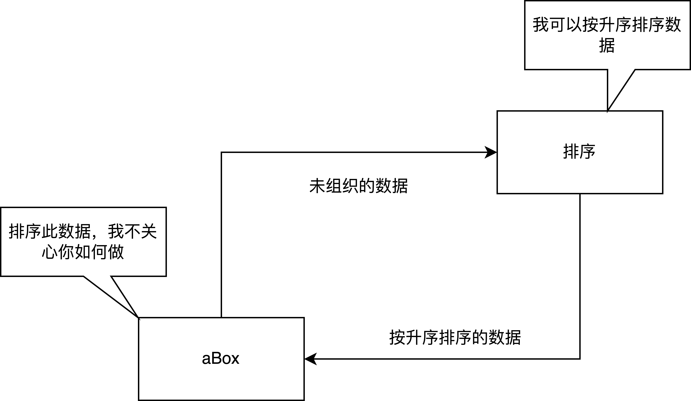

[TOC]
# 第2章 编程原理与软件工程
本章讲一些编程的基本原理，用来应对复杂的大型程序。
## 2.1 问题求解与软件工程
问题求解是指描述问题以及开发计算机程序来解决问题的整个过程，这个过程包含多个阶段，比如：理解待解决的问题，设计概念化的方案、用计算机程序设实现解决方案。
解决方案由算法与数据结构2部分组成，算法是对在有限时间内求解问题的方法的分步描述。
软件生命周期分为9个阶段。这9个阶段都以文档记录为核心。
- 第一阶段 问题描述：软件的目标，问题的所有方面。必须对最初的问题描述进行准确的定义与详细的说明；在编写软件规范时，需要回答的问题有：1.输入什么数据、2.那些数据有效、3.哪些数据无效、4.软件的使用者是谁、5.选择什么什么形式的用户界面、6.要求进行什么错误检测显示什么错误消息、7.有什么假设、8.有特例么、9.选用哪种输出形式、10.需要哪些文档记录、11.未来要对软件进行哪些改进。
- 第二阶段 设计：对规模较大或者复杂度较大的程序，需要分解问题为若干个可以控制的小问题，最终程序会包含多个模块。一个例子：移动图形到一个新的坐标，问题描述如下:
    - f方法接收一个(x,y)坐标
    - 方法将图形移到屏幕的一个新的位置
上述的初始条件与结束条件不够充分，坐标能出现什么样的值，坐标是起始点还是结束点，都没有说明。预定条件需要更详细的说明。
```c
move(x,y)
// moves a shape to coordinate (x,y) on the screen
// Precondition: the calling program provides an (x,y) pair, both integers where 0<=x<=MAX_XCOOR and 0<=y<=MAX_YCOOR where MAX_XCOOR and MAX_YCOOR are class constants that specify the maximum coordinate values
// PostCondition: the shape is moved to the (x,y)
```
编写初始条件：描述方法形参、说明常量、列出假设条件
编写结束方法：描述方法对形参的作用，说明返回值，描述已发生的其他的操作。
准确的文档记录很重要，时间推移与团队扩大，都需要文档。
- 第三阶段：风险分析，影响项目进度成本等，影响软件的生命周期。
- 第四阶段：验证
断言（assertion）是对算法中某处具体条件的描述，初始条件与结束条件是方法开始与结束的断言；
不变式（invariant）是算法中某个位置一个恒为true的条件；
循环不变式（loop invariant）算法中循环前后恒为true的一个条件。
验证算法，就是对算法的每个步骤能够得出步骤前的断言导出步骤后的断言，则步骤正确，一直到结束条件的断言正确，则算法程序正确。
有点类似于几何推理。使用循环不变式来推导迭代算法的正确性。例子，证明代码可以计算出数组前n项的和
```c
int sum = 0;
int j = 0;
while(j < n) {
    sum+=item[j];
    ++j;
}
```
每一次循环执行完，sum都是元素item[0]到item[j-1]的和，这就是一个循环不变式，对于一个循环下列情况不变式恒为true.
1. 初始化步骤之后，循环开始执行之前;
2. 再循环的每次迭代前;
3. 在循环的每次迭代后;
4. 循环终止后.

对于上面的例子有:
```c
int sum = 0;
int j = 0;
// 不变式恒为true
while(j < n) {
    // 不变式恒为true
    sum+=item[j];
    ++j;
    // 不变式恒为true
}
// 不变式恒为true
```
通过观察不变式，可以证明算法是正确的，其实就是数学归纳法。
1. 开始时不变式必为true，开始前，sum=j=0，不变式是sum包含元素item[0]到item[-1]的和，这个范围没有元素，不变式为true
2. 循环的执行必须维持不变式的值，不变式在循环的恩和迭代前为true，迭代后必为true，sum的最后一个元素是item[j-1]，估迭代前与迭代后都是true的。
3. 不变式必须证明算法的正确性，就是结束后不变式为true。结束后，j=n，sum等于元素item[0]到item[n-1]的和，所以算法正确；
4. 循环必须能够终止.

开始时，不变式是true，意味着建立了数学归纳法的基例，类似于对于自然数0，属性是true，正确循环迭代维持值是归纳步骤，类似于对于k，属性为true，则对于k+1，属性是true。结束后得出结论。
- 第五阶段：编码,编码工作不是软件生命周期的主要部分，只是相对次要的工作。
- 第六阶段：测试，使用边角值测试，使用无效的值测试.
- 第七阶段：完善解决方案，通常解决问题的最好的方法就是在解决方案的设计期间做一些简化建设，比如：假设输入是某种格式，而且其内容是正确的，之后基于这些假设开发完整的工作程序，接下来，可向程序天际复杂的输入与输出处理附加的功能与更多的错误检查。这种简化问题的方法使问题解决过程需要加入一个完善步骤。
- 第八阶段：生产,
- 第九阶段：维护

如果解决方案在软件生命周期的所有阶段引发的总成本最低，它就是一个优秀的解决方案。
## 2.2 面向对象设计
解决方案设计中确定对象的2种技术
- 抽象
- 信息隐藏

1. 过程抽象
在设计一个问题解决方案的一部分使用的一个方法时，每个方法最初表示为一个箱子，箱子指出方法做什么，但不说明如何做。每个箱子都不知道其他箱子执行的方式。只知道其他箱子完成什么任务。比如一个方法做排序，只知道可以排序，不知道具体是如何排序的。这样，解决方案的各个组件就彼此分离开来。

过程抽象分离了方法的功能与实现方式，抽象就是描述方法的功能而不实现，着眼于高级功能，不使细节影响到我们。
2. 数据抽象
数据抽象注重操作执行什么任务不考虑如何实现操作；解决方法的其他模块知道它们可以执行哪些操作，但不了解数据存储方式以及操作执行方式；数据抽象是本书的主要内容，抽象的分析数据（考虑对数据执行哪些操作而不是如何执行这些操作），定义抽象数据类型（abstract data type），ADT是指一个数据集合与这个集合上的一组操作。在问题求解的过程中，ADT支持算法，算法不是ADT的组成部分，应协作开发算法与ADT，解决问题的全局算法要给出在数据上执行的操作，操作又给出ADT以及在数据上执行操作的算法。也可能以相反的方向进行。
2种观点：
- 数据结构支持精巧的算法
- 算法支持精巧的数据结构
3. 信息隐藏
抽象过程描述外部接口，对外部隐藏细节，要确保其他模块不能改变本模块的细节；模块的使用者不需要考虑实现细节，模块的实现者不需要考虑其用法。

面向对象的设计方案的开发方式是开发组合了数据与操作的对象，表示现实的实体或者操作过程，这种面向对象的模块化方法生成具有行为的对象的集合。
封装意思就是装箱封闭，是隐藏内部细节的技术，方法封装了操作，对象封装了数据与操作。
设计模块化的解决方案的步骤：
- 标识问题中的对象，一种简单的方法是考虑问题描述中的名词与动词，名词是对象，动词是操作。类型相同的一组对象叫做类。
OOP：
1. 封装：对象组合数据与操作
2. 继承：类可从其他类中继承属性
3. 多态（有多种形式）：对象可以在执行时确定需要什么样的操作，某个对象的输出取决于执行操作的对象。

功能分解（也叫做自上而下的设计）有助于把对象中的复杂任务分解为更便于管理的目的单一的任务与子任务。功能分解的原理为：逐步细化任务以完成任务。下图是解决问题的方法的层次结构

设计问题的求解方案时，一般使用面向对象的设计（OOP）、功能分解（FD）、抽象与信息隐藏技术，下面的设计原则总结了导出模块化解决方案的方法。
- 使用OOD与FD生成模块化解决方案。协作开发抽象数据类型与算法。
- 为主要设计数据的问题使用OOD
- 使用FD为对象的操作设计算法
- 使用FD为强调算法的问题设计解决方案
- 在设计ADT与算法时，侧重做什么而不是如何做
- 考虑将以前编写的软件组件包含到设计方案中。

UML是表达面向对象设计的一种建模语言；提供了图表与文本描述规范，在表示解决方案的整体设计包括类的规范与类彼此交互的各种方式时，图表非常有效。一个解决方案通常会涉及许多类，表示类之间交互能力是UML的长处之一。类图指定了类的名称、数据成员、操作。一个简单的类图

数据成员的UML表示法 visibility  name: type=default value
visibility的值是+=public，-=private，#=protected
操作的UML表示法 visibility name (parameter list):return-type {property-string}
parameter list的语法 direction name: type=default value
面向对象的解决方案更具有普遍性，功能分解会使的比较容易实现，可以继承复用类，减少代码的数量，继承可以随便更改不影响以前的逻辑使用的父类。
## 2.3 关键编程问题
关键的编程问题
- 模块化
- 可修改
- 易用
- 防故障编程
- 风格
- 调试
1. 模块化
面向对象设计就是模块化设计，模块化方便组建大型程序，支持大型程序的调试，并且能够隔离错误；方便修改，消除冗余代码。
2. 可修改性
通过方法与命名常量来提高程序的可修改性
- 方法：将共同的操作提取为方法；
- 命令常量：将共同需要使用的常量提取为命名常量，方便变更。
3. 易用性
- 交互环境程序总应该以意图明确的方式提示用户输入数据;
- 一定要显示输入，方便用户检查数据；
- 输出有明显的标志；
4. 防故障编程
防故障程序是指无论以什么方式使用，它都能合理执行的程序。
- 防止数据输入错误
- 防止程序逻辑错误
5. 风格
- 广泛使用方法，如果一组语句多次重复执行，编写为方法;
- 使用私有数据字段，符合信息隐藏原理;
- 错误处理，检查错误，返回值或者抛出异常;
- 可读性，选择具有描述作用的标识符，通过缩进样式来增强程序的可读性；
- 文档记录，编写良好的文档，方便别人读取、使用】修改，文档的内容
  - 程序的初始注释：作用描述、作者与日期、程序输入与输出的描述、程序用法描述、所需数据类型的假设、异常描述、主要类;
  - 各个类的初始注释，声明类的作用，描述类包含的数据;
  - 各个方法的初始注释，声明方法的作用、初始条件、结束条件和调用的方法;
  - 各个方法体的注释，解释重要功能与微妙的逻辑.
6. 调试，调试埋点需要放在良好的位置，并逐步缩小范围。
- 调试方法，使用监视窗口或者System.out.println();
- 调试循环，开始与结束
- if,else,
- 使用System.out.println();
## 2.4 小结
## 2.6 自我测试题
1. 循环不变式是sum是item[0]到item[index]的和
2. 方法的uml表示法如下：+ sum(in count:int): int
## 2.7 练习题
1. effect：计算输入的美元美分扣除物品总额后的剩余美元或者美分，
    precondition：输入MAX_DOLLORx>0 x>y>0，都是浮点数，表示美元数额。
    postcondition：x-y后剩余的美元金额
2. 
    - Date plusOneDay(Date date)
    - effect desc: 计算给定日期的下一天的日期
    - precondition: Date使一个从0000-00-00开始的有效日期，表示日期
    - postcondition: 在Date的基础上+1
```java
public class Exercise2 {
    /**
     * @param date a specific day
     * @return date+1day
     */
    public LocalDate plusOneDay(final LocalDate date) {
        return date.plusDays(1);
    }
}
```
# 第3章 递归: 镜子
递归是计算机科学家使用的最强大的问题求解技术之一。
## 3.1 递归解决方案
递归是强大的问题求解技术，思想类似于自上而下将复杂的问题分解为更小的问题，而且最特殊的就是小问题与初始问题的类型完全相同。新建递归解决方案时要牢记以下4个问题
- 怎样根据同类型的更小问题来定义问题
- 各个递归调用怎样减小问题的规模
- 什么样的问题实例可以用作基例
- 随着问题规模的减小，最终能否到达基例
### 3.1.1 递归值方法：n的阶乘
箱式跟踪是跟踪递归方法的执行情况的一种系统方法。建立箱式跟踪的步骤
- 在递归方法体中标记各个递归调用，可能包含多个递归调用，使用一个独立的标记
```java
if(n == 0){
    return 1;
}else{
    return n*fact(n-1);
    // A ，递归调用后返回A点
}
```
- 执行中，使用新箱表示各个方法调用，在新箱中指示方法的局部环境;
- 绘制一个箭头，从启动递归过程的语句指向第一个箱;
- 不断生成箱子;
- 与栈一样，不断从箭头向上返回;
递归方法也存在不变式。
### 3.1.2 递归void方法
## 3.2 计数
兔子计数的问题
- 兔子产生不死
- 兔子在出生后2个月性成熟，性成熟在生命的第三个月开始
- 兔子总是雌雄配对而生，产出一对雌雄兔子
构建一个递归的方案来计算rabbit(n), 必须确定如何用rabbit(n-1)来计算rabbit(n)，rabbit(n)=n月开始前的兔子对数(rabbit(n-1))+当月产出的兔子对数，在n月初，并不是所有的的rabbit(n-1)个兔子都成熟了，只有n-2月前出生的兔子才成熟了，于是n月初产出的兔子个数是rabbit(n-2)。于是得到递归的关系是rabbit(n)=rabbit(n-1)+rabbit(n-2)。某些情况下，可以通过解决相同类型的多个更小的问题来解决初始问题。需要注意基例的问题。得到兔子的递归的定义如下:

这正好是一个斐波那契数列，java代码如下:
```java
public static int rabbit(n){
    //Computes a term in the Fibonacci sequence
    //Precondition: n is positive integer
    //PostCondition: Returns the nth Fibonacci number
    if(n<2){
        return 1;
    }else{
        return rabbit(n-1)+rabbit(n-2);
    }
```
组织游行队伍的问题，长为n的游行队伍，乐队不能相邻，有n个彩车与n个乐队，乐队-彩车，彩车-乐队是不同的排列，组织游行队伍的方法数是各排列类型的数目之和.
- P(n) 是组织长为n的排列的方法数
- F(n)是长为n，以彩车结尾的排列方法数；
- B(n)是长为n，以乐队结尾的方法数;
则P(n)=F(n)+B(n).
F(n)=P(n-1),B(n)=F(n-1)=P(n-2)，则可以得到
P(n)=P(n-1)+P(n-2).
得到的公式是：

- 可以通过分解来解决问题;
- 基例值非常重要。
Spock的困惑：访问n颗行星中的k颗，有多少中选择，不考虑访问行星的顺序。基于行星X，得到选择数
c(n,k)=包含行星X的k颗行星的组合数+不包含行星X的k颗行星的组合数
c(n,k)=c(n-1,k-1)+c(n-1,k)
若访问所有的行星那么n=k，则c(k,k)=1, 如果k=0，那么c(n,0)=1,如果k>n,c(n,k)=0，得到的公式是

## 3.3 数组查找
分而治之就是通过分解问题，处理子问题来推进算法。binarySearch方法的代码如下:
```java
public static int binarySearch(int anArray[], int first, int last, int value){
    int index;
    if(first>last){
        index=-1;
    }
    else{
        int mid=(first+last)/2;
        if(value==anArray[mid]){
            index=mid;
        }else if(value<anArray[mid]){
            // POINT X
            index=binarySearch(anArray, first, mid-1, value);
        }else{
            // POINT Y
            index=binarySearch(anArray, mid+1, last, value);
        }
    }
    return index;
}
```
二分查找的不变式是若value出现在数组中，则anArray[first]<=value<=anArray[last]。
统计学家经常需要数据集合的中值，在已排序的集合中，中值位于集合中心，未排序的数据集合中，小于中值与大于中值的值数相同。要递归的解决一个问题，应根据一个或者多个同类型的更小问题编写解决方案，更小的概念确保能够达到基例。但是查找第k个最小项的问题与之前的问题不同，它没办法根据问题的规模决定递归，而是根据元素的值决定的。递归的解决方案如下：
- 在数组中选择枢轴项(pivot item);
- 围绕枢轴项，合理排列数组项;
- 将该策略递归的用于一个数组段.
公式是

下面是伪码解决方案
```java
ksmall(in k:integer, anArray: ArrayType, in first:integer, in last:integer)
// return the kth smallest value in anArray[first...last]
choose a pivot item p fromm anArray[first...last]
partition the items of anArray[first...last] about p
if(k< pivotIndex-first+1)
    return ksmall(k,anArray,first,pivotIndex-1)
else if(k==pivotIndex-first+1)
    return p;
else return ksmall(k-(pivotIndex-first+1),anArray,pivotIndex+1,last);
```
上述问题的关键是如何选择枢轴项p以及围绕所选的p划分数组。这是快速排序的雏形。
## 3.4 组织数据
汉诺塔问题的解决方案
solveTowers(in count:integer, in source:Pole, in destination:Pole, in spare:Pole)
  if(count is 1){
      move a disk directly from source to destination
  }else{
      solveTowers(count-1, source,spare,destination);
      solveTowers(1,source,destination,spare);
      solveTowers(count-1,source,destination,spare);
  }
## 3.5 递归与效率
递归是一种强大的问题解决技术，常用于为最复杂的问题生成清晰的解决方案，易于理解与描述。递归的效率不高的2个因素：
- 与方法调用相关的开销;
- 一些递归算法的内在低效性。
只有问题没有简单的迭代解决方案递归方案才是有价值的。内在低效性与使用的求解方法有关，比如rabbit案例中，很多值被反复计算了很多次。往往迭代解决方法的效率更高，我们通常会首先想到递归方法，可以合理的转换为迭代方案，比如rabbit的迭代方案如下:
```java
public static int iterativeRabbit(int n){
    // iterative solution to the rabbit problem
    // initialize base cases
    int previous = 1;
    int current = 1;
    int next = 1;
    for(int i=3;i<=n;i++){
        next = current + previous;
        previous=current;
        current=next;
    }
    return next;
}
```
如果方法的最后一个操作是单个递归调用，称为尾递归。尾递归方法转换为迭代方式是非常方便的。
## 3.6 小结
- 递归技术通过解决相同类型的，规模更小的问题来解决问题;
- 构建递归解决方案时，需要注意以下4点:
    - 如何用相同类型的规模更小的问题来定义问题;
    - 每次递归调用怎样减少问题的规模;
    - 什么问题实例可以作为基例;
    - 随着问题规模的缩减，最终能到达基例么;
- 在构建递归解决方案时，应该假设：若递归调用的初始条件是true，则其结束条件也为true;
- 可以通过箱式跟踪递归方法的操作;
- 递归方案更容易想出来，并易于理解、描述与实现;
- 递归解决方法可以转换为迭代解决方案;
- 如果可以用迭代方法就用迭代方法.
## 3.7 自测题
# 第4章 墙
数据抽象可以增强程序的模块化.
## 4.1 抽象数据类型
模块化是增强程序可管理性的技术，组件分解、内聚、错误分离等。开发模块化程序，首先关注模块的功能是什么，不考虑其实现，这就是过程抽象。模块必须标明隐藏的信息并且保证这些信息外界无法访问，仅知道功能以及如何使用。通常问题的解决方案需要对数据进行操作，这些操作分为3类:
- 向数据集合添加数据;
- 从数据集合中删除数据;
- 提出与数据集合中的数据相关的问题;
数据抽象只关系可以对集合进行哪些操作，不关心实现；数据集合与针对这些数据的一组操作称为抽象数据类型（ADT）,有些抽象数据类型可以由编程语言直接表示，如果没法直接表示就要设计一个抽象数据类型，并用语言的一些特性实现操作。ADT并不是数据结构的别名，它们不相同: 
- ADT是指数据集合和针对这些数据的一组操作
- 数据结构是编程语言中用于存储数据集合的一种结构。
## 4.2 指定ADT
- 操作抽象;
- adt的设计应该在问题解决过程中逐步得出，下面介绍一个推演ADT的例子
1. 例子：计算给定年份中所有假日的日期，实现方案之一是查日历，以下是伪代码表示
```java
listHolidays(in year: integer)
// display the dates of all holidays in a given year
    date= date of first day of year
    while(date is before the first day of year+1){
        if(date is a holiday){
            write (date is a holiday)
        }
        date=date of next day
    }
```
该问题的数据是由年月日构成的日期，对日期数据的操作抽象有:
- 确定给定年份的第一天的日期
- 确定一个日期是否在另一个日期之前
- 确定一个是否是假日
- 确定指定日期后一天的日期.
可以定义ADT的的操作如下:
- +firstDay(in year:integer):Date {query}//return the date of the frist day of a given year
- +isBefore(in date1:Date, in date2:Date): bool {query}//
- +isHoliday(in date:Date):boolean {query}
- +nextDay(in date:Date):Date {query}
2. 例子: 约见簿，创建呢一个一年期的约见簿，上午8点到下午5点，每次30分钟。存储约见的日期、时间与性质的简单描述。定义一个ADT约见簿，数据项是约见，约见由日期、时间与目的组成，ADT的主要操作是
- 为某天、某时某目的约见
- 取消约见
- 查询给定时间是否有约见
- 确定呢给定时间约见的性质
操作如下:
- +createAppointmentBook()
- +isAppointment(in date:Date, in time:Time): boolean {query}
- +makeAppointment(in date:Date, in time:Time, in purpose: String): boolean
- +cancelAppointment(in date:Date, in time:Time): boolean
- +checkAppointment(in date:Date, in time:Time): String {query}
## 4.3 实现ADT
实现ADT时应该设计一种数据结构来表示ADT的数据，然后按照ADT操作，编写方法来访问数据，使用自上而下的方法设计ADT操作的算法，将每一次更进一步的具体描述看作对其抽象前去的实现形式，只有能使用编程语言的数据结构来表示ADT的数据这种细化过程才停止，编程语言越初级，实现级别越多。使用ADT的程序只能看到作用于数据的墙，数据的数据结构与ADT操作的实现过程都隐藏在墙后。
非面向对象的实现比如c语言，客户代码是可以随便绕过墙的，并没有严格的限制，Java等面向对象的实现因为封装、接口等机制严格限制了这种行为。
OOP编程是组件或者对象的集合，而不是操作序列，封装特性支持ADT的墙规则。
## 4.4 小结
- 数据抽象技术用于控制程序与数据结构间的交互，它在程序的数据结构周围建墙，这类似于其他模块化设计围绕程序算法建墙，使用这样的墙，可以简化程序的设计、实现、读取与修改;
- 一组数据管理操作的规范以及这些操作处理的数据值就是一个ADT;
- 对于ADT的正式数学研究采用公理系统指定ADT操作的行为;
- 只有完整定义ADT后，才能考虑如何实现ADT，为正确选择实现ADT的数据结构，要考虑ADT操作的细节，也要考虑使用操作的具体情况;
- 即使已经选择了用来实现ADT的数据结构，程序的其余部分也不应该依赖这个选择，换言之，只能通过ADT操作访问数据结构，实现过程将隐藏在ADT操作的墙之后，在Java中，未实施墙，将ADT定义为类，对使用ADT的程序隐藏ADT的实现过程;
- 对象封装数据与数据上的操作，在Java中，对象是类的实例，类是编程人员定义的数据类型;
# 第5章 链表
## 5.1 预备知识
数组不适合用来实现ADT列表，主要是由于它是定长的，而且因为物理有序，插入/删除数据需要移动数据，链表是更灵活的数据结构。
使用Java引用的ADT实现方式于数据结构都称为“基于引用”。
使用数组的方式可以使用一种变长数组的方式实现ADT列表，具体的实现方式是，当达到容量限制后，分配一个更大的数组，并复制原来数组的内容到新的数组。具体的代码如下:
```java
if (capacityIncrement == 0){
    capacity *= 2;
}else{
    capacity += capacityIncrement;
}
// now create a new array using the updated capacity value
double[] newArray = new double[capacity];
//copy the contents of the original array to the new array
for (int i = 0;i < myArray.length; i++){
    newArray[i]=myArray[i];
}
// now change th referennce to the original array to the new array
myArray=newArray;
```
java中的Vector于ArrayList都是使用这种方式实现的。
构建链表的节点定义
```java
public class Node<T extends Object> {
    
    private T item;
    
    private Node<T> next;
    
    private Node(final T item, final Node<T> next) {
        this.item = item;
        this.next = next;
    }
    
    public Node(final T item) {
        this(item, null);
    }
    
    public T getItem() {
        return item;
    }
    
    public void setItem(final T item) {
        this.item = item;
    }
    
    public Node<T> getNext() {
        return next;
    }
    
    public void setNext(final Node<T> next) {
        this.next = next;
    }
}
```
链表必须有一个head引用，要不找不到链表的其他节点。不一定基于引用来实现链表，可以使用数组来实现链表。
## 5.2 链表编程
显示链表的数据
```java
    public void display() {
        for (Node<T> curr = head; curr != null; curr = curr.getNext()) {
            System.err.println(curr.getItem());
        }
    }
```
删除链表中的节点涉及到删除中间节点与删除头节点。
```java
    public void delete(final T item) {
        Node<T> prev = null;
        Node<T> curr = head;
        while (curr != null && !Objects.equals(curr.getItem(), item)) {
            prev = curr;
            curr = curr.getNext();
        }
        if (curr != null) {
            if (prev != null) {
                // 中间节点的情况
                prev.setNext(curr.getNext());
            } else {
                //头节点的情况
                head = curr.getNext();
            }
        }
    }
```
按照index删除节点的元素
```java
    public void delete(int index) {
        Node<T> prev = null;
        Node<T> curr = head;
        while (curr != null && index-- > 0) {
            prev = curr;
            curr = curr.getNext();
        }
        if (index <= 0) {
            if (index < 0) {
                head = curr.getNext();
            } else {
                prev.setNext(curr.getNext());
            }
        }
    }
```
删除过程包含3步:
- 定位要删除的节点;
- 通过更改引用，将节点从链表中分离出来;
- 把这个节点返回给系统;

插入过程与删除过程类似，分为3个步骤:
- 确定插入位置;
- 新建一个节点，并在其中存储新数据;
- 通过更改引用，将新节点连接到链表中.
考虑有序表的情况
curr指向第一个大于newValue的节点，prev指向最后一个小与newValue的节点。查询的伪代码如下:
```java
// determine the point of insertion into a sorted linked list
// initialize prev and curr to start the traversal from the beginning of the list
prev=null;
curr=head;
// advance prev and curr as long as nenwValue>the current data item
// Loop invariant: newValue > data items in all
// holds at and before the node that prev references
while(newValue>curr.getItem()){
    prev=curr;
    curr=curr.getNext();
}
```
上述的伪代码中，当newValue大于所有的值时，curr最后一次循环是null，此时抛出空指针异常，修改如下:
```java
// determine the point of insertion into a sorted linked list
// initialize prev and curr to start the traversal from the beginning of the list
prev=null;
curr=head;
// advance prev and curr as long as nenwValue>the current data item
// Loop invariant: newValue > data items in all
// holds at and before the node that prev references
while(curr!=null&&newValue>curr.getItem()){
    prev=curr;
    curr=curr.getNext();
}
newNode.setNext(curr);
prev.setNext(newNode);
//下面的情况是链表头的情况
if(prev==null){
    head=newNode;
}
```
复用之前定义的ADT列表接口
```java
public interface ListInterface<T extends Object & Comparable<T>> {
    // list operations:
    boolean isEmpty();
    
    int size();
    
    void add(int index, T item) throws IndexOutOfBoundsException;
    
    void remove(int index) throws IndexOutOfBoundsException;
    
    T get(int index) throws IndexOutOfBoundsException;
    
    void removeAll();
}
```
基于数组与基于引用的实现的比较
基于数组的缺点：定长需要考虑ADT的最大存储个数，可能会造成空间浪费，采用变长数组也会造成空间浪费，而且复制元素比较耗时;适合列表项比较少的场景，空间浪费不严重，单节点内存少，因为下一个节点通过下标隐式得到，对特定值的访问都是O(1)时间复杂度，插入/删除节点要移动元素
基于引用的优缺点:不受长度限制，不会浪费节点空间，按需分配，访问特点节点O(n)时间复杂度，都要从头开始遍历，插入/删除节点不用移动元素。
递归方法需要头引用作为实参，不能作为类的公有成员。
## 5.3 链表的各种变体
1. 尾引用。
为了方便向链表的末尾新增元素，不需要每次都从头开始遍历，增加一个tail尾引用变量就可以了。
2. 循环链表
tail.next=head就是循环链表，前面都叫做线性链表。适合于循环访问的情况。
3. 虚拟头节点
就是在链表中head指向一个一直存在的头节点，这样，插入与删除的行为就会保持一致，不需要为第一个节点的情况做特殊考虑。
4. 双向链表
就是节点存储前驱与后继，双向链表可以做成循环双向链表。为了避免头尾节点处理的复杂性，双向链表一般都有虚拟头节点。
## 5.4 清单应用程序
## 5.6 小结
- 可以使用引用变量实现链表数据结构
- 链表中的各个引用指向链表中的下一个节点;
- 在链表中插入与删除数据的算法都涉及下列步骤：从头遍历链表，直到适当的位置，执行引用更改，改变链表结构；
- 基于数组的方式使用隐式排序方案;
- 在基于数组的实现中，可直接访问数组中的任何元素，在基于引用的实现中，必须遍历链表才能访问一个特定的节点，数组的访问时间是常量，链表的访问时间取决于节点在链表中的位置;
- 链表可以执行递归操作;
- 使用尾引用，可方便的定位链表尾，若需追加操作，者特别有用;
# 第6章 递归问题求解技术
## 回溯
一种连续猜测的组织化方法，若某种猜测行不通，则撤回，并用另一种猜测替换它，这种反向折回并试探新步骤序列的策略称为回溯（backtracking）。可以与递归操作一起来解决问题。
八皇后问题，8行8列，不能对角线，不能在同一行，同一列。使用回溯的方法解决，伪代码如下:
```java
placeQueue(in currColumn: integer)
// please queens in columns numbered currColumn through 8.
if(currColumn>8){
    the problem is solved
}else{
    while(unconsidered squares exist in currColumn and the problem is unsolved){
        determine the next square in column currColumn that
        is not under attack by a queen in an earlier column
        if( such a square exists){
            place a queen in the square
            placeQueen(currColumn+1);
            if (no queen is possible in column currColumn+1){
                remove queen from column currColumn and consider the next square in that column
            }
        }
    }
}
clear all squares on the board
if(a solution exists){
    display solution
}else{
    display message
}
```
书写的java代码如下
```java
package com.zyx.java.adt.chapter6;

/**
 * @version 1.0
 * @name: zhangyongxiang
 * @author: zhangyongxiang@baidu.com
 * @date 2022/4/21 13:04
 * @description:
 **/

public class Queens {
    // squares per row or column
    private static final int BOARD_SIZE = 8;
    
    // used to indicate an empty square
    private static final int EMPTY = 0;
    
    // used to indicate square contains a queen
    private static final int QUEEN = 1;
    
    private final int[][] board;
    
    private Queens() {
        this.board = new int[BOARD_SIZE][BOARD_SIZE];
    }
    
    /**
     * clears the board
     * Precondition: None
     * Postcondition: Sets all squares to EMPTY
     */
    public void clearBoard() {
        for (int i = 0; i < BOARD_SIZE; i++) {
            for (int j = 0; j < BOARD_SIZE; j++) {
                board[i][j] = EMPTY;
            }
        }
    }
    
    /**
     * Display the board
     * Precondition: None
     * Postcondition: board is written to standard output; zero is an EMPTY
     * square, one is
     * a square containing a queen(QUEEN)
     */
    private void displayBoard() {
        for (int i = 0; i < BOARD_SIZE; i++) {
            for (int j = 0; j < BOARD_SIZE; j++) {
                System.out.print(board[i][j] + "\t");
            }
            System.out.println();
        }
    }
    
    /**
     * Places queens in columns of the board beginning at the column specified
     * Precondition: Queens are placed correctly in columns 1 through column - 1
     * Postcondition: if a solution is found each column of th board contains
     * one queen and method return true;
     * otherwise returns false(no solution exists for a queen anywhere in column
     * specified)
     * 
     * @param column
     * @return
     */
    private boolean placeQueue(final int column) {
        if (column > BOARD_SIZE) {
            return true; // base case
        } else {
            boolean queenPlaced = false;
            int row = 1;
            while (!queenPlaced && row <= BOARD_SIZE) {
                // if square can be attacked
                if (isUnderAttack(row, column)) {
                    ++row; // consider next square in column
                } else {
                    setQueen(row, column);
                    queenPlaced = placeQueue(column + 1);
                    // if no queen is possible in next column
                    if (!queenPlaced) {
                        // backtrack: remove queen placed earlier and try next
                        // square in column
                        removeQueen(row, column);
                        ++row;
                    }
                }
            }
            return queenPlaced;
        }
    }
    
    /**
     * Removes a queen at quare indicated by row and column .
     * Precondition: None
     * Postcondition: Sets the square on the board in given row and column to
     * EMPTY
     * 
     * @param row
     * @param column
     */
    private void removeQueen(final int row, final int column) {
        board[row - 1][column - 1] = EMPTY;
    }
    
    /**
     * Sets a queen at square indicated by row and column.
     * Precondition: None
     * Postcondition: Sets the quare in the board in a given row and column to
     * QUEEN
     *
     * @param row
     * @param column
     */
    private void setQueen(final int row, final int column) {
        board[row - 1][column - 1] = QUEEN;
    }
    
    /**
     * Determines whether the square on the board at a given row and column is
     * under attack by any queens in the column 1 through column-1
     * Precondition: Each column between 1 and column-1 has a queen placed in a
     * square at a specific row.
     * None of thes queens can be attacked by any other queen.
     * Postcondition: If the designated square is under attack, return true,
     * otherwise return false.
     * 
     * @param row
     * @param column
     * @return
     */
    private boolean isUnderAttack(final int row, final int column) {
        final int boardRow = row - 1;
        final int boardColumn = column - 1;
        for (int i = 0; i < boardColumn; i++) {
            if (board[boardRow][i] == QUEEN) {
                return true;
            }
        }
        for (int i = 0; i < boardRow; i++) {
            if (board[i][boardColumn] == QUEEN) {
                return true;
            }
        }
        for (int i = 1; boardRow - i >= 0 && boardColumn - i >= 0; i++) {
            if (board[boardRow - i][boardColumn - i] == QUEEN) {
                return true;
            }
        }
        for (int i = 1; boardColumn - i >= 0
                && boardRow + i < BOARD_SIZE; i++) {
            if (board[boardRow + i][boardColumn - i] == QUEEN) {
                return true;
            }
        }
        return false;
    }
    
    public static void main(final String[] args) {
        final Queens queens = new Queens();
        queens.placeQueue(1);
        queens.displayBoard();
    }
}
```
## 定义语言
语言是字符串的集合，语法正确的Java集合的定义:
> JavaPropgrams = {字符串w: w是语法正确的Java程序}
语言不一定是指编程语言或者用于交流的语言，满足某些语法规则的字符串的集合都叫做语言，语法提出了语言的规则，大多的语法本质上都是递归的，一个好处是语法（确定字符串是否是给定语言）可以使用简洁的递归算法表示。这种算法叫做语言的识别算法。
1. 语法基础知识
- x|y表示x或者y
- xy表示x后接y，或者x·y，·被省略了，表示连接或者追加;
- <word>表示定义确定的word的任何实例
以JavaIds={w: w是一个有效的Java标识符}
有效的Java标识符以字母开头，后接0个或者多个字母或者数字，_或者$也算合法的字符。表示标识符定义的好的方法是使用语法图

或者使用文字语法表示:
> \<identifier>=\<letter>|\<identifier>\<letter>|\<identifier>\<digit>|$\<identifier>|_\<identifier>
\<letter>=a|b|...|z|A|B|...|Z
\<digit>=0|1|...|9

identifier出现在自己的定义中，所以是递归的。要确定给出的字符串w是否是JavaIds语言，识别算法：若w的长度为1且字符是字母，则w属于该语言，这个语句是基例，若w的长度大于1，w的最后一个字符是字母或者数字，且前面的字符是一个标识符，w属于该语言。伪代码如下:
```java
isId(in w:string):boolean
// returns true if w is a legal Java identifier
// otherwise returns false
if(w is of length 1){//base case
    if(w is a letter){
        return true;
    }else{
        return false;
    }
}
else if(th last character of w is a letter or a digit){
    return isId(w minus its last character);
}else{
    return false;
}
```
2. 2种简单语言
回文Palindromes={w:从左向右读与从右向左读相同}
语法的递归定义：
- w是回文
- 去掉第一个与最后一个字符的w是回文,且去掉的字符相同
基例要考虑奇偶数的情况。
回文Palindromes的语法如下:
> \<pal>=empty string|\<ch>|a\<pal>a|b\<pal>b|c\<pal>c|...|z\<pal>z
\<ch>=a|b|...|z|A|B|...|Z
识别算法的伪代码如下:
```java
isPal(in w:string):boolean
// returns true if the string w of letters is a palindrome otherwise returns false;
if(w is the empty string or w is of length 1){
    return true;
}else if(w''s first and last characters are the same letter){
    return isPal(w minus its first and last characters);
}else{
    return false;
}
```
3. 代数表达式
根据操作符所在位置的不同将代数表达式分为前、中、后缀代数表达式，完全加括号的中缀表达式通过合理的将()替换为操作符是非常方便的将中缀表达式转换为前、后缀代数表达式，前缀与后缀表达式的优点：不需要设定优先级规则、关联规则与小括号，语法简单，识别与计算表达式的算法容易编写。定义前缀代数表达式的语法为:
<前缀>=<标识符>|<操作符><前缀><前缀>
<操作符>=+｜-｜*｜/
<标识符>=a|b|...|z
可以看到是递归结构的.首先构建一个递归的值方法endPre(first,last),返回前缀表达式尾自负的索引或者如果不是前缀表达式返回-1，方法的伪代码如下:
```java
endPre(in first:integer, in last: integer)
// finds the end of a prefix expression, if one exists.
// Precondition: the substring of strExp from first through last contains no blank characters。
// Postcondition: Returns the index of the last character in strExp that begins at index first, if one exists,
// or returns -1 if no such prefix expression exists
if(first<0 or first>last){
    return -1;
}
ch=character at position first of strExp
if(ch is an identifier){
    // index of last character in simple prefix expression
    return first;
}else if(ch is an operator){
    // find the end of the first prefix expression
    firstEnd=endPre(first+1,last);
    if(firstEnd>-1){
        return endPre(firstEnd+1,last);
    }else{
        return -1;
    }
}else{
    return -1;
}
```
通过endPre确定isPre的方法的伪代码如下:
```java
isPre()
// Determines whether the string expression in this class is a prefix expression.
// Precondition: the class has a data field strExp that has been initialized with a string expression that contains no blank characters.
// Postcondition: return true if the expression is in prefix form otherwise return false.
size = length of expression strExp
lastChar = endPre(0, size - 1)
if(lastChar>=0 and lastChar == size -1 ){
    return true;
}else{
    return false;
}
```
计算前缀代数表达式的伪代码如下:
```java
evaluatePrefix(in strExp: String): float
// evaluate the prefix exprerssion strExp
// Precondition: strExp is a string consisting of a valid prefix expression containing no blanks.
// Postcondition: returns the value of the prefix expression.
ch - first character of expression strExp
delete first character of expression strExp
if(ch is an identifier){
    // base case - single identifier
    return value of the identifier;
}else{
    operand1=evaluatePrefix(strExp);
    operand2=evaluatePrefix(strExp);
    return operand1 op operand2;
}
```
定义后缀表达式的语法为:
\<后缀>=\<标识符>|\<后缀>\<后缀>\<操作符>
\<操作符>=+|-|*|/
\<标识符>=a|b|...|z
将起前缀表达式转换为后缀表达式的方法的伪代码如下:
```java
convert(in pre: string):string
// Converts a prefix expression pre to postfix form
// Precondition: The expression inn the string pre is a valid prefix expression
// PostCondition: Returns the equivalent postfix expression as a string
//check the first character of the given string
ch = first character of pre
delete first character of pre
if(ch is a lowercase letter){
    // base case - single identifier expression
    return ch as a string
}else{
    // do the conversion resursively
    postfix1=convert(pre)
    postfix2=convert(pre)
    return postfix1+postfix2+ch;
}
```
## 归纳和数学归纳法的关系
递归与数学归纳法之间存在密切关系，通过递归解决问题时，要指定一个或者多个基例的解，然后考虑如何从同类型的更小的问题的解道出任意搭戏哦问题的解。数学归纳法与此类似，通过证明基例（0或1）的属性，然后证明如果对于小与N的自然数，该属性为证真，对于任意自然数N，该属性必为真，从而证明自然数的属性。
经常用归纳来证明递归算法的正确性。
以下伪代码描述的递归算法实现的阶乘
```java
fact(in n:integer):integer
if(n is 0 ){
    return 0;
}else{
    return n*fact(n-1);
}
```
fact会下下列值
>fact(0)=0!=1 n=0
fact(n)=n!=n*(n-1)*...*1 n>0

- 基例：n=0时属性为真
现在要证明对于任意的k，属性为真，则对于k+1，属性为真
- 归纳假设：对于任意数n=k，属性为真即fact(k)=k(k-1)....1
- 归纳结论，对于n=k+1,属性为真，也就是证明fact(k+1)=(k+1)k(k-1)....1
根据fact方法定义，fact(k+1)=(k+1)*fact(k)=(k+1)k(k-1)....1， 证毕
前面介绍过汉诺塔问题的解决方案，基本算法的伪代码如下:
```java
solveTowers(in count:integer, in source:Pole, in destination:Pole, in spare:Pole)
if(count is 1){
    move a disk directly from source to destination
}else{
    solveTowers(count-1, source, spare, destination);
    solveTowers(1, source, destination, spare);
    solveTowers(count-1, spare, destination, source);
}
```
设 moves(N)是N个圆盘的移动次数，当N=1时，moves(N)=1
moves(N)=moves(N-1)+moves(1)+moves(N-1)=2<sup>N</sup>-1，下面根据数学归纳法证明这个公式
- 基例: N=1时 2<sup>1</sup>-1=1，所以属性为真，下面要证明，对于任意的数k，属性为真，那么对于k+1，属性为真。
- 归纳假设: 设对于任意的数N=k，属性为真，即moves(k)=2<sup>k</sup>-1;
- 归纳结论: 说明N=k+1属性为真，必须证明moves(k+1)=2<sup>k+1</sup>-1, 根据moves的递归关系
moves(k+1)=2moves(k)+1=2*(2<sup>k</sup>-1)+1=2<sup>k+1</sup>-1.证毕。
## 小结
- 回溯是一种解决问题的策略，涉及递归及一系列最终导出解的猜测，如果某种猜测行不通，则反向折回，替换猜测，并再次试探完成解决方案;
- 语法是定义语言的工具，语言是一个符号串集合，使用语法定义语言，经常可以构建直接基于语法的识别算法，语法通常都是递归的，因此可以简明扼要的描述大量语言;
- 代数表达式语言存在好几种，各有优劣，前缀与后缀表达式难于使用，但是语法简单，还消除了二义性。中缀表达式易于使用，但是需要括号、关联规则与优先级规则等，语法复杂;
- 数学归纳法与递归有密切的关系，可以用归纳来证明递归算法的正确性。
- 解决递归类问题的2种方案1.数学归纳法与2.循环不变式。
# 第7章 栈
栈具有后进先出的特点，栈与递归存在重要的关系。
## ADT 栈
在设计问题的解决方案时，可推演出用于解决问题的抽象数据类型的规范。
考虑打字场景\<-表示backspace就是退格。
>abcc\<-ddde\<-\<-\<-ef\<-fg

如何读取输入行并获得正确的输入，设计解决方案时，必须涉及到存储输入行的环节，先根据解决方案定义数据存储上的操作，初始的解决方案可能如下:
```java
// read the line, correcting mistake along the way
while(not end of line){
    Read a new character ch
    if(ch is not a '<-'){
        add ch to adt
    }else{
        remove from the adt the item added most recently
    }
}
```
得到ADT应该包含的操作:
- 向ADT添加新项;
- 从ADT中删除最近添加的项;
需要判断当ADT为空时，继续\<-的后果，结果就是什么也不操作,如果要倒叙展示输入的文字，则还要检索数据项
```java
// read the line, correcting mistake along the way
while(not end of line){
    Read a new character ch
    if(ch is not a '<-'){
        add ch to adt
    }else if(ADT is not empty){
        retrieve from adt the item added most recently and put it in ch
        write ch
        remove from the adt the item added most recently
    }else{
        ignore <-
    }
}
```
ADT的操作
- 确定ADT是否为空
- 从ADT中检索最近加入的项
这就是栈，栈包含的主要的操作
- 创建一个空栈
- 确定栈是否为空
- 向栈中加入新项;
- 从栈中删除最近加入的项;
- 从栈中检索最近加入的项;
- 从栈中删除所有项;
栈的伪代码表示
```java
// StackItemType is the type of the items stored in the stack
+createStack()
// create a empty stack
+isEmpty():Boolean {query}
// determines whether a stack is empty
+push(in newItem:StackItemType) throws StackException
// adds newItem to the top of the stack, throws StackException if the insertion is not successful
+pop():StackItemType throws StackException
// retrieves and then removes the top of the stack(the item that was added most recently).
// throws StackException if the deletion is not successful
+popAll()
// removes all items from the stack
+peek():StackItemType throws StackException
// retrieves the top of the stack. that is, peek retrieves the item that was added most recently.
// retrieves dose not change the stack, throws StackException if the retrieval is not successful
```
UML图就忽略了。
## ADT栈的简单应用
1. 检查括号匹配
匹配的条件
- 每遇到一个}都有前面遇到的{匹配;
- 达到字符串结尾时，各个{都有相应的匹配;
伪代码的解决方案如下:
```java
aStack.createStack();
balancedSoFar=true;
i=0;
while(balancedSoFar and i \< length of aString){
    ch=character at position i in aString
    ++i;
    // push an open brace
    if(ch is '{'){
        aStack.push('{');
    }
    // close brace
    else if(ch is '}'){
        if(!aStack.isEmpty()){
            openBrace=aStack.pop();
        }else{
            balancedSoFar=false;
        }
    }
}
if(balancedSoFar and aStack.isEmpty()){
    aString is balanced braces
}else{
    aString dose not have balanced brances;
}
```
更简单的解决方案：跟踪当前未匹配的左大括号的数目。
防故障编程: 
2. 识别语言中的字符串
识别某个字符串是否在下面的语言中
> L={w$w': w是除$外的字符串，w可能为空，w'=reverse(w)}

类似于回文，可以用栈解决下面是伪代码
```java
aStack.createStack();
// push the characters before $, that is the character in w onto the stack
i=0;
ch=character at position i in aString
while(ch is not '$'){
    aStack.push(ch)
    ++i;
    ch=character at position i in aString
}
// skip the $
++i;
// match the reverse of w
inLanguage=true;// assume string is in Language
while(inLanguage and i < length of aString>){
    ch=character at position i in aString
    try{
        stackTop=aStack.pop();
        if(stackTop equals ch){
            ++i;//characters match
        }else{
            // top of stack is not ch
            inLanguage=false;
        }
    }
    catch(StackException e){
        // aStack.pop() failed, aStack is empty(first half of string is shorter than second  half)
        inLanguage=false;
    }
}
if(inLanguage and aStack.isEmpty()){
    aString is in language
}else{
    aString is not in language;
}
```
## ADT栈的实现
定义接口规范
```java
package com.zyx.java.adt.chapter7;
public interface StackInterface<T> {
    /**
     * determines whether the stack is empty.
     * Precondition: None
     * Postcondition: Returns true if the stack is empty otherwise returns
     * false.
     * 
     * @return true or false
     */
    boolean isEmpty();
    
    /**
     * removes all the items from the stack.
     * Precondition: None
     * Postcondition: Stack is empty.
     */
    void popAll();
    
    /**
     * add an item to the top of a stack
     * Precondition: newItem is the item to be added
     * Postcondition: If insertion is successful, newItem is on the top of the
     * stack.
     * Exception: Some implementations may throw Stackexception when newItem
     * cannot be placed on the stack.
     * 
     * @param newItem
     * @throws StackException
     */
    void push(T newItem) throws StackException;
    
    /**
     * remove the top of a stack.
     * Precondition: None.
     * Postcondition: if the stack is not empty, the item that was added most
     * recently is removed from the stack and returned.
     * Exception: Throws StackException if the stack is empty.
     * 
     * @return
     * @throws StackException
     */
    T pop() throws StackException;
    
    /**
     * retrieves the top of a stack.
     * Precondition: none.
     * Postcondition: if the stack is not empty, the item that was added most
     * recently is returned. the stack ias unchanged.
     * Exception: Throws StackException if the stack is empty.
     * 
     * @return
     * @throws StackException
     */
    T peek() throws StackException;
    
}
```
1. 基于数组的实现


