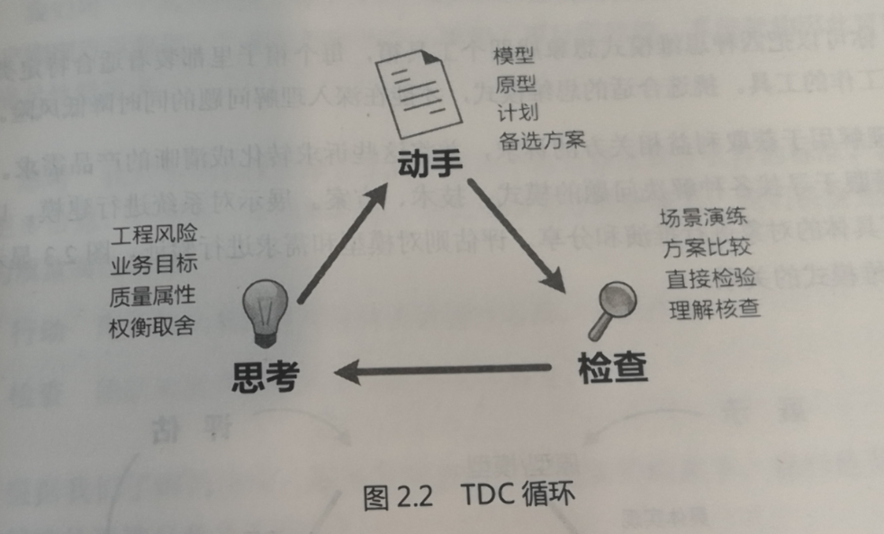

# 第1章 成为软件架构师
## 软件架构师要做什么?
- 从工程角度定义问题，与所有人合作，共同定义软件的需求与目标，要关注软件的质量属性，关注那些影响架构设计方向的约束与特性，定义问题的同时考虑架构;
- 分解系统，分配指责，只有把软件系统分解，才能制作出满足质量属性需求的策略；
- 关注大局，与外围环境和谐共生，纵观全局，不能着眼于细节
- 在质量属性之间做出取舍；
- 管理技术债务;
- 提升团队的机构技能;
## 什么是软件架构
软件架构是关于如何组织软件的一系列重大设计决策的集合，旨在实现期望的质量属性和其他软件特性。设计决策影响所有软件的相关方，也决定软件的属性，好的架构满足需要的软件质量属性，抑制或者消除不需要的质量属性.
软件结构定义了软件系统的组织与协调方式，将2个元素以某种关系链接在一起就成为了结构，元素是软件的基本组成部分，关系则描述了元素如何协作完成任务。元素与关系粉3中，可以用来构建架构:
- 模块(module);
- 组件连接器(component & connector);
- 分配(allocation);
下面的例子:

|种类|示例元素|示例关系|
|:---|:---|:---|
|模块|类、包、层、存储过程、模块、配置文件、数据库表|使用、允许使用、依赖|
|组件连接器|对象、连接、线程、进程、层、过滤器|调用、订阅、管道、发布、返回器|
|分配|服务器、传感器、台式机、负载均衡器、团队、用户、Docker容器|运行于、负责、开发、存储、支付|
- 模块结构存在与设计阶段;
- 组件连接器结构在软件运行时出现，运行时，组件可以创建与其他组件的连接、产生新进程以及实例化新对象;
- 分配展示了模块元素与组件连接器之间以及模块的元素与现实的物理元素之间的协同与响应关系。

模块指的是设计阶段的元素，组件则是软件运行时的概念，不同类型的结构适合用来思考不同的系统特性，模块结构考虑可测试性和可维护性，组件连接器结构考虑运行时问题（如可用性与性能），选择架构的结构实际上就是选择你想在软件系统中提升的质量属性，思考架构设计可以确保你设计的软件呢系统能够支持你关心的质量属性，是质量属性让软件独一无二。
## 成为团队的架构师
对每一个项目回顾:
- 利益相关方是谁？主要业务目标是什么?
- 项目的整体解决方案是什么样的?
- 涉及哪些技术?
- 最大的风险是什么？你是如何克服的？
- 如果有机会重新做一遍项目，你会如何改进?
# 开发出色的软件
- 架构将大问题分解为容易处理的小问题，现代软件系统庞大且复杂，架构精确的解释了如何将系统划分为轻巧、独立的小模块还能确保整个系统协同工作，让系统的价值高于各个部分的价值之和;
- 软件架构告诉大家如何协同工作;
- 软件架构为讨论复杂设计提供了基本词汇;
- 软件架构关注的不仅仅是功能;
- 软件架构让你避免犯重大错误;
- 架构让软件更灵活
# 第2章 设计思维基础
架构设计总是一边摸索要解决的问题，一边探求解决方案。以人为本的设计思维，将注意力放在受设计决策影响的人身上。
## 设计思维的4条原则
设计思维是从他人的角度思考问题及其解决方案的一种方式。有4种设计原则(HERT):
- 以人为本(design for human)，设计本身是围绕人开展的工作，要理解利益攸关方的要求，架构师离不开团队，必须于团队一起设计架构；
- 推迟决策(preserve ambiguity)，设计决策必须准确、清晰，模糊的需求设计会毁掉项目，软件架构的目标是安排系统结构，提升期望的质量属性，极简主义架构只关心高优先级的质量属性，除此之外的设计决策都可以悬置，等时机成熟后再决定，要求尽可能推迟那种一旦决定就难以更改的设计决策，特别是细枝末节的设计决策都可以留到后面。
- 善于借鉴(design is redesign)，研究以往的设计，探索其中的规律，可能同样的问题已经有了解决方案，你可以在其基础上开始自己的设计，设计软件架构之前，应该多花点时间研究已有的设计，而不是凭空创造一个新的出来，忽视前人的经验是最低效的架构设计方法之一;
- 化虚为实(make the architecture tangible)，架构中的结构以代码的形式存在，代码不够直观，不适合用来讨论质量属性、组件、设计原理、决策结果之类的问题。呈现架构的方式很多可以画出来，可以制作原型或者简单的模型，人们只有通过感性的认识才会理解和消化架构。
## 运用思维模式
设计软件系统需要我们从不同的角度考虑架构，设计思维模式可以帮助我们在合适的时机关注合适的细节。四种思维模式
- 理解问题: 弄清楚问题，从所有涉及的人员那里获取信息，从各方的需求与自身的工作中达到平衡;
- 探索想法: 尝试各种结构的组合，找到最能满足要求的组合，最终找到解决问题的工程方法，需要研究大量的模式、技术或者开发方法;
- 展示想法: 制作模型，线框图编写文档、展示数据等;
- 评估适用性: 针对不同的场景审视某一架构，检查决策风险等展开评估.
## 思考、动手、检查

- 迭代学习，每一次迭代都是一个完整的循环，设计没有终点，永远可以持续改进;
- 组合运用思维模式
# 第3章 指定设计策略
- 软件系统充满了不确定性，但是也必须制定计划;
- 架构设计不是一蹴而就，而是持续不断的学习以及实验。
## 找到够用的设计
不是寻找最佳设计而是找到够用的设计，寻找够用设计的方法:
- 将解决方案看成实验;
- 降低设计风险;
- 努力简化问题;
- 快速迭代学习；
- 同时考虑问题与解决方案
## 决定前期做多少架构设计
开发，架构设计，返工是项目工期的3个主要部分，架构设计时间不能太长也不能太短，根据软件复杂度不同，有一个最佳的平衡点，架构设计与返工时间反相关，根据研究:
- 软件系统越大，前期做架构设计的收益就越大，一般37%时间做架构师合理的;
- 软件系统越小，前期做架构设计的收益就越小，一般不超过5%;
- 架构设计做的不够，后期要返工，
软件系统可以按照规模或者复杂度评估工作量，但是一般复杂度更准一些，还要考虑需求波动。
## 用风险做向导
风险可以提醒什么东西可能会造成障碍，按优先级直觉列出可能的问题，选择合适的思维模式降低风险。
风险用条件(当前状况)与后果(可能的问题)描述。降低风险的方式:
- 降低概率;
- 减少影响;
- 减小风险发生的时间窗口;
- 移除条件;
- 接受现状，什么也不做.
软件架构设计师一种降低风险的活动，风险帮助我们决定设计内容，思维模式帮助制定降低风险的策略，风向与思维模式:

|风险|思维模式|
|:---|:---|
|要解决的问题还不确定，对于利益相关方和其他系统参与者，还需要更深入的理解|理解|
|解决方案还不确定，需要充分了解可选的方案|探索|
|利益相关方不完全了解准备实施的方案|展示|
|在设计决策上举棋不定|评估|

架构师需要将技术风险降低到架构不在是系统中的最大风险源，也就是到达恰如其分的状态，此时可以从主动设计转为被动设计:
- 主动设计是主动设法降低架构风险;
- 被动设计是指监控系统运行表现，并采取纠正措施。
架构还可能重新成为风险源，要切换回主动设计模式。
## 制定设计计划
设计计划指出团队在架构设计上分配时间的总体策略，包含的内容:
- 结束设计的条件（前期设计如何开展）
- 必要的设计成果（文档/图等存储）
- 时间节点关键设计工作的时间节点，至少给出对架构设计有重大影响的事件的时间节点(需求审查、设计审查、设计评估)，还有与利益相关方会面的时间节点，在开发工作即将开始或者确定初期工作包含的范围要召集相关会议;
- 重大风险，风险驱动的设计方法;
- 概念架构设计，可以先从可行的解决方案中选择一个，解决方案可以帮助定义问题，只要能表达初步的设计想法就行。
# 第4章 换位思考
搞清楚到底要解决什么的问题。
## 找合适的人交谈
利益攸关方有很多，同样角色的攸关方的人，可能想法也不同，需要攸关方团队确定唯一的想法。
## 创建利益相关方关系图
呈现了与软件系统有关系或者受其影响的人，将关系与互动进行可视化的呈现，展示利益攸关方的动机，并可以确定需要沟通的关键人物
>客户体验架构，通用电气软件架构师，以客户为中心的设计流程，先搞清楚谁是客户，他们想做什么，将系统按照客户的任务进行划分。
第一步: 观察客户在正常情况下如何完成任务，向对方提问确定对客户至关重要的事项包括功能需求与质量属性需求；第二步: 围绕客户的需求设计系统并记录在原型里，原型应尽可能具有交互性，而不仅仅是流程图; 第三步: 尽早语客户一起评审原型，确保对方真正了解新系统的变化以及这些变化对他们的影响; 第四步: 根据客户评审会上的反馈修改调整架构设计。
## 了解业务目标
所有软件系统的开发都是为了满足业务目标，业务目标是利益攸关方希望通过软件系统实现的东西，谈论系统的质量属性、权衡取舍、技术债务都要以业务目标为基础。业务目标是架构的主要驱动因素，描述业务目标就是阐明利益相关方想从软件系统获得什么。
- 记录业务目标，业务目标是可衡量的，有成功的标准。业务目标的描述要包含3个部分
  - 主体，特定的人员或者角色;
  - 结果，可衡量的结果表达利益相关方的需求，会带来哪些变化;
  - 背景，背景信息有助于进一步理解利益相关方的需求;
- 帮助利益相关方描述业务目标，架构师可以用一些模板帮助利益相关方表达需求。
  
# 第5章 挖掘关键架构需求
关键架构需求(architecturally significant requirement, ASR)是显著影响架构中的结构选择的需求，架构师有责任确定对架构有重大影响的需求，ASR分为4类:
- 约束，给定或者选定的不可更改的设计决策;
- 质量属性，外部可见特性，表征系统在特定环境下的运行情况;
- 影响较大的功能需求，架构设计需要特别注意的特性和功能;
- 其他影响因素，时间、知识、经验、技术、办公室政治、你的技术特长等.
## 用约束限制设计选择
约束是外界限定的或者自己选择的不可更改的设计决策，约束可以简化问题，也会增加设计难度，设计决策可能变得越来越像约束，要区分。
## 定义质量属性
质量属性描述了软件系统的外部可见特性和我们对系统运行的期望，也定义了系统执行某些操作时的表现，也称为质量需求下面是常见的质量属性:
|设计属性|运行属性|感知属性|
|:---|:---|:---|
|可修改性|可用性|可管理性|
|可维护性|可靠性|可支持性|
|可复用性|性能|简单性|
|可测试性|可伸缩性|指导性|
|可构建性或者开发时间|安全性||

设计决策就是提升某些质量属性同时牺牲另一些质量属性。关键架构需求主要就是为了确定系统的质量属性，质量属性用于在整个设计过程中指导挑选技术、结构、模式评估设计决策的合理性。功能需求描述系统行为，非功能性需求描述功能需求之外的其他系统需求，有质量需求与约束。设计软件架构必须区分功能、质量属性、约束，因为它们对设计的要求是不同的。质量属性就是非功能性需求。

  

