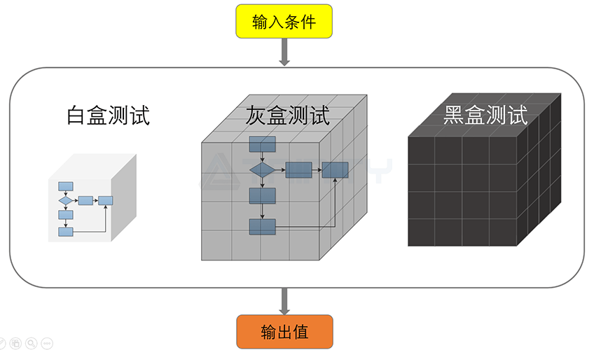

需要通过测试来确定软件符合要求，健壮，安全，易用，有3大类测试方法，具体的不同体现在开展方式、功能用途上。

# 黑盒测试
数据驱动测试、功能测试。软件类似一个黑盒子，不清楚内部的逻辑结构与内部特性，根据需求说明书哦，测试程序的功能。黑盒测试可以帮助识别功能规格中的任何歧义、模糊性和矛盾之处。可以提高功能实现的质量，黑盒测试用于小型软件的测试，大型软件效率低且耗时。
# 白盒测试
对软件内部结构及其背后的逻辑进行分析。称为结构测试或者逻辑驱动测试。通常由专业的开发人员执行。
# 灰盒测试
