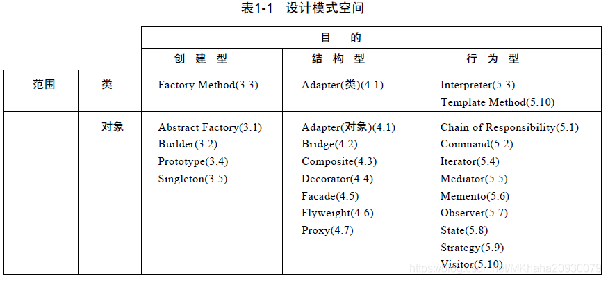
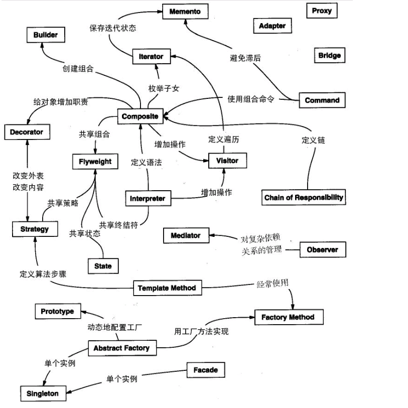

# 1. 引言
设计可复用的面向对象软件比较困难，步骤：
- 找到相关的对象；
- 适当的粒度归类；
- 定义类的接口与继承层次；
- 建立对象之间的基本关系；
设计对手头的问题有针对性，对将来的问题与需求要有足够的通用性；一个设计在最终完成前需要数次修改。
设计模式可以复用成功的设计与体系结构，设计模式可以帮助设计者更快更好的完成系统设计。
## 1.1 什么是设计模式
Christopher Alexander: 每一个模式描述了一个在我们周围不断重复发生的问题以及该问题的解决方案的核心，可以一次又一次的使用方案而不必做重复的劳动。
一个模式的4个要素：
- 模式名：对模式的命名；
- 问题：描述了应该在何时使用模式；
- 解决方案：描述了设计的组成成分，它们之间的相互关系各自的职责与协作方式；
- 效果：描述了模式应用的效果以及使用模式应权衡的问题，对灵活性、扩充性、可移植性的影响。
## 1.2 Smalltalk MVC中的设计模式
MVC（model、view、control）三元组模式，通常用与书写视图界面类的程序；MVC通过建立订阅与通知（观察者模式）机制来分离视图与模型。
## 1.3 描述设计模式
描述的结构
- 模式名与分类；
- 意图：设计模式是做什么的？基本原理与意图是什么？它解决的是什么样的特定设计问题？
- 别名：模式的其他名称；
- 动机：一个简单的情景，说明一个设计问题以及如何用模式中的类、对象来解决该问题；
- 适用性：什么情况下，可以使用该设计模式？
- 结构：才有对象建模技术表示类的关系；
- 参与者：设计模式中的类、对象与它们各自的职责；
- 协作：模式的参与者怎么协作来实现职责；
- 效果：
- 实现：
- 代码实例：
- 已知应用；
- 相关模式：类似的模式的区别。
## 设计模式编目
23种设计模式与意图
- Abstract Factory：提供您一个创建一系列相关或相互依赖对象的接口，而无需指定它们具体的类；
- Adapter: 将一个类的接口转换成客户希望的另外一个接口；
- Bridge：将抽象部分与实现部分分离，使它们都可以独立的变化；
- Builder：将复杂对象的构建与表示分离，使得构建过程可以创建不同的表示；
- Chain of Responsibility：解除请求的发送者与接受者之间的耦合，使多个对象都有机会处理这个请求，将这些对象连成一条链，并沿着这条链传递该请求，直到有一个对象处理它；
- Command：将请求封装为一个对象，从而可以用不同的请求对客户参数化，对请求排队或者记录请求日志，以及支持可取消的操作；
- Compsite：将对象组合成树形结构以表示“部分-整体”的层次结构，使得对单个对象与组合对象的使用具有一致性；
- Decorator：动态的给一个对象添加额外的职责，比生成子类更灵活；
- Facade：为系统中的一组接口提供一个一致的界面，Facade模式定义了一个高层接口，这个接口使得子系统更加容易使用；
- Factory Method：定义一个用于创建对相关的接口，让子类决定将哪个类实例化，使类的实例化延迟到子类中；
- Flyweight：运用共享技术有效的支持大量细粒度的对象；
- Interpreter：给定一个语言，定义它的文法的一种表示，定义一个解释器，该解释器使用该表示来解释语言中的句子；
- Iterator：提供一个方法顺序访问一个聚合对象中的元素，不需要曝漏该对象的内部表示；
- Mediator：用一个中介对象来封装一系列对象的交互，中介者使对象不需要显示的依赖，使其耦合松散，从而可以独立的改变其实现；
- Memento：在不破坏封装性的前提下捕获一个对象的内部状态并保存，对象可以恢复到这个状态；
- Observer：定义对象的一对多的依赖关系，以便当一个对象的状态发生变更时，所有依赖与它的对象都得到通知并自动刷新；
- Prototype：用原型实例指定创建对象的种类，通过拷贝原型来创建新的对象；
- Proxy：为其他对象提供一个代理以控制对对象的访问；
- Singleton：保证一个类仅有一个实例，并提供一个访问它的全局访问点；
- State：允许一个对象在内部状态改变时，修改它的行为，看起来就像变成了一个新的类；
- Strategy：定义一系列的算法，把它们一个个封装起来，使它们可相互替换，使得算法的变化可独立使用它的客户；
- Template Method：定义一个操作红中的算法的骨架，将一些步骤延迟到子类中来，使得子类不改变算法的结构可以重定义算法的某些步骤；
- Visitor：表示一个作用于某对象结构中额各元素的操作，可以在不改变各元素类的情况下，定义作用于这些元素的新操作；
## 组织编目
设计模式在粒度与抽象层次上不同，根据2个准则对设计模式分类，第一是目的准则（模式是用来完成什么工作的），可分为创建型（与对象的创建有关）、结构型（处理类与对象的组合）、行为型（对类与对象怎么交互怎么分配职责）3种；第二是范围准则，指定模式是用于类还是对象；类模式处理类与子类的关系，这些模式通过继承建立，是静态的，在编译器就确定了，对象模式处理对象间的关系，这些关系在运行时是可以变化的，根据动态性。

  创建型类模式将对象的创建工作延迟到子类中，创建型对象模式则讲它延迟到另一个对象中，结构型类模式使用继承机制组合类，结构型对象模式描述了对象的组装方式，行为型类模式使用继承描述算法与控制流，行为型对象模式描述了一组对象怎么协作完成单个对象无法完成的任务，设计模式还有一种组织方式：
  

## 1.6 设计模式怎么解决设计问题
- 寻找合适的对象，面向对象的程序又对象组成，对象包括封装的数据与对外的操作或者方法；面向对象最难的部分是将系统分解成对象集合，面向对象方法学支持许多设计方法：
   - 挑出名词与动词创建类与操作；
   - 系统的协作与职责关系；
   - 现实世界建模；
设计模式可以确定并不明显的抽象和描述这些抽象的对象；
- 决定对象的粒度，设计模式可以决定；
- 指定对象接口，所有对外的操作的集合叫做接口，
- 描述对象的实现